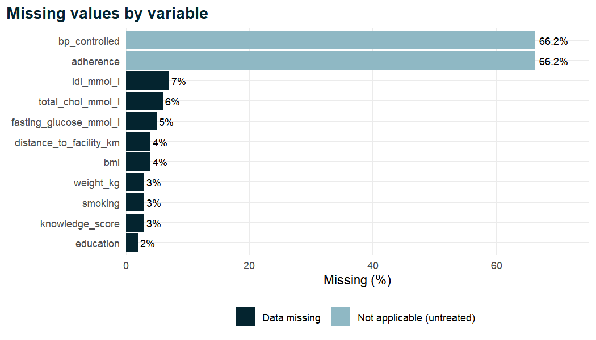
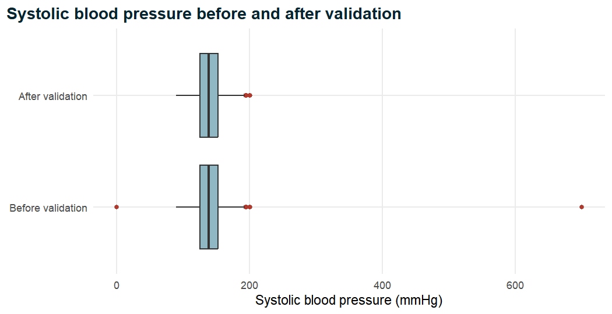
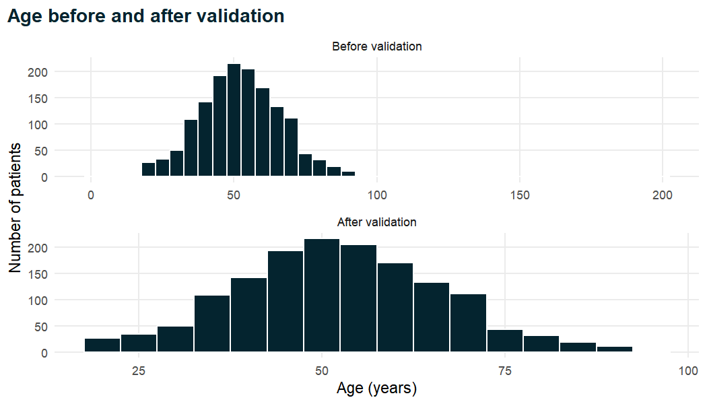
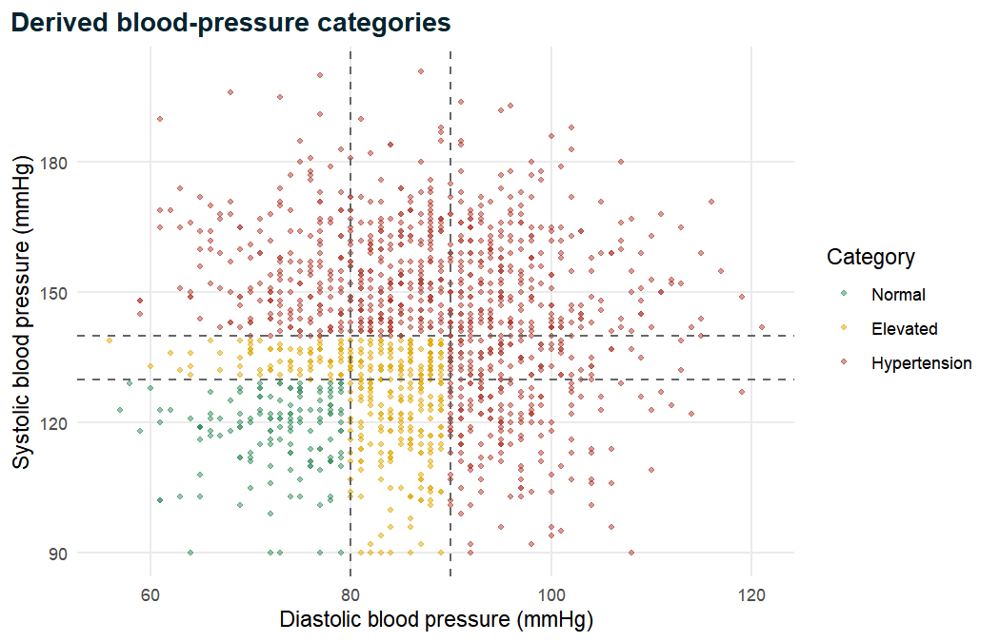
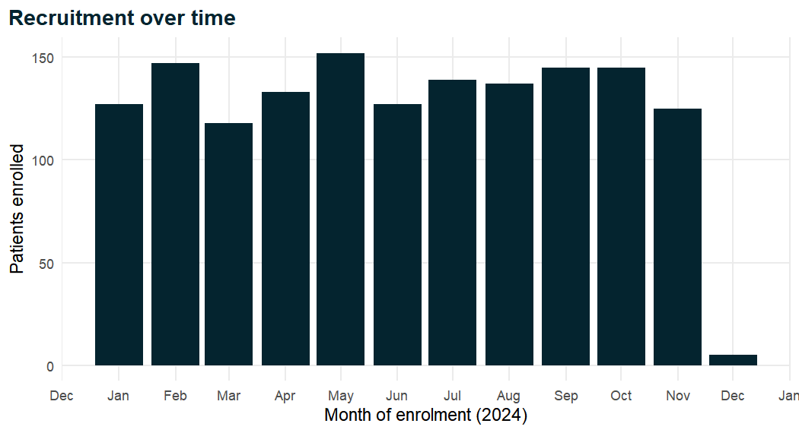

# Understanding and Cleaning Clinical Data {#ch-cleaning}

A clinical dataset arrives on your desk. It has the right number of columns, the
variable names look sensible and the first few rows seem fine. It is tempting to go
straight to the interesting part: the table of baseline characteristics, the
comparison of treated and untreated patients, the regression model. Resist the
temptation. Somewhere in those 1,500 rows there is a systolic blood pressure of 700
mmHg, a patient aged 200 years, a weight of 7 kg recorded for an adult, a diabetes
status coded in six different ways and three patients who appear twice. None of these
problems will stop R from producing a mean, a *p*-value or an odds ratio. All of them
will make those numbers wrong. This chapter is about finding such problems
systematically, deciding what to do about each one, and writing the decisions down as
R code so that the journey from raw file to analysis-ready data is transparent and can
be repeated by anyone, at any time, with exactly the same result. The clean dataset
produced here, `analysis_data`, is the starting point for every remaining chapter of
the book.

::: {.objectives}
- Explain why data cleaning is a scientific step that must be scripted, documented and reproducible, and describe the "cleaning contract" between raw data and analysis-ready data.
- Apply the principles of tidy data and classify clinical variables as continuous, discrete, nominal, ordinal, binary or date, choosing the appropriate R representation for each.
- Import a raw file while declaring missing-value codes explicitly, and demonstrate how undeclared codes such as `-99` and `999` distort summary statistics.
- Distinguish data missing completely at random, missing at random and missing not at random, explain why complete-case analysis can be biased, and produce a missing-data audit table and figure.
- Detect, inspect, remove and report duplicate records.
- Standardise inconsistent categories and stray whitespace with `str_trim()`, `str_to_lower()` and `case_when()`, and write a reusable helper function for Yes/No variables.
- Validate continuous measurements against plausible physiological ranges, set impossible values to missing and count what changed.
- Derive body mass index and clinical categories of BMI and blood pressure, and check derived variables against their definitions.
- Parse dates recorded in mixed formats with `lubridate`.
- Convert categorical variables to factors with deliberate level orders and reference categories, save the clean data and verify that the cleaning pipeline is reproducible.
:::


## Why cleaning matters {#sec-why-cleaning}

### Garbage in, garbage out

Statistical methods take numbers as given. A *t*-test does not know that a systolic
blood pressure of 700 mmHg is physiologically impossible; a logistic regression does
not know that "Y", "yes" and "1" mean the same thing; a frequency table does not know
that two rows describe the same patient. Every method in this book assumes that the
data in front of it are a faithful record of what was measured. When that assumption
fails, the analysis fails silently: the software produces output that looks every bit
as authoritative as the output from clean data. This is the old principle of
computing, *garbage in, garbage out*, and in clinical research its consequences are
not merely embarrassing. A mean blood pressure inflated by a data-entry error can
change the apparent prevalence of uncontrolled hypertension; a misclassified exposure
can hide a real association or create a spurious one; a duplicated patient can make a
rare adverse event look twice as common.

It is often said that data preparation takes most of the time in a real analysis,
with figures such as 50 to 80 per cent commonly quoted. Whatever the exact share,
the experience of most applied statisticians and epidemiologists is that cleaning,
recoding and checking take far longer than fitting models. This is not wasted time.
Cleaning is the stage at which you learn what the variables really mean, how they
were collected, which values are suspicious and which questions the data can and
cannot answer. A careful analyst comes out of the cleaning stage knowing the dataset
intimately, and that knowledge pays off in every later step.

### The cleaning contract

The central idea of this chapter is what we will call the **cleaning contract**. The
contract has three clauses.

1. **The raw data are never edited by hand.** The file that came from the data
   collection system (here, `hypertension_phc_raw.csv`) is treated as read-only. You
   do not open it in a spreadsheet and overwrite the 700 with 170, delete the
   duplicate rows or retype "F" as "Female". Manual edits leave no trace, cannot be
   reviewed and cannot be repeated when a corrected version of the raw file arrives.
2. **Every change is made by code.** A cleaning script reads the raw file and applies
   each correction as an explicit, commented line of R. Anyone who reads the script
   can see exactly what was changed and why; anyone who runs it gets exactly the same
   result.
3. **The output is a single, documented, analysis-ready file.** The script ends by
   saving the clean data (here, `analysis_data.rds`). Every analysis, in every later
   chapter, starts by loading this file and never by repeating or modifying the
   cleaning steps.

This separation of raw data, cleaning code and clean data is a cornerstone of
reproducible research [@peng2011]. It is also the first recommendation of most guides
to good practice in data management. @broman2018 give practical rules for organising
data in spreadsheets so that they can be read reliably by software (one value per
cell, consistent codes, no colour-coding as information, a separate data
dictionary), and @wilson2017 recommend that raw data be saved in their original form,
that cleaning be performed by scripts, and that the cleaned data be stored separately
with a record of how they were produced. Following these principles costs a little
discipline at the start and saves an enormous amount of confusion later.

::: {.callout-tip title="Good practice"}
Keep a folder structure that makes the contract visible: raw files in one place
(never modified), scripts in another, and derived data and outputs in a third. If you
ever find yourself wanting to "just fix one value" in the raw file, write a line of code
instead, with a comment explaining the source of the correction (for example, "value
confirmed with the facility register on 12 March").
:::

### The case-study data and the known problems

We work throughout with the raw file of the case study introduced in the Preface: a
multicentre cross-sectional study of adults attending six primary healthcare
facilities. The data are simulated for teaching, and some problems have been planted
deliberately so that we can practise finding and fixing them. The data dictionary
(`Data/data_dictionary.md`) lists the known problems: missing-value codes (blank,
`NA`, `999`, `-99`), three duplicate records, inconsistent spellings of sex,
mixed codings of Yes/No variables, stray spaces in some text variables, impossible
values of age, blood pressure, height and weight, a supplied BMI that contains errors,
and enrolment dates recorded in three different formats. In real projects you will not
be told the problems in advance; part of the skill is to look for them. We will
therefore treat the dictionary as a check on our own detective work rather than as a
list to be worked through blindly.

The cleaning steps in this chapter are applied in a fixed order, and the order
matters. We import with missing-value codes declared, remove duplicates, standardise
text, validate impossible values, derive new variables from the validated
measurements, parse dates and finally set factor levels. At the end, we check that our
result is identical to the file `Data/analysis_data.rds` that the remaining chapters
use.

## Tidy data and variable types {#sec-tidy-types}

### Tidy data

Before cleaning values, it is worth checking that the *shape* of the data is right.
@wickham2014tidy formalised a simple set of principles, known as **tidy data**, that
describe the layout most statistical software expects:

1. each variable forms a column;
2. each observation forms a row;
3. each type of observational unit forms a table.

In a cross-sectional study such as ours, the observational unit is the patient, so a
tidy dataset has one row per patient and one column per characteristic or
measurement. Many real clinical datasets violate these principles in ways that are
easy to recognise once you know the rules. A spreadsheet with one column per clinic
visit (`sbp_visit1`, `sbp_visit2`, `sbp_visit3`) stores a variable (visit) in the
column names; a column such as `bp` containing "148/96" stores two variables in one
cell; a sheet in which header rows for each facility are interleaved with patient rows
mixes two observational units. Each of these needs reshaping before analysis, using
tools such as `pivot_longer()` and `separate()` that are described in
@wickham2023r4ds.

Our raw file is already tidy in shape: 36 columns, each a single variable, and (once
duplicates are removed) one row per patient. The problems we face are problems of
*values* and *types*, not of layout. That is typical of data exported from an
electronic case report form, and it lets us concentrate on the content.

### Types of clinical variable

Statistical methods depend on the kind of variable being analysed, so the first
question to ask of every column is what sort of quantity it records. The usual
classification is as follows [@kirkwood2003; @altman1991].

- **Continuous** variables can, in principle, take any value in a range: age, blood
  pressure, height, weight, cholesterol. They are summarised with means and standard
  deviations or medians and interquartile ranges, and compared with *t*-tests,
  rank tests or linear regression.
- **Discrete** (count) variables take whole-number values: the number of
  comorbidities, the number of clinic visits in a year. They are numeric, but
  arithmetic on them must respect that "1.6 comorbidities" is an average, not a
  possible patient.
- **Nominal** categorical variables have categories with no natural order: facility,
  occupation, marital status. They are summarised with counts and percentages.
- **Ordinal** categorical variables have categories with a natural order but no
  fixed distance between them: education (none, primary, secondary, tertiary),
  physical activity (low, moderate, high). The order carries information that should
  not be thrown away.
- **Binary** variables are the special case of two categories: diabetes yes or no,
  treatment uptake yes or no. Binary outcomes are the domain of logistic regression
  (Chapter 5).
- **Dates and times** record when something happened: enrolment, diagnosis, death.
  They support arithmetic (time since diagnosis, follow-up time) only if stored as
  dates rather than as text.

R represents each kind of variable with a particular type, and part of cleaning is
making sure each column ends up with the right one. The correspondence for the case
study is summarised in the table below.

Table: Kinds of clinical variable, examples from the case study and their R representation after cleaning.

| Kind | Examples in the case study | R type after cleaning |
|------|----------------------------|-----------------------|
| Continuous | `age`, `sbp_mmhg`, `height_cm`, `total_chol_mmol_l` | numeric (double) |
| Discrete count | `comorbidity_count`, `knowledge_score` | numeric (double) |
| Nominal | `facility`, `occupation`, `marital_status` | factor |
| Ordinal | `education`, `physical_activity`, `bmi_cat` | factor (ordered or with ordered levels) |
| Binary | `diabetes`, `treatment_uptake`, `sex` | factor with two levels |
| Date | `enroll_date` | Date |
| Identifier | `patient_id` | character |

Two features of this table deserve comment. First, the identifier `patient_id` is
stored as text even though it contains digits. Identifiers are labels, not
quantities: it makes no sense to average them, and storing them as numbers would
strip leading zeros (`PHC-0011` is not the same as `11`). Second, binary and
categorical variables become **factors**. A factor stores the set of allowed
categories (its *levels*) together with their order. That order determines how tables
are laid out and, crucially, which category serves as the *reference* in regression
models, a point we return to in Section 2.10.

### What R guesses on import

When `read_csv()` imports a file, it inspects the first rows of each column and
guesses a type. Numbers become doubles, everything else becomes character. Let us see
what it guesses for the raw file, importing it naively, that is, without telling R
anything about the data.


``` r
library(tidyverse)
library(lubridate)

# Naive import: let read_csv() guess everything
raw_naive <- read_csv("Data/hypertension_phc_raw.csv")
dim(raw_naive)
```

```
#> [1] 1503   36
```

``` r
# How many columns of each type did read_csv() choose?
map_chr(raw_naive, \(x) class(x)[1]) |> table()
```

```
#> 
#> character   numeric 
#>        18        18
```

The file has 1,503 rows and 36 columns. Eighteen columns were read as numbers and
eighteen as text. That is a reasonable first guess, but it is not the final answer.
`enroll_date` was read as text because its values are written in several formats.
The Yes/No variables were read as text because they mix words and digits. The
categorical variables are text rather than factors, which is the tidyverse default
and the correct one: we will decide the levels ourselves rather than let R choose
them alphabetically. And the row count tells us something is wrong before we have
looked at a single value: the study enrolled 1,500 patients, not 1,503.

## Importing with explicit missing-value codes {#sec-import-na}

### Sentinel values

Data collection systems and the people who use them have many ways of saying "no
value recorded". A cell can be left blank, filled with the letters `NA`, or filled with
a **sentinel value**: a number that cannot be a real measurement and is used as a
flag, typically `999`, `-99`, `-9` or `9999`. Sentinels were common in older software
that could not store an empty numeric cell, and they survive in many laboratory and
registry systems today.

Sentinels are dangerous because they look like numbers. R will happily include a
cholesterol of `-99` mmol/L in a mean. Let us look at total cholesterol in the naive
import.


``` r
# Total cholesterol as imported naively
summary(raw_naive$total_chol_mmol_l)
```

```
#>    Min. 1st Qu.  Median    Mean 3rd Qu.    Max.     NAs 
#>  -99.00    4.30    5.10    2.59    5.80    8.30      55
```

``` r
# How many values are the sentinel -99?
sum(raw_naive$total_chol_mmol_l == -99, na.rm = TRUE)
```

```
#> [1] 35
```

The minimum of -99 is impossible: a concentration cannot be negative. The naive
summary reports 55 missing values (the blanks and `NA` strings that `read_csv()`
recognises by default), but there are another 35 values coded `-99`, and they drag the
mean far below the median. A summary like this should stop you in your tracks.

Before deciding which codes to treat as missing, it is good practice to scan all
numeric columns for suspicious values, rather than relying on one column at a time.
The next chunk counts, for every numeric column, how many values equal each of the
common sentinels.


``` r
# Count candidate sentinel codes in every numeric column
sentinel_scan <- raw_naive |>
  select(where(is.numeric)) |>
  pivot_longer(everything(), names_to = "variable") |>
  filter(value %in% c(-99, -9, 999, 9999)) |>
  count(variable, value, name = "n")

knitr::kable(sentinel_scan,
             caption = "Sentinel codes in the numeric columns of the raw file.")
```


Table: Sentinel codes in the numeric columns of the raw file.

|variable               | value|  n|
|:----------------------|-----:|--:|
|bmi                    |   999| 22|
|fasting_glucose_mmol_l |   999| 40|
|total_chol_mmol_l      |   -99| 35|

Three variables contain sentinels: the supplied BMI and fasting glucose use `999`,
and total cholesterol uses `-99`. No column uses `-9` or `9999`. The scan also tells us
something reassuring: there is no variable in which `999` could plausibly be a real
value (a creatinine of 999 µmol/L, for example, is possible in severe renal failure,
and would need much more careful handling).

::: {.callout-warning title="Common mistake"}
Declaring a sentinel as missing applies to *every* column of the file. Before adding
`"999"` to the list of missing codes, check that no variable could genuinely take that
value. Creatinine, triglycerides in µmol/L, distances in metres and many laboratory
counts can legitimately exceed 999. If a code is a sentinel in one column and a real
value in another, convert it to `NA` only in the columns where it is a sentinel, for
example with `na_if()` inside `mutate()`.
:::

### Declaring missing codes at import

The cleanest way to deal with sentinels is to declare them when the file is read, using
the `na` argument of `read_csv()`. Any cell whose text exactly matches one of the
strings becomes `NA`.


``` r
# Import, declaring every code that means "missing"
raw <- read_csv(
  "Data/hypertension_phc_raw.csv",
  na = c("", "NA", "999", "-99")   # blank, "NA" and the two sentinels
)
dim(raw)
```

```
#> [1] 1503   36
```

``` r
summary(raw$total_chol_mmol_l)
```

```
#>    Min. 1st Qu.  Median    Mean 3rd Qu.    Max.     NAs 
#>     2.8     4.4     5.1     5.1     5.8     8.3      90
```

Cholesterol now ranges from 2.8 to 8.3 mmol/L, a clinically sensible range, its mean
(5.1) equals its median (5.1), and the 90 missing values are counted honestly
as missing. The comparison below shows the effect of the `na` argument on every
column that has any missing values.


``` r
# Missing values per column: naive import versus declared codes
na_compare <- tibble(
  variable = names(raw),
  na_naive = colSums(is.na(raw_naive)),
  na_declared = colSums(is.na(raw))
) |>
  filter(na_declared > 0) |>
  mutate(gained = na_declared - na_naive)

knitr::kable(na_compare,
             caption = "Missing values before and after declaring codes.")
```


Table: Missing values before and after declaring codes.

|variable                | na_naive| na_declared| gained|
|:-----------------------|--------:|-----------:|------:|
|education               |       30|          30|      0|
|weight_kg               |       45|          45|      0|
|bmi                     |       38|          60|     22|
|smoking                 |       45|          45|      0|
|total_chol_mmol_l       |       55|          90|     35|
|ldl_mmol_l              |      105|         105|      0|
|fasting_glucose_mmol_l  |       35|          75|     40|
|knowledge_score         |       45|          45|      0|
|distance_to_facility_km |       60|          60|      0|
|adherence               |      995|         995|      0|
|bp_controlled           |      995|         995|      0|

Read the table column by column. `na_naive` counts the values that `read_csv()`
already recognised as missing (blanks and the string `NA`); `na_declared` counts the
missing values once the sentinels are added; and `gained` is the difference. Total
cholesterol gains 35 missing values, fasting glucose 40 and the supplied BMI 22: exactly
the sentinel counts found in the scan. Every other column is unchanged. The very large
counts for `adherence` and `bp_controlled` are not sentinels at all; we return to them
in the next section.

::: {.callout-tip title="Good practice"}
The `na` argument matches the *text* in the file. A sentinel written as `-99.0` or
`999.00` would not match `"-99"` or `"999"`. After importing, always run `summary()`
on the numeric columns and look at the minima and maxima: an impossible extreme value
is often an undeclared code.
:::

## Missing data: concepts and an audit {#sec-missing}

Declaring missing values correctly is only the beginning. The harder question is what
missing values *mean* for the analysis. Almost every clinical dataset has missing
data, and the way they are handled can matter as much as the choice of statistical
test.

### Why values are missing: three mechanisms

@rubin1976 introduced a classification of the processes, or **mechanisms**, that
cause data to be missing. It is the foundation of modern thinking about missing data
[@little2019], and every clinical researcher should know it.

- **Missing completely at random (MCAR).** The probability that a value is missing is
  unrelated to any characteristic of the patient, observed or unobserved. A blood
  sample dropped in the laboratory, a page of the form lost in transit, a randomly
  selected subset of patients not offered a test because of a shortage of reagent:
  in each case the patients with missing values are a random subsample of all
  patients. Under MCAR, analysing only the complete records loses precision but does
  not introduce bias.
- **Missing at random (MAR).** The probability that a value is missing depends on
  characteristics that *have been observed*, but not on the missing value itself once
  those characteristics are taken into account. Suppose cholesterol is measured less
  often at one facility because its laboratory is further away, or less often in
  younger patients because clinicians consider them at low risk. Missingness then
  depends on facility or age, both of which are recorded. Within each facility, or
  each age group, the patients with missing cholesterol are like those with observed
  cholesterol. The name is unfortunate: MAR does not mean "random" in the everyday
  sense, it means "random once we account for what we know".
- **Missing not at random (MNAR).** The probability that a value is missing depends
  on the value itself, even after accounting for the observed data. Patients with
  very high blood pressure may be more likely to miss a follow-up visit because they
  feel unwell; people who drink heavily may be more likely to leave the alcohol
  question blank; a laboratory analyser may fail to report glucose values above its
  measurement range. MNAR is the most troublesome mechanism, because the observed
  data cannot, on their own, tell us how the missing values differ.

The mechanism cannot usually be proved from the data. We can show that missingness
depends on observed variables (evidence against MCAR), but we can never show from the
observed data alone that it does not also depend on the unobserved values. Judgements
about MNAR must come from clinical knowledge of how the data were collected.

### Why complete-case analysis can mislead

Most R functions, and most published analyses, deal with missing data by **complete-case
analysis** (also called listwise deletion): any patient with a missing value in any
variable used in the model is dropped. This is what `lm()` and `glm()` do by default,
reporting "observations deleted due to missingness" in their output.

Complete-case analysis has two costs. The first is a loss of precision. If five
covariates each have 5 per cent of values missing, independently, about 23 per cent of
patients may be lost from a model that uses all five, and confidence intervals widen
accordingly. The second cost is potential **bias**. Unless the data are MCAR, the
complete cases are not a random sample of the study population. If cholesterol is
missing more often in rural patients, and rural patients are less likely to take
treatment, then an analysis restricted to patients with a cholesterol result
over-represents urban patients and may give a misleading picture of treatment uptake.
The direction and size of the bias depend on the mechanism and on the analysis, and in
some situations complete-case analysis is unbiased even when data are not MCAR (for
example, in regression when missingness depends only on the covariates) [@little2019].
The important point is that it is an assumption, not a neutral default.

### Multiple imputation: a glimpse ahead

When missing data are substantial and plausibly MAR, the recommended approach is often
**multiple imputation** [@rubin1976; @little2019]. Instead of deleting incomplete
records, each missing value is replaced by a value drawn from a model that predicts it
from the other variables. This is done several times (say 20), producing several
complete datasets that differ only in the imputed values. The analysis is performed on
each dataset and the results are combined using rules that reflect both the
within-dataset uncertainty and the extra uncertainty caused by not knowing the missing
values. In R, the `mice` package implements multiple imputation by chained equations
[@vanbuuren2011]. Multiple imputation is powerful but not magic: it depends on a good
imputation model, on the MAR assumption, and on careful reporting. @sterne2009
describe the most common pitfalls and give guidance on reporting. It is beyond the
scope of this introductory book, but you should know that it exists and recognise when
your analysis may need it.

::: {.callout-warning title="Common mistake"}
Do not replace missing values with the mean, with zero or with "normal" values before
analysis. Single mean imputation makes the data look more complete and less variable
than they are, understates standard errors and can bias associations. Leave missing
values as `NA` during cleaning, and make a deliberate, documented decision about how to
handle them at the analysis stage.
:::

### A missing-data audit

The first practical step is an **audit**: a table showing, for every variable, how many
values are missing and what percentage that represents. We write it once as a small
function so that we can reuse it at the end of the chapter on the clean data.


``` r
# Count and percentage of missing values in every column
missing_audit <- function(data) {
  tibble(
    variable  = names(data),
    n_missing = colSums(is.na(data)),
    pct       = round(100 * n_missing / nrow(data), 1)
  ) |>
    arrange(desc(n_missing))
}

audit_raw <- missing_audit(raw)
audit_raw |>
  filter(n_missing > 0) |>
  knitr::kable(caption = "Missing values in the raw data (codes declared).")
```


Table: Missing values in the raw data (codes declared).

|variable                | n_missing|  pct|
|:-----------------------|---------:|----:|
|adherence               |       995| 66.2|
|bp_controlled           |       995| 66.2|
|ldl_mmol_l              |       105|  7.0|
|total_chol_mmol_l       |        90|  6.0|
|fasting_glucose_mmol_l  |        75|  5.0|
|bmi                     |        60|  4.0|
|distance_to_facility_km |        60|  4.0|
|weight_kg               |        45|  3.0|
|smoking                 |        45|  3.0|
|knowledge_score         |        45|  3.0|
|education               |        30|  2.0|

Eleven of the 36 columns have missing values. Two stand out: `adherence` and
`bp_controlled` are missing for 995 of 1,503 records (66 per cent). Before panicking,
check the data dictionary: adherence and blood-pressure control are only defined for
patients who are *on treatment*. A patient who does not take antihypertensive
medication cannot be adherent or non-adherent to it. These values are **structurally
missing**, or "not applicable", and are not a data-quality problem at all. We verify
this formally at the end of the chapter.

The remaining variables have between 2 and 7 per cent missing. The laboratory values
(LDL, total cholesterol, fasting glucose) have the most, which is typical: blood tests
require a sample, a working laboratory and a result that finds its way back into the
record. A figure makes the pattern easier to see.


``` r
audit_raw |>
  filter(n_missing > 0) |>
  mutate(
    type = if_else(variable %in% c("adherence", "bp_controlled"),
                   "Not applicable (untreated)", "Data missing"),
    variable = fct_reorder(variable, pct)
  ) |>
  ggplot(aes(x = pct, y = variable, fill = type)) +
  geom_col() +
  geom_text(aes(label = paste0(pct, "%")), hjust = -0.15, size = 3) +
  scale_fill_manual(values = c("#04242F", "#8FB8C4")) +
  scale_x_continuous(limits = c(0, 75), expand = c(0, 0)) +
  labs(x = "Missing (%)", y = NULL, fill = NULL,
       title = "Missing values by variable") +
  theme(legend.position = "bottom")
```



### Exploring the mechanism

We cannot prove a missingness mechanism, but we can look for evidence against MCAR by
asking whether missingness is related to observed characteristics. The next chunk
compares the percentage of missing laboratory values across facilities.


``` r
# Percentage missing for three laboratory values, by facility
raw |>
  mutate(facility = str_trim(facility)) |>
  group_by(facility) |>
  summarise(
    n = n(),
    chol_pct = round(100 * mean(is.na(total_chol_mmol_l)), 1),
    ldl_pct = round(100 * mean(is.na(ldl_mmol_l)), 1),
    gluc_pct = round(100 * mean(is.na(fasting_glucose_mmol_l)), 1)
  ) |>
  knitr::kable(caption = "Percentage of missing laboratory values by facility.")
```


Table: Percentage of missing laboratory values by facility.

|facility      |   n| chol_pct| ldl_pct| gluc_pct|
|:-------------|---:|--------:|-------:|--------:|
|Bugando PHC   | 337|      5.6|     5.6|      5.3|
|Buzuruga PHC  | 175|      4.6|     7.4|      7.4|
|Igoma HC      | 175|      6.3|     6.9|      6.3|
|Ilemela HC    | 283|      5.3|     7.8|      3.2|
|Kisesa HC     | 228|      9.2|     7.0|      3.9|
|Nyamagana PHC | 305|      5.2|     7.5|      4.9|

The percentages vary somewhat from facility to facility, but with 175 to 337 patients
per facility, differences of a few percentage points are what chance alone produces.
There is no facility where the laboratory results are systematically absent. In a
real study, a facility with, say, 30 per cent missing cholesterol would prompt a
conversation with the field team: was the laboratory closed for a month, or were the
forms filled in differently? Such a pattern would suggest that missingness is MAR
(dependent on facility) and that facility should be included in any analysis or
imputation model that uses cholesterol.

::: {.callout-note title="Clinical interpretation"}
Ask *why* each value is missing before deciding what to do. A missing glucose result
because the analyser was broken (MCAR), because only patients with symptoms were
tested (MAR, if symptoms are recorded) and because very high values were not reported
(MNAR) call for very different handling. The people who collected the data usually
know the answer; ask them. Because these data are simulated, the patterns here
illustrate the methods, not real clinical findings.
:::

## Duplicate records {#sec-duplicates}

### Where duplicates come from

A **duplicate** is a record that appears more than once for what should be a single
observational unit. In clinical data, duplicates arise when a form is entered twice
(once by each of two data clerks, or once before and once after a correction), when
files from two sources are combined and overlap, or when an export is run twice and
appended. Duplicates inflate the sample size, give some patients double weight, and
make standard errors too small. If the duplicated patients differ systematically
from the rest (for example, if forms with problems were more likely to be re-entered),
they can also introduce bias.

There are two kinds of duplicate to look for. **Exact duplicates** are rows identical
in every column; they are almost certainly the same record entered twice and can be
removed safely. **Key duplicates** share the same identifier but differ in some
columns; they may be a re-entered record with a correction, two visits by the same
patient, or two different patients given the same ID by mistake. Key duplicates need
investigation, not automatic deletion.

### Detecting duplicates

We start by comparing the number of rows with the number of distinct patient IDs, and
then list the IDs that appear more than once.


``` r
nrow(raw)                         # number of rows
```

```
#> [1] 1503
```

``` r
n_distinct(raw$patient_id)        # number of distinct patients
```

```
#> [1] 1500
```

``` r
# Which IDs appear more than once?
raw |>
  count(patient_id) |>
  filter(n > 1)
```

```
#> # A tibble: 3 × 2
#>   patient_id     n
#>   <chr>      <int>
#> 1 PHC-0011       2
#> 2 PHC-0251       2
#> 3 PHC-0881       2
```

There are 1,503 rows but only 1,500 distinct patient IDs, and three IDs (`PHC-0011`,
`PHC-0251` and `PHC-0881`) each appear twice. Next we ask whether these are exact
duplicates.


``` r
# Number of rows identical to an earlier row in every column
sum(duplicated(raw))
```

```
#> [1] 3
```

`duplicated()` marks each row that is identical to a row that appeared earlier, so the
sum, 3, is the number of surplus copies. Because the number of exact duplicates equals
the number of surplus IDs, every repeated ID is an exact copy of another row: there
are no conflicting key duplicates to investigate. It is still worth looking at the
duplicated records before removing them.


``` r
# Show the duplicated records side by side (first few columns)
raw |>
  filter(patient_id %in% c("PHC-0011", "PHC-0251", "PHC-0881")) |>
  arrange(patient_id) |>
  select(patient_id, facility, enroll_date, age, sex, sbp_mmhg)
```

```
#> # A tibble: 6 × 6
#>   patient_id facility    enroll_date   age sex    sbp_mmhg
#>   <chr>      <chr>       <chr>       <dbl> <chr>     <dbl>
#> 1 PHC-0011   Ilemela HC  2024-12-01     51 Male        128
#> 2 PHC-0011   Ilemela HC  2024-12-01     51 Male        128
#> 3 PHC-0251   Bugando PHC 2024-01-28     51 Female      131
#> 4 PHC-0251   Bugando PHC 2024-01-28     51 Female      131
#> 5 PHC-0881   Kisesa HC   2024-02-25     45 Female      140
#> 6 PHC-0881   Kisesa HC   2024-02-25     45 Female      140
```

Each pair is identical, as expected. The `janitor` package provides `get_dupes()`,
which produces the same listing in one call with a count column added, and is a
convenient alternative for larger files.

### Removing duplicates and checking the result

`distinct()` keeps the first occurrence of each unique row and drops the rest.


``` r
n_before <- nrow(raw)
raw <- distinct(raw)              # drop exact duplicate rows
n_after <- nrow(raw)

c(before = n_before, after = n_after, removed = n_before - n_after)
```

```
#>  before   after removed 
#>    1503    1500       3
```

``` r
# Every row should now be a different patient
n_distinct(raw$patient_id) == nrow(raw)
```

```
#> [1] TRUE
```

Three rows were removed and 1,500 remain, one per patient. The final line is a simple
but powerful check: it returns `TRUE` only if the patient ID is now a unique key.

::: {.callout-tip title="Good practice"}
Always report duplicates. A sentence such as "Three records were exact duplicates of
other records and were removed, leaving 1,500 participants" belongs in the methods
section or in a flow diagram, as recommended by the STROBE guidelines for observational
studies [@vonelm2007]. If you find key duplicates with conflicting values, do not
choose one at random: return to the source documents, and record which version was
kept and why.
:::

## Inconsistent categories and whitespace {#sec-categories}

Categorical variables are where human data entry shows most clearly. Different
clerks, different forms and different software versions produce different spellings
of the same category: "Female", "female", "F" and "f"; "Yes", "Y" and "1". To a human
reader they are obviously equivalent. To R they are different strings, and a frequency
table or regression model will treat them as different categories.

### Whitespace

The least visible problem is **whitespace**: spaces before or after a value, as in
`" Rural "`. They are invisible in most printouts, but `" Rural "` is not equal to
`"Rural"`. The data dictionary warns that some values of `facility`, `residence`,
`education` and `occupation` have stray spaces. Yet the frequency table of `facility`
in our imported data looks clean.


``` r
table(raw$facility)
```

```
#> 
#>   Bugando PHC  Buzuruga PHC      Igoma HC    Ilemela HC     Kisesa HC 
#>           336           175           175           282           227 
#> Nyamagana PHC 
#>           305
```

The reason is that `read_csv()` trims leading and trailing whitespace by default (its
argument `trim_ws = TRUE`). We can reveal the problem by importing with trimming
switched off.


``` r
# Re-import WITHOUT trimming, only to see the hidden spaces
raw_untrimmed <- read_csv("Data/hypertension_phc_raw.csv",
                          na = c("", "NA", "999", "-99"),
                          trim_ws = FALSE)

# Number of values with leading or trailing spaces, per text column
raw_untrimmed |>
  select(facility, residence, education, occupation) |>
  summarise(across(everything(), \(x) sum(x != str_trim(x), na.rm = TRUE)))
```

```
#> # A tibble: 1 × 4
#>   facility residence education occupation
#>      <int>     <int>     <int>      <int>
#> 1      108       143       117        109
```

``` r
# What R sees without trimming
table(raw_untrimmed$residence)
```

```
#> 
#>  Rural   Urban    Rural   Urban 
#>      68      75     636     724
```

Without trimming, `residence` has four categories instead of two, and 108 to 143
values in each of the four variables carry hidden spaces. Many import routes, including
copying data from another R object, reading from a database or reading some text
formats, do not trim automatically. We therefore apply `str_trim()` to every text
column explicitly. It costs nothing when the data are already clean and protects the
pipeline if the import route ever changes.


``` r
# Remove leading/trailing spaces from every character column
raw <- raw |>
  mutate(across(where(is.character), str_trim))
```

`across(where(is.character), str_trim)` reads as "for every column that is character,
replace it with its trimmed version". It is the first of several uses of `across()` in
this chapter: it lets one line of code do the same job on many columns.

### Inconsistent spellings: sex

Now we tabulate `sex`, asking `table()` to show missing values too.


``` r
table(raw$sex, useNA = "ifany")
```

```
#> 
#>      f      F female Female      m      M   male   Male 
#>     74     73     68    670     40     39     42    494
```

There are eight spellings of two categories: full words in title case and lower case,
and single letters in upper and lower case. The fix has two parts. First we convert the
text to lower case with `str_to_lower()`, which collapses "Female", "female" into
"female" and "F", "f" into "f". Then `case_when()` maps each group of spellings to a
single clean label. `case_when()` evaluates its conditions from top to bottom and
returns the value of the first condition that is true; the final `TRUE ~` line is a
catch-all for anything not recognised.


``` r
sex_before <- raw$sex             # keep a copy to check the recoding

raw <- raw |>
  mutate(sex = case_when(
    str_to_lower(sex) %in% c("female", "f") ~ "Female",
    str_to_lower(sex) %in% c("male", "m")   ~ "Male",
    TRUE ~ NA_character_          # anything unrecognised becomes missing
  ))

table(raw$sex, useNA = "ifany")
```

```
#> 
#> Female   Male 
#>    885    615
```

There are now 885 women and 615 men, with no missing values. The catch-all produced no
`NA`s, which tells us that every original value was recognised. A recoding should
always be checked by cross-tabulating the old values against the new.


``` r
table(before = sex_before, after = raw$sex, useNA = "ifany")
```

```
#>         after
#> before   Female Male
#>   f          74    0
#>   F          73    0
#>   female     68    0
#>   Female    670    0
#>   m           0   40
#>   M           0   39
#>   male        0   42
#>   Male        0  494
```

Each original spelling maps to exactly one clean category, and nothing has been lost.
This cross-tabulation is the best protection against a typo in a recoding rule (for
example, writing `"femle"`), which would otherwise silently turn valid values into
missing.

::: {.callout-warning title="Common mistake"}
Ending `case_when()` with `TRUE ~ sex` (keep the original value) instead of
`TRUE ~ NA_character_` hides problems: an unexpected spelling such as `"FM"` would
pass through unchanged and appear as a third category in later tables. Mapping
unrecognised values to `NA` and then checking that no new `NA`s appeared makes
surprises visible.
:::

### A reusable helper for Yes/No variables

Five variables (`diabetes`, `family_history_htn`, `health_insurance`, `htn_diagnosed`
and `treatment_uptake`) mix three codings of the same binary information.


``` r
table(raw$diabetes, useNA = "ifany")
```

```
#> 
#>    0    1    N   No    Y  Yes 
#>  229    7  143 1093    4   24
```

``` r
table(raw$treatment_uptake, useNA = "ifany")
```

```
#> 
#>   0   1   N  No   Y Yes 
#> 134  79  95 763  52 377
```

Diabetes is recorded as `0`/`1`, `N`/`Y` and `No`/`Yes`. Note that `read_csv()` read
these columns as character because the words and the digits are mixed; had a column
contained only `0` and `1` it would have been read as a number, which is another reason
to convert values with `as.character()` before comparing them with text.

Rather than writing the same `case_when()` five times, we write a small **function**.
Functions are the natural way to apply the same logic consistently: if the rule ever
needs to change (say, a new code `"U"` for unknown appears), it changes in one place.


``` r
# Standardise any Yes/No coding to "Yes", "No" or NA
to_yesno <- function(x) {
  x <- str_to_lower(str_trim(as.character(x)))   # text, no spaces, lower case
  case_when(
    x %in% c("yes", "y", "1", "true")  ~ "Yes",
    x %in% c("no",  "n", "0", "false") ~ "No",
    TRUE ~ NA_character_                         # anything else -> missing
  )
}

# Test the helper on a small vector before using it on the data
to_yesno(c("Yes", " y", "1", "No", "N", "0", "TRUE", "maybe", NA))
```

```
#> [1] "Yes" "Yes" "Yes" "No"  "No"  "No"  "Yes" NA    NA
```

Testing a helper on a small, hand-made vector that includes awkward cases (a leading
space, a logical-looking value, an unexpected word, a missing value) is a habit worth
forming. The output is exactly as intended: four forms of yes, three of no, and `NA`
for the unrecognised word and the missing value. Now we apply it to all five columns at
once with `across()`.


``` r
binary_vars <- c("diabetes", "family_history_htn", "health_insurance",
                 "htn_diagnosed", "treatment_uptake")
binary_before <- raw |> select(all_of(binary_vars))   # copy for checking

raw <- raw |>
  mutate(across(all_of(binary_vars), to_yesno))

# Counts of each clean value in each binary variable
raw |>
  select(all_of(binary_vars)) |>
  pivot_longer(everything(), names_to = "variable") |>
  count(variable, value) |>
  pivot_wider(names_from = value, values_from = n, values_fill = 0) |>
  knitr::kable(caption = "Binary variables after standardisation.")
```


Table: Binary variables after standardisation.

|variable           |   No|  Yes|
|:------------------|----:|----:|
|diabetes           | 1465|   35|
|family_history_htn |  940|  560|
|health_insurance   |  988|  512|
|htn_diagnosed      |  411| 1089|
|treatment_uptake   |  992|  508|

Every binary variable now has only the values "No" and "Yes", and there is no `NA`
column in the table, so every original code was recognised. Among the 1,500 patients,
1,089 have been diagnosed with hypertension and 508 are taking antihypertensive
treatment. As a check on the mapping, the cross-tabulation for treatment uptake
confirms that each original code went to the right place.


``` r
table(before = binary_before$treatment_uptake,
      after = raw$treatment_uptake)
```

```
#>       after
#> before  No Yes
#>    0   134   0
#>    1     0  79
#>    N    95   0
#>    No  763   0
#>    Y     0  52
#>    Yes   0 377
```

::: {.callout-tip title="Good practice"}
The `forcats` package (part of the tidyverse) offers `fct_recode()` and
`fct_collapse()` for recoding factor levels, for example
`fct_collapse(sex, Female = c("F", "f", "female", "Female"))`. They are convenient
when the full list of spellings is known in advance. `case_when()` with
`str_to_lower()` is more robust to spellings you did not anticipate, because it
normalises the text before comparing it.
:::

## Validating impossible values {#sec-validation}

### Plausible ranges

After missing codes and spellings, the next class of problem is values that are
recorded as numbers but cannot be true. Some are obvious typing errors: a systolic
blood pressure of 700 is probably 170 with a slipped digit, a height of 17 cm is
probably 170 cm with a dropped zero. Others are placeholders (age 0 for "unknown") or
unit confusion (weight in pounds in a column meant for kilograms).

The standard approach is to define, for each continuous variable, a **plausible
range** based on physiology and on the study's eligibility criteria, and to flag every
value outside it. The ranges should be wide enough to keep genuine extreme values
(severe hypertension, very tall or very thin patients are real and clinically
important) and narrow enough to exclude values that cannot be true. Ideally they are
written into the study's data management plan before the data are seen. The ranges
used for the case study are shown below.

Table: Plausible ranges used to validate continuous measurements in adult primary-care patients.

| Variable | Lower limit | Upper limit | Rationale |
|----------|-------------|-------------|-----------|
| `age` (years) | 18 | 110 | Adults only (eligibility); oldest plausible age |
| `sbp_mmhg` (mmHg) | 70 | 260 | Below 70 is shock; above 260 almost never recorded |
| `dbp_mmhg` (mmHg) | 40 | 150 | Physiological limits for a seated adult |
| `height_cm` (cm) | 120 | 210 | Range of adult stature |
| `weight_kg` (kg) | 30 | 200 | Range of adult body weight in this population |

These limits are judgements, and reasonable people might choose slightly different
ones. What matters is that they are explicit, justified and applied by code, so that a
reader can see them and a reviewer can ask for a sensitivity analysis with different
limits.

### Finding the offending values

Before changing anything, we count how many values fall outside each range and look at
them.


``` r
# Count values outside each plausible range (NA values are not counted)
raw |>
  summarise(
    age    = sum(age < 18 | age > 110, na.rm = TRUE),
    sbp    = sum(sbp_mmhg < 70 | sbp_mmhg > 260, na.rm = TRUE),
    dbp    = sum(dbp_mmhg < 40 | dbp_mmhg > 150, na.rm = TRUE),
    height = sum(height_cm < 120 | height_cm > 210, na.rm = TRUE),
    weight = sum(weight_kg < 30 | weight_kg > 200, na.rm = TRUE)
  )
```

```
#> # A tibble: 1 × 5
#>     age   sbp   dbp height weight
#>   <int> <int> <int>  <int>  <int>
#> 1     2     2     1      1      1
```

``` r
# The records concerned
raw |>
  filter(age < 18 | age > 110 | sbp_mmhg < 70 | sbp_mmhg > 260 |
           dbp_mmhg < 40 | dbp_mmhg > 150 | height_cm < 120 |
           height_cm > 210 | weight_kg < 30 | weight_kg > 200) |>
  select(patient_id, age, sbp_mmhg, dbp_mmhg, height_cm, weight_kg)
```

```
#> # A tibble: 7 × 6
#>   patient_id   age sbp_mmhg dbp_mmhg height_cm weight_kg
#>   <chr>      <dbl>    <dbl>    <dbl>     <dbl>     <dbl>
#> 1 PHC-0174     200      130       83     154.4      77.9
#> 2 PHC-0689      34      130       87     170.7       7  
#> 3 PHC-0768      32        0       73     158.3      81.4
#> 4 PHC-0664      52      102       61      17        63.9
#> 5 PHC-0360      34      700       81     169.2      64.9
#> 6 PHC-0806       0      157       91     166.3      85.8
#> 7 PHC-1342      54      106        5     150.2      40.1
```

Seven values in seven different patients are out of range: two ages (0 and 200), two
systolic pressures (0 and 700), one diastolic pressure (5), one height (17 cm) and one
weight (7 kg). These are exactly the problems listed in the data dictionary. Look at
each row: apart from the single impossible value, every other measurement for these
patients is plausible. That is typical of data-entry errors and supports the decision
to remove only the impossible value, not the whole patient.

### Setting impossible values to missing

What should replace an impossible value? It is tempting to "correct" 700 to 170, or 17
to 170. Resist: you do not know that the intended value was 170 rather than 107 or
160, and an invented value is worse than an honest blank. Unless the correct value can
be confirmed from the source documents (the paper form, the clinic register), the
safe choice is to set the value to missing. `if_else()` keeps the value when the
condition is true and substitutes `NA` otherwise.


``` r
raw_before_validation <- raw      # keep a copy for the before/after figures

raw <- raw |>
  mutate(
    age       = if_else(age >= 18 & age <= 110, age, NA_real_),
    sbp_mmhg  = if_else(sbp_mmhg >= 70 & sbp_mmhg <= 260, sbp_mmhg, NA_real_),
    dbp_mmhg  = if_else(dbp_mmhg >= 40 & dbp_mmhg <= 150, dbp_mmhg, NA_real_),
    height_cm = if_else(height_cm >= 120 & height_cm <= 210,
                        height_cm, NA_real_),
    weight_kg = if_else(weight_kg >= 30 & weight_kg <= 200, weight_kg, NA_real_)
  )

summary(select(raw, age, sbp_mmhg, dbp_mmhg, height_cm, weight_kg))
```

```
#>       age          sbp_mmhg      dbp_mmhg     height_cm     weight_kg    
#>  Min.   :18.0   Min.   : 90   Min.   : 56   Min.   :141   Min.   : 34.6  
#>  1st Qu.:43.0   1st Qu.:126   1st Qu.: 79   1st Qu.:158   1st Qu.: 60.9  
#>  Median :52.0   Median :139   Median : 86   Median :164   Median : 70.1  
#>  Mean   :52.3   Mean   :139   Mean   : 86   Mean   :164   Mean   : 70.9  
#>  3rd Qu.:62.0   3rd Qu.:153   3rd Qu.: 93   3rd Qu.:169   3rd Qu.: 80.4  
#>  Max.   :95.0   Max.   :201   Max.   :121   Max.   :193   Max.   :132.8  
#>  NAs    :2      NAs    :2     NAs    :1     NAs    :1     NAs    :46
```

``` r
# Number of values set to missing by validation
vars_checked <- c("age", "sbp_mmhg", "dbp_mmhg", "height_cm", "weight_kg")
n_invalid <- sum(is.na(raw[vars_checked])) -
  sum(is.na(raw_before_validation[vars_checked]))
n_invalid
```

```
#> [1] 7
```

Read the summary column by column. Age now runs from 18 to 95 years, systolic pressure
from 90 to 201 mmHg, diastolic pressure from 56 to 121 mmHg, height from about 141 to
193 cm (`summary()` rounds to the significant digits it displays) and weight from 34.6
to 132.8 kg. Every minimum and maximum is clinically
believable. The `NA's` row shows the cost: age and systolic pressure have two missing
values each (the two impossible values), diastolic pressure and height one each, and
weight 46 (the 45 that were already missing plus the 7 kg value). The means have
barely moved, except for systolic pressure, where the single value of 700 had pulled
the mean up by a noticeable fraction of a millimetre of mercury.

Two details of the code are worth noting. `NA_real_` is the missing value of the
numeric type; `if_else()` insists that both of its outcomes have the same type, so a
plain `NA` (which is logical) would cause an error. And the condition is written so
that a value that is *already* missing stays missing: `NA >= 18` is `NA`, and
`if_else()` returns `NA` when its condition is `NA`.

::: {.callout-warning title="Common mistake"}
Do not delete whole patients (rows) because one measurement is impossible. Removing
the patient with a weight of 7 kg would also remove a valid age, blood pressure,
diagnosis and treatment status, and every such deletion nudges the sample away from
the population. Set the single impossible value to `NA` and keep the rest of the
record.
:::

### Seeing the effect

Figures make the effect of validation obvious. The first compares the distribution of
systolic blood pressure before and after validation.


``` r
bind_rows(
  tibble(stage = "Before validation", sbp = raw_before_validation$sbp_mmhg),
  tibble(stage = "After validation",  sbp = raw$sbp_mmhg)
) |>
  mutate(stage = fct_inorder(stage)) |>
  ggplot(aes(x = sbp, y = stage)) +
  geom_boxplot(fill = "#8FB8C4", outlier.colour = "#B03A2E", na.rm = TRUE) +
  labs(x = "Systolic blood pressure (mmHg)", y = NULL,
       title = "Systolic blood pressure before and after validation")
```



Before validation, a single value of 700 mmHg stretches the axis to more than three
times the range of the real data, so that the box containing the middle half of the
patients occupies only a small part of the plot, and the value of 0 sits alone on the
left. In a histogram or a figure for publication, the same two values would distort
the scale even more. After validation, the box spans roughly 126 to 153 mmHg and the
remaining outliers are genuine high readings, the patients with severe hypertension
whom a hypertension study most needs to keep. The second figure shows the same idea
for age, using histograms.


``` r
bind_rows(
  tibble(stage = "Before validation", age = raw_before_validation$age),
  tibble(stage = "After validation",  age = raw$age)
) |>
  mutate(stage = fct_inorder(stage)) |>
  ggplot(aes(x = age)) +
  geom_histogram(binwidth = 5, fill = "#04242F", colour = "white",
                 na.rm = TRUE) +
  facet_wrap(~ stage, ncol = 1, scales = "free_x") +
  labs(x = "Age (years)", y = "Number of patients",
       title = "Age before and after validation")
```



::: {.callout-note title="Clinical interpretation"}
A plausible range catches impossible values, not implausible combinations. A diastolic
pressure higher than the systolic pressure, a 20-year-old with 110 months since
diagnosis or a man recorded as pregnant are each within the range of the individual
variables but impossible together. After range checks, think about **cross-variable
consistency checks** suggested by the clinical meaning of the data (Exercise 2.4 asks
you to try one).
:::

## Recoding and deriving variables {#sec-derive}

Many variables used in analysis are not measured directly but **derived** from other
variables: body mass index from height and weight, mean arterial pressure from systolic
and diastolic pressure, a hypertension category from blood-pressure readings, an age
group from age. A derived variable inherits every error in its inputs, so it must be
computed *after* the inputs have been validated, and it must be checked against its
definition.

### Body mass index

Body mass index is weight in kilograms divided by the square of height in metres:

$$
\text{BMI} = \frac{\text{weight (kg)}}{\text{height (m)}^2}
= \frac{\text{weight (kg)}}{\left(\text{height (cm)}/100\right)^2}.
$$

The raw file already contains a `bmi` column. Should we trust it? Let us compare it
with BMI recomputed from the validated height and weight.


``` r
bmi_check <- raw |>
  mutate(bmi_recalc = round(weight_kg / (height_cm / 100)^2, 1),
         diff = bmi - bmi_recalc)

# Which BMI values are available in each version?
bmi_check |>
  count(supplied_missing = is.na(bmi), recalc_missing = is.na(bmi_recalc))
```

```
#> # A tibble: 4 × 3
#>   supplied_missing recalc_missing     n
#>   <lgl>            <lgl>          <int>
#> 1 FALSE            FALSE           1397
#> 2 FALSE            TRUE              43
#> 3 TRUE             FALSE             56
#> 4 TRUE             TRUE               4
```

``` r
# Where both exist, do they disagree by more than rounding?
bmi_check |>
  filter(abs(diff) > 0.1) |>
  select(patient_id, height_cm, weight_kg, bmi, bmi_recalc)
```

```
#> # A tibble: 1 × 5
#>   patient_id height_cm weight_kg   bmi bmi_recalc
#>   <chr>          <dbl>     <dbl> <dbl>      <dbl>
#> 1 PHC-0286       167.6      69.7   120       24.8
```

The first table cross-classifies the patients by whether each version of BMI is
available. For 1,397 patients both exist. For 56 patients the supplied BMI is missing
(a blank or the sentinel `999`) although height and weight were recorded, so BMI can be
recovered by recomputing it. For 43 patients the opposite holds: a BMI was supplied,
but the weight or height behind it is missing or was set to missing during validation
(including the patients with a weight of 7 kg and a height of 17 cm). A BMI that cannot
be traced back to its measurements cannot be checked, so we do not keep it. The second
table shows that, among the 1,397 patients with both versions, only one disagrees by
more than rounding: a supplied BMI of 120 kg/m², an impossible value, for a patient whose
height and weight give 24.8. The lesson is general: **never trust a supplied derived
variable; recompute it from its validated inputs**.


``` r
raw <- raw |>
  mutate(bmi = round(weight_kg / (height_cm / 100)^2, 1))

summary(raw$bmi)
```

```
#>    Min. 1st Qu.  Median    Mean 3rd Qu.    Max.     NAs 
#>    15.0    23.2    26.3    26.4    29.5    42.5      47
```

The recomputed BMI ranges from 15.0 to 42.5 kg/m², with a median of 26.3 and 47
missing values: the 46 patients without a valid weight plus the one patient without a
valid height.

### BMI categories

For description and for some analyses, BMI is grouped into the categories defined by
the World Health Organization.

Table: World Health Organization BMI categories for adults.

| Category | BMI (kg/m²) |
|----------|-------------|
| Underweight | below 18.5 |
| Normal weight | 18.5 to 24.9 |
| Overweight | 25.0 to 29.9 |
| Obese | 30.0 or above |

The function `cut()` divides a continuous variable into intervals defined by
**break points**. With `breaks = c(-Inf, 18.5, 25, 30, Inf)` there are four intervals,
and `labels` names them.


``` r
raw <- raw |>
  mutate(bmi_cat = cut(bmi,
                       breaks = c(-Inf, 18.5, 25, 30, Inf),
                       labels = c("Underweight", "Normal",
                                  "Overweight", "Obese")))

table(raw$bmi_cat, useNA = "ifany")
```

```
#> 
#> Underweight      Normal  Overweight       Obese        <NA> 
#>          84         476         577         316          47
```

A derived category should always be checked against the variable it came from. The
simplest check is the range of BMI within each category.


``` r
raw |>
  group_by(bmi_cat) |>
  summarise(n = n(), min_bmi = min(bmi), max_bmi = max(bmi)) |>
  knitr::kable(caption = "Range of BMI within each derived BMI category.")
```


Table: Range of BMI within each derived BMI category.

|bmi_cat     |   n| min_bmi| max_bmi|
|:-----------|---:|-------:|-------:|
|Underweight |  84|    15.0|    18.5|
|Normal      | 476|    18.6|    25.0|
|Overweight  | 577|    25.1|    30.0|
|Obese       | 316|    30.1|    42.5|
|NA          |  47|      NA|      NA|

Each category covers the expected part of the BMI scale and the categories do not
overlap. Patients with missing BMI fall into the `NA` category, as they should: a
missing input must give a missing category, never a default one.

::: {.callout-warning title="Common mistake"}
By default `cut()` builds intervals that are *closed on the right*: `(18.5, 25]`
includes 25 but not 18.5. A BMI of exactly 25.0 is therefore labelled "Normal" and a
BMI of exactly 18.5 "Underweight", whereas the WHO definition puts 25.0 in
"Overweight" and 18.5 in "Normal". With BMI rounded to one decimal place, a few
patients sit exactly on a cut-point (in our data,
21 patients). The clean dataset used in this book
keeps the default so that it matches the file used in later chapters, but in your own
work add `right = FALSE` to `cut()` so that each interval includes its lower limit and
the categories match the published definition exactly. Exercise 2.5 explores the
difference.
:::

### Blood-pressure categories

Blood pressure is the central measurement of the case study. We derive a three-level
category from the measured systolic and diastolic pressures. Following the conventional
threshold of 140/90 mmHg for hypertension [@who2021htn], a patient is classified as
"Hypertension" if the systolic pressure is at least 140 mmHg *or* the diastolic
pressure is at least 90 mmHg; as "Elevated" if, failing that, systolic is at least 130
or diastolic at least 80; and as "Normal" otherwise. Because `case_when()` stops at the
first true condition, the order of the rules implements the "failing that" logic for
us.


``` r
raw <- raw |>
  mutate(bp_category = case_when(
    is.na(sbp_mmhg) | is.na(dbp_mmhg) ~ NA_character_,   # need both readings
    sbp_mmhg >= 140 | dbp_mmhg >= 90  ~ "Hypertension",
    sbp_mmhg >= 130 | dbp_mmhg >= 80  ~ "Elevated",
    TRUE                              ~ "Normal"
  ))

table(raw$bp_category, useNA = "ifany")
```

```
#> 
#>     Elevated Hypertension       Normal         <NA> 
#>          357          996          144            3
```

The first rule is easy to forget and essential. Without it, a patient with a missing
systolic pressure and a diastolic pressure of 70 would fail the first two rules
(because `NA >= 140` is `NA`, which `case_when()` treats as not true) and fall through
to "Normal", a classification based on half the information. With it, the three
patients with a missing reading are correctly given a missing category.

Almost two thirds of the patients (996 of 1,500) have a measured blood pressure in the
hypertensive range. This is not surprising: the study recruited adults attending
primary care, many of whom are being followed for known hypertension. Let us check the
derived variable against its definition, both numerically and graphically.


``` r
raw |>
  group_by(bp_category) |>
  summarise(n = n(),
            sbp_min = min(sbp_mmhg), sbp_max = max(sbp_mmhg),
            dbp_min = min(dbp_mmhg), dbp_max = max(dbp_mmhg)) |>
  knitr::kable(caption = "Blood pressure ranges within each derived category.")
```


Table: Blood pressure ranges within each derived category.

|bp_category  |   n| sbp_min| sbp_max| dbp_min| dbp_max|
|:------------|---:|-------:|-------:|-------:|-------:|
|Elevated     | 357|      90|     139|      56|      89|
|Hypertension | 996|      90|     201|      59|     121|
|Normal       | 144|      90|     129|      57|      79|
|NA           |   3|      NA|      NA|      NA|      NA|

In the "Normal" group, all systolic pressures are below 130 and all diastolic pressures
below 80, exactly as the definition requires. In the "Elevated" group the maximum
systolic is 139 and the maximum diastolic 89, so no hypertensive reading has slipped
into it. The "Hypertension" group needs more careful reading: its minimum systolic
pressure is 90 and its minimum diastolic pressure 59, which might look like an error.
It is not, because the two minima come from different patients. Someone with a systolic
pressure of 90 is in the group because of a diastolic pressure of at least 90, and
someone with a diastolic pressure of 59 because of a systolic pressure of at least 140.
Column-wise minima cannot check an "or" rule; a picture can. (Note also that the
categories are listed alphabetically, because `bp_category` is still text; we fix the
order in Section 2.10.)


``` r
raw |>
  filter(!is.na(bp_category)) |>
  mutate(bp_category = fct_relevel(bp_category, "Normal", "Elevated")) |>
  ggplot(aes(x = dbp_mmhg, y = sbp_mmhg, colour = bp_category)) +
  geom_point(alpha = 0.5, size = 1) +
  geom_hline(yintercept = c(130, 140), linetype = "dashed", colour = "grey40") +
  geom_vline(xintercept = c(80, 90), linetype = "dashed", colour = "grey40") +
  scale_colour_manual(values = c("#2E8B57", "#E0A800", "#B03A2E")) +
  labs(x = "Diastolic blood pressure (mmHg)",
       y = "Systolic blood pressure (mmHg)", colour = "Category",
       title = "Derived blood-pressure categories")
```



The points form three clean regions separated along the threshold lines: green in the
lower-left corner (below 130 and below 80), amber in an L-shaped band and red
everywhere above or to the right of the 140/90 lines. No point of one colour sits in
another colour's region. This kind of picture is one of the quickest ways to catch an
error in a derivation, such as `&` written where `|` was intended.

::: {.callout-note title="Clinical interpretation"}
`bp_category` describes a single measured blood pressure on the day of the survey, not
a diagnosis. A patient on effective treatment may have a "Normal" reading and still
have hypertension; a patient with "white-coat" hypertension may have a single high
reading without the disease. The study's diagnosis variable is `htn_diagnosed`, and the
primary analysis of treatment uptake is restricted to patients with
`htn_diagnosed == "Yes"`. Keep the two concepts distinct when you describe results.
:::

## Dates {#sec-dates}

### Why dates need parsing

Dates are deceptively difficult. The same day can be written as `2024-02-01`,
`01/02/2024`, `02/01/2024`, `1-Feb-2024` or `1 February 2024`, and some of these are
ambiguous: `01/02/2024` is 1 February in most of the world and 2 January in the United
States. Text that looks like a date is not a date to R until it has been **parsed**
into R's `Date` type, which stores the number of days since 1 January 1970. Only then
can dates be sorted chronologically, subtracted to give intervals, or grouped by month.

Let us look at the formats in `enroll_date`. A quick way to see the patterns, rather
than the values, is to replace every digit with `9`.


``` r
head(raw$enroll_date, 8)
```

```
#> [1] "01/02/2024" "2024-09-03" "2024-11-26" "2024-10-23" "2024-06-03"
#> [6] "2024-04-22" "08/08/2024" "18/02/2024"
```

``` r
# Replace digits by 9 to reveal the formats used
raw |>
  mutate(pattern = str_replace_all(enroll_date, "[0-9]", "9"),
         pattern = str_replace(pattern, "[A-Za-z]{3}", "Mon")) |>
  count(pattern)
```

```
#> # A tibble: 3 × 2
#>   pattern         n
#>   <chr>       <int>
#> 1 99-Mon-9999   103
#> 2 99/99/9999    347
#> 3 9999-99-99   1050
```

Three formats are present: the international standard `YYYY-MM-DD` (1,050 records),
the day-first format `DD/MM/YYYY` (347 records) and a format with an abbreviated month
name, `DD-Mon-YYYY` (103 records). Because the study was conducted in a country that
writes dates day first, we interpret `01/02/2024` as 1 February 2024.

### Parsing with lubridate

The `lubridate` package makes parsing dates straightforward [@grolemund2011]. Its
functions are named after the order of the components: `ymd()` parses
year-month-day, `dmy()` day-month-year, and so on. For a column that mixes formats,
`parse_date_time()` accepts several **orders** and tries them in turn for each value.
It returns a date-time, which `as_date()` converts to a plain date.


``` r
raw <- raw |>
  mutate(enroll_date = parse_date_time(
    enroll_date,
    orders = c("ymd", "dmy", "d-b-Y")    # year-first, day-first, day-Mon-year
  ) |> as_date())

class(raw$enroll_date)
```

```
#> [1] "Date"
```

``` r
sum(is.na(raw$enroll_date))              # values that failed to parse
```

```
#> [1] 0
```

``` r
range(raw$enroll_date)
```

```
#> [1] "2024-01-08" "2024-12-02"
```

All 1,500 dates were parsed, none failed, and the column now has class `Date`. The
range, 8 January to 2 December 2024, is consistent with a study conducted during a
single calendar year. A date outside the study period (for example, in 2042 because of
a typing error, or in 1924 because of a two-digit year) would show up immediately in
this range and should be investigated.

::: {.callout-warning title="Common mistake"}
Always check how ambiguous dates were interpreted. If `orders` had listed `"mdy"`
before `"dmy"`, then `01/02/2024` would have been read as 2 January, and dates such as
`15/03/2024` (which cannot be month-first) would still be read correctly, so the error
would be silent for most values. Decide the convention from knowledge of where and how
the data were recorded, list that order explicitly, and check the range and a few
individual values afterwards.
:::

### Using dates

Once parsed, dates behave like numbers on a time scale. The figure below counts
enrolments by month, using `floor_date()` to round each date down to the first day of
its month.


``` r
raw |>
  mutate(month = floor_date(enroll_date, "month")) |>
  count(month) |>
  ggplot(aes(x = month, y = n)) +
  geom_col(fill = "#04242F") +
  scale_x_date(date_labels = "%b", date_breaks = "1 month") +
  labs(x = "Month of enrolment (2024)", y = "Patients enrolled",
       title = "Recruitment over time")
```



Recruitment was steady from January to November, and the handful of December
enrolments reflects the end of recruitment on 2 December rather than a problem. A plot like this is a useful data-quality
check in its own right: a month with no enrolments, or a sudden spike, might reflect a
real event (a facility closure, a recruitment drive) or a problem with the dates.

## Factors, level order and reference levels {#sec-factors}

### Why factors

The final structural step is to convert categorical variables from text to
**factors**. A factor stores a set of permitted categories, called **levels**, in a
specified order. Three things depend on that order:

1. **Tables and figures.** Frequency tables and bar charts list categories in level
   order. Left to itself, R orders levels alphabetically, which gives "Heavy",
   "Moderate", "None" for alcohol and "Current", "Former", "Never" for smoking:
   orders that make tables harder to read.
2. **Ordinal information.** For education and physical activity the order is part of
   the meaning. An **ordered factor** records that None < Primary < Secondary <
   Tertiary, so that R can sort and compare categories correctly.
3. **Reference levels in regression.** When a factor is used as a predictor in a
   regression model, the first level becomes the **reference category**, and each
   coefficient compares another level with it. When a binary factor is the outcome of
   a logistic regression, R models the probability of the *second* level. Getting the
   order wrong produces odds ratios that are the reciprocal of the ones intended.

### Setting factor levels

We now create the final analysis dataset. For nominal variables with no natural order
and no obvious reference (`facility`, `occupation`, `marital_status`), alphabetical
order is acceptable. For every other categorical variable, we state the levels
explicitly. For the binary variables, "No" comes first so that it is the reference and
models estimate the odds of "Yes". For smoking and alcohol the "unexposed" category
(Never, None) is first, and for blood pressure the "Normal" category is first.


``` r
analysis_data <- raw |>
  mutate(
    facility          = factor(facility),
    sex               = factor(sex, levels = c("Female", "Male")),
    residence         = factor(residence, levels = c("Rural", "Urban")),
    education         = factor(education,
                               levels = c("None", "Primary",
                                          "Secondary", "Tertiary"),
                               ordered = TRUE),
    occupation        = factor(occupation),
    marital_status    = factor(marital_status),
    physical_activity = factor(physical_activity,
                               levels = c("Low", "Moderate", "High"),
                               ordered = TRUE),
    smoking           = factor(smoking,
                               levels = c("Never", "Former", "Current")),
    alcohol           = factor(alcohol,
                               levels = c("None", "Moderate", "Heavy")),
    bp_category       = factor(bp_category,
                               levels = c("Normal", "Elevated",
                                          "Hypertension")),
    # Binary predictors and outcomes: reference level "No" first
    health_insurance   = factor(health_insurance, levels = c("No", "Yes")),
    family_history_htn = factor(family_history_htn, levels = c("No", "Yes")),
    diabetes           = factor(diabetes, levels = c("No", "Yes")),
    htn_diagnosed      = factor(htn_diagnosed, levels = c("No", "Yes")),
    treatment_uptake   = factor(treatment_uptake, levels = c("No", "Yes")),
    adherence          = factor(na_if(adherence, ""),
                                levels = c("Poor", "Good")),
    bp_controlled      = factor(na_if(bp_controlled, ""),
                                levels = c("No", "Yes"))
  )

glimpse(analysis_data)
```

```
#> Rows: 1,500
#> Columns: 38
#> $ patient_id              <chr> "PHC-1224", "PHC-1169", "PHC-1391", "PHC-01…
#> $ facility                <fct> Igoma HC, Kisesa HC, Bugando PHC, Ilemela H…
#> $ enroll_date             <date> 2024-02-01, 2024-09-03, 2024-11-26, 2024-1…
#> $ age                     <dbl> 74, 56, 54, 33, 86, 70, 45, 59, 46, 61, 70,…
#> $ sex                     <fct> Female, Female, Female, Female, Male, Male,…
#> $ residence               <fct> Urban, Urban, Urban, Urban, Urban, Urban, U…
#> $ education               <ord> Primary, Primary, None, Primary, Primary, P…
#> $ occupation              <fct> Trader, Professional, Farmer, Farmer, Unemp…
#> $ marital_status          <fct> Married, Married, Single, Single, Married, …
#> $ health_insurance        <fct> Yes, No, No, Yes, No, No, No, No, No, No, Y…
#> $ height_cm               <dbl> 164.6, 160.0, 152.8, 166.2, 182.0, 175.6, 1…
#> $ weight_kg               <dbl> 61.3, 68.3, 49.9, 78.5, 71.6, 97.4, 106.7, …
#> $ bmi                     <dbl> 22.6, 26.7, 21.4, 28.4, 21.6, 31.6, 38.9, 2…
#> $ smoking                 <fct> Former, Current, Never, Never, Former, Neve…
#> $ alcohol                 <fct> None, Moderate, Moderate, None, Heavy, Heav…
#> $ physical_activity       <ord> Low, Low, Moderate, Low, High, Moderate, Mo…
#> $ family_history_htn      <fct> Yes, Yes, Yes, Yes, No, No, No, No, Yes, No…
#> $ diabetes                <fct> No, No, No, No, No, No, No, No, No, No, No,…
#> $ sbp_mmhg                <dbl> 140, 185, 147, 124, 131, 153, 162, 108, 152…
#> $ dbp_mmhg                <dbl> 92, 91, 85, 102, 95, 95, 100, 100, 87, 69, …
#> $ total_chol_mmol_l       <dbl> NA, 5.4, 5.4, 5.9, 4.8, 3.6, 5.3, 2.9, 6.0,…
#> $ hdl_mmol_l              <dbl> 1.93, 0.70, 1.67, 0.65, 1.69, 1.20, 1.83, 1…
#> $ ldl_mmol_l              <dbl> 3.5, NA, 2.3, 4.1, 2.4, 1.4, 2.2, NA, 3.4, …
#> $ triglycerides_mmol_l    <dbl> 1.0, 2.1, 2.7, 1.7, 2.0, 1.3, 1.0, 1.5, 2.5…
#> $ fasting_glucose_mmol_l  <dbl> 6.6, 5.5, 6.0, 5.2, 5.1, 5.8, 5.5, 4.1, 6.2…
#> $ creatinine_umol_l       <dbl> 61, 66, 75, 86, 87, 72, 103, 57, 98, 76, 99…
#> $ sodium_mmol_l           <dbl> 134, 134, 139, 140, 142, 138, 141, 141, 140…
#> $ potassium_mmol_l        <dbl> 4.1, 3.6, 4.4, 4.4, 4.2, 4.0, 4.5, 5.0, 4.7…
#> $ knowledge_score         <dbl> 14, 7, 9, 12, NA, 12, 17, 8, 13, NA, 11, 6,…
#> $ distance_to_facility_km <dbl> 2.9, 10.5, 2.4, 2.2, 5.4, 6.7, 0.2, 0.4, 5.…
#> $ comorbidity_count       <dbl> 1, 0, 0, 0, 0, 1, 1, 0, 1, 1, 1, 1, 1, 1, 0…
#> $ htn_diagnosed           <fct> Yes, Yes, Yes, Yes, Yes, Yes, Yes, Yes, Yes…
#> $ months_since_diagnosis  <dbl> 95, 87, 116, 31, 80, 28, 6, 96, 114, 53, 39…
#> $ treatment_uptake        <fct> Yes, No, No, Yes, No, No, Yes, No, No, Yes,…
#> $ adherence               <fct> Poor, NA, NA, Good, NA, NA, Good, NA, NA, P…
#> $ bp_controlled           <fct> No, NA, NA, No, NA, NA, No, NA, NA, Yes, Ye…
#> $ bmi_cat                 <fct> Normal, Overweight, Normal, Overweight, Nor…
#> $ bp_category             <fct> Hypertension, Hypertension, Hypertension, H…
```

`glimpse()` now shows the final structure: 1,500 rows and 38 columns (the original 36
plus `bmi_cat` and `bp_category`). Identifiers are character, measurements are
double, `enroll_date` is a date, and every categorical variable is a factor, shown as
`<fct>` or, for the two ordered factors, `<ord>`.

::: {.callout-warning title="Common mistake"}
When you give `factor()` a `levels` argument, any value that does not match one of the
levels *exactly* becomes `NA`, without a warning. If `residence` still contained
`" Urban"` with a leading space, or `"urban"` in lower case, those patients would
silently lose their residence. This is why trimming and recoding come before factor
conversion, and why the final audit compares missing counts before and after.
:::

### Checking levels

It is worth printing the levels of the key variables to confirm the order.


``` r
levels(analysis_data$treatment_uptake)
```

```
#> [1] "No"  "Yes"
```

``` r
levels(analysis_data$education)
```

```
#> [1] "None"      "Primary"   "Secondary" "Tertiary"
```

``` r
levels(analysis_data$bp_category)
```

```
#> [1] "Normal"       "Elevated"     "Hypertension"
```

``` r
is.ordered(analysis_data$education)
```

```
#> [1] TRUE
```

The outcome has "No" as its first level, so "Yes" is the event modelled; education is
an ordered factor running from "None" to "Tertiary"; and blood-pressure categories run
from "Normal" to "Hypertension".

### Why the reference level matters

A short demonstration shows the consequence of the reference level for a regression
model. Chapter 5 covers logistic regression properly; here we only look at the names
and values of the coefficients. We model treatment uptake by sex among diagnosed
patients, first with "Female" as the reference and then with "Male".


``` r
diagnosed <- filter(analysis_data, htn_diagnosed == "Yes")

# Reference = Female (the first level)
fit_f <- glm(treatment_uptake ~ sex, family = binomial, data = diagnosed)
round(exp(coef(fit_f)), 2)
```

```
#> (Intercept)     sexMale 
#>        1.00        0.73
```

``` r
# Reference = Male, using relevel()
fit_m <- glm(treatment_uptake ~ relevel(sex, ref = "Male"),
             family = binomial, data = diagnosed)
round(exp(coef(fit_m)), 2)
```

```
#>                      (Intercept) relevel(sex, ref = "Male")Female 
#>                             0.73                             1.37
```

In the first model the coefficient is labelled `sexMale`: it is the odds ratio for men
compared with women. In the second it compares women with men, and its value is the
reciprocal of the first (one divided by the other). Both models describe exactly the
same data; they answer the comparison in opposite directions. In a paper, an odds ratio
reported without its reference category is uninterpretable, and an odds ratio computed
with an unintended reference can be reported the wrong way round. Setting reference
levels deliberately during cleaning, and stating them in every table, prevents both
errors.

::: {.callout-tip title="Good practice"}
Choose as the reference the category that makes the comparison most natural to the
reader: the unexposed group (never smokers, no diabetes), the most common group, or the
group with the lowest level of an ordinal variable. Avoid a very small reference
category, because every comparison with it will be imprecise.
:::

## Final validation, saving and the cleaning log {#sec-final}

### A final missing-data audit

With all the cleaning done, we repeat the missing-data audit on the analysis dataset.


``` r
missing_audit(analysis_data) |>
  filter(n_missing > 0) |>
  knitr::kable(caption = "Missing values in the clean analysis dataset.")
```


Table: Missing values in the clean analysis dataset.

|variable                | n_missing|  pct|
|:-----------------------|---------:|----:|
|adherence               |       992| 66.1|
|bp_controlled           |       992| 66.1|
|ldl_mmol_l              |       105|  7.0|
|total_chol_mmol_l       |        90|  6.0|
|fasting_glucose_mmol_l  |        75|  5.0|
|distance_to_facility_km |        60|  4.0|
|bmi                     |        47|  3.1|
|bmi_cat                 |        47|  3.1|
|weight_kg               |        46|  3.1|
|smoking                 |        45|  3.0|
|knowledge_score         |        45|  3.0|
|education               |        30|  2.0|
|bp_category             |         3|  0.2|
|age                     |         2|  0.1|
|sbp_mmhg                |         2|  0.1|
|height_cm               |         1|  0.1|
|dbp_mmhg                |         1|  0.1|

Compare this with the audit of the raw data. The structurally missing variables
`adherence` and `bp_controlled` now have 992 missing values instead of 995, because three
duplicate records have gone. BMI has 47 missing values instead of 60, because recomputing
it recovered values that were missing only in the supplied column. Weight has gained
one missing value (the 7 kg record), and age, systolic pressure, diastolic pressure and
height have gained the values set to missing during validation. The derived variables
`bmi_cat` and `bp_category` have exactly as many missing values as their inputs imply.
No variable has gained missing values unexpectedly, which confirms that the factor
conversion did not lose any data.

### Checking structural missingness

We claimed that `adherence` and `bp_controlled` are missing exactly for patients who
are not on treatment. That is a testable claim.


``` r
analysis_data |>
  count(treatment_uptake,
        adherence_missing = is.na(adherence),
        control_missing = is.na(bp_controlled))
```

```
#> # A tibble: 2 × 4
#>   treatment_uptake adherence_missing control_missing     n
#>   <fct>            <lgl>             <lgl>           <int>
#> 1 No               TRUE              TRUE              992
#> 2 Yes              FALSE             FALSE             508
```

All 992 untreated patients have both variables missing, and all 508 treated patients
have both recorded. The missingness is entirely structural, and analyses of adherence
and blood-pressure control will be restricted to treated patients, where these
variables are complete.

### Automated checks

The checks we have made by eye can also be written as **assertions**: statements that
must be true of the clean data. `stopifnot()` does nothing if all its conditions are
true and stops with an error if any is false. Putting assertions at the end of a
cleaning script means that if a future version of the raw file introduces a new
problem, the script fails loudly instead of producing quietly wrong data.


``` r
ad <- analysis_data                                 # short name for the checks
stopifnot(
  nrow(ad) == 1500,                                 # one row per patient
  n_distinct(ad$patient_id) == nrow(ad),            # IDs are unique
  all(between(ad$age, 18, 110), na.rm = TRUE),      # ages in range
  all(between(ad$sbp_mmhg, 70, 260), na.rm = TRUE), # SBP in range
  all(levels(ad$treatment_uptake) == c("No", "Yes")), # reference is "No"
  !anyNA(ad$sex),                                   # sex fully recoded
  !anyNA(ad$enroll_date),                           # every date parsed
  inherits(ad$enroll_date, "Date")
)
"All checks passed"
```

```
#> [1] "All checks passed"
```

### Saving the clean data

The clean data are saved in two formats. The `.rds` format is R's own: it stores a
single R object exactly, including factor levels, their order, ordered factors and
dates. Reloading it with `readRDS()` gives back the identical object. A `.csv` copy is
convenient for colleagues who use other software, but it stores only text, so factor
levels and date types must be re-declared when it is read back. In this book the
project's copy of the clean data already exists in `Data/analysis_data.rds`, so we
demonstrate saving to R's temporary directory. In your own cleaning script, you would
save to your project's data folder, as in the commented lines below.


``` r
# In a real project:
#   saveRDS(analysis_data, "Data/analysis_data.rds")
#   write_csv(analysis_data, "Data/analysis_data.csv")

# Here we save to a temporary folder to leave the project's files untouched
out_rds <- file.path(tempdir(), "analysis_data.rds")
out_csv <- file.path(tempdir(), "analysis_data.csv")
saveRDS(analysis_data, out_rds)
write_csv(analysis_data, out_csv)

# Reload and confirm nothing was lost in the round trip
reloaded <- readRDS(out_rds)
identical(reloaded, analysis_data)
```

```
#> [1] TRUE
```

`identical()` returns `TRUE`: the saved and reloaded objects are the same in every
detail. The same would not be true of the CSV, whose factors would come back as text.

::: {.callout-tip title="Good practice"}
Every later analysis script should begin with
`analysis_data <- readRDS("Data/analysis_data.rds")` and nothing else from this
chapter. If you discover a new data problem during analysis, fix it in the cleaning
script, rerun the script to regenerate the clean file, and rerun the analyses. Never
patch the clean data inside an analysis script.
:::

### Is the pipeline reproducible?

The ultimate test of the cleaning contract is reproducibility: does running our code on
the raw file give exactly the dataset that the rest of the book uses?


``` r
reference <- readRDS("Data/analysis_data.rds")

dim(analysis_data)
```

```
#> [1] 1500   38
```

``` r
dim(reference)
```

```
#> [1] 1500   38
```

``` r
all.equal(analysis_data, reference)
```

```
#> [1] TRUE
```

Both datasets have 1,500 rows and 38 columns, and `all.equal()` reports `TRUE`: every
value, every type and every factor level is the same. Starting from a messy raw file
and following the steps of this chapter, anyone with R can regenerate the analysis
dataset exactly. That is what reproducibility means in practice.

### The cleaning log

Finally, a **cleaning log** records what was done and how many values each step
changed. It is the summary a reviewer, a co-author or your future self will read first,
and it supplies the numbers needed for the methods section of a paper.


``` r
cleaning_log <- tribble(
  ~step, ~action, ~records_affected,
  "1. Import", "Declared '', 'NA', '999', '-99' as missing",
    sum(na_compare$gained),
  "2. Duplicates", "Removed exact duplicate rows",
    n_before - n_after,
  "3. Whitespace", "Trimmed spaces in text columns (hidden at import)",
    sum(raw_untrimmed$facility != str_trim(raw_untrimmed$facility),
        na.rm = TRUE),
  "4. Sex", "Recoded 8 spellings to Female/Male",
    sum(sex_before != as.character(analysis_data$sex)),
  "5. Validation", "Set out-of-range age, BP, height, weight to NA",
    n_invalid,
  "6. BMI", "Recomputed from validated height and weight",
    sum(is.na(bmi_check$bmi) & !is.na(bmi_check$bmi_recalc)),
  "7. Dates", "Parsed 3 date formats; failures",
    sum(is.na(analysis_data$enroll_date))
)

knitr::kable(cleaning_log,
             col.names = c("Step", "Action", "Records affected"),
             caption = "Cleaning log for the case-study data.")
```


Table: Cleaning log for the case-study data.

|Step          |Action                                            | Records affected|
|:-------------|:-------------------------------------------------|----------------:|
|1. Import     |Declared '', 'NA', '999', '-99' as missing        |               97|
|2. Duplicates |Removed exact duplicate rows                      |                3|
|3. Whitespace |Trimmed spaces in text columns (hidden at import) |              108|
|4. Sex        |Recoded 8 spellings to Female/Male                |              336|
|5. Validation |Set out-of-range age, BP, height, weight to NA    |                7|
|6. BMI        |Recomputed from validated height and weight       |               56|
|7. Dates      |Parsed 3 date formats; failures                   |                0|

Each line of the log corresponds to a section of this chapter. Step 3 counts the
facility values that carried hidden spaces (the other text columns had similar numbers).
Step 4 counts the 336 values of `sex` whose spelling changed. Step 6 counts the patients
whose BMI was missing in the supplied column but could be recovered from height and
weight. Every number in the log is computed by code rather than typed by hand, so the log
updates itself if the raw data change and the script is run again.

## Summary {#sec-cleaning-summary}

Data cleaning turns a raw file, with all the imperfections of real data collection, into
an analysis-ready dataset. It is part of the science, not a chore to be rushed, and it
must be done by code so that every decision is visible and repeatable. In this chapter
we imported the raw case-study file while declaring the missing-value codes, which
recovered 97 hidden missing values and removed impossible negative cholesterol values
from the mean. We met the three mechanisms of missing data, MCAR, MAR and MNAR, saw why
complete-case analysis is an assumption rather than a neutral default, and produced a
missing-data audit that separated genuinely missing values from structurally missing
ones. We removed three duplicate records, trimmed hidden spaces, collapsed eight
spellings of sex and three codings of five Yes/No variables, and set seven impossible
measurements to missing using explicit plausible ranges. We recomputed BMI from
validated inputs, derived BMI and blood-pressure categories and checked them against
their definitions, parsed three date formats, and set factor levels and reference
categories deliberately. Finally we audited the result, wrote assertions, saved the
data and showed that our pipeline reproduces the book's analysis dataset exactly.

::: {.callout-important title="Key points"}
- Never edit raw data by hand. A cleaning script that reads the raw file and saves a clean file is the reproducible record of every decision.
- Declare missing-value codes such as `999` and `-99` at import with `na = c(...)`, after checking that no variable could genuinely take those values.
- Missing data are MCAR, MAR or MNAR. Complete-case analysis is unbiased under MCAR but can be biased otherwise; multiple imputation is the standard method under MAR. Distinguish structurally missing ("not applicable") values from genuinely missing ones.
- Detect duplicates by comparing rows with distinct IDs; remove exact duplicates with `distinct()`, investigate conflicting ones, and report what was removed.
- Standardise text with `str_trim()` and `str_to_lower()`, recode with `case_when()` (mapping unrecognised values to `NA`), and use helper functions with `across()` for repeated tasks. Always cross-tabulate old against new values.
- Validate continuous variables against explicit plausible ranges and set impossible values, not whole patients, to `NA`.
- Recompute derived variables from validated inputs and check every derived category against its definition.
- Parse dates with `lubridate`, deciding ambiguous orders from knowledge of the data, and check the resulting range.
- Set factor levels and reference categories deliberately: they determine table layout and the direction of every regression comparison.
- End with an audit, assertions, a saved `.rds` file and a cleaning log.
:::

## Further reading {#sec-cleaning-reading}

- @wickham2014tidy: the paper that defined tidy data; short, clear and the basis of the tidyverse approach to data organisation used throughout this book.
- @broman2018: practical, widely cited rules for organising data in spreadsheets, invaluable if you are involved in designing data collection rather than only analysing the result.
- @wilson2017: a concise set of "good enough" practices for data management, code and project organisation that any research group can adopt.
- @sterne2009: an accessible guide for clinical researchers to the potential and pitfalls of multiple imputation, with recommendations for reporting missing data.
- @little2019: the standard reference on the theory of missing data, for readers who want to go beyond the introduction given here.

## Exercises {#sec-cleaning-exercises}

::: {.exercise title="Exercise 2.1"}
**Missing-value codes.** Import `Data/hypertension_phc_raw.csv` twice: once with
`read_csv()` defaults and once with `na = c("", "NA", "999", "-99")`.

1. For fasting glucose, report the mean, median and maximum under each import. Which
   summary is most affected by the sentinel, and why?
2. How many missing values does `fasting_glucose_mmol_l` have under each import?
3. Suppose a laboratory sent creatinine values in which `999` was a genuine
   measurement. How would you treat `999` as missing in glucose but not in creatinine?
:::

::: {.exercise title="Exercise 2.2"}
**Duplicates.** Using the raw import (with missing codes declared):

1. Use `count()` to find the patient IDs that occur more than once, and
   `janitor::get_dupes(patient_id)` to list their records.
2. Confirm that the duplicated records are exact copies by comparing
   `sum(duplicated(raw))` with the number of surplus IDs.
3. Write one sentence, suitable for the methods section of a paper, that reports how
   duplicates were handled.
:::

::: {.exercise title="Exercise 2.3"}
**Standardising categories.** Starting again from the raw import:

1. Tabulate `health_insurance` and `htn_diagnosed` with `useNA = "ifany"`. How many
   different codes does each use?
2. Apply the `to_yesno()` helper to both variables and cross-tabulate old against new
   values to check the mapping.
3. What proportion of patients in the clean data have health insurance, and what
   proportion have been diagnosed with hypertension?
:::

::: {.exercise title="Exercise 2.4"}
**Cross-variable consistency.** Load the clean data with
`analysis_data <- readRDS("Data/analysis_data.rds")`.

1. Count the patients whose diastolic pressure is greater than or equal to their
   systolic pressure. Is that physiologically possible?
2. Pulse pressure is systolic minus diastolic pressure. Summarise it, and count
   patients with a pulse pressure below 20 mmHg.
3. Check another consistency rule from the data dictionary: patients not diagnosed with
   hypertension should have `months_since_diagnosis` equal to 0, and adherence should be
   recorded only for treated patients. Do the data satisfy both rules?
:::

::: {.exercise title="Exercise 2.5"}
**BMI and cut-points.** Using `analysis_data`:

1. Recreate `bmi_cat` with `cut()` and `right = FALSE`, so that each interval includes
   its lower limit as in the WHO definition.
2. Cross-tabulate the two versions. How many patients change category, and which BMI
   values are responsible?
3. Create an age-group variable with the groups 18–39, 40–59 and 60 or over, and check
   it by summarising the minimum and maximum age in each group.
:::

::: {.exercise title="Exercise 2.6"}
**Dates.** Starting from the raw file:

1. Use `str_detect()` to count how many `enroll_date` values are in each of the three
   formats.
2. Parse the dates using the orders `c("ymd", "mdy", "d-b-Y")`, that is, with
   month-first instead of day-first for the slash format. How many dates fail to parse,
   and how many parsed dates differ from those in `analysis_data`?
3. Using `analysis_data`, add a column `enroll_quarter` with `quarter(enroll_date)` and
   count the patients enrolled in each quarter.
:::

::: {.exercise title="Exercise 2.7"}
**Exploring the missingness mechanism.** Using `analysis_data`:

1. Create an indicator `chol_missing` that is `TRUE` when `total_chol_mmol_l` is
   missing. Compare the percentage with missing cholesterol between patients diagnosed
   and not diagnosed with hypertension, and between rural and urban residents.
2. Compare the mean age of patients with and without missing cholesterol.
3. On the basis of these results, is MCAR plausible for cholesterol? Can these data
   tell you whether cholesterol is MNAR? Explain.
:::

::: {.exercise title="Exercise 2.8"}
**Challenge: a cleaning function.** Write a function `clean_htn(path)` that takes the
path of the raw CSV file, performs all the cleaning steps of this chapter in the same
order, and returns the clean data.

1. Run `clean_htn("Data/hypertension_phc_raw.csv")` and use `all.equal()` to compare
   the result with `readRDS("Data/analysis_data.rds")`.
2. Add at least three `stopifnot()` assertions inside the function, just before it
   returns, so that it fails if the raw data ever contain a new problem.
3. Why is a function like this more useful than a long script when a corrected raw
   file arrives?
:::
