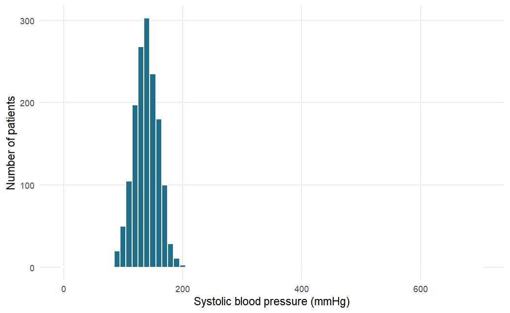

## Chapter 1: Getting Started with R and RStudio


### Exercise 1.1

We store each measurement in an object whose name includes its unit, then write the
formulas in terms of those objects. Height must be converted from centimetres to
metres before squaring.


``` r
weight_kg <- 82
height_cm <- 168
sbp <- 148
dbp <- 96

bmi <- weight_kg / (height_cm / 100)^2
round(bmi, 1)
```

```
#> [1] 29.1
```

``` r
map <- dbp + (sbp - dbp) / 3
round(map, 1)
```

```
#> [1] 113.3
```

``` r
# Without parentheses: ^ is evaluated first, so this is
# weight / (height / 100^2) = 82 / (168 / 10000)
weight_kg / height_cm / 100^2
```

```
#> [1] 4.881e-05
```

The patient's BMI is 29.1 kg/m², just below the conventional threshold for obesity
(30 kg/m²), and the MAP is 113.3 mmHg. Without the parentheses R computes `100^2`
first (exponentiation has the highest priority), then divides from left to right, so
the expression becomes 82 / 168 / 10,000, a meaningless number close to zero. No
error message warns you: wrong parentheses produce wrong numbers silently.

### Exercise 1.2


``` r
dbp <- c(88, 92, 79, 101, 95, NA, 84, 90)
length(dbp)
```

```
#> [1] 8
```

``` r
mean(dbp)                  # NA: one value is unknown
```

```
#> [1] NA
```

``` r
mean(dbp, na.rm = TRUE)    # mean of the 7 observed values
```

```
#> [1] 89.86
```

``` r
sum(dbp >= 90, na.rm = TRUE)    # number of readings >= 90
```

```
#> [1] 4
```

``` r
mean(dbp >= 90, na.rm = TRUE)   # proportion of observed readings
```

```
#> [1] 0.5714
```

``` r
dbp[3:5]
```

```
#> [1]  79 101  95
```

``` r
dbp[!is.na(dbp)]
```

```
#> [1]  88  92  79 101  95  84  90
```

The vector has eight elements, one of them missing. Without `na.rm = TRUE`, `mean()`
returns `NA`, because the mean of a set that includes an unknown value is itself
unknown; with it, R averages the seven observed values (89.9 mmHg). Four readings are
at least 90 mmHg, which is 4 of 7 observed readings, or 57%. Note that the comparison
`dbp >= 90` gives `NA` for the missing reading, so `na.rm = TRUE` is needed in `sum()`
and `mean()` too. The logical index `!is.na(dbp)` ("not missing") keeps the seven
observed readings.

### Exercise 1.3


``` r
glucose <- c("5.4", "6.1", "<2.0", "7.3", "999", "4.8")
class(glucose)
```

```
#> [1] "character"
```

``` r
glucose_num <- as.numeric(glucose)
glucose_num
```

```
#> [1]   5.4   6.1    NA   7.3 999.0   4.8
```

``` r
mean(glucose_num, na.rm = TRUE)
```

```
#> [1] 204.5
```

``` r
mean(glucose_num[glucose_num != 999], na.rm = TRUE)
```

```
#> [1] 5.9
```

The vector is character because its values are written in quotation marks; and even
without the quotes, the entry `"<2.0"` could not be a number, so a column containing
it would be read as text. `as.numeric()` converts the digits successfully but turns
`"<2.0"` into `NA` (with the warning "NAs introduced by coercion"), because "less than
2.0" is not a number. That is a loss of information: the result is known to be low,
not unknown. The value 999 is almost certainly a missing-value code, since a fasting
glucose of 999 mmol/L is impossible. Left in, it raises the mean of the five numeric
values to 204.5 mmol/L; without it, the mean of the four real values is 5.9 mmol/L.

### Exercise 1.4


``` r
htn <- read_csv("Data/hypertension_phc_raw.csv")
htn_xl <- read_excel("Data/hypertension_phc_raw.xlsx", sheet = "data")

dim(htn)
```

```
#> [1] 1503   36
```

``` r
dim(htn_xl)
```

```
#> [1] 1503   36
```

``` r
identical(names(htn), names(htn_xl))
```

```
#> [1] TRUE
```

``` r
n_distinct(htn$patient_id)
```

```
#> [1] 1500
```

Both objects have 1,503 rows and 36 columns, with identical column names. The study
enrolled 1,500 patients, and there are exactly 1,500 distinct patient identifiers, so
three identifiers appear twice: the file contains three duplicate records, which must
be removed before analysis (Chapter 2).

### Exercise 1.5


``` r
glimpse(select(htn, age, sbp_mmhg, bmi, sex, facility, education,
               diabetes, treatment_uptake, enroll_date))
```

```
#> Rows: 1,503
#> Columns: 9
#> $ age              <dbl> 74, 56, 54, 33, 86, 70, 45, 59, 46, 61, 70, 56, 45…
#> $ sbp_mmhg         <dbl> 140, 185, 147, 124, 131, 153, 162, 108, 152, 127, …
#> $ bmi              <dbl> 22.6, 26.7, 21.4, 28.4, 21.6, 31.6, NA, 25.2, 33.0…
#> $ sex              <chr> "Female", "Female", "Female", "Female", "Male", "M…
#> $ facility         <chr> "Igoma HC", "Kisesa HC", "Bugando PHC", "Ilemela H…
#> $ education        <chr> "Primary", "Primary", "None", "Primary", "Primary"…
#> $ diabetes         <chr> "No", "No", "No", "No", "0", "No", "0", "No", "0",…
#> $ treatment_uptake <chr> "Yes", "No", "N", "Yes", "No", "No", "1", "No", "0…
#> $ enroll_date      <chr> "01/02/2024", "2024-09-03", "2024-11-26", "2024-10…
```

Numeric (`<dbl>`) variables include `age`, `sbp_mmhg` and `bmi` (also `height_cm`,
`weight_kg` and the laboratory values). Character (`<chr>`) variables include `sex`,
`facility` and `education`. The variables `diabetes` and `treatment_uptake` (and also
`health_insurance`, `family_history_htn` and `htn_diagnosed`) should be Yes/No
factors, but they mix the codes `"Yes"`/`"No"`, `"Y"`/`"N"` and `"1"`/`"0"`; because
`"Yes"` cannot be a number, readr stores the whole column as text. `enroll_date` is
character because its values use different formats (`"01/02/2024"`, `"2024-09-03"`),
so readr could not recognise a single date format and kept the text unchanged.

### Exercise 1.6


``` r
summary(select(htn, sbp_mmhg, dbp_mmhg, height_cm))
```

```
#>     sbp_mmhg      dbp_mmhg       height_cm  
#>  Min.   :  0   Min.   :  5.0   Min.   : 17  
#>  1st Qu.:126   1st Qu.: 79.0   1st Qu.:158  
#>  Median :139   Median : 86.0   Median :164  
#>  Mean   :140   Mean   : 85.9   Mean   :164  
#>  3rd Qu.:153   3rd Qu.: 93.0   3rd Qu.:169  
#>  Max.   :700   Max.   :121.0   Max.   :193
```

``` r
table(htn$diabetes)
```

```
#> 
#>    0    1    N   No    Y  Yes 
#>  230    7  143 1095    4   24
```

``` r
table(htn$htn_diagnosed)
```

```
#> 
#>   0   1   N  No   Y Yes 
#>  73 158  44 296 110 822
```

``` r
sum(is.na(htn$weight_kg))
```

```
#> [1] 45
```

Systolic pressure ranges from 0 to 700 mmHg: both extremes are impossible. Diastolic
pressure ranges from 5 to 121 mmHg; the minimum of 5 mmHg is implausible. Height ranges
from 17 to about 193 cm; 17 cm is impossible for an adult and is probably 170 cm with a
misplaced decimal point. Both `diabetes` and `htn_diagnosed` use six different codes
(`0`, `1`, `N`, `No`, `Y`, `Yes`) for what should be two categories. Finally, 45
values of `weight_kg` are missing.

### Exercise 1.7


``` r
htn |>
  filter(facility == "Nyamagana PHC") |>
  mutate(map_mmhg = round(dbp_mmhg + (sbp_mmhg - dbp_mmhg) / 3, 1)) |>
  select(patient_id, age, sbp_mmhg, dbp_mmhg, map_mmhg) |>
  arrange(desc(map_mmhg)) |>
  head(5)
```

```
#> # A tibble: 5 × 5
#>   patient_id   age sbp_mmhg dbp_mmhg map_mmhg
#>   <chr>      <dbl>    <dbl>    <dbl>    <dbl>
#> 1 PHC-0741      63      171      116    134.3
#> 2 PHC-1014      59      149      119    129  
#> 3 PHC-0810      65      183      102    129  
#> 4 PHC-0701      62      163      110    127.7
#> 5 PHC-1106      53      159      109    125.7
```

``` r
htn |>
  filter(diabetes == "Yes") |>
  count(facility)
```

```
#> # A tibble: 6 × 2
#>   facility          n
#>   <chr>         <int>
#> 1 Bugando PHC       6
#> 2 Buzuruga PHC      3
#> 3 Igoma HC          3
#> 4 Ilemela HC        6
#> 5 Kisesa HC         2
#> 6 Nyamagana PHC     4
```

The highest MAP values at Nyamagana PHC lie between about 126 and 134 mmHg, from
patients with systolic pressures of 149 to 183 mmHg and diastolic pressures above
100 mmHg. These are high but clinically possible (severe hypertension), so unlike an
SBP of 700 mmHg they should not be treated as errors. The second pipeline counts
records whose `diabetes` value is exactly `"Yes"`. Only 24 records in total
are coded `"Yes"`, whereas Exercise 1.6 showed that 11 more are coded `"1"` or `"Y"`,
so a count based on a single spelling underestimates the number of patients with
diabetes by almost a third (24 instead of 35). This is one more reason to
standardise codes before any analysis.

### Exercise 1.8


``` r
ggplot(htn, aes(x = sbp_mmhg)) +
  geom_histogram(binwidth = 10, fill = "#1F6F8B", colour = "white") +
  labs(x = "Systolic blood pressure (mmHg)", y = "Number of patients")
```




``` r
htn_plausible <- htn |>
  filter(sbp_mmhg >= 60, sbp_mmhg <= 260)
nrow(htn) - nrow(htn_plausible)   # records removed
```

```
#> [1] 2
```

``` r
summary(htn_plausible$sbp_mmhg)
```

```
#>    Min. 1st Qu.  Median    Mean 3rd Qu.    Max. 
#>      90     126     139     139     153     201
```


``` r
ggplot(htn_plausible, aes(x = sbp_mmhg)) +
  geom_histogram(binwidth = 5, fill = "#1F6F8B", colour = "white") +
  labs(x = "Systolic blood pressure (mmHg)", y = "Number of patients")
```


In the first histogram the two extreme values force the axis to run from 0 to 700 mmHg,
so the real data occupy a narrow band and their shape is hard to see. Filtering removed
two records (the values 0 and 700 mmHg; no SBP values were missing, so no further rows
were lost). The plausible values form a single-peaked distribution centred near
139 mmHg (median), with most readings between about 100 and 190 mmHg and a slightly
longer tail towards high pressures. The minimum plausible value is 90 mmHg and the maximum
201 mmHg. Just under half of the patients have a systolic pressure of 140 mmHg or
more (the median is 139 mmHg), as expected in a population with many hypertensive patients. In
practice, implausible values should be set to missing in a documented cleaning step
rather than silently filtered out, as shown in Chapter 2.
