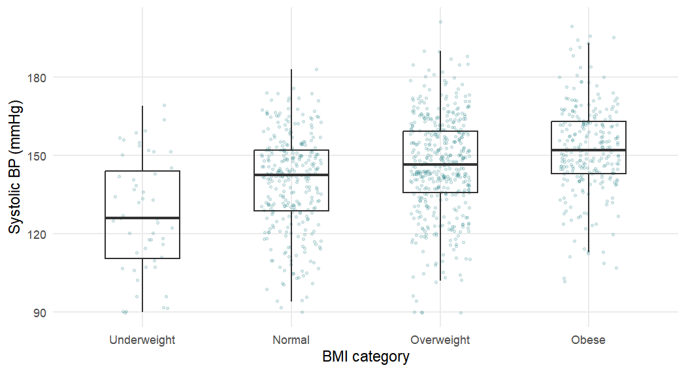
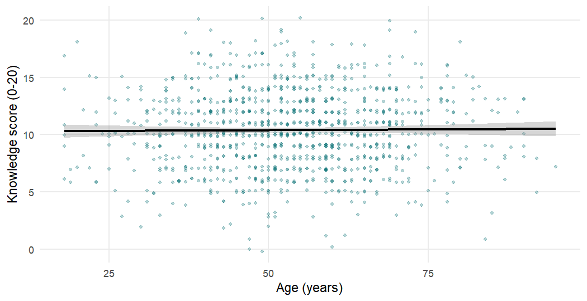

## Chapter 4: Common Statistical Tests in Medical Research


All solutions start from the clean data and the analytic population of diagnosed patients.


``` r
library(tidyverse)
library(broom)
library(patchwork)

course_teal <- "#0D7377"

analysis_data <- readRDS("Data/analysis_data.rds")
dx <- filter(analysis_data, htn_diagnosed == "Yes")
```

### Exercise 4.1

**1. Size of the analytic population and uptake.**


``` r
nrow(dx)
```

```
#> [1] 1089
```

``` r
dx |> count(treatment_uptake) |> mutate(percent = round(100 * n / sum(n), 1))
```

```
#> # A tibble: 2 × 3
#>   treatment_uptake     n percent
#>   <fct>            <int>   <dbl>
#> 1 No                 581    53.4
#> 2 Yes                508    46.6
```

There are 1,089 diagnosed patients, of whom 508 (46.6%) are on treatment.

**2. Uptake among all 1,500 patients.**


``` r
analysis_data |>
  count(htn_diagnosed, treatment_uptake) |>
  mutate(percent_of_all = round(100 * n / sum(n), 1))
```

```
#> # A tibble: 3 × 4
#>   htn_diagnosed treatment_uptake     n percent_of_all
#>   <fct>         <fct>            <int>          <dbl>
#> 1 No            No                 411           27.4
#> 2 Yes           No                 581           38.7
#> 3 Yes           Yes                508           33.9
```

``` r
round(100 * mean(analysis_data$treatment_uptake == "Yes"), 1)
```

```
#> [1] 33.9
```

Across all 1,500 patients only 33.9% are "on treatment", because the 411 undiagnosed patients
are all recorded as not treated. Treatment uptake is defined only for people who know they
have hypertension, so including undiagnosed patients mixes two different processes (being
diagnosed and being treated once diagnosed) and gives a misleadingly low figure; the correct
denominator is the 1,089 diagnosed patients.

**3. Standard deviation and standard error of the knowledge score.**


``` r
dx |>
  summarise(n    = sum(!is.na(knowledge_score)),
            mean = mean(knowledge_score, na.rm = TRUE),
            sd   = sd(knowledge_score, na.rm = TRUE),
            se   = sd / sqrt(n))
```

```
#> # A tibble: 1 × 4
#>       n  mean    sd    se
#>   <int> <dbl> <dbl> <dbl>
#> 1  1060  10.4  3.46 0.106
```

The mean knowledge score is 10.4 points with a standard deviation of 3.5 points: individual
patients typically differ from the mean by about 3.5 points. The standard error, 0.11
points, describes the precision of the *mean*: if the study were repeated, sample means would
typically vary by about 0.1 points. The SD describes patients; the SE describes the estimate
and shrinks as $1/\sqrt{n}$.

### Exercise 4.2

**1. Histogram and Q–Q plot of BMI.**


``` r
p_hist <- ggplot(dx, aes(x = bmi)) +
  geom_histogram(binwidth = 1, fill = course_teal, colour = "white") +
  labs(x = "BMI (kg/m²)", y = "Patients")
p_qq <- ggplot(dx, aes(sample = bmi)) +
  stat_qq(size = 0.6, alpha = 0.5, colour = course_teal) +
  stat_qq_line() +
  labs(x = "Theoretical quantiles", y = "Sample quantiles")
p_hist + p_qq
```


The histogram is symmetric and bell-shaped, and the Q–Q plot is close to a straight line,
with very slight deviations only at the extremes.

**2. Shapiro–Wilk test.**


``` r
shapiro.test(dx$bmi)
```

```
#> 
#> 	Shapiro-Wilk normality test
#> 
#> data:  dx$bmi
#> W = 0.997, p-value = 0.052
```

$W = 0.997$ and $p = 0.052$: no strong evidence against normality. With more than 1,000
patients, however, the test would flag even trivial departures, and the plots (together with
the central limit theorem) are the more useful guide. Either way, BMI can be treated as
approximately normal.

**3. Comparing BMI by treatment uptake.** A Welch t-test is appropriate.


``` r
t.test(bmi ~ treatment_uptake, data = dx)
```

```
#> 
#> 	Welch Two Sample t-test
#> 
#> data:  bmi by treatment_uptake
#> t = -0.504, df = 1045, p-value = 0.61
#> alternative hypothesis: true difference in means between group No and group
#>   Yes is not equal to 0
#> 95 percent confidence interval:
#>  -0.72587  0.42912
#> sample estimates:
#>  mean in group No mean in group Yes 
#>            26.763            26.912
```

``` r
wilcox.test(bmi ~ treatment_uptake, data = dx)   # a check
```

```
#> 
#> 	Wilcoxon rank sum test with continuity correction
#> 
#> data:  bmi by treatment_uptake
#> W = 135646, p-value = 0.52
#> alternative hypothesis: true location shift is not equal to 0
```

Mean BMI was 26.8 kg/m² in untreated and 26.9 kg/m² in treated patients; the difference
(No minus Yes) is $-0.15$ kg/m² (95% CI $-0.73$ to 0.43; $p = 0.61$). The Wilcoxon test
agrees ($p = 0.52$). The confidence interval is narrow and contains only differences far too
small to matter clinically, so in this case we can reasonably conclude that BMI is not
materially different between the groups, not merely that "the test was not significant".

### Exercise 4.3

**1. Summary by group.**


``` r
dx |>
  group_by(treatment_uptake) |>
  summarise(n = sum(!is.na(sbp_mmhg)),
            mean = mean(sbp_mmhg, na.rm = TRUE),
            sd = sd(sbp_mmhg, na.rm = TRUE))
```

```
#> # A tibble: 2 × 4
#>   treatment_uptake     n  mean    sd
#>   <fct>            <int> <dbl> <dbl>
#> 1 No                 581  142.  19.8
#> 2 Yes                507  148.  18.3
```

**2. Welch t-test.**


``` r
t.test(sbp_mmhg ~ treatment_uptake, data = dx)
```

```
#> 
#> 	Welch Two Sample t-test
#> 
#> data:  sbp_mmhg by treatment_uptake
#> t = -5.14, df = 1082, p-value = 3.3e-07
#> alternative hypothesis: true difference in means between group No and group
#>   Yes is not equal to 0
#> 95 percent confidence interval:
#>  -8.2128 -3.6727
#> sample estimates:
#>  mean in group No mean in group Yes 
#>            142.16            148.10
```

Patients on treatment had a higher mean systolic blood pressure than those not on treatment
(148.1 vs 142.2 mmHg; difference 5.9 mmHg, 95% CI 3.7 to 8.2 mmHg; Welch t-test
$p < 0.001$).

**3. Interpretation.** A difference of about 6 mmHg in mean systolic pressure is clinically
relevant at the population level (reductions of this size are associated with appreciable
reductions in cardiovascular risk). The direction is at first surprising, since treatment
should *lower* blood pressure. In a cross-sectional study, however, we cannot tell what came
first: patients with higher blood pressure are more likely to have been offered and to have
accepted treatment (reverse causation, or "confounding by indication"), and treated
patients may not yet be controlled. A single cross-sectional comparison cannot evaluate the
effect of treatment on blood pressure. (The data are simulated, so the pattern illustrates
the reasoning rather than a real finding.)

### Exercise 4.4

**1. Boxplot and summary.**


``` r
dx |>
  filter(!is.na(bmi_cat), !is.na(sbp_mmhg)) |>
  ggplot(aes(x = bmi_cat, y = sbp_mmhg)) +
  geom_jitter(width = 0.2, alpha = 0.15, size = 0.8, colour = course_teal) +
  geom_boxplot(fill = NA, outlier.shape = NA, width = 0.5) +
  labs(x = "BMI category", y = "Systolic BP (mmHg)")
```




``` r
dx |>
  filter(!is.na(bmi_cat), !is.na(sbp_mmhg)) |>
  group_by(bmi_cat) |>
  summarise(n = n(), mean = mean(sbp_mmhg), sd = sd(sbp_mmhg))
```

```
#> # A tibble: 4 × 4
#>   bmi_cat         n  mean    sd
#>   <fct>       <int> <dbl> <dbl>
#> 1 Underweight    51  127.  22.1
#> 2 Normal        308  140.  18.2
#> 3 Overweight    440  146.  18.9
#> 4 Obese         256  152.  16.9
```

Mean systolic pressure rises steadily from about 127 mmHg in underweight to 152 mmHg in
obese patients.

**2. One-way ANOVA.**


``` r
aov_sbp <- aov(sbp_mmhg ~ bmi_cat, data = dx)
summary(aov_sbp)
```

```
#>               Df Sum Sq Mean Sq F value Pr(>F)    
#> bmi_cat        3  39096   13032    38.5 <2e-16 ***
#> Residuals   1051 355674     338                   
#> ---
#> Signif. codes:  0 '***' 0.001 '**' 0.01 '*' 0.05 '.' 0.1 ' ' 1
#> 34 observations deleted due to missingness
```

The between-groups line has $4 - 1 = 3$ degrees of freedom and the residual line 1,051
($N - k$ with $N = 1{,}055$). $F = 38.5$ with $p < 2 \times 10^{-16}$: very strong evidence
that mean systolic pressure differs between BMI categories. 34 patients were excluded
because BMI category or systolic pressure was missing.

**3. Kruskal–Wallis test.**


``` r
kruskal.test(sbp_mmhg ~ bmi_cat, data = dx)
```

```
#> 
#> 	Kruskal-Wallis rank sum test
#> 
#> data:  sbp_mmhg by bmi_cat
#> Kruskal-Wallis chi-squared = 89.6, df = 3, p-value <2e-16
```

The rank-based test agrees ($\chi^2 = 89.6$, 3 df, $p < 0.001$).

**4. Bonferroni-adjusted pairwise comparisons.**


``` r
pairwise.t.test(dx$sbp_mmhg, dx$bmi_cat, p.adjust.method = "bonferroni")
```

```
#> 
#> 	Pairwise comparisons using t tests with pooled SD 
#> 
#> data:  dx$sbp_mmhg and dx$bmi_cat 
#> 
#>            Underweight Normal Overweight
#> Normal     3e-05       -      -         
#> Overweight 2e-11       2e-05  -         
#> Obese      <2e-16      1e-14  1e-04     
#> 
#> P value adjustment method: bonferroni
```

All six adjusted p-values are below 0.001: every BMI category differs from every other, in a
consistent gradient (higher BMI, higher systolic pressure). Tukey's method
(`TukeyHSD(aov_sbp)`) would give the same conclusion and, in addition, confidence intervals
for each pairwise difference.

### Exercise 4.5

**1. Table and row percentages.**


``` r
tab_res <- table(Residence = dx$residence, Uptake = dx$treatment_uptake)
addmargins(tab_res)
```

```
#>          Uptake
#> Residence   No  Yes  Sum
#>     Rural  306  195  501
#>     Urban  275  313  588
#>     Sum    581  508 1089
```

``` r
round(100 * prop.table(tab_res, margin = 1), 1)
```

```
#>          Uptake
#> Residence   No  Yes
#>     Rural 61.1 38.9
#>     Urban 46.8 53.2
```

Uptake was 53.2% among urban and 38.9% among rural patients.

**2. Chi-square test and expected counts.**


``` r
chisq.test(tab_res)
```

```
#> 
#> 	Pearson's Chi-squared test with Yates' continuity correction
#> 
#> data:  tab_res
#> X-squared = 21.7, df = 1, p-value = 3.2e-06
```

``` r
chisq.test(tab_res)$expected
```

```
#>          Uptake
#> Residence     No    Yes
#>     Rural 267.29 233.71
#>     Urban 313.71 274.29
```

$\chi^2 = 21.7$ on 1 df, $p < 0.001$. All expected counts are above 230, so the chi-square
approximation is entirely adequate.

**3. Risk difference, relative risk and odds ratio (urban vs rural).**


``` r
a  <- tab_res["Urban", "Yes"]; b  <- tab_res["Urban", "No"]   # exposed
cc <- tab_res["Rural", "Yes"]; dd <- tab_res["Rural", "No"]   # unexposed
n1 <- a + b; n0 <- cc + dd
p1 <- a / n1; p0 <- cc / n0

rd <- p1 - p0
se_rd <- sqrt(p1 * (1 - p1) / n1 + p0 * (1 - p0) / n0)
rr <- p1 / p0
se_log_rr <- sqrt(1 / a - 1 / n1 + 1 / cc - 1 / n0)
or <- (a * dd) / (b * cc)
se_log_or <- sqrt(1 / a + 1 / b + 1 / cc + 1 / dd)

tibble(
  measure  = c("Risk difference", "Relative risk", "Odds ratio"),
  estimate = c(rd, rr, or),
  lower    = c(rd - 1.96 * se_rd, exp(log(rr) - 1.96 * se_log_rr),
               exp(log(or) - 1.96 * se_log_or)),
  upper    = c(rd + 1.96 * se_rd, exp(log(rr) + 1.96 * se_log_rr),
               exp(log(or) + 1.96 * se_log_or))
) |>
  knitr::kable(digits = 3,
               caption = "Urban versus rural residence and treatment uptake.")
```


Table: Urban versus rural residence and treatment uptake.

|measure         | estimate| lower| upper|
|:---------------|--------:|-----:|-----:|
|Risk difference |    0.143| 0.084| 0.202|
|Relative risk   |    1.368| 1.197| 1.563|
|Odds ratio      |    1.786| 1.402| 2.275|

Urban patients were 14.3 percentage points more likely to be on treatment than rural
patients (95% CI 8.4 to 20.2); their risk of uptake was about 1.37 times as high (95% CI 1.20
to 1.56), and their odds about 1.79 times as high (95% CI 1.40 to 2.28). All three confidence intervals exclude the null value.

**4. Why the OR is further from 1 than the RR.** The odds ratio approximates the relative
risk only when the outcome is rare. Uptake is common (around 40–55%), and when risks are
high the odds $p/(1-p)$ change much faster than the risks themselves, so the OR (1.79) is
noticeably further from 1 than the RR (1.37). Reporting the OR as if it were "1.8 times as
likely" would exaggerate the association.

### Exercise 4.6

**1. Cross-product OR and logistic regression.**


``` r
tab_diab <- table(Diabetes = dx$diabetes, Uptake = dx$treatment_uptake)
tab_diab
```

```
#>         Uptake
#> Diabetes  No Yes
#>      No  574 487
#>      Yes   7  21
```

``` r
or_table <- (tab_diab["Yes", "Yes"] * tab_diab["No", "No"]) /
  (tab_diab["Yes", "No"] * tab_diab["No", "Yes"])
or_table
```

```
#> [1] 3.5359
```

``` r
m_diab <- glm(treatment_uptake ~ diabetes, data = dx, family = binomial)
tidy(m_diab, exponentiate = TRUE, conf.int = TRUE) |>
  select(term, estimate, p.value, conf.low, conf.high)
```

```
#> # A tibble: 2 × 5
#>   term        estimate p.value conf.low conf.high
#>   <chr>          <dbl>   <dbl>    <dbl>     <dbl>
#> 1 (Intercept)    0.848 0.00763    0.752     0.957
#> 2 diabetesYes    3.54  0.00416    1.56      9.04
```

The two agree exactly: $(21 \times 574)/(7 \times 487) = 3.54$, and the exponentiated
coefficient of `diabetesYes` is also 3.54. Logistic regression with a single binary
predictor reproduces the 2×2 table.

**2. Fisher's exact test.**


``` r
fisher.test(tab_diab)
```

```
#> 
#> 	Fisher's Exact Test for Count Data
#> 
#> data:  tab_diab
#> p-value = 0.0033
#> alternative hypothesis: true odds ratio is not equal to 1
#> 95 percent confidence interval:
#>  1.4313 9.9226
#> sample estimates:
#> odds ratio 
#>     3.5321
```

Fisher's test reports an odds ratio of 3.53. It is a *conditional maximum likelihood*
estimate (computed conditional on the table margins), not the simple cross-product ratio, so
it differs slightly, particularly when some cells are small. Its exact interval (1.43 to
9.92) is also a little wider than the profile-likelihood interval from the regression (1.56
to 9.04). The p-values (0.003 and 0.004) lead to the same conclusion.

**3. Why the interval is wide.** The standard error of the log odds ratio is
$\sqrt{1/a + 1/b + 1/c + 1/d}$, which is dominated by the smallest cells. Only 28 patients
have diabetes, and only 7 of them are untreated, so $1/7$ makes the standard error large
(about 0.44, compared with 0.13 for health insurance, whose smallest cell is 162). The data
are compatible with anything from a modest to a very large association.

### Exercise 4.7

**1. Scatter plot.**


``` r
ggplot(dx, aes(x = age, y = knowledge_score)) +
  geom_jitter(width = 0, height = 0.2, alpha = 0.3, size = 1,
              colour = course_teal) +
  geom_smooth(method = "lm", formula = y ~ x, colour = "black") +
  labs(x = "Age (years)", y = "Knowledge score (0-20)")
```



The cloud is shapeless and the fitted line is flat.

**2. Correlation with age.**


``` r
cor.test(dx$age, dx$knowledge_score)
```

```
#> 
#> 	Pearson's product-moment correlation
#> 
#> data:  dx$age and dx$knowledge_score
#> t = 0.343, df = 1057, p-value = 0.73
#> alternative hypothesis: true correlation is not equal to 0
#> 95 percent confidence interval:
#>  -0.049719  0.070749
#> sample estimates:
#>      cor 
#> 0.010553
```

``` r
cor.test(dx$age, dx$knowledge_score, method = "spearman", exact = FALSE)
```

```
#> 
#> 	Spearman's rank correlation rho
#> 
#> data:  dx$age and dx$knowledge_score
#> S = 1.95e+08, p-value = 0.66
#> alternative hypothesis: true rho is not equal to 0
#> sample estimates:
#>      rho 
#> 0.013459
```

Pearson's $r = 0.011$ (95% CI $-0.050$ to 0.071; $p = 0.73$) and Spearman's
$r_s = 0.013$ ($p = 0.66$). There is no evidence of a linear or monotonic association, and
the confidence interval shows that any linear correlation is at most very weak (the largest
plausible value, 0.07, would correspond to age explaining less than 1% of the variation).

**3. Correlation with distance.**


``` r
cor.test(dx$distance_to_facility_km, dx$knowledge_score)
```

```
#> 
#> 	Pearson's product-moment correlation
#> 
#> data:  dx$distance_to_facility_km and dx$knowledge_score
#> t = -0.318, df = 1014, p-value = 0.75
#> alternative hypothesis: true correlation is not equal to 0
#> 95 percent confidence interval:
#>  -0.071439  0.051555
#> sample estimates:
#>        cor 
#> -0.0099799
```

``` r
cor.test(dx$distance_to_facility_km, dx$knowledge_score,
         method = "spearman", exact = FALSE)
```

```
#> 
#> 	Spearman's rank correlation rho
#> 
#> data:  dx$distance_to_facility_km and dx$knowledge_score
#> S = 1.78e+08, p-value = 0.52
#> alternative hypothesis: true rho is not equal to 0
#> sample estimates:
#>       rho 
#> -0.020245
```

Both coefficients are close to zero ($r = -0.010$, $r_s = -0.020$). Spearman's coefficient
is more appropriate here, because distance is strongly right-skewed and a few very large
distances could unduly influence Pearson's $r$; the rank-based coefficient is not affected
by them.

**4. Comment.** The statement makes two errors. First, a non-significant p-value is not
evidence of no relationship (absence of evidence is not evidence of absence); here, however,
the narrow confidence interval does support the conclusion that any *linear* association is
very weak. Second, and more importantly, the absence of a correlation between age and
knowledge says nothing about whether older (or younger) patients would *benefit* from
targeted education: that depends on their needs and on uptake, which is related to age
(Section 4.4). Correlation also only captures linear (Pearson) or monotonic
(Spearman) patterns; a U-shaped relationship could be missed, which is why we plot first.

### Exercise 4.8

**1. Eight chi-square tests.**


``` r
vars <- c("sex", "residence", "education", "occupation",
          "marital_status", "smoking", "alcohol", "facility")

screen <- tibble(
  variable = vars,
  p_raw = map_dbl(vars, function(v) {
    chisq.test(table(dx[[v]], dx$treatment_uptake))$p.value
  })
)
```

**2. Bonferroni and Holm adjustment.**


``` r
screen |>
  mutate(p_bonferroni = p.adjust(p_raw, method = "bonferroni"),
         p_holm       = p.adjust(p_raw, method = "holm")) |>
  arrange(p_raw) |>
  # show very small p-values as "<0.001" rather than rounding them to 0
  mutate(across(starts_with("p_"),
                \(x) scales::pvalue(x, accuracy = 0.001))) |>
  knitr::kable(
               caption = "Unadjusted and adjusted p-values for eight chi-square tests of association with treatment uptake.")
```


Table: Unadjusted and adjusted p-values for eight chi-square tests of association with treatment uptake.

|variable       |p_raw  |p_bonferroni |p_holm |
|:--------------|:------|:------------|:------|
|residence      |<0.001 |<0.001       |<0.001 |
|education      |<0.001 |0.002        |0.002  |
|sex            |0.014  |0.108        |0.081  |
|alcohol        |0.123  |0.984        |0.615  |
|facility       |0.135  |>0.999       |0.615  |
|smoking        |0.230  |>0.999       |0.691  |
|occupation     |0.353  |>0.999       |0.706  |
|marital_status |0.885  |>0.999       |0.885  |

Before adjustment, three variables have $p < 0.05$: residence, education and sex. After
Bonferroni or Holm adjustment only residence and education remain below 0.05; the
association with sex ($p = 0.014$ unadjusted) does not survive. Holm's method is a
step-down refinement of Bonferroni that is uniformly more powerful while still controlling
the family-wise error rate: it compares the smallest p-value with $\alpha/m$, the next with
$\alpha/(m-1)$, and so on.

**3. Chance of at least one false positive.**


``` r
1 - 0.95^8
```

```
#> [1] 0.33658
```

If all eight null hypotheses were true and the tests independent, the probability of at
least one p-value below 0.05 would be about 34%. A paper that screens many variables and
reports only the "significant" ones is therefore likely to report some false-positive
associations; it should report all tests performed, describe the analysis as exploratory,
and either adjust for multiplicity or interpret isolated small p-values with caution.
