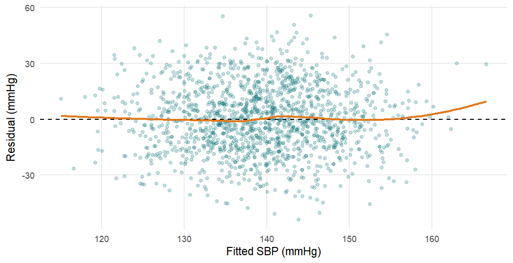

## Chapter 5: Regression Modelling and Reporting Results

These solutions use the same packages, data and main model as Chapter 5.
The setup code below recreates the analytic population (`dx`), the
pre-specified multivariable model (`model_full`) and its complete-case data
(`cc`). Remember that the data are simulated for teaching: the results
illustrate methods, not real clinical findings.


``` r
analysis_data <- readRDS("Data/analysis_data.rds")

# Diagnosed patients; education as an unordered factor (reference "None")
dx <- analysis_data |>
  filter(htn_diagnosed == "Yes") |>
  mutate(education = factor(education, ordered = FALSE))

model_full <- glm(
  treatment_uptake ~ age + sex + education + residence + diabetes +
    family_history_htn + health_insurance + knowledge_score +
    distance_to_facility_km,
  data = dx, family = binomial
)
cc <- model.frame(model_full)    # the 992 complete cases
```

### Exercise 5.1

We fit the linear model to all adults with complete data on the four
variables and extract the coefficients with confidence intervals.


``` r
lm_sex <- lm(sbp_mmhg ~ age + bmi + sex, data = analysis_data)
summary(lm_sex)$coefficients |> round(3)
```

```
#>             Estimate Std. Error t value Pr(>|t|)
#> (Intercept)   87.309      3.214  27.168    0.000
#> age            0.260      0.034   7.714    0.000
#> bmi            1.451      0.098  14.870    0.000
#> sexMale        0.325      0.966   0.336    0.737
```

``` r
# Age per 10 years, with 95% CI
age10 <- 10 * c(coef(lm_sex)["age"], confint(lm_sex)["age", ])
round(age10, 2)
```

```
#>    age  2.5 % 97.5 % 
#>   2.60   1.94   3.26
```

``` r
c(n = nobs(lm_sex), R2 = round(summary(lm_sex)$r.squared, 3),
  adj_R2 = round(summary(lm_sex)$adj.r.squared, 3))
```

```
#>        n       R2   adj_R2 
#> 1449.000    0.161    0.159
```


1. Each 10-year increase in age is associated with a mean SBP
   2.6 mmHg higher (95% CI
   1.9 to 3.3),
   holding BMI and sex fixed.
2. Men have a mean SBP 0.3 mmHg
   higher than women of the same age and
   BMI (95% CI -1.6 to
   2.2).
   The interval includes zero, so the data are compatible with no
   difference in mean SBP by sex.
3. The model explains 16.1% of the
   variance in SBP, essentially the same as the model without sex in the
   chapter. Adding sex contributes little.
4. The residual plot is below.


``` r
augment(lm_sex) |>
  ggplot(aes(.fitted, .resid)) +
  geom_point(alpha = 0.25, colour = "#0D7377") +
  geom_hline(yintercept = 0, linetype = "dashed") +
  geom_smooth(method = "loess", se = FALSE, colour = "#E07A1F") +
  labs(x = "Fitted SBP (mmHg)", y = "Residual (mmHg)")
```



The residuals form a band of roughly constant width around zero, with no
clear curvature or funnel shape, so the linearity and equal-variance
assumptions look reasonable. (A Q–Q plot, as in the chapter, would be used
to check normality.)

### Exercise 5.2


``` r
tab_fh <- table(FamilyHistory = dx$family_history_htn,
                Uptake        = dx$treatment_uptake)
tab_fh
```

```
#>              Uptake
#> FamilyHistory  No Yes
#>           No  398 297
#>           Yes 183 211
```

``` r
fh <- dx |>
  group_by(family_history_htn) |>
  summarise(n = n(), p = mean(treatment_uptake == "Yes")) |>
  mutate(odds = p / (1 - p))
kable(fh, digits = 3, caption = "Uptake by family history of hypertension.")
```


Table: Uptake by family history of hypertension.

|family_history_htn |   n|     p|  odds|
|:------------------|---:|-----:|-----:|
|No                 | 695| 0.427| 0.746|
|Yes                | 394| 0.536| 1.153|

``` r
or_fh <- fh$odds[2] / fh$odds[1]          # crude odds ratio
rr_fh <- fh$p[2] / fh$p[1]                # crude risk ratio
c(OR = round(or_fh, 3), RR = round(rr_fh, 3))
```

```
#>    OR    RR 
#> 1.545 1.253
```


``` r
glm_fh <- glm(treatment_uptake ~ family_history_htn, data = dx,
              family = binomial)
exp(coef(glm_fh))
```

```
#>           (Intercept) family_history_htnYes 
#>                0.7462                1.5451
```

``` r
# Zhang and Yu conversion from OR to RR, using the risk in the reference group
p0 <- fh$p[1]
round(or_fh / ((1 - p0) + p0 * or_fh), 3)
```

```
#> [1] 1.253
```

1. Without a family history, 42.7% of patients are on
   treatment (odds 0.75); with a family history,
   53.6% (odds 1.15). The crude
   OR is 1.55.
2. The exponentiated coefficient from `glm()` is identical: a
   one-predictor logistic regression reproduces the $2 \times 2$ table.
3. The crude RR is 1.25, smaller than the OR. Uptake is
   common (around 40–55%), so the odds are much larger than the risks and
   the OR lies further from 1 than the RR. The Zhang and Yu formula, with
   $p_0 = 0.427$, recovers the RR exactly for a crude OR.

### Exercise 5.3

We multiply each coefficient and its profile-likelihood confidence limits
by the chosen increment before exponentiating.


``` r
ci_log <- confint(model_full)
tibble(term = c("age", "knowledge_score", "distance_to_facility_km"),
       increment = c(10, 5, 10)) |>
  mutate(OR    = exp(increment * coef(model_full)[term]),
         lower = exp(increment * ci_log[term, 1]),
         upper = exp(increment * ci_log[term, 2])) |>
  kable(digits = 2, caption = "Adjusted ORs for chosen increments.")
```


Table: Adjusted ORs for chosen increments.

|term                    | increment|   OR| lower| upper|
|:-----------------------|---------:|----:|-----:|-----:|
|age                     |        10| 1.35|  1.23|  1.50|
|knowledge_score         |         5| 1.60|  1.31|  1.96|
|distance_to_facility_km |        10| 0.83|  0.65|  1.05|

A decade of age is a natural clinical unit, and a 5-point difference in
knowledge (a quarter of the 0–20 scale, close to the interquartile range)
is easy to interpret. For distance, 10 km is roughly the difference between
living next to the clinic and living at the upper quartile of distance in
this sample. The increments must be chosen before the analysis (and stated
in the Methods) because otherwise an analyst could pick whichever unit made
an association look most impressive; the choice changes the size of the OR
but not its p-value.

### Exercise 5.4


``` r
glm_ins_cc <- glm(treatment_uptake ~ health_insurance, data = cc,
                  family = binomial)
b_crude <- coef(glm_ins_cc)["health_insuranceYes"]
b_adj   <- coef(model_full)["health_insuranceYes"]

c(crude_OR = exp(b_crude), adjusted_OR = exp(b_adj),
  pct_change_logOR = 100 * (b_adj - b_crude) / b_crude) |>
  unname() |> setNames(c("crude_OR", "adjusted_OR", "pct_change_logOR")) |>
  round(2)
```

```
#>         crude_OR      adjusted_OR pct_change_logOR 
#>             1.67             2.05            40.24
```

1. The OR moves from 1.67 (crude) to
   2.05 (adjusted), a change of about
   40% in the log OR, well above
   the 10% change-in-estimate threshold.
2. A plausible causal diagram: insurance increases uptake (by reducing the
   cost of medicines and visits). Education, residence and age could
   influence both whether a person is insured and whether they take up
   treatment, so they are potential confounders. Knowledge score could be a
   mediator if insurance schemes provide health education, or a confounder
   if better-informed people seek insurance; the direction is uncertain.
   Diabetes and family history are unlikely to be caused by insurance and
   mainly affect the outcome.
3. To decide between confounding and non-collapsibility we can check how
   strongly insurance is related to the other predictors, and compute a
   *marginal* (population-averaged) OR from the adjusted model by
   standardisation: predict every patient's probability of uptake with
   insurance set to "Yes" and to "No", average each, and form the OR of the
   two averages. Standardisation removes confounding by the model
   covariates but, unlike the conditional OR, is collapsible.


``` r
# Is insurance associated with the other predictors? (ORs near 1 = weakly)
glm(health_insurance ~ age + sex + education + residence + diabetes +
      family_history_htn + knowledge_score + distance_to_facility_km,
    data = cc, family = binomial) |>
  tidy(exponentiate = TRUE) |>
  filter(term != "(Intercept)") |>
  select(term, OR = estimate, p = p.value) |>
  mutate(OR = round(OR, 2), p = round(p, 3))
```

```
#> # A tibble: 10 × 3
#>    term                       OR     p
#>    <chr>                   <dbl> <dbl>
#>  1 age                      0.99 0.237
#>  2 sexMale                  1.01 0.939
#>  3 educationPrimary         1.2  0.341
#>  4 educationSecondary       1.21 0.362
#>  5 educationTertiary        1.09 0.736
#>  6 residenceUrban           0.8  0.128
#>  7 diabetesYes              0.4  0.101
#>  8 family_history_htnYes    0.82 0.178
#>  9 knowledge_score          0.97 0.161
#> 10 distance_to_facility_km  0.99 0.243
```

``` r
# Marginal OR by standardisation over the observed covariates
all_yes <- mutate(cc, health_insurance = "Yes")   # everyone insured
all_no  <- mutate(cc, health_insurance = "No")    # no one insured
p_yes <- mean(predict(model_full, newdata = all_yes, type = "response"))
p_no  <- mean(predict(model_full, newdata = all_no,  type = "response"))
c(p_insured = p_yes, p_uninsured = p_no,
  marginal_OR = (p_yes / (1 - p_yes)) / (p_no / (1 - p_no))) |> round(3)
```

```
#>   p_insured p_uninsured marginal_OR 
#>       0.564       0.409       1.869
```


Insurance is only weakly related to most of the other predictors, but
insured patients are somewhat *less* likely to be urban, to have diabetes
or to have a family history, all of which favour uptake. This produces
some negative confounding of the crude OR. The standardised (marginal) OR,
1.87, removes that confounding while staying on the
population-averaged scale of the crude OR. We can therefore split the
change on the log-odds scale into two parts:

- crude to marginal, from 1.67 to
  1.87: the change due to **confounding** by the measured
  covariates;
- marginal to conditional, from 1.87 to
  2.05: the change due to **non-collapsibility**.


``` r
logs <- c(crude = b_crude, marginal = log(marg_or), conditional = b_adj)
c(confounding_part      = unname(logs[2] - logs[1]),
  noncollapsibility_part = unname(logs[3] - logs[2])) |> round(3)
```

```
#>       confounding_part noncollapsibility_part 
#>                  0.114                  0.092
```

The two components are of similar size. So the answer is "both": about
half of the change from the crude to the adjusted OR reflects confounding
(insured patients have fewer of the other characteristics that favour
uptake), and about half reflects non-collapsibility. Both ORs are valid,
but they answer different questions: the conditional OR compares patients
with the same covariate values; the marginal OR compares the whole
population with and without insurance.

### Exercise 5.5


``` r
drop1(model_full, test = "LRT")["education", ]
```

```
#> Single term deletions
#> 
#> Model:
#> treatment_uptake ~ age + sex + education + residence + diabetes + 
#>     family_history_htn + health_insurance + knowledge_score + 
#>     distance_to_facility_km
#>           Df Deviance  AIC  LRT Pr(>Chi)   
#> education  3     1238 1256 16.3    0.001 **
#> ---
#> Signif. codes:  0 '***' 0.001 '**' 0.01 '*' 0.05 '.' 0.1 ' ' 1
```

1. The LR test compares `model_full` with the same model without the three
   education indicators. The null hypothesis is that all three education
   coefficients are zero, that is, that the odds of uptake are the same at
   every level of education once the other variables are accounted for. It
   is rejected ($p \approx 0.001$).


``` r
cc_num <- cc |> mutate(edu_num = as.integer(education) - 1)  # 0, 1, 2, 3

model_trend <- glm(
  treatment_uptake ~ age + sex + edu_num + residence + diabetes +
    family_history_htn + health_insurance + knowledge_score +
    distance_to_facility_km,
  data = cc_num, family = binomial
)
tidy(model_trend, exponentiate = TRUE, conf.int = TRUE) |>
  filter(term == "edu_num") |>
  select(term, OR = estimate, conf.low, conf.high, p.value)
```

```
#> # A tibble: 1 × 5
#>   term       OR conf.low conf.high   p.value
#>   <chr>   <dbl>    <dbl>     <dbl>     <dbl>
#> 1 edu_num  1.36     1.17      1.58 0.0000673
```

``` r
AIC(model_full, model_trend)
```

```
#>             df  AIC
#> model_full  12 1246
#> model_trend 10 1242
```


2. With education coded 0–3, each step up the education scale (None to
   Primary, Primary to Secondary, Secondary to Tertiary) is associated with
   1.36 times the odds of uptake. This assumes the same
   OR for every step, so the OR for Tertiary versus None is
   $1.36^3 = 2.49$.
3. The trend model has AIC 1242.0 against
   1245.9 for the factor model: it fits as well with
   two fewer parameters, and is therefore preferred by AIC (a difference of
   about 4 points). The category ORs
   in the chapter (1.39, 1.92, 2.44) do increase roughly geometrically.
   Either choice is defensible; what matters is that it is made *before*
   looking at the results. The factor version is easier for readers to
   interpret and makes no assumption about equal steps; the trend version
   is more parsimonious and gives a single, more precise estimate. A
   sensible approach is to report the categories in the table and mention
   the trend test in the text.

### Exercise 5.6


``` r
model_fac <- update(model_full, . ~ . + facility)
anova(model_full, model_fac, test = "LRT")[, 3:5]
```

```
#>   Df Deviance Pr(>Chi)
#> 1                     
#> 2  5      7.6     0.18
```

``` r
# Percentage change in each shared OR when facility is added
shared <- names(coef(model_full))[-1]
tibble(term = shared,
       OR_without = exp(coef(model_full)[shared]),
       OR_with    = exp(coef(model_fac)[shared])) |>
  mutate(pct_change = 100 * (OR_with - OR_without) / OR_without) |>
  kable(digits = 2, caption = "Adjusted ORs with and without facility.")
```


Table: Adjusted ORs with and without facility.

|term                    | OR_without| OR_with| pct_change|
|:-----------------------|----------:|-------:|----------:|
|age                     |       1.03|    1.03|       0.03|
|sexMale                 |       0.74|    0.74|       0.33|
|educationPrimary        |       1.39|    1.40|       0.68|
|educationSecondary      |       1.92|    1.96|       2.37|
|educationTertiary       |       2.44|    2.48|       1.65|
|residenceUrban          |       1.87|    1.87|      -0.05|
|diabetesYes             |       3.56|    3.74|       5.21|
|family_history_htnYes   |       1.91|    1.92|       0.75|
|health_insuranceYes     |       2.05|    2.04|      -0.57|
|knowledge_score         |       1.10|    1.10|       0.20|
|distance_to_facility_km |       0.98|    0.98|      -0.16|


``` r
auc_without <- auc(roc(model_full$y, fitted(model_full), quiet = TRUE))
auc_with    <- auc(roc(model_fac$y,  fitted(model_fac),  quiet = TRUE))
round(c(without = auc_without, with = auc_with), 3)
```

```
#> without    with 
#>   0.715   0.721
```


1. Adding the five facility indicators reduces the deviance by
   7.6 on 5 df ($p =
   0.18$): no clear evidence that uptake
   differs between facilities after adjustment.
2. The largest change in any other OR is
   5.2% (for diabetesYes); no OR changes
   by more than 10%. Facility does not confound the other associations.
3. The AUC rises only slightly, from 0.715 to
   0.721, as expected whenever terms are added to a model
   evaluated on its own data. Facility adds little. However, it remains a
   design variable: patients within the same facility may be correlated,
   and a sensitivity analysis with facility as a fixed effect (or with
   cluster-robust standard errors) is worth reporting to show that the
   conclusions do not depend on ignoring clustering.

### Exercise 5.7


``` r
model_ir <- update(model_full, . ~ . + health_insurance:residence)
anova(model_full, model_ir, test = "LRT")[, 3:5]
```

```
#>   Df Deviance Pr(>Chi)
#> 1                     
#> 2  1    0.303     0.58
```

To obtain the OR for insurance in each residence group, note that in the
interaction model the log OR for insurance is $\beta_{\text{ins}}$ among
rural patients (the reference) and $\beta_{\text{ins}} +
\beta_{\text{int}}$ among urban patients. The variance of the sum is
$\operatorname{Var}(\beta_{\text{ins}}) + \operatorname{Var}(\beta_{\text{int}}) +
2\operatorname{Cov}(\beta_{\text{ins}}, \beta_{\text{int}})$, taken from
the variance–covariance matrix `vcov()`.


``` r
b <- coef(model_ir)
V <- vcov(model_ir)
ins <- "health_insuranceYes"
int <- "residenceUrban:health_insuranceYes"

log_or <- c(rural = unname(b[ins]),
            urban = unname(b[ins] + b[int]))
se     <- c(rural = sqrt(V[ins, ins]),
            urban = sqrt(V[ins, ins] + V[int, int] + 2 * V[ins, int]))

tibble(residence = names(log_or),
       OR    = exp(log_or),
       lower = exp(log_or - 1.96 * se),
       upper = exp(log_or + 1.96 * se)) |>
  kable(digits = 2,
        caption = "OR for health insurance by residence (Wald CIs).")
```


Table: OR for health insurance by residence (Wald CIs).

|residence |   OR| lower| upper|
|:---------|----:|-----:|-----:|
|rural     | 1.88|  1.24|  2.86|
|urban     | 2.21|  1.48|  3.30|


3. A possible write-up: "The association between health insurance and
   treatment uptake did not differ materially by residence (likelihood-ratio
   test for interaction $p = 0.58$); the
   adjusted OR for insurance was 1.88 (95% CI
   1.24 to 2.86) among rural
   and 2.21 (1.48 to
   3.30) among urban patients. We therefore report
   the model without the interaction term." Note that the two
   stratum-specific intervals overlap widely; the economist's hypothesis is
   not supported by these data, although the study was not powered to
   detect a modest interaction.

### Exercise 5.8


``` r
treated <- dx |> filter(treatment_uptake == "Yes")
table(treated$bp_controlled, useNA = "ifany")
```

```
#> 
#>  No Yes 
#> 470  38
```

``` r
table(Diabetes = treated$diabetes, Controlled = treated$bp_controlled)
```

```
#>         Controlled
#> Diabetes  No Yes
#>      No  449  38
#>      Yes  21   0
```


1. Only 38 of the 508 treated patients have controlled
   blood pressure. Here the *event* is the less frequent category,
   controlled BP, so the effective sample size is 38, not
   508.
2. With 10 events per parameter, the model can support about
   3 parameters. Even this is optimistic, and the
   estimates will be imprecise.
3. We pre-specify three parameters: age, BMI and adherence (good versus
   poor), all of which are clinically plausible determinants of BP control.
   Sex is omitted to respect the EPV limit. Diabetes cannot be used: none of
   the treated patients with diabetes has controlled BP, so the model would
   suffer from separation.


``` r
model_bp <- glm(bp_controlled ~ age + bmi + adherence,
                data = treated, family = binomial)
nobs(model_bp)
```

```
#> [1] 494
```

``` r
tidy(model_bp, exponentiate = TRUE, conf.int = TRUE) |>
  filter(term != "(Intercept)") |>
  select(term, OR = estimate, conf.low, conf.high, p.value) |>
  mutate(across(OR:conf.high, \(x) round(x, 2)), p.value = round(p.value, 3))
```

```
#> # A tibble: 3 × 5
#>   term             OR conf.low conf.high p.value
#>   <chr>         <dbl>    <dbl>     <dbl>   <dbl>
#> 1 age            0.97     0.95      0.99   0.013
#> 2 bmi            0.88     0.81      0.95   0.001
#> 3 adherenceGood  0.36     0.16      0.76   0.011
```

``` r
auc_bp <- auc(roc(model_bp$y, fitted(model_bp), quiet = TRUE))
round(auc_bp, 3)
```

```
#> [1] 0.739
```


4. A possible Results paragraph: "Among the 508 patients on
   antihypertensive treatment, 38
   (7.5%) had controlled blood
   pressure. Because of the small number of patients with controlled blood
   pressure, the model was restricted to three pre-specified predictors.
   Higher BMI was associated with lower odds of control (OR per 5 kg/m²
   0.52, 95% CI 0.36 to 0.76), as was older age (OR per 10 years
   0.73, 95% CI 0.57 to 0.93). Good adherence was associated with lower odds of
   control than poor adherence (OR 0.36, 95% CI 0.16 to 0.76), an unexpected
   finding. The model's discrimination was acceptable (AUC
   0.74). With only 38 events, estimates are
   imprecise and should be interpreted cautiously."

   The adherence result runs against clinical expectation. In a real study
   it would prompt a check of how adherence and BP control were measured
   (for example, poorly controlled patients may be counselled more and then
   report better adherence: reverse causation in a cross-sectional design).
   Here it is simply a feature of the simulated data, and a reminder that
   implausible results deserve scrutiny rather than a creative explanation.
   Note also that the profile-likelihood CIs for rescaled ORs were obtained
   by multiplying the log-scale limits by the increment, as in the chapter.
