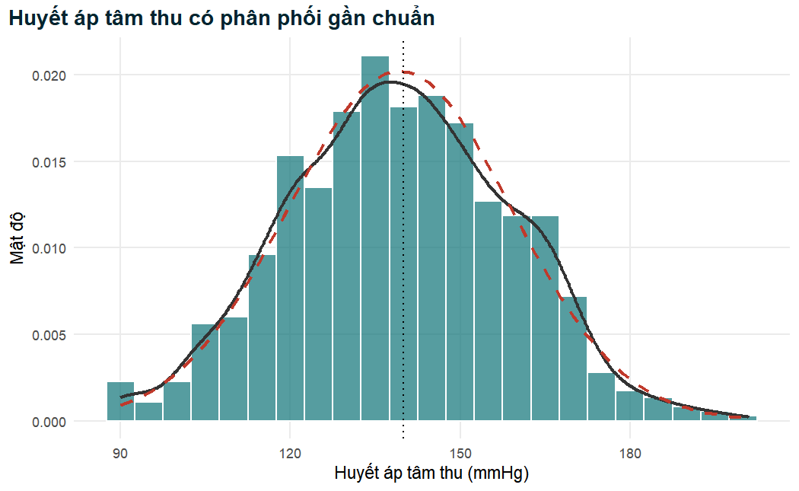
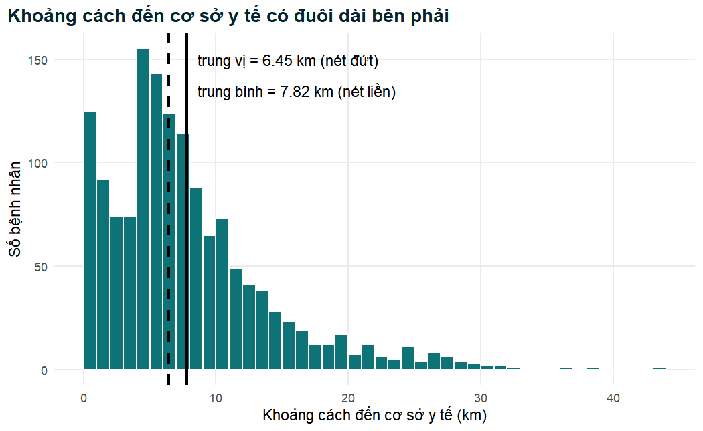
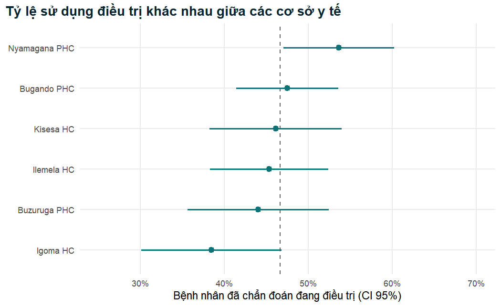
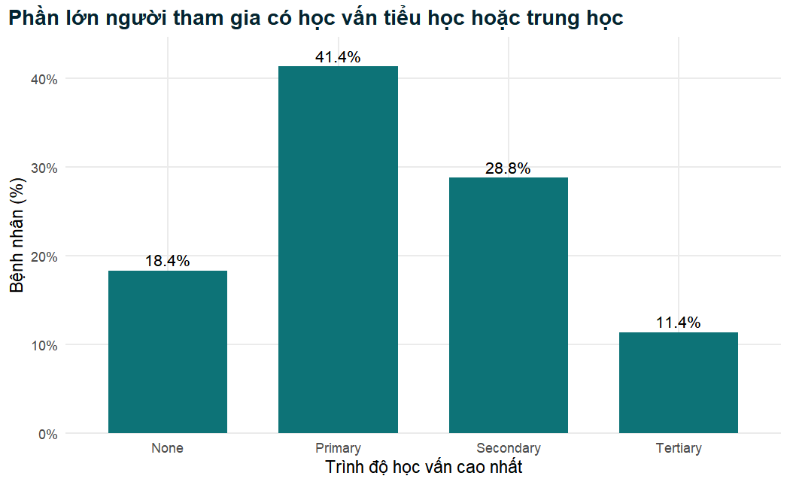
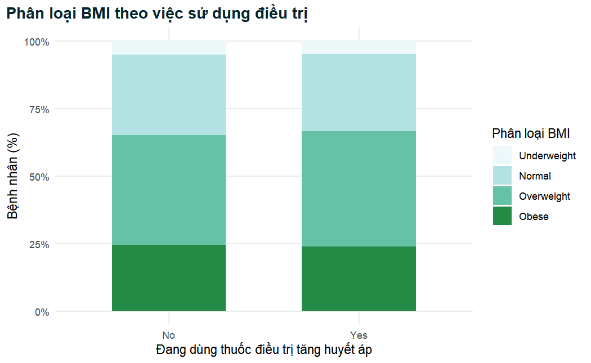
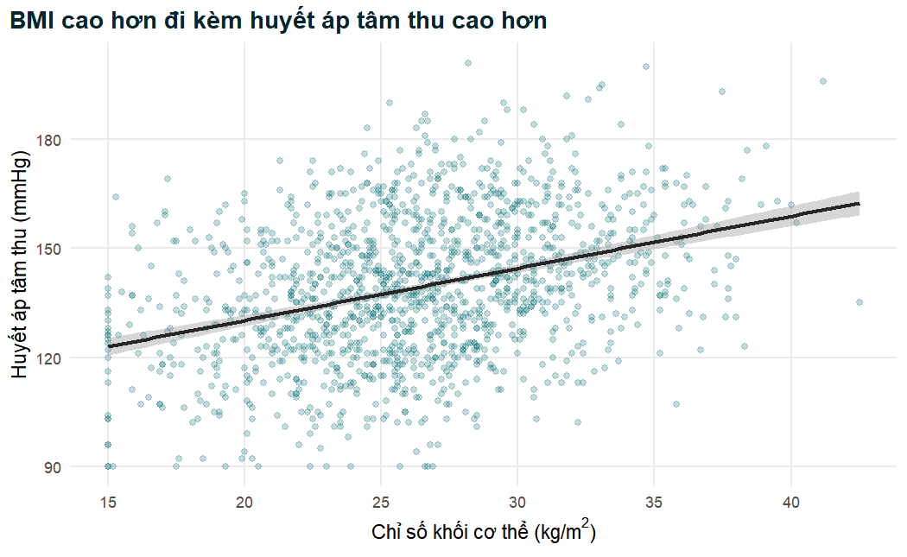
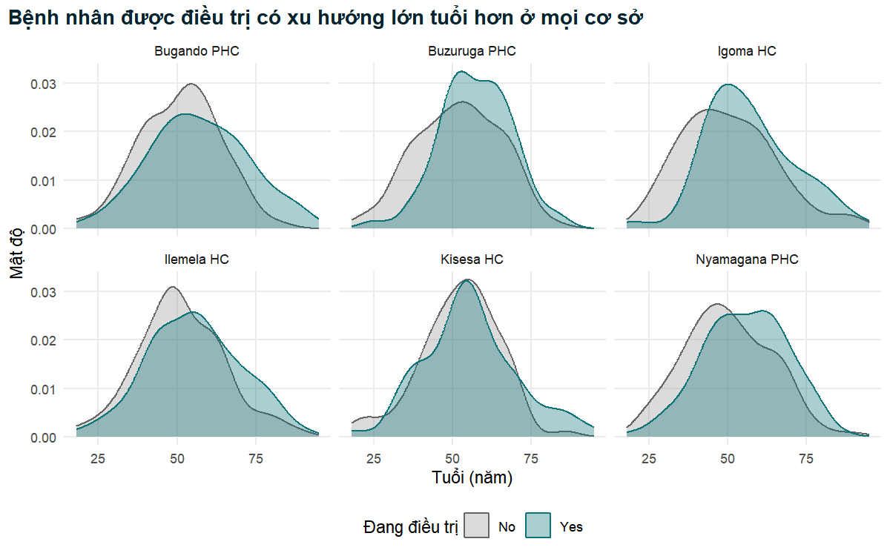

# Thống kê mô tả, bảng và hình {#ch-descriptive}

Mọi bài báo lâm sàng, dù các phân tích phía sau có phức tạp đến đâu, đều bắt đầu bằng cùng
một đoạn văn khiêm tốn: *bệnh nhân là những ai?* Trước khi người đọc có thể đánh giá một mô
hình hồi quy, một tỷ số chênh hay một giá trị p có ý nghĩa gì hay không, họ cần biết người
tham gia bao nhiêu tuổi, bao nhiêu người là phụ nữ, huyết áp của họ cao đến mức nào, bao nhiêu
người mắc đái tháo đường và bao nhiêu thông tin bị khuyết. Đoạn văn đó, cùng với "Bảng 1" đi
kèm, là nền móng cho mọi kết luận suy luận. Nếu phần mô tả sai, cẩu thả hoặc che giấu hình
dạng của dữ liệu, thì không có gì phía sau đáng tin cậy.

Chương này hướng dẫn bạn mô tả một bộ dữ liệu lâm sàng một cách đúng đắn, bằng cả con số lẫn
hình ảnh. Chúng ta bắt đầu từ tệp phân tích đã làm sạch ở Chương 2 và lần lượt tìm hiểu lý
thuyết về các thống kê tóm tắt (trung bình, độ lệch chuẩn hay khoảng tứ phân vị thực sự đo cái
gì, và khi nào nên chọn từng loại), sau đó trình bày cách tính chúng trong R, cách xây dựng
Bảng 1 sẵn sàng cho bản thảo bằng **gtsummary**, và cách vẽ các hình trung thực, đạt chất
lượng xuất bản bằng **ggplot2**. Trên đường đi, chúng ta sẽ gặp sai số chuẩn (standard error)
và khoảng tin cậy (confidence interval), cây cầu nối từ việc mô tả một mẫu sang việc đưa ra
nhận định về một quần thể, vốn là chủ đề của Chương 4.

::: {.objectives}
- Giải thích vì sao mô tả cẩn thận phải đi trước mọi kiểm định thống kê, và một "Bảng 1" cần chứa những gì.
- Ghép mỗi loại biến (liên tục, rời rạc, nhị phân, danh định, thứ bậc) với các cách tóm tắt bằng số và bằng hình phù hợp.
- Định nghĩa và tính trung bình, trung vị, yếu vị, khoảng biến thiên, phương sai, độ lệch chuẩn, phân vị, khoảng tứ phân vị và hệ số biến thiên, đồng thời giải thích các tính chất của chúng.
- Đánh giá hình dạng của một phân phối (tính đối xứng, độ lệch, tính chuẩn) và quyết định dùng trung bình (SD) hay trung vị (IQR).
- Tránh cái bẫy `na.rm` và báo cáo số quan sát đứng sau mọi thống kê tóm tắt.
- Tạo các bảng tóm tắt theo nhóm bằng `dplyr::group_by()` và `summarise()`.
- Tính và diễn giải sai số chuẩn và khoảng tin cậy 95% cho một trung bình và cho một tỷ lệ.
- Xây dựng bảng tần số và bảng chéo, và chọn đúng giữa tỷ lệ phần trăm theo hàng và theo cột.
- Xây dựng Bảng 1 cho bản thảo bằng `gtsummary::tbl_summary()`.
- Vẽ biểu đồ tần suất (histogram), biểu đồ mật độ, biểu đồ cột, biểu đồ hộp và biểu đồ violin, biểu đồ phân tán và biểu đồ chia ô (facet) bằng `ggplot2`, theo các nguyên tắc của đồ họa khoa học tốt.
- Xuất bảng và hình cho bản thảo.
:::

## Vì sao phải mô tả trước khi kiểm định? {#sec-why-describe}

Thống kê mô tả tóm tắt dữ liệu mà bạn thực sự có. Chúng không đưa ra nhận định nào về một quần
thể rộng hơn và không liên quan đến giả thuyết nào; nhiệm vụ của chúng là *cho thấy*. Thống kê
suy luận (khoảng tin cậy, kiểm định giả thuyết, mô hình hồi quy) tiến thêm một bước và dùng mẫu
để nói điều gì đó về quần thể mà mẫu được rút ra. Người ta dễ bị cám dỗ lao ngay sang bước suy
luận, vì đó dường như là nơi chứa "kết quả". Những nhà phân tích giàu kinh nghiệm làm điều ngược
lại: họ dành một phần lớn thời gian cho việc mô tả, vì ít nhất bốn lý do.

1. **Mô tả là kết quả đầu tiên.** Các hướng dẫn báo cáo cho nghiên cứu quan sát đòi hỏi điều
   này. Mục 13 của tuyên bố STROBE yêu cầu tác giả báo cáo số người ở mỗi giai đoạn của nghiên
   cứu, và mục 14 yêu cầu trình bày đặc điểm của người tham gia (nhân khẩu học, lâm sàng, xã
   hội) cùng với số người tham gia bị khuyết dữ liệu ở từng biến quan tâm [@vonelm2007]. Trong
   thực tế, điều này trở thành đoạn đầu tiên của phần Kết quả và Bảng 1 của bài báo.
2. **Mô tả phát hiện vấn đề.** Tuổi tối đa là 200, huyết áp tâm thu bằng 0, một giá trị xét
   nghiệm 999 thực ra là mã cho giá trị khuyết: những điều này được phát hiện nhờ tóm tắt, chứ
   không phải nhờ kiểm định. Chương 2 đã làm sạch các lỗi hiển nhiên, nhưng việc mô tả dữ liệu
   đã làm sạch là bước kiểm tra cuối cùng để chắc chắn rằng việc làm sạch đã thành công.
3. **Mô tả định hướng việc chọn phân tích.** Một biến đối xứng hay lệch, một nhóm hiếm đến mức
   phải gộp với nhóm khác, một biến dự báo có 30% giá trị khuyết: những sự thật này quyết định
   kiểm định và mô hình nào sẽ phù hợp về sau [@altman1991; @kirkwood2003].
4. **Mô tả giúp người đọc đánh giá khả năng khái quát hóa.** Tỷ lệ sử dụng điều trị ở những
   bệnh nhân chăm sóc ban đầu có tuổi trung bình 50, phần lớn là phụ nữ và phần lớn không có bảo
   hiểm, có thể không áp dụng được cho một phòng khám bệnh viện gồm những nam giới trẻ hơn và
   có bảo hiểm. Người đọc chỉ có thể đánh giá điều này nếu bạn cho họ biết ai đã được nghiên cứu.

::: {.callout-note title="Diễn giải lâm sàng"}
Hãy coi Bảng 1 như danh sách bệnh nhân mà một bác sĩ lâm sàng muốn xem trước khi đọc kết luận
của bạn. Nó trả lời câu hỏi "những bệnh nhân này có giống bệnh nhân của tôi không?". Một thử
nghiệm hay một cuộc điều tra mà người tham gia được mô tả sơ sài thì không thể áp dụng an toàn
vào thực hành, dù giá trị p của nó nhỏ đến đâu.
:::

### Chuẩn bị

Như ở mọi chương, chúng ta nạp các gói và đọc tệp phân tích đã làm sạch được lưu ở cuối
Chương 2. Vì biến kết cục chính, `treatment_uptake`, chỉ có ý nghĩa đối với những bệnh nhân đã
được chẩn đoán tăng huyết áp, chúng ta cũng tạo ngay quần thể phân tích `diagnosed` và dùng nó
mỗi khi có liên quan đến biến kết cục.


``` r
library(tidyverse)   # dplyr, ggplot2, tidyr, readr, ...
library(gtsummary)   # Bảng 1 và các bảng tóm tắt khác
library(janitor)     # tabyl() và adorn_*() cho bảng tần số
library(knitr)       # kable() cho các bảng đơn giản
library(scales)      # định dạng phần trăm cho trục và nhãn
library(patchwork)   # ghép nhiều ggplot thành một hình

# Đọc dữ liệu sẵn sàng phân tích đã tạo ở Chương 2
analysis_data <- readRDS("Data/analysis_data.rds")

# Quần thể phân tích cho biến kết cục chính: người đã chẩn đoán tăng huyết áp
diagnosed <- analysis_data |>
  filter(htn_diagnosed == "Yes")

# Một màu được định nghĩa một lần và dùng lại trong mọi hình
teal <- "#0D7377"

c(all_patients = nrow(analysis_data), diagnosed = nrow(diagnosed))
```

```
#> all_patients    diagnosed 
#>         1500         1089
```

Toàn bộ bộ dữ liệu gồm 1500 người trưởng thành đến khám tại sáu cơ sở chăm
sóc sức khỏe ban đầu, trong đó 1089 người đã được chẩn đoán tăng huyết áp. Hãy
ghi nhớ cả hai con số: con số thứ nhất mô tả tất cả những người được tuyển vào, con số thứ hai
là mẫu số cho các nhận định về việc sử dụng điều trị. Một nguồn gây nhầm lẫn phổ biến trong
bản thảo là một tỷ lệ phần trăm không bao giờ nêu rõ mẫu số; trong suốt chương này chúng ta sẽ
luôn nêu rõ.

::: {.callout-warning title="Lỗi thường gặp"}
Dữ liệu là dữ liệu mô phỏng phục vụ giảng dạy. Mọi con số trong chương này chỉ minh họa một
phương pháp; không con số nào là phát hiện lâm sàng thực tế về chăm sóc tăng huyết áp ở bất kỳ
quốc gia hay cơ sở nào.
:::

## Các loại biến và cách tóm tắt phù hợp {#sec-variable-types}

Cách tóm tắt đúng phụ thuộc vào loại biến. Chương 2 đã giới thiệu các loại biến từ góc độ cách
lưu trữ trong R (numeric, character, factor). Ở đây chúng ta xem xét chúng từ góc độ *đo lường*,
vốn là yếu tố quyết định thống kê nào được dùng [@altman1991, ch. 2; @kirkwood2003, ch. 2].

- **Biến số (định lượng)** nhận các giá trị số mà hiệu số giữa chúng có ý nghĩa.
  - Biến *liên tục* về nguyên tắc có thể nhận bất kỳ giá trị nào trong một khoảng: tuổi, huyết
    áp tâm thu (systolic blood pressure, SBP), chỉ số khối cơ thể (body mass index, BMI),
    cholesterol, glucose, khoảng cách đến cơ sở y tế.
  - Biến *rời rạc* là các số đếm: số bệnh đồng mắc, số lần khám. Chúng thường được tóm tắt như
    biến liên tục khi nhận nhiều giá trị, và như biến phân loại khi chỉ nhận vài giá trị.
- **Biến phân loại (định tính)** xếp mỗi người vào một trong một tập hợp các nhóm.
  - Biến *nhị phân* (dichotomous) có hai nhóm: đái tháo đường có/không, sử dụng điều trị
    có/không.
  - Biến *danh định* (nominal) có nhiều hơn hai nhóm và không có thứ tự tự nhiên: cơ sở y tế,
    nghề nghiệp, tình trạng hôn nhân.
  - Biến *thứ bậc* (ordinal) có các nhóm được sắp thứ tự: học vấn (không đi học < tiểu học <
    trung học < sau trung học), hoạt động thể lực (thấp < trung bình < cao), phân loại huyết áp.

Table: Các loại biến trong nghiên cứu tình huống và các cách tóm tắt, biểu đồ phù hợp.

| Loại biến | Ví dụ trong nghiên cứu tình huống | Tóm tắt bằng số | Biểu đồ |
|---|---|---|---|
| Liên tục, đối xứng | `age`, `sbp_mmhg`, `bmi` | trung bình (SD) | histogram, mật độ, biểu đồ hộp |
| Liên tục, lệch | `distance_to_facility_km` | trung vị (IQR) | histogram, biểu đồ hộp |
| Số đếm rời rạc | `comorbidity_count` | trung vị (IQR) hoặc n (%) | biểu đồ cột |
| Nhị phân | `diabetes`, `treatment_uptake` | n (%) | biểu đồ cột |
| Danh định | `facility`, `occupation` | n (%) | biểu đồ cột (đã sắp xếp) |
| Thứ bậc | `education`, `bp_category` | n (%), đôi khi trung vị | biểu đồ cột (theo thứ tự) |

Từ bảng này rút ra hai lời cảnh báo. Thứ nhất, một con số không phải lúc nào cũng là biến số: mã
định danh bệnh nhân hay mã cơ sở y tế được lưu dưới dạng `1`, `2`, `3` là biến phân loại, và
trung bình của chúng vô nghĩa. Thứ hai, các biến liên tục đôi khi được *nhóm* lại thành các
nhóm, như BMI được nhóm thành `bmi_cat` và huyết áp thành `bp_category`. Việc nhóm giúp ích cho
giao tiếp lâm sàng, vì bác sĩ lâm sàng suy nghĩ theo các khái niệm như "béo phì" hay "tăng huyết
áp", nhưng nó làm mất thông tin, vì vậy một Bảng 1 tốt thường trình bày cả giá trị đo liên tục
lẫn phân loại lâm sàng.


``` r
# Cách R lưu mỗi biến: số thực (dbl), factor (fct), factor có thứ tự (ord)
analysis_data |>
  select(age, sbp_mmhg, comorbidity_count, diabetes, facility, education) |>
  glimpse()
```

```
#> Rows: 1,500
#> Columns: 6
#> $ age               <dbl> 74, 56, 54, 33, 86, 70, 45, 59, 46, 61, 70, 56, 4…
#> $ sbp_mmhg          <dbl> 140, 185, 147, 124, 131, 153, 162, 108, 152, 127,…
#> $ comorbidity_count <dbl> 1, 0, 0, 0, 0, 1, 1, 0, 1, 1, 1, 1, 1, 1, 0, 0, 0…
#> $ diabetes          <fct> No, No, No, No, No, No, No, No, No, No, No, No, N…
#> $ facility          <fct> Igoma HC, Kisesa HC, Bugando PHC, Ilemela HC, Kis…
#> $ education         <ord> Primary, Primary, None, Primary, Primary, Primary…
```

`glimpse()` xác nhận rằng các biến liên tục được lưu dưới dạng số (`<dbl>`), các biến danh định
và nhị phân dưới dạng factor (`<fct>`) và học vấn dưới dạng factor *có thứ tự* (`<ord>`), đúng
như đã thiết lập ở Chương 2. Cách lưu trữ khớp với thang đo chính là điều cho phép R, và đặc biệt
là **gtsummary**, tự động chọn các thống kê tóm tắt hợp lý.

## Các số đo xu hướng trung tâm {#sec-central-tendency}

Một số đo xu hướng trung tâm (central tendency, còn gọi là số đo *vị trí*) trả lời câu hỏi "giá
trị điển hình là bao nhiêu?". Có ba số đo thường được sử dụng.

### Trung bình

Trung bình cộng (mean) của $n$ quan sát $x_1, x_2, \ldots, x_n$ là tổng của chúng chia cho $n$:

$$
\bar{x} = \frac{1}{n}\sum_{i=1}^{n} x_i
$$

Trung bình có những tính chất toán học hấp dẫn. Nó sử dụng mọi quan sát; nó là điểm cân bằng
của dữ liệu, theo nghĩa là tổng các độ lệch $x_i - \bar{x}$ bằng không; và nó là giá trị làm
cực tiểu tổng bình phương các độ lệch $\sum (x_i - c)^2$. Hành vi lấy mẫu của nó đã được hiểu
rõ, đó là lý do phần lớn thống kê cổ điển (kiểm định t, phân tích phương sai, hồi quy tuyến
tính) được xây dựng trên trung bình. Điểm yếu của nó là mặt kia của cùng một đồng xu: vì mỗi
quan sát đóng góp tương ứng với độ lớn của nó, chỉ một giá trị cực đoan cũng có thể kéo trung
bình đi rất xa.

### Trung vị

Trung vị (median) là giá trị nằm ở giữa khi các quan sát được sắp xếp từ nhỏ nhất đến lớn nhất.
Nếu $x_{(1)} \le x_{(2)} \le \cdots \le x_{(n)}$ ký hiệu các giá trị đã sắp xếp, thì

$$
\text{median} =
\begin{cases}
x_{((n+1)/2)} & \text{if } n \text{ is odd},\\[4pt]
\tfrac{1}{2}\left(x_{(n/2)} + x_{(n/2+1)}\right) & \text{if } n \text{ is even}.
\end{cases}
$$

(trong đó *odd* là lẻ và *even* là chẵn). Một nửa số quan sát nằm dưới trung vị và một nửa nằm
trên. Vì chỉ *thứ hạng* của các quan sát là quan trọng, chứ không phải độ lớn chính xác của
chúng, trung vị có tính **vững** (robust): làm cho giá trị lớn nhất lớn gấp mười lần cũng không
làm trung vị thay đổi. Trung vị làm cực tiểu tổng các độ lệch tuyệt đối $\sum |x_i - c|$, và nó
là bách phân vị thứ 50, một mối liên hệ mà chúng ta sẽ khai thác khi bàn về phân vị bên dưới.

### Yếu vị

Yếu vị (mode) là giá trị xuất hiện nhiều nhất. Nó hiếm khi hữu ích cho các phép đo liên tục (với
đủ số chữ số thập phân thì mọi giá trị đều là duy nhất) nhưng lại là "giá trị điển hình" tự nhiên
cho một biến danh định: nghề nghiệp phổ biến nhất, cơ sở y tế phổ biến nhất. Một phân phối có
hai đỉnh rõ rệt được gọi là *hai đỉnh* (bimodal), điều này thường báo hiệu rằng hai nhóm bệnh
nhân khác nhau đã bị trộn lẫn với nhau. R cơ bản không có hàm tính yếu vị thống kê (hàm `mode()`
trả về kiểu lưu trữ của một đối tượng, một nguồn gây nhầm lẫn kinh điển), vì vậy chúng ta tự
viết một hàm nhỏ.


``` r
# Yếu vị thống kê: (các) giá trị xuất hiện nhiều nhất của một vector
stat_mode <- function(x) {
  counts <- table(x)                    # tần số của mỗi giá trị (bỏ NA)
  names(counts)[counts == max(counts)]     # (các) giá trị có tần số cao nhất
}

stat_mode(analysis_data$education)   # trình độ học vấn phổ biến nhất
```

```
#> [1] "Primary"
```

``` r
stat_mode(analysis_data$occupation)  # nghề nghiệp phổ biến nhất
```

```
#> [1] "Farmer"
```

``` r
stat_mode(analysis_data$sbp_mmhg)    # (các) giá trị SBP ghi nhận nhiều nhất
```

```
#> [1] "143"
```

Tiểu học (`Primary`) và làm nông (`Farmer`) là các nhóm phổ biến nhất, và đây là những thông tin
hữu ích về quần thể. Yếu vị SBP 143 mmHg thì ít hữu ích hơn nhiều: với hàng trăm giá trị có thể
có, việc giá trị nào tình cờ xuất hiện nhiều nhất phần lớn là do ngẫu nhiên, và nó sẽ thay đổi
với một mẫu khác. Với các phép đo liên tục, yếu vị chủ yếu là công cụ để phát hiện điều bất
thường. Chẳng hạn, trong dữ liệu lâm sàng thực tế, yếu vị SBP là 120 hoặc 140 mmHg và sự dư thừa
các số đo tận cùng bằng 0 hoặc 5 sẽ cho thấy *ưu tiên chữ số* (digit preference), tức xu hướng
của người đo làm tròn các số đo huyết áp thủ công, một nguồn sai số đo lường đã được ghi nhận.

### Tính vững: một giá trị sai gây ra điều gì

Sự khác biệt giữa trung bình và trung vị dễ thấy nhất qua một ví dụ nhỏ. Bảy số đo SBP dưới đây
đều hợp lý. Sau đó chúng ta thay số đo cuối cùng bằng 700 mmHg, đúng loại lỗi nhập liệu mà chúng
ta đã loại bỏ ở Chương 2.


``` r
sbp_small <- c(128, 132, 135, 140, 141, 145, 150)
sbp_error <- c(128, 132, 135, 140, 141, 145, 700)   # một lỗi đánh máy

c(mean = mean(sbp_small), median = median(sbp_small))
```

```
#>   mean median 
#>  138.7  140.0
```

``` r
c(mean = mean(sbp_error), median = median(sbp_error))
```

```
#>   mean median 
#>  217.3  140.0
```

Chỉ một giá trị sai đã đẩy trung bình từ khoảng 139 mmHg lên khoảng 217 mmHg, một giá trị không
mô tả bất kỳ ai trong bảy bệnh nhân, trong khi trung vị vẫn giữ ở 140 mmHg. Đây là ý nghĩa thực
tiễn của tính vững, và cũng là lý do các thống kê tóm tắt của dữ liệu *chưa làm sạch* có thể gây
hiểu lầm nghiêm trọng. Với dữ liệu đã làm sạch, cùng một logic áp dụng cho các giá trị cực đoan
có thật: một vài bệnh nhân sống cách phòng khám 40 km kéo khoảng cách trung bình lên cao, dù phần
lớn bệnh nhân sống gần hơn nhiều.

### Xu hướng trung tâm trong dữ liệu nghiên cứu tình huống


``` r
# Trung bình và trung vị của bốn phép đo lâm sàng (đã loại giá trị khuyết)
analysis_data |>
  summarise(
    across(c(age, sbp_mmhg, bmi, distance_to_facility_km),
           list(mean = ~ mean(.x, na.rm = TRUE),
                median = ~ median(.x, na.rm = TRUE)))
  ) |>
  pivot_longer(everything(),
               names_to = c("variable", ".value"),
               names_pattern = "(.*)_(mean|median)") |>
  kable(digits = 2, caption = "Trung bình và trung vị của bốn biến liên tục.")
```


Table: Trung bình và trung vị của bốn biến liên tục.

|variable                |   mean| median|
|:-----------------------|------:|------:|
|age                     |  52.28|  52.00|
|sbp_mmhg                | 139.29| 139.00|
|bmi                     |  26.35|  26.30|
|distance_to_facility_km |   7.82|   6.45|

Với tuổi, SBP và BMI, trung bình và trung vị gần như bằng nhau (52,3 so với 52 tuổi, 139,3 so
với 139 mmHg, 26,35 so với 26,3 $\text{kg/m}^2$). Sự trùng khớp đó là gợi ý đầu tiên rằng các
phân phối này gần như đối xứng. Khoảng cách đến cơ sở y tế thì khác: trung bình 7,8 km cao hơn
hẳn trung vị 6,45 km, dấu hiệu đặc trưng của một phân phối *lệch phải* với một cái đuôi dài gồm
những bệnh nhân sống ở xa. Chúng ta sẽ trở lại vấn đề này ở Mục 3.5.

## Các số đo độ phân tán {#sec-spread}

Hai nhóm bệnh nhân có thể có cùng SBP trung bình 140 mmHg, trong khi một nhóm dao động từ 130
đến 150 mmHg và nhóm kia từ 100 đến 200 mmHg. Về mặt lâm sàng, đây là hai quần thể rất khác nhau.
Các số đo *độ phân tán* (dispersion, độ biến thiên) định lượng mức độ các quan sát thường nằm
cách xa trung tâm bao nhiêu.

### Khoảng biến thiên

Khoảng biến thiên (range) là hiệu số giữa giá trị lớn nhất và nhỏ nhất, $x_{(n)} - x_{(1)}$.
Trong thực tế, việc báo cáo chính hai giá trị cực trị ("tuổi dao động từ 18 đến 95") cung cấp
nhiều thông tin hơn, đồng thời cũng là một bước kiểm tra dữ liệu. Khoảng biến thiên chỉ phụ thuộc
vào hai quan sát, nên nó cực kỳ nhạy với giá trị ngoại lai và có xu hướng tăng theo cỡ mẫu: bạn
tuyển càng nhiều bệnh nhân, càng dễ gặp một trường hợp cực đoan. Vì vậy đây là một số đo kém về
độ biến thiên, nhưng lại là một cách tốt để kiểm tra tính hợp lý.

### Phương sai và độ lệch chuẩn

Phương sai (variance) là trung bình của bình phương các độ lệch so với trung bình. Với một mẫu,
nó được tính như sau

$$
s^2 = \frac{1}{n-1}\sum_{i=1}^{n}\left(x_i - \bar{x}\right)^2 ,
$$

và **độ lệch chuẩn** (standard deviation, SD) là căn bậc hai của nó:

$$
s = \sqrt{\frac{1}{n-1}\sum_{i=1}^{n}\left(x_i - \bar{x}\right)^2 } .
$$

Việc bình phương các độ lệch có hai tác dụng: nó ngăn các độ lệch dương và âm triệt tiêu lẫn
nhau, và nó cho các độ lệch lớn trọng số lớn hơn các độ lệch nhỏ. Việc lấy căn bậc hai đưa kết
quả trở về đơn vị ban đầu, nên SD của SBP có đơn vị mmHg; đó là lý do người ta báo cáo SD chứ
không phải phương sai. Số chia $n-1$ thay vì $n$ là *bậc tự do* (degrees of freedom): một khi
trung bình đã được ước lượng từ dữ liệu, chỉ còn $n-1$ độ lệch được tự do thay đổi (độ lệch cuối
cùng bị cố định vì tổng các độ lệch bằng không). Việc chia cho $n-1$ làm cho $s^2$ là một ước
lượng không chệch của phương sai quần thể $\sigma^2$ [@kirkwood2003, ch. 4]. Các hàm `var()` và
`sd()` của R dùng $n-1$.

Một cách hữu ích để hình dung SD: nó xấp xỉ khoảng cách điển hình giữa giá trị của một bệnh nhân
và trung bình. Với dữ liệu có phân phối xấp xỉ chuẩn, SD có một cách diễn giải chính xác, được
trình bày ở Mục 3.5.

### Phân vị, tứ phân vị và khoảng tứ phân vị

Một **phân vị** (quantile) chia dữ liệu đã sắp xếp theo những tỷ lệ cho trước. Phân vị thứ $p$,
$Q(p)$, là giá trị mà dưới nó có một tỷ lệ $p$ các quan sát. Phân vị biểu diễn theo phần trăm
được gọi là *bách phân vị* (centile hay percentile), theo phần tư là *tứ phân vị* (quartile),
theo phần năm là *ngũ phân vị* (quintile) [@altman1994sd]. Ba tứ phân vị là

- $Q_1 = Q(0.25)$, tứ phân vị dưới (bách phân vị thứ 25);
- $Q_2 = Q(0.50)$, trung vị;
- $Q_3 = Q(0.75)$, tứ phân vị trên (bách phân vị thứ 75).

**Khoảng tứ phân vị** (interquartile range) là $\text{IQR} = Q_3 - Q_1$, độ rộng của khoảng chứa
một nửa ở giữa của dữ liệu. Giống trung vị, nó chỉ phụ thuộc vào thứ hạng nên có tính vững trước
các giá trị cực đoan. Trong bài báo, thường nên báo cáo hai tứ phân vị hơn là hiệu số của chúng,
ví dụ "trung vị 6,5 km (IQR 4,0 đến 10,3)", vì cặp giá trị này cũng cho thấy tính bất đối xứng:
nếu trung vị gần $Q_1$ hơn nhiều so với $Q_3$, phân phối bị lệch phải.

Có nhiều quy ước để tính một phân vị khi $p(n-1)$ không phải là số nguyên. R cung cấp chín quy
ước (`type = 1` đến `9` trong `quantile()`); quy ước mặc định, type 7, đặt $Q(p)$ tại vị trí
$h = (n-1)p + 1$ trong dữ liệu đã sắp xếp và nội suy tuyến tính giữa hai quan sát lân cận. Với
hàng trăm quan sát, các quy ước cho kết quả giống nhau trong phạm vi làm tròn, nhưng với một vài
giá trị thì chúng khác nhau; điều này giải thích vì sao SPSS, Stata và R có thể cho các tứ phân
vị hơi khác nhau với cùng một mẫu nhỏ.

Gộp lại, giá trị nhỏ nhất, $Q_1$, trung vị, $Q_3$ và giá trị lớn nhất tạo thành **bản tóm tắt
năm số** (five-number summary), đúng là những gì một biểu đồ hộp thể hiện.

### Hệ số biến thiên

SD được biểu diễn theo đơn vị của biến, vì vậy SD của SBP (mmHg) không thể so sánh trực tiếp với
SD của cholesterol (mmol/L). **Hệ số biến thiên** (coefficient of variation, CV) loại bỏ đơn vị
bằng cách biểu diễn SD dưới dạng phần trăm của trung bình:

$$
\text{CV} = 100 \times \frac{s}{\bar{x}} \ \%.
$$

CV được dùng rộng rãi trong y học xét nghiệm để mô tả độ chính xác của một xét nghiệm (một xét
nghiệm có CV 3% có độ lặp lại tốt hơn một xét nghiệm có CV 10%) và để so sánh độ biến thiên
tương đối của các phép đo khác nhau. Nó chỉ có ý nghĩa với các biến đo trên thang tỷ số có điểm
không thực sự và giá trị dương; nó vô nghĩa với nhiệt độ tính bằng độ C hay với một điểm số có
thể âm.

### Độ phân tán trong R


``` r
age <- analysis_data$age

range(age, na.rm = TRUE)       # giá trị nhỏ nhất và lớn nhất
```

```
#> [1] 18 95
```

``` r
var(age, na.rm = TRUE)         # phương sai (năm bình phương)
```

```
#> [1] 198.7
```

``` r
sd(age, na.rm = TRUE)          # độ lệch chuẩn (năm)
```

```
#> [1] 14.1
```

``` r
IQR(age, na.rm = TRUE)         # Q3 - Q1
```

```
#> [1] 19
```

``` r
quantile(age, probs = c(0, 0.25, 0.5, 0.75, 1), na.rm = TRUE)
```

```
#>   0%  25%  50%  75% 100% 
#>   18   43   52   62   95
```

``` r
fivenum(age)                   # bản tóm tắt năm số của Tukey
```

```
#> [1] 18 43 52 62 95
```

Đọc kết quả từng dòng: tuổi dao động từ 18 đến 95, hợp lý với một quần thể người trưởng thành
khám chăm sóc ban đầu và xác nhận việc làm sạch ở Chương 2. Phương sai khoảng 199 *năm bình
phương*, một đơn vị không ai có thể diễn giải, vì thế chúng ta báo cáo căn bậc hai của nó, tức
SD khoảng 14,1 năm. Một nửa ở giữa số bệnh nhân có tuổi từ 43 đến 62, tức IQR là 19 năm.
`quantile()` với năm xác suất và `fivenum()` cho cùng các con số ở đây; `fivenum()` dùng một quy
tắc hơi khác (bản lề Tukey, Tukey's hinges) có thể khác `quantile()` ở các mẫu nhỏ, và nó tự
động loại bỏ giá trị khuyết.

Một cách gọn để xem nhiều biến cùng lúc là một bảng tóm tắt dạng dài. Chúng ta định dạng lại dữ
liệu sao cho mỗi hàng là một phép đo của một bệnh nhân, sau đó tóm tắt theo biến.


``` r
continuous_vars <- c("age", "sbp_mmhg", "dbp_mmhg", "bmi",
                     "total_chol_mmol_l", "fasting_glucose_mmol_l",
                     "distance_to_facility_km")

spread_table <- analysis_data |>
  select(all_of(continuous_vars)) |>
  pivot_longer(everything(), names_to = "variable", values_to = "value") |>
  group_by(variable) |>
  summarise(
    n      = sum(!is.na(value)),            # số quan sát thực sự được dùng
    mean   = mean(value, na.rm = TRUE),
    sd     = sd(value, na.rm = TRUE),
    median = median(value, na.rm = TRUE),
    iqr    = IQR(value, na.rm = TRUE),
    cv_pct = 100 * sd / mean                 # hệ số biến thiên
  )

spread_table |>
  kable(digits = 2,
        caption = "Vị trí trung tâm và độ phân tán của bảy biến liên tục.")
```


Table: Vị trí trung tâm và độ phân tán của bảy biến liên tục.

|variable                |    n|   mean|    sd| median|  iqr| cv_pct|
|:-----------------------|----:|------:|-----:|------:|----:|------:|
|age                     | 1498|  52.28| 14.10|  52.00| 19.0|  26.96|
|bmi                     | 1453|  26.35|  4.87|  26.30|  6.3|  18.48|
|dbp_mmhg                | 1499|  86.00| 10.67|  86.00| 14.0|  12.40|
|distance_to_facility_km | 1440|   7.82|  6.09|   6.45|  6.3|  77.82|
|fasting_glucose_mmol_l  | 1425|   5.45|  0.99|   5.40|  1.2|  18.16|
|sbp_mmhg                | 1498| 139.29| 19.74| 139.00| 27.0|  14.17|
|total_chol_mmol_l       | 1410|   5.11|  0.98|   5.10|  1.4|  19.16|

Bảng này cho thấy nhiều bài học. Cột `n` khác nhau giữa các biến: cholesterol toàn phần có ở
1.410 bệnh nhân nhưng tuổi có ở 1.498 bệnh nhân, vì vậy mỗi thống kê tóm tắt dựa trên một mẫu số
khác nhau, điều mà bản thảo phải báo cáo. SD của SBP khoảng 20 mmHg và của huyết áp tâm trương
(diastolic blood pressure, DBP) khoảng 11 mmHg; so với trung bình của chúng, các giá trị này cho
CV tương tự nhau (14% và 12%). Khoảng cách đến cơ sở y tế có CV gần 78%: bệnh nhân khác nhau rất
nhiều về quãng đường phải đi, một thực tế có hàm ý rõ ràng đối với khả năng tiếp cận chăm sóc.

::: {.callout-tip title="Thực hành tốt"}
Luôn báo cáo số quan sát không khuyết bên cạnh một thống kê tóm tắt. "Cholesterol toàn phần
trung bình 5,1 mmol/L (SD 1,0; n = 1.410)" cho người đọc biết rằng 90 bệnh nhân không được đại
diện, và gợi ra câu hỏi liệu những người này có khác với phần còn lại hay không.
:::

## Hình dạng của một phân phối {#sec-shape}

Trung bình và SD chỉ là bản mô tả đầy đủ của một phân phối khi đã biết hình dạng của nó. Với một
phân phối đối xứng, hình chuông, chúng nói lên gần như mọi điều; với một phân phối lệch, chúng có
thể gây hiểu lầm. Trước khi chọn cách tóm tắt, hãy nhìn vào hình dạng.

### Độ lệch

Một phân phối là **đối xứng** nếu nửa trái và nửa phải của nó là ảnh qua gương của nhau, như
phân phối chuẩn, trong đó trung bình, trung vị và yếu vị trùng nhau. Nó **lệch phải** (lệch
dương, right-skewed) nếu có một cái đuôi dài về bên phải, như thu nhập, thời gian nằm viện, các
giá trị xét nghiệm như triglyceride hay protein phản ứng C, và khoảng cách đến cơ sở y tế. Trong
một phân phối lệch phải, một vài giá trị lớn kéo trung bình lên cao hơn trung vị. Các phân phối
**lệch trái**, với đuôi dài về bên trái, hiếm gặp hơn trong y học; tuổi thai lúc sinh là một ví
dụ kinh điển.

Độ lệch (skewness) có thể được định lượng bằng hệ số độ lệch mẫu,

$$
g_1 = \frac{\frac{1}{n}\sum_{i=1}^{n}(x_i-\bar{x})^3}
           {\left[\frac{1}{n}\sum_{i=1}^{n}(x_i-\bar{x})^2\right]^{3/2}} ,
$$

hệ số này bằng không với một phân phối đối xứng, dương khi lệch phải và âm khi lệch trái. Việc
lập phương các độ lệch giữ nguyên dấu của chúng, nên một đuôi dài bên phải tạo ra một tổng dương
lớn. Theo hướng dẫn sơ bộ, các giá trị nằm giữa $-0.5$ và $0.5$ cho thấy phân phối xấp xỉ đối
xứng và các giá trị vượt quá $\pm 1$ cho thấy lệch rõ rệt, mặc dù một hình vẽ luôn cung cấp nhiều
thông tin hơn một hệ số đơn lẻ.


``` r
# Hệ số độ lệch mẫu g1 (không cần thêm gói nào)
skewness <- function(x) {
  x <- x[!is.na(x)]
  m <- mean(x)
  mean((x - m)^3) / mean((x - m)^2)^1.5
}

analysis_data |>
  summarise(across(all_of(continuous_vars), skewness)) |>
  pivot_longer(everything(), names_to = "variable", values_to = "skewness") |>
  arrange(desc(skewness)) |>
  kable(digits = 2, caption = "Độ lệch mẫu của bảy biến liên tục.")
```


Table: Độ lệch mẫu của bảy biến liên tục.

|variable                | skewness|
|:-----------------------|--------:|
|distance_to_facility_km |     1.51|
|fasting_glucose_mmol_l  |     0.57|
|total_chol_mmol_l       |     0.10|
|age                     |     0.07|
|dbp_mmhg                |     0.05|
|bmi                     |     0.04|
|sbp_mmhg                |     0.03|

Khoảng cách đến cơ sở y tế có độ lệch khoảng 1,5, lệch phải rõ ràng. Glucose lúc đói cho thấy
lệch phải nhẹ (khoảng 0,6), như glucose thường vẫn vậy: một thiểu số bệnh nhân mắc đái tháo
đường chưa được chẩn đoán hoặc kiểm soát kém tạo ra một cái đuôi gồm các giá trị cao. Các biến còn
lại có độ lệch gần bằng không và có thể được coi là đối xứng một cách hợp lý.

### Phân phối chuẩn

Phân phối **chuẩn** (normal distribution, hay phân phối Gauss) là đường cong hình chuông đối xứng
quen thuộc. Nó được xác định hoàn toàn bởi hai tham số, trung bình $\mu$ và độ lệch chuẩn
$\sigma$, và hàm mật độ xác suất của nó là

$$
f(x) = \frac{1}{\sigma\sqrt{2\pi}}\exp\!\left(-\frac{(x-\mu)^2}{2\sigma^2}\right).
$$

Nhiều phép đo sinh học ở các quần thể khỏe mạnh, như chiều cao hay huyết áp, có phân phối xấp xỉ
chuẩn, và phân phối chuẩn đóng vai trò trung tâm trong thống kê vì trung bình mẫu có phân phối
xấp xỉ chuẩn ngay cả khi các quan sát riêng lẻ không như vậy (định lý giới hạn trung tâm, được
dùng ở Mục 3.8). Với phân phối chuẩn, một tỷ lệ cố định các giá trị nằm trong một số SD bất kỳ
cho trước tính từ trung bình [@altman1995normal]:

- khoảng 68% giá trị nằm trong $\mu \pm 1\sigma$;
- khoảng 95% nằm trong $\mu \pm 2\sigma$ (chính xác hơn là $\mu \pm 1.96\sigma$);
- khoảng 99,7% nằm trong $\mu \pm 3\sigma$.

Đây là **quy tắc 68–95–99,7**. Nó giải thích vì sao trung bình và SD là cách tóm tắt hiệu quả đến
vậy cho dữ liệu có phân phối chuẩn: "SBP trung bình 139 mmHg (SD 20)" lập tức cho người đọc biết
rằng khoảng 95% bệnh nhân có SBP trong khoảng từ xấp xỉ 100 đến 179 mmHg. Khoảng
$\bar{x} \pm 1.96 s$ được gọi là *khoảng tham chiếu 95%* (reference range) và là cơ sở của nhiều
"khoảng bình thường" trong xét nghiệm [@altman1991, ch. 14].

Chúng ta có thể kiểm tra quy tắc này bằng thực nghiệm cho SBP bằng cách đếm tỷ lệ bệnh nhân nằm
trong một, hai và ba SD tính từ trung bình.


``` r
sbp   <- na.omit(analysis_data$sbp_mmhg)   # bỏ 2 giá trị khuyết
m_sbp <- mean(sbp)
s_sbp <- sd(sbp)

tibble(k = 1:3) |>
  mutate(
    lower    = m_sbp - k * s_sbp,
    upper    = m_sbp + k * s_sbp,
    observed = map_dbl(k, ~ mean(abs(sbp - m_sbp) <= .x * s_sbp)),
    expected = c(0.683, 0.954, 0.997)     # giá trị lý thuyết (phân phối chuẩn)
  ) |>
  kable(digits = 3,
        caption = "Tỷ lệ giá trị SBP nằm trong k SD tính từ trung bình.")
```


Table: Tỷ lệ giá trị SBP nằm trong k SD tính từ trung bình.

|  k|  lower| upper| observed| expected|
|--:|------:|-----:|--------:|--------:|
|  1| 119.56| 159.0|    0.674|    0.683|
|  2|  99.82| 178.8|    0.961|    0.954|
|  3|  80.09| 198.5|    0.999|    0.997|

Các tỷ lệ quan sát được (khoảng 0,67, 0,96 và 0,999) rất gần với các giá trị kỳ vọng của phân
phối chuẩn, nên trung bình và SD tóm tắt tốt SBP. Hình dưới đây cho thấy cùng điều đó bằng hình
ảnh: histogram của SBP, được chia theo thang mật độ, được phủ lên bởi một đường cong chuẩn có cùng
trung bình và SD với dữ liệu.


``` r
ggplot(analysis_data, aes(x = sbp_mmhg)) +
  # histogram trên thang mật độ để có thể phủ một đường cong lên trên
  geom_histogram(aes(y = after_stat(density)), binwidth = 5,
                 fill = teal, colour = "white", alpha = 0.7, na.rm = TRUE) +
  # ước lượng mật độ kernel: một phiên bản làm trơn của histogram
  geom_density(linewidth = 0.9, colour = "grey20", na.rm = TRUE) +
  # đường cong chuẩn lý thuyết với trung bình và SD của mẫu
  stat_function(fun = dnorm, args = list(mean = m_sbp, sd = s_sbp),
                linetype = "dashed", linewidth = 0.9, colour = "#C0392B") +
  geom_vline(xintercept = 140, linetype = "dotted") +
  labs(title = "Huyết áp tâm thu có phân phối gần chuẩn",
       x = "Huyết áp tâm thu (mmHg)", y = "Mật độ")
```



Ba lớp được vẽ trên cùng một hệ trục. Các cột là histogram; đường liền là *ước lượng mật độ
kernel* (kernel density estimate), mà bạn có thể hình dung như một histogram được làm trơn để
không phụ thuộc vào vị trí các mép cột; đường nét đứt là đường cong chuẩn lý tưởng. Sự gần gũi
giữa đường liền và đường nét đứt là một cách kiểm tra tính chuẩn bằng mắt. Đường thẳng đứng chấm
chấm tại 140 mmHg, ngưỡng quy ước cho tăng huyết áp [@who2021htn], cho thấy hơn một nửa số bệnh
nhân có số đo tăng vào ngày khảo sát. Các kiểm định chính thức và biểu đồ phân vị-phân vị chuẩn
(normal Q-Q plot) được giới thiệu ở Chương 4.

### Khi nào nên báo cáo trung vị (IQR) thay vì trung bình (SD)

Khoảng cách đến cơ sở y tế lại là một câu chuyện khác. Hình tiếp theo trình bày histogram của
biến này với trung bình và trung vị được đánh dấu.


``` r
dist_summary <- analysis_data |>
  summarise(mean = mean(distance_to_facility_km, na.rm = TRUE),
            median = median(distance_to_facility_km, na.rm = TRUE))

ggplot(analysis_data, aes(x = distance_to_facility_km)) +
  geom_histogram(binwidth = 1, boundary = 0, fill = teal,
                 colour = "white", na.rm = TRUE) +
  geom_vline(xintercept = dist_summary$mean, linewidth = 0.9) +
  geom_vline(xintercept = dist_summary$median, linewidth = 0.9,
             linetype = "dashed") +
  # nhãn chữ đặt bên phải hai đường thẳng
  annotate("text", x = dist_summary$mean + 0.8, y = c(150, 135), hjust = 0,
           label = c(sprintf("trung vị = %.2f km (nét đứt)",
                             dist_summary$median),
                     sprintf("trung bình = %.2f km (nét liền)",
                             dist_summary$mean))) +
  labs(title = "Khoảng cách đến cơ sở y tế có đuôi dài bên phải",
       x = "Khoảng cách đến cơ sở y tế (km)", y = "Số bệnh nhân")
```



Phần lớn bệnh nhân sống trong phạm vi khoảng 10 km, nhưng một số ít phải đi từ 30 km trở lên.
Số ít đó kéo trung bình lên 7,8 km, cao hơn trung vị 6,45 km. Hơn nữa, SD (6,1 km) gần lớn bằng
trung bình, nên "trung bình 7,8 km (SD 6,1)", nếu được hiểu như một phân phối chuẩn, sẽ ngụ ý rằng
khoảng một trong mười bệnh nhân sống ở khoảng cách *âm* (giá trị 0 nằm dưới trung bình 1,3 SD),
điều không thể xảy ra. Trung bình và SD đơn giản là ngôn ngữ sai cho hình dạng này. Một quy tắc
thực hành tốt là: **nếu SD lớn hơn khoảng một nửa trung bình đối với một biến không thể nhận giá
trị âm, thì phân phối bị lệch** [@altman1991]. Với những biến như vậy, hãy báo cáo trung vị kèm
khoảng tứ phân vị: "khoảng cách trung vị 6,5 km (IQR 4,0 đến 10,3)".

Tóm lại, lựa chọn được định hướng bởi hình dạng, không phải bởi thói quen:

- **Trung bình (SD)** cho các phân phối xấp xỉ đối xứng (tuổi, SBP, DBP, BMI và cholesterol trong
  bộ dữ liệu này).
- **Trung vị (IQR)** cho các phân phối lệch, các phân phối có giá trị ngoại lai, các biến rời rạc
  có ít giá trị, và các điểm số thứ bậc.
- Khi còn phân vân, hãy báo cáo cả hai, hoặc trình bày phân phối bằng một hình.

::: {.callout-warning title="Lỗi thường gặp"}
Đừng nhầm SD với sai số chuẩn (SE). SD mô tả mức độ *bệnh nhân* khác nhau; SE (Mục 3.8) mô tả mức
độ chính xác của việc ước lượng một *trung bình*. Báo cáo "trung bình ± SE" trong một bảng mô tả
làm cho dữ liệu trông ít biến thiên hơn nhiều so với thực tế, vì SE giảm đi khi mẫu tăng lên trong
khi SD thì không [@altman1994sd].
:::

## Giá trị khuyết và cái bẫy `na.rm` {#sec-na-rm}

Dữ liệu lâm sàng thực tế luôn không đầy đủ, và R được thiết kế để thận trọng với giá trị khuyết.
Trong R, một giá trị khuyết là `NA` ("not available", không có sẵn), và quy tắc rất đơn giản:
*mọi phép tính có liên quan đến một giá trị chưa biết đều cho kết quả chưa biết*. Nếu SBP của một
bệnh nhân bị khuyết, R không thể biết tổng của tất cả các SBP, và do đó không thể biết trung bình.


``` r
sum(is.na(analysis_data$sbp_mmhg))   # có bao nhiêu giá trị SBP bị khuyết?
```

```
#> [1] 2
```

``` r
mean(analysis_data$sbp_mmhg)         # cái bẫy: một NA làm kết quả thành NA
```

```
#> [1] NA
```

``` r
mean(analysis_data$sbp_mmhg, na.rm = TRUE) # cách khắc phục: loại NA trước
```

```
#> [1] 139.3
```

Hai bệnh nhân không được ghi SBP, nên `mean()` trả về `NA`. Thêm `na.rm = TRUE` ("NA remove", loại
bỏ NA) yêu cầu R bỏ các giá trị khuyết và tính trung bình của 1.498 giá trị còn lại. Đối số này
cũng có ở `median()`, `sd()`, `var()`, `quantile()`, `IQR()`, `min()`, `max()`, `range()` và `sum()`.

Cái bẫy này quan trọng nhất với các biến có nhiều giá trị khuyết. Cholesterol toàn phần có 90 giá
trị khuyết.


``` r
chol <- analysis_data$total_chol_mmol_l

c(n_total   = length(chol),
  n_missing = sum(is.na(chol)),
  pct_miss  = round(100 * mean(is.na(chol)), 1),
  mean      = round(mean(chol, na.rm = TRUE), 2))
```

```
#>   n_total n_missing  pct_miss      mean 
#>   1500.00     90.00      6.00      5.11
```

Hãy lưu ý cách viết quen thuộc `mean(is.na(x))`: `is.na()` trả về `TRUE`/`FALSE`, R coi `TRUE` là
1 và `FALSE` là 0, nên trung bình của một vector logic chính là *tỷ lệ* các giá trị `TRUE`. Ở đây
6% giá trị cholesterol bị khuyết. Trung bình 5,1 mmol/L mô tả 1.410 bệnh nhân đã được xét nghiệm,
chứ không phải toàn bộ 1.500 người.

::: {.callout-warning title="Lỗi thường gặp"}
`na.rm = TRUE` làm thông báo lỗi biến mất; nó không làm vấn đề dữ liệu khuyết biến mất. Việc loại
bỏ giá trị khuyết âm thầm thay đổi mẫu số, và nếu những bệnh nhân không có kết quả cholesterol khác
với những người có kết quả (có thể những bệnh nhân nặng nhất đã được chuyển thẳng đến bệnh viện
trước khi lấy máu), thì trung bình bị chệch. Hãy luôn đếm các giá trị khuyết, báo cáo chúng, và
suy nghĩ về lý do chúng bị khuyết [@rubin1976; @little2019].
:::

::: {.callout-tip title="Mẹo"}
Bên trong `summarise()`, nên tính `n = sum(!is.na(x))` bên cạnh mỗi trung bình, như trong bảng độ
phân tán ở Mục 3.4. Khi đó mẫu số luôn đi kèm thống kê và không thể bị quên khi bảng được chép vào
bản thảo.
:::

## Tóm tắt theo nhóm {#sec-grouped}

Thống kê mô tả trở nên giàu thông tin nhất khi chúng ta so sánh các nhóm: bệnh nhân được điều trị
so với không được điều trị, phụ nữ so với nam giới, cơ sở này so với cơ sở khác. Các động từ của
**dplyr** là `group_by()` và `summarise()` làm việc này trong hai bước: `group_by()` chia dữ liệu
thành các nhóm và `summarise()` tính một hàng thống kê cho mỗi nhóm [@wickham2023r4ds].

### Theo việc sử dụng điều trị

Trước tiên chúng ta viết một hàm trợ giúp nhỏ định dạng trung bình và SD thành một chuỗi ký tự
duy nhất, đúng định dạng dùng trong các bảng đã xuất bản. Sau đó chúng ta tóm tắt năm biến theo
việc sử dụng điều trị ở những bệnh nhân đã được chẩn đoán.


``` r
# Định dạng "trung bình (SD)" với một chữ số thập phân
mean_sd <- function(x) {
  sprintf("%.1f (%.1f)", mean(x, na.rm = TRUE), sd(x, na.rm = TRUE))
}

diagnosed |>
  group_by(treatment_uptake) |>
  summarise(
    n         = n(),                       # số bệnh nhân trong mỗi nhóm
    Age       = mean_sd(age),
    SBP       = mean_sd(sbp_mmhg),
    DBP       = mean_sd(dbp_mmhg),
    BMI       = mean_sd(bmi),
    Knowledge = mean_sd(knowledge_score)
  ) |>
  kable(col.names = c("Điều trị", "n", "Tuổi", "SBP", "DBP", "BMI",
                      "Kiến thức"),
        caption = paste("Trung bình (SD) của năm biến theo việc sử dụng",
                        "điều trị ở bệnh nhân đã được chẩn đoán."))
```


Table: Trung bình (SD) của năm biến theo việc sử dụng điều trị ở bệnh nhân đã được chẩn đoán.

|Điều trị |   n|Tuổi        |SBP          |DBP         |BMI        |Kiến thức  |
|:--------|---:|:-----------|:------------|:-----------|:----------|:----------|
|No       | 581|51.1 (13.4) |142.2 (19.8) |88.8 (10.6) |26.8 (4.9) |9.9 (3.4)  |
|Yes      | 508|56.3 (14.1) |148.1 (18.3) |88.2 (10.7) |26.9 (4.7) |10.9 (3.4) |

Trong 1.089 bệnh nhân đã được chẩn đoán, 581 người không điều trị và 508 người có điều trị. Bệnh
nhân được điều trị trung bình lớn hơn khoảng năm tuổi và có điểm kiến thức trung bình cao hơn một
chút (khoảng một điểm trên thang 0–20). SBP trung bình của họ cũng *cao hơn*, điều có vẻ đáng ngạc
nhiên nếu điều trị làm giảm huyết áp. Tuy nhiên, trong một nghiên cứu cắt ngang, chúng ta chỉ
quan sát mỗi bệnh nhân một lần: những bệnh nhân có huyết áp cao nhất là những người dễ được bắt đầu
điều trị nhất, và điều trị không đưa mọi bệnh nhân đạt mục tiêu. Các so sánh mô tả không thể tách
bạch nhân và quả; chúng đặt ra các câu hỏi cho những phân tích ở Chương 4 và 5.

### Theo cơ sở y tế


``` r
diagnosed |>
  group_by(facility) |>
  summarise(
    n             = n(),
    treated       = sum(treatment_uptake == "Yes"),
    pct_treated   = 100 * mean(treatment_uptake == "Yes"),
    median_dist   = median(distance_to_facility_km, na.rm = TRUE),
    pct_insured   = 100 * mean(health_insurance == "Yes")
  ) |>
  arrange(desc(pct_treated)) |>
  kable(digits = 1,
        caption = paste("Sử dụng điều trị, khoảng cách và bảo hiểm theo",
                        "cơ sở y tế (bệnh nhân đã được chẩn đoán)."))
```


Table: Sử dụng điều trị, khoảng cách và bảo hiểm theo cơ sở y tế (bệnh nhân đã được chẩn đoán).

|facility      |   n| treated| pct_treated| median_dist| pct_insured|
|:-------------|---:|-------:|-----------:|-----------:|-----------:|
|Nyamagana PHC | 220|     118|        53.6|         6.4|        36.8|
|Bugando PHC   | 259|     123|        47.5|         6.5|        34.0|
|Kisesa HC     | 154|      71|        46.1|         6.2|        33.1|
|Ilemela HC    | 192|      87|        45.3|         7.2|        35.9|
|Buzuruga PHC  | 134|      59|        44.0|         5.5|        26.1|
|Igoma HC      | 130|      50|        38.5|         5.8|        30.8|

Tỷ lệ sử dụng điều trị dao động từ khoảng 54% ở Nyamagana PHC đến khoảng 39% ở Igoma HC. Việc sắp
xếp theo thống kê quan tâm (`arrange(desc(...))`) làm cho thứ hạng hiện rõ chỉ trong nháy mắt.
Liệu mức chênh lệch này có lớn hơn mức mà riêng yếu tố ngẫu nhiên có thể tạo ra hay không là câu
hỏi dành cho khoảng tin cậy (Mục 3.8) và các kiểm định chính thức (Chương 4). Một lần nữa hãy lưu ý
cách viết `mean(treatment_uptake == "Yes")`: phép so sánh trả về `TRUE`/`FALSE`, và trung bình của
nó là một tỷ lệ.

### Theo hai biến phân nhóm

`group_by()` chấp nhận nhiều biến. Ở đây chúng ta xem SBP trung bình theo giới tính và việc sử dụng
điều trị ở những bệnh nhân đã được chẩn đoán.


``` r
diagnosed |>
  group_by(sex, treatment_uptake) |>
  summarise(n = n(),
            mean_sbp = mean(sbp_mmhg, na.rm = TRUE),
            sd_sbp   = sd(sbp_mmhg, na.rm = TRUE),
            .groups = "drop") |>          # bỏ phân nhóm sau khi tóm tắt
  kable(digits = 1,
        caption = "SBP (mmHg) theo giới tính và việc sử dụng điều trị.")
```


Table: SBP (mmHg) theo giới tính và việc sử dụng điều trị.

|sex    |treatment_uptake |   n| mean_sbp| sd_sbp|
|:------|:----------------|---:|--------:|------:|
|Female |No               | 315|    141.1|   19.8|
|Female |Yes              | 314|    149.1|   17.9|
|Male   |No               | 266|    143.4|   19.8|
|Male   |Yes              | 194|    146.6|   18.9|

Xu hướng quan sát được ở toàn bộ mẫu (SBP cao hơn ở bệnh nhân được điều trị) vẫn đúng ở cả phụ nữ
và nam giới, mặc dù khoảng chênh lớn hơn ở phụ nữ (khoảng 8 mmHg) so với nam giới (khoảng 3 mmHg).
Như vậy, khác biệt chung không đơn thuần do tỷ lệ nam và nữ khác nhau giữa hai nhóm, nhưng độ lớn
của nó có thể phụ thuộc vào giới tính, một gợi ý về điều mà các nhà dịch tễ học gọi là *biến đổi
tác động* (effect modification). Đối số `.groups = "drop"` trả về một kết quả không còn phân nhóm,
giúp tránh những bất ngờ nếu bảng được xử lý tiếp.

::: {.callout-tip title="Thực hành tốt"}
Hãy dùng `across()` để áp dụng cùng một thống kê tóm tắt cho nhiều cột, như ở Mục 3.3 và 3.4, thay
vì sao chép và dán một dòng cho mỗi biến. Ít dòng hơn nghĩa là ít lỗi đánh máy hơn, và việc thêm
một biến chỉ còn là thay đổi một từ.
:::

## Từ mô tả đến suy luận: sai số chuẩn và khoảng tin cậy {#sec-se-ci}

Cho đến giờ chúng ta đã mô tả mẫu. Nhưng mục đích của phần lớn các nghiên cứu lâm sàng là tìm hiểu
về một *quần thể*: tất cả người trưởng thành đến khám chăm sóc ban đầu trong khu vực, chứ không chỉ
1.500 người đã được tuyển vào. Nếu chúng ta rút một mẫu 1.500 người khác, chúng ta sẽ có một SBP
trung bình hơi khác. Nó sẽ dao động bao nhiêu? Câu trả lời là **sai số chuẩn** (standard error), và
nó dẫn thẳng đến **khoảng tin cậy** (confidence interval), công cụ đơn lẻ hữu ích nhất của suy luận
thống kê [@altman1991; @kirkwood2003].

### Sai số chuẩn của trung bình

Hãy tưởng tượng lặp lại nghiên cứu nhiều lần, mỗi lần tính trung bình mẫu $\bar{x}$. Các trung bình
này sẽ tạo thành một phân phối riêng, gọi là *phân phối lấy mẫu của trung bình* (sampling
distribution of the mean). Định lý giới hạn trung tâm cho biết rằng, với các mẫu đủ lớn, phân phối
này xấp xỉ chuẩn, có tâm tại trung bình quần thể $\mu$, với độ lệch chuẩn

$$
\text{SE}(\bar{x}) = \frac{\sigma}{\sqrt{n}} \approx \frac{s}{\sqrt{n}} .
$$

Độ lệch chuẩn này của phân phối lấy mẫu là **sai số chuẩn của trung bình**. Nó giảm theo căn bậc
hai của cỡ mẫu: số bệnh nhân tăng gấp bốn lần thì SE giảm một nửa. Ngược lại, SD không giảm theo
cỡ mẫu, vì bệnh nhân không trở nên giống nhau hơn khi tuyển thêm nhiều người.

### Khoảng tin cậy cho một trung bình

Vì $\bar{x}$ có phân phối xấp xỉ chuẩn với SD bằng SE, khoảng 95% các mẫu cho một trung bình nằm
trong phạm vi 1,96 SE tính từ $\mu$. Đảo ngược nhận định này ta có **khoảng tin cậy** (CI) 95%

$$
\bar{x} \pm t_{n-1,\,0.975}\times\frac{s}{\sqrt{n}} ,
$$

trong đó $t_{n-1,\,0.975}$ là bách phân vị thứ 97,5 của phân phối t Student với $n-1$ bậc tự do
[@student1908]. Với $n$ lớn, giá trị này rất gần 1,96; với các mẫu nhỏ, nó lớn hơn, làm khoảng
rộng ra để tính đến sự bất định trong $s$.


``` r
n_sbp  <- length(sbp)                        # 1.498 giá trị không khuyết
se_sbp <- s_sbp / sqrt(n_sbp)                # sai số chuẩn của trung bình
t_crit <- qt(0.975, df = n_sbp - 1)          # khoảng 1,96 khi n lớn

c(mean = m_sbp, sd = s_sbp, se = se_sbp, t = t_crit,
  lower = m_sbp - t_crit * se_sbp, upper = m_sbp + t_crit * se_sbp)
```

```
#>     mean       sd       se        t    lower    upper 
#> 139.2924  19.7355   0.5099   1.9615 138.2922 140.2926
```

``` r
# Cùng khoảng tin cậy đó từ t.test(), hàm sẽ được trình bày đầy đủ ở Chương 4
t.test(sbp)$conf.int
```

```
#> [1] 138.3 140.3
#> attr(,"conf.level")
#> [1] 0.95
```

SBP trung bình là 139,3 mmHg. SD 19,7 mmHg mô tả mức độ khác nhau giữa từng bệnh nhân; SE chỉ
0,51 mmHg mô tả mức độ chính xác của việc ước lượng trung bình quần thể từ 1.498 bệnh nhân. CI 95%
trải từ khoảng 138,3 đến 140,3 mmHg. `t.test()` cho cùng khoảng này mà không cần tính toán thủ công.

::: {.callout-note title="Diễn giải lâm sàng"}
CI 95% cho biết dữ liệu phù hợp với một SBP trung bình của quần thể nằm ở bất kỳ đâu trong khoảng
từ xấp xỉ 138 đến 140 mmHg. Nói một cách chặt chẽ, "95%" là nói về phương pháp: nếu nghiên cứu được
lặp lại nhiều lần, 95% các khoảng được tính theo cách này sẽ chứa trung bình thật. CI là về *trung
bình*; nó không nói rằng 95% bệnh nhân có SBP trong khoảng này. Để nói điều đó, chúng ta cần khoảng
tham chiếu, trung bình ± 1,96 SD, tức khoảng 101 đến 178 mmHg.
:::

### Khoảng tin cậy cho một tỷ lệ

Cùng một logic áp dụng cho một tỷ lệ. Nếu $x$ trong số $n$ bệnh nhân có một đặc điểm, tỷ lệ mẫu
là $\hat{p} = x/n$, sai số chuẩn của nó là

$$
\text{SE}(\hat{p}) = \sqrt{\frac{\hat{p}(1-\hat{p})}{n}} ,
$$

và CI 95% đơn giản (Wald) là

$$
\hat{p} \pm 1.96 \sqrt{\frac{\hat{p}(1-\hat{p})}{n}} .
$$

Khoảng Wald hoạt động tốt khi cả $n\hat{p}$ và $n(1-\hat{p})$ đều ít nhất khoảng 10. Với các mẫu
nhỏ hoặc tỷ lệ gần 0 hay 1, nó có thể quá hẹp hoặc thậm chí kéo dài xuống dưới 0; **khoảng điểm
Wilson** (Wilson score interval) hoạt động tốt hơn nhiều và là khoảng mà `prop.test()` báo cáo
[@agresti2013, ch. 1]. Với các mẫu lớn, hai khoảng này rất gần nhau.


``` r
x_treated <- sum(diagnosed$treatment_uptake == "Yes") # số được điều trị
n_diag    <- nrow(diagnosed)                 # tất cả người đã chẩn đoán
p_hat     <- x_treated / n_diag
se_p      <- sqrt(p_hat * (1 - p_hat) / n_diag)

# Khoảng Wald, tính thủ công
round(100 * c(p = p_hat, lower = p_hat - 1.96 * se_p,
              upper = p_hat + 1.96 * se_p), 1)
```

```
#>     p lower upper 
#>  46.6  43.7  49.6
```

``` r
# Khoảng điểm Wilson (correct = FALSE tắt hiệu chỉnh liên tục)
round(100 * prop.test(x_treated, n_diag, correct = FALSE)$conf.int, 1)
```

```
#> [1] 43.7 49.6
#> attr(,"conf.level")
#> [1] 0.95
```

Trong 1.089 bệnh nhân đã được chẩn đoán, 508 người (46,6%) đang dùng thuốc điều trị tăng huyết
áp. CI 95% khoảng từ 43,7% đến 49,6% theo cả hai phương pháp. Nói cách khác: dữ liệu phù hợp với
một tỷ lệ sử dụng điều trị trong quần thể ở mức khoảng giữa 40%, và rõ ràng dưới một nửa. Việc ít
hơn một nửa số bệnh nhân đã được chẩn đoán đang điều trị chính là loại "khoảng trống điều trị"
(treatment gap) được báo cáo trong nhiều cuộc điều tra thực tế về chăm sóc tăng huyết áp
[@ncdrisc2021; @mills2020], mặc dù, xin nhắc lại, đây là dữ liệu mô phỏng.

### Khoảng tin cậy theo nhóm

Khoảng tin cậy trở nên đặc biệt giàu thông tin khi so sánh các nhóm. Đoạn mã dưới đây tính tỷ lệ
sử dụng điều trị và CI 95% Wald của nó cho từng cơ sở y tế, và hình tiếp theo biểu diễn các kết
quả đó.


``` r
facility_ci <- diagnosed |>
  group_by(facility) |>
  summarise(n = n(), treated = sum(treatment_uptake == "Yes")) |>
  mutate(p     = treated / n,
         se    = sqrt(p * (1 - p) / n),
         lower = p - 1.96 * se,
         upper = p + 1.96 * se)

facility_ci |>
  mutate(across(c(p, lower, upper), ~ 100 * .x)) |>
  select(facility, n, treated, pct = p, lower, upper) |>
  kable(digits = 1,
        caption = "Tỷ lệ sử dụng điều trị (%) kèm CI 95% theo cơ sở y tế.")
```


Table: Tỷ lệ sử dụng điều trị (%) kèm CI 95% theo cơ sở y tế.

|facility      |   n| treated|  pct| lower| upper|
|:-------------|---:|-------:|----:|-----:|-----:|
|Bugando PHC   | 259|     123| 47.5|  41.4|  53.6|
|Buzuruga PHC  | 134|      59| 44.0|  35.6|  52.4|
|Igoma HC      | 130|      50| 38.5|  30.1|  46.8|
|Ilemela HC    | 192|      87| 45.3|  38.3|  52.4|
|Kisesa HC     | 154|      71| 46.1|  38.2|  54.0|
|Nyamagana PHC | 220|     118| 53.6|  47.0|  60.2|


``` r
ggplot(facility_ci,
       aes(x = p, y = fct_reorder(facility, p))) +   # sắp xếp cơ sở theo p
  geom_vline(xintercept = p_hat, linetype = "dashed", colour = "grey40") +
  geom_pointrange(aes(xmin = lower, xmax = upper),
                  colour = teal, linewidth = 0.8) +
  scale_x_continuous(labels = label_percent(), limits = c(0.25, 0.70)) +
  labs(title = "Tỷ lệ sử dụng điều trị khác nhau giữa các cơ sở y tế",
       x = "Bệnh nhân đã chẩn đoán đang điều trị (CI 95%)", y = NULL)
```



Mỗi điểm là tỷ lệ sử dụng điều trị của một cơ sở và thanh ngang là CI 95% của nó. Các khoảng này
rộng, khoảng ±6 đến ±8 điểm phần trăm, vì mỗi cơ sở chỉ đóng góp 130 đến 260 bệnh nhân đã được
chẩn đoán, so với ±3 điểm khi gộp cả 1.089 người. Igoma HC thấp nhất và Nyamagana PHC cao nhất, và
các khoảng của chúng (30,1% đến 46,8% và 47,0% đến 60,2%) chỉ vừa đủ để không chồng lên nhau; bốn
cơ sở còn lại phù hợp với tỷ lệ chung. Sự chồng lấp giữa các khoảng *không phải* là một kiểm định
chính thức (hai khoảng có thể chồng lên nhau một chút ngay cả khi các nhóm khác nhau có ý nghĩa
thống kê), và việc chọn ra hai cơ sở cực trị trong sáu cơ sở sẽ phóng đại sự tương phản, vì vậy
chúng ta để việc so sánh này cho kiểm định khi bình phương ở Chương 4. Một biểu đồ các ước lượng
kèm khoảng tin cậy, được sắp xếp theo độ lớn, cung cấp nhiều thông tin hơn hẳn một biểu đồ cột tỷ
lệ phần trăm, vì nó cho thấy cả sự bất định lẫn ước lượng.

## Mô tả biến phân loại {#sec-categorical}

Với các biến phân loại, cách tóm tắt tự nhiên là **tần số** (số đếm) và **tần số tương đối** (tỷ
lệ hoặc tỷ lệ phần trăm). Những quyết định thực sự duy nhất là dùng mẫu số nào và xử lý giá trị
khuyết ra sao.

### Bảng tần số với R cơ bản

`table()` đếm từng nhóm và `prop.table()` chuyển số đếm thành tỷ lệ.


``` r
table(analysis_data$sex)                              # số đếm
```

```
#> 
#> Female   Male 
#>    885    615
```

``` r
round(100 * prop.table(table(analysis_data$sex)), 1)  # tỷ lệ phần trăm
```

```
#> 
#> Female   Male 
#>     59     41
```

Mẫu gồm 885 phụ nữ (59,0%) và 615 nam giới (41,0%). Tỷ lệ phụ nữ chiếm ưu thế là điều thường gặp
ở những người đến khám chăm sóc ban đầu tại nhiều nơi, và đó chính là loại thông tin mà Bảng 1
phải báo cáo, vì nó ảnh hưởng đến mức độ khái quát hóa của kết quả.

### Làm cho giá trị khuyết hiện ra

Theo mặc định, `table()` âm thầm bỏ qua `NA`. Với một biến có giá trị khuyết, điều này làm thay
đổi mẫu số mà không báo cho bạn biết.


``` r
table(analysis_data$education)                     # NA bị bỏ qua âm thầm
```

```
#> 
#>      None   Primary Secondary  Tertiary 
#>       270       608       424       168
```

``` r
table(analysis_data$education, useNA = "ifany")    # hiện NA nếu có
```

```
#> 
#>      None   Primary Secondary  Tertiary      <NA> 
#>       270       608       424       168        30
```

Ba mươi bệnh nhân không được ghi trình độ học vấn. Bảng thứ nhất che giấu họ, vì vậy các tỷ lệ
phần trăm tính từ bảng đó sẽ dựa trên 1.470 bệnh nhân trong khi trông như đang mô tả cả 1.500
người. Đối số `useNA = "ifany"` thêm một cột `<NA>` bất cứ khi nào có giá trị khuyết (dùng
`"always"` để hiện cột này ngay cả khi số đếm bằng không).

::: {.callout-tip title="Thực hành tốt"}
Trong bản thảo, tỷ lệ phần trăm của một biến phân loại thường được tính trong số những bệnh nhân
có giá trị đã biết, còn số bị khuyết được báo cáo riêng ("học vấn bị khuyết ở 30 bệnh nhân
(2,0%)"). Dù dùng quy ước nào, hãy nêu rõ trong chú thích của bảng, và đừng bao giờ để giá trị
khuyết biến mất mà không thông báo.
:::

### Bảng tần số gọn gàng với `count()`

`dplyr::count()` trả về một khung dữ liệu (data frame) thay vì một đối tượng bảng, nên kết quả có
thể được chuyển tiếp bằng pipe sang các bước khác, ví dụ để thêm một cột tỷ lệ phần trăm.


``` r
analysis_data |>
  count(bp_category) |>           # NA được giữ thành một hàng riêng
  mutate(percent = round(100 * n / sum(n), 1))
```

```
#> # A tibble: 4 × 3
#>   bp_category      n percent
#>   <fct>        <int>   <dbl>
#> 1 Normal         144     9.6
#> 2 Elevated       357    23.8
#> 3 Hypertension   996    66.4
#> 4 <NA>             3     0.2
```

Theo mặc định, `count()` giữ `NA` thành một hàng riêng. Trong 1.500 bệnh nhân, 996 người (66,4%) có
số đo trong ngưỡng tăng huyết áp, 357 người (23,8%) ở mức tăng (`Elevated`) và 144 người (9,6%) ở
mức bình thường; ba người không thể phân loại vì thiếu một giá trị huyết áp.

### Bảng tần số trau chuốt với janitor

Gói **janitor** cung cấp `tabyl()`, hàm tạo bảng tần số với số đếm, tỷ lệ phần trăm và (khi có
giá trị khuyết) một cột "tỷ lệ hợp lệ" (valid percent) riêng không tính giá trị khuyết, cùng một họ
hàm `adorn_*()` để định dạng chúng cho việc trình bày.


``` r
analysis_data |>
  tabyl(education) |>
  adorn_totals("row") |>                 # thêm hàng Total (tổng)
  adorn_pct_formatting(digits = 1)       # định dạng tỷ lệ thành phần trăm
```

```
#>  education    n percent valid_percent
#>       None  270   18.0%         18.4%
#>    Primary  608   40.5%         41.4%
#>  Secondary  424   28.3%         28.8%
#>   Tertiary  168   11.2%         11.4%
#>       <NA>   30    2.0%             -
#>      Total 1500  100.0%        100.0%
```

Cột `percent` dùng toàn bộ 1.500 bệnh nhân làm mẫu số; `valid_percent` loại 30 giá trị khuyết.
Trình độ tiểu học phổ biến nhất (40,5% trên tổng số bệnh nhân, 41,4% trong số những người biết
trình độ học vấn). Vì education là một factor *có thứ tự*, các nhóm xuất hiện theo thứ tự tự nhiên
thay vì theo bảng chữ cái, một trong những lợi ích của việc thiết lập các mức factor ở Chương 2.

### Bảng chéo

Một **bảng chéo** (cross-tabulation, hay bảng tiếp liên, contingency table) đếm bệnh nhân theo hai
biến phân loại cùng lúc. Ở những bệnh nhân đã được chẩn đoán, hãy lập bảng chéo giữa đái tháo
đường và việc sử dụng điều trị.


``` r
xtab <- table(Diabetes = diagnosed$diabetes,
              Treated  = diagnosed$treatment_uptake)
xtab
```

```
#>         Treated
#> Diabetes  No Yes
#>      No  574 487
#>      Yes   7  21
```

``` r
addmargins(xtab)                              # thêm tổng hàng và tổng cột
```

```
#>         Treated
#> Diabetes   No  Yes  Sum
#>      No   574  487 1061
#>      Yes    7   21   28
#>      Sum  581  508 1089
```

Mỗi ô đếm số bệnh nhân có một tổ hợp nhất định: ví dụ, 21 bệnh nhân đã được chẩn đoán vừa mắc đái
tháo đường *vừa* đang điều trị. `addmargins()` thêm các tổng (`Sum`): 28 bệnh nhân đã được chẩn
đoán mắc đái tháo đường, 508 người được điều trị, và tổng chung là 1.089.

### Tỷ lệ phần trăm theo hàng hay theo cột?

Một bảng hai chiều có thể được chuyển thành tỷ lệ phần trăm theo ba cách, được điều khiển bởi đối
số `margin` của `prop.table()`:

- `margin = 1`: **tỷ lệ phần trăm theo hàng**, mỗi hàng cộng lại bằng 100%;
- `margin = 2`: **tỷ lệ phần trăm theo cột**, mỗi cột cộng lại bằng 100%;
- không có margin: tỷ lệ phần trăm so với tổng chung.


``` r
round(100 * prop.table(xtab, margin = 1), 1) # % hàng: trong nhóm đái tháo đường
```

```
#>         Treated
#> Diabetes   No  Yes
#>      No  54.1 45.9
#>      Yes 25.0 75.0
```

``` r
round(100 * prop.table(xtab, margin = 2), 1) # % cột: trong nhóm điều trị
```

```
#>         Treated
#> Diabetes   No  Yes
#>      No  98.8 95.9
#>      Yes  1.2  4.1
```

Hai bảng trả lời những câu hỏi khác nhau. Với đái tháo đường ở các hàng, **tỷ lệ phần trăm theo
hàng** cho biết 75,0% bệnh nhân đã được chẩn đoán *có đái tháo đường* đang điều trị, so với 45,9%
ở những người không mắc đái tháo đường. **Tỷ lệ phần trăm theo cột** cho biết 4,1% bệnh nhân *được
điều trị* mắc đái tháo đường, so với 1,2% ở bệnh nhân không được điều trị.

Báo cáo tỷ lệ nào phụ thuộc vào câu hỏi. Nếu việc sử dụng điều trị là biến kết cục và đái tháo
đường là một yếu tố quyết định có thể có, như trong nghiên cứu của chúng ta, phép so sánh tự nhiên
là tỷ lệ *được điều trị* trong mỗi nhóm đái tháo đường, ở đây là tỷ lệ phần trăm theo hàng. Quy tắc
là tính tỷ lệ phần trăm **trong các nhóm của biến giải thích**, để mỗi tỷ lệ trả lời câu hỏi
"trong số những bệnh nhân có đặc điểm này, bao nhiêu phần trăm có biến kết cục?" [@altman1991;
@kirkwood2003]. Trong một Bảng 1 được trình bày theo nhóm biến kết cục (các cột = được điều trị và
không được điều trị), quy ước thì ngược lại: tỷ lệ phần trăm theo cột, mô tả thành phần của mỗi
nhóm. Cả hai đều đúng với mục đích của chúng; sai lầm là tính một loại rồi mô tả nó bằng lời lẽ
dành cho loại kia.

::: {.callout-warning title="Lỗi thường gặp"}
"4,1% bệnh nhân đái tháo đường được điều trị" là cách đọc sai tỷ lệ phần trăm theo cột ở trên, vốn
thực ra nói rằng 4,1% bệnh nhân được điều trị mắc đái tháo đường. Trước khi viết một câu về một tỷ
lệ phần trăm, hãy nói to mẫu số là gì: "trong số ___, bao nhiêu phần trăm ___?"
:::

Cũng hãy lưu ý các con số nhỏ: chỉ 28 bệnh nhân đã được chẩn đoán mắc đái tháo đường, nên con số
75,0% dựa trên 21 trong 28 bệnh nhân và có khoảng tin cậy rộng. Các ô có số đếm nhỏ là dấu hiệu
cảnh báo cho các phân tích về sau (Chương 4 giải thích vì sao trong tình huống này kiểm định khi
bình phương có thể được thay bằng kiểm định chính xác Fisher).

### Bảng chéo với janitor

`tabyl()` cũng tạo được bảng hai chiều, và các hàm adorn thêm tổng, tỷ lệ phần trăm và số đếm gốc
trong một cách hiển thị dễ đọc.


``` r
diagnosed |>
  tabyl(diabetes, treatment_uptake) |>
  adorn_totals(c("row", "col")) |>
  adorn_percentages("row") |>            # tỷ lệ phần trăm theo hàng
  adorn_pct_formatting(digits = 1) |>
  adorn_ns() |>                          # thêm số đếm trong ngoặc
  adorn_title("combined")                # ghi nhãn chung cho hàng và cột
```

```
#>  diabetes/treatment_uptake          No         Yes          Total
#>                         No 54.1% (574) 45.9% (487) 100.0% (1,061)
#>                        Yes 25.0%   (7) 75.0%  (21) 100.0%    (28)
#>                      Total 53.4% (581) 46.6% (508) 100.0% (1,089)
```

Giờ đây mỗi ô hiển thị tỷ lệ phần trăm theo hàng, theo sau là số đếm, ví dụ "75.0% (21)", đây là
định dạng mà nhiều tạp chí ưa chuộng: tỷ lệ phần trăm để so sánh, số đếm để người đọc thấy nó đại
diện cho bao nhiêu bệnh nhân.

## Xây dựng Bảng 1 với gtsummary {#sec-table1}

### Bảng 1 cần có những gì

Bảng 1 của một bài báo lâm sàng mô tả đặc điểm của những người tham gia nghiên cứu. Theo STROBE,
bảng này nên trình bày các đặc điểm nhân khẩu học, lâm sàng và xã hội, thông tin về các phơi nhiễm
và các yếu tố gây nhiễu tiềm tàng, và số người tham gia bị khuyết dữ liệu ở từng biến
[@vonelm2007]. Trong nghiên cứu cắt ngang về việc sử dụng điều trị của chúng ta, một Bảng 1 điển
hình sẽ trình bày:

- các biến **nhân khẩu học**: tuổi, giới tính, nơi cư trú, học vấn, bảo hiểm y tế;
- các biến **hành vi**: hút thuốc, rượu bia, hoạt động thể lực;
- các biến **lâm sàng**: BMI, huyết áp, đái tháo đường, tiền sử gia đình;
- **khả năng tiếp cận và kiến thức**: khoảng cách đến cơ sở y tế, điểm kiến thức;

thường cho toàn bộ mẫu và theo biến phân nhóm chính, ở đây là việc sử dụng điều trị ở những bệnh
nhân đã được chẩn đoán. Mỗi biến liên tục được tóm tắt bằng trung bình (SD) hoặc trung vị (IQR) tùy
theo phân phối của nó, và mỗi biến phân loại bằng n (%).

Xây dựng một bảng như vậy bằng tay, từng ô một, vừa chậm vừa dễ sai: chỉ một lần sao chép-dán nhầm
là một tỷ lệ phần trăm đã xuất bản sẽ sai. Gói **gtsummary** tự động hóa toàn bộ quy trình
[@sjoberg2021]. Nó xem xét từng biến, chọn một thống kê tóm tắt hợp lý, định dạng các con số, và
tạo ra một bảng có thể xuất sang Word, HTML hoặc PDF.

### Bảng 1 đầu tiên


``` r
diagnosed |>
  select(age, sex, residence, health_insurance, diabetes,
         treatment_uptake) |>
  tbl_summary(by = treatment_uptake) |>   # mỗi nhóm sử dụng điều trị một cột
  as_kable(caption = "Bảng 1 đầu tiên: kết quả mặc định của gtsummary.")
```


Table: Bảng 1 đầu tiên: kết quả mặc định của gtsummary.

|**Characteristic** | **No**  N = 581 | **Yes**  N = 508 |
|:------------------|:---------------:|:----------------:|
|age                |   51 (41, 60)   |   56 (47, 66)    |
|Unknown            |        1        |        0         |
|sex                |                 |                  |
|Female             |    315 (54%)    |    314 (62%)     |
|Male               |    266 (46%)    |    194 (38%)     |
|residence          |                 |                  |
|Rural              |    306 (53%)    |    195 (38%)     |
|Urban              |    275 (47%)    |    313 (62%)     |
|health_insurance   |    162 (28%)    |    202 (40%)     |
|diabetes           |    7 (1.2%)     |    21 (4.1%)     |

Chỉ với một dòng mã thực sự, `tbl_summary()` đã tạo ra một bảng dùng được. Cách đọc bảng:

- Tiêu đề cột cho biết cỡ của mỗi nhóm: 581 bệnh nhân đã được chẩn đoán không điều trị (`No`) và
  508 bệnh nhân có điều trị (`Yes`).
- Tuổi, một biến liên tục, được tóm tắt bằng *trung vị (Q1, Q3)*, mặc định của gtsummary cho biến
  liên tục, vì trung vị và IQR an toàn bất kể hình dạng phân phối.
- Giới tính và nơi cư trú có hai mức, nên cả hai mức đều được liệt kê kèm n (%).
- Bảo hiểm y tế và đái tháo đường là các biến Yes/No, nên gtsummary chỉ hiển thị hàng `"Yes"`
  (có), tức một cách tóm tắt *nhị phân* (dichotomous), đây là cách trình bày theo quy ước và gọn
  hơn.
- Nhãn hàng là tên biến gốc (`age`, `health_insurance`), và một bệnh nhân bị khuyết tuổi xuất hiện
  ở hàng có nhãn `Unknown` (không rõ). Cả hai cần được chỉnh sửa trước khi xuất bản.
- Tỷ lệ phần trăm được làm tròn thành số nguyên, trừ khi dưới 10% thì hiển thị một chữ số thập
  phân.
- Các tỷ lệ phần trăm là **tỷ lệ phần trăm theo cột**: chúng mô tả thành phần của mỗi nhóm. Con số
  cho bảo hiểm y tế trong cột `No` là tỷ lệ người có bảo hiểm trong số 581 bệnh nhân *không được
  điều trị*, chứ không phải tỷ lệ người không được điều trị trong số những người có bảo hiểm.

Điểm cuối cùng cần được lưu ý cẩn thận, và chúng ta sẽ quay lại sau khi tùy chỉnh bảng.

### Tùy chỉnh thống kê, nhãn và giá trị khuyết

Một bảng cho bản thảo cần nhãn dễ đọc, thống kê phù hợp với từng biến, số chữ số thập phân nhất
quán và cách xử lý dữ liệu khuyết rõ ràng.


``` r
table1 <- diagnosed |>
  select(age, sex, residence, education, health_insurance,
         bmi, sbp_mmhg, diabetes, knowledge_score,
         distance_to_facility_km, treatment_uptake) |>
  tbl_summary(
    by = treatment_uptake,
    # các biến đối xứng: trung bình (SD); khoảng cách bị lệch: trung vị (IQR)
    statistic = list(
      all_continuous()  ~ "{mean} ({sd})",
      distance_to_facility_km ~ "{median} ({p25}, {p75})",
      all_categorical() ~ "{n} ({p}%)"
    ),
    digits = list(all_continuous() ~ 1, all_categorical() ~ c(0, 1)),
    label = list(
      age ~ "Tuổi, năm",
      sex ~ "Giới tính",
      residence ~ "Nơi cư trú",
      education ~ "Học vấn",
      health_insurance ~ "Bảo hiểm y tế",
      bmi ~ "BMI, kg/m^2",
      sbp_mmhg ~ "Huyết áp tâm thu, mmHg",
      diabetes ~ "Đái tháo đường",
      knowledge_score ~ "Điểm kiến thức (0-20)",
      distance_to_facility_km ~ "Khoảng cách đến cơ sở y tế, km"
    ),
    missing = "ifany",            # chỉ hiện hàng Khuyết khi cần
    missing_text = "Khuyết"
  ) |>
  # cột Chung (overall) đặt đầu tiên
  add_overall(last = FALSE, col_label = "**Chung**  \nN = {N}") |>
  modify_header(label = "**Đặc điểm**")

table1 |>
  as_kable(caption = paste("Đặc điểm của bệnh nhân tăng huyết áp đã được",
                           "chẩn đoán theo việc sử dụng điều trị."))
```


Table: Đặc điểm của bệnh nhân tăng huyết áp đã được chẩn đoán theo việc sử dụng điều trị.

|**Đặc điểm**                   | **Chung**  N = 1089 | **No**  N = 581 | **Yes**  N = 508 |
|:------------------------------|:-------------------:|:---------------:|:----------------:|
|Tuổi, năm                      |     53.5 (14.0)     |   51.1 (13.4)   |   56.3 (14.1)    |
|Khuyết                         |          1          |        1        |        0         |
|Giới tính                      |                     |                 |                  |
|Female                         |     629 (57.8%)     |   315 (54.2%)   |   314 (61.8%)    |
|Male                           |     460 (42.2%)     |   266 (45.8%)   |   194 (38.2%)    |
|Nơi cư trú                     |                     |                 |                  |
|Rural                          |     501 (46.0%)     |   306 (52.7%)   |   195 (38.4%)    |
|Urban                          |     588 (54.0%)     |   275 (47.3%)   |   313 (61.6%)    |
|Học vấn                        |                     |                 |                  |
|None                           |     201 (18.9%)     |   126 (22.1%)   |    75 (15.2%)    |
|Primary                        |     444 (41.7%)     |   252 (44.2%)   |   192 (38.8%)    |
|Secondary                      |     292 (27.4%)     |   137 (24.0%)   |   155 (31.3%)    |
|Tertiary                       |     128 (12.0%)     |    55 (9.6%)    |    73 (14.7%)    |
|Khuyết                         |         24          |       11        |        13        |
|Bảo hiểm y tế                  |     364 (33.4%)     |   162 (27.9%)   |   202 (39.8%)    |
|BMI, kg/m^2                    |     26.8 (4.8)      |   26.8 (4.9)    |    26.9 (4.7)    |
|Khuyết                         |         33          |       19        |        14        |
|Huyết áp tâm thu, mmHg         |    144.9 (19.4)     |  142.2 (19.8)   |   148.1 (18.3)   |
|Khuyết                         |          1          |        0        |        1         |
|Đái tháo đường                 |      28 (2.6%)      |    7 (1.2%)     |    21 (4.1%)     |
|Điểm kiến thức (0-20)          |     10.4 (3.5)      |    9.9 (3.4)    |    10.9 (3.4)    |
|Khuyết                         |         29          |       16        |        13        |
|Khoảng cách đến cơ sở y tế, km |   6.3 (3.8, 10.2)   | 6.8 (4.3, 10.7) |  5.8 (3.1, 9.6)  |
|Khuyết                         |         47          |       20        |        27        |

Đây là một bảng có thể đưa vào bản thảo mà không cần chỉnh sửa thêm nhiều. Những điểm cần lưu ý
trong mã và kết quả:

- `statistic` nhận một danh sách các *công thức* (formula): vế trái chọn biến (bằng các hàm trợ
  giúp như `all_continuous()` và `all_categorical()`, hoặc bằng tên), vế phải là một khuôn mẫu
  trong đó `{mean}`, `{sd}`, `{median}`, `{p25}`, `{p75}`, `{n}` và `{p}` được thay bằng các giá trị
  đã tính. Quy tắc riêng cho khoảng cách ghi đè quy tắc chung cho các biến liên tục.
- `digits` đặt một chữ số thập phân cho các thống kê của biến liên tục, và số đếm nguyên với một
  chữ số thập phân cho tỷ lệ phần trăm.
- `label` thay tên biến bằng các nhãn dễ đọc có kèm đơn vị.
- `missing = "ifany"` thêm một hàng "Khuyết" dưới mỗi biến có giá trị khuyết, như STROBE yêu cầu.
  Giá trị khuyết *không* được tính vào mẫu số của các tỷ lệ phần trăm.
- `add_overall()` thêm một cột cho tất cả bệnh nhân đã được chẩn đoán, ở đây được đặt đầu tiên
  (đối số `col_label` đặt tiêu đề tiếng Việt cho cột này).

Đọc nội dung bảng, bệnh nhân được điều trị trung bình lớn tuổi hơn (56,3 so với 51,1 tuổi), là phụ
nữ nhiều hơn (61,8% so với 54,2%), sống ở thành thị nhiều hơn (61,6% so với 47,3%), có học vấn cao
hơn, có bảo hiểm nhiều hơn (39,8% so với 27,9%) và mắc đái tháo đường nhiều hơn, có điểm kiến thức
cao hơn khoảng một điểm, và sống gần cơ sở y tế hơn một chút (trung vị 5,8 so với 6,8 km). SBP
trung bình của họ cao hơn, vì những lý do đã thảo luận ở Mục 3.7, trong khi BMI gần như giống hệt
nhau ở hai nhóm. Đây là những khác biệt *mô tả*; liệu chúng có lớn hơn mức do ngẫu nhiên hay không,
và liệu chúng có còn tồn tại sau khi hiệu chỉnh lẫn nhau hay không, là những câu hỏi dành cho
Chương 4 và 5.

::: {.callout-note title="Diễn giải lâm sàng"}
Các tỷ lệ phần trăm trong mỗi cột mô tả nhóm đó. "Đái tháo đường: 21 (4,1%)" trong cột được điều
trị có nghĩa là 4,1% bệnh nhân được điều trị mắc đái tháo đường. Nó *không* có nghĩa là 4,1% bệnh
nhân đái tháo đường được điều trị (con số đó là 75%, từ tỷ lệ phần trăm theo hàng ở Mục 3.9). Nếu
câu hỏi của bạn là "việc sử dụng điều trị khác nhau thế nào theo tình trạng đái tháo đường?", hãy
báo cáo tỷ lệ phần trăm theo hàng trong phần văn bản, hoặc dùng
`tbl_summary(by = diabetes, percent = "row")`.
:::

### Bảng 1 có nên chứa giá trị p?

`gtsummary` có thể thêm một cột giá trị p bằng `add_p()`, hàm này chọn một kiểm định cho mỗi biến
(kiểm định tổng hạng Wilcoxon hoặc kiểm định t cho biến liên tục, kiểm định khi bình phương hoặc
kiểm định chính xác Fisher cho biến phân loại). Việc có *nên* làm vậy hay không vẫn còn tranh luận.

Trong một **thử nghiệm ngẫu nhiên**, Bảng 1 so sánh các nhóm được hình thành do ngẫu nhiên. Theo
định nghĩa, mọi khác biệt ban đầu đều do ngẫu nhiên, nên một kiểm định ý nghĩa thống kê đặt ra một
câu hỏi mà câu trả lời đã được biết trước; do đó hướng dẫn CONSORT và nhiều nhà thống kê khuyên
không nên đưa giá trị p vào bảng đặc điểm ban đầu của một thử nghiệm [@altman1991]. Điều quan trọng
là liệu sự mất cân bằng ban đầu có đủ lớn để có ý nghĩa *lâm sàng* hay không, điều mà giá trị p
không thể cho bạn biết.

Trong một **nghiên cứu quan sát** như nghiên cứu của chúng ta, việc so sánh các nhóm được xác định
theo biến kết cục là một phân tích thực sự (chưa hiệu chỉnh) về mối liên quan, và giá trị p dễ được
biện minh hơn. Dù vậy, một cột giá trị p trong Bảng 1 khiến người đọc coi "p < 0,05" như một phán
quyết cho từng biến, khuyến khích việc kiểm định nhiều lần, và làm lẫn lộn ý nghĩa thống kê với ý
nghĩa lâm sàng [@wasserstein2016; @greenland2016]. Một giải pháp dung hòa hợp lý, được áp dụng trong
cuốn sách này, là giữ Bảng 1 ở dạng mô tả và trình bày các kiểm định cùng các ước lượng hiệu ứng kèm
khoảng tin cậy trong một bảng phân tích riêng (Chương 4 và 5). Nếu một tạp chí yêu cầu giá trị p,
gtsummary thêm chúng chỉ bằng một dòng, và các kiểm định được giải thích ở Chương 4:


``` r
diagnosed |>
  select(age, sex, diabetes, treatment_uptake) |>
  tbl_summary(by = treatment_uptake,
              statistic = all_continuous() ~ "{mean} ({sd})",
              label = list(age ~ "Tuổi, năm", sex ~ "Giới tính",
                           diabetes ~ "Đái tháo đường"),
              missing_text = "Khuyết") |>
  add_p(test = list(age ~ "t.test")) |>   # kiểm định t Welch cho tuổi
  modify_header(label = "**Đặc điểm**", p.value = "**Giá trị p**") |>
  as_kable(caption = "Bảng 1 có cột giá trị p (dùng thận trọng).")
```


Table: Bảng 1 có cột giá trị p (dùng thận trọng).

|**Đặc điểm**   | **No**  N = 581 | **Yes**  N = 508 | **Giá trị p** |
|:--------------|:---------------:|:----------------:|:-------------:|
|Tuổi, năm      |     51 (13)     |     56 (14)      |    <0.001     |
|Khuyết         |        1        |        0         |               |
|Giới tính      |                 |                  |     0.011     |
|Female         |    315 (54%)    |    314 (62%)     |               |
|Male           |    266 (46%)    |    194 (38%)     |               |
|Đái tháo đường |    7 (1.2%)     |    21 (4.1%)     |     0.002     |

::: {.callout-warning title="Lỗi thường gặp"}
Một giá trị p không có ý nghĩa thống kê trong Bảng 1 không chứng tỏ rằng các nhóm "có thể so sánh
được", và một giá trị p có ý nghĩa không chứng tỏ rằng một biến là yếu tố gây nhiễu. Không có bằng
chứng không phải là bằng chứng của sự không có [@altman1995absence]. Hãy đánh giá sự mất cân bằng
qua độ lớn của khác biệt, và xử lý nhiễu bằng hiệu chỉnh (Chương 5).
:::

## Vẽ hình với ggplot2 {#sec-figures}

Bảng cho các con số chính xác; hình cho thấy các xu hướng, hình dạng và giá trị ngoại lai mà bảng
che giấu. Một hình tốt thường là phần được đọc nhiều nhất của một bài báo. Trong R, công cụ tiêu
chuẩn là **ggplot2** [@wickham2016ggplot2], gói mà chúng ta đã dùng cho các histogram ở trên.

### Ngữ pháp đồ họa

ggplot2 hiện thực hóa một *ngữ pháp đồ họa* (grammar of graphics): thay vì chọn từ một danh sách
các loại biểu đồ, bạn mô tả một biểu đồ như sự kết hợp của các thành phần độc lập
[@wickham2016ggplot2]:

- **dữ liệu** (data): khung dữ liệu cần vẽ;
- **ánh xạ thẩm mỹ** (aesthetic mappings, `aes()`): biến nào được ánh xạ vào thuộc tính thị giác
  nào, như vị trí trên trục x và y, màu đường viền, màu tô, kích thước hay hình dạng;
- **đối tượng hình học** (`geom_*()`): những gì được vẽ, như điểm, cột, đường, hộp;
- **phép biến đổi thống kê** (`stat_*()`): các phép tính được áp dụng trước khi vẽ, như việc chia
  khoảng trong histogram hay đường khớp trong một phép làm trơn;
- **thang đo** (`scale_*()`): cách các giá trị dữ liệu được chuyển thành giá trị thị giác, bao gồm
  các mốc và nhãn trên trục và bảng màu;
- **chia ô** (facets, `facet_wrap()`, `facet_grid()`): các biểu đồ nhỏ lặp lại, mỗi phân nhóm một
  ô;
- **hệ tọa độ và chủ đề** (theme): hệ tọa độ và phần trình bày không thuộc dữ liệu.

Một biểu đồ được xây dựng bằng cách cộng thêm các lớp bằng dấu `+`. Mọi biểu đồ trong chương này
đều theo cùng một khuôn mẫu:


``` r
ggplot(data = <DATA>, aes(x = <X>, y = <Y>, fill = <GROUP>)) +
  geom_<TYPE>(<thiết lập cố định như colour hoặc alpha>) +
  labs(title = "...", x = "... (đơn vị)", y = "...") +
  theme_minimal()
```

Một điểm phân biệt thường làm người mới bắt đầu bối rối: một thuộc tính được *ánh xạ* vào một biến
thì đặt bên trong `aes()` (`aes(fill = treatment_uptake)` tô màu các cột theo nhóm), còn một thuộc
tính được *đặt* bằng một hằng số thì đặt bên ngoài (`fill = teal` tô mọi cột màu xanh mòng két).

### Các nguyên tắc của biểu đồ khoa học tốt

Một vài nguyên tắc, rút ra từ @weissgerber2015 và @wickham2016ggplot2, sẽ cải thiện gần như mọi
hình:

1. **Hãy cho thấy dữ liệu.** Bất cứ khi nào cỡ mẫu cho phép, hãy trình bày từng quan sát hoặc toàn
   bộ phân phối của chúng, chứ không chỉ một thống kê tóm tắt.
2. **Chọn hình phù hợp với loại biến**: histogram hoặc biểu đồ mật độ cho một biến liên tục, biểu
   đồ cột cho một biến phân loại, biểu đồ hộp, violin hoặc biểu đồ điểm cho một biến liên tục theo
   nhóm, biểu đồ phân tán cho hai biến liên tục.
3. **Ghi nhãn trục kèm đơn vị** và viết chú thích hình sao cho có thể hiểu được mà không cần đọc
   phần văn bản.
4. **Sắp xếp các nhóm một cách có ý nghĩa**: biến thứ bậc theo thứ tự tự nhiên của chúng, biến danh
   định theo tần số hoặc theo thống kê quan tâm.
5. **Dùng màu có mục đích**, để mã hóa một biến, không phải để trang trí; ưu tiên các bảng màu vẫn
   phân biệt được khi in đen trắng và với người đọc mù màu.
6. **Tránh "rác biểu đồ"** (chart junk): hiệu ứng ba chiều, lưới đậm và trục kép thêm mực mà không
   thêm thông tin.

### Biểu đồ cột cho biến phân loại

`geom_bar()` tự đếm số hàng trong mỗi nhóm, nên nó nhận dữ liệu gốc chứ không phải một bảng đã tính
sẵn. Để hiển thị tỷ lệ phần trăm, chúng ta tính chúng trước và dùng `geom_col()`, hàm vẽ các cột có
chiều cao cho trước.


``` r
edu_pct <- analysis_data |>
  filter(!is.na(education)) |>
  count(education) |>
  mutate(pct = n / sum(n))

ggplot(edu_pct, aes(x = education, y = pct)) +
  geom_col(fill = teal, width = 0.7) +
  geom_text(aes(label = percent(pct, accuracy = 0.1)),   # ghi nhãn cho mỗi cột
            vjust = -0.4, size = 3.5) +
  scale_y_continuous(labels = label_percent(),
                     expand = expansion(mult = c(0, 0.08))) +
  labs(title = "Phần lớn người tham gia có học vấn tiểu học hoặc trung học",
       x = "Trình độ học vấn cao nhất", y = "Bệnh nhân (%)")
```



Vì `education` là một factor có thứ tự, các cột xuất hiện theo thứ tự tự nhiên, từ không đi học
(`None`) đến sau trung học (`Tertiary`). Ghi nhãn tỷ lệ phần trăm cho mỗi cột giúp người đọc không
phải ước lượng giá trị từ trục. Chú thích hình nêu rõ mẫu số và những gì đã bị loại ra.

Để so sánh phân phối của một biến phân loại *giữa các nhóm*, biểu đồ cột chồng 100% là một lựa chọn
gọn. Hình tiếp theo trình bày phân loại BMI theo việc sử dụng điều trị ở những bệnh nhân đã được
chẩn đoán.


``` r
diagnosed |>
  filter(!is.na(bmi_cat)) |>
  ggplot(aes(x = treatment_uptake, fill = bmi_cat)) +
  geom_bar(position = "fill", width = 0.6) +      # "fill" = chồng 100%
  scale_y_continuous(labels = label_percent()) +
  scale_fill_brewer(palette = "BuGn") +   # bảng màu tuần tự, biến có thứ tự
  labs(title = "Phân loại BMI theo việc sử dụng điều trị",
       x = "Đang dùng thuốc điều trị tăng huyết áp", y = "Bệnh nhân (%)",
       fill = "Phân loại BMI")
```



`position = "fill"` điều chỉnh mỗi cột về 100%, nên các cột so sánh *tỷ lệ* chứ không phải số đếm.
Một bảng màu tuần tự (từ nhạt đến đậm) phản ánh thứ tự của các nhóm BMI. Hai cột trông rất giống
nhau: đặc điểm BMI của bệnh nhân được điều trị và không được điều trị gần như như nhau.

### Biểu đồ hộp, biểu đồ violin và vì sao biểu đồ cột của trung bình che giấu dữ liệu

Một hình rất phổ biến trong các bài báo lâm sàng là biểu đồ cột của trung bình các nhóm kèm thanh
sai số (cái gọi là "biểu đồ thuốc nổ", dynamite plot). @weissgerber2015 đã chỉ ra rằng những biểu
đồ như vậy rất phổ biến và gây hiểu lầm: nhiều phân phối khác nhau (đối xứng, lệch, hai đỉnh, có giá
trị ngoại lai, hoặc có cỡ mẫu rất chênh lệch) có thể tạo ra cùng một cột. Cột cũng gợi ý rằng các
giá trị nằm giữa số không và trung bình, điều vô nghĩa với một phép đo như huyết áp. Hình dưới đây
đặt hai cách tiếp cận cạnh nhau cho cùng một dữ liệu.


``` r
# Ô A: cột trung bình +/- SE (biểu đồ nên tránh)
sbp_means <- diagnosed |>
  group_by(treatment_uptake) |>
  summarise(mean = mean(sbp_mmhg, na.rm = TRUE),
            se = sd(sbp_mmhg, na.rm = TRUE) / sqrt(sum(!is.na(sbp_mmhg))))

p_bar <- ggplot(sbp_means, aes(x = treatment_uptake, y = mean)) +
  geom_col(fill = "grey70", width = 0.6) +
  geom_errorbar(aes(ymin = mean - se, ymax = mean + se), width = 0.2) +
  labs(title = "A. Cột trung bình (± SE)",
       x = "Đang điều trị", y = "Huyết áp tâm thu (mmHg)")

# Ô B: violin + hộp + các điểm rải ngẫu nhiên (cho thấy dữ liệu)
p_violin <- ggplot(diagnosed, aes(x = treatment_uptake, y = sbp_mmhg)) +
  geom_violin(fill = teal, alpha = 0.25, colour = NA, na.rm = TRUE) +
  geom_jitter(width = 0.15, alpha = 0.25, size = 0.8, na.rm = TRUE) +
  geom_boxplot(width = 0.18, outlier.shape = NA, fill = "white",
               alpha = 0.8, na.rm = TRUE) +
  labs(title = "B. Violin, hộp và điểm",
       x = "Đang điều trị", y = "Huyết áp tâm thu (mmHg)")

p_bar + p_violin      # patchwork đặt hai biểu đồ cạnh nhau
```


Ô A gợi ý hai nhóm tách biệt gọn gàng. Ô B cho thấy sự thật: hai phân phối chồng lên nhau gần như
hoàn toàn, với SBP ở cả hai nhóm dao động từ khoảng 100 đến 200 mmHg; khác biệt trung bình khoảng
6 mmHg là nhỏ so với độ phân tán giữa các bệnh nhân. Mỗi thành phần của ô B đều mang thông tin:

- **violin** là một ước lượng mật độ được phản chiếu đối xứng, cho thấy hình dạng của phân phối;
- **biểu đồ hộp** cho thấy trung vị (đường đậm), các tứ phân vị (hai cạnh hộp, nên chiều cao hộp là
  IQR) và các *râu* (whiskers), kéo dài đến các giá trị cực trị nhất nằm trong phạm vi 1,5 × IQR
  tính từ hộp; theo quy ước, các điểm nằm ngoài râu được đánh dấu là giá trị ngoại lai tiềm tàng
  (chúng ta ẩn chúng bằng `outlier.shape = NA` vì các điểm rải ngẫu nhiên đã hiển thị mọi bệnh
  nhân);
- **các điểm rải ngẫu nhiên** (jittered points) là từng bệnh nhân, được dịch ngang một cách ngẫu
  nhiên để không chồng lên nhau.

Dấu `+` giữa hai biểu đồ đã lưu được cung cấp bởi **patchwork**, gói ghép nhiều ggplot thành một
hình.

::: {.callout-tip title="Thực hành tốt"}
Với một biến kết cục liên tục được so sánh giữa các nhóm, hãy ưu tiên biểu đồ hộp, biểu đồ violin
hoặc biểu đồ điểm, và thêm các điểm riêng lẻ khi mỗi nhóm có ít hơn vài trăm quan sát
[@weissgerber2015]. Hãy dành biểu đồ cột cho số đếm và tỷ lệ phần trăm, nơi chiều dài của cột tính
từ số không thực sự biểu diễn đại lượng đó.
:::

### Biểu đồ phân tán cho hai biến liên tục

Mối quan hệ giữa hai biến liên tục được thể hiện bằng biểu đồ phân tán (scatter plot). Ở đây chúng
ta vẽ SBP theo BMI cho tất cả bệnh nhân và thêm một đường thẳng khớp với dữ liệu.


``` r
ggplot(analysis_data, aes(x = bmi, y = sbp_mmhg)) +
  # độ trong suốt (alpha) làm các vùng dày đặc, chồng lấp hiện đậm hơn
  geom_point(alpha = 0.25, colour = teal, na.rm = TRUE) +
  # xu hướng đường thẳng (tuyến tính) kèm dải tin cậy 95%
  geom_smooth(method = "lm", formula = y ~ x, colour = "grey15",
              na.rm = TRUE) +
  labs(title = "BMI cao hơn đi kèm huyết áp tâm thu cao hơn",
       x = expression("Chỉ số khối cơ thể (kg/m"^2*")"),
       y = "Huyết áp tâm thu (mmHg)")
```



Mỗi điểm là một bệnh nhân. Độ trong suốt (`alpha = 0.25`) làm các vùng dày đặc đậm hơn, để việc
các điểm vẽ chồng lên nhau không che giấu nơi tập trung phần lớn bệnh nhân. Đường thẳng, được khớp
theo phương pháp bình phương tối thiểu với `method = "lm"`, đi lên từ trái sang phải: trung bình,
bệnh nhân có BMI cao hơn có SBP cao hơn. Dải màu xám là khoảng tin cậy 95% cho SBP *trung bình* tại
mỗi giá trị BMI, hẹp vì có nhiều bệnh nhân. Đám mây điểm quanh đường thẳng rộng, nên BMI chỉ giải
thích một phần khiêm tốn sự biến thiên SBP giữa các cá nhân. Việc đo lường và kiểm định mối liên
quan này (tương quan) được trình bày ở Chương 4, và bản thân đường hồi quy ở Chương 5.

::: {.callout-note title="Diễn giải lâm sàng"}
Độ dốc dương phù hợp với mối liên hệ đã được xác lập rõ giữa thừa cân và tăng huyết áp
[@mills2020]. Trong một nghiên cứu cắt ngang, nó chỉ cho thấy mối liên quan: nó không thể chứng
minh rằng giảm BMI sẽ làm giảm SBP ở những bệnh nhân này, và các yếu tố khác như tuổi có thể góp
phần vào cả hai.
:::

### Chia ô: các biểu đồ nhỏ lặp lại

Khi một phép so sánh cần được lặp lại qua các phân nhóm, **chia ô** (facets) vẽ cùng một biểu đồ
một lần cho mỗi phân nhóm, trên các trục chung, để các ô có thể được so sánh trực tiếp. Hình dưới
đây trình bày phân phối tuổi của bệnh nhân đã được chẩn đoán có điều trị và không điều trị, riêng
cho từng cơ sở y tế.


``` r
ggplot(diagnosed, aes(x = age, fill = treatment_uptake,
                      colour = treatment_uptake)) +
  geom_density(alpha = 0.35, na.rm = TRUE) +
  facet_wrap(~ facility, ncol = 3) +                 # mỗi cơ sở một ô
  scale_fill_manual(values = c(No = "grey60", Yes = teal)) +
  scale_colour_manual(values = c(No = "grey40", Yes = teal)) +
  labs(title = "Bệnh nhân được điều trị có xu hướng lớn tuổi hơn ở mọi cơ sở",
       x = "Tuổi (năm)", y = "Mật độ",
       fill = "Đang điều trị", colour = "Đang điều trị") +
  theme(legend.position = "bottom")
```



Trong mọi ô, đường cong màu xanh mòng két (được điều trị) dịch sang phải so với đường màu xám
(không được điều trị); chênh lệch tuổi trung bình dao động từ khoảng 3 năm ở Kisesa HC, nơi hai
đường cong gần như trùng nhau, đến khoảng 7 năm ở Igoma HC. Do đó, khác biệt về tuổi quan sát được
ở toàn bộ mẫu không phải do một cơ sở bất thường tạo ra mà nhất quán về chiều hướng ở các cơ sở.
Chia ô là một cách đơn giản và mạnh mẽ để kiểm tra xem một xu hướng là chung hay do một phân nhóm
chi phối, và nó báo trước ý tưởng về phân tích phân tầng và biến đổi tác động.

## Xuất bảng và hình {#sec-export}

Một bản thảo, một báo cáo gửi bộ ngành hay một trang chiếu cho cuộc họp cần các tệp, không phải kết
quả hiển thị của R. Nguyên tắc cũng giống như với làm sạch dữ liệu: tệp nên được tạo ra bằng mã, để
có thể tái tạo giống hệt bất cứ khi nào dữ liệu hoặc phân tích thay đổi.

### Hình

`ggsave()` lưu một biểu đồ vào tệp có định dạng được chọn theo phần mở rộng (`.png`, `.pdf`,
`.tiff`, `.svg`). Các tạp chí thường yêu cầu ít nhất 300 điểm mỗi inch (dpi) cho ảnh raster, hoặc
một định dạng vector như PDF. Ở đây chúng ta lưu vào thư mục tạm của R; trong dự án của riêng bạn,
bạn sẽ dùng một thư mục như `outputs/`.


``` r
p_scatter <- ggplot(analysis_data, aes(x = bmi, y = sbp_mmhg)) +
  geom_point(alpha = 0.25, colour = teal, na.rm = TRUE) +
  labs(x = "BMI (kg/m^2)", y = "Huyết áp tâm thu (mmHg)")

out_png <- file.path(tempdir(), "fig_sbp_bmi.png")
ggsave(out_png, plot = p_scatter, width = 7, height = 5, dpi = 300)
file.exists(out_png)
```

```
#> [1] TRUE
```

Luôn truyền đối tượng biểu đồ bằng `plot =` thay vì dựa vào "biểu đồ được hiển thị gần nhất", và
đặt `width` và `height` một cách tường minh (mặc định tính bằng inch) để cỡ chữ nhất quán giữa các
hình.

### Bảng

Một bảng gtsummary có thể được chuyển thành **flextable**, gói ghi bảng Word gốc mà các đồng tác giả
có thể chỉnh sửa, hoặc thành bảng **gt** cho HTML. Các khung dữ liệu đơn giản có thể được ghi ra CSV
cho đồng nghiệp dùng phần mềm khác.


``` r
out_docx <- file.path(tempdir(), "table1.docx")
table1 |>
  as_flex_table() |>                          # gtsummary -> flextable
  flextable::save_as_docx(path = out_docx)    # ghi ra tài liệu Word

out_csv <- file.path(tempdir(), "spread_table.csv")
write_csv(spread_table, out_csv)              # CSV thuần cho mọi phần mềm

file.exists(c(out_docx, out_csv))
```

```
#> [1] TRUE TRUE
```

Trong một dự án thực tế, cùng đoạn mã đó sẽ ghi vào thư mục kết quả của bạn, ví dụ:


``` r
# Bên trong dự án phân tích của riêng bạn (không chạy ở đây)
ggsave("outputs/figure2_sbp_bmi.pdf", plot = p_scatter, width = 7, height = 5)
table1 |>
  as_flex_table() |>
  flextable::save_as_docx(path = "outputs/table1.docx")
table1 |> as_gt() |> gt::gtsave("outputs/table1.html")
```

::: {.callout-tip title="Thực hành tốt"}
Đừng bao giờ gõ lại bằng tay các con số từ kết quả R vào bản thảo. Hãy xuất bảng trực tiếp, và với
các con số trong văn bản hãy dùng mã R nội dòng (inline R code) trong R Markdown (như cuốn sách này
làm), để mọi con số tự động cập nhật khi dữ liệu thay đổi [@xie2015; @peng2011].
:::

## Tóm tắt {#sec-ch3-summary}

Mô tả là bước đầu tiên và cơ bản nhất của mọi phân tích lâm sàng. Trong chương này, chúng ta đã mô
tả quần thể của nghiên cứu tình huống bằng số và bằng hình. Chúng ta đã ghép các thống kê tóm tắt
với các loại biến; định nghĩa trung bình, trung vị và yếu vị, và thấy một lỗi duy nhất làm dịch
chuyển trung bình nhưng không làm dịch chuyển trung vị ra sao; đo độ phân tán bằng khoảng biến
thiên, phương sai, SD, phân vị, IQR và CV; xem xét hình dạng qua độ lệch và quy tắc 68–95–99,7 của
phân phối chuẩn, và dùng nó để chọn giữa trung bình (SD) và trung vị (IQR). Chúng ta đã gặp cái bẫy
`na.rm` và vấn đề quan trọng hơn mà nó che giấu, đó là mẫu số âm thầm thay đổi. Chúng ta đã tạo các
bảng tóm tắt theo nhóm, tính sai số chuẩn và khoảng tin cậy cho một trung bình và một tỷ lệ, xây
dựng bảng tần số và bảng chéo với tỷ lệ phần trăm đúng, lập Bảng 1 cho bản thảo bằng gtsummary, và
vẽ các hình trung thực bằng ggplot2 trước khi xuất chúng ra tệp.

::: {.callout-important title="Điểm chính"}
- Mô tả trước khi kiểm định: phần mô tả người tham gia là kết quả đầu tiên của mọi nghiên cứu và là
  Bảng 1 của mọi bài báo (các mục 13 và 14 của STROBE).
- Dùng trung bình (SD) cho các biến liên tục đối xứng và trung vị (IQR) cho các biến lệch; kiểm tra
  hình dạng bằng histogram, không theo thói quen.
- SD mô tả sự biến thiên giữa các bệnh nhân; SE mô tả độ chính xác của một trung bình. Đừng bao giờ
  dùng SE để mô tả một mẫu.
- `na.rm = TRUE` loại giá trị khuyết khỏi phép tính; hãy luôn đếm và báo cáo chúng.
- CI 95% ($\bar{x} \pm 1.96\,\text{SE}$, hoặc $\hat{p} \pm 1.96\,\text{SE}$) thể hiện độ chính xác
  của một ước lượng và cung cấp nhiều thông tin hơn chỉ riêng ước lượng.
- Làm cho giá trị khuyết hiện ra trong bảng tần số (`useNA = "ifany"`, `tabyl()`).
- Tính tỷ lệ phần trăm trong các nhóm của biến giải thích, và luôn nêu rõ mẫu số; cần biết mình đang
  đọc tỷ lệ phần trăm theo hàng hay theo cột.
- `gtsummary::tbl_summary()` xây dựng một Bảng 1 có thể tái lập; hãy giữ nó ở dạng mô tả và trình
  bày các kiểm định và ước lượng hiệu ứng riêng.
- Hãy cho thấy dữ liệu: ưu tiên biểu đồ hộp, violin và biểu đồ điểm thay vì biểu đồ cột của trung
  bình, và ghi nhãn trục kèm đơn vị.
- Xuất bảng và hình bằng mã (`ggsave()`, `as_flex_table()`), không bao giờ bằng cách gõ lại.
:::

## Đọc thêm {#sec-ch3-further}

- @altman1991, chương 2–4: một trình bày kinh điển, rõ ràng về các loại dữ liệu, thống kê tóm tắt
  và cách trình bày chúng, được viết cho các nhà nghiên cứu y học.
- @kirkwood2003, chương 2–6: trình bày súc tích về tóm tắt dữ liệu định lượng và phân loại, phân
  phối chuẩn, sai số chuẩn và khoảng tin cậy.
- @weissgerber2015: một bài báo ngắn, thuyết phục về lý do biểu đồ cột của trung bình gây hiểu lầm,
  kèm các phương án thay thế thực tế.
- @sjoberg2021: bài báo mô tả gtsummary, với các ví dụ về những bảng mà gói này có thể tạo ra.
- @wickham2016ggplot2: cuốn sách về ggplot2 của chính tác giả gói, giải thích sâu về ngữ pháp đồ
  họa.

## Bài tập {#sec-ch3-exercises}

::: {.exercise title="Bài tập 3.1"}
Dùng `analysis_data`, tính trung bình, SD, trung vị và IQR của `age` và của
`distance_to_facility_km`, nhớ dùng `na.rm = TRUE`. Mỗi biến có bao nhiêu giá trị khuyết? Với mỗi
biến, hãy quyết định trung bình (SD) hay trung vị (IQR) là cách tóm tắt tốt hơn, và lý giải lựa
chọn của bạn bằng các con số.
:::

::: {.exercise title="Bài tập 3.2"}
Với `ldl_mmol_l` (cholesterol LDL), hãy cho thấy `mean()` trả về gì khi không có `na.rm = TRUE`. Sau
đó báo cáo số lượng và tỷ lệ phần trăm giá trị khuyết, trung bình và SD ở những bệnh nhân có kết
quả, và hệ số biến thiên. Viết một câu báo cáo kết quả như cách nó sẽ xuất hiện trong một bài báo.
:::

::: {.exercise title="Bài tập 3.3"}
Lập bảng tần số (số đếm và tỷ lệ phần trăm) của `smoking` và `bp_category` cho tất cả bệnh nhân,
sao cho giá trị khuyết hiện ra. Dùng cả `table(..., useNA = "ifany")` và `janitor::tabyl()`. Bao
nhiêu phần trăm bệnh nhân hiện đang hút thuốc (a) trong tổng số bệnh nhân và (b) trong số những
người biết tình trạng hút thuốc?
:::

::: {.exercise title="Bài tập 3.4"}
Ở những bệnh nhân đã được chẩn đoán (`htn_diagnosed == "Yes"`), lập bảng chéo `health_insurance`
theo `treatment_uptake`. Tính cả tỷ lệ phần trăm theo hàng và theo cột. Bao nhiêu phần trăm bệnh
nhân đã được chẩn đoán *có bảo hiểm* đang điều trị, và bao nhiêu phần trăm ở nhóm *không có bảo
hiểm*? Tỷ lệ phần trăm nào trả lời câu hỏi "bảo hiểm có liên quan đến việc sử dụng điều trị
không?", và vì sao?
:::

::: {.exercise title="Bài tập 3.5"}
Ở những bệnh nhân đã được chẩn đoán, tính SBP trung bình kèm sai số chuẩn và khoảng tin cậy 95%
riêng cho bệnh nhân được điều trị và không được điều trị, dùng `group_by()` và `summarise()`. Sau
đó tính tỷ lệ đang điều trị ở bệnh nhân đã được chẩn đoán sống ở nông thôn và ở thành thị, mỗi tỷ
lệ kèm CI 95%. Giải thích bằng lời sự khác biệt giữa SD và SE trong kết quả của bạn.
:::

::: {.exercise title="Bài tập 3.6"}
Xây dựng một Bảng 1 cho bệnh nhân đã được chẩn đoán, phân tầng theo `treatment_uptake`, bằng
`gtsummary::tbl_summary()`, gồm `age`, `sex`, `residence`, `education`, `health_insurance`,
`family_history_htn`, `knowledge_score` và `comorbidity_count`. Dùng trung bình (SD) cho tuổi và
điểm kiến thức, trung vị (IQR) cho số bệnh đồng mắc, nhãn dễ đọc, một cột chung và một hàng dữ liệu
khuyết khi cần. Nêu tên hai đặc điểm khác nhau giữa các nhóm và cho biết những khác biệt đó có hợp
lý về mặt lâm sàng hay không.
:::

::: {.exercise title="Bài tập 3.7"}
Vẽ (a) một biểu đồ hộp kèm các điểm rải ngẫu nhiên của `knowledge_score` theo `treatment_uptake` ở
những bệnh nhân đã được chẩn đoán, và (b) một biểu đồ cột tỷ lệ phần trăm bệnh nhân đã được chẩn
đoán đang điều trị theo `education`, theo thứ tự tự nhiên của các trình độ học vấn. Đặt cho cả hai
hình tiêu đề giàu thông tin, nhãn trục và một câu theo kiểu chú thích hình mô tả những gì chúng
cho thấy.
:::

::: {.exercise title="Bài tập 3.8"}
(Thử thách.) Với mỗi cơ sở y tế, ở những bệnh nhân đã được chẩn đoán, hãy tính số bệnh nhân, tỷ lệ
phần trăm đang điều trị kèm CI 95% Wilson (`prop.test()`), khoảng cách trung vị đến cơ sở và tỷ lệ
phần trăm có bảo hiểm. Trình bày kết quả dưới dạng một bảng được sắp xếp theo tỷ lệ sử dụng điều
trị, và vẽ biểu đồ phân tán tỷ lệ sử dụng điều trị của cơ sở (trục y) theo khoảng cách trung vị
(trục x), với các điểm được ghi nhãn bằng tên cơ sở. Tỷ lệ sử dụng điều trị ở cấp cơ sở có vẻ liên
quan đến khoảng cách không? Vì sao các kết luận rút ra từ sáu cơ sở cần được đưa ra hết sức thận
trọng?
:::
