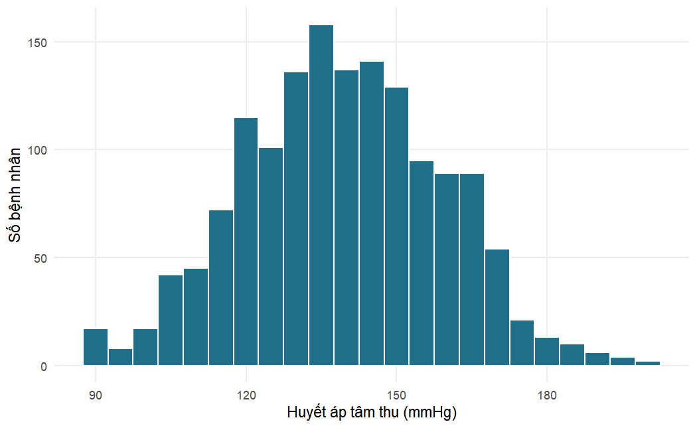

## Chương 1: Bắt đầu với R và RStudio


### Bài tập 1.1

Chúng ta lưu mỗi số đo vào một đối tượng có tên chứa đơn vị đo, rồi viết các công thức dựa trên những đối tượng đó. Chiều cao phải được đổi từ centimét sang mét trước khi bình phương.


``` r
weight_kg <- 82
height_cm <- 168
sbp <- 148
dbp <- 96

bmi <- weight_kg / (height_cm / 100)^2
round(bmi, 1)
```

```
#> [1] 29.1
```

``` r
map <- dbp + (sbp - dbp) / 3
round(map, 1)
```

```
#> [1] 113.3
```

``` r
# Không có ngoặc đơn: ^ được tính trước, vì vậy biểu thức này là
# weight / (height / 100^2) = 82 / (168 / 10000)
weight_kg / height_cm / 100^2
```

```
#> [1] 4.881e-05
```

BMI của bệnh nhân là 29,1 kg/m², ngay dưới ngưỡng quy ước của béo phì (30 kg/m²), và MAP là 113,3 mmHg. Nếu không có ngoặc đơn, R tính `100^2` trước (vì lũy thừa có mức ưu tiên cao nhất), rồi chia từ trái sang phải, nên biểu thức trở thành 82 / 168 / 10.000, một con số vô nghĩa gần bằng không. Không có thông báo lỗi nào cảnh báo bạn: đặt sai ngoặc sẽ âm thầm tạo ra những con số sai.

### Bài tập 1.2


``` r
dbp <- c(88, 92, 79, 101, 95, NA, 84, 90)
length(dbp)
```

```
#> [1] 8
```

``` r
mean(dbp)                  # NA: có một giá trị chưa biết
```

```
#> [1] NA
```

``` r
mean(dbp, na.rm = TRUE)    # trung bình của 7 giá trị quan sát được
```

```
#> [1] 89.86
```

``` r
sum(dbp >= 90, na.rm = TRUE)    # số lần đo >= 90
```

```
#> [1] 4
```

``` r
mean(dbp >= 90, na.rm = TRUE)   # tỷ lệ trong số các lần đo quan sát được
```

```
#> [1] 0.5714
```

``` r
dbp[3:5]
```

```
#> [1]  79 101  95
```

``` r
dbp[!is.na(dbp)]
```

```
#> [1]  88  92  79 101  95  84  90
```

Vectơ có tám phần tử, trong đó một phần tử bị khuyết. Không có `na.rm = TRUE`, `mean()` trả về `NA`, vì trung bình của một tập hợp có chứa một giá trị chưa biết thì bản thân nó cũng chưa biết; có `na.rm = TRUE`, R tính trung bình của bảy giá trị quan sát được (89,9 mmHg). Bốn lần đo đạt ít nhất 90 mmHg, tức là 4 trong 7 lần đo quan sát được, hay 57%. Lưu ý rằng phép so sánh `dbp >= 90` cho ra `NA` ở lần đo bị khuyết, vì vậy cũng cần `na.rm = TRUE` trong `sum()` và `mean()`. Chỉ số logic `!is.na(dbp)` ("không bị khuyết") giữ lại bảy lần đo quan sát được.

### Bài tập 1.3


``` r
glucose <- c("5.4", "6.1", "<2.0", "7.3", "999", "4.8")
class(glucose)
```

```
#> [1] "character"
```

``` r
glucose_num <- as.numeric(glucose)
glucose_num
```

```
#> [1]   5.4   6.1    NA   7.3 999.0   4.8
```

``` r
mean(glucose_num, na.rm = TRUE)
```

```
#> [1] 204.5
```

``` r
mean(glucose_num[glucose_num != 999], na.rm = TRUE)
```

```
#> [1] 5.9
```

Vectơ có kiểu ký tự vì các giá trị của nó được viết trong dấu nháy; và ngay cả khi không có dấu nháy, giá trị `"<2.0"` không thể là một con số, vì vậy một cột chứa nó sẽ được đọc thành văn bản. `as.numeric()` chuyển đổi thành công các chữ số nhưng biến `"<2.0"` thành `NA` (kèm cảnh báo "NAs introduced by coercion"), vì "nhỏ hơn 2,0" không phải là một con số. Đó là một sự mất mát thông tin: kết quả được biết là thấp, chứ không phải là chưa biết. Giá trị 999 gần như chắc chắn là một mã giá trị khuyết, vì glucose lúc đói 999 mmol/L là không thể có. Nếu để nguyên, nó đẩy trung bình của năm giá trị số lên 204,5 mmol/L; nếu bỏ nó đi, trung bình của bốn giá trị thật là 5,9 mmol/L.

### Bài tập 1.4


``` r
htn <- read_csv("Data/hypertension_phc_raw.csv")
htn_xl <- read_excel("Data/hypertension_phc_raw.xlsx", sheet = "data")

dim(htn)
```

```
#> [1] 1503   36
```

``` r
dim(htn_xl)
```

```
#> [1] 1503   36
```

``` r
identical(names(htn), names(htn_xl))
```

```
#> [1] TRUE
```

``` r
n_distinct(htn$patient_id)
```

```
#> [1] 1500
```

Cả hai đối tượng đều có 1.503 dòng và 36 cột, với tên cột giống hệt nhau. Nghiên cứu đã tuyển chọn 1.500 bệnh nhân, và có đúng 1.500 mã bệnh nhân khác nhau, vì vậy có ba mã xuất hiện hai lần: tệp chứa ba bản ghi trùng lặp, cần được loại bỏ trước khi phân tích (Chương 2).

### Bài tập 1.5


``` r
glimpse(select(htn, age, sbp_mmhg, bmi, sex, facility, education,
               diabetes, treatment_uptake, enroll_date))
```

```
#> Rows: 1,503
#> Columns: 9
#> $ age              <dbl> 74, 56, 54, 33, 86, 70, 45, 59, 46, 61, 70, 56, 45…
#> $ sbp_mmhg         <dbl> 140, 185, 147, 124, 131, 153, 162, 108, 152, 127, …
#> $ bmi              <dbl> 22.6, 26.7, 21.4, 28.4, 21.6, 31.6, NA, 25.2, 33.0…
#> $ sex              <chr> "Female", "Female", "Female", "Female", "Male", "M…
#> $ facility         <chr> "Igoma HC", "Kisesa HC", "Bugando PHC", "Ilemela H…
#> $ education        <chr> "Primary", "Primary", "None", "Primary", "Primary"…
#> $ diabetes         <chr> "No", "No", "No", "No", "0", "No", "0", "No", "0",…
#> $ treatment_uptake <chr> "Yes", "No", "N", "Yes", "No", "No", "1", "No", "0…
#> $ enroll_date      <chr> "01/02/2024", "2024-09-03", "2024-11-26", "2024-10…
```

Các biến số (`<dbl>`) gồm `age`, `sbp_mmhg` và `bmi` (cùng với `height_cm`, `weight_kg` và các giá trị xét nghiệm). Các biến ký tự (`<chr>`) gồm `sex`, `facility` và `education`. Các biến `diabetes` và `treatment_uptake` (cũng như `health_insurance`, `family_history_htn` và `htn_diagnosed`) đáng lẽ phải là factor Yes/No, nhưng chúng trộn lẫn các mã `"Yes"`/`"No"`, `"Y"`/`"N"` và `"1"`/`"0"`; vì `"Yes"` không thể là một con số, readr lưu toàn bộ cột dưới dạng văn bản. `enroll_date` có kiểu ký tự vì các giá trị của nó dùng những định dạng khác nhau (`"01/02/2024"`, `"2024-09-03"`), nên readr không thể nhận ra một định dạng ngày duy nhất và giữ nguyên văn bản.

### Bài tập 1.6


``` r
summary(select(htn, sbp_mmhg, dbp_mmhg, height_cm))
```

```
#>     sbp_mmhg      dbp_mmhg       height_cm  
#>  Min.   :  0   Min.   :  5.0   Min.   : 17  
#>  1st Qu.:126   1st Qu.: 79.0   1st Qu.:158  
#>  Median :139   Median : 86.0   Median :164  
#>  Mean   :140   Mean   : 85.9   Mean   :164  
#>  3rd Qu.:153   3rd Qu.: 93.0   3rd Qu.:169  
#>  Max.   :700   Max.   :121.0   Max.   :193
```

``` r
table(htn$diabetes)
```

```
#> 
#>    0    1    N   No    Y  Yes 
#>  230    7  143 1095    4   24
```

``` r
table(htn$htn_diagnosed)
```

```
#> 
#>   0   1   N  No   Y Yes 
#>  73 158  44 296 110 822
```

``` r
sum(is.na(htn$weight_kg))
```

```
#> [1] 45
```

Huyết áp tâm thu dao động từ 0 đến 700 mmHg: cả hai giá trị cực trị đều không thể có. Huyết áp tâm trương dao động từ 5 đến 121 mmHg; giá trị nhỏ nhất 5 mmHg là không hợp lý. Chiều cao dao động từ 17 đến khoảng 193 cm; 17 cm là không thể có ở người trưởng thành và có lẽ là 170 cm bị đặt sai dấu thập phân. Cả `diabetes` và `htn_diagnosed` đều dùng sáu mã khác nhau (`0`, `1`, `N`, `No`, `Y`, `Yes`) cho điều đáng lẽ chỉ là hai nhóm. Cuối cùng, có 45 giá trị của `weight_kg` bị khuyết.

### Bài tập 1.7


``` r
htn |>
  filter(facility == "Nyamagana PHC") |>
  mutate(map_mmhg = round(dbp_mmhg + (sbp_mmhg - dbp_mmhg) / 3, 1)) |>
  select(patient_id, age, sbp_mmhg, dbp_mmhg, map_mmhg) |>
  arrange(desc(map_mmhg)) |>
  head(5)
```

```
#> # A tibble: 5 × 5
#>   patient_id   age sbp_mmhg dbp_mmhg map_mmhg
#>   <chr>      <dbl>    <dbl>    <dbl>    <dbl>
#> 1 PHC-0741      63      171      116    134.3
#> 2 PHC-1014      59      149      119    129  
#> 3 PHC-0810      65      183      102    129  
#> 4 PHC-0701      62      163      110    127.7
#> 5 PHC-1106      53      159      109    125.7
```

``` r
htn |>
  filter(diabetes == "Yes") |>
  count(facility)
```

```
#> # A tibble: 6 × 2
#>   facility          n
#>   <chr>         <int>
#> 1 Bugando PHC       6
#> 2 Buzuruga PHC      3
#> 3 Igoma HC          3
#> 4 Ilemela HC        6
#> 5 Kisesa HC         2
#> 6 Nyamagana PHC     4
```

Các giá trị MAP cao nhất tại Nyamagana PHC nằm trong khoảng từ 126 đến 134 mmHg, thuộc về những bệnh nhân có huyết áp tâm thu từ 149 đến 183 mmHg và huyết áp tâm trương trên 100 mmHg. Đây là những giá trị cao nhưng có thể xảy ra trên lâm sàng (tăng huyết áp nặng), vì vậy, khác với SBP 700 mmHg, chúng không nên bị coi là lỗi. Chuỗi pipe thứ hai đếm các bản ghi có giá trị `diabetes` chính xác là `"Yes"`. Tổng cộng chỉ có 24 bản ghi được mã hóa là `"Yes"`, trong khi Bài tập 1.6 cho thấy còn 11 bản ghi khác được mã hóa là `"1"` hoặc `"Y"`, vì vậy một phép đếm dựa trên một cách viết duy nhất sẽ ước tính thấp số bệnh nhân đái tháo đường gần một phần ba (24 thay vì 35). Đây thêm một lý do nữa để chuẩn hóa các mã trước khi tiến hành bất kỳ phân tích nào.

### Bài tập 1.8


``` r
ggplot(htn, aes(x = sbp_mmhg)) +
  geom_histogram(binwidth = 10, fill = "#1F6F8B", colour = "white") +
  labs(x = "Huyết áp tâm thu (mmHg)", y = "Số bệnh nhân")
```


``` r
htn_plausible <- htn |>
  filter(sbp_mmhg >= 60, sbp_mmhg <= 260)
nrow(htn) - nrow(htn_plausible)   # số bản ghi bị loại bỏ
```

```
#> [1] 2
```

``` r
summary(htn_plausible$sbp_mmhg)
```

```
#>    Min. 1st Qu.  Median    Mean 3rd Qu.    Max. 
#>      90     126     139     139     153     201
```


``` r
ggplot(htn_plausible, aes(x = sbp_mmhg)) +
  geom_histogram(binwidth = 5, fill = "#1F6F8B", colour = "white") +
  labs(x = "Huyết áp tâm thu (mmHg)", y = "Số bệnh nhân")
```



Trong biểu đồ tần suất thứ nhất, hai giá trị cực trị buộc trục hoành trải từ 0 đến 700 mmHg, nên dữ liệu thực chỉ chiếm một dải hẹp và khó thấy được hình dạng của chúng. Việc lọc đã loại bỏ hai bản ghi (các giá trị 0 và 700 mmHg; không có giá trị SBP nào bị khuyết, nên không mất thêm dòng nào). Các giá trị hợp lý tạo thành một phân phối có một đỉnh, tập trung quanh 139 mmHg (trung vị), với phần lớn các lần đo nằm trong khoảng từ 100 đến 190 mmHg và một đuôi hơi dài hơn về phía huyết áp cao. Giá trị hợp lý nhỏ nhất là 90 mmHg và lớn nhất là 201 mmHg. Chưa đến một nửa số bệnh nhân có huyết áp tâm thu từ 140 mmHg trở lên (trung vị là 139 mmHg), đúng như mong đợi ở một quần thể có nhiều bệnh nhân tăng huyết áp. Trong thực tế, các giá trị không hợp lý nên được đặt thành giá trị khuyết trong một bước làm sạch có ghi chép rõ ràng thay vì bị lặng lẽ lọc bỏ, như sẽ trình bày trong Chương 2.
