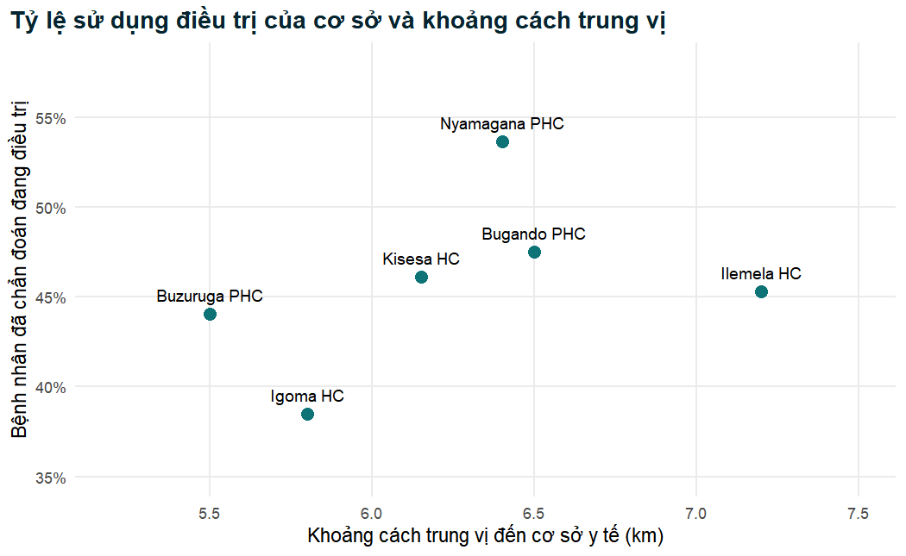

## Chương 3: Thống kê mô tả, bảng và hình


Tất cả lời giải đều bắt đầu từ tệp phân tích đã làm sạch và, khi có liên quan đến biến kết cục, từ
quần thể bệnh nhân đã được chẩn đoán.


``` r
analysis_data <- readRDS("Data/analysis_data.rds")
diagnosed <- analysis_data |> filter(htn_diagnosed == "Yes")
teal <- "#0D7377"
```

### Bài tập 3.1

Chúng ta tính bốn thống kê cho mỗi biến, cùng với số giá trị khuyết.


``` r
analysis_data |>
  select(age, distance_to_facility_km) |>
  pivot_longer(everything(), names_to = "variable", values_to = "value") |>
  group_by(variable) |>
  summarise(
    missing = sum(is.na(value)),
    mean    = mean(value, na.rm = TRUE),
    sd      = sd(value, na.rm = TRUE),
    median  = median(value, na.rm = TRUE),
    iqr     = IQR(value, na.rm = TRUE)
  ) |>
  kable(digits = 2,
        caption = "Tóm tắt tuổi và khoảng cách đến cơ sở y tế.")
```


Table: Tóm tắt tuổi và khoảng cách đến cơ sở y tế.

|variable                | missing|  mean|    sd| median|  iqr|
|:-----------------------|-------:|-----:|-----:|------:|----:|
|age                     |       2| 52.28| 14.10|  52.00| 19.0|
|distance_to_facility_km |      60|  7.82|  6.09|   6.45|  6.3|

Tuổi có 2 giá trị khuyết và khoảng cách có 60. Với **tuổi**, trung bình (52,3 tuổi) và trung vị
(52 tuổi) gần như trùng nhau và SD (14,1) nhỏ so với trung bình, nên phân phối gần như đối xứng:
báo cáo **trung bình (SD)**, 52,3 (14,1) tuổi. Với **khoảng cách**, trung bình (7,8 km) cao hơn hẳn
trung vị (6,45 km) và SD (6,1 km) gần bằng trung bình của một biến không thể nhận giá trị âm, dấu
hiệu đặc trưng của phân phối lệch phải (xem histogram ở Mục 3.5): báo cáo **trung vị (IQR)**:
6,45 km (IQR 4,0 đến 10,3 km, tức khoảng tứ phân vị là 6,3 km).

### Bài tập 3.2


``` r
ldl <- analysis_data$ldl_mmol_l

mean(ldl)                                   # cái bẫy na.rm: NA
```

```
#> [1] NA
```

``` r
c(n_valid   = sum(!is.na(ldl)),
  n_missing = sum(is.na(ldl)),
  pct_miss  = 100 * mean(is.na(ldl)),
  mean      = mean(ldl, na.rm = TRUE),
  sd        = sd(ldl, na.rm = TRUE),
  cv_pct    = 100 * sd(ldl, na.rm = TRUE) / mean(ldl, na.rm = TRUE)) |>
  round(2)
```

```
#>   n_valid n_missing  pct_miss      mean        sd    cv_pct 
#>   1395.00    105.00      7.00      2.70      1.03     38.26
```

Không có `na.rm = TRUE`, `mean()` trả về `NA` vì 105 giá trị LDL (7,0%) bị khuyết. Trong 1.395
bệnh nhân có kết quả, cholesterol LDL trung bình là 2,70 mmol/L với SD 1,03 mmol/L, hệ số biến
thiên khoảng 38%, nên LDL biến thiên tương đối nhiều hơn cholesterol toàn phần (CV khoảng 19%).
Một câu cho bài báo: *"Cholesterol LDL có sẵn ở 1.395 trong số 1.500 người tham gia (93,0%); trung
bình 2,70 mmol/L (SD 1,03)."*

### Bài tập 3.3


``` r
table(analysis_data$smoking, useNA = "ifany")
```

```
#> 
#>   Never  Former Current    <NA> 
#>     899     295     261      45
```

``` r
table(analysis_data$bp_category, useNA = "ifany")
```

```
#> 
#>       Normal     Elevated Hypertension         <NA> 
#>          144          357          996            3
```


``` r
analysis_data |>
  tabyl(smoking) |>
  adorn_pct_formatting(digits = 1)
```

```
#>  smoking   n percent valid_percent
#>    Never 899   59.9%         61.8%
#>   Former 295   19.7%         20.3%
#>  Current 261   17.4%         17.9%
#>     <NA>  45    3.0%             -
```

``` r
analysis_data |>
  tabyl(bp_category) |>
  adorn_pct_formatting(digits = 1)
```

```
#>   bp_category   n percent valid_percent
#>        Normal 144    9.6%          9.6%
#>      Elevated 357   23.8%         23.8%
#>  Hypertension 996   66.4%         66.5%
#>          <NA>   3    0.2%             -
```

Tình trạng hút thuốc bị khuyết ở 45 bệnh nhân và phân loại huyết áp bị khuyết ở 3 bệnh nhân. Có
261 người hiện đang hút thuốc (`Current`): (a) 17,4% trong tổng số 1.500 bệnh nhân (`percent`), và
(b) 17,9% trong số 1.455 người biết tình trạng hút thuốc (`valid_percent`). Ở đây khác biệt nhỏ vì
chỉ 3% bị khuyết, nhưng luôn phải nêu rõ mẫu số.

### Bài tập 3.4


``` r
ins_tab <- table(Insurance = diagnosed$health_insurance,
                 Treated   = diagnosed$treatment_uptake)
addmargins(ins_tab)
```

```
#>          Treated
#> Insurance   No  Yes  Sum
#>       No   419  306  725
#>       Yes  162  202  364
#>       Sum  581  508 1089
```

``` r
round(100 * prop.table(ins_tab, margin = 1), 1) # % hàng (trong nhóm bảo hiểm)
```

```
#>          Treated
#> Insurance   No  Yes
#>       No  57.8 42.2
#>       Yes 44.5 55.5
```

``` r
round(100 * prop.table(ins_tab, margin = 2), 1) # % cột (trong nhóm điều trị)
```

```
#>          Treated
#> Insurance   No  Yes
#>       No  72.1 60.2
#>       Yes 27.9 39.8
```

Trong 364 bệnh nhân đã được chẩn đoán có bảo hiểm, 55,5% đang điều trị, so với 42,2% trong 725
người không có bảo hiểm. Đây là các **tỷ lệ phần trăm theo hàng**, được tính trong các nhóm của
biến giải thích (bảo hiểm). Chúng trả lời trực tiếp câu hỏi "bảo hiểm có liên quan đến việc sử dụng
điều trị không?", vì chúng so sánh biến kết cục giữa các nhóm phơi nhiễm. Các tỷ lệ phần trăm theo
cột (39,8% bệnh nhân được điều trị và 27,9% bệnh nhân không được điều trị có bảo hiểm) mô tả thành
phần của các nhóm biến kết cục, đúng là những gì một Bảng 1 theo việc sử dụng điều trị trình bày,
nhưng chúng không cho biết tỷ lệ sử dụng điều trị trong mỗi nhóm bảo hiểm.

### Bài tập 3.5


``` r
diagnosed |>
  group_by(treatment_uptake) |>
  summarise(
    n     = sum(!is.na(sbp_mmhg)),
    mean  = mean(sbp_mmhg, na.rm = TRUE),
    sd    = sd(sbp_mmhg, na.rm = TRUE),
    se    = sd / sqrt(n),
    lower = mean - qt(0.975, n - 1) * se,
    upper = mean + qt(0.975, n - 1) * se
  ) |>
  kable(digits = 2,
        caption = "SBP trung bình (mmHg) kèm CI 95% theo việc điều trị.")
```


Table: SBP trung bình (mmHg) kèm CI 95% theo việc điều trị.

|treatment_uptake |   n|  mean|    sd|   se| lower| upper|
|:----------------|---:|-----:|-----:|----:|-----:|-----:|
|No               | 581| 142.2| 19.81| 0.82| 140.6| 143.8|
|Yes              | 507| 148.1| 18.34| 0.81| 146.5| 149.7|


``` r
diagnosed |>
  group_by(residence) |>
  summarise(n = n(), treated = sum(treatment_uptake == "Yes")) |>
  mutate(pct   = 100 * treated / n,
         se    = sqrt((pct / 100) * (1 - pct / 100) / n),
         lower = pct - 100 * 1.96 * se,
         upper = pct + 100 * 1.96 * se) |>
  select(-se) |>
  kable(digits = 1,
        caption = "Tỷ lệ sử dụng điều trị (%) kèm CI 95% theo nơi cư trú.")
```


Table: Tỷ lệ sử dụng điều trị (%) kèm CI 95% theo nơi cư trú.

|residence |   n| treated|  pct| lower| upper|
|:---------|---:|-------:|----:|-----:|-----:|
|Rural     | 501|     195| 38.9|  34.7|  43.2|
|Urban     | 588|     313| 53.2|  49.2|  57.3|

Bệnh nhân đã được chẩn đoán không điều trị có SBP trung bình 142,2 mmHg (CI 95% khoảng 140,6 đến
143,8) và bệnh nhân được điều trị có SBP trung bình 148,1 mmHg (khoảng 146,5 đến 149,7). Tỷ lệ sử
dụng điều trị là 38,9% (CI 95% khoảng 34,7% đến 43,2%) ở bệnh nhân nông thôn (`Rural`) và 53,2%
(khoảng 49,2% đến 57,3%) ở bệnh nhân thành thị (`Urban`) đã được chẩn đoán; các khoảng không chồng
lên nhau, gợi ý một khác biệt thực sự mà Chương 4 sẽ kiểm định chính thức.

**SD** (khoảng 18 đến 20 mmHg) đo mức độ SBP của từng bệnh nhân dao động quanh trung bình của nhóm;
nó sẽ giữ gần như nguyên nếu chúng ta tuyển thêm bệnh nhân. **SE** (khoảng 0,8 mmHg) đo mức độ chính
xác của việc ước lượng *trung bình* của mỗi nhóm; nó bằng SD chia cho $\sqrt{n}$ và sẽ giảm đi với
một mẫu lớn hơn. SD mô tả bệnh nhân, SE mô tả sự bất định của một ước lượng.

### Bài tập 3.6


``` r
diagnosed |>
  select(age, sex, residence, education, health_insurance,
         family_history_htn, knowledge_score, comorbidity_count,
         treatment_uptake) |>
  tbl_summary(
    by = treatment_uptake,
    type = comorbidity_count ~ "continuous",   # coi số đếm là biến số
    statistic = list(
      c(age, knowledge_score) ~ "{mean} ({sd})",
      comorbidity_count ~ "{median} ({p25}, {p75})",
      all_categorical() ~ "{n} ({p}%)"
    ),
    digits = list(c(age, knowledge_score) ~ 1, comorbidity_count ~ 0),
    label = list(
      age ~ "Tuổi, năm",
      sex ~ "Giới tính",
      residence ~ "Nơi cư trú",
      education ~ "Học vấn",
      health_insurance ~ "Bảo hiểm y tế",
      family_history_htn ~ "Tiền sử gia đình tăng huyết áp",
      knowledge_score ~ "Điểm kiến thức (0-20)",
      comorbidity_count ~ "Số bệnh đồng mắc"
    ),
    missing = "ifany",
    missing_text = "Khuyết"
  ) |>
  add_overall(last = FALSE, col_label = "**Chung**  \nN = {N}") |>
  modify_header(label = "**Đặc điểm**") |>
  as_kable(caption = "Bệnh nhân đã được chẩn đoán theo việc sử dụng điều trị.")
```


Table: Bệnh nhân đã được chẩn đoán theo việc sử dụng điều trị.

|**Đặc điểm**                   | **Chung**  N = 1089 | **No**  N = 581 | **Yes**  N = 508 |
|:------------------------------|:-------------------:|:---------------:|:----------------:|
|Tuổi, năm                      |     53.5 (14.0)     |   51.1 (13.4)   |   56.3 (14.1)    |
|Khuyết                         |          1          |        1        |        0         |
|Giới tính                      |                     |                 |                  |
|Female                         |      629 (58%)      |    315 (54%)    |    314 (62%)     |
|Male                           |      460 (42%)      |    266 (46%)    |    194 (38%)     |
|Nơi cư trú                     |                     |                 |                  |
|Rural                          |      501 (46%)      |    306 (53%)    |    195 (38%)     |
|Urban                          |      588 (54%)      |    275 (47%)    |    313 (62%)     |
|Học vấn                        |                     |                 |                  |
|None                           |      201 (19%)      |    126 (22%)    |     75 (15%)     |
|Primary                        |      444 (42%)      |    252 (44%)    |    192 (39%)     |
|Secondary                      |      292 (27%)      |    137 (24%)    |    155 (31%)     |
|Tertiary                       |      128 (12%)      |    55 (9.6%)    |     73 (15%)     |
|Khuyết                         |         24          |       11        |        13        |
|Bảo hiểm y tế                  |      364 (33%)      |    162 (28%)    |    202 (40%)     |
|Tiền sử gia đình tăng huyết áp |      394 (36%)      |    183 (31%)    |    211 (42%)     |
|Điểm kiến thức (0-20)          |     10.4 (3.5)      |    9.9 (3.4)    |    10.9 (3.4)    |
|Khuyết                         |         29          |       16        |        13        |
|Số bệnh đồng mắc               |      0 (0, 1)       |    0 (0, 1)     |     0 (0, 1)     |

Nếu không có `type = comorbidity_count ~ "continuous"`, gtsummary sẽ coi một biến đếm chỉ có bốn
giá trị khác nhau là biến phân loại và hiển thị n (%) cho mỗi giá trị, mà thực ra đó lại là một
phương án thay thế hoàn toàn tốt ở đây: trung vị (IQR) bằng 0 (0, 1) giống hệt nhau ở cả hai nhóm và
che giấu mọi khác biệt.

Hai đặc điểm khác nhau: bệnh nhân được điều trị **lớn tuổi hơn** (trung bình khoảng 56 so với 51
tuổi) và thường có **tiền sử gia đình tăng huyết áp** hơn (khoảng 42% so với 31%); họ cũng thường
có bảo hiểm, sống ở thành thị và có học vấn cao hơn, và có điểm kiến thức cao hơn một chút. Những
khác biệt này hợp lý về mặt lâm sàng: bệnh nhân lớn tuổi và những người có tiền sử gia đình dễ được
nhận diện là nguy cơ cao và được bắt đầu điều trị hơn, và bảo hiểm, học vấn và kiến thức có thể làm
giảm các rào cản tài chính và thông tin trong việc tiếp cận chăm sóc. Đây là những khác biệt mô tả,
chưa hiệu chỉnh, trên dữ liệu mô phỏng, cần được xem xét bằng các kiểm định (Chương 4) và các mô
hình đa biến (Chương 5).

### Bài tập 3.7


``` r
ggplot(diagnosed, aes(x = treatment_uptake, y = knowledge_score)) +
  geom_jitter(width = 0.2, height = 0.2, alpha = 0.25, size = 0.8,
              na.rm = TRUE) +
  geom_boxplot(width = 0.4, outlier.shape = NA, fill = teal, alpha = 0.3,
               na.rm = TRUE) +
  labs(title = "Bệnh nhân được điều trị có điểm kiến thức cao hơn một chút",
       x = "Đang dùng thuốc điều trị tăng huyết áp",
       y = "Điểm kiến thức (0-20)")
```


Điểm kiến thức là số nguyên, nên một độ rải dọc nhỏ (`height = 0.2`) giúp các bệnh nhân có cùng
điểm không bị vẽ chồng lên nhau. Điểm trung vị là 11 ở bệnh nhân được điều trị và 10 ở bệnh nhân
không được điều trị, nhưng hai phân phối gần như chồng lên nhau hoàn toàn.


``` r
diagnosed |>
  filter(!is.na(education)) |>
  group_by(education) |>
  summarise(pct = mean(treatment_uptake == "Yes")) |>
  ggplot(aes(x = education, y = pct)) +
  geom_col(fill = teal, width = 0.65) +
  geom_text(aes(label = percent(pct, accuracy = 0.1)), vjust = -0.4) +
  scale_y_continuous(labels = label_percent(), limits = c(0, 0.7)) +
  labs(title = "Tỷ lệ sử dụng điều trị tăng theo học vấn",
       x = "Trình độ học vấn cao nhất",
       y = "Bệnh nhân đã chẩn đoán đang điều trị")
```


Vì `education` là một factor có thứ tự, các cột xuất hiện từ không đi học (`None`) đến sau trung
học (`Tertiary`) mà không cần thêm mã. Tỷ lệ sử dụng điều trị tăng từ khoảng 37% ở bệnh nhân không
đi học lên khoảng 57% ở những người có trình độ sau trung học, một gradient phù hợp với việc học vấn
giúp dễ tiếp cận và sử dụng dịch vụ chăm sóc hơn. Biểu đồ cột phù hợp ở đây vì mỗi cột là một *tỷ lệ
phần trăm*, mà chiều dài của nó tính từ số không có ý nghĩa.

### Bài tập 3.8


``` r
facility_summary <- diagnosed |>
  group_by(facility) |>
  summarise(
    n           = n(),
    treated     = sum(treatment_uptake == "Yes"),
    median_dist = median(distance_to_facility_km, na.rm = TRUE),
    pct_insured = 100 * mean(health_insurance == "Yes")
  ) |>
  rowwise() |>                                   # mỗi cơ sở một prop.test()
  mutate(
    ci    = list(prop.test(treated, n, correct = FALSE)$conf.int),
    pct   = 100 * treated / n,
    lower = 100 * ci[1],
    upper = 100 * ci[2]
  ) |>
  ungroup() |>
  select(facility, n, pct, lower, upper, median_dist, pct_insured) |>
  arrange(desc(pct))

facility_summary |>
  kable(digits = 1,
        caption = paste("Tỷ lệ sử dụng điều trị (%, CI 95% Wilson) và khả",
                        "năng tiếp cận theo cơ sở y tế."))
```


Table: Tỷ lệ sử dụng điều trị (%, CI 95% Wilson) và khả năng tiếp cận theo cơ sở y tế.

|facility      |   n|  pct| lower| upper| median_dist| pct_insured|
|:-------------|---:|----:|-----:|-----:|-----------:|-----------:|
|Nyamagana PHC | 220| 53.6|  47.0|  60.1|         6.4|        36.8|
|Bugando PHC   | 259| 47.5|  41.5|  53.6|         6.5|        34.0|
|Kisesa HC     | 154| 46.1|  38.4|  54.0|         6.2|        33.1|
|Ilemela HC    | 192| 45.3|  38.4|  52.4|         7.2|        35.9|
|Buzuruga PHC  | 134| 44.0|  35.9|  52.5|         5.5|        26.1|
|Igoma HC      | 130| 38.5|  30.5|  47.0|         5.8|        30.8|


``` r
ggplot(facility_summary, aes(x = median_dist, y = pct / 100)) +
  geom_point(size = 3, colour = teal) +
  geom_text(aes(label = facility), vjust = -1, size = 3.2) +
  scale_y_continuous(labels = label_percent(), limits = c(0.35, 0.58)) +
  scale_x_continuous(limits = c(5.2, 7.5)) +
  labs(title = "Tỷ lệ sử dụng điều trị của cơ sở và khoảng cách trung vị",
       x = "Khoảng cách trung vị đến cơ sở y tế (km)",
       y = "Bệnh nhân đã chẩn đoán đang điều trị")
```



`rowwise()` làm cho `mutate()` xử lý từng cơ sở một, nên `prop.test()` nhận số đếm của cơ sở đó;
khoảng Wilson được lưu dưới dạng một cột danh sách (list column) rồi được tách thành giới hạn dưới
và giới hạn trên. Tỷ lệ sử dụng điều trị dao động từ 38,5% (Igoma HC) đến 53,6% (Nyamagana PHC), với
các khoảng Wilson tương tự các khoảng Wald ở Mục 3.8 vì mỗi cơ sở có hơn 100 bệnh nhân đã được chẩn
đoán. Trên biểu đồ không có xu hướng rõ ràng: các cơ sở có khoảng cách trung vị ngắn nhất (Buzuruga
PHC và Igoma HC) không có tỷ lệ sử dụng điều trị cao nhất.

Cần hết sức thận trọng vì ba lý do. Thứ nhất, chỉ có **sáu** điểm dữ liệu, nên bất kỳ mối quan hệ
nào nhìn thấy cũng có thể dễ dàng xuất hiện do ngẫu nhiên. Thứ hai, đây là một phép so sánh **sinh
thái** (ecological) giữa các giá trị trung bình của cơ sở: một mối quan hệ giữa các cơ sở không nhất
thiết đúng với từng bệnh nhân (*ngụy biện sinh thái*, ecological fallacy), và thực tế ở cấp bệnh
nhân, Bảng 1 ở Mục 3.10 đã cho thấy bệnh nhân được điều trị sống gần cơ sở y tế hơn một chút. Thứ
ba, các cơ sở khác nhau về nhiều mặt cùng lúc (độ bao phủ bảo hiểm, nhân lực, quần thể trong vùng
phục vụ), nên không thể tách riêng khoảng cách khỏi các đặc điểm khác của cơ sở nếu không có một
phân tích đa biến ở cấp bệnh nhân có tính đến sự phân cụm (Chương 5).
