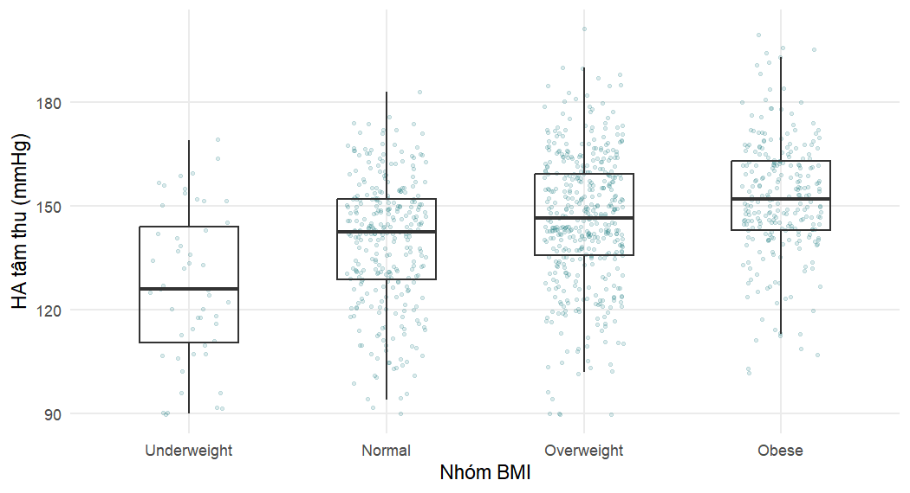

## Chương 4: Các kiểm định thống kê thường dùng trong nghiên cứu y học


Mọi lời giải đều bắt đầu từ bộ dữ liệu sạch và quần thể phân tích gồm các bệnh nhân đã được
chẩn đoán tăng huyết áp.


``` r
library(tidyverse)
library(broom)
library(patchwork)

course_teal <- "#0D7377"

analysis_data <- readRDS("Data/analysis_data.rds")
dx <- filter(analysis_data, htn_diagnosed == "Yes")
```

### Bài tập 4.1

**1. Cỡ của quần thể phân tích và tỷ lệ tiếp nhận điều trị.**


``` r
nrow(dx)
```

```
#> [1] 1089
```

``` r
dx |> count(treatment_uptake) |> mutate(percent = round(100 * n / sum(n), 1))
```

```
#> # A tibble: 2 × 3
#>   treatment_uptake     n percent
#>   <fct>            <int>   <dbl>
#> 1 No                 581    53.4
#> 2 Yes                508    46.6
```

Có 1.089 bệnh nhân đã được chẩn đoán, trong đó 508 người (46,6%) đang điều trị.

**2. Tỷ lệ tiếp nhận điều trị trong toàn bộ 1.500 bệnh nhân.**


``` r
analysis_data |>
  count(htn_diagnosed, treatment_uptake) |>
  mutate(percent_of_all = round(100 * n / sum(n), 1))
```

```
#> # A tibble: 3 × 4
#>   htn_diagnosed treatment_uptake     n percent_of_all
#>   <fct>         <fct>            <int>          <dbl>
#> 1 No            No                 411           27.4
#> 2 Yes           No                 581           38.7
#> 3 Yes           Yes                508           33.9
```

``` r
round(100 * mean(analysis_data$treatment_uptake == "Yes"), 1)
```

```
#> [1] 33.9
```

Trên toàn bộ 1.500 bệnh nhân, chỉ 33,9% "đang điều trị", vì 411 bệnh nhân chưa được chẩn
đoán đều được ghi nhận là không điều trị. Việc tiếp nhận điều trị chỉ được định nghĩa cho
những người biết mình bị tăng huyết áp, nên việc đưa cả bệnh nhân chưa được chẩn đoán vào sẽ
trộn lẫn hai quá trình khác nhau (được chẩn đoán, và được điều trị sau khi đã chẩn đoán) và
cho ra một con số thấp gây hiểu lầm; mẫu số đúng là 1.089 bệnh nhân đã được chẩn đoán.

**3. Độ lệch chuẩn và sai số chuẩn của điểm kiến thức.**


``` r
dx |>
  summarise(n    = sum(!is.na(knowledge_score)),
            mean = mean(knowledge_score, na.rm = TRUE),
            sd   = sd(knowledge_score, na.rm = TRUE),
            se   = sd / sqrt(n))
```

```
#> # A tibble: 1 × 4
#>       n  mean    sd    se
#>   <int> <dbl> <dbl> <dbl>
#> 1  1060  10.4  3.46 0.106
```

Điểm kiến thức trung bình là 10,4 điểm với độ lệch chuẩn 3,5 điểm: từng bệnh nhân thường
khác trung bình khoảng 3,5 điểm. Sai số chuẩn, 0,11 điểm, mô tả độ chính xác của *trung
bình*: nếu nghiên cứu được lặp lại, các trung bình mẫu thường dao động khoảng 0,1 điểm. SD mô
tả bệnh nhân; SE mô tả ước lượng và giảm theo $1/\sqrt{n}$.

### Bài tập 4.2

**1. Biểu đồ tần suất và biểu đồ Q–Q của BMI.**


``` r
p_hist <- ggplot(dx, aes(x = bmi)) +
  geom_histogram(binwidth = 1, fill = course_teal, colour = "white") +
  labs(x = "BMI (kg/m²)", y = "Số bệnh nhân")
p_qq <- ggplot(dx, aes(sample = bmi)) +
  stat_qq(size = 0.6, alpha = 0.5, colour = course_teal) +
  stat_qq_line() +
  labs(x = "Phân vị lý thuyết", y = "Phân vị mẫu")
p_hist + p_qq
```


Biểu đồ tần suất đối xứng và có hình chuông, và biểu đồ Q–Q gần với một đường thẳng, chỉ có
những sai lệch rất nhỏ ở hai đầu.

**2. Kiểm định Shapiro–Wilk.**


``` r
shapiro.test(dx$bmi)
```

```
#> 
#> 	Shapiro-Wilk normality test
#> 
#> data:  dx$bmi
#> W = 0.997, p-value = 0.052
```

$W = 0.997$ và $p = 0.052$: không có bằng chứng mạnh chống lại tính chuẩn. Tuy nhiên, với hơn
1.000 bệnh nhân, kiểm định sẽ đánh dấu cả những sai lệch không đáng kể, và các biểu đồ (cùng
với định lý giới hạn trung tâm) là chỉ dẫn hữu ích hơn. Dù theo cách nào, BMI cũng có thể được
coi là có phân phối xấp xỉ chuẩn.

**3. So sánh BMI theo việc tiếp nhận điều trị.** Kiểm định t Welch là phù hợp.


``` r
t.test(bmi ~ treatment_uptake, data = dx)
```

```
#> 
#> 	Welch Two Sample t-test
#> 
#> data:  bmi by treatment_uptake
#> t = -0.504, df = 1045, p-value = 0.61
#> alternative hypothesis: true difference in means between group No and group
#>   Yes is not equal to 0
#> 95 percent confidence interval:
#>  -0.72587  0.42912
#> sample estimates:
#>  mean in group No mean in group Yes 
#>            26.763            26.912
```

``` r
wilcox.test(bmi ~ treatment_uptake, data = dx)   # để kiểm tra lại
```

```
#> 
#> 	Wilcoxon rank sum test with continuity correction
#> 
#> data:  bmi by treatment_uptake
#> W = 135646, p-value = 0.52
#> alternative hypothesis: true location shift is not equal to 0
```

BMI trung bình là 26,8 kg/m² ở bệnh nhân không điều trị và 26,9 kg/m² ở bệnh nhân được điều
trị; hiệu số (No trừ Yes) là $-0.15$ kg/m² (KTC 95% từ $-0.73$ đến 0,43; $p = 0.61$). Kiểm
định Wilcoxon cho kết quả thống nhất ($p = 0.52$). Khoảng tin cậy hẹp và chỉ chứa những hiệu
số quá nhỏ để có ý nghĩa lâm sàng, nên trong trường hợp này chúng ta có thể kết luận một cách
hợp lý rằng BMI không khác biệt đáng kể giữa hai nhóm, chứ không chỉ đơn thuần là "kiểm định
không có ý nghĩa".

### Bài tập 4.3

**1. Tóm tắt theo nhóm.**


``` r
dx |>
  group_by(treatment_uptake) |>
  summarise(n = sum(!is.na(sbp_mmhg)),
            mean = mean(sbp_mmhg, na.rm = TRUE),
            sd = sd(sbp_mmhg, na.rm = TRUE))
```

```
#> # A tibble: 2 × 4
#>   treatment_uptake     n  mean    sd
#>   <fct>            <int> <dbl> <dbl>
#> 1 No                 581  142.  19.8
#> 2 Yes                507  148.  18.3
```

**2. Kiểm định t Welch.**


``` r
t.test(sbp_mmhg ~ treatment_uptake, data = dx)
```

```
#> 
#> 	Welch Two Sample t-test
#> 
#> data:  sbp_mmhg by treatment_uptake
#> t = -5.14, df = 1082, p-value = 3.3e-07
#> alternative hypothesis: true difference in means between group No and group
#>   Yes is not equal to 0
#> 95 percent confidence interval:
#>  -8.2128 -3.6727
#> sample estimates:
#>  mean in group No mean in group Yes 
#>            142.16            148.10
```

Bệnh nhân đang điều trị có huyết áp tâm thu trung bình cao hơn những người không điều trị
(148,1 so với 142,2 mmHg; hiệu số 5,9 mmHg, KTC 95% từ 3,7 đến 8,2 mmHg; kiểm định t Welch
$p < 0.001$).

**3. Diễn giải.** Hiệu số khoảng 6 mmHg về huyết áp tâm thu trung bình có ý nghĩa lâm sàng ở
cấp độ quần thể (mức giảm cỡ này đi kèm với sự giảm đáng kể nguy cơ tim mạch). Thoạt nhìn,
hướng của khác biệt gây ngạc nhiên, vì điều trị phải làm *giảm* huyết áp. Tuy nhiên, trong
một nghiên cứu cắt ngang, chúng ta không thể biết điều gì xảy ra trước: bệnh nhân có huyết áp
cao hơn có nhiều khả năng được đề nghị và chấp nhận điều trị hơn (quan hệ nhân quả ngược, hay
"nhiễu do chỉ định" — confounding by indication), và bệnh nhân được điều trị có thể chưa được
kiểm soát huyết áp. Một phép so sánh cắt ngang đơn lẻ không thể đánh giá tác động của điều
trị lên huyết áp. (Dữ liệu là mô phỏng, nên khuôn mẫu này minh họa cách lập luận chứ không
phải một phát hiện thực tế.)

### Bài tập 4.4

**1. Biểu đồ hộp và bảng tóm tắt.**


``` r
dx |>
  filter(!is.na(bmi_cat), !is.na(sbp_mmhg)) |>
  ggplot(aes(x = bmi_cat, y = sbp_mmhg)) +
  geom_jitter(width = 0.2, alpha = 0.15, size = 0.8, colour = course_teal) +
  geom_boxplot(fill = NA, outlier.shape = NA, width = 0.5) +
  labs(x = "Nhóm BMI", y = "HA tâm thu (mmHg)")
```




``` r
dx |>
  filter(!is.na(bmi_cat), !is.na(sbp_mmhg)) |>
  group_by(bmi_cat) |>
  summarise(n = n(), mean = mean(sbp_mmhg), sd = sd(sbp_mmhg))
```

```
#> # A tibble: 4 × 4
#>   bmi_cat         n  mean    sd
#>   <fct>       <int> <dbl> <dbl>
#> 1 Underweight    51  127.  22.1
#> 2 Normal        308  140.  18.2
#> 3 Overweight    440  146.  18.9
#> 4 Obese         256  152.  16.9
```

Huyết áp tâm thu trung bình tăng đều từ khoảng 127 mmHg ở nhóm thiếu cân (`Underweight`) lên
152 mmHg ở nhóm béo phì (`Obese`).

**2. ANOVA một yếu tố.**


``` r
aov_sbp <- aov(sbp_mmhg ~ bmi_cat, data = dx)
summary(aov_sbp)
```

```
#>               Df Sum Sq Mean Sq F value Pr(>F)    
#> bmi_cat        3  39096   13032    38.5 <2e-16 ***
#> Residuals   1051 355674     338                   
#> ---
#> Signif. codes:  0 '***' 0.001 '**' 0.01 '*' 0.05 '.' 0.1 ' ' 1
#> 34 observations deleted due to missingness
```

Dòng giữa các nhóm có $4 - 1 = 3$ bậc tự do và dòng phần dư có 1.051 bậc tự do ($N - k$ với
$N = 1{,}055$). $F = 38.5$ với $p < 2 \times 10^{-16}$: bằng chứng rất mạnh cho thấy huyết áp
tâm thu trung bình khác nhau giữa các nhóm BMI. Có 34 bệnh nhân bị loại vì thiếu thông tin
nhóm BMI hoặc huyết áp tâm thu.

**3. Kiểm định Kruskal–Wallis.**


``` r
kruskal.test(sbp_mmhg ~ bmi_cat, data = dx)
```

```
#> 
#> 	Kruskal-Wallis rank sum test
#> 
#> data:  sbp_mmhg by bmi_cat
#> Kruskal-Wallis chi-squared = 89.6, df = 3, p-value <2e-16
```

Kiểm định dựa trên thứ hạng cho kết quả thống nhất ($\chi^2 = 89.6$, 3 bậc tự do,
$p < 0.001$).

**4. So sánh từng cặp có hiệu chỉnh Bonferroni.**


``` r
pairwise.t.test(dx$sbp_mmhg, dx$bmi_cat, p.adjust.method = "bonferroni")
```

```
#> 
#> 	Pairwise comparisons using t tests with pooled SD 
#> 
#> data:  dx$sbp_mmhg and dx$bmi_cat 
#> 
#>            Underweight Normal Overweight
#> Normal     3e-05       -      -         
#> Overweight 2e-11       2e-05  -         
#> Obese      <2e-16      1e-14  1e-04     
#> 
#> P value adjustment method: bonferroni
```

Cả sáu giá trị p đã hiệu chỉnh đều nhỏ hơn 0,001: mọi nhóm BMI đều khác với mọi nhóm còn lại,
theo một gradient nhất quán (BMI càng cao, huyết áp tâm thu càng cao). Phương pháp Tukey
(`TukeyHSD(aov_sbp)`) sẽ cho cùng kết luận và cung cấp thêm khoảng tin cậy cho từng hiệu số
từng cặp.

### Bài tập 4.5

**1. Bảng và tỷ lệ phần trăm theo dòng.**


``` r
tab_res <- table(Residence = dx$residence, Uptake = dx$treatment_uptake)
addmargins(tab_res)
```

```
#>          Uptake
#> Residence   No  Yes  Sum
#>     Rural  306  195  501
#>     Urban  275  313  588
#>     Sum    581  508 1089
```

``` r
round(100 * prop.table(tab_res, margin = 1), 1)
```

```
#>          Uptake
#> Residence   No  Yes
#>     Rural 61.1 38.9
#>     Urban 46.8 53.2
```

Tỷ lệ tiếp nhận điều trị là 53,2% ở bệnh nhân thành thị (`Urban`) và 38,9% ở bệnh nhân nông
thôn (`Rural`).

**2. Kiểm định khi bình phương và số đếm kỳ vọng.**


``` r
chisq.test(tab_res)
```

```
#> 
#> 	Pearson's Chi-squared test with Yates' continuity correction
#> 
#> data:  tab_res
#> X-squared = 21.7, df = 1, p-value = 3.2e-06
```

``` r
chisq.test(tab_res)$expected
```

```
#>          Uptake
#> Residence     No    Yes
#>     Rural 267.29 233.71
#>     Urban 313.71 274.29
```

$\chi^2 = 21.7$ với 1 bậc tự do, $p < 0.001$. Mọi số đếm kỳ vọng đều lớn hơn 230, nên xấp xỉ
khi bình phương hoàn toàn phù hợp.

**3. Hiệu số nguy cơ, nguy cơ tương đối và tỷ số chênh (thành thị so với nông thôn).**


``` r
a  <- tab_res["Urban", "Yes"]; b  <- tab_res["Urban", "No"]   # có phơi nhiễm
cc <- tab_res["Rural", "Yes"]; dd <- tab_res["Rural", "No"]   # không phơi nhiễm
n1 <- a + b; n0 <- cc + dd
p1 <- a / n1; p0 <- cc / n0

rd <- p1 - p0
se_rd <- sqrt(p1 * (1 - p1) / n1 + p0 * (1 - p0) / n0)
rr <- p1 / p0
se_log_rr <- sqrt(1 / a - 1 / n1 + 1 / cc - 1 / n0)
or <- (a * dd) / (b * cc)
se_log_or <- sqrt(1 / a + 1 / b + 1 / cc + 1 / dd)

tibble(
  measure  = c("Hiệu số nguy cơ", "Nguy cơ tương đối", "Tỷ số chênh"),
  estimate = c(rd, rr, or),
  lower    = c(rd - 1.96 * se_rd, exp(log(rr) - 1.96 * se_log_rr),
               exp(log(or) - 1.96 * se_log_or)),
  upper    = c(rd + 1.96 * se_rd, exp(log(rr) + 1.96 * se_log_rr),
               exp(log(or) + 1.96 * se_log_or))
) |>
  knitr::kable(digits = 3,
               col.names = c("Thước đo", "Ước lượng", "Cận dưới", "Cận trên"),
               caption = "Nơi cư trú thành thị so với nông thôn và việc tiếp nhận điều trị.")
```


Table: Nơi cư trú thành thị so với nông thôn và việc tiếp nhận điều trị.

|Thước đo          | Ước lượng| Cận dưới| Cận trên|
|:-----------------|---------:|--------:|--------:|
|Hiệu số nguy cơ   |     0.143|    0.084|    0.202|
|Nguy cơ tương đối |     1.368|    1.197|    1.563|
|Tỷ số chênh       |     1.786|    1.402|    2.275|

Bệnh nhân thành thị có khả năng đang điều trị cao hơn bệnh nhân nông thôn 14,3 điểm phần trăm
(KTC 95% từ 8,4 đến 20,2); nguy cơ (xác suất) tiếp nhận điều trị của họ cao gấp khoảng 1,37
lần (KTC 95% từ 1,20 đến 1,56), và odds cao gấp khoảng 1,79 lần (KTC 95% từ 1,40 đến 2,28).
Cả ba khoảng tin cậy đều không chứa giá trị "không tác động".

**4. Vì sao OR cách xa 1 hơn RR.** Tỷ số chênh chỉ xấp xỉ nguy cơ tương đối khi biến kết cục
hiếm gặp. Việc tiếp nhận điều trị là phổ biến (khoảng 40–55%), và khi nguy cơ cao, odds
$p/(1-p)$ thay đổi nhanh hơn nhiều so với chính nguy cơ, nên OR (1,79) cách xa 1 hơn rõ rệt so
với RR (1,37). Báo cáo OR như thể nó có nghĩa là "khả năng cao gấp 1,8 lần" sẽ phóng đại mối
liên quan.

### Bài tập 4.6

**1. OR tích chéo và hồi quy logistic.**


``` r
tab_diab <- table(Diabetes = dx$diabetes, Uptake = dx$treatment_uptake)
tab_diab
```

```
#>         Uptake
#> Diabetes  No Yes
#>      No  574 487
#>      Yes   7  21
```

``` r
or_table <- (tab_diab["Yes", "Yes"] * tab_diab["No", "No"]) /
  (tab_diab["Yes", "No"] * tab_diab["No", "Yes"])
or_table
```

```
#> [1] 3.5359
```

``` r
m_diab <- glm(treatment_uptake ~ diabetes, data = dx, family = binomial)
tidy(m_diab, exponentiate = TRUE, conf.int = TRUE) |>
  select(term, estimate, p.value, conf.low, conf.high)
```

```
#> # A tibble: 2 × 5
#>   term        estimate p.value conf.low conf.high
#>   <chr>          <dbl>   <dbl>    <dbl>     <dbl>
#> 1 (Intercept)    0.848 0.00763    0.752     0.957
#> 2 diabetesYes    3.54  0.00416    1.56      9.04
```

Hai kết quả trùng khớp hoàn toàn: $(21 \times 574)/(7 \times 487) = 3.54$, và hệ số đã lấy
mũ của `diabetesYes` cũng bằng 3,54. Hồi quy logistic với một biến dự báo nhị phân duy nhất
tái tạo đúng bảng 2×2.

**2. Kiểm định chính xác Fisher.**


``` r
fisher.test(tab_diab)
```

```
#> 
#> 	Fisher's Exact Test for Count Data
#> 
#> data:  tab_diab
#> p-value = 0.0033
#> alternative hypothesis: true odds ratio is not equal to 1
#> 95 percent confidence interval:
#>  1.4313 9.9226
#> sample estimates:
#> odds ratio 
#>     3.5321
```

Kiểm định Fisher báo cáo tỷ số chênh là 3,53. Đây là một ước lượng *hợp lý cực đại có điều
kiện* (được tính với điều kiện các tổng biên của bảng cố định), không phải tỷ số tích chéo đơn
giản, nên nó hơi khác, đặc biệt khi một số ô nhỏ. Khoảng tin cậy chính xác của nó (1,43 đến
9,92) cũng rộng hơn một chút so với khoảng tin cậy hợp lý hồ sơ (profile-likelihood) từ mô
hình hồi quy (1,56 đến 9,04). Các giá trị p (0,003 và 0,004) dẫn đến cùng một kết luận.

**3. Vì sao khoảng tin cậy rộng.** Sai số chuẩn của logarit tỷ số chênh là
$\sqrt{1/a + 1/b + 1/c + 1/d}$, đại lượng này bị chi phối bởi các ô nhỏ nhất. Chỉ có 28 bệnh
nhân mắc đái tháo đường, và chỉ 7 người trong số họ không được điều trị, nên số hạng $1/7$
làm sai số chuẩn lớn (khoảng 0,44, so với 0,13 của biến bảo hiểm y tế, vốn có ô nhỏ nhất là
162). Dữ liệu tương thích với mọi mức từ một mối liên quan khiêm tốn đến một mối liên quan rất
lớn.

### Bài tập 4.7

**1. Biểu đồ phân tán.**


``` r
ggplot(dx, aes(x = age, y = knowledge_score)) +
  geom_jitter(width = 0, height = 0.2, alpha = 0.3, size = 1,
              colour = course_teal) +
  geom_smooth(method = "lm", formula = y ~ x, colour = "black") +
  labs(x = "Tuổi (năm)", y = "Điểm kiến thức (0-20)")
```


Đám mây điểm không có hình dạng rõ ràng và đường hồi quy nằm ngang.

**2. Tương quan với tuổi.**


``` r
cor.test(dx$age, dx$knowledge_score)
```

```
#> 
#> 	Pearson's product-moment correlation
#> 
#> data:  dx$age and dx$knowledge_score
#> t = 0.343, df = 1057, p-value = 0.73
#> alternative hypothesis: true correlation is not equal to 0
#> 95 percent confidence interval:
#>  -0.049719  0.070749
#> sample estimates:
#>      cor 
#> 0.010553
```

``` r
cor.test(dx$age, dx$knowledge_score, method = "spearman", exact = FALSE)
```

```
#> 
#> 	Spearman's rank correlation rho
#> 
#> data:  dx$age and dx$knowledge_score
#> S = 1.95e+08, p-value = 0.66
#> alternative hypothesis: true rho is not equal to 0
#> sample estimates:
#>      rho 
#> 0.013459
```

Hệ số Pearson $r = 0.011$ (KTC 95% từ $-0.050$ đến 0,071; $p = 0.73$) và hệ số Spearman
$r_s = 0.013$ ($p = 0.66$). Không có bằng chứng về mối liên quan tuyến tính hay đơn điệu, và
khoảng tin cậy cho thấy mọi tương quan tuyến tính nếu có cũng rất yếu (giá trị hợp lý lớn
nhất, 0,07, tương ứng với việc tuổi giải thích chưa đến 1% biến thiên).

**3. Tương quan với khoảng cách.**


``` r
cor.test(dx$distance_to_facility_km, dx$knowledge_score)
```

```
#> 
#> 	Pearson's product-moment correlation
#> 
#> data:  dx$distance_to_facility_km and dx$knowledge_score
#> t = -0.318, df = 1014, p-value = 0.75
#> alternative hypothesis: true correlation is not equal to 0
#> 95 percent confidence interval:
#>  -0.071439  0.051555
#> sample estimates:
#>        cor 
#> -0.0099799
```

``` r
cor.test(dx$distance_to_facility_km, dx$knowledge_score,
         method = "spearman", exact = FALSE)
```

```
#> 
#> 	Spearman's rank correlation rho
#> 
#> data:  dx$distance_to_facility_km and dx$knowledge_score
#> S = 1.78e+08, p-value = 0.52
#> alternative hypothesis: true rho is not equal to 0
#> sample estimates:
#>       rho 
#> -0.020245
```

Cả hai hệ số đều gần bằng 0 ($r = -0.010$, $r_s = -0.020$). Hệ số Spearman phù hợp hơn ở đây,
vì khoảng cách lệch phải mạnh và một vài khoảng cách rất lớn có thể ảnh hưởng quá mức đến $r$
Pearson; hệ số dựa trên thứ hạng không bị ảnh hưởng bởi chúng.

**4. Nhận xét.** Nhận định này mắc hai lỗi. Thứ nhất, một giá trị p không có ý nghĩa không
phải là bằng chứng cho thấy không có mối quan hệ (không có bằng chứng không phải là bằng chứng
của sự không có); tuy nhiên, ở đây khoảng tin cậy hẹp thực sự ủng hộ kết luận rằng mọi mối
liên quan *tuyến tính* đều rất yếu. Thứ hai, và quan trọng hơn, việc không có tương quan giữa
tuổi và kiến thức không nói lên điều gì về việc bệnh nhân lớn tuổi (hay trẻ tuổi) có *được
lợi* từ giáo dục sức khỏe nhắm mục tiêu hay không: điều đó phụ thuộc vào nhu cầu của họ và vào
việc tiếp nhận điều trị, vốn có liên quan đến tuổi (Mục 4.4). Tương quan cũng chỉ nắm bắt các
khuôn mẫu tuyến tính (Pearson) hoặc đơn điệu (Spearman); một mối quan hệ hình chữ U có thể bị
bỏ sót, và đó là lý do chúng ta vẽ đồ thị trước.

### Bài tập 4.8

**1. Tám kiểm định khi bình phương.**


``` r
vars <- c("sex", "residence", "education", "occupation",
          "marital_status", "smoking", "alcohol", "facility")

screen <- tibble(
  variable = vars,
  p_raw = map_dbl(vars, function(v) {
    chisq.test(table(dx[[v]], dx$treatment_uptake))$p.value
  })
)
```

**2. Hiệu chỉnh Bonferroni và Holm.**


``` r
screen |>
  mutate(p_bonferroni = p.adjust(p_raw, method = "bonferroni"),
         p_holm       = p.adjust(p_raw, method = "holm")) |>
  arrange(p_raw) |>
  # hiển thị giá trị p rất nhỏ là "<0.001" thay vì làm tròn thành 0
  mutate(across(starts_with("p_"),
                \(x) scales::pvalue(x, accuracy = 0.001))) |>
  knitr::kable(
               col.names = c("Biến", "p chưa hiệu chỉnh", "p Bonferroni",
                             "p Holm"),
               caption = "Giá trị p chưa hiệu chỉnh và đã hiệu chỉnh của tám kiểm định khi bình phương về mối liên quan với việc tiếp nhận điều trị.")
```


Table: Giá trị p chưa hiệu chỉnh và đã hiệu chỉnh của tám kiểm định khi bình phương về mối liên quan với việc tiếp nhận điều trị.

|Biến           |p chưa hiệu chỉnh |p Bonferroni |p Holm |
|:--------------|:-----------------|:------------|:------|
|residence      |<0.001            |<0.001       |<0.001 |
|education      |<0.001            |0.002        |0.002  |
|sex            |0.014             |0.108        |0.081  |
|alcohol        |0.123             |0.984        |0.615  |
|facility       |0.135             |>0.999       |0.615  |
|smoking        |0.230             |>0.999       |0.691  |
|occupation     |0.353             |>0.999       |0.706  |
|marital_status |0.885             |>0.999       |0.885  |

Trước khi hiệu chỉnh, có ba biến có $p < 0.05$: nơi cư trú (`residence`), học vấn
(`education`) và giới tính (`sex`). Sau khi hiệu chỉnh Bonferroni hoặc Holm, chỉ còn nơi cư
trú và học vấn nhỏ hơn 0,05; mối liên quan với giới tính ($p = 0.014$ chưa hiệu chỉnh) không
còn giữ được. Phương pháp Holm là một cải tiến theo từng bước giảm dần (step-down) của
Bonferroni, luôn có lực thống kê cao hơn trong khi vẫn kiểm soát tỷ lệ sai lầm chung
(family-wise error rate): nó so sánh giá trị p nhỏ nhất với $\alpha/m$, giá trị p tiếp theo
với $\alpha/(m-1)$, và cứ thế tiếp tục.

**3. Khả năng có ít nhất một kết quả dương tính giả.**


``` r
1 - 0.95^8
```

```
#> [1] 0.33658
```

Nếu cả tám giả thuyết không đều đúng và các kiểm định độc lập với nhau, xác suất có ít nhất
một giá trị p nhỏ hơn 0,05 là khoảng 34%. Vì vậy, một bài báo sàng lọc nhiều biến và chỉ báo
cáo những biến "có ý nghĩa" nhiều khả năng sẽ báo cáo một số mối liên quan dương tính giả; bài
báo nên báo cáo mọi kiểm định đã thực hiện, mô tả phân tích là mang tính thăm dò, và hoặc hiệu
chỉnh cho vấn đề so sánh bội, hoặc diễn giải thận trọng những giá trị p nhỏ đơn lẻ.
