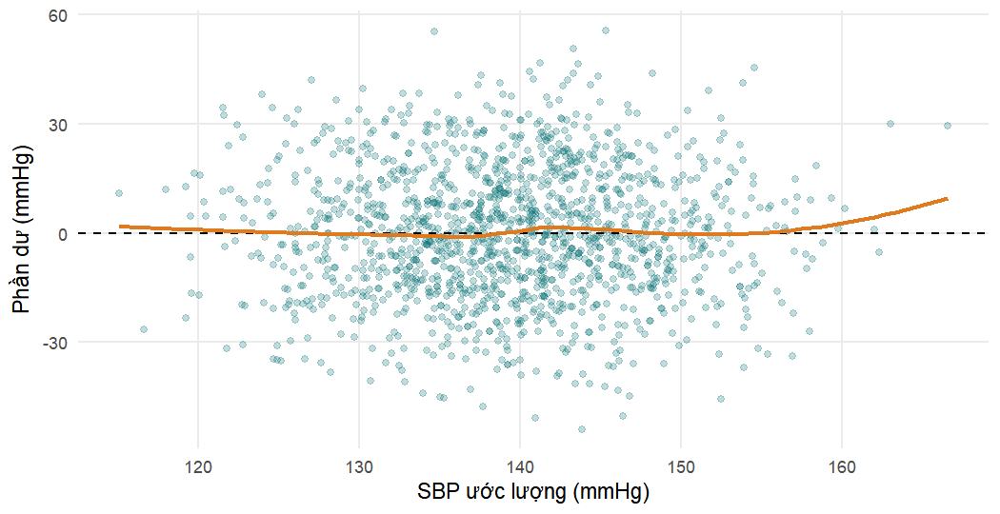

## Chương 5: Mô hình hồi quy và báo cáo kết quả

Các lời giải này sử dụng cùng các gói, dữ liệu và mô hình chính như ở
Chương 5. Mã thiết lập dưới đây tạo lại quần thể phân tích (`dx`), mô hình
đa biến được xác định trước (`model_full`) và dữ liệu trường hợp đầy đủ của
nó (`cc`). Hãy nhớ rằng dữ liệu được mô phỏng cho mục đích giảng dạy: các
kết quả minh họa phương pháp, không phải phát hiện lâm sàng thực tế.


``` r
analysis_data <- readRDS("Data/analysis_data.rds")

# Bệnh nhân đã chẩn đoán; education là factor không thứ tự (tham chiếu "None")
dx <- analysis_data |>
  filter(htn_diagnosed == "Yes") |>
  mutate(education = factor(education, ordered = FALSE))

model_full <- glm(
  treatment_uptake ~ age + sex + education + residence + diabetes +
    family_history_htn + health_insurance + knowledge_score +
    distance_to_facility_km,
  data = dx, family = binomial
)
cc <- model.frame(model_full)    # 992 trường hợp đầy đủ
```

### Bài tập 5.1

Chúng ta xây dựng mô hình tuyến tính trên tất cả người trưởng thành có dữ
liệu đầy đủ ở bốn biến và trích xuất các hệ số kèm khoảng tin cậy.


``` r
lm_sex <- lm(sbp_mmhg ~ age + bmi + sex, data = analysis_data)
summary(lm_sex)$coefficients |> round(3)
```

```
#>             Estimate Std. Error t value Pr(>|t|)
#> (Intercept)   87.309      3.214  27.168    0.000
#> age            0.260      0.034   7.714    0.000
#> bmi            1.451      0.098  14.870    0.000
#> sexMale        0.325      0.966   0.336    0.737
```

``` r
# Tuổi cho mỗi 10 năm, kèm KTC 95%
age10 <- 10 * c(coef(lm_sex)["age"], confint(lm_sex)["age", ])
round(age10, 2)
```

```
#>    age  2.5 % 97.5 % 
#>   2.60   1.94   3.26
```

``` r
c(n = nobs(lm_sex), R2 = round(summary(lm_sex)$r.squared, 3),
  adj_R2 = round(summary(lm_sex)$adj.r.squared, 3))
```

```
#>        n       R2   adj_R2 
#> 1449.000    0.161    0.159
```


1. Mỗi 10 năm tuổi tăng thêm có liên quan đến SBP trung bình cao hơn
   2.6 mmHg (KTC 95%
   1.9 đến 3.3), khi
   giữ cố định BMI và giới.
2. Nam giới có SBP trung bình cao hơn
   0.3 mmHg so với nữ giới cùng tuổi và cùng
   BMI (KTC 95% -1.6 đến
   2.2).
   Khoảng tin cậy chứa giá trị không, nên dữ liệu tương thích với việc
   không có khác biệt về SBP trung bình theo giới.
3. Mô hình giải thích được 16.1%
   phương sai của SBP, về cơ bản giống với mô hình không có biến giới trong
   chương. Việc thêm biến giới đóng góp rất ít.
4. Đồ thị phần dư được trình bày dưới đây.


``` r
augment(lm_sex) |>
  ggplot(aes(.fitted, .resid)) +
  geom_point(alpha = 0.25, colour = "#0D7377") +
  geom_hline(yintercept = 0, linetype = "dashed") +
  geom_smooth(method = "loess", se = FALSE, colour = "#E07A1F") +
  labs(x = "SBP ước lượng (mmHg)", y = "Phần dư (mmHg)")
```



Các phần dư tạo thành một dải có độ rộng gần như không đổi quanh giá trị
không, không có độ cong hay hình phễu rõ rệt, nên các giả định về tính
tuyến tính và phương sai bằng nhau có vẻ hợp lý. (Một đồ thị Q–Q, như trong
chương, sẽ được dùng để kiểm tra tính chuẩn.)

### Bài tập 5.2


``` r
tab_fh <- table(FamilyHistory = dx$family_history_htn,
                Uptake        = dx$treatment_uptake)
tab_fh
```

```
#>              Uptake
#> FamilyHistory  No Yes
#>           No  398 297
#>           Yes 183 211
```

``` r
fh <- dx |>
  group_by(family_history_htn) |>
  summarise(n = n(), p = mean(treatment_uptake == "Yes")) |>
  mutate(odds = p / (1 - p))
kable(fh, digits = 3,
      caption = "Sử dụng điều trị theo tiền sử gia đình bị tăng huyết áp.")
```


Table: Sử dụng điều trị theo tiền sử gia đình bị tăng huyết áp.

|family_history_htn |   n|     p|  odds|
|:------------------|---:|-----:|-----:|
|No                 | 695| 0.427| 0.746|
|Yes                | 394| 0.536| 1.153|

``` r
or_fh <- fh$odds[2] / fh$odds[1]          # tỷ số chênh thô
rr_fh <- fh$p[2] / fh$p[1]                # tỷ số nguy cơ thô
c(OR = round(or_fh, 3), RR = round(rr_fh, 3))
```

```
#>    OR    RR 
#> 1.545 1.253
```


``` r
glm_fh <- glm(treatment_uptake ~ family_history_htn, data = dx,
              family = binomial)
exp(coef(glm_fh))
```

```
#>           (Intercept) family_history_htnYes 
#>                0.7462                1.5451
```

``` r
# Chuyển đổi OR sang RR theo Zhang và Yu, dùng nguy cơ ở nhóm tham chiếu
p0 <- fh$p[1]
round(or_fh / ((1 - p0) + p0 * or_fh), 3)
```

```
#> [1] 1.253
```

1. Khi không có tiền sử gia đình, 42.7% bệnh nhân
   đang điều trị (odds 0.75); khi có tiền sử gia đình,
   tỷ lệ này là 53.6% (odds
   1.15). OR thô bằng 1.55.
2. Hàm mũ của hệ số từ `glm()` cho kết quả giống hệt: một mô hình hồi quy
   logistic với một biến dự báo tái tạo đúng bảng $2 \times 2$.
3. RR thô bằng 1.25, nhỏ hơn OR. Việc sử dụng điều trị phổ
   biến (khoảng 40–55%), nên odds lớn hơn nhiều so với nguy cơ và OR nằm xa
   1 hơn RR. Công thức của Zhang và Yu, với $p_0 = 0.427$, khôi
   phục chính xác RR khi áp dụng cho một OR thô.

### Bài tập 5.3

Chúng ta nhân mỗi hệ số và các giới hạn tin cậy hợp lý hồ sơ của nó với
mức tăng đã chọn trước khi lấy hàm mũ.


``` r
ci_log <- confint(model_full)
tibble(term = c("age", "knowledge_score", "distance_to_facility_km"),
       increment = c(10, 5, 10)) |>
  mutate(OR    = exp(increment * coef(model_full)[term]),
         lower = exp(increment * ci_log[term, 1]),
         upper = exp(increment * ci_log[term, 2])) |>
  kable(digits = 2, caption = "OR hiệu chỉnh cho các mức tăng đã chọn.")
```


Table: OR hiệu chỉnh cho các mức tăng đã chọn.

|term                    | increment|   OR| lower| upper|
|:-----------------------|---------:|----:|-----:|-----:|
|age                     |        10| 1.35|  1.23|  1.50|
|knowledge_score         |         5| 1.60|  1.31|  1.96|
|distance_to_facility_km |        10| 0.83|  0.65|  1.05|

Một thập kỷ tuổi là một đơn vị lâm sàng tự nhiên, và chênh lệch 5 điểm kiến
thức (một phần tư thang điểm 0–20, gần bằng khoảng tứ phân vị) dễ diễn
giải. Với khoảng cách, 10 km gần bằng chênh lệch giữa việc sống ngay cạnh
phòng khám và sống ở mức tứ phân vị trên của khoảng cách trong mẫu này. Các
mức tăng phải được chọn trước khi phân tích (và được nêu trong phần Phương
pháp), vì nếu không, nhà phân tích có thể chọn bất kỳ đơn vị nào làm cho
một mối liên quan trông ấn tượng nhất; lựa chọn này làm thay đổi độ lớn của
OR nhưng không làm thay đổi giá trị p của nó.

### Bài tập 5.4


``` r
glm_ins_cc <- glm(treatment_uptake ~ health_insurance, data = cc,
                  family = binomial)
b_crude <- coef(glm_ins_cc)["health_insuranceYes"]
b_adj   <- coef(model_full)["health_insuranceYes"]

c(crude_OR = exp(b_crude), adjusted_OR = exp(b_adj),
  pct_change_logOR = 100 * (b_adj - b_crude) / b_crude) |>
  unname() |> setNames(c("crude_OR", "adjusted_OR", "pct_change_logOR")) |>
  round(2)
```

```
#>         crude_OR      adjusted_OR pct_change_logOR 
#>             1.67             2.05            40.24
```

1. OR dịch chuyển từ 1.67 (thô) lên
   2.05 (hiệu chỉnh), một mức thay đổi khoảng
   40% của log OR, vượt xa ngưỡng
   thay đổi ước lượng 10%.
2. Một sơ đồ nhân quả hợp lý: bảo hiểm làm tăng việc sử dụng điều trị
   (bằng cách giảm chi phí thuốc và khám bệnh). Học vấn, nơi cư trú và tuổi
   có thể ảnh hưởng đến cả việc một người có bảo hiểm hay không lẫn việc họ
   có sử dụng điều trị hay không, nên chúng là các yếu tố gây nhiễu tiềm
   tàng. Điểm kiến thức có thể là biến trung gian nếu các chương trình bảo
   hiểm cung cấp giáo dục sức khỏe, hoặc là yếu tố gây nhiễu nếu những
   người hiểu biết hơn chủ động tìm kiếm bảo hiểm; chiều hướng chưa chắc
   chắn. Đái tháo đường và tiền sử gia đình khó có thể do bảo hiểm gây ra và
   chủ yếu ảnh hưởng đến biến kết cục.
3. Để phân định giữa nhiễu và tính không thể gộp, chúng ta có thể kiểm tra
   mức độ liên quan giữa bảo hiểm và các biến dự báo khác, và tính một OR
   *biên* (marginal, lấy trung bình trên quần thể) từ mô hình hiệu chỉnh
   bằng phương pháp chuẩn hóa: dự báo xác suất sử dụng điều trị của mọi
   bệnh nhân khi bảo hiểm được đặt là "Yes" và là "No", lấy trung bình mỗi
   trường hợp, rồi tính OR của hai giá trị trung bình đó. Chuẩn hóa loại bỏ
   nhiễu do các hiệp biến trong mô hình nhưng, khác với OR có điều kiện, nó
   có tính gộp được (collapsible).


``` r
# Bảo hiểm có liên quan đến các biến dự báo khác không? (OR gần 1 = yếu)
glm(health_insurance ~ age + sex + education + residence + diabetes +
      family_history_htn + knowledge_score + distance_to_facility_km,
    data = cc, family = binomial) |>
  tidy(exponentiate = TRUE) |>
  filter(term != "(Intercept)") |>
  select(term, OR = estimate, p = p.value) |>
  mutate(OR = round(OR, 2), p = round(p, 3))
```

```
#> # A tibble: 10 × 3
#>    term                       OR     p
#>    <chr>                   <dbl> <dbl>
#>  1 age                      0.99 0.237
#>  2 sexMale                  1.01 0.939
#>  3 educationPrimary         1.2  0.341
#>  4 educationSecondary       1.21 0.362
#>  5 educationTertiary        1.09 0.736
#>  6 residenceUrban           0.8  0.128
#>  7 diabetesYes              0.4  0.101
#>  8 family_history_htnYes    0.82 0.178
#>  9 knowledge_score          0.97 0.161
#> 10 distance_to_facility_km  0.99 0.243
```

``` r
# OR biên bằng chuẩn hóa trên các hiệp biến quan sát được
all_yes <- mutate(cc, health_insurance = "Yes")   # mọi người đều có bảo hiểm
all_no  <- mutate(cc, health_insurance = "No")    # không ai có bảo hiểm
p_yes <- mean(predict(model_full, newdata = all_yes, type = "response"))
p_no  <- mean(predict(model_full, newdata = all_no,  type = "response"))
c(p_insured = p_yes, p_uninsured = p_no,
  marginal_OR = (p_yes / (1 - p_yes)) / (p_no / (1 - p_no))) |> round(3)
```

```
#>   p_insured p_uninsured marginal_OR 
#>       0.564       0.409       1.869
```


Bảo hiểm chỉ liên quan yếu với phần lớn các biến dự báo khác, nhưng bệnh
nhân có bảo hiểm có phần *ít* khả năng sống ở thành thị, có đái tháo đường
hoặc có tiền sử gia đình hơn, mà tất cả các yếu tố này đều thuận lợi cho
việc sử dụng điều trị. Điều này tạo ra một mức nhiễu âm (negative
confounding) đối với OR thô. OR chuẩn hóa (biên), 1.87,
loại bỏ nhiễu đó trong khi vẫn ở trên thang trung bình quần thể giống như
OR thô. Do đó, chúng ta có thể chia sự thay đổi trên thang log-odds thành
hai phần:

- từ thô đến biên, từ 1.67 lên
  1.87: sự thay đổi do **nhiễu** từ các hiệp biến đã đo
  lường;
- từ biên đến có điều kiện, từ 1.87 lên
  2.05: sự thay đổi do **tính không thể gộp**.


``` r
logs <- c(crude = b_crude, marginal = log(marg_or), conditional = b_adj)
c(confounding_part      = unname(logs[2] - logs[1]),
  noncollapsibility_part = unname(logs[3] - logs[2])) |> round(3)
```

```
#>       confounding_part noncollapsibility_part 
#>                  0.114                  0.092
```

Hai thành phần có độ lớn tương đương nhau. Vậy câu trả lời là "cả hai":
khoảng một nửa sự thay đổi từ OR thô sang OR hiệu chỉnh phản ánh nhiễu
(bệnh nhân có bảo hiểm có ít các đặc điểm khác thuận lợi cho việc sử dụng
điều trị hơn), và khoảng một nửa phản ánh tính không thể gộp. Cả hai OR đều
hợp lệ, nhưng chúng trả lời những câu hỏi khác nhau: OR có điều kiện so
sánh những bệnh nhân có cùng giá trị hiệp biến; OR biên so sánh toàn bộ
quần thể khi có và không có bảo hiểm.

### Bài tập 5.5


``` r
drop1(model_full, test = "LRT")["education", ]
```

```
#> Single term deletions
#> 
#> Model:
#> treatment_uptake ~ age + sex + education + residence + diabetes + 
#>     family_history_htn + health_insurance + knowledge_score + 
#>     distance_to_facility_km
#>           Df Deviance  AIC  LRT Pr(>Chi)   
#> education  3     1238 1256 16.3    0.001 **
#> ---
#> Signif. codes:  0 '***' 0.001 '**' 0.01 '*' 0.05 '.' 0.1 ' ' 1
```

1. Kiểm định LR so sánh `model_full` với cùng mô hình đó nhưng không có ba
   biến chỉ thị học vấn. Giả thuyết không là cả ba hệ số của học vấn đều
   bằng không, nghĩa là odds sử dụng điều trị như nhau ở mọi mức học vấn
   khi đã tính đến các biến khác. Giả thuyết này bị bác bỏ
   ($p \approx 0.001$).


``` r
cc_num <- cc |> mutate(edu_num = as.integer(education) - 1)  # 0, 1, 2, 3

model_trend <- glm(
  treatment_uptake ~ age + sex + edu_num + residence + diabetes +
    family_history_htn + health_insurance + knowledge_score +
    distance_to_facility_km,
  data = cc_num, family = binomial
)
tidy(model_trend, exponentiate = TRUE, conf.int = TRUE) |>
  filter(term == "edu_num") |>
  select(term, OR = estimate, conf.low, conf.high, p.value)
```

```
#> # A tibble: 1 × 5
#>   term       OR conf.low conf.high   p.value
#>   <chr>   <dbl>    <dbl>     <dbl>     <dbl>
#> 1 edu_num  1.36     1.17      1.58 0.0000673
```

``` r
AIC(model_full, model_trend)
```

```
#>             df  AIC
#> model_full  12 1246
#> model_trend 10 1242
```


2. Với học vấn được mã hóa 0–3, mỗi bậc tăng trên thang học vấn (None lên
   Primary, Primary lên Secondary, Secondary lên Tertiary) có liên quan đến
   odds sử dụng điều trị gấp 1.36 lần. Điều này giả định
   OR như nhau cho mọi bậc, nên OR của Tertiary so với None là
   $1.36^3 = 2.49$.
3. Mô hình xu hướng có AIC 1242.0 so với
   1245.9 của mô hình factor: nó khớp tốt ngang bằng
   với ít hơn hai tham số, và do đó được ưu tiên theo AIC (chênh lệch khoảng
   4 điểm). Các OR theo nhóm trong chương (1,39,
   1,92, 2,44) quả thực tăng gần theo cấp số nhân. Cả hai lựa chọn đều có
   thể biện minh được; điều quan trọng là lựa chọn phải được đưa ra *trước
   khi* xem kết quả. Phiên bản factor dễ diễn giải hơn cho người đọc và
   không giả định các bậc bằng nhau; phiên bản xu hướng tiết kiệm tham số
   hơn và cho một ước lượng duy nhất, chính xác hơn. Một cách tiếp cận hợp
   lý là báo cáo các nhóm trong bảng và đề cập đến kiểm định xu hướng trong
   phần văn bản.

### Bài tập 5.6


``` r
model_fac <- update(model_full, . ~ . + facility)
anova(model_full, model_fac, test = "LRT")[, 3:5]
```

```
#>   Df Deviance Pr(>Chi)
#> 1                     
#> 2  5      7.6     0.18
```

``` r
# Phần trăm thay đổi của mỗi OR chung khi thêm cơ sở y tế
shared <- names(coef(model_full))[-1]
tibble(term = shared,
       OR_without = exp(coef(model_full)[shared]),
       OR_with    = exp(coef(model_fac)[shared])) |>
  mutate(pct_change = 100 * (OR_with - OR_without) / OR_without) |>
  kable(digits = 2, caption = "OR hiệu chỉnh khi có và không có cơ sở y tế.")
```


Table: OR hiệu chỉnh khi có và không có cơ sở y tế.

|term                    | OR_without| OR_with| pct_change|
|:-----------------------|----------:|-------:|----------:|
|age                     |       1.03|    1.03|       0.03|
|sexMale                 |       0.74|    0.74|       0.33|
|educationPrimary        |       1.39|    1.40|       0.68|
|educationSecondary      |       1.92|    1.96|       2.37|
|educationTertiary       |       2.44|    2.48|       1.65|
|residenceUrban          |       1.87|    1.87|      -0.05|
|diabetesYes             |       3.56|    3.74|       5.21|
|family_history_htnYes   |       1.91|    1.92|       0.75|
|health_insuranceYes     |       2.05|    2.04|      -0.57|
|knowledge_score         |       1.10|    1.10|       0.20|
|distance_to_facility_km |       0.98|    0.98|      -0.16|


``` r
auc_without <- auc(roc(model_full$y, fitted(model_full), quiet = TRUE))
auc_with    <- auc(roc(model_fac$y,  fitted(model_fac),  quiet = TRUE))
round(c(without = auc_without, with = auc_with), 3)
```

```
#> without    with 
#>   0.715   0.721
```


1. Thêm năm biến chỉ thị cơ sở y tế làm giảm độ lệch
   7.6 với 5 bậc tự do ($p =
   0.18$): không có bằng chứng rõ ràng rằng
   việc sử dụng điều trị khác nhau giữa các cơ sở sau khi hiệu chỉnh.
2. Mức thay đổi lớn nhất của bất kỳ OR nào khác là
   5.2% (đối với diabetesYes); không có OR
   nào thay đổi quá 10%. Cơ sở y tế không gây nhiễu các mối liên quan khác.
3. AUC chỉ tăng nhẹ, từ 0.715 lên
   0.721, như kỳ vọng mỗi khi thêm số hạng vào một mô hình
   được đánh giá trên chính dữ liệu của nó. Cơ sở y tế bổ sung rất ít. Tuy
   nhiên, nó vẫn là một biến thiết kế: bệnh nhân trong cùng một cơ sở có
   thể tương quan với nhau, và một phân tích độ nhạy với cơ sở y tế là tác
   động cố định (hoặc với sai số chuẩn vững theo cụm) đáng được báo cáo để
   cho thấy các kết luận không phụ thuộc vào việc bỏ qua tính cụm.

### Bài tập 5.7


``` r
model_ir <- update(model_full, . ~ . + health_insurance:residence)
anova(model_full, model_ir, test = "LRT")[, 3:5]
```

```
#>   Df Deviance Pr(>Chi)
#> 1                     
#> 2  1    0.303     0.58
```

Để thu được OR của bảo hiểm trong mỗi nhóm nơi cư trú, lưu ý rằng trong mô
hình tương tác, log OR của bảo hiểm là $\beta_{\text{ins}}$ ở bệnh nhân
nông thôn (nhóm tham chiếu) và $\beta_{\text{ins}} +
\beta_{\text{int}}$ ở bệnh nhân thành thị. Phương sai của tổng là
$\operatorname{Var}(\beta_{\text{ins}}) + \operatorname{Var}(\beta_{\text{int}}) +
2\operatorname{Cov}(\beta_{\text{ins}}, \beta_{\text{int}})$, lấy từ ma
trận phương sai–hiệp phương sai `vcov()`.


``` r
b <- coef(model_ir)
V <- vcov(model_ir)
ins <- "health_insuranceYes"
int <- "residenceUrban:health_insuranceYes"

log_or <- c(rural = unname(b[ins]),
            urban = unname(b[ins] + b[int]))
se     <- c(rural = sqrt(V[ins, ins]),
            urban = sqrt(V[ins, ins] + V[int, int] + 2 * V[ins, int]))

tibble(residence = names(log_or),
       OR    = exp(log_or),
       lower = exp(log_or - 1.96 * se),
       upper = exp(log_or + 1.96 * se)) |>
  kable(digits = 2,
        caption = "OR của bảo hiểm y tế theo nơi cư trú (KTC Wald).")
```


Table: OR của bảo hiểm y tế theo nơi cư trú (KTC Wald).

|residence |   OR| lower| upper|
|:---------|----:|-----:|-----:|
|rural     | 1.88|  1.24|  2.86|
|urban     | 2.21|  1.48|  3.30|


3. Một cách viết có thể: "Mối liên quan giữa bảo hiểm y tế và việc sử dụng
   điều trị không khác biệt đáng kể theo nơi cư trú (kiểm định tỷ số hợp lý
   cho tương tác $p = 0.58$); OR hiệu chỉnh
   của bảo hiểm là 1.88 (KTC 95%
   1.24 đến 2.86) ở bệnh nhân
   nông thôn và 2.21 (1.48
   đến 3.30) ở bệnh nhân thành thị. Do đó, chúng tôi
   báo cáo mô hình không có số hạng tương tác." Lưu ý rằng hai khoảng tin
   cậy theo từng tầng chồng lấn nhau rất nhiều; giả thuyết của nhà kinh tế
   không được dữ liệu này ủng hộ, mặc dù nghiên cứu không được thiết kế với
   đủ lực thống kê để phát hiện một tương tác ở mức vừa phải.

### Bài tập 5.8


``` r
treated <- dx |> filter(treatment_uptake == "Yes")
table(treated$bp_controlled, useNA = "ifany")
```

```
#> 
#>  No Yes 
#> 470  38
```

``` r
table(Diabetes = treated$diabetes, Controlled = treated$bp_controlled)
```

```
#>         Controlled
#> Diabetes  No Yes
#>      No  449  38
#>      Yes  21   0
```


1. Chỉ 38 trong số 508 bệnh nhân đang điều trị có
   huyết áp được kiểm soát. Ở đây *biến cố* là nhóm ít gặp hơn, huyết áp
   được kiểm soát, nên cỡ mẫu hiệu dụng là 38, không phải
   508.
2. Với 10 biến cố cho mỗi tham số, mô hình có thể hỗ trợ khoảng
   3 tham số. Ngay cả con số này cũng là lạc quan, và
   các ước lượng sẽ kém chính xác.
3. Chúng ta xác định trước ba tham số: tuổi, BMI và tuân thủ điều trị (tốt
   so với kém), tất cả đều là những yếu tố quyết định hợp lý về mặt lâm
   sàng đối với việc kiểm soát huyết áp. Giới được bỏ ra để tôn trọng giới
   hạn EPV. Không thể dùng đái tháo đường: không bệnh nhân đái tháo đường
   nào đang điều trị có huyết áp được kiểm soát, nên mô hình sẽ gặp hiện
   tượng tách biệt.


``` r
model_bp <- glm(bp_controlled ~ age + bmi + adherence,
                data = treated, family = binomial)
nobs(model_bp)
```

```
#> [1] 494
```

``` r
tidy(model_bp, exponentiate = TRUE, conf.int = TRUE) |>
  filter(term != "(Intercept)") |>
  select(term, OR = estimate, conf.low, conf.high, p.value) |>
  mutate(across(OR:conf.high, \(x) round(x, 2)), p.value = round(p.value, 3))
```

```
#> # A tibble: 3 × 5
#>   term             OR conf.low conf.high p.value
#>   <chr>         <dbl>    <dbl>     <dbl>   <dbl>
#> 1 age            0.97     0.95      0.99   0.013
#> 2 bmi            0.88     0.81      0.95   0.001
#> 3 adherenceGood  0.36     0.16      0.76   0.011
```

``` r
auc_bp <- auc(roc(model_bp$y, fitted(model_bp), quiet = TRUE))
round(auc_bp, 3)
```

```
#> [1] 0.739
```


4. Một đoạn Kết quả có thể viết: "Trong số 508 bệnh nhân
   đang điều trị thuốc hạ huyết áp, 38 người
   (7.5%) có huyết áp được kiểm
   soát. Do số bệnh nhân có huyết áp được kiểm soát ít, mô hình được giới
   hạn ở ba biến dự báo đã xác định trước. BMI cao hơn có liên quan đến
   odds kiểm soát thấp hơn (OR cho mỗi 5 kg/m² 0.52, KTC 95% 0.36 đến 0.76), tuổi cao
   hơn cũng vậy (OR cho mỗi 10 năm 0.73, KTC 95% 0.57 đến 0.93). Tuân thủ điều trị tốt
   có liên quan đến odds kiểm soát thấp hơn so với tuân thủ kém (OR
   0.36, KTC 95% 0.16 đến 0.76), một phát hiện không như kỳ vọng. Khả năng phân
   biệt của mô hình ở mức chấp nhận được (AUC 0.74).
   Với chỉ 38 biến cố, các ước lượng kém chính xác và cần được diễn
   giải thận trọng."

   Kết quả về tuân thủ điều trị đi ngược với kỳ vọng lâm sàng. Trong một
   nghiên cứu thực tế, nó sẽ thúc đẩy việc kiểm tra cách đo lường tuân thủ
   điều trị và kiểm soát huyết áp (ví dụ, bệnh nhân kiểm soát kém có thể
   được tư vấn nhiều hơn và sau đó báo cáo tuân thủ tốt hơn: quan hệ nhân
   quả ngược trong một thiết kế cắt ngang). Ở đây, đó đơn giản là một đặc
   điểm của dữ liệu mô phỏng, và là lời nhắc nhở rằng những kết quả khó tin
   cần được xem xét kỹ lưỡng thay vì được giải thích một cách sáng tạo.
   Cũng lưu ý rằng các KTC hợp lý hồ sơ cho các OR đã đổi thang đo được thu
   được bằng cách nhân các giới hạn trên thang log với mức tăng, như trong
   chương.
