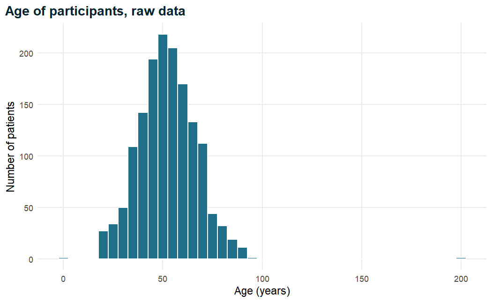
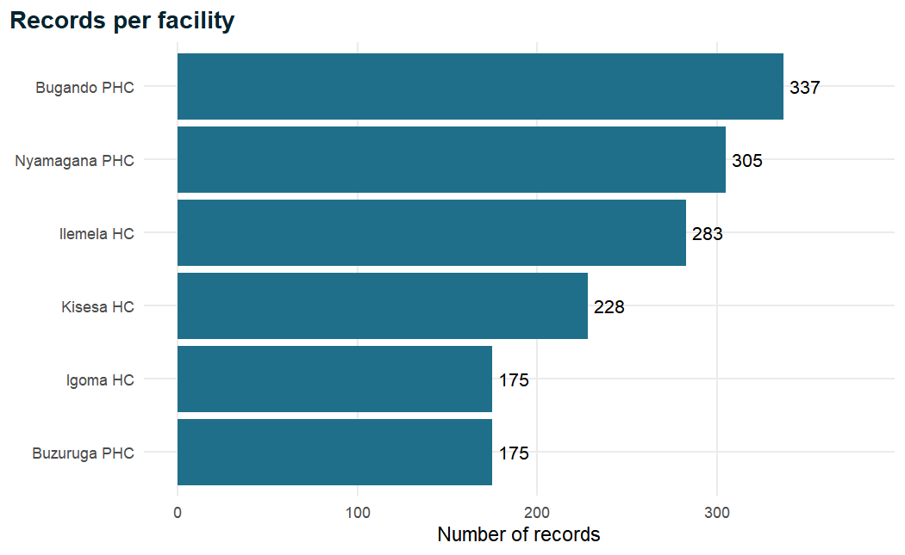

Every clinical study eventually becomes a table of numbers and words: one row per
patient, one column per measurement. Blood pressures, ages, laboratory results,
diagnoses and treatment decisions all end up in a spreadsheet or database, and
someone has to turn that table into evidence. How that is done matters. An analysis
performed by pointing and clicking leaves no record of what was done, cannot easily
be checked by a colleague, and is hard to repeat when the data are corrected or a
reviewer asks for a sensitivity analysis. An analysis written as code in R, by
contrast, is a complete, readable and re-runnable record of every step from raw data
to final table. This chapter takes you from opening R for the first time to importing
a real (simulated) clinical dataset of 1,500 adults attending primary healthcare
facilities and taking a first careful look at it. Along the way you will learn the
small set of ideas on which everything else in this book is built: objects, data
types, vectors, functions, packages, projects and data frames.

::: {.callout-note .nb-objectives icon=false title="Learning objectives"}
- Describe what R and RStudio are, name the four RStudio panes and explain why analysis code belongs in a script rather than the console.
- Use R as a calculator, including operator precedence and built-in mathematical functions, and compute simple clinical quantities such as body mass index and mean arterial pressure.
- Create, name, overwrite and remove objects with the assignment arrow `<-`.
- Distinguish the main data types (numeric, integer, character, logical, factor and Date), check them with `class()` and convert between them, recognising common coercion pitfalls.
- Create and index vectors, perform vectorised arithmetic and logical comparisons, and summarise vectors that contain missing values.
- Call functions with positional and named arguments, find and read help pages, and interpret common error messages.
- Install and load packages, organise work in an RStudio Project and use relative file paths.
- Import a CSV and an Excel file into a data frame, inspect it with `dim()`, `names()`, `glimpse()`, `summary()` and `table()`, and identify data-quality problems.
- Use the pipe `|>` with the `dplyr` verbs `select()`, `filter()`, `arrange()`, `mutate()` and `count()`.
- Write a well-structured, commented and reproducible analysis script.
:::


## 1.1 What R and RStudio are {#sec-r-rstudio}

### 1.1.1 R: a language for data analysis

**R** is a free, open-source programming language and software environment designed
for statistical computing and graphics [@rcore2026]. It was created in the 1990s as an
open implementation of the S language developed at Bell Laboratories, and it is now
maintained by the R Core Team and a very large community of contributors. Three
features explain why R has become one of the standard tools of clinical and
epidemiological research.

First, R is **free and open**. Anyone can download it, anyone can inspect the code
that performs a calculation, and there are no licence fees standing between a
district hospital, a university department or a ministry of health and a
state-of-the-art statistical analysis. Second, R is **extensible**. Thousands of
add-on *packages* contributed by statisticians and data scientists provide
methods ranging from simple frequency tables to survival analysis, multiple
imputation, meta-analysis and machine learning. When a new method is published,
an R implementation often appears at the same time. Third, and most importantly
for research, R is a **language**. You do not tell R what to do by clicking menus;
you write instructions. Those instructions can be saved, read, shared, checked and
run again, which is the foundation of reproducible research.

### 1.1.2 RStudio: a comfortable place to work with R

R itself is the engine that performs the computations. On its own it offers only a
rather bare window in which you type commands. **RStudio** (developed by the company
Posit) is an *integrated development environment*, or IDE: a program that sits on top
of R and gives you a script editor, a console, a viewer for your data and plots,
a file browser, a help browser and many conveniences such as auto-completion and
keyboard shortcuts. A useful analogy is a car: R is the engine and RStudio is the
dashboard, steering wheel and seats. You need both, you install R first, and once
both are installed you only ever open RStudio, which starts R for you behind the
scenes.

Installing the software is straightforward. R is downloaded from the Comprehensive
R Archive Network (CRAN) at [https://cran.r-project.org](https://cran.r-project.org),
choosing the installer for your operating system. RStudio Desktop (free) is downloaded
from [https://posit.co/download/rstudio-desktop](https://posit.co/download/rstudio-desktop).
Accept the default options in both installers.

### 1.1.3 The four RStudio panes

When you open RStudio you see a window divided into (up to) four panes. Knowing
what each pane is for removes most of the confusion of the first hour.

Table: The four panes of RStudio in their default positions.

| Pane | Default position | What it is for |
|------|------------------|----------------|
| Source (script editor) | Top left | Writing, editing and saving code. This is the permanent record of your analysis. |
| Console | Bottom left | Where R actually runs code and prints results. Typing here is possible but nothing is saved. |
| Environment / History | Top right | Lists the objects (datasets, values, results) currently held in memory, and the commands run so far. |
| Files / Plots / Packages / Help / Viewer | Bottom right | Browsing the project folder, viewing figures, managing packages and reading help pages. |

If you see only three panes, no script is open yet: choose *File > New File > R
Script* (or press `Ctrl+Shift+N` on Windows, `Cmd+Shift+N` on macOS) and the source
pane appears. Panes can be resized and rearranged under *Tools > Global Options >
Pane Layout*, but the defaults are sensible and this book assumes them.

### 1.1.4 Console versus script

The **console** is a conversation with R. You type a command after the prompt `>`,
press Enter, and R replies immediately. This is perfect for quick questions ("what
is the mean of this column?", "what does this function do?"), but the conversation is
ephemeral. When you close RStudio, or after a few hundred lines of output, there is no
tidy record of what you asked and in what order.

A **script** is a plain text file, with the extension `.R`, that contains R commands
written one after the other, together with comments explaining them. You write code
in the script, place the cursor on a line and press `Ctrl+Enter` (Windows) or
`Cmd+Enter` (macOS); RStudio sends that line to the console, R runs it, and the result
appears in the console exactly as if you had typed it there. Highlighting several lines
and pressing `Ctrl+Enter` runs all of them; `Ctrl+Shift+Enter` runs the entire script
from top to bottom.

In this book R code is shown in grey boxes. Lines that R prints in response begin with
`#>`, so that you can tell input from output. For example:


``` r
2 + 2
```

```
#> [1] 4
```

The `[1]` at the start of the output is an index: it says that the first value shown on
this line is element number 1 of the result. It becomes useful when R prints long
results spread over several lines.

### 1.1.5 Why scripts make analysis reproducible

An analysis is **reproducible** when another person (or you, six months later) can take
the same data and the same code and obtain exactly the same results. @peng2011 argues
that reproducibility is the minimum standard by which computational science should be
judged: even when a study cannot be independently *replicated* with new patients,
readers should at least be able to verify that the reported numbers follow from the
data. In clinical research this matters for very practical reasons. Datasets are
corrected after queries are resolved; reviewers ask for an additional adjustment;
a data safety monitoring board requests the same tables at the next interim look; a
student inherits a supervisor's project. With a script, each of these requests means
re-running the code. Without one, it means trying to remember what was clicked.

@wilson2017 describe a set of "good enough" computing practices that any researcher
can adopt without becoming a software engineer. Several of them are introduced in this
chapter: keep raw data unchanged and do all modifications in code, write code in
scripts with comments, give files and objects meaningful names, organise each piece of
work in its own project folder, and use relative rather than absolute file paths. None
of these is difficult, and together they protect you from a large share of the errors
that creep into manual analyses.

::: {.callout-tip title="Good practice"}
Write every command that matters in your script, even if you test it first in the
console. A useful rule: if a line produced a number that will appear in a report, it
must exist in a saved script. The console is for exploring; the script is the analysis.
:::

## 1.2 R as a calculator {#sec-calculator}

The simplest way to start with R is to treat it as a very powerful calculator.

### 1.2.1 Arithmetic operators

R understands the usual arithmetic operators.


``` r
140 + 90     # addition
```

```
#> [1] 230
```

``` r
140 - 90     # subtraction
```

```
#> [1] 50
```

``` r
140 * 2      # multiplication
```

```
#> [1] 280
```

``` r
140 / 90     # division
```

```
#> [1] 1.556
```

``` r
2^10         # exponentiation (2 to the power 10)
```

```
#> [1] 1024
```

``` r
17 %/% 5     # integer division: how many whole 5s fit into 17
```

```
#> [1] 3
```

``` r
17 %% 5      # remainder (modulo): what is left over
```

```
#> [1] 2
```

Everything after a `#` on a line is a **comment**. R ignores it, but human readers do
not, and comments are one of the most important parts of any script. Notice also that
R prints `1.556` for `140 / 90`: by default R shows about seven significant digits
(this book uses four to keep output compact), but internally it stores the number to
about fifteen or sixteen digits of precision.

### 1.2.2 Operator precedence

When an expression contains several operators, R follows the conventional
mathematical order of operations: parentheses first, then exponentiation, then
multiplication and division (from left to right), and finally addition and
subtraction (from left to right).

Table: Order in which R evaluates arithmetic operators (highest first).

| Priority | Operator | Meaning |
|----------|----------|---------|
| 1 | `( )` | Parentheses |
| 2 | `^` | Exponentiation |
| 3 | `-x` | Unary minus (a negative sign) |
| 4 | `%%`, `%/%` | Modulo, integer division |
| 5 | `*`, `/` | Multiplication, division |
| 6 | `+`, `-` | Addition, subtraction |

The consequences are easy to see:


``` r
2 + 3 * 4      # multiplication first: 2 + 12
```

```
#> [1] 14
```

``` r
(2 + 3) * 4    # parentheses first: 5 * 4
```

```
#> [1] 20
```

``` r
-2^2           # exponent before the minus sign: -(2^2)
```

```
#> [1] -4
```

``` r
(-2)^2         # the square of minus two
```

```
#> [1] 4
```

When in doubt, add parentheses. They cost nothing, they make your intention explicit
to the reader, and they prevent a whole class of silent errors. A formula that is
wrong because of precedence does not produce an error message; it produces a
plausible-looking but incorrect number, which is far more dangerous.

### 1.2.3 Mathematical functions

R contains a large library of built-in mathematical functions. A **function** is a
named piece of code that takes one or more inputs (called *arguments*) inside
parentheses and returns a result. We will look at functions in detail in Section 1.6;
for now, a few common ones are enough.


``` r
sqrt(16)          # square root
```

```
#> [1] 4
```

``` r
abs(-7)           # absolute value
```

```
#> [1] 7
```

``` r
exp(1)            # e, the base of natural logarithms
```

```
#> [1] 2.718
```

``` r
log(100)          # natural logarithm (base e)
```

```
#> [1] 4.605
```

``` r
log10(100)        # logarithm base 10
```

```
#> [1] 2
```

``` r
log(8, base = 2)  # logarithm with a chosen base
```

```
#> [1] 3
```

``` r
round(3.14159, 2) # round to 2 decimal places
```

```
#> [1] 3.14
```

``` r
signif(123456, 2) # round to 2 significant figures
```

```
#> [1] 120000
```

Note that `log()` in R is the **natural** logarithm, written $\ln$ in many textbooks.
This surprises people who are used to calculators where "log" means base 10. Natural
logarithms appear throughout biostatistics (for example in logistic regression in
Chapter 5, where odds ratios are obtained by exponentiating coefficients with `exp()`),
so it is worth remembering now.

### 1.2.4 A clinical example: body mass index and mean arterial pressure

Let us use R for two calculations that clinicians perform every day. Body mass index
(BMI) is weight in kilograms divided by the square of height in metres:

$$
\text{BMI} = \frac{\text{weight (kg)}}{\text{height (m)}^2}
$$

For a patient who weighs 78.5 kg and is 166.2 cm tall, we must first convert height
to metres by dividing by 100:


``` r
78.5 / (166.2 / 100)^2
```

```
#> [1] 28.42
```

The parentheses around `166.2 / 100` matter. Without them R would compute
`100^2` first (exponentiation has the highest priority) and divide 166.2 by 10,000,
giving a nonsensical BMI of over 470,000.

Mean arterial pressure (MAP) estimates the average pressure in the arteries over one
cardiac cycle. Because the heart spends roughly two-thirds of each cycle in diastole,
a common approximation weights the diastolic blood pressure (DBP) more heavily than
the systolic (SBP):

$$
\text{MAP} \approx \text{DBP} + \frac{\text{SBP} - \text{DBP}}{3}
$$

For a reading of 152/95 mmHg:


``` r
95 + (152 - 95) / 3
```

```
#> [1] 114
```

``` r
round(95 + (152 - 95) / 3, 1)
```

```
#> [1] 114
```

The MAP is about 114 mmHg. Again, the parentheses around `152 - 95` are essential;
`95 + 152 - 95 / 3` would subtract only a third of the diastolic pressure and give
215.3 mmHg, a value that is wrong but not obviously absurd to a tired eye.

::: {.callout-note title="Clinical interpretation"}
A MAP of about 114 mmHg is well above the range usually seen in normotensive adults
(roughly 70 to 100 mmHg), consistent with the elevated reading of 152/95 mmHg.
The point here is not the clinical decision but the computation: once a formula is
written correctly in R, it can be applied identically to one patient or to all
1,500 patients in a study, with no transcription errors.
:::

## 1.3 Objects and assignment {#sec-objects}

Calculating a value and letting it scroll off the screen is of limited use. To work
with a value again we store it in an **object** (sometimes called a variable): a name
that refers to a value held in the computer's memory.

### 1.3.1 The assignment arrow

Objects are created with the **assignment operator** `<-`, typed as a "less than"
sign followed by a hyphen. It is read aloud as "gets": `sbp <- 152` reads "sbp gets
152". In RStudio the keyboard shortcut `Alt + -` (Windows) or `Option + -` (macOS)
types the arrow with spaces around it.


``` r
sbp <- 152    # systolic blood pressure of one patient
dbp <- 95     # diastolic blood pressure of the same patient
```

Assignment is silent: R stores the values but prints nothing. To see what an object
contains, type its name (which implicitly calls `print()`):


``` r
sbp
```

```
#> [1] 152
```

``` r
print(dbp)
```

```
#> [1] 95
```

Objects behave exactly like the values they contain, so they can be used in
calculations, and the results can themselves be stored:


``` r
sbp + 10
```

```
#> [1] 162
```

``` r
map <- dbp + (sbp - dbp) / 3   # mean arterial pressure
map
```

```
#> [1] 114
```

``` r
pulse_pressure <- sbp - dbp
pulse_pressure
```

```
#> [1] 57
```

This is the first glimpse of why programming is powerful. The formula for MAP is now
written once, in terms of named quantities, and anyone reading the code can see what
it means.

::: {.callout-warning title="Common mistake"}
R also accepts `=` for assignment at the top level (`sbp = 152` works), and `->`
assigns to the right (`152 -> sbp`). The R community convention, followed throughout
this book, is to use `<-` for assignment and to reserve `=` for naming arguments
inside function calls, for example `round(x, digits = 1)`. Mixing the two makes code
harder to read. A related slip is to type `<` and `-` with a space between them:
`sbp < - 152` is not an assignment at all but the question "is sbp less than minus
152?", which returns `FALSE` and leaves `sbp` unchanged.
:::

### 1.3.2 Naming objects

Object names must follow a few rules:

- They may contain letters, digits, full stops (`.`) and underscores (`_`).
- They must start with a letter (or a full stop not followed by a digit).
- They cannot contain spaces or other symbols such as `-`, `/` or `%`.
- They cannot be reserved words such as `if`, `else`, `TRUE`, `FALSE`, `NA`,
  `function`, `for` or `NULL`.

Within these rules you are free, and good names are worth thinking about. Names should
say what the object holds, be short enough to type, and follow a consistent style.
This book uses **snake case**: lower-case words joined by underscores, which is also
the style of the case-study dataset (`sbp_mmhg`, `treatment_uptake`). Including the
unit in the name of a measurement, as in `weight_kg` or `creatinine_umol_l`, prevents
a common clinical error: mixing up units such as mmol/L and mg/dL.

Table: Examples of object names.

| Name | Valid? | Comment |
|------|--------|---------|
| `sbp_mmhg` | Yes | Clear, includes the unit, snake case |
| `mean_age_diagnosed` | Yes | Descriptive; long but readable |
| `x2` | Yes | Valid but says nothing about its content |
| `SBP` | Yes | Valid, but a different object from `sbp` |
| `2nd_visit` | No | Starts with a digit; use `visit_2` |
| `systolic bp` | No | Contains a space |
| `bp-control` | No | R reads this as `bp` minus `control` |

R is **case-sensitive**. The objects `sbp`, `SBP` and `Sbp` are three different
objects, and asking for one that does not exist produces an error:


``` r
SBP
```

```
#> Error:
#> ! object 'SBP' not found
```

The message "object 'SBP' not found" is probably the most common error message in R.
It almost always means a typing slip (a capital letter, a missing underscore) or that
the line creating the object was never run.

### 1.3.3 Overwriting objects and the environment

Assigning a new value to an existing name **replaces** the old value without warning:


``` r
age <- 60
age
```

```
#> [1] 60
```

``` r
age <- 61     # the old value 60 is gone
age
```

```
#> [1] 61
```

``` r
age <- age + 1  # use the old value to compute the new one
age
```

```
#> [1] 62
```

The line `age <- age + 1` looks odd to anyone with a mathematics background, but it is
perfectly natural in R: the right-hand side is computed first using the current value
of `age`, and the result is then stored back under the same name.

All objects you create live in the **global environment**, which is what the
Environment pane in RStudio displays. You can also list them in code, and remove ones
you no longer need:


``` r
ls()               # list the objects in the environment
```

```
#> [1] "age"            "dbp"            "map"            "pulse_pressure"
#> [5] "sbp"
```

``` r
rm(pulse_pressure) # remove one object
ls()
```

```
#> [1] "age" "dbp" "map" "sbp"
```

::: {.callout-tip title="Good practice"}
Do not rely on the contents of your environment. Objects created by lines you have
since deleted from your script may still be lurking in memory, and your script may
appear to work only because of them. Restart R regularly (*Session > Restart R*, or
`Ctrl+Shift+F10`) and run your script from the top. In *Tools > Global Options >
General*, untick "Restore .RData into workspace at startup" and set "Save workspace to
.RData on exit" to "Never", so that every session starts clean [@wickham2023r4ds].
:::

## 1.4 Data types {#sec-data-types}

Every value in R has a **type**, and the type determines what R can do with it. You can
add two numbers but not two names; you can sort dates chronologically but sorting them
as text gives the wrong order. Most of the data-cleaning work in Chapter 2 is, at heart,
the work of making sure every variable has the right type.

### 1.4.1 The basic types

Table: The main data types used in clinical data analysis.

| Type (class) | Example | Typical clinical use |
|--------------|---------|----------------------|
| numeric (double) | `152`, `23.4`, `-0.5` | Blood pressure, BMI, laboratory values |
| integer | `3L`, `0L` | Counts such as number of comorbidities |
| character | `"Female"`, `"PHC-0142"` | Identifiers, free text, raw category labels |
| logical | `TRUE`, `FALSE` | Yes/no conditions such as "SBP at least 140" |
| factor | `Female`, `Male` (with levels) | Categorical variables: sex, facility, education |
| Date | `2024-03-15` | Enrolment date, date of diagnosis |

**Numeric** values are real numbers stored in "double precision". They are the default
for anything that looks like a number. **Integers** are whole numbers; you rarely need
to create them explicitly (the suffix `L`, as in `3L`, does so), and for analysis
purposes integers and doubles behave almost identically. **Character** values, also
called *strings*, are text, and must always be written inside quotation marks, single
or double. **Logical** values are `TRUE` and `FALSE` (always in capitals) and are
produced by comparisons. **Factors** are R's way of storing categorical data: a set of
values restricted to a fixed list of categories, called *levels*. **Dates** store
calendar dates in a form that allows arithmetic (how many days between enrolment and
follow-up?) and correct chronological ordering.

### 1.4.2 Checking the type: `class()` and the `is.*()` functions

The function `class()` reports the type of any object.


``` r
class(152)
```

```
#> [1] "numeric"
```

``` r
class(3L)
```

```
#> [1] "integer"
```

``` r
class("Female")
```

```
#> [1] "character"
```

``` r
class(TRUE)
```

```
#> [1] "logical"
```

``` r
class(sbp > 140)
```

```
#> [1] "logical"
```

A family of functions beginning with `is.` asks a yes/no question about type:


``` r
is.numeric(152)
```

```
#> [1] TRUE
```

``` r
is.character(152)
```

```
#> [1] FALSE
```

``` r
is.character("152")
```

```
#> [1] TRUE
```

``` r
is.logical(FALSE)
```

```
#> [1] TRUE
```

The last pair of examples deserves attention. `152` and `"152"` look alike on the
screen, but the first is a number and the second is a piece of text that happens to
consist of digits. You cannot do arithmetic with the second:


``` r
"152" + 10
```

```
#> Error in `"152" + 10`:
#> ! non-numeric argument to binary operator
```

"Non-numeric argument to binary operator" means that one side of the `+` is not a
number. When you meet this message on real data, the usual cause is a column that
*should* be numeric but was imported as character because a few cells contained
text, such as `"missing"`, `"<0.5"` or `"n/a"`.

### 1.4.3 Converting types: the `as.*()` functions

Each `is.` function has an `as.` partner that attempts to convert a value to the
corresponding type. This is called **coercion**.


``` r
as.numeric("152")       # text to number
```

```
#> [1] 152
```

``` r
as.character(152)       # number to text
```

```
#> [1] "152"
```

``` r
as.numeric(TRUE)        # TRUE becomes 1
```

```
#> [1] 1
```

``` r
as.numeric(FALSE)       # FALSE becomes 0
```

```
#> [1] 0
```

``` r
as.logical("TRUE")      # text to logical
```

```
#> [1] TRUE
```

``` r
as.integer(3.9)         # truncates towards zero; it does NOT round
```

```
#> [1] 3
```

### 1.4.4 Coercion pitfalls

Conversion is not always possible. When R cannot convert a value it does not stop
with an error; it produces `NA` (R's code for a missing value) and issues a warning:


``` r
as.numeric(c("120", "135", "missing", "<90"))
```

```
#> [1] 120 135  NA  NA
```

(The warning "NAs introduced by coercion" is suppressed in this book's output but will
appear on your screen.) This behaviour is convenient but dangerous: a careless
conversion can quietly turn genuine information, such as "below the detection limit",
into missing data. Always count missing values before and after a conversion, and
investigate any that appear.

A second pitfall arises when values of different types are combined. A vector (see
Section 1.5) can hold only one type, so R silently converts everything to the most
flexible type present, following the hierarchy logical < integer < numeric <
character:


``` r
c(152, 138, "145")   # one text value turns all values into text
```

```
#> [1] "152" "138" "145"
```

``` r
c(TRUE, FALSE, 3)    # logicals become 0/1 numbers
```

```
#> [1] 1 0 3
```

A single stray character entry in a column of blood pressures is therefore enough to
turn the whole column into text. This is exactly what has happened to several columns
of the raw case-study data, as we will see in Section 1.10.

The third pitfall is the conversion of factors to numbers. A factor is stored
internally as integer codes (1, 2, 3, ...) with labels attached, and `as.numeric()`
returns the codes, not the labels:


``` r
dose <- factor(c("10", "5", "20", "5"))
dose
```

```
#> [1] 10 5  20 5 
#> Levels: 10 20 5
```

``` r
as.numeric(dose)                 # the internal codes: wrong!
```

```
#> [1] 1 3 2 3
```

``` r
as.numeric(as.character(dose))   # convert to text first: right
```

```
#> [1] 10  5 20  5
```

### 1.4.5 Factors

Categorical clinical variables, such as sex, facility, education level or smoking
status, are best stored as factors. A factor knows its permitted categories (its
levels) and their order, which matters for tables, plots and, crucially, for
regression models, where the first level becomes the *reference category*
(Chapter 5).


``` r
smoking <- factor(c("Never", "Current", "Former", "Never", "Never"),
                  levels = c("Never", "Former", "Current"))
smoking
```

```
#> [1] Never   Current Former  Never   Never  
#> Levels: Never Former Current
```

``` r
levels(smoking)
```

```
#> [1] "Never"   "Former"  "Current"
```

``` r
table(smoking)
```

```
#> smoking
#>   Never  Former Current 
#>       3       1       1
```

Without the `levels` argument, R would have ordered the levels alphabetically
(Current, Former, Never), which is rarely the order a clinician wants to read. A
value that is not among the levels becomes `NA`, which is a useful safeguard against
misspellings: `factor("Curent", levels = c("Never", "Former", "Current"))` gives `NA`
rather than creating a fourth, spurious category.

### 1.4.6 Dates

Dates are stored as the number of days since 1 January 1970, which allows arithmetic,
but they print in the familiar year-month-day format. The function `as.Date()` converts
text in the international standard format (ISO 8601, `YYYY-MM-DD`) into a date:


``` r
enrol <- as.Date("2024-03-15")
followup <- as.Date("2024-09-11")
class(enrol)
```

```
#> [1] "Date"
```

``` r
followup - enrol                  # a difference in days
```

```
#> Time difference of 180 days
```

``` r
as.numeric(followup - enrol) / 7  # in weeks
```

```
#> [1] 25.71
```

``` r
format(enrol, "%d %B %Y")         # print in a friendlier format
```

```
#> [1] "15 March 2024"
```

Dates entered in other formats, such as `15/03/2024` or `15-Mar-2024`, need to be
told their format, and datasets in which several formats are mixed are common. The
**lubridate** package [@grolemund2011] makes parsing such dates much easier, and we
use it in Chapter 2.

::: {.callout-note title="Clinical interpretation"}
Types are not a technicality. If treatment uptake is stored as the text `"1"` and
`"0"` in some rows and `"Yes"` and `"No"` in others, a frequency table will show four
categories instead of two and every proportion will be wrong. If enrolment dates are
stored as text, "01/02/2024" sorts before "2024-01-12" regardless of which came first.
Getting types right is the first step of a valid analysis.
:::

## 1.5 Vectors {#sec-vectors}

So far each object has held a single value. Clinical data, of course, consist of many
values: the systolic pressures of all patients in a clinic, the sexes of all
participants. R's basic structure for a collection of values is the **vector**: an
ordered sequence of values, all of the same type. In fact a single number such as
`152` is simply a vector of length one, which is why R prints `[1]` in front of it.

### 1.5.1 Creating vectors

The function `c()`, for "combine", creates a vector from its arguments.


``` r
sbp_readings <- c(152, 138, 145, 160, 129, 142)   # numeric
sex <- c("Female", "Male", "Female", "Female", "Male", "Female")  # character
on_treatment <- c(TRUE, FALSE, TRUE, TRUE, FALSE, FALSE)          # logical
sbp_readings
```

```
#> [1] 152 138 145 160 129 142
```

``` r
length(sbp_readings)
```

```
#> [1] 6
```

These six values could represent the systolic blood pressures of six patients seen
during one morning clinic, with their sexes and treatment status in matching
positions.

### 1.5.2 Regular sequences: `seq()`, `:` and `rep()`

Sequences of numbers are needed often, for example to define age bands or follow-up
times. The colon operator creates integer sequences, `seq()` creates sequences with
any step, and `rep()` repeats values.


``` r
1:10                                  # integers from 1 to 10
```

```
#>  [1]  1  2  3  4  5  6  7  8  9 10
```

``` r
seq(from = 18, to = 88, by = 10)      # age band boundaries
```

```
#> [1] 18 28 38 48 58 68 78 88
```

``` r
seq(0, 1, length.out = 5)             # five equally spaced values
```

```
#> [1] 0.00 0.25 0.50 0.75 1.00
```

``` r
rep("Control", times = 3)             # repeat a value
```

```
#> [1] "Control" "Control" "Control"
```

``` r
rep(c("A", "B"), times = 3)           # repeat a pattern
```

```
#> [1] "A" "B" "A" "B" "A" "B"
```

``` r
rep(c("A", "B"), each = 3)            # repeat each element
```

```
#> [1] "A" "A" "A" "B" "B" "B"
```

The last two lines show the difference between the `times` and `each` arguments,
which is useful when constructing, for example, a treatment allocation list in a
block design.

### 1.5.3 Indexing: extracting elements

Individual elements of a vector are extracted with square brackets `[ ]`. Positions
in R start at 1 (not 0, as in some other languages).


``` r
sbp_readings[1]          # the first reading
```

```
#> [1] 152
```

``` r
sbp_readings[c(1, 3)]    # the first and third
```

```
#> [1] 152 145
```

``` r
sbp_readings[2:4]        # the second to the fourth
```

```
#> [1] 138 145 160
```

``` r
sbp_readings[-1]         # everything except the first
```

```
#> [1] 138 145 160 129 142
```

``` r
sbp_readings[length(sbp_readings)]  # the last
```

```
#> [1] 142
```

A negative index removes elements rather than selecting them. Indexing beyond the
end of a vector returns `NA` rather than an error, which is another situation where R
quietly gives you a missing value.

The most useful form of indexing uses a **logical vector**: R keeps the elements in
the positions where the index is `TRUE`.


``` r
sbp_readings[on_treatment]          # SBP of patients on treatment
```

```
#> [1] 152 145 160
```

``` r
sbp_readings[sex == "Male"]         # SBP of male patients
```

```
#> [1] 138 129
```

This is the idea that underlies all filtering of data, from selecting the hypertensive
patients in a study to excluding implausible values.

### 1.5.4 Vectorised arithmetic

Arithmetic in R is **vectorised**: an operation applied to a vector is applied to
every element at once, without writing a loop.


``` r
sbp_readings - 10           # subtract 10 from every reading
```

```
#> [1] 142 128 135 150 119 132
```

``` r
sbp_readings / 7.5          # convert mmHg to kPa (1 kPa = 7.5 mmHg)
```

```
#> [1] 20.27 18.40 19.33 21.33 17.20 18.93
```

``` r
dbp_readings <- c(95, 88, 90, 101, 79, 85)
map_readings <- dbp_readings + (sbp_readings - dbp_readings) / 3
round(map_readings, 1)
```

```
#> [1] 114.0 104.7 108.3 120.7  95.7 104.0
```

When two vectors of the same length are combined, R pairs them element by element: the
first SBP with the first DBP, the second with the second, and so on. This is precisely
what we want when each position represents one patient. (If the lengths differ, R
*recycles* the shorter vector, with a warning if the lengths are not multiples of
each other. Recycling is occasionally useful but is more often a sign of a mistake.)

### 1.5.5 Logical comparisons

Comparison operators produce logical vectors.

Table: Comparison and logical operators in R.

| Operator | Meaning | Example |
|----------|---------|---------|
| `==` | equal to | `sex == "Female"` |
| `!=` | not equal to | `sex != "Female"` |
| `<`, `<=` | less than (or equal) | `sbp < 140` |
| `>`, `>=` | greater than (or equal) | `dbp >= 90` |
| `&` | and (both true) | `sbp >= 140 & dbp >= 90` |
| `!` | not | `!on_treatment` |
| `%in%` | is in a set | `sex %in% c("F", "f")` |

The table omits one operator because its symbol clashes with the table layout: the
vertical bar `|` means *or*, so `sbp >= 140 | dbp >= 90` is `TRUE` when at least one of
the two conditions is true. Note also the double equals sign `==` for comparison; a
single `=` is an assignment or an argument name, never a test of equality.


``` r
high_sbp <- sbp_readings >= 140
high_sbp
```

```
#> [1]  TRUE FALSE  TRUE  TRUE FALSE  TRUE
```

``` r
high_bp <- sbp_readings >= 140 | dbp_readings >= 90   # either is raised
high_bp
```

```
#> [1]  TRUE FALSE  TRUE  TRUE FALSE  TRUE
```

Because `TRUE` is treated as 1 and `FALSE` as 0 in arithmetic, `sum()` of a logical
vector counts the `TRUE` values and `mean()` gives their proportion. This little trick
is used constantly in data analysis.


``` r
sum(high_bp)    # how many patients have a raised reading
```

```
#> [1] 4
```

``` r
mean(high_bp)   # the proportion
```

```
#> [1] 0.6667
```

Four of the six patients (67%) have a systolic pressure of at least 140 mmHg or a
diastolic pressure of at least 90 mmHg, the conventional thresholds for raised office
blood pressure [@who2021htn]. In this small example the patients with a raised
diastolic pressure happen also to have a raised systolic pressure, so `high_bp` and
`high_sbp` coincide; in a larger sample they would not.

### 1.5.6 Summary functions

R has many functions that reduce a vector to a single summary value. We meet them
properly, with their statistical meaning, in Chapter 3; here is a preview.


``` r
mean(sbp_readings)
```

```
#> [1] 144.3
```

``` r
median(sbp_readings)
```

```
#> [1] 143.5
```

``` r
sd(sbp_readings)       # standard deviation
```

```
#> [1] 10.82
```

``` r
min(sbp_readings)
```

```
#> [1] 129
```

``` r
max(sbp_readings)
```

```
#> [1] 160
```

``` r
range(sbp_readings)
```

```
#> [1] 129 160
```

``` r
summary(sbp_readings)  # six-number summary
```

```
#>    Min. 1st Qu.  Median    Mean 3rd Qu.    Max. 
#>     129     139     144     144     150     160
```

The output of `summary()` gives, from left to right, the minimum, the first quartile
(25% of values lie below it), the median, the mean, the third quartile and the maximum.
For these six readings the mean (144.3) and median (143.5) are close, suggesting that
the values are fairly symmetric around their centre.

For a character vector, the natural summary is a frequency table:


``` r
table(sex)
```

```
#> sex
#> Female   Male 
#>      4      2
```

### 1.5.7 Missing values: `NA`

Real data have gaps. A blood sample haemolysed, a patient declined to be weighed, a
form was left blank. R represents a missing value by the special symbol `NA` ("not
available"), which can appear in a vector of any type. Missing values are contagious:
any calculation involving an unknown value is itself unknown.


``` r
weights <- c(61.3, 68.3, NA, 78.5, 71.6)
weights + 1
```

```
#> [1] 62.3 69.3   NA 79.5 72.6
```

``` r
mean(weights)
```

```
#> [1] NA
```

The mean of five numbers of which one is unknown cannot be known, so R answers `NA`.
This is the right default, because it forces you to notice the missing value. To
compute the mean of the *observed* values, set the argument `na.rm = TRUE` ("NA
remove"):


``` r
mean(weights, na.rm = TRUE)
```

```
#> [1] 69.92
```

``` r
sum(is.na(weights))    # how many values are missing?
```

```
#> [1] 1
```

The function `is.na()` returns `TRUE` for each missing element, so `sum(is.na(x))`
counts missing values. You cannot test for missingness with `x == NA`, because
comparing anything to an unknown value gives an unknown result: `NA == NA` is `NA`.

::: {.callout-warning title="Common mistake"}
Do not reach for `na.rm = TRUE` automatically. It is easy to compute a mean "of all
patients" that is actually the mean of the 60% who had the test. Always report how
many values were missing alongside any summary, and think about why they are missing:
values missing for a reason related to the outcome can bias results [@little2019].
Missing data are discussed further in Chapters 2 and 3.
:::

## 1.6 Functions, arguments and help {#sec-functions}

### 1.6.1 The anatomy of a function call

You have already used many functions: `sqrt()`, `round()`, `mean()`, `c()`, `seq()`.
Every function call has the same shape: the function's name, followed by parentheses
containing its **arguments**, separated by commas. Arguments are the inputs that tell
the function what to work on and how.


``` r
round(144.33333, digits = 1)
```

```
#> [1] 144.3
```

Here `round` is the function, `144.33333` is the first argument (the number to round)
and `digits = 1` is a second argument that controls the behaviour. The function
returns a value, which R prints, or which you can store in an object.

### 1.6.2 Positional and named arguments

Arguments can be supplied in two ways. **Positional** arguments are matched by their
order in the function's definition; **named** arguments are matched by name, in any
order. The definition of `seq()` begins `seq(from, to, by, ...)`, so these calls are
equivalent:


``` r
seq(18, 88, 10)                   # positional
```

```
#> [1] 18 28 38 48 58 68 78 88
```

``` r
seq(from = 18, to = 88, by = 10)  # named
```

```
#> [1] 18 28 38 48 58 68 78 88
```

``` r
seq(by = 10, to = 88, from = 18)  # named, any order
```

```
#> [1] 18 28 38 48 58 68 78 88
```

Many arguments have **default values**, used when you do not supply them. The default
for `digits` in `round()` is 0, and the default for `na.rm` in `mean()` is `FALSE`,
which is why `mean()` returned `NA` above.

::: {.callout-tip title="Good practice"}
A good habit is to give the first one or two arguments by position (they are usually
the data, and their meaning is obvious) and all others by name, as in
`mean(weights, na.rm = TRUE)` or `round(map, digits = 1)`. Named arguments make the
code self-documenting and protect you if a function's argument order ever changes.
:::

Functions can be **nested**, with the output of one becoming the input of another.
R evaluates them from the inside out:


``` r
round(mean(weights, na.rm = TRUE), 1)
```

```
#> [1] 69.9
```

Here `mean()` is computed first and its result (69.925) is passed to `round()`. Deep
nesting quickly becomes hard to read, which is the problem the pipe operator solves
(Section 1.11).

### 1.6.3 Getting help

No one remembers every function and argument. Knowing how to look things up is a core
skill. Every function in R has a help page, which you open with `?` or `help()`:


``` r
?mean                 # help page for mean()
help("read_csv")      # the same, as a function call
??"standard deviation" # search all help pages for a phrase
example(mean)         # run the examples at the bottom of the help page
vignette("dplyr")     # a longer tutorial distributed with a package
```

Help pages appear in the Help pane and always have the same structure:
*Description* (what the function does), *Usage* (the arguments and their defaults),
*Arguments* (what each argument means), *Value* (what is returned), *Details*,
*See Also* and, most useful of all, *Examples* at the bottom, which you can copy into
the console and run. Help pages are written concisely and can feel terse at first;
reading the Usage and Examples sections first is a good strategy. Beyond R's own help,
the free online book *R for Data Science* [@wickham2023r4ds] and package websites are
excellent references. When searching the internet, include "R" and the package name
along with the error message or task.

### 1.6.4 Reading error messages

Errors are a normal part of programming, not a sign of failure. R stops and prints a
message starting with `Error`; the message describes what went wrong, and learning to
read it saves hours. Warnings, starting with `Warning`, mean that R did complete the
command but something may be amiss; they must never be ignored. A few common errors
and their usual causes:

Table: Common R error messages and their usual causes.

| Message | Usual cause |
|---------|-------------|
| `object 'x' not found` | Typing error, wrong case, or the line creating `x` was not run |
| `could not find function "x"` | Misspelled function, or its package has not been loaded with `library()` |
| `non-numeric argument to binary operator` | Arithmetic on text, often a number stored as character |
| `unexpected symbol` / `unexpected ')'` | A syntax error: missing comma, bracket or quotation mark |
| `'file.csv' does not exist in current working directory` | Wrong file path or wrong working directory |
| `there is no package called 'x'` | The package has not been installed |

Here is one of them in action. We try to use a function from a package that has not
been loaded in the current session:


``` r
clean_names(data.frame(Patient.ID = 1))
```

```
#> Error in `clean_names()`:
#> ! could not find function "clean_names"
```

The fix is to load the package that provides `clean_names()` (here, **janitor**) or to
call the function with its package prefix, as in `janitor::clean_names()`.

A frequent source of confusion is an *incomplete* command. If you forget a closing
parenthesis or quotation mark, the console prompt changes from `>` to `+`, meaning
that R is waiting for you to finish the command. Either complete it or press `Esc` to
cancel and start again.

::: {.callout-warning title="Common mistake"}
Forgetting the quotation marks around text is a classic slip. `sex == Female` asks R to
compare `sex` with an *object* called `Female`, which does not exist ("object 'Female'
not found"). Text values always need quotes: `sex == "Female"`. Conversely, object and
column names do not take quotes in most functions: `mean(sbp)`, not `mean("sbp")`.
:::

## 1.7 Packages {#sec-packages}

### 1.7.1 Installing once, loading every session

The functions that come with R ("base R") cover a great deal, but much of R's power
comes from **packages**: collections of functions, data and documentation written by
the community and distributed through CRAN. In 2026 CRAN hosts more than twenty
thousand packages. Using a package involves two distinct steps:

1. **Install** it, which downloads it from the internet and stores it on your computer.
   You do this *once* per computer (and again only when you upgrade R or want a newer
   version of the package).
2. **Load** it with `library()`, which makes its functions available in the current R
   session. You do this *every time* you start R, at the top of each script.

A useful analogy: installing a package is like buying a book and putting it on your
shelf; loading it is taking it off the shelf to read. You buy the book once, but you
take it down whenever you need it.


``` r
install.packages("tidyverse")   # once per computer: downloads from CRAN
install.packages("readxl")
```


``` r
library(tidyverse)   # every session: data import, wrangling, ggplot2
library(readxl)      # every session: read Excel files
```

When the tidyverse is loaded it prints a short message listing the packages it has
attached and a few "conflicts", functions in different packages that share a name. For
instance, both base R's **stats** package and **dplyr** have a function called
`filter()`; after `library(tidyverse)`, the name `filter` refers to the dplyr version.
If you ever need to be explicit, the double-colon operator `package::function()` calls
a function from a specific package, with or without loading it, as in
`dplyr::filter()` or `stats::filter()`.

::: {.callout-warning title="Common mistake"}
Do not put `install.packages()` in an analysis script that runs every time. It is
slow, requires an internet connection, may silently update a package to a version that
behaves differently, and fails on computers where you do not have permission to install
software. Install packages once from the console (or with a commented-out line, as
above); load them with `library()` at the top of every script.
:::

### 1.7.2 The tidyverse

The **tidyverse** is a collection of packages that share a common design philosophy,
grammar and data structures [@wickham2019tidyverse]. Loading it with `library(tidyverse)`
attaches the core members at once:

- **readr** for reading rectangular data files such as CSV;
- **dplyr** for manipulating data frames (selecting, filtering, summarising);
- **tidyr** for reshaping data;
- **ggplot2** for graphics [@wickham2016ggplot2];
- **stringr** for working with text, **forcats** for factors and **lubridate** for dates;
- **tibble**, a modern version of the data frame, and **purrr** for repeated operations.

The tidyverse is built around the idea of **tidy data**, in which each variable is a
column, each observation is a row and each value is a cell [@wickham2014tidy]. A
patient-level clinical dataset with one row per patient is naturally tidy, which is
one reason the tidyverse suits clinical research so well. This book uses tidyverse
functions for most data handling and plotting, and base R where it is simpler. Other
packages, such as **readxl** for Excel files, **janitor** for cleaning, **gtsummary**
for publication-ready tables [@sjoberg2021] and **broom** for tidy model output, are
introduced as they are needed.

## 1.8 Projects, working directories and file paths {#sec-projects}

### 1.8.1 The working directory

When you ask R to read a file, it must know where to look. The **working directory** is
the folder that R treats as its current location; a file name without a full path is
looked for there.


``` r
getwd()   # print the current working directory
```

On the computer used to produce this book, `getwd()` returns a path ending in
`.../Course`, the folder that contains the case-study `Data/` directory. On your
computer it will be different.

### 1.8.2 Absolute and relative paths

An **absolute path** gives a file's full location from the root of the disk, for
example `C:/Users/amina/Documents/htn_study/Data/hypertension_phc_raw.csv`. A
**relative path** gives the location relative to the working directory, for example
`Data/hypertension_phc_raw.csv`. Absolute paths work only on the computer where they
were written, and only until a folder is renamed; relative paths keep working when
the whole project folder is copied to a colleague's laptop, a server or a USB stick.

Note that R uses forward slashes `/` in paths, even on Windows. If you copy a path from
Windows Explorer, which uses backslashes, either replace them with `/` or double them
(`\\`), because a single backslash has a special meaning inside R strings.

### 1.8.3 RStudio Projects

The reliable way to manage working directories is an **RStudio Project**. A project is
simply a folder containing a small file with the extension `.Rproj`. When you open the
project (by double-clicking the `.Rproj` file, or through *File > Open Project*),
RStudio starts a fresh R session whose working directory is the project folder. Every
relative path in your scripts then resolves correctly, whatever computer the project
is on.

To create one, choose *File > New Project*, then either *New Directory* (to start from
scratch) or *Existing Directory* (to turn a folder you already have into a project).
A simple layout that works well for most clinical analyses, in the spirit of
@wilson2017, is:


``` r
htn_study/
  htn_study.Rproj
  Data/        # raw data (never edited by hand) and cleaned data
  Scripts/     # R scripts, numbered in the order they run
  Outputs/     # tables and figures produced by the scripts
  Reports/     # manuscripts and reports
```

::: {.callout-warning title="Common mistake"}
Avoid starting scripts with `setwd("C:/Users/yourname/Desktop/analysis")`. The line
works on exactly one computer, and the script fails with "cannot change working
directory" for anyone else, including you on a new laptop. Use an RStudio Project and
relative paths instead. Similarly, avoid saving the data in a different folder from the
scripts that analyse them; keep everything belonging to one study in one project.
:::

## 1.9 The case study and importing data {#sec-import}

### 1.9.1 The case study

All examples in this book use a single dataset, so that you can follow one analysis
from raw data to final model. It comes from a multicentre cross-sectional study,
*Determinants of hypertension treatment uptake among adults attending primary
healthcare facilities*, in which 1,500 adults attending six primary healthcare (PHC)
facilities were enrolled. The research question is: among adults already diagnosed
with hypertension, which factors determine whether they are currently taking
antihypertensive treatment? Hypertension affects well over a billion adults
worldwide, and a large share of those diagnosed are not treated [@ncdrisc2021;
@mills2020], so understanding the barriers to treatment uptake is a genuine public
health priority.

The dataset records demographic characteristics (age, sex, residence, education,
occupation, marital status, health insurance), behaviours (smoking, alcohol, physical
activity), clinical measurements (height, weight, BMI, blood pressure, comorbidities,
family history, diabetes), laboratory biomarkers (lipids, glucose, creatinine,
electrolytes), a hypertension knowledge score, distance to the facility, and the
outcomes: whether the patient has diagnosed hypertension (`htn_diagnosed`), whether
they are on treatment (`treatment_uptake`, the primary outcome), their adherence and
whether their blood pressure is controlled. The full definitions are in the data
dictionary, `Data/data_dictionary.md`.

The data are **simulated for teaching**. They were generated to resemble real data from
primary care, including realistic relationships between variables and, deliberately,
the kinds of errors found in real data-collection files. Results obtained from them
illustrate methods; they are not clinical findings.

### 1.9.2 Data frames and tibbles

A vector holds one variable. A study needs many variables measured on the same
patients, and R stores these in a **data frame**: a rectangular table in which each
column is a vector (all of one type) and all columns have the same length. Each row is
one observation, here one patient. Different columns may have different types: a
character identifier, a numeric age, a factor for sex. A small data frame can be built
by hand:


``` r
clinic <- data.frame(
  patient_id = c("P01", "P02", "P03", "P04"),
  age        = c(54, 61, 47, 70),
  sex        = c("Female", "Male", "Female", "Male"),
  sbp_mmhg   = c(152, 138, 145, 160)
)
clinic
```

```
#>   patient_id age    sex sbp_mmhg
#> 1        P01  54 Female      152
#> 2        P02  61   Male      138
#> 3        P03  47 Female      145
#> 4        P04  70   Male      160
```

A **tibble** is the tidyverse's modern version of the data frame. It behaves in the
same way in almost every respect, but it prints more helpfully (showing the type of
each column and only as many rows and columns as fit on the screen) and is stricter in
a few situations where data frames silently do something surprising. The tidyverse
import functions return tibbles; in this book "data frame" refers to both.


``` r
as_tibble(clinic)
```

```
#> # A tibble: 4 × 4
#>   patient_id   age sex    sbp_mmhg
#>   <chr>      <dbl> <chr>     <dbl>
#> 1 P01           54 Female      152
#> 2 P02           61 Male        138
#> 3 P03           47 Female      145
#> 4 P04           70 Male        160
```

The row `<chr> <dbl> <chr> <dbl>` beneath the column names gives each column's type:
`chr` for character and `dbl` for double (numeric).

A single column is extracted from a data frame as a vector with the dollar sign `$`,
and a column can be added in the same way:


``` r
clinic$sbp_mmhg
```

```
#> [1] 152 138 145 160
```

``` r
mean(clinic$age)
```

```
#> [1] 58
```

``` r
clinic$high_sbp <- clinic$sbp_mmhg >= 140
clinic
```

```
#>   patient_id age    sex sbp_mmhg high_sbp
#> 1        P01  54 Female      152     TRUE
#> 2        P02  61   Male      138    FALSE
#> 3        P03  47 Female      145     TRUE
#> 4        P04  70   Male      160     TRUE
```

### 1.9.3 Importing a CSV file with `read_csv()`

Clinical data most often arrive as a **CSV** (comma-separated values) file: a plain
text file in which each line is a row and values are separated by commas. CSV files
can be opened by any software and are the most portable format for sharing data. The
**readr** package (part of the tidyverse) provides `read_csv()`:


``` r
htn <- read_csv("Data/hypertension_phc_raw.csv")
```

Nothing is printed here because this book's settings switch off readr's column report.
On your screen, `read_csv()` prints a message such as `Rows: 1503 Columns: 36`
followed by a summary of the column types it has guessed. readr looks at the first
1,000 rows of each column and chooses the most specific type that fits all of them:
logical, then numeric, then date, falling back to character if nothing else fits. By
default it treats empty cells and the text `NA` as missing values, and it removes
leading and trailing spaces from values (`trim_ws = TRUE`).

The first thing to note is that the raw file has **1,503 rows**, not the 1,500 patients
who were enrolled. Something is already wrong: as the data dictionary warns, three
patients have been entered twice. We will remove these duplicates in Chapter 2.

### 1.9.4 Importing an Excel file with `read_excel()`

Many clinical datasets are collected or shared as Excel workbooks. The **readxl**
package [@wickham2023r4ds] reads `.xls` and `.xlsx` files without needing Excel to be
installed. A workbook can contain several sheets, so it is good practice to check the
sheet names and to name the sheet you want:


``` r
excel_sheets("Data/hypertension_phc_raw.xlsx")
```

```
#> [1] "data"
```

``` r
htn_xl <- read_excel("Data/hypertension_phc_raw.xlsx", sheet = "data")
dim(htn)
```

```
#> [1] 1503   36
```

``` r
dim(htn_xl)
```

```
#> [1] 1503   36
```

``` r
identical(names(htn), names(htn_xl))
```

```
#> [1] TRUE
```

Both files contain the same 1,503 rows and 36 columns with identical column names. The
`identical()` function returns a single `TRUE` only if its two arguments are exactly
the same, a convenient way of checking that two versions of a dataset agree. Other
formats are just as easy: the **haven** package reads SPSS (`read_sav()`), Stata
(`read_dta()`) and SAS (`read_sas()`) files, which are common in clinical research.

::: {.callout-tip title="Good practice"}
Treat the raw data file as read-only. Never edit it by hand in Excel to "fix" an
error, because the correction then leaves no trace. Instead, make every change in your
R script, so the path from raw data to analysis dataset is fully documented and can be
reviewed. If data arrive in a spreadsheet, the recommendations of @broman2018 (one
variable per column, one value per cell, no colour-coding as data, consistent dates and
codes) make them much easier to analyse.
:::

## 1.10 A first inspection of the data {#sec-inspection}

Before computing any statistic, look at the data. A few minutes of inspection reveals
the structure of the dataset, the types R has assigned, and very often the first data
problems. The functions in this section form a routine you should run on every new
dataset.

### 1.10.1 Size and names


``` r
dim(htn)      # number of rows and columns
```

```
#> [1] 1503   36
```

``` r
nrow(htn)
```

```
#> [1] 1503
```

``` r
ncol(htn)
```

```
#> [1] 36
```

``` r
names(htn)
```

```
#>  [1] "patient_id"              "facility"               
#>  [3] "enroll_date"             "age"                    
#>  [5] "sex"                     "residence"              
#>  [7] "education"               "occupation"             
#>  [9] "marital_status"          "health_insurance"       
#> [11] "height_cm"               "weight_kg"              
#> [13] "bmi"                     "smoking"                
#> [15] "alcohol"                 "physical_activity"      
#> [17] "family_history_htn"      "diabetes"               
#> [19] "sbp_mmhg"                "dbp_mmhg"               
#> [21] "total_chol_mmol_l"       "hdl_mmol_l"             
#> [23] "ldl_mmol_l"              "triglycerides_mmol_l"   
#> [25] "fasting_glucose_mmol_l"  "creatinine_umol_l"      
#> [27] "sodium_mmol_l"           "potassium_mmol_l"       
#> [29] "knowledge_score"         "distance_to_facility_km"
#> [31] "comorbidity_count"       "htn_diagnosed"          
#> [33] "months_since_diagnosis"  "treatment_uptake"       
#> [35] "adherence"               "bp_controlled"
```

`dim()` returns the number of rows and columns, in that order. `names()` lists the
36 variable names. The names are already in a consistent snake-case style and contain
units where relevant, which makes them easy to work with.

### 1.10.2 Printing and looking at the first rows

Typing the name of a tibble prints the first ten rows and as many columns as fit:


``` r
htn
```

```
#> # A tibble: 1,503 × 36
#>    patient_id facility enroll_date   age sex   residence education occupation
#>    <chr>      <chr>    <chr>       <dbl> <chr> <chr>     <chr>     <chr>     
#>  1 PHC-1224   Igoma HC 01/02/2024     74 Fema… Urban     Primary   Trader    
#>  2 PHC-1169   Kisesa … 2024-09-03     56 Fema… Urban     Primary   Professio…
#>  3 PHC-1391   Bugando… 2024-11-26     54 Fema… Urban     None      Farmer    
#>  4 PHC-0142   Ilemela… 2024-10-23     33 Fema… Urban     Primary   Farmer    
#>  5 PHC-0112   Kisesa … 2024-06-03     86 Male  Urban     Primary   Unemployed
#>  6 PHC-0102   Igoma HC 2024-04-22     70 Male  Urban     Primary   Trader    
#>  7 PHC-1019   Nyamaga… 08/08/2024     45 Fema… Urban     None      Unemployed
#>  8 PHC-1431   Bugando… 18/02/2024     59 f     Urban     Primary   Professio…
#>  9 PHC-0119   Bugando… 2024-01-12     46 Male  Urban     Primary   Trader    
#> 10 PHC-0397   Bugando… 2024-10-19     61 Fema… Rural     None      Trader    
#> # ℹ 1,493 more rows
#> # ℹ 28 more variables: marital_status <chr>, health_insurance <chr>,
#> #   height_cm <dbl>, weight_kg <dbl>, bmi <dbl>, smoking <chr>,
#> #   alcohol <chr>, physical_activity <chr>, family_history_htn <chr>,
#> #   diabetes <chr>, sbp_mmhg <dbl>, dbp_mmhg <dbl>, total_chol_mmol_l <dbl>,
#> #   hdl_mmol_l <dbl>, ldl_mmol_l <dbl>, triglycerides_mmol_l <dbl>,
#> #   fasting_glucose_mmol_l <dbl>, creatinine_umol_l <dbl>, …
```

The header says the tibble has 1,503 rows and 36 columns. Beneath each column name is
its type, and the footer lists the columns that did not fit on the screen. `head()`
shows a chosen number of rows; to see a few specific columns we can combine it with
`select()`, which we meet properly in Section 1.11:


``` r
head(select(htn, patient_id, facility, age, sex, sbp_mmhg, dbp_mmhg), 5)
```

```
#> # A tibble: 5 × 6
#>   patient_id facility      age sex    sbp_mmhg dbp_mmhg
#>   <chr>      <chr>       <dbl> <chr>     <dbl>    <dbl>
#> 1 PHC-1224   Igoma HC       74 Female      140       92
#> 2 PHC-1169   Kisesa HC      56 Female      185       91
#> 3 PHC-1391   Bugando PHC    54 Female      147       85
#> 4 PHC-0142   Ilemela HC     33 Female      124      102
#> 5 PHC-0112   Kisesa HC      86 Male        131       95
```

In RStudio, `View(htn)` opens the data in a spreadsheet-like viewer where you can
scroll, sort and filter (without changing the data). It is useful for browsing but,
being interactive, leaves no record, so do not rely on it for anything you would need
to repeat.

### 1.10.3 The structure: `glimpse()` and `str()`

`glimpse()` (from dplyr) is the most informative single overview. It lists every column
on its own line, with its type and the first few values:


``` r
glimpse(htn)
```

```
#> Rows: 1,503
#> Columns: 36
#> $ patient_id              <chr> "PHC-1224", "PHC-1169", "PHC-1391", "PHC-01…
#> $ facility                <chr> "Igoma HC", "Kisesa HC", "Bugando PHC", "Il…
#> $ enroll_date             <chr> "01/02/2024", "2024-09-03", "2024-11-26", "…
#> $ age                     <dbl> 74, 56, 54, 33, 86, 70, 45, 59, 46, 61, 70,…
#> $ sex                     <chr> "Female", "Female", "Female", "Female", "Ma…
#> $ residence               <chr> "Urban", "Urban", "Urban", "Urban", "Urban"…
#> $ education               <chr> "Primary", "Primary", "None", "Primary", "P…
#> $ occupation              <chr> "Trader", "Professional", "Farmer", "Farmer…
#> $ marital_status          <chr> "Married", "Married", "Single", "Single", "…
#> $ health_insurance        <chr> "Yes", "No", "No", "Yes", "0", "No", "No", …
#> $ height_cm               <dbl> 164.6, 160.0, 152.8, 166.2, 182.0, 175.6, 1…
#> $ weight_kg               <dbl> 61.3, 68.3, 49.9, 78.5, 71.6, 97.4, 106.7, …
#> $ bmi                     <dbl> 22.6, 26.7, 21.4, 28.4, 21.6, 31.6, NA, 25.…
#> $ smoking                 <chr> "Former", "Current", "Never", "Never", "For…
#> $ alcohol                 <chr> "None", "Moderate", "Moderate", "None", "He…
#> $ physical_activity       <chr> "Low", "Low", "Moderate", "Low", "High", "M…
#> $ family_history_htn      <chr> "Yes", "1", "1", "1", "0", "No", "No", "No"…
#> $ diabetes                <chr> "No", "No", "No", "No", "0", "No", "0", "No…
#> $ sbp_mmhg                <dbl> 140, 185, 147, 124, 131, 153, 162, 108, 152…
#> $ dbp_mmhg                <dbl> 92, 91, 85, 102, 95, 95, 100, 100, 87, 69, …
#> $ total_chol_mmol_l       <dbl> -99.0, 5.4, 5.4, 5.9, 4.8, 3.6, 5.3, 2.9, 6…
#> $ hdl_mmol_l              <dbl> 1.93, 0.70, 1.67, 0.65, 1.69, 1.20, 1.83, 1…
#> $ ldl_mmol_l              <dbl> 3.5, NA, 2.3, 4.1, 2.4, 1.4, 2.2, NA, 3.4, …
#> $ triglycerides_mmol_l    <dbl> 1.0, 2.1, 2.7, 1.7, 2.0, 1.3, 1.0, 1.5, 2.5…
#> $ fasting_glucose_mmol_l  <dbl> 6.6, 5.5, 6.0, 5.2, 5.1, 5.8, 5.5, 4.1, 6.2…
#> $ creatinine_umol_l       <dbl> 61, 66, 75, 86, 87, 72, 103, 57, 98, 76, 99…
#> $ sodium_mmol_l           <dbl> 134, 134, 139, 140, 142, 138, 141, 141, 140…
#> $ potassium_mmol_l        <dbl> 4.1, 3.6, 4.4, 4.4, 4.2, 4.0, 4.5, 5.0, 4.7…
#> $ knowledge_score         <dbl> 14, 7, 9, 12, NA, 12, 17, 8, 13, NA, 11, 6,…
#> $ distance_to_facility_km <dbl> 2.9, 10.5, 2.4, 2.2, 5.4, 6.7, 0.2, 0.4, 5.…
#> $ comorbidity_count       <dbl> 1, 0, 0, 0, 0, 1, 1, 0, 1, 1, 1, 1, 1, 1, 0…
#> $ htn_diagnosed           <chr> "1", "Y", "Yes", "Yes", "Yes", "Yes", "Yes"…
#> $ months_since_diagnosis  <dbl> 95, 87, 116, 31, 80, 28, 6, 96, 114, 53, 39…
#> $ treatment_uptake        <chr> "Yes", "No", "N", "Yes", "No", "No", "1", "…
#> $ adherence               <chr> "Poor", NA, NA, "Good", NA, NA, "Good", NA,…
#> $ bp_controlled           <chr> "No", NA, NA, "No", NA, NA, "No", NA, NA, "…
```

Read this output carefully, column by column, with the data dictionary beside you. It
tells a story:

- `patient_id`, `facility`, `sex`, `residence` and the other demographic variables are
  character (`<chr>`), as expected for text.
- `enroll_date` is character, **not** a date. The first values, `"01/02/2024"` and
  `"2024-09-03"`, use different formats, so readr could not recognise a single date
  format and kept the text.
- The measurements (`age`, `height_cm`, `weight_kg`, `bmi`, `sbp_mmhg`, the
  laboratory values) are numeric (`<dbl>`), which is right.
- `total_chol_mmol_l` begins with the value `-99.0`. A negative cholesterol is
  impossible: this is a **missing-value code** (a "sentinel") used during data entry,
  which R has taken as a real number.
- `health_insurance`, `family_history_htn`, `diabetes`, `htn_diagnosed` and
  `treatment_uptake` should be Yes/No variables, but we see values such as `"1"`,
  `"0"` and `"Y"` mixed with `"Yes"` and `"No"`. Because of the mixture, they are
  stored as character.
- `adherence` and `bp_controlled` contain `NA` for patients not on treatment, for whom
  these outcomes are not defined.

The base R function `str()` ("structure") gives similar information in a slightly
different layout. Applied to a whole tibble it is verbose, so here we show it for a
few columns:


``` r
str(select(htn, age, sex, sbp_mmhg, treatment_uptake))
```

```
#> tibble [1,503 × 4] (S3: tbl_df/tbl/data.frame)
#>  $ age             : num [1:1503] 74 56 54 33 86 70 45 59 46 61 ...
#>  $ sex             : chr [1:1503] "Female" "Female" "Female" "Female" ...
#>  $ sbp_mmhg        : num [1:1503] 140 185 147 124 131 153 162 108 152 127 ...
#>  $ treatment_uptake: chr [1:1503] "Yes" "No" "N" "Yes" ...
```

### 1.10.4 Summaries of numeric variables

`summary()` applied to a numeric vector gives the six-number summary, plus the number
of missing values if there are any. It is the quickest way to spot impossible values.


``` r
summary(htn$age)
```

```
#>    Min. 1st Qu.  Median    Mean 3rd Qu.    Max. 
#>     0.0    43.0    52.0    52.3    62.0   200.0
```

The median age is 52 years and the middle half of patients are between 43 and 62,
which is plausible for adults attending primary care. But the minimum is 0 and the
maximum is 200. Neither is possible for an adult participant: these are data-entry
errors. Applying `summary()` to several columns at once shows more problems:


``` r
summary(select(htn, sbp_mmhg, dbp_mmhg, weight_kg, height_cm))
```

```
#>     sbp_mmhg      dbp_mmhg       weight_kg       height_cm  
#>  Min.   :  0   Min.   :  5.0   Min.   :  7.0   Min.   : 17  
#>  1st Qu.:126   1st Qu.: 79.0   1st Qu.: 60.9   1st Qu.:158  
#>  Median :139   Median : 86.0   Median : 70.1   Median :164  
#>  Mean   :140   Mean   : 85.9   Mean   : 70.9   Mean   :164  
#>  3rd Qu.:153   3rd Qu.: 93.0   3rd Qu.: 80.3   3rd Qu.:169  
#>  Max.   :700   Max.   :121.0   Max.   :132.8   Max.   :193  
#>                                NAs    :45
```

Systolic pressure ranges from 0 to 700 mmHg, diastolic pressure goes down to 5 mmHg,
weight has a minimum of 7 kg and height a minimum of 17 cm (probably 170 cm with a
misplaced decimal point). `weight_kg` also has 45 missing values (`NA's`). None of these
values would survive a clinician's glance at a case-report form, yet they would
silently distort means, standard deviations and regression coefficients if analysed
as they are. The sentinel codes are visible in the laboratory variables too:


``` r
summary(htn$total_chol_mmol_l)
```

```
#>    Min. 1st Qu.  Median    Mean 3rd Qu.    Max.     NAs 
#>  -99.00    4.30    5.10    2.59    5.80    8.30      55
```

``` r
summary(htn$fasting_glucose_mmol_l)
```

```
#>    Min. 1st Qu.  Median    Mean 3rd Qu.    Max.     NAs 
#>     3.0     4.8     5.4    32.5     6.1   999.0      35
```

Total cholesterol has a minimum of -99 and fasting glucose a maximum of 999 mmol/L:
codes for "missing", not measurements.

### 1.10.5 Frequency tables of categorical variables

For character and factor variables, `table()` counts each distinct value.


``` r
table(htn$sex)
```

```
#> 
#>      f      F female Female      m      M   male   Male 
#>     74     73     68    672     40     39     42    495
```

There should be two categories; there are eight. The same two sexes have been typed
as `Female`, `female`, `F` and `f`, and as `Male`, `male`, `M` and `m`. Because R is
case-sensitive and compares text exactly, it treats each spelling as a separate
category. A table of sex by treatment uptake, or a regression adjusted for sex, would
be meaningless until these are standardised.


``` r
table(htn$treatment_uptake, useNA = "ifany")
```

```
#> 
#>   0   1   N  No   Y Yes 
#> 134  79  95 766  52 377
```

The primary outcome is coded in six different ways: `Yes`, `Y` and `1` for treated,
and `No`, `N` and `0` for untreated. The argument `useNA = "ifany"` asks `table()`
to show a count of missing values if there are any; by default `table()` silently
omits them, which is a trap we return to in Chapter 3. Here there are none, so no `NA`
column appears.


``` r
table(htn$facility)
```

```
#> 
#>   Bugando PHC  Buzuruga PHC      Igoma HC    Ilemela HC     Kisesa HC 
#>           337           175           175           283           228 
#> Nyamagana PHC 
#>           305
```

The six facilities appear cleanly, and Bugando PHC contributes the most patients.
The data dictionary, however, warns that some facility names contain stray leading or
trailing spaces. We do not see them because `read_csv()` trims whitespace by default.
Reading the file again with `trim_ws = FALSE` reveals the problem:


``` r
htn_untrimmed <- read_csv("Data/hypertension_phc_raw.csv", trim_ws = FALSE)
table(htn_untrimmed$facility)
```

```
#> 
#>    Bugando PHC    Buzuruga PHC        Igoma HC      Ilemela HC  
#>              25              16              11              16 
#>      Kisesa HC   Nyamagana PHC      Bugando PHC    Buzuruga PHC 
#>              16              24             312             159 
#>        Igoma HC      Ilemela HC       Kisesa HC   Nyamagana PHC 
#>             164             267             212             281
```

``` r
# how many values differ from their trimmed version?
sum(htn_untrimmed$facility != str_trim(htn_untrimmed$facility))
```

```
#> [1] 108
```

Now every facility appears twice. The first six counts belong to versions of the
names with a space at the start and end (such as `" Igoma HC "`), which R sorts
before the letters; the last six are the clean versions. In total 108 values carry
invisible spaces. Without trimming, any table by facility would show twelve
facilities instead of six. Other software, and some R import functions, do not trim
automatically, so it is reassuring to know what readr is doing on your behalf, and
important to check rather than assume.

### 1.10.6 A first figure

Numbers in a summary are easier to grasp when plotted. A histogram of age shows the
whole distribution at once. We use **ggplot2**, which is introduced fully in Chapter 3;
for now, read the code as "take the data `htn`, put `age` on the x-axis, and draw a
histogram".


``` r
ggplot(htn, aes(x = age)) +
  geom_histogram(binwidth = 5, fill = "#1F6F8B", colour = "white") +
  labs(title = "Age of participants, raw data",
       x = "Age (years)", y = "Number of patients")
```



The bulk of the distribution is a single hump between 18 and 95 years, centred in the
early fifties and roughly symmetric. The tiny isolated bars at 0 and at 200 are the
impossible values identified by `summary()`; each is a single patient, which is why
they barely rise above the axis. A histogram makes such outliers
impossible to miss, which is why plotting the data is an essential step of any
data-quality check.

A bar chart does the same job for a categorical variable. Here we display the number
of patients enrolled at each facility, ordered from largest to smallest:


``` r
htn |>
  count(facility) |>
  ggplot(aes(x = n, y = fct_reorder(facility, n))) +
  geom_col(fill = "#1F6F8B") +
  geom_text(aes(label = n), hjust = -0.2, size = 3.5) +
  labs(title = "Records per facility",
       x = "Number of records", y = NULL) +
  expand_limits(x = 380)
```



The facilities differ in size by a factor of almost two, from 175 records at Buzuruga
PHC and Igoma HC to 337 at Bugando PHC. In a multicentre study this is worth noting:
larger facilities will dominate pooled estimates, and patients attending the same
facility may resemble one another more than patients from different facilities.

### 1.10.7 Taking stock: problems already visible

Without computing a single statistic, the first inspection has revealed most of the
data-quality issues documented in the data dictionary. The table below collects them.
Deciding how to fix each one is the subject of Chapter 2.


``` r
problems <- tibble(
  Problem = c("Duplicate records", "Implausible values",
              "Missing-value codes", "Inconsistent spellings",
              "Mixed binary codes", "Mixed date formats",
              "Stray whitespace"),
  Evidence = c("1,503 rows for 1,500 patients",
               "age 0 and 200; SBP 0 and 700; weight 7 kg",
               "cholesterol -99; glucose 999",
               "sex: Female/female/F/f, Male/male/M/m",
               "treatment_uptake: Yes/Y/1, No/N/0",
               "enroll_date: 01/02/2024 and 2024-09-03",
               "facility names with leading/trailing spaces")
)
knitr::kable(problems,
             caption = "Data problems found by a first inspection.")
```


Table: Data problems found by a first inspection.

|Problem                |Evidence                                    |
|:----------------------|:-------------------------------------------|
|Duplicate records      |1,503 rows for 1,500 patients               |
|Implausible values     |age 0 and 200; SBP 0 and 700; weight 7 kg   |
|Missing-value codes    |cholesterol -99; glucose 999                |
|Inconsistent spellings |sex: Female/female/F/f, Male/male/M/m       |
|Mixed binary codes     |treatment_uptake: Yes/Y/1, No/N/0           |
|Mixed date formats     |enroll_date: 01/02/2024 and 2024-09-03      |
|Stray whitespace       |facility names with leading/trailing spaces |

::: {.callout-note title="Clinical interpretation"}
Every one of these problems would change a clinical conclusion if left in place. An
SBP of 700 mmHg inflates the mean blood pressure; a cholesterol of -99 mmol/L pulls the
mean cholesterol down; three duplicated patients are counted twice; and eight
spellings of sex mean that "the proportion of women on treatment" cannot even be
computed. A first inspection is therefore not optional housekeeping: it is part of the
scientific method, and its findings should be documented in the analysis script.
:::

## 1.11 The pipe and a first taste of dplyr {#sec-pipe}

### 1.11.1 The pipe operator `|>`

Data analysis is a sequence of steps: take the data, keep certain rows, keep certain
columns, compute something, sort the result. Written as nested function calls, the
steps must be read from the inside out, which is the reverse of the order in which
they happen:


``` r
head(arrange(select(htn, patient_id, age), desc(age)), 3)
```

```
#> # A tibble: 3 × 2
#>   patient_id   age
#>   <chr>      <dbl>
#> 1 PHC-0174     200
#> 2 PHC-0144      95
#> 3 PHC-1062      92
```

The **pipe** operator `|>` (built into R since version 4.1) passes the result on its
left as the first argument of the function on its right. The same computation becomes
a readable recipe, read from top to bottom, with `|>` pronounced "and then":


``` r
htn |>
  select(patient_id, age) |>
  arrange(desc(age)) |>
  head(3)
```

```
#> # A tibble: 3 × 2
#>   patient_id   age
#>   <chr>      <dbl>
#> 1 PHC-0174     200
#> 2 PHC-0144      95
#> 3 PHC-1062      92
```

"Take `htn`, and then select the patient identifier and age, and then arrange by age in
descending order, and then show the first three rows." The result identifies the
single patient recorded as 200 years old (PHC-0174), followed by two genuinely old
but plausible patients aged 95 and 92: this is how you would find exactly which
records need to be queried with the study site. In RStudio the shortcut `Ctrl+Shift+M`
(`Cmd+Shift+M` on macOS) types the pipe. You will also see the older pipe `%>%` from
the **magrittr** package in many books and online answers; for everyday use the two
are interchangeable.

### 1.11.2 Five essential dplyr verbs

The **dplyr** package provides a small set of functions, often called *verbs*, each of
which does one thing to a data frame. Every verb takes a data frame as its first
argument and returns a new data frame, which is what makes them easy to chain with
the pipe [@wickham2023r4ds]. Column names are written without quotation marks.

Table: Five dplyr verbs introduced in this chapter.

| Verb | What it does | Example |
|------|--------------|---------|
| `select()` | Keep (or drop) columns | `select(htn, age, sex)` |
| `filter()` | Keep rows that meet a condition | `filter(htn, age >= 60)` |
| `arrange()` | Sort rows | `arrange(htn, desc(sbp_mmhg))` |
| `mutate()` | Create or modify columns | `mutate(htn, pp = sbp_mmhg - dbp_mmhg)` |
| `count()` | Count rows per category | `count(htn, facility)` |

**`select()`** keeps the named columns. A minus sign drops a column, and helper
functions select columns by pattern:


``` r
htn |>
  select(patient_id, ends_with("_mmhg")) |>
  head(3)
```

```
#> # A tibble: 3 × 3
#>   patient_id sbp_mmhg dbp_mmhg
#>   <chr>         <dbl>    <dbl>
#> 1 PHC-1224        140       92
#> 2 PHC-1169        185       91
#> 3 PHC-1391        147       85
```

**`filter()`** keeps the rows for which a condition is `TRUE`. Conditions use the
comparison and logical operators of Section 1.5; several conditions separated by commas
must all be true.


``` r
htn |>
  filter(facility == "Kisesa HC", age >= 70) |>
  select(patient_id, facility, age, sbp_mmhg) |>
  head(4)
```

```
#> # A tibble: 4 × 4
#>   patient_id facility    age sbp_mmhg
#>   <chr>      <chr>     <dbl>    <dbl>
#> 1 PHC-0112   Kisesa HC    86      131
#> 2 PHC-0035   Kisesa HC    81      174
#> 3 PHC-0379   Kisesa HC    72      135
#> 4 PHC-0737   Kisesa HC    80      154
```

The same idea finds the implausible blood-pressure values we saw in the summary:


``` r
htn |>
  filter(sbp_mmhg < 60 | sbp_mmhg > 260) |>
  select(patient_id, facility, sbp_mmhg, dbp_mmhg)
```

```
#> # A tibble: 2 × 4
#>   patient_id facility    sbp_mmhg dbp_mmhg
#>   <chr>      <chr>          <dbl>    <dbl>
#> 1 PHC-0768   Bugando PHC        0       73
#> 2 PHC-0360   Bugando PHC      700       81
```

Two records, both from Bugando PHC, have systolic pressures of 0 and 700 mmHg, values
incompatible with life; their diastolic pressures (73 and 81 mmHg) look ordinary, which
suggests a keying error in the systolic field only. Note that `filter()` drops rows
where the condition is `NA` as well as those where it is `FALSE`.

**`arrange()`** sorts rows, in ascending order by default or descending with `desc()`.
We used it above to find the oldest recorded ages.

**`mutate()`** adds new columns computed from existing ones. Here we compute the mean
arterial pressure for every patient at once, using the same formula as in Section 1.2:


``` r
htn |>
  mutate(map_mmhg = dbp_mmhg + (sbp_mmhg - dbp_mmhg) / 3,
         map_mmhg = round(map_mmhg, 1)) |>
  select(patient_id, sbp_mmhg, dbp_mmhg, map_mmhg) |>
  head(5)
```

```
#> # A tibble: 5 × 4
#>   patient_id sbp_mmhg dbp_mmhg map_mmhg
#>   <chr>         <dbl>    <dbl>    <dbl>
#> 1 PHC-1224        140       92    108  
#> 2 PHC-1169        185       91    122.3
#> 3 PHC-1391        147       85    105.7
#> 4 PHC-0142        124      102    109.3
#> 5 PHC-0112        131       95    107
```

The formula written once for a single patient now runs on all 1,503 rows. Notice that
`mutate()` does not change `htn` itself: the new column exists only in the result
printed. To keep it, assign the result to an object (for example,
`htn <- htn |> mutate(...)`). This is a general principle: dplyr verbs never modify
their input in place.

**`count()`** tabulates the values of one or more variables and returns a tibble,
which, unlike the output of `table()`, can be piped onwards:


``` r
htn |>
  count(residence, sort = TRUE)
```

```
#> # A tibble: 2 × 2
#>   residence     n
#>   <chr>     <int>
#> 1 Urban       799
#> 2 Rural       704
```

Slightly more patients live in urban (799) than in rural (704) areas; `sort = TRUE`
lists the most frequent category first. Counting two variables gives a cross-tabulation in
long format:


``` r
htn |>
  count(facility, residence) |>
  head(6)
```

```
#> # A tibble: 6 × 3
#>   facility     residence     n
#>   <chr>        <chr>     <int>
#> 1 Bugando PHC  Rural       147
#> 2 Bugando PHC  Urban       190
#> 3 Buzuruga PHC Rural        75
#> 4 Buzuruga PHC Urban       100
#> 5 Igoma HC     Rural        92
#> 6 Igoma HC     Urban        83
```

We will use these verbs, together with `summarise()` and `group_by()`, throughout the
rest of the book.

::: {.callout-tip title="Tip"}
Build a pipeline one step at a time. Run the first line, check the result, add the
next verb, run again. When a long pipeline gives an unexpected answer, delete steps
from the end until the output makes sense again; the problem lies in the step you
just removed.
:::

## 1.12 Writing a reproducible script {#sec-script}

### 1.12.1 Saving and organising a script

Save your script with *File > Save* (`Ctrl+S` or `Cmd+S`) into the `Scripts/` folder of
your project, with a name that says what it does, such as
`01_import_and_inspect.R`. Numbering scripts in the order they should run makes a
multi-step analysis easy to follow. Save often; RStudio shows the file name in red with
an asterisk while there are unsaved changes.

### 1.12.2 Comments

Comments explain *why* the code does what it does; the code itself shows *what*. Good
comments record decisions ("exclude SBP > 260 mmHg as physiologically implausible, per
protocol section 8.2"), the source of a formula, and anything a reader would otherwise
have to guess. Section headings made of comment lines, such as
`# 2. Import data ----`, are recognised by RStudio and appear in the document outline
(the button at the top right of the script editor), making long scripts easy to
navigate.

### 1.12.3 A template for an analysis script

Every analysis script in this book follows the same skeleton: a header saying what the
script is for, who wrote it and when; the packages; the data; the analysis; and,
where relevant, saving outputs. Here is a complete script for the work of this
chapter. Because it writes nothing to disk, it is safe to run as many times as you like.


``` r
# ==============================================================
# Project: Determinants of hypertension treatment uptake
# Script:  01_import_and_inspect.R
# Purpose: Import the raw data and perform a first inspection
# Author:  <your name>            Date: <date>
# Input:   Data/hypertension_phc_raw.csv
# Output:  none (inspection only)
# ==============================================================

# 1. Packages ----
library(tidyverse)

# 2. Import data ----
htn <- read_csv("Data/hypertension_phc_raw.csv")

# 3. Inspect ----
dim(htn)                                  # expect 1,500 patients
```

```
#> [1] 1503   36
```

``` r
n_distinct(htn$patient_id)                # number of unique patients
```

```
#> [1] 1500
```

``` r
summary(htn$age)                          # range check
```

```
#>    Min. 1st Qu.  Median    Mean 3rd Qu.    Max. 
#>     0.0    43.0    52.0    52.3    62.0   200.0
```

``` r
sum(htn$sbp_mmhg > 260 | htn$sbp_mmhg < 60, na.rm = TRUE)  # implausible SBP
```

```
#> [1] 2
```

``` r
# 4. Notes for cleaning (Chapter 2) ----
# - 1,503 rows but 1,500 unique IDs: remove 3 duplicates
# - age 0 and 200; SBP 0 and 700: set to missing
```

The output confirms the findings of this chapter in four lines: 1,503 rows but only
1,500 distinct patient identifiers (the function `n_distinct()` counts unique values),
an age range from 0 to 200, and two systolic readings outside a plausible range.

When an analysis does write files, such as a cleaned dataset or a figure, the code to
save them belongs at the end of the script. For example (shown but not run here, so
that nothing is written into the project):


``` r
write_csv(htn, "Outputs/htn_inspected.csv")  # save a data frame as CSV
ggsave("Outputs/age_histogram.png", width = 7, height = 4.3)  # save last plot
```

::: {.callout-tip title="Good practice"}
A quick test of reproducibility: restart R (`Ctrl+Shift+F10`), then run the whole script
from the top (`Ctrl+Shift+Enter`). If it runs without error and gives the same results,
it is self-contained. If it fails, it depended on something you did by hand or on an
object left over in memory. Make this test a habit before you share any result. For
reports that combine text, code and output in one document, R Markdown and its
successor Quarto take reproducibility one step further [@xie2015].
:::

## 1.13 Summary {#sec-ch1-summary}

This chapter has introduced the tools and habits on which the rest of the book depends.
R is a free language for statistical computing, and RStudio is the environment in which
we use it. Writing analyses as scripts, rather than typing in the console or clicking in
menus, makes every result traceable to the data and the code that produced it, which is
the essence of reproducible research.

We used R first as a calculator, paying attention to operator precedence, and computed
BMI and mean arterial pressure. We stored values in objects with `<-`, met the main data
types and saw that type errors, especially numbers stored as text and silent coercion to
`NA`, are a common source of hidden mistakes. Vectors hold many values of one type; they
can be indexed by position or by logical conditions, and arithmetic on them is
vectorised. Missing values (`NA`) propagate through calculations unless removed
deliberately with `na.rm = TRUE`. Functions take arguments by position or by name, and
their help pages and error messages are there to be read. Packages extend R; they are
installed once and loaded in every session, and the tidyverse provides a consistent set
of tools for most of our work. RStudio Projects and relative paths make an analysis
portable.

Finally, we imported the raw case-study data from both CSV and Excel files and inspected
it with `dim()`, `glimpse()`, `summary()`, `table()` and two quick figures. Even this
first look uncovered duplicate records, impossible values, missing-value codes,
inconsistent spellings, mixed codings, mixed date formats and stray whitespace. Chapter 2
shows how to correct all of them in a documented, reproducible way.

::: {.callout-important title="Key points"}
- Write analysis code in a saved, commented script inside an RStudio Project; use the console only for exploration.
- Use `<-` for assignment and `==` for comparison; remember that R is case-sensitive and that text needs quotation marks.
- Every value has a type. Check types with `class()` or `glimpse()`; numbers stored as text and silent coercion to `NA` are common hidden errors.
- Vectors hold values of one type; operations on them are vectorised; `sum()` and `mean()` of a logical vector give a count and a proportion.
- `NA` marks a missing value and propagates through calculations; use `na.rm = TRUE` deliberately and always report how many values are missing.
- Install a package once with `install.packages()`; load it with `library()` at the top of every script.
- Use relative paths inside a Project; never `setwd()` to an absolute path.
- Import with `read_csv()` or `read_excel()`, then always inspect with `dim()`, `glimpse()`, `summary()` and `table()` before analysing.
- The pipe `|>` chains steps into a readable recipe; `select()`, `filter()`, `arrange()`, `mutate()` and `count()` cover a large share of everyday data handling.
:::

## 1.14 Further reading {#sec-ch1-reading}

- @wickham2023r4ds, *R for Data Science* (2nd edition, free online): the standard
  introduction to the tidyverse; its chapters on workflow, data import and data
  transformation extend everything in this chapter.
- @wilson2017, "Good enough practices in scientific computing": short, practical advice
  on organising projects, data and code that every researcher can adopt immediately.
- @broman2018, "Data organization in spreadsheets": how to set up data-collection
  spreadsheets so that they can be imported and analysed without the problems seen in
  this chapter.
- @peng2011, "Reproducible research in computational science": a two-page argument for
  why code and data should accompany published results.
- @wickham2019tidyverse, "Welcome to the tidyverse": a brief overview of the design and
  components of the tidyverse.

## 1.15 Exercises {#sec-ch1-exercises}

::: {.callout-tip .nb-exercise icon=false title="Exercise 1.1"}
**R as a calculator.** A patient weighs 82 kg, is 168 cm tall and has a blood pressure
of 148/96 mmHg.

1. Store the four measurements in objects with sensible names.
2. Use them to compute the patient's BMI and mean arterial pressure, each rounded to one
   decimal place.
3. What happens if you forget the parentheses when converting height to metres? Explain
   the result using operator precedence.
:::

::: {.callout-tip .nb-exercise icon=false title="Exercise 1.2"}
**Vectors and logical comparisons.** The diastolic pressures of eight patients seen in a
morning clinic were 88, 92, 79, 101, 95, NA, 84 and 90 mmHg.

1. Store them in a vector `dbp` and find its length.
2. Compute the mean with and without `na.rm = TRUE`, and explain the difference.
3. How many readings are at least 90 mmHg, and what proportion of the *observed*
   readings is that?
4. Extract the third to fifth readings, and then all readings except the missing one.
:::

::: {.callout-tip .nb-exercise icon=false title="Exercise 1.3"}
**Data types and coercion.** Consider the vector
`glucose <- c("5.4", "6.1", "<2.0", "7.3", "999", "4.8")`, as it might arrive from a
laboratory system.

1. What is its class, and why?
2. Convert it to numeric with `as.numeric()`. Which values become `NA`, and why?
3. Which remaining value is almost certainly not a real measurement? What would happen to
   the mean if it were left in?
:::

::: {.callout-tip .nb-exercise icon=false title="Exercise 1.4"}
**Importing data.** Load the tidyverse and readxl. Import
`Data/hypertension_phc_raw.csv` into an object `htn` and the `data` sheet of
`Data/hypertension_phc_raw.xlsx` into `htn_xl`.

1. How many rows and columns does each have? How many rows would you expect, and why
   do they differ?
2. Confirm that the two objects have the same column names.
3. Use `n_distinct()` to count the unique values of `patient_id`.
:::

::: {.callout-tip .nb-exercise icon=false title="Exercise 1.5"}
**Inspecting structure.** Use `glimpse(htn)` to answer the following.

1. List three variables stored as numeric and three stored as character.
2. Name two variables that are stored as character but should, after cleaning, be
   Yes/No factors. What values in them prevent R from treating them more simply?
3. Why is `enroll_date` not stored as a date?
:::

::: {.callout-tip .nb-exercise icon=false title="Exercise 1.6"}
**Spotting data problems.** Use `summary()` and `table()` on the raw data.

1. Report the minimum and maximum of `sbp_mmhg`, `dbp_mmhg` and `height_cm`. Which are
   implausible?
2. Make a frequency table of `diabetes` and of `htn_diagnosed`. How many different codes
   are used in each?
3. How many values of `weight_kg` are missing?
:::

::: {.callout-tip .nb-exercise icon=false title="Exercise 1.7"}
**Using the pipe and dplyr.** Starting from `htn`, write one pipeline that keeps patients
at Nyamagana PHC, creates a column `map_mmhg` with the mean arterial pressure rounded to
one decimal, keeps `patient_id`, `age`, `sbp_mmhg`, `dbp_mmhg` and `map_mmhg`, and sorts
the result from the highest to the lowest MAP. Show the first five rows. Do the top
values look plausible? Then use `count()` to show how many patients at each facility are
recorded as having diabetes coded exactly `"Yes"`.
:::

::: {.callout-tip .nb-exercise icon=false title="Exercise 1.8"}
**Challenge: a first figure.** Make a histogram of systolic blood pressure for the raw
data, using `ggplot()` and `geom_histogram()` as in Section 1.10. Then make a second
histogram after keeping only values between 60 and 260 mmHg with `filter()`. How many
records were removed, and how does the shape of the distribution change? Write two
sentences describing the distribution of the plausible values.
:::


---

[← Previous: Preface](book-preface.qmd) · [Contents](handbook.qmd) · [Next: Chapter 2: Understanding and Cleaning Clinical Data →](book-chapter2.qmd)
