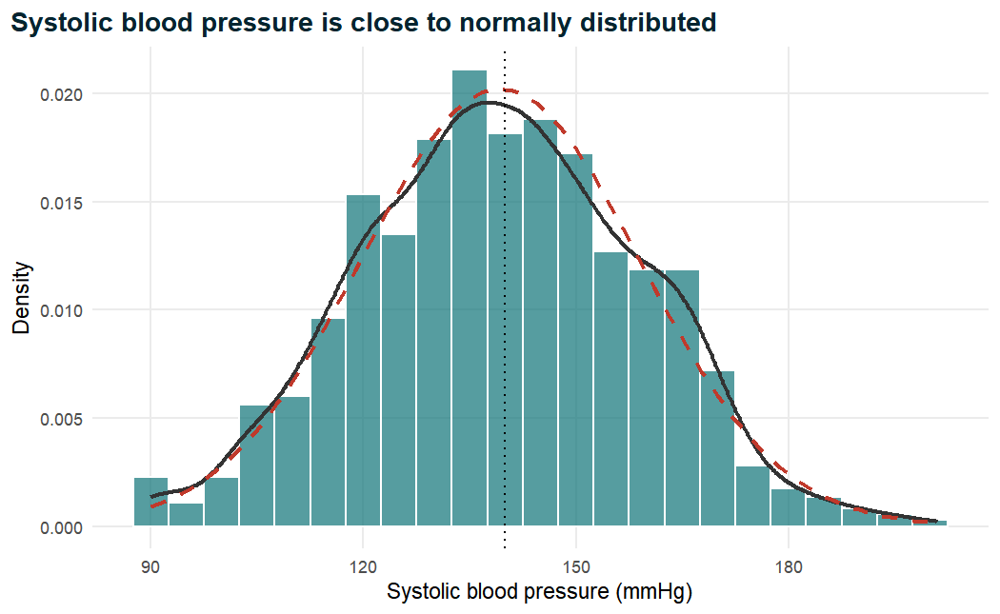
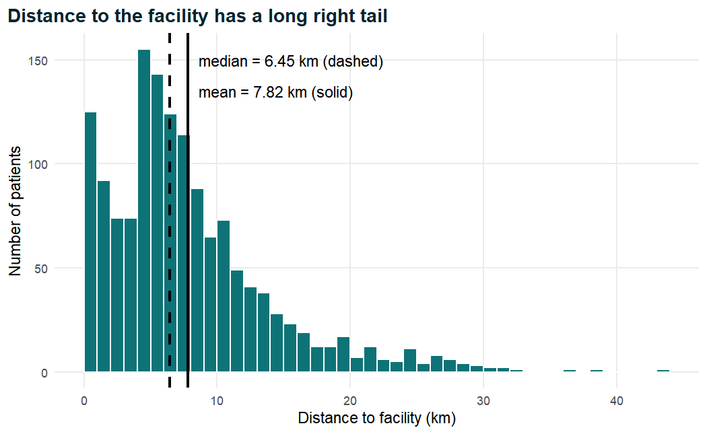
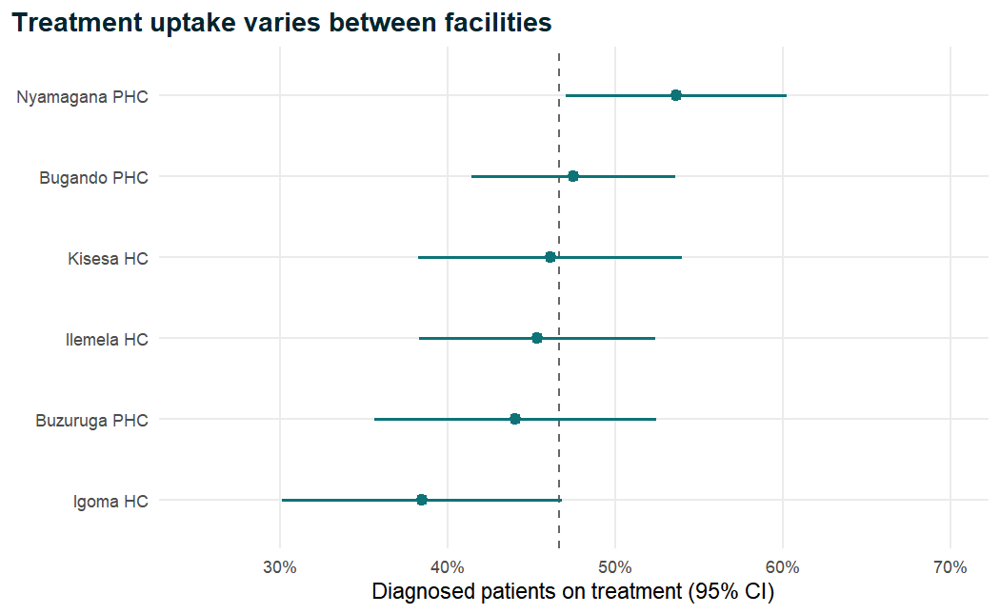
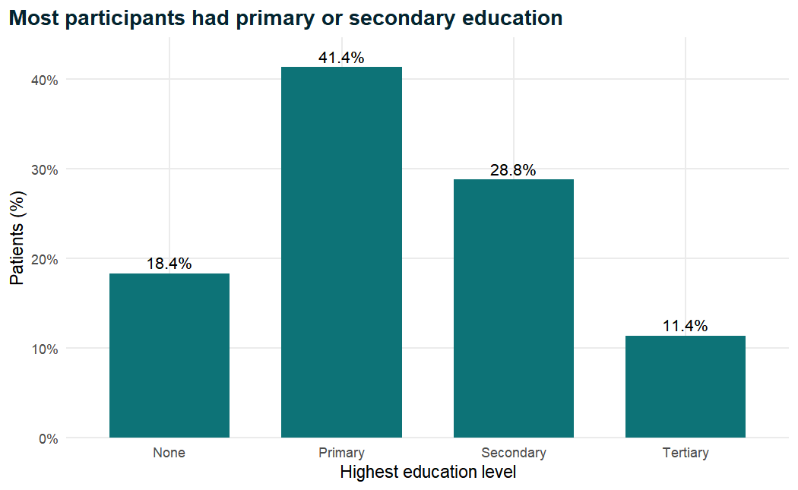
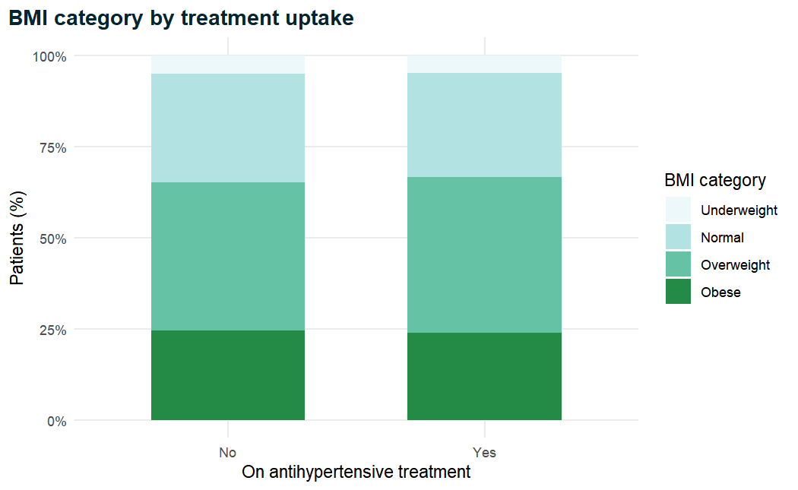
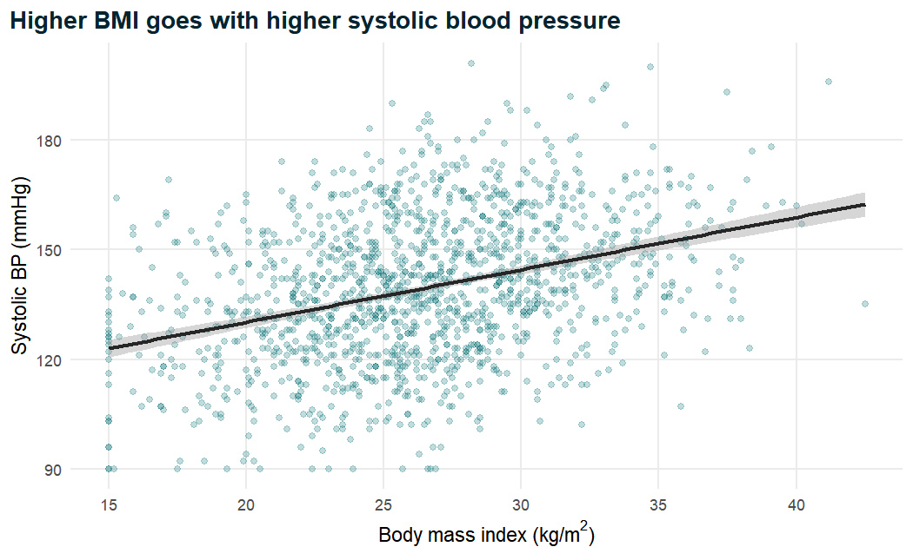
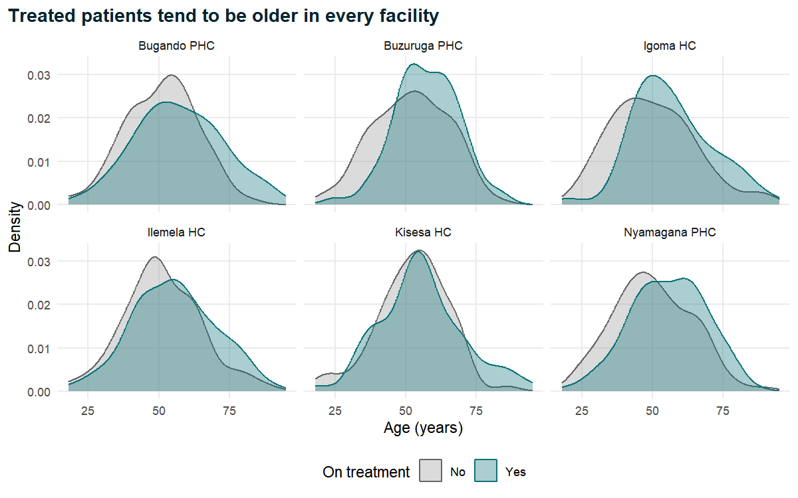

Every clinical paper, however sophisticated its later analyses, begins with the same
humble paragraph: *who were the patients?* Before a reader can judge whether a regression
model, an odds ratio or a p-value means anything, they need to know how old the participants
were, how many were women, how high their blood pressure was, how many had diabetes and how
much information was missing. That paragraph, and the "Table 1" that accompanies it, is the
foundation on which every inferential claim rests. If the description is wrong, or careless,
or hides the shape of the data, nothing that follows can be trusted.

This chapter teaches you to describe a clinical dataset properly, both with numbers and with
pictures. We start from the clean analysis file produced in Chapter 2 and work through the
theory of summary statistics (what a mean, a standard deviation or an interquartile range
actually measures, and when each is the right choice), then show how to compute them in R,
how to build a manuscript-ready Table 1 with **gtsummary**, and how to draw honest,
publication-quality figures with **ggplot2**. Along the way we meet the standard error and
the confidence interval, the bridge from describing a sample to making statements about a
population, which is the subject of Chapter 4.

::: {.callout-note .nb-objectives icon=false title="Learning objectives"}
- Explain why careful description precedes any statistical test, and what a "Table 1" must contain.
- Match each type of variable (continuous, discrete, binary, nominal, ordinal) to appropriate numerical and graphical summaries.
- Define and compute the mean, median, mode, range, variance, standard deviation, quantiles, interquartile range and coefficient of variation, and explain their properties.
- Judge the shape of a distribution (symmetry, skewness, normality) and decide between mean (SD) and median (IQR).
- Avoid the `na.rm` trap and report the number of observations behind every summary.
- Produce grouped summaries with `dplyr::group_by()` and `summarise()`.
- Compute and interpret the standard error and 95% confidence interval for a mean and for a proportion.
- Build frequency tables and cross-tabulations, and choose correctly between row and column percentages.
- Build a manuscript Table 1 with `gtsummary::tbl_summary()`.
- Draw histograms, density plots, bar charts, box and violin plots, scatter plots and faceted plots with `ggplot2`, following principles of good scientific graphics.
- Export tables and figures for a manuscript.
:::

## 3.1 Why describe before testing? {#sec-why-describe}

Descriptive statistics summarise the data you actually have. They make no claim about a
wider population and involve no hypothesis; their job is to *show*. Inferential statistics
(confidence intervals, hypothesis tests, regression models) go one step further and use the
sample to say something about the population it came from. It is tempting to rush to the
inferential step, because that is where the "results" seem to live. Experienced analysts do
the opposite: they spend a large share of their time on description, for at least four
reasons.

1. **Description is the first result.** Reporting guidelines for observational research
   require it. Item 13 of the STROBE statement asks authors to report the numbers of
   individuals at each stage of the study, and item 14 asks for the characteristics of study
   participants (demographic, clinical, social) together with the number of participants
   with missing data for each variable of interest [@vonelm2007]. In practice this becomes
   the first paragraph of the Results section and Table 1 of the paper.
2. **Description reveals problems.** A maximum age of 200, a systolic blood pressure of 0,
   a laboratory value of 999 that is really a missing-value code: these are discovered by
   summarising, not by testing. Chapter 2 cleaned the obvious errors, but describing the
   clean data is the final check that the cleaning worked.
3. **Description guides the choice of analysis.** Whether a variable is symmetric or skewed,
   whether a category is so rare that it must be merged with another, whether a predictor
   has 30% missing values: these facts decide which tests and models are appropriate later
   [@altman1991; @kirkwood2003].
4. **Description lets readers judge generalisability.** A treatment-uptake rate in
   primary-care patients aged 50 on average, mostly women and mostly uninsured, may not
   apply to a hospital clinic of younger insured men. Readers can only judge this if you tell
   them who was studied.

::: {.callout-note title="Clinical interpretation"}
Think of Table 1 as the patient list a clinician would want before reading your conclusions.
It answers "are these patients like mine?" A trial or survey whose participants are poorly
described cannot be applied safely to practice, however small its p-values.
:::

### 3.1.1 Setting up

As in every chapter, we load the packages and read the clean analysis file saved at the
end of Chapter 2. Because the primary outcome, `treatment_uptake`, is only meaningful for
patients who have been diagnosed with hypertension, we also create the analysis population
`diagnosed` now and use it whenever the outcome is involved.


``` r
library(tidyverse)   # dplyr, ggplot2, tidyr, readr, ...
library(gtsummary)   # Table 1 and other summary tables
library(janitor)     # tabyl() and adorn_*() for frequency tables
library(knitr)       # kable() for simple tables
library(scales)      # percent formatting for axes and labels
library(patchwork)   # combine several ggplots into one figure

# Read the analysis-ready data created in Chapter 2
analysis_data <- readRDS("Data/analysis_data.rds")

# Analysis population for the primary outcome: diagnosed hypertensives
diagnosed <- analysis_data |>
  filter(htn_diagnosed == "Yes")

# One colour defined once and reused in every figure
teal <- "#0D7377"

c(all_patients = nrow(analysis_data), diagnosed = nrow(diagnosed))
```

```
#> all_patients    diagnosed 
#>         1500         1089
```

The full dataset contains 1500 adults attending six primary healthcare
facilities, of whom 1089 had been diagnosed with hypertension. Keep both
numbers in mind: the first describes everyone enrolled, the second is the denominator for
statements about treatment uptake. A common source of confusion in manuscripts is a
percentage whose denominator is never stated; we will be explicit throughout.

::: {.callout-warning title="Common mistake"}
The data are simulated for teaching. Every number in this chapter illustrates a method; none
of them is a real clinical finding about hypertension care in any country or facility.
:::

## 3.2 Types of variables and the summaries that match them {#sec-variable-types}

The right summary depends on the kind of variable. Chapter 2 introduced variable types from
the point of view of storage in R (numeric, character, factor). Here we look at them from the
point of view of *measurement*, which is what decides the statistics [@altman1991, ch. 2;
@kirkwood2003, ch. 2].

- **Numerical (quantitative) variables** take numbers whose differences are meaningful.
  - *Continuous* variables can, in principle, take any value in a range: age, systolic blood
    pressure (SBP), body mass index (BMI), cholesterol, glucose, distance to the facility.
  - *Discrete* variables are counts: number of comorbidities, number of visits. They are
    often summarised like continuous variables when they take many values, and like
    categorical variables when they take only a few.
- **Categorical (qualitative) variables** place each person in one of a set of groups.
  - *Binary* (dichotomous) variables have two categories: diabetes yes/no, treatment uptake
    yes/no.
  - *Nominal* variables have more than two categories with no natural order: facility,
    occupation, marital status.
  - *Ordinal* variables have ordered categories: education (none < primary < secondary <
    tertiary), physical activity (low < moderate < high), blood-pressure category.

Table: Variable types in the case study and the summaries and graphs that suit them.

| Type | Examples in the case study | Numerical summary | Graph |
|---|---|---|---|
| Continuous, symmetric | `age`, `sbp_mmhg`, `bmi` | mean (SD) | histogram, density, box plot |
| Continuous, skewed | `distance_to_facility_km` | median (IQR) | histogram, box plot |
| Discrete count | `comorbidity_count` | median (IQR) or n (%) | bar chart |
| Binary | `diabetes`, `treatment_uptake` | n (%) | bar chart |
| Nominal | `facility`, `occupation` | n (%) | bar chart (sorted) |
| Ordinal | `education`, `bp_category` | n (%), sometimes median | bar chart (in order) |

Two warnings follow from this table. First, a number is not always a numerical variable: a
patient identifier or a facility code stored as `1`, `2`, `3` is categorical, and its mean is
meaningless. Second, continuous variables are sometimes *grouped* into categories, as BMI is
grouped into `bmi_cat` and blood pressure into `bp_category`. Grouping helps clinical
communication, because clinicians think in terms of "obese" or "hypertensive", but it
discards information, so a good Table 1 often shows both the continuous measurement and the
clinical category.


``` r
# How R stores each variable: numeric (dbl), factor (fct), ordered (ord)
analysis_data |>
  select(age, sbp_mmhg, comorbidity_count, diabetes, facility, education) |>
  glimpse()
```

```
#> Rows: 1,500
#> Columns: 6
#> $ age               <dbl> 74, 56, 54, 33, 86, 70, 45, 59, 46, 61, 70, 56, 4…
#> $ sbp_mmhg          <dbl> 140, 185, 147, 124, 131, 153, 162, 108, 152, 127,…
#> $ comorbidity_count <dbl> 1, 0, 0, 0, 0, 1, 1, 0, 1, 1, 1, 1, 1, 1, 0, 0, 0…
#> $ diabetes          <fct> No, No, No, No, No, No, No, No, No, No, No, No, N…
#> $ facility          <fct> Igoma HC, Kisesa HC, Bugando PHC, Ilemela HC, Kis…
#> $ education         <ord> Primary, Primary, None, Primary, Primary, Primary…
```

`glimpse()` confirms that the continuous variables are stored as numbers (`<dbl>`), the
nominal and binary variables as factors (`<fct>`) and education as an *ordered* factor
(`<ord>`), exactly as set up in Chapter 2. Storage that matches the measurement scale is what
allows R, and **gtsummary** in particular, to pick sensible summaries automatically.

## 3.3 Measures of central tendency {#sec-central-tendency}

A measure of central tendency (or *location*) answers the question "what is a typical
value?". Three are in common use.

### 3.3.1 The mean

The arithmetic mean of $n$ observations $x_1, x_2, \ldots, x_n$ is their sum divided by $n$:

$$
\bar{x} = \frac{1}{n}\sum_{i=1}^{n} x_i
$$

The mean has attractive mathematical properties. It uses every observation; it is the
balance point of the data, in the sense that the deviations $x_i - \bar{x}$ sum to zero; and
it is the value that minimises the sum of squared deviations $\sum (x_i - c)^2$. Its sampling
behaviour is well understood, which is why most of classical statistics (t-tests, analysis of
variance, linear regression) is built on means. Its weakness is the other side of the same
coin: because every observation contributes in proportion to its size, a single extreme value
can pull the mean a long way.

### 3.3.2 The median

The median is the middle value when the observations are sorted from smallest to largest.
If $x_{(1)} \le x_{(2)} \le \cdots \le x_{(n)}$ denote the ordered values, then

$$
\text{median} =
\begin{cases}
x_{((n+1)/2)} & \text{if } n \text{ is odd},\\[4pt]
\tfrac{1}{2}\left(x_{(n/2)} + x_{(n/2+1)}\right) & \text{if } n \text{ is even}.
\end{cases}
$$

Half of the observations lie below the median and half above. Because only the *ranks* of the
observations matter, not their exact magnitudes, the median is **robust**: making the largest
value ten times larger leaves the median unchanged. The median minimises the sum of absolute
deviations $\sum |x_i - c|$, and it is the 50th centile, a link we exploit when we discuss
quantiles below.

### 3.3.3 The mode

The mode is the most frequent value. It is rarely useful for continuous measurements (with
enough decimal places every value is unique) but it is the natural "typical value" for a
nominal variable: the modal occupation, the modal facility. A distribution with two clear
peaks is called *bimodal*, which often signals that two different groups of patients have
been mixed together. Base R has no function for the statistical mode (the function `mode()`
returns the storage type of an object, a classic source of confusion), so we write a small
one.


``` r
# Statistical mode: the most frequent value(s) of a vector
stat_mode <- function(x) {
  counts <- table(x)                    # frequency of each value (NA dropped)
  names(counts)[counts == max(counts)]     # value(s) with the highest count
}

stat_mode(analysis_data$education)   # modal education level
```

```
#> [1] "Primary"
```

``` r
stat_mode(analysis_data$occupation)  # modal occupation
```

```
#> [1] "Farmer"
```

``` r
stat_mode(analysis_data$sbp_mmhg)    # most common recorded SBP value(s)
```

```
#> [1] "143"
```

Primary education and farming are the modal categories, and these are useful facts about
the population. The modal SBP of 143 mmHg is much less useful: with hundreds of possible
values, which one happens to occur most often is largely a matter of chance, and it would
change with a different sample. For continuous measurements the mode is mainly a tool for
spotting oddities. In real clinical data, for example, a modal SBP of 120 or 140 mmHg and an
excess of readings ending in 0 or 5 would reveal *digit preference*, the tendency of observers
to round manual blood-pressure readings, which is a recognised source of measurement error.

### 3.3.4 Robustness: what one wrong value does

The difference between the mean and the median is easiest to see with a tiny example. The
seven SBP readings below are plausible. We then replace the last one with 700 mmHg, the kind
of data-entry error we removed in Chapter 2.


``` r
sbp_small <- c(128, 132, 135, 140, 141, 145, 150)
sbp_error <- c(128, 132, 135, 140, 141, 145, 700)   # one typing error

c(mean = mean(sbp_small), median = median(sbp_small))
```

```
#>   mean median 
#>  138.7  140.0
```

``` r
c(mean = mean(sbp_error), median = median(sbp_error))
```

```
#>   mean median 
#>  217.3  140.0
```

One wrong value moved the mean from about 139 mmHg to about 217 mmHg, a value that does not
describe any of the seven patients, while the median stayed at 140 mmHg. This is the
practical meaning of robustness, and it is why summaries of *uncleaned* data can be wildly
misleading. In clean data the same logic applies to genuine extreme values: a few patients
who live 40 km from a clinic pull the mean distance upwards even though most live much
closer.

### 3.3.5 Central tendency in the case-study data


``` r
# Mean and median of four clinical measurements (missing values removed)
analysis_data |>
  summarise(
    across(c(age, sbp_mmhg, bmi, distance_to_facility_km),
           list(mean = ~ mean(.x, na.rm = TRUE),
                median = ~ median(.x, na.rm = TRUE)))
  ) |>
  pivot_longer(everything(),
               names_to = c("variable", ".value"),
               names_pattern = "(.*)_(mean|median)") |>
  kable(digits = 2, caption = "Mean and median of four continuous variables.")
```


Table: Mean and median of four continuous variables.

|variable                |   mean| median|
|:-----------------------|------:|------:|
|age                     |  52.28|  52.00|
|sbp_mmhg                | 139.29| 139.00|
|bmi                     |  26.35|  26.30|
|distance_to_facility_km |   7.82|   6.45|

For age, SBP and BMI the mean and the median are almost identical (52.3 versus 52 years,
139.3 versus 139 mmHg, 26.35 versus 26.3 $\text{kg/m}^2$). That agreement is a first hint that these
distributions are roughly symmetric. Distance to the facility is different: the mean of 7.8 km
is well above the median of 6.45 km, the signature of a *right-skewed* distribution with a
long tail of patients who live far away. We return to this in Section 3.5.

## 3.4 Measures of spread {#sec-spread}

Two groups of patients can share the same mean SBP of 140 mmHg while one group ranges from
130 to 150 mmHg and the other from 100 to 200 mmHg. Clinically these are very different
populations. Measures of *spread* (dispersion, variability) quantify how far observations
typically lie from the centre.

### 3.4.1 The range

The range is the difference between the largest and smallest values,
$x_{(n)} - x_{(1)}$. In practice it is more informative to report the two extremes
themselves ("ages ranged from 18 to 95 years"), which also serves as a data check. The range
depends on only two observations, so it is extremely sensitive to outliers and it tends to
increase with sample size: the more patients you enrol, the more likely you are to meet an
extreme one. It is therefore a poor summary of variability, but a good check of plausibility.

### 3.4.2 Variance and standard deviation

The variance is the average squared deviation from the mean. For a sample it is computed as

$$
s^2 = \frac{1}{n-1}\sum_{i=1}^{n}\left(x_i - \bar{x}\right)^2 ,
$$

and the **standard deviation** (SD) is its square root:

$$
s = \sqrt{\frac{1}{n-1}\sum_{i=1}^{n}\left(x_i - \bar{x}\right)^2 } .
$$

Squaring the deviations does two things: it stops positive and negative deviations from
cancelling, and it gives large deviations more weight than small ones. Taking the square root
brings the result back to the original units, so the SD of SBP is in mmHg, which is why the SD
rather than the variance is reported. The divisor $n-1$ rather than $n$ is the *degrees of
freedom*: once the mean has been estimated from the data, only $n-1$ deviations are free to
vary (the last is fixed because the deviations sum to zero). Dividing by $n-1$ makes $s^2$ an
unbiased estimate of the population variance $\sigma^2$ [@kirkwood2003, ch. 4]. R's `var()` and
`sd()` use $n-1$.

A useful way to think about the SD: it is roughly the typical distance of a patient's value
from the mean. For data that are approximately normally distributed it has a precise
interpretation, given in Section 3.5.

### 3.4.3 Quantiles, quartiles and the interquartile range

A **quantile** divides ordered data in given proportions. The $p$-th quantile $Q(p)$ is a
value below which a proportion $p$ of the observations lie. Quantiles expressed in hundredths
are called *centiles* (or percentiles), in quarters *quartiles*, in fifths *quintiles*
[@altman1994sd]. The three quartiles are

- $Q_1 = Q(0.25)$, the lower quartile (25th centile);
- $Q_2 = Q(0.50)$, the median;
- $Q_3 = Q(0.75)$, the upper quartile (75th centile).

The **interquartile range** is $\text{IQR} = Q_3 - Q_1$, the width of the interval that
contains the middle half of the data. Like the median it depends only on ranks, so it is
robust to extreme values. In papers it is usually better to report the two quartiles than
their difference, for example "median 6.5 km (IQR 4.0 to 10.3)", because the pair also shows
asymmetry: if the median is much closer to $Q_1$ than to $Q_3$, the distribution is skewed to
the right.

There are several conventions for computing a quantile when $p(n-1)$ is not a whole number.
R offers nine (`type = 1` to `9` in `quantile()`); the default, type 7, places $Q(p)$ at
position $h = (n-1)p + 1$ in the ordered data and interpolates linearly between the two
neighbouring observations. With hundreds of observations the conventions agree to within
rounding, but with a handful of values they differ, which explains why SPSS, Stata and R can
give slightly different quartiles for the same small sample.

Together, the minimum, $Q_1$, median, $Q_3$ and maximum form the **five-number summary**,
which is exactly what a box plot draws.

### 3.4.4 The coefficient of variation

The SD is expressed in the units of the variable, so the SD of SBP (mmHg) cannot be compared
directly with the SD of cholesterol (mmol/L). The **coefficient of variation** (CV) removes the
units by expressing the SD as a percentage of the mean:

$$
\text{CV} = 100 \times \frac{s}{\bar{x}} \ \%.
$$

The CV is widely used in laboratory medicine to describe the precision of an assay (an assay
with a CV of 3% is more reproducible than one with 10%) and to compare the relative
variability of different measurements. It is only meaningful for variables measured on a
ratio scale with a true zero and positive values; it is meaningless for temperature in
degrees Celsius or for a score that can be negative.

### 3.4.5 Spread in R


``` r
age <- analysis_data$age

range(age, na.rm = TRUE)       # minimum and maximum
```

```
#> [1] 18 95
```

``` r
var(age, na.rm = TRUE)         # variance (years squared)
```

```
#> [1] 198.7
```

``` r
sd(age, na.rm = TRUE)          # standard deviation (years)
```

```
#> [1] 14.1
```

``` r
IQR(age, na.rm = TRUE)         # Q3 - Q1
```

```
#> [1] 19
```

``` r
quantile(age, probs = c(0, 0.25, 0.5, 0.75, 1), na.rm = TRUE)
```

```
#>   0%  25%  50%  75% 100% 
#>   18   43   52   62   95
```

``` r
fivenum(age)                   # Tukey's five-number summary
```

```
#> [1] 18 43 52 62 95
```

Reading the output line by line: ages run from 18 to 95 years, which is plausible for an
adult primary-care population and confirms the cleaning in Chapter 2. The variance is about
199 *years squared*, a unit nobody can interpret, which is why we report its square root, the
SD of about 14.1 years. The middle half of patients were aged between 43 and 62 years, an IQR
of 19 years. `quantile()` with the five probabilities and `fivenum()` give the same numbers
here; `fivenum()` uses a slightly different rule (Tukey's hinges) that can differ from
`quantile()` in small samples, and it removes missing values automatically.

A compact way to see several variables at once is a long summary table. We reshape the data
so that each row is one measurement of one patient, then summarise by variable.


``` r
continuous_vars <- c("age", "sbp_mmhg", "dbp_mmhg", "bmi",
                     "total_chol_mmol_l", "fasting_glucose_mmol_l",
                     "distance_to_facility_km")

spread_table <- analysis_data |>
  select(all_of(continuous_vars)) |>
  pivot_longer(everything(), names_to = "variable", values_to = "value") |>
  group_by(variable) |>
  summarise(
    n      = sum(!is.na(value)),            # observations actually used
    mean   = mean(value, na.rm = TRUE),
    sd     = sd(value, na.rm = TRUE),
    median = median(value, na.rm = TRUE),
    iqr    = IQR(value, na.rm = TRUE),
    cv_pct = 100 * sd / mean                 # coefficient of variation
  )

spread_table |>
  kable(digits = 2,
        caption = "Centre and spread of seven continuous variables.")
```


Table: Centre and spread of seven continuous variables.

|variable                |    n|   mean|    sd| median|  iqr| cv_pct|
|:-----------------------|----:|------:|-----:|------:|----:|------:|
|age                     | 1498|  52.28| 14.10|  52.00| 19.0|  26.96|
|bmi                     | 1453|  26.35|  4.87|  26.30|  6.3|  18.48|
|dbp_mmhg                | 1499|  86.00| 10.67|  86.00| 14.0|  12.40|
|distance_to_facility_km | 1440|   7.82|  6.09|   6.45|  6.3|  77.82|
|fasting_glucose_mmol_l  | 1425|   5.45|  0.99|   5.40|  1.2|  18.16|
|sbp_mmhg                | 1498| 139.29| 19.74| 139.00| 27.0|  14.17|
|total_chol_mmol_l       | 1410|   5.11|  0.98|   5.10|  1.4|  19.16|

Several lessons are visible in this one table. The column `n` differs between variables:
total cholesterol is available for 1,410 patients but age for 1,498, so every summary rests
on a different denominator, which a manuscript must report. The SD of SBP is about 20 mmHg
and that of diastolic blood pressure (DBP) about 11 mmHg; relative to their means these give
similar CVs (14% and 12%). Distance to the facility has a CV near 78%: patients differ
enormously in how far they travel, a fact with obvious implications for access to care.

::: {.callout-tip title="Good practice"}
Always report the number of non-missing observations alongside a summary statistic. "Mean
total cholesterol 5.1 mmol/L (SD 1.0; n = 1,410)" tells the reader that 90 patients are not
represented, and invites the question of whether they differ from the rest.
:::

## 3.5 The shape of a distribution {#sec-shape}

The mean and SD are a sufficient description of a distribution only if its shape is known.
For a symmetric, bell-shaped distribution they say almost everything; for a skewed one they
can mislead. Before choosing a summary, look at the shape.

### 3.5.1 Skewness

A distribution is **symmetric** if its left and right halves are mirror images, as for a
normal distribution, where the mean, median and mode coincide. It is **right-skewed**
(positively skewed) if it has a long tail to the right, as for incomes, hospital lengths of
stay, laboratory values such as triglycerides or C-reactive protein, and distance to a
facility. In a right-skewed distribution the few large values pull the mean above the median.
**Left-skewed** distributions, with a long tail to the left, are rarer in medicine; gestational
age at birth is a classic example.

Skewness can be quantified by the sample skewness coefficient,

$$
g_1 = \frac{\frac{1}{n}\sum_{i=1}^{n}(x_i-\bar{x})^3}
           {\left[\frac{1}{n}\sum_{i=1}^{n}(x_i-\bar{x})^2\right]^{3/2}} ,
$$

which is zero for a symmetric distribution, positive for right skew and negative for left
skew. Cubing the deviations keeps their sign, so a long right tail produces a large positive
sum. As a rough guide, values between $-0.5$ and $0.5$ indicate approximate symmetry and
values beyond $\pm 1$ marked skew, although a picture is always more informative than a
single coefficient.


``` r
# Sample skewness coefficient g1 (no extra package needed)
skewness <- function(x) {
  x <- x[!is.na(x)]
  m <- mean(x)
  mean((x - m)^3) / mean((x - m)^2)^1.5
}

analysis_data |>
  summarise(across(all_of(continuous_vars), skewness)) |>
  pivot_longer(everything(), names_to = "variable", values_to = "skewness") |>
  arrange(desc(skewness)) |>
  kable(digits = 2, caption = "Sample skewness of seven continuous variables.")
```


Table: Sample skewness of seven continuous variables.

|variable                | skewness|
|:-----------------------|--------:|
|distance_to_facility_km |     1.51|
|fasting_glucose_mmol_l  |     0.57|
|total_chol_mmol_l       |     0.10|
|age                     |     0.07|
|dbp_mmhg                |     0.05|
|bmi                     |     0.04|
|sbp_mmhg                |     0.03|

Distance to the facility has a skewness of about 1.5, clearly right-skewed. Fasting glucose
shows mild right skew (about 0.6), as glucose usually does: a minority of patients with
undiagnosed or poorly controlled diabetes produce a tail of high values. The remaining
variables have skewness close to zero and can reasonably be treated as symmetric.

### 3.5.2 The normal distribution

The **normal** (Gaussian) distribution is the familiar symmetric bell curve. It is completely
determined by two parameters, its mean $\mu$ and standard deviation $\sigma$, and its
probability density is

$$
f(x) = \frac{1}{\sigma\sqrt{2\pi}}\exp\!\left(-\frac{(x-\mu)^2}{2\sigma^2}\right).
$$

Many biological measurements in healthy populations, such as height or blood pressure, are
approximately normal, and the normal distribution plays a central role in statistics because
sample means are approximately normally distributed even when the individual observations are
not (the central limit theorem, used in Section 3.8). For a normal distribution, a fixed
proportion of values lies within any given number of SDs of the mean [@altman1995normal]:

- about 68% of values lie within $\mu \pm 1\sigma$;
- about 95% within $\mu \pm 2\sigma$ (more precisely $\mu \pm 1.96\sigma$);
- about 99.7% within $\mu \pm 3\sigma$.

This is the **68–95–99.7 rule**. It explains why mean and SD are such an efficient summary of
normal data: "mean SBP 139 mmHg (SD 20)" immediately tells a reader that about 95% of
patients had SBP between roughly 100 and 179 mmHg. The interval $\bar{x} \pm 1.96 s$ is called
a *95% reference range* and is the basis of many laboratory "normal ranges"
[@altman1991, ch. 14].

We can check the rule empirically for SBP by counting the proportion of patients within one,
two and three SDs of the mean.


``` r
sbp   <- na.omit(analysis_data$sbp_mmhg)   # drop the 2 missing values
m_sbp <- mean(sbp)
s_sbp <- sd(sbp)

tibble(k = 1:3) |>
  mutate(
    lower    = m_sbp - k * s_sbp,
    upper    = m_sbp + k * s_sbp,
    observed = map_dbl(k, ~ mean(abs(sbp - m_sbp) <= .x * s_sbp)),
    expected = c(0.683, 0.954, 0.997)       # theoretical normal values
  ) |>
  kable(digits = 3,
        caption = "Proportion of SBP values within k SDs of the mean.")
```


Table: Proportion of SBP values within k SDs of the mean.

|  k|  lower| upper| observed| expected|
|--:|------:|-----:|--------:|--------:|
|  1| 119.56| 159.0|    0.674|    0.683|
|  2|  99.82| 178.8|    0.961|    0.954|
|  3|  80.09| 198.5|    0.999|    0.997|

The observed proportions (about 0.67, 0.96 and 0.999) are very close to the normal
expectations, so the mean and SD summarise SBP well. The figure below makes the same point
visually: the histogram of SBP, scaled to a density, is overlaid with a normal curve that has
the same mean and SD as the data.


``` r
ggplot(analysis_data, aes(x = sbp_mmhg)) +
  # histogram on the density scale so that a curve can be overlaid
  geom_histogram(aes(y = after_stat(density)), binwidth = 5,
                 fill = teal, colour = "white", alpha = 0.7, na.rm = TRUE) +
  # kernel density estimate: a smoothed version of the histogram
  geom_density(linewidth = 0.9, colour = "grey20", na.rm = TRUE) +
  # theoretical normal curve with the sample mean and SD
  stat_function(fun = dnorm, args = list(mean = m_sbp, sd = s_sbp),
                linetype = "dashed", linewidth = 0.9, colour = "#C0392B") +
  geom_vline(xintercept = 140, linetype = "dotted") +
  labs(title = "Systolic blood pressure is close to normally distributed",
       x = "Systolic blood pressure (mmHg)", y = "Density")
```



Three layers are drawn on the same axes. The bars are the histogram; the solid line is a
*kernel density estimate*, which you can think of as a histogram smoothed so that it does
not depend on where the bin edges fall; the dashed line is the ideal normal curve. The
closeness of the solid and dashed curves is a visual check of normality. The dotted vertical
line at 140 mmHg, the conventional threshold for hypertension [@who2021htn], shows that a
little over half of the patients had a raised reading on the day of the survey. Formal tests
and normal quantile-quantile plots are introduced in Chapter 4.

### 3.5.3 When to report median (IQR) rather than mean (SD)

Distance to the facility is a different story. The next figure shows its histogram with the
mean and median marked.


``` r
dist_summary <- analysis_data |>
  summarise(mean = mean(distance_to_facility_km, na.rm = TRUE),
            median = median(distance_to_facility_km, na.rm = TRUE))

ggplot(analysis_data, aes(x = distance_to_facility_km)) +
  geom_histogram(binwidth = 1, boundary = 0, fill = teal,
                 colour = "white", na.rm = TRUE) +
  geom_vline(xintercept = dist_summary$mean, linewidth = 0.9) +
  geom_vline(xintercept = dist_summary$median, linewidth = 0.9,
             linetype = "dashed") +
  # text labels placed to the right of the two lines
  annotate("text", x = dist_summary$mean + 0.8, y = c(150, 135), hjust = 0,
           label = c(sprintf("median = %.2f km (dashed)", dist_summary$median),
                     sprintf("mean = %.2f km (solid)", dist_summary$mean))) +
  labs(title = "Distance to the facility has a long right tail",
       x = "Distance to facility (km)", y = "Number of patients")
```



Most patients live within about 10 km, but a few travel 30 km or more. Those few pull the
mean to 7.8 km, above the median of 6.45 km. Moreover, the SD (6.1 km) is almost as large as
the mean, so "mean 7.8 km (SD 6.1)", read as a normal distribution, would imply that about
one patient in ten lives at a *negative* distance (zero is 1.3 SDs below the mean), which is
impossible. The mean and SD are
simply the wrong language for this shape. A good
practical rule is: **if the SD is more than about half the mean for a variable that cannot be
negative, the distribution is skewed** [@altman1991]. For such variables report the median
with the interquartile range: "median distance 6.5 km (IQR 4.0 to 10.3)".

In summary, the choice is guided by shape, not by habit:

- **Mean (SD)** for approximately symmetric distributions (age, SBP, DBP, BMI and cholesterol
  in this dataset).
- **Median (IQR)** for skewed distributions, for distributions with outliers, for discrete
  variables with few values, and for ordinal scores.
- When in doubt, report both, or show the distribution in a figure.

::: {.callout-warning title="Common mistake"}
Do not confuse the SD with the standard error (SE). The SD describes how much *patients*
vary; the SE (Section 3.8) describes how precisely a *mean* has been estimated. Reporting
"mean ± SE" in a descriptive table makes the data look far less variable than they are,
because the SE shrinks as the sample grows while the SD does not [@altman1994sd].
:::

## 3.6 Missing values and the `na.rm` trap {#sec-na-rm}

Real clinical data are incomplete, and R is deliberately cautious about missing values. In R a
missing value is `NA` ("not available"), and the rule is simple: *any calculation involving an
unknown value gives an unknown result*. If one patient's SBP is missing, R cannot know the sum
of all SBPs, and therefore cannot know the mean.


``` r
sum(is.na(analysis_data$sbp_mmhg))            # how many SBP values are missing?
```

```
#> [1] 2
```

``` r
mean(analysis_data$sbp_mmhg)                  # the trap: one NA makes it NA
```

```
#> [1] NA
```

``` r
mean(analysis_data$sbp_mmhg, na.rm = TRUE)    # the fix: remove NAs first
```

```
#> [1] 139.3
```

Two patients have no SBP recorded, so `mean()` returns `NA`. Adding `na.rm = TRUE`
("NA remove") tells R to drop the missing values and compute the mean of the remaining
1,498. The same argument exists for `median()`, `sd()`, `var()`, `quantile()`, `IQR()`,
`min()`, `max()`, `range()` and `sum()`.

The trap matters most for variables with substantial missingness. Total cholesterol has 90
missing values.


``` r
chol <- analysis_data$total_chol_mmol_l

c(n_total   = length(chol),
  n_missing = sum(is.na(chol)),
  pct_miss  = round(100 * mean(is.na(chol)), 1),
  mean      = round(mean(chol, na.rm = TRUE), 2))
```

```
#>   n_total n_missing  pct_miss      mean 
#>   1500.00     90.00      6.00      5.11
```

Note the idiom `mean(is.na(x))`: `is.na()` returns `TRUE`/`FALSE`, R treats `TRUE` as 1 and
`FALSE` as 0, so the mean of a logical vector is the *proportion* of `TRUE` values. Here 6% of
cholesterol values are missing. The mean of 5.1 mmol/L describes the 1,410 patients who were
tested, not all 1,500.

::: {.callout-warning title="Common mistake"}
`na.rm = TRUE` makes the error message disappear; it does not make the missing-data problem
disappear. Removing missing values silently changes the denominator, and if the patients
without a cholesterol result differ from those with one (perhaps the sickest patients were
sent straight to hospital before blood was drawn), the mean is biased. Always count the
missing values, report them, and think about why they are missing [@rubin1976; @little2019].
:::

::: {.callout-tip title="Tip"}
Inside `summarise()` it is good practice to compute `n = sum(!is.na(x))` next to every mean,
as in the spread table of Section 3.4. Then the denominator travels with the statistic and
cannot be forgotten when the table is copied into a manuscript.
:::

## 3.7 Grouped summaries {#sec-grouped}

Descriptive statistics become most informative when we compare groups: treated versus
untreated patients, women versus men, one facility versus another. The **dplyr** verbs
`group_by()` and `summarise()` do this in two steps: `group_by()` splits the data into groups
and `summarise()` computes one row of statistics per group [@wickham2023r4ds].

### 3.7.1 By treatment uptake

We first write a tiny helper that formats a mean and SD as a single text string, the format
used in published tables. Then we summarise five variables by treatment uptake among
diagnosed patients.


``` r
# Format "mean (SD)" with one decimal place
mean_sd <- function(x) {
  sprintf("%.1f (%.1f)", mean(x, na.rm = TRUE), sd(x, na.rm = TRUE))
}

diagnosed |>
  group_by(treatment_uptake) |>
  summarise(
    n         = n(),                       # patients in each group
    Age       = mean_sd(age),
    SBP       = mean_sd(sbp_mmhg),
    DBP       = mean_sd(dbp_mmhg),
    BMI       = mean_sd(bmi),
    Knowledge = mean_sd(knowledge_score)
  ) |>
  kable(caption = paste("Mean (SD) of five variables by treatment uptake",
                        "among diagnosed patients."))
```


Table: Mean (SD) of five variables by treatment uptake among diagnosed patients.

|treatment_uptake |   n|Age         |SBP          |DBP         |BMI        |Knowledge  |
|:----------------|---:|:-----------|:------------|:-----------|:----------|:----------|
|No               | 581|51.1 (13.4) |142.2 (19.8) |88.8 (10.6) |26.8 (4.9) |9.9 (3.4)  |
|Yes              | 508|56.3 (14.1) |148.1 (18.3) |88.2 (10.7) |26.9 (4.7) |10.9 (3.4) |

Of the 1,089 diagnosed patients, 581 were not on treatment and 508 were. Treated patients were
on average about five years older and had a slightly higher mean knowledge score (by about one
point on the 0–20 scale). Their mean SBP was also *higher*, which may seem surprising if
treatment lowers blood pressure. In a cross-sectional study, however, we see each patient once:
patients with the highest pressures are the ones most likely to be started on treatment, and
treatment does not bring every patient to target. Descriptive comparisons cannot separate
cause and effect; they generate questions for the analyses of Chapters 4 and 5.

### 3.7.2 By facility


``` r
diagnosed |>
  group_by(facility) |>
  summarise(
    n             = n(),
    treated       = sum(treatment_uptake == "Yes"),
    pct_treated   = 100 * mean(treatment_uptake == "Yes"),
    median_dist   = median(distance_to_facility_km, na.rm = TRUE),
    pct_insured   = 100 * mean(health_insurance == "Yes")
  ) |>
  arrange(desc(pct_treated)) |>
  kable(digits = 1,
        caption = "Uptake, distance and insurance by facility (diagnosed).")
```


Table: Uptake, distance and insurance by facility (diagnosed).

|facility      |   n| treated| pct_treated| median_dist| pct_insured|
|:-------------|---:|-------:|-----------:|-----------:|-----------:|
|Nyamagana PHC | 220|     118|        53.6|         6.4|        36.8|
|Bugando PHC   | 259|     123|        47.5|         6.5|        34.0|
|Kisesa HC     | 154|      71|        46.1|         6.2|        33.1|
|Ilemela HC    | 192|      87|        45.3|         7.2|        35.9|
|Buzuruga PHC  | 134|      59|        44.0|         5.5|        26.1|
|Igoma HC      | 130|      50|        38.5|         5.8|        30.8|

Treatment uptake ranges from about 54% at Nyamagana PHC to about 39% at Igoma HC. Sorting
by the statistic of interest (`arrange(desc(...))`) makes the ranking obvious at a glance.
Whether this spread is larger than chance alone would produce is a question for confidence
intervals (Section 3.8) and formal tests (Chapter 4). Note again the idiom
`mean(treatment_uptake == "Yes")`: the comparison returns `TRUE`/`FALSE`, and its mean is a
proportion.

### 3.7.3 By two grouping variables

`group_by()` accepts several variables. Here we look at mean SBP by sex and treatment uptake
among diagnosed patients.


``` r
diagnosed |>
  group_by(sex, treatment_uptake) |>
  summarise(n = n(),
            mean_sbp = mean(sbp_mmhg, na.rm = TRUE),
            sd_sbp   = sd(sbp_mmhg, na.rm = TRUE),
            .groups = "drop") |>          # remove grouping after summarising
  kable(digits = 1, caption = "SBP (mmHg) by sex and treatment uptake.")
```


Table: SBP (mmHg) by sex and treatment uptake.

|sex    |treatment_uptake |   n| mean_sbp| sd_sbp|
|:------|:----------------|---:|--------:|------:|
|Female |No               | 315|    141.1|   19.8|
|Female |Yes              | 314|    149.1|   17.9|
|Male   |No               | 266|    143.4|   19.8|
|Male   |Yes              | 194|    146.6|   18.9|

The pattern seen overall (higher SBP among treated patients) holds in both women and men,
although the gap is larger in women (about 8 mmHg) than in men (about 3 mmHg). So the overall
difference is not simply produced by a different mix of men and women in the two groups,
but its size may depend on sex, a hint of what epidemiologists call *effect modification*. The argument `.groups = "drop"` returns an ungrouped result, which
avoids surprises if the table is processed further.

::: {.callout-tip title="Good practice"}
Use `across()` to apply the same summary to many columns, as in Sections 3.3 and 3.4, rather than
copying and pasting a line per variable. Fewer lines mean fewer typing errors, and adding a
variable becomes a one-word change.
:::

## 3.8 From description to inference: standard error and confidence interval {#sec-se-ci}

So far we have described the sample. But the purpose of most clinical studies is to learn
about a *population*: all adults attending primary care in the region, not just the 1,500 who
were enrolled. If we drew a different sample of 1,500, we would obtain a slightly different
mean SBP. How much would it vary? The answer is the **standard error**, and it leads directly
to the **confidence interval**, the most useful single tool of statistical inference
[@altman1991; @kirkwood2003].

### 3.8.1 Standard error of a mean

Imagine repeating the study many times, each time computing the sample mean $\bar{x}$. The
means would form their own distribution, the *sampling distribution of the mean*. The
central limit theorem says that, for reasonably large samples, this distribution is
approximately normal, centred on the population mean $\mu$, with standard deviation

$$
\text{SE}(\bar{x}) = \frac{\sigma}{\sqrt{n}} \approx \frac{s}{\sqrt{n}} .
$$

This standard deviation of the sampling distribution is the **standard error of the mean**.
It decreases with the square root of the sample size: four times as many patients halve the
SE. The SD, by contrast, does not shrink with sample size, because patients do not become
more alike as more are enrolled.

### 3.8.2 Confidence interval for a mean

Because $\bar{x}$ is approximately normal with SD equal to the SE, about 95% of samples give a
mean within 1.96 SE of $\mu$. Turning this around gives the 95% **confidence interval** (CI)

$$
\bar{x} \pm t_{n-1,\,0.975}\times\frac{s}{\sqrt{n}} ,
$$

where $t_{n-1,\,0.975}$ is the 97.5th centile of Student's t distribution with $n-1$ degrees
of freedom [@student1908]. For large $n$ it is very close to 1.96; for small samples it is
larger, widening the interval to allow for the uncertainty in $s$.


``` r
n_sbp  <- length(sbp)                        # 1,498 non-missing values
se_sbp <- s_sbp / sqrt(n_sbp)                # standard error of the mean
t_crit <- qt(0.975, df = n_sbp - 1)          # about 1.96 for large n

c(mean = m_sbp, sd = s_sbp, se = se_sbp, t = t_crit,
  lower = m_sbp - t_crit * se_sbp, upper = m_sbp + t_crit * se_sbp)
```

```
#>     mean       sd       se        t    lower    upper 
#> 139.2924  19.7355   0.5099   1.9615 138.2922 140.2926
```

``` r
# The same interval from t.test(), which we meet properly in Chapter 4
t.test(sbp)$conf.int
```

```
#> [1] 138.3 140.3
#> attr(,"conf.level")
#> [1] 0.95
```

The mean SBP is 139.3 mmHg. The SD of 19.7 mmHg describes how much individual patients vary;
the SE of only 0.51 mmHg describes how precisely the population mean has been estimated from
1,498 patients. The 95% CI runs from about 138.3 to 140.3 mmHg. `t.test()` gives the same
interval without the arithmetic.

::: {.callout-note title="Clinical interpretation"}
The 95% CI says that the data are consistent with a population mean SBP anywhere between
about 138 and 140 mmHg. Strictly, "95%" refers to the method: if the study were repeated many
times, 95% of intervals computed this way would contain the true mean. The CI is about the
*mean*; it does not say that 95% of patients have SBP in this range. For that we need the
reference range, mean ± 1.96 SD, which is roughly 101 to 178 mmHg.
:::

### 3.8.3 Confidence interval for a proportion

The same logic applies to a proportion. If $x$ of $n$ patients have a characteristic, the
sample proportion is $\hat{p} = x/n$, its standard error is

$$
\text{SE}(\hat{p}) = \sqrt{\frac{\hat{p}(1-\hat{p})}{n}} ,
$$

and the simple (Wald) 95% CI is

$$
\hat{p} \pm 1.96 \sqrt{\frac{\hat{p}(1-\hat{p})}{n}} .
$$

The Wald interval works well when $n\hat{p}$ and $n(1-\hat{p})$ are both at least about 10. For
small samples or proportions near 0 or 1 it can be too narrow or even extend below 0; the
**Wilson score interval** behaves much better and is what `prop.test()` reports
[@agresti2013, ch. 1]. With large samples the two agree closely.


``` r
x_treated <- sum(diagnosed$treatment_uptake == "Yes")   # treated patients
n_diag    <- nrow(diagnosed)                             # all diagnosed
p_hat     <- x_treated / n_diag
se_p      <- sqrt(p_hat * (1 - p_hat) / n_diag)

# Wald interval, computed by hand
round(100 * c(p = p_hat, lower = p_hat - 1.96 * se_p,
              upper = p_hat + 1.96 * se_p), 1)
```

```
#>     p lower upper 
#>  46.6  43.7  49.6
```

``` r
# Wilson score interval (correct = FALSE turns off the continuity correction)
round(100 * prop.test(x_treated, n_diag, correct = FALSE)$conf.int, 1)
```

```
#> [1] 43.7 49.6
#> attr(,"conf.level")
#> [1] 0.95
```

Among the 1,089 diagnosed patients, 508 (46.6%) were on antihypertensive treatment. The 95%
CI is about 43.7% to 49.6% by either method. In words: the data are consistent with a
population treatment-uptake rate somewhere in the mid-40s, and clearly below one half. Fewer
than half of diagnosed patients being on treatment is the kind of "treatment gap" reported in
many real surveys of hypertension care [@ncdrisc2021; @mills2020], although, again, these
are simulated data.

### 3.8.4 Confidence intervals by group

Confidence intervals become especially informative when groups are compared. The code below
computes the uptake proportion and its Wald 95% CI for each facility, and the figure that
follows plots them.


``` r
facility_ci <- diagnosed |>
  group_by(facility) |>
  summarise(n = n(), treated = sum(treatment_uptake == "Yes")) |>
  mutate(p     = treated / n,
         se    = sqrt(p * (1 - p) / n),
         lower = p - 1.96 * se,
         upper = p + 1.96 * se)

facility_ci |>
  mutate(across(c(p, lower, upper), ~ 100 * .x)) |>
  select(facility, n, treated, pct = p, lower, upper) |>
  kable(digits = 1, caption = "Treatment uptake (%) with 95% CI by facility.")
```


Table: Treatment uptake (%) with 95% CI by facility.

|facility      |   n| treated|  pct| lower| upper|
|:-------------|---:|-------:|----:|-----:|-----:|
|Bugando PHC   | 259|     123| 47.5|  41.4|  53.6|
|Buzuruga PHC  | 134|      59| 44.0|  35.6|  52.4|
|Igoma HC      | 130|      50| 38.5|  30.1|  46.8|
|Ilemela HC    | 192|      87| 45.3|  38.3|  52.4|
|Kisesa HC     | 154|      71| 46.1|  38.2|  54.0|
|Nyamagana PHC | 220|     118| 53.6|  47.0|  60.2|


``` r
ggplot(facility_ci,
       aes(x = p, y = fct_reorder(facility, p))) +   # order facilities by p
  geom_vline(xintercept = p_hat, linetype = "dashed", colour = "grey40") +
  geom_pointrange(aes(xmin = lower, xmax = upper),
                  colour = teal, linewidth = 0.8) +
  scale_x_continuous(labels = label_percent(), limits = c(0.25, 0.70)) +
  labs(title = "Treatment uptake varies between facilities",
       x = "Diagnosed patients on treatment (95% CI)", y = NULL)
```



Each point is a facility's uptake and the horizontal bar its 95% CI. The intervals are wide,
about ±6 to ±8 percentage points, because each facility contributes only 130 to 260
diagnosed patients, compared with ±3 points for all 1,089 together. Igoma HC sits lowest and
Nyamagana PHC highest, and their intervals (30.1% to 46.8% and 47.0% to 60.2%) only just fail
to overlap; the four other facilities are consistent with the overall rate. Overlap of
intervals is *not* a formal test (two intervals can overlap slightly even when the groups
differ significantly), and picking out the two extremes from six facilities exaggerates the
contrast, so we defer the comparison to the chi-squared test in Chapter 4. A plot of estimates with intervals, ordered by size, is far
more informative than a bar chart of percentages, because it shows the uncertainty as well as
the estimate.

## 3.9 Describing categorical variables {#sec-categorical}

For categorical variables the natural summaries are **frequencies** (counts) and **relative
frequencies** (proportions or percentages). The only real decisions are what denominator to
use and how to treat missing values.

### 3.9.1 Frequency tables with base R

`table()` counts each category and `prop.table()` turns counts into proportions.


``` r
table(analysis_data$sex)                              # counts
```

```
#> 
#> Female   Male 
#>    885    615
```

``` r
round(100 * prop.table(table(analysis_data$sex)), 1)  # percentages
```

```
#> 
#> Female   Male 
#>     59     41
```

The sample contains 885 women (59.0%) and 615 men (41.0%). A preponderance of women is
typical of primary-care attenders in many settings, and it is exactly the kind of fact that
Table 1 must report, because it affects how far the results generalise.

### 3.9.2 Making missing values visible

By default `table()` silently drops `NA`. For a variable with missing values this changes the
denominator without telling you.


``` r
table(analysis_data$education)                     # NA silently dropped
```

```
#> 
#>      None   Primary Secondary  Tertiary 
#>       270       608       424       168
```

``` r
table(analysis_data$education, useNA = "ifany")    # NA shown if present
```

```
#> 
#>      None   Primary Secondary  Tertiary      <NA> 
#>       270       608       424       168        30
```

Thirty patients have no education recorded. The first table hides them, so percentages
computed from it would refer to 1,470 patients while appearing to describe all 1,500. The
argument `useNA = "ifany"` adds an `<NA>` column whenever missing values exist (use
`"always"` to show the column even when the count is zero).

::: {.callout-tip title="Good practice"}
In a manuscript, percentages for a categorical variable are usually computed among patients
with known values, with the number missing reported separately ("education was missing for
30 patients (2.0%)"). Whichever convention you use, state it in the table footnote, and
never let missing values vanish unannounced.
:::

### 3.9.3 Tidy frequency tables with `count()`

`dplyr::count()` returns a data frame rather than a table object, so the result can be piped
into further steps, for example to add a percentage column.


``` r
analysis_data |>
  count(bp_category) |>                         # NA kept as its own row
  mutate(percent = round(100 * n / sum(n), 1))
```

```
#> # A tibble: 4 × 3
#>   bp_category      n percent
#>   <fct>        <int>   <dbl>
#> 1 Normal         144     9.6
#> 2 Elevated       357    23.8
#> 3 Hypertension   996    66.4
#> 4 <NA>             3     0.2
```

`count()` keeps `NA` as a separate row by default. Of 1,500 patients, 996 (66.4%) had a
reading in the hypertensive range, 357 (23.8%) were in the elevated range and 144 (9.6%) were
normal; three could not be classified because a blood-pressure value was missing.

### 3.9.4 Polished frequency tables with janitor

The **janitor** package provides `tabyl()`, which produces frequency tables with counts,
percentages and (when present) a separate "valid percent" excluding missing values, and a
family of `adorn_*()` functions that format them for presentation.


``` r
analysis_data |>
  tabyl(education) |>
  adorn_totals("row") |>                 # add a Total row
  adorn_pct_formatting(digits = 1)       # format proportions as percentages
```

```
#>  education    n percent valid_percent
#>       None  270   18.0%         18.4%
#>    Primary  608   40.5%         41.4%
#>  Secondary  424   28.3%         28.8%
#>   Tertiary  168   11.2%         11.4%
#>       <NA>   30    2.0%             -
#>      Total 1500  100.0%        100.0%
```

The column `percent` uses all 1,500 patients as denominator; `valid_percent` excludes the 30
missing values. Primary education was most common (40.5% of all patients, 41.4% of those with
known education). Because education is an *ordered* factor, the categories appear in their
natural order rather than alphabetically, one of the benefits of setting factor levels in
Chapter 2.

### 3.9.5 Cross-tabulations

A **cross-tabulation** (contingency table) counts patients by two categorical variables at
once. Among diagnosed patients, let us cross-tabulate diabetes against treatment uptake.


``` r
xtab <- table(Diabetes = diagnosed$diabetes,
              Treated  = diagnosed$treatment_uptake)
xtab
```

```
#>         Treated
#> Diabetes  No Yes
#>      No  574 487
#>      Yes   7  21
```

``` r
addmargins(xtab)                              # add row and column totals
```

```
#>         Treated
#> Diabetes   No  Yes  Sum
#>      No   574  487 1061
#>      Yes    7   21   28
#>      Sum  581  508 1089
```

Each cell counts the patients with a given combination: for example, 21 diagnosed patients had
diabetes *and* were on treatment. `addmargins()` adds the totals: 28 diagnosed patients had
diabetes, 508 were treated, and the grand total is 1,089.

### 3.9.6 Row or column percentages?

A two-way table can be turned into percentages in three ways, controlled by the `margin`
argument of `prop.table()`:

- `margin = 1`: **row percentages**, each row sums to 100%;
- `margin = 2`: **column percentages**, each column sums to 100%;
- no margin: percentages of the grand total.


``` r
round(100 * prop.table(xtab, margin = 1), 1)   # row %: within diabetes group
```

```
#>         Treated
#> Diabetes   No  Yes
#>      No  54.1 45.9
#>      Yes 25.0 75.0
```

``` r
round(100 * prop.table(xtab, margin = 2), 1)   # column %: within uptake group
```

```
#>         Treated
#> Diabetes   No  Yes
#>      No  98.8 95.9
#>      Yes  1.2  4.1
```

The two tables answer different questions. With diabetes in the rows, the **row
percentages** say that 75.0% of diagnosed patients *with diabetes* were on treatment, compared
with 45.9% of those without diabetes. The **column percentages** say that 4.1% of *treated*
patients had diabetes, compared with 1.2% of untreated patients.

Which to report depends on the question. If treatment uptake is the outcome and diabetes a
possible determinant, as in our study, the natural comparison is the proportion *treated*
within each diabetes group, which here is the row percentage. The rule is to compute
percentages **within the categories of the explanatory variable**, so that each percentage
answers "of patients with this characteristic, what proportion had the outcome?"
[@altman1991; @kirkwood2003]. In a Table 1 laid out by outcome group (columns = treated and
untreated), the convention is the reverse: column percentages, describing the make-up of each
group. Both are correct for their purpose; the mistake is to compute one and describe it in
words appropriate to the other.

::: {.callout-warning title="Common mistake"}
"4.1% of diabetic patients were treated" is a misreading of the column percentage above,
which actually says that 4.1% of treated patients were diabetic. Before writing a sentence
about a percentage, say aloud what the denominator is: "of the ___, what percentage ___?"
:::

Note also the small numbers: only 28 diagnosed patients have diabetes, so the 75.0% rests on
21 out of 28 patients and has a wide confidence interval. Small cells are a warning sign for
later analyses (Chapter 4 explains why the chi-squared test may be replaced by Fisher's exact
test in this situation).

### 3.9.7 Cross-tabulations with janitor

`tabyl()` also builds two-way tables, and the adorn functions add totals, percentages and the
underlying counts in one readable display.


``` r
diagnosed |>
  tabyl(diabetes, treatment_uptake) |>
  adorn_totals(c("row", "col")) |>
  adorn_percentages("row") |>            # row percentages
  adorn_pct_formatting(digits = 1) |>
  adorn_ns() |>                          # append the counts in brackets
  adorn_title("combined")                # label rows and columns together
```

```
#>  diabetes/treatment_uptake          No         Yes          Total
#>                         No 54.1% (574) 45.9% (487) 100.0% (1,061)
#>                        Yes 25.0%   (7) 75.0%  (21) 100.0%    (28)
#>                      Total 53.4% (581) 46.6% (508) 100.0% (1,089)
```

Each cell now shows the row percentage followed by the count, for example "75.0% (21)", which
is the format many journals prefer: the percentage for comparison, the count so the reader
can see how many patients it represents.

## 3.10 Building Table 1 with gtsummary {#sec-table1}

### 3.10.1 What belongs in Table 1

Table 1 of a clinical paper describes the characteristics of the study participants. Under
STROBE it should present demographic, clinical and social characteristics, information on
exposures and potential confounders, and the number of participants with missing data for
each variable [@vonelm2007]. In our cross-sectional study of treatment uptake, a typical
Table 1 would show:

- **demographic** variables: age, sex, residence, education, health insurance;
- **behavioural** variables: smoking, alcohol, physical activity;
- **clinical** variables: BMI, blood pressure, diabetes, family history;
- **access and knowledge**: distance to the facility, knowledge score;

usually for the whole sample and by the main grouping variable, here treatment uptake among
diagnosed patients. Each continuous variable is summarised by mean (SD) or median (IQR)
according to its distribution, and each categorical variable by n (%).

Building such a table by hand, cell by cell, is slow and error-prone: one wrong copy-paste and
a published percentage is wrong. The **gtsummary** package automates the whole process
[@sjoberg2021]. It inspects each variable, chooses a sensible summary, formats the numbers,
and produces a table that can be exported to Word, HTML or PDF.

### 3.10.2 A first Table 1


``` r
diagnosed |>
  select(age, sex, residence, health_insurance, diabetes,
         treatment_uptake) |>
  tbl_summary(by = treatment_uptake) |>   # one column per uptake group
  as_kable(caption = "A first Table 1: default gtsummary output.")
```


Table: A first Table 1: default gtsummary output.

|**Characteristic** | **No**  N = 581 | **Yes**  N = 508 |
|:------------------|:---------------:|:----------------:|
|age                |   51 (41, 60)   |   56 (47, 66)    |
|Unknown            |        1        |        0         |
|sex                |                 |                  |
|Female             |    315 (54%)    |    314 (62%)     |
|Male               |    266 (46%)    |    194 (38%)     |
|residence          |                 |                  |
|Rural              |    306 (53%)    |    195 (38%)     |
|Urban              |    275 (47%)    |    313 (62%)     |
|health_insurance   |    162 (28%)    |    202 (40%)     |
|diabetes           |    7 (1.2%)     |    21 (4.1%)     |

With one line of real work, `tbl_summary()` has produced a usable table. Reading it:

- The column headers give the group sizes: 581 untreated and 508 treated diagnosed patients.
- Age, a continuous variable, is summarised by its *median (Q1, Q3)*, the gtsummary default
  for continuous variables, because the median and IQR are safe whatever the shape.
- Sex and residence have two levels, so both levels are listed with n (%).
- Health insurance and diabetes are Yes/No variables, so gtsummary shows only the "Yes" row
  (a *dichotomous* summary), which is the conventional and more compact display.
- Row labels are the raw variable names (`age`, `health_insurance`), and the one patient
  with missing age appears in a row labelled "Unknown". Both need tidying for publication.
- Percentages are rounded to whole numbers, except below 10%, where one decimal is shown.
- The percentages are **column percentages**: they describe the make-up of each group. The
  figure for health insurance in the "No" column is the proportion of the 581 *untreated*
  patients who were insured, not the proportion of insured patients who were untreated.

The last point deserves care, and we return to it after customising the table.

### 3.10.3 Customising statistics, labels and missing values

A table for a manuscript needs readable labels, the statistic that suits each variable, a
consistent number of decimal places and an explicit treatment of missing data.


``` r
table1 <- diagnosed |>
  select(age, sex, residence, education, health_insurance,
         bmi, sbp_mmhg, diabetes, knowledge_score,
         distance_to_facility_km, treatment_uptake) |>
  tbl_summary(
    by = treatment_uptake,
    # symmetric variables: mean (SD); skewed distance: median (IQR)
    statistic = list(
      all_continuous()  ~ "{mean} ({sd})",
      distance_to_facility_km ~ "{median} ({p25}, {p75})",
      all_categorical() ~ "{n} ({p}%)"
    ),
    digits = list(all_continuous() ~ 1, all_categorical() ~ c(0, 1)),
    label = list(
      age ~ "Age, years",
      sex ~ "Sex",
      residence ~ "Residence",
      education ~ "Education",
      health_insurance ~ "Health insurance",
      bmi ~ "BMI, kg/m^2",
      sbp_mmhg ~ "Systolic BP, mmHg",
      diabetes ~ "Diabetes",
      knowledge_score ~ "Knowledge score (0-20)",
      distance_to_facility_km ~ "Distance to facility, km"
    ),
    missing = "ifany",            # show a Missing row only where needed
    missing_text = "Missing"
  ) |>
  add_overall(last = FALSE) |>    # Overall column first
  modify_header(label = "**Characteristic**")

table1 |>
  as_kable(caption = paste("Characteristics of diagnosed hypertensive patients",
                           "by treatment uptake."))
```


Table: Characteristics of diagnosed hypertensive patients by treatment uptake.

|**Characteristic**       | **Overall**  N = 1,089 | **No**  N = 581 | **Yes**  N = 508 |
|:------------------------|:----------------------:|:---------------:|:----------------:|
|Age, years               |      53.5 (14.0)       |   51.1 (13.4)   |   56.3 (14.1)    |
|Missing                  |           1            |        1        |        0         |
|Sex                      |                        |                 |                  |
|Female                   |      629 (57.8%)       |   315 (54.2%)   |   314 (61.8%)    |
|Male                     |      460 (42.2%)       |   266 (45.8%)   |   194 (38.2%)    |
|Residence                |                        |                 |                  |
|Rural                    |      501 (46.0%)       |   306 (52.7%)   |   195 (38.4%)    |
|Urban                    |      588 (54.0%)       |   275 (47.3%)   |   313 (61.6%)    |
|Education                |                        |                 |                  |
|None                     |      201 (18.9%)       |   126 (22.1%)   |    75 (15.2%)    |
|Primary                  |      444 (41.7%)       |   252 (44.2%)   |   192 (38.8%)    |
|Secondary                |      292 (27.4%)       |   137 (24.0%)   |   155 (31.3%)    |
|Tertiary                 |      128 (12.0%)       |    55 (9.6%)    |    73 (14.7%)    |
|Missing                  |           24           |       11        |        13        |
|Health insurance         |      364 (33.4%)       |   162 (27.9%)   |   202 (39.8%)    |
|BMI, kg/m^2              |       26.8 (4.8)       |   26.8 (4.9)    |    26.9 (4.7)    |
|Missing                  |           33           |       19        |        14        |
|Systolic BP, mmHg        |      144.9 (19.4)      |  142.2 (19.8)   |   148.1 (18.3)   |
|Missing                  |           1            |        0        |        1         |
|Diabetes                 |       28 (2.6%)        |    7 (1.2%)     |    21 (4.1%)     |
|Knowledge score (0-20)   |       10.4 (3.5)       |    9.9 (3.4)    |    10.9 (3.4)    |
|Missing                  |           29           |       16        |        13        |
|Distance to facility, km |    6.3 (3.8, 10.2)     | 6.8 (4.3, 10.7) |  5.8 (3.1, 9.6)  |
|Missing                  |           47           |       20        |        27        |

This is a table that could go into a manuscript with little further editing. Points to note
in the code and the output:

- `statistic` takes a list of *formulas*: the left side selects variables (with helpers
  such as `all_continuous()` and `all_categorical()`, or by name), the right side is a
  template in which `{mean}`, `{sd}`, `{median}`, `{p25}`, `{p75}`, `{n}` and `{p}` are
  replaced by the computed values. The specific rule for distance overrides the general rule
  for continuous variables.
- `digits` sets one decimal place for continuous summaries, and integer counts with one
  decimal place for percentages.
- `label` replaces variable names with readable labels including units.
- `missing = "ifany"` adds a "Missing" row under each variable that has missing values, as
  STROBE requires. Missing values are *not* included in the denominators of the percentages.
- `add_overall()` adds a column for all diagnosed patients, here placed first.

Reading the content, treated patients were older on average (56.3 versus 51.1 years), more
often women (61.8% versus 54.2%), more often urban residents (61.6% versus 47.3%), better
educated, more often insured (39.8% versus 27.9%) and more often diabetic, scored about one
point higher on the knowledge scale, and lived somewhat closer to the facility (median 5.8
versus 6.8 km). Their mean SBP was higher, for the reasons discussed in Section 3.7, while
BMI was almost identical in the two groups. These are *descriptive*
differences; whether they are larger than chance, and whether they persist after adjustment
for one another, are questions for Chapters 4 and 5.

::: {.callout-note title="Clinical interpretation"}
The percentages in each column describe that group. "Diabetes: 21 (4.1%)" in the treated
column means that 4.1% of treated patients had diabetes. It does *not* mean that 4.1% of
diabetic patients were treated (that figure is 75%, from the row percentages in Section
3.9). If your question is "how does uptake differ by diabetes status?", report the row
percentages in the text, or use `tbl_summary(by = diabetes, percent = "row")`.
:::

### 3.10.4 Should Table 1 contain p-values?

`gtsummary` can add a column of p-values with `add_p()`, which chooses a test for each
variable (a Wilcoxon rank-sum or t-test for continuous variables, a chi-squared or Fisher's
exact test for categorical ones). Whether it *should* is debated.

In a **randomised trial**, Table 1 compares groups formed by chance. Any baseline difference
is, by definition, due to chance, so a significance test asks a question whose answer is
already known; the CONSORT guidance and many statisticians therefore advise against p-values
in a trial's baseline table [@altman1991]. What matters is whether baseline imbalances are
large enough to be *clinically* important, which a p-value cannot tell you.

In an **observational study** like ours, comparing groups defined by the outcome is a genuine
(unadjusted) analysis of association, and p-values are more defensible. Even so, a Table 1
p-value column invites readers to treat "p < 0.05" as a verdict on each variable, encourages
multiple testing, and confuses statistical with clinical significance [@wasserstein2016;
@greenland2016]. A sound compromise, followed in this book, is to keep Table 1 descriptive and
present tests and effect estimates with confidence intervals in a separate analytic table
(Chapters 4 and 5). If a journal requires p-values, gtsummary adds them in one line, and the
tests are explained in Chapter 4:


``` r
diagnosed |>
  select(age, sex, diabetes, treatment_uptake) |>
  tbl_summary(by = treatment_uptake,
              statistic = all_continuous() ~ "{mean} ({sd})",
              label = list(age ~ "Age, years", sex ~ "Sex",
                           diabetes ~ "Diabetes")) |>
  add_p(test = list(age ~ "t.test")) |>   # Welch t-test for age
  as_kable(caption = "Table 1 with a p-value column (use with caution).")
```


Table: Table 1 with a p-value column (use with caution).

|**Characteristic** | **No**  N = 581 | **Yes**  N = 508 | **p-value** |
|:------------------|:---------------:|:----------------:|:-----------:|
|Age, years         |     51 (13)     |     56 (14)      |   <0.001    |
|Unknown            |        1        |        0         |             |
|Sex                |                 |                  |    0.011    |
|Female             |    315 (54%)    |    314 (62%)     |             |
|Male               |    266 (46%)    |    194 (38%)     |             |
|Diabetes           |    7 (1.2%)     |    21 (4.1%)     |    0.002    |

::: {.callout-warning title="Common mistake"}
A non-significant p-value in Table 1 does not show that the groups are "comparable", and a
significant one does not show that a variable is a confounder. Absence of evidence is not
evidence of absence [@altman1995absence]. Judge imbalance by the size of the difference, and
handle confounding with adjustment (Chapter 5).
:::

## 3.11 Figures with ggplot2 {#sec-figures}

Tables give exact numbers; figures show patterns, shapes and outliers that tables hide. A
good figure is often the most-read part of a paper. In R the standard tool is **ggplot2**
[@wickham2016ggplot2], which we have already used for the histograms above.

### 3.11.1 The grammar of graphics

ggplot2 implements a *grammar of graphics*: instead of choosing from a menu of chart types,
you describe a plot as a combination of independent components [@wickham2016ggplot2]:

- **data**: the data frame to plot;
- **aesthetic mappings** (`aes()`): which variables are mapped to which visual properties,
  such as position on the x and y axes, colour, fill, size or shape;
- **geometric objects** (`geom_*()`): what is drawn, such as points, bars, lines, boxes;
- **statistical transformations** (`stat_*()`): computations applied before drawing, such as
  the binning in a histogram or the fitted line in a smoother;
- **scales** (`scale_*()`): how data values are translated into visual values, including
  axis breaks and labels and colour palettes;
- **facets** (`facet_wrap()`, `facet_grid()`): small multiples, one panel per subgroup;
- **coordinates and themes**: the coordinate system and the non-data appearance.

A plot is built by adding layers with `+`. Every plot in this chapter follows the same
template:


``` r
ggplot(data = <DATA>, aes(x = <X>, y = <Y>, fill = <GROUP>)) +
  geom_<TYPE>(<fixed settings such as colour or alpha>) +
  labs(title = "...", x = "... (units)", y = "...") +
  theme_minimal()
```

A distinction that confuses beginners: a property *mapped* to a variable goes inside
`aes()` (`aes(fill = treatment_uptake)` colours bars by group), whereas a property *set* to a
constant goes outside (`fill = teal` colours every bar teal).

### 3.11.2 Principles of good scientific graphs

A few principles, drawn from @weissgerber2015 and @wickham2016ggplot2, will improve almost
every figure:

1. **Show the data.** Wherever sample sizes allow, show individual observations or their full
   distribution, not just a summary.
2. **Match the figure to the variable types**: histogram or density for one continuous
   variable, bar chart for one categorical variable, box, violin or dot plot for a continuous
   variable by group, scatter plot for two continuous variables.
3. **Label axes with units** and write a caption that can be understood without the text.
4. **Order categories meaningfully**: ordinal variables in their natural order, nominal
   variables by frequency or by the statistic of interest.
5. **Use colour with purpose**, to encode a variable, not to decorate; prefer palettes that
   remain distinguishable in greyscale and for colour-blind readers.
6. **Avoid chart junk**: three-dimensional effects, heavy gridlines and dual axes add ink
   without information.

### 3.11.3 Bar charts for categorical variables

`geom_bar()` counts the rows in each category itself, so it is given the raw data, not a
pre-computed table. To show percentages we compute them first and use `geom_col()`, which
draws bars of a given height.


``` r
edu_pct <- analysis_data |>
  filter(!is.na(education)) |>
  count(education) |>
  mutate(pct = n / sum(n))

ggplot(edu_pct, aes(x = education, y = pct)) +
  geom_col(fill = teal, width = 0.7) +
  geom_text(aes(label = percent(pct, accuracy = 0.1)),   # label each bar
            vjust = -0.4, size = 3.5) +
  scale_y_continuous(labels = label_percent(),
                     expand = expansion(mult = c(0, 0.08))) +
  labs(title = "Most participants had primary or secondary education",
       x = "Highest education level", y = "Patients (%)")
```



Because `education` is an ordered factor, the bars appear in their natural order, from none
to tertiary. Labelling each bar with its percentage spares the reader from estimating values
from the axis. The caption states the denominator and what was excluded.

To compare the distribution of a categorical variable *between groups*, a 100% stacked bar
chart is a compact choice. The next figure shows BMI category by treatment uptake among
diagnosed patients.


``` r
diagnosed |>
  filter(!is.na(bmi_cat)) |>
  ggplot(aes(x = treatment_uptake, fill = bmi_cat)) +
  geom_bar(position = "fill", width = 0.6) +      # "fill" = 100% stacked
  scale_y_continuous(labels = label_percent()) +
  scale_fill_brewer(palette = "BuGn") +   # sequential palette, ordered variable
  labs(title = "BMI category by treatment uptake",
       x = "On antihypertensive treatment", y = "Patients (%)",
       fill = "BMI category")
```



`position = "fill"` rescales each bar to 100%, so the bars compare *proportions*, not counts.
A sequential colour palette (light to dark) mirrors the order of the BMI categories. The two
bars look very similar: the BMI profile of treated and untreated patients is much the same.

### 3.11.4 Box plots, violin plots and why bar charts of means hide data

A very common figure in clinical papers is a bar chart of group means with error bars (the
so-called "dynamite plot"). @weissgerber2015 showed that such charts are widespread and
misleading: many different distributions (symmetric, skewed, bimodal, with outliers, or with
very unequal sample sizes) can produce the same bar. The bar also suggests that values lie
between zero and the mean, which is meaningless for a measurement like blood pressure. The
figure below puts the two approaches side by side for the same data.


``` r
# Panel A: bar of means +/- SE (the plot to avoid)
sbp_means <- diagnosed |>
  group_by(treatment_uptake) |>
  summarise(mean = mean(sbp_mmhg, na.rm = TRUE),
            se = sd(sbp_mmhg, na.rm = TRUE) / sqrt(sum(!is.na(sbp_mmhg))))

p_bar <- ggplot(sbp_means, aes(x = treatment_uptake, y = mean)) +
  geom_col(fill = "grey70", width = 0.6) +
  geom_errorbar(aes(ymin = mean - se, ymax = mean + se), width = 0.2) +
  labs(title = "A. Bar of means (± SE)",
       x = "On treatment", y = "Systolic BP (mmHg)")

# Panel B: violin + box + jittered points (show the data)
p_violin <- ggplot(diagnosed, aes(x = treatment_uptake, y = sbp_mmhg)) +
  geom_violin(fill = teal, alpha = 0.25, colour = NA, na.rm = TRUE) +
  geom_jitter(width = 0.15, alpha = 0.25, size = 0.8, na.rm = TRUE) +
  geom_boxplot(width = 0.18, outlier.shape = NA, fill = "white",
               alpha = 0.8, na.rm = TRUE) +
  labs(title = "B. Violin, box and points",
       x = "On treatment", y = "Systolic BP (mmHg)")

p_bar + p_violin      # patchwork places the plots side by side
```


Panel A suggests two neatly separated groups. Panel B tells the truth: the two distributions
overlap almost completely, with SBP in both groups ranging from about 100 to 200 mmHg; the
difference in means of about 6 mmHg is small compared with the spread among patients. Each
element of panel B carries information:

- the **violin** is a mirrored density estimate, showing the shape of the distribution;
- the **box plot** shows the median (thick line), the quartiles (box edges, so the box height
  is the IQR) and the *whiskers*, which extend to the most extreme values within 1.5 × IQR of
  the box; points beyond the whiskers are conventionally flagged as potential outliers (we
  suppress them with `outlier.shape = NA` because the jittered points already show every
  patient);
- the **jittered points** are the individual patients, spread sideways at random so that they
  do not overlap.

The `+` between two saved plots is provided by **patchwork**, which composes several ggplots
into one figure.

::: {.callout-tip title="Good practice"}
For a continuous outcome compared between groups, prefer a box plot, violin plot or dot plot,
and add the individual points when there are fewer than a few hundred per group
[@weissgerber2015]. Keep bar charts for counts and percentages, where the bar's length from
zero really does represent the quantity.
:::

### 3.11.5 Scatter plots for two continuous variables

The relationship between two continuous variables is shown with a scatter plot. Here we plot
SBP against BMI for all patients and add a fitted straight line.


``` r
ggplot(analysis_data, aes(x = bmi, y = sbp_mmhg)) +
  # transparency (alpha) lets dense, overlapping regions show up darker
  geom_point(alpha = 0.25, colour = teal, na.rm = TRUE) +
  # straight-line (linear) trend with its 95% confidence band
  geom_smooth(method = "lm", formula = y ~ x, colour = "grey15",
              na.rm = TRUE) +
  labs(title = "Higher BMI goes with higher systolic blood pressure",
       x = expression("Body mass index (kg/m"^2*")"),
       y = "Systolic BP (mmHg)")
```



Each point is a patient. Transparency (`alpha = 0.25`) makes dense regions darker, so
overplotting does not hide where most patients lie. The line, fitted by least squares with
`method = "lm"`, rises from left to right: on average, patients with higher BMI have higher
SBP. The grey band is the 95% confidence interval for the *mean* SBP at each BMI, narrow
because there are many patients. The cloud of points around the line is wide, so BMI explains
only a modest part of the variation in SBP between individuals. Measuring and testing this
association (correlation) is covered in Chapter 4, and the regression line itself in
Chapter 5.

::: {.callout-note title="Clinical interpretation"}
The positive slope is consistent with the well-established link between excess body weight
and raised blood pressure [@mills2020]. In a cross-sectional study it shows association only:
it cannot show that reducing BMI would lower SBP in these patients, and other factors such as
age may contribute to both.
:::

### 3.11.6 Faceting: small multiples

When a comparison must be repeated across subgroups, **facets** draw the same plot once per
subgroup, on common axes, so that the panels can be compared directly. The figure below shows
the age distribution of treated and untreated diagnosed patients separately in each facility.


``` r
ggplot(diagnosed, aes(x = age, fill = treatment_uptake,
                      colour = treatment_uptake)) +
  geom_density(alpha = 0.35, na.rm = TRUE) +
  facet_wrap(~ facility, ncol = 3) +                 # one panel per facility
  scale_fill_manual(values = c(No = "grey60", Yes = teal)) +
  scale_colour_manual(values = c(No = "grey40", Yes = teal)) +
  labs(title = "Treated patients tend to be older in every facility",
       x = "Age (years)", y = "Density",
       fill = "On treatment", colour = "On treatment") +
  theme(legend.position = "bottom")
```



In every panel the teal curve (treated) is shifted to the right of the grey one (untreated);
the difference in mean age ranges from about 3 years at Kisesa HC, where the curves almost
coincide, to about 7 years at Igoma HC. The age difference seen overall is therefore not
produced by one unusual facility but is consistent in direction across sites. Faceting is a simple and powerful way to check whether a pattern is general or driven
by a subgroup, and it anticipates the idea of stratified analysis and effect modification.

## 3.12 Exporting tables and figures {#sec-export}

A manuscript, a report to a ministry or a slide for a meeting needs files, not R output. The
principle is the same as for data cleaning: the file should be produced by code, so that it
can be regenerated identically whenever the data or the analysis change.

### 3.12.1 Figures

`ggsave()` saves a plot to a file whose format is chosen from the extension (`.png`, `.pdf`,
`.tiff`, `.svg`). Journals typically ask for at least 300 dots per inch (dpi) for raster
images, or a vector format such as PDF. Here we save to R's temporary directory; in your own
project you would use a folder such as `outputs/`.


``` r
p_scatter <- ggplot(analysis_data, aes(x = bmi, y = sbp_mmhg)) +
  geom_point(alpha = 0.25, colour = teal, na.rm = TRUE) +
  labs(x = "BMI (kg/m^2)", y = "Systolic BP (mmHg)")

out_png <- file.path(tempdir(), "fig_sbp_bmi.png")
ggsave(out_png, plot = p_scatter, width = 7, height = 5, dpi = 300)
file.exists(out_png)
```

```
#> [1] TRUE
```

Always pass the plot object with `plot =` rather than relying on "the last plot displayed",
and set `width` and `height` explicitly (in inches by default) so that text sizes are
consistent across figures.

### 3.12.2 Tables

A gtsummary table can be converted to a **flextable**, which writes native Word tables that
co-authors can edit, or to a **gt** table for HTML. Simple data frames can be written to CSV
for colleagues who use other software.


``` r
out_docx <- file.path(tempdir(), "table1.docx")
table1 |>
  as_flex_table() |>                          # gtsummary -> flextable
  flextable::save_as_docx(path = out_docx)    # write a Word document

out_csv <- file.path(tempdir(), "spread_table.csv")
write_csv(spread_table, out_csv)              # plain CSV for any software

file.exists(c(out_docx, out_csv))
```

```
#> [1] TRUE TRUE
```

In a real project the same code would write to your output folder, for example:


``` r
# Inside your own analysis project (not run here)
ggsave("outputs/figure2_sbp_bmi.pdf", plot = p_scatter, width = 7, height = 5)
table1 |>
  as_flex_table() |>
  flextable::save_as_docx(path = "outputs/table1.docx")
table1 |> as_gt() |> gt::gtsave("outputs/table1.html")
```

::: {.callout-tip title="Good practice"}
Never retype numbers from R output into a manuscript by hand. Export tables directly, and for
numbers in the text use inline R code in R Markdown (as this book does), so that every number
updates automatically when the data change [@xie2015; @peng2011].
:::

## 3.13 Summary {#sec-ch3-summary}

Description is the first and most fundamental step of any clinical analysis. In this chapter
we described the case-study population numerically and graphically. We matched summaries to
variable types; defined the mean, median and mode, and saw how a single error moves the mean
but not the median; measured spread with the range, variance, SD, quantiles, IQR and CV;
examined shape through skewness and the normal distribution's 68–95–99.7 rule, and used it to
choose between mean (SD) and median (IQR). We met the `na.rm` trap and the more important
problem it hides, the silently changing denominator. We produced grouped summaries, computed
standard errors and confidence intervals for a mean and a proportion, built frequency tables
and cross-tabulations with the correct percentages, assembled a manuscript Table 1 with
gtsummary, and drew honest figures with ggplot2 before exporting them.

::: {.callout-important title="Key points"}
- Describe before you test: the description of participants is the first result of every
  study and Table 1 of every paper (STROBE items 13 and 14).
- Use mean (SD) for symmetric continuous variables and median (IQR) for skewed ones; check the
  shape with a histogram, not by habit.
- The SD describes variation between patients; the SE describes the precision of a mean.
  Never use the SE to describe a sample.
- `na.rm = TRUE` removes missing values from a calculation; always count and report them.
- A 95% CI ($\bar{x} \pm 1.96\,\text{SE}$, or $\hat{p} \pm 1.96\,\text{SE}$) expresses the
  precision of an estimate and is more informative than the estimate alone.
- Make missing values visible in frequency tables (`useNA = "ifany"`, `tabyl()`).
- Compute percentages within categories of the explanatory variable, and always state the
  denominator; know whether you are reading row or column percentages.
- `gtsummary::tbl_summary()` builds a reproducible Table 1; keep it descriptive and present
  tests and effect estimates separately.
- Show the data: prefer box, violin and dot plots to bar charts of means, and label axes with
  units.
- Export tables and figures by code (`ggsave()`, `as_flex_table()`), never by retyping.
:::

## 3.14 Further reading {#sec-ch3-further}

- @altman1991, chapters 2–4: a classic, clear account of types of data, summary statistics
  and their presentation, written for medical researchers.
- @kirkwood2003, chapters 2–6: concise treatment of summarising numerical and categorical
  data, the normal distribution, standard errors and confidence intervals.
- @weissgerber2015: a short, persuasive paper on why bar charts of means mislead, with
  practical alternatives.
- @sjoberg2021: the paper describing gtsummary, with examples of the tables it can produce.
- @wickham2016ggplot2: the book on ggplot2 by its author, explaining the grammar of graphics
  in depth.

## 3.15 Exercises {#sec-ch3-exercises}

::: {.callout-tip .nb-exercise icon=false title="Exercise 3.1"}
Using `analysis_data`, compute the mean, SD, median and IQR of `age` and of
`distance_to_facility_km`, remembering `na.rm = TRUE`. How many values are missing for each?
For each variable, decide whether mean (SD) or median (IQR) is the better summary, and justify
your choice using the numbers.
:::

::: {.callout-tip .nb-exercise icon=false title="Exercise 3.2"}
For `ldl_mmol_l` (LDL cholesterol), show what `mean()` returns without `na.rm = TRUE`. Then
report the number and percentage of missing values, the mean and SD among patients with a
result, and the coefficient of variation. Write one sentence reporting the result as it would
appear in a paper.
:::

::: {.callout-tip .nb-exercise icon=false title="Exercise 3.3"}
Produce frequency tables (counts and percentages) of `smoking` and `bp_category` for all
patients, making missing values visible. Use both `table(..., useNA = "ifany")` and
`janitor::tabyl()`. What percentage of patients are current smokers (a) among all patients
and (b) among those with known smoking status?
:::

::: {.callout-tip .nb-exercise icon=false title="Exercise 3.4"}
Among diagnosed patients (`htn_diagnosed == "Yes"`), cross-tabulate `health_insurance` by
`treatment_uptake`. Compute both row and column percentages. What proportion of *insured*
diagnosed patients are on treatment, and what proportion of *uninsured*? Which percentage
answers the question "is insurance associated with uptake?", and why?
:::

::: {.callout-tip .nb-exercise icon=false title="Exercise 3.5"}
Among diagnosed patients, compute the mean SBP with its standard error and 95% confidence
interval separately for treated and untreated patients, using `group_by()` and `summarise()`.
Then compute the proportion on treatment among rural and among urban diagnosed patients, each
with a 95% CI. Explain in words the difference between the SD and the SE in your output.
:::

::: {.callout-tip .nb-exercise icon=false title="Exercise 3.6"}
Build a Table 1 for diagnosed patients stratified by `treatment_uptake` with
`gtsummary::tbl_summary()`, including `age`, `sex`, `residence`, `education`,
`health_insurance`, `family_history_htn`, `knowledge_score` and `comorbidity_count`. Use mean
(SD) for age and knowledge score, median (IQR) for comorbidity count, readable labels, an
overall column and a missing-data row where needed. Name two characteristics that differ
between the groups and say whether the differences are clinically plausible.
:::

::: {.callout-tip .nb-exercise icon=false title="Exercise 3.7"}
Draw (a) a box plot with jittered points of `knowledge_score` by `treatment_uptake` among
diagnosed patients, and (b) a bar chart of the percentage of diagnosed patients on treatment by
`education`, in the natural order of education levels. Give both figures informative titles,
axis labels and a caption-style sentence describing what they show.
:::

::: {.callout-tip .nb-exercise icon=false title="Exercise 3.8"}
(Challenge.) For each facility, compute among diagnosed patients the number of patients, the
percentage on treatment with its 95% Wilson CI (`prop.test()`), the median distance to the
facility and the percentage insured. Present the result as a table sorted by uptake, and draw
a scatter plot of facility uptake (y) against median distance (x), with points labelled by
facility name. Does facility-level uptake appear related to distance? Why should conclusions
from six facilities be drawn with great caution?
:::


---

[← Previous: Chapter 2: Understanding and Cleaning Clinical Data](book-chapter2.qmd) · [Contents](handbook.qmd) · [Next: Chapter 4: Common Statistical Tests in Medical Research →](book-chapter4.qmd)
