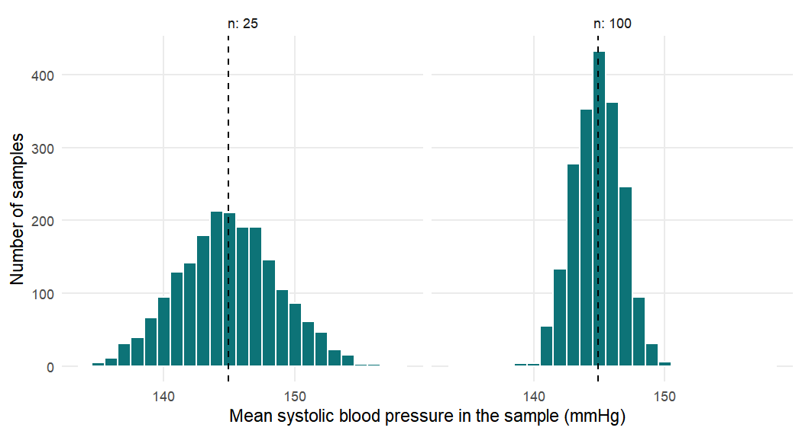
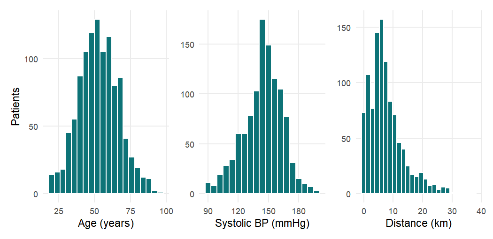
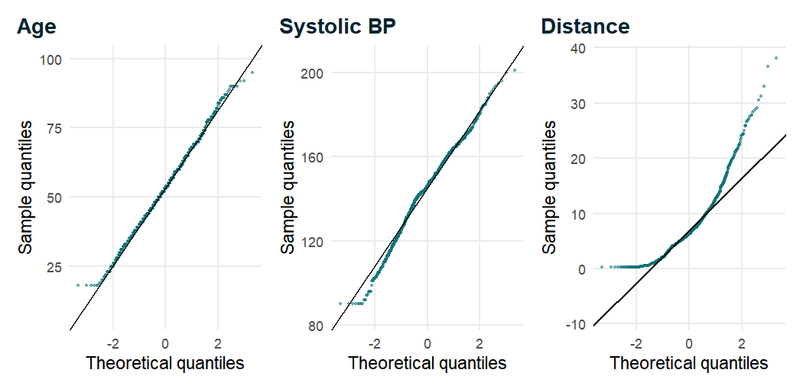
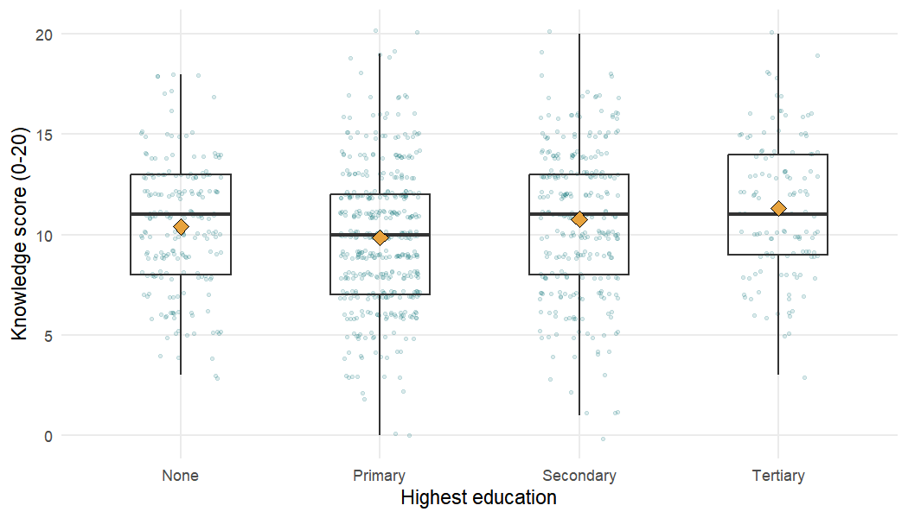
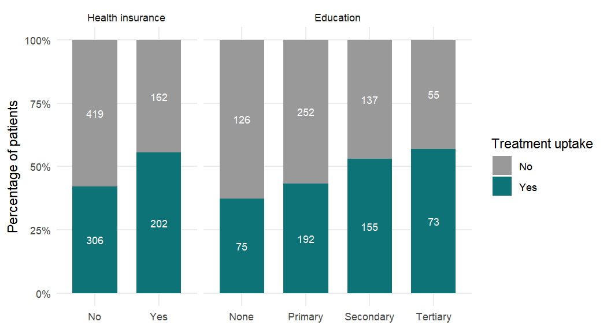
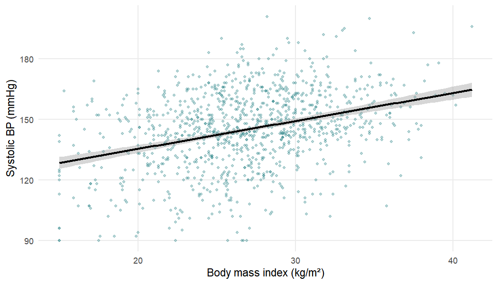

In Chapter 3 we described our 1,500 patients: their ages, their blood pressures, how
many had health insurance and how many had taken up antihypertensive treatment. Description
is essential, but it rarely answers the question a clinician or a health planner actually
asks. They want to know whether patients who take up treatment are *different* from those
who do not: older, better informed, closer to the clinic, more often insured. In our sample
the treated patients are on average about five years older than the untreated. Is that a
real feature of hypertensive patients attending primary care, or could a difference of that
size easily have arisen by chance, because we happened to recruit these particular 1,089
diagnosed patients and not others? Statistical tests, together with their close relatives,
confidence intervals, are the tools that let us move from *describing a sample* to *making
cautious statements about the population it came from*. This chapter explains the logic
behind them, shows the handful of tests that cover most questions in medical research, and,
just as importantly, explains how to read and report their results without falling into the
traps that have made the p-value one of the most misunderstood numbers in science.

::: {.callout-note .nb-objectives icon=false title="Learning objectives"}
- Explain the difference between a population and a sample, and why estimates vary from sample to sample (the standard error).
- Describe the logic of a hypothesis test: null and alternative hypotheses, test statistic, null distribution and p-value.
- State correctly what a p-value is and what it is not, and explain Type I and Type II errors, power and confidence intervals.
- Define the analytic population explicitly and justify it.
- Assess the normality of a continuous variable with a histogram, a Q–Q plot and the Shapiro–Wilk test, and explain why formal normality tests mislead in large samples.
- Compare a continuous variable between two groups (Student's and Welch's t-tests, Wilcoxon rank-sum test) and between more than two groups (one-way ANOVA, Kruskal–Wallis test), with appropriate post-hoc comparisons.
- Test the association between two categorical variables (chi-square and Fisher's exact tests) and estimate the risk difference, relative risk and odds ratio with confidence intervals.
- Measure the association between two continuous variables with Pearson's and Spearman's correlation coefficients.
- Choose an appropriate test for a research question, recognise when single-variable tests are not enough, and report results in words with an estimate, a confidence interval and a p-value.
:::


We use the same packages as in the previous chapters and reload the clean data saved at the
end of Chapter 2. Every chapter starts from that saved file; nothing is re-cleaned by hand.


``` r
library(tidyverse)   # dplyr for data handling, ggplot2 for figures
library(broom)       # tidy() turns test and model output into data frames
library(patchwork)   # places several ggplot2 panels side by side
library(gtsummary)   # summary tables with p-values

course_teal  <- "#0D7377"   # the accent colour used for the book's figures
course_amber <- "#E8A33D"   # a second colour for two-group figures

analysis_data <- readRDS("Data/analysis_data.rds")
dim(analysis_data)
```

```
#> [1] 1500   38
```

## 4.1 From description to inference {#sec-inference}

### 4.1.1 Populations, samples, parameters and statistics

Almost every clinical study observes a **sample** of people in order to learn about a larger
**population**. Our study enrolled adults attending six primary healthcare facilities; the
population of interest is, broadly, adults attending primary care facilities like these. The
quantities that describe the population, such as the true proportion of diagnosed
hypertensive patients who are on treatment or the true mean age of those who are, are called
**parameters**. They are fixed but unknown. The corresponding quantities calculated from our
data, such as the observed proportion on treatment, are called **statistics** or
**estimates**. We use Greek letters for parameters and Roman letters for estimates: $\mu$ is
a population mean and $\bar{x}$ the sample mean that estimates it; $\pi$ is a population
proportion and $p$ the sample proportion [@kirkwood2003; @altman1991].

**Statistical inference** is the business of using the estimates to say something about the
parameters, together with an honest statement of how uncertain we are. It rests on a crucial
assumption: that the sample can be regarded as (approximately) a random sample from the
population. No statistical test can rescue a sample that is badly unrepresentative. If, for
example, only the most motivated patients agreed to take part, the proportion on treatment
in our sample would overestimate the proportion in the population, and a p-value would do
nothing to warn us. The tests in this chapter deal with **random error** (the play of
chance); they do not deal with **systematic error** (bias in selection, measurement or
confounding), which must be handled through study design and, as Chapter 5 shows, partly
through statistical adjustment [@rothman2008].

### 4.1.2 Sampling variation and the standard error

Imagine repeating our study many times, each time recruiting a different random set of
patients. Each repetition would give a slightly different mean systolic blood pressure. This
**sampling variation** is unavoidable, and its size depends on two things: how variable the
measurement is between individuals, and how many individuals we measure. The distribution
of an estimate across hypothetical repetitions of the study is called its **sampling
distribution**, and the standard deviation of that sampling distribution is called the
**standard error** (SE). For a sample mean the standard error is

$$
\mathrm{SE}(\bar{x}) = \frac{\sigma}{\sqrt{n}} \approx \frac{s}{\sqrt{n}},
$$

where $\sigma$ is the standard deviation of the measurement in the population, estimated by
the sample standard deviation $s$, and $n$ is the sample size. For a proportion $p$ the
standard error is $\sqrt{p(1-p)/n}$. The distinction between the two "standard" quantities
is important and frequently confused in published papers: the **standard deviation**
describes how much *individuals* vary, whereas the **standard error** describes how
precisely we have estimated a *summary* such as a mean [@altman1991; @bland2015]. The
standard deviation does not shrink as we recruit more patients; the standard error does, in
proportion to $1/\sqrt{n}$. To halve the standard error we need four times as many patients.

We can see sampling variation directly with a small simulation. We treat the 1,088 diagnosed
patients with a recorded systolic blood pressure as if they were the whole population, draw
2,000 random samples of 25 patients and 2,000 samples of 100 patients, and compute the mean
systolic blood pressure of each sample.


``` r
dx_all <- filter(analysis_data, htn_diagnosed == "Yes")
sbp_pop <- na.omit(dx_all$sbp_mmhg)   # our pretend "population"

set.seed(2026)                         # makes the simulation reproducible
sim_means <- tibble(
  n = rep(c(25, 100), each = 2000),
  sample_mean = c(replicate(2000, mean(sample(sbp_pop, 25))),
                  replicate(2000, mean(sample(sbp_pop, 100))))
)

# Spread of the 2,000 sample means versus the formula sigma / sqrt(n)
sim_means |>
  group_by(n) |>
  summarise(mean_of_means = mean(sample_mean),
            sd_of_means   = sd(sample_mean),
            formula_se    = sd(sbp_pop) / sqrt(first(n)))
```

```
#> # A tibble: 2 × 4
#>       n mean_of_means sd_of_means formula_se
#>   <dbl>         <dbl>       <dbl>      <dbl>
#> 1    25          145.        3.80       3.87
#> 2   100          145.        1.80       1.94
```

The population mean systolic blood pressure is 144.9 mmHg and its
standard deviation is 19.4 mmHg. The output shows three things. First,
the average of the 2,000 sample means (`mean_of_means`) is essentially equal to the
population mean whatever the sample size: the sample mean is an **unbiased** estimator.
Second, the sample means vary much less with samples of 100 than with samples of 25: the
standard deviation of the simulated means (`sd_of_means`) is roughly halved when $n$ is
quadrupled. Third, that empirical spread agrees closely with the formula $\sigma/\sqrt{n}$
(`formula_se`); it is slightly smaller for $n = 100$ only because we are sampling without
replacement from a finite "population" of 1,088 patients. In a real study we have only one sample, but the formula lets us estimate
the standard error from that one sample. Figure 4.1 shows the two sampling distributions.


``` r
ggplot(sim_means, aes(x = sample_mean)) +
  geom_histogram(binwidth = 1, fill = course_teal, colour = "white") +
  geom_vline(xintercept = mean(sbp_pop), linetype = "dashed") +
  facet_wrap(~ n, labeller = label_both) +
  labs(x = "Mean systolic blood pressure in the sample (mmHg)",
       y = "Number of samples")
```



Notice also that both histograms look like the familiar bell-shaped normal curve, even
though systolic blood pressure in individuals is slightly skewed. This is the **central
limit theorem** at work: whatever the shape of the distribution of individual values,
the sampling distribution of a mean (or a proportion) becomes approximately normal as the
sample size grows [@kirkwood2003; @lumley2002]. The theorem is the reason why so many
tests based on the normal distribution work well in medium and large samples, and we return
to it when we discuss normality in Section 4.3.

### 4.1.3 The logic of a hypothesis test

A hypothesis test asks a narrow question: *if there were truly no difference (or no
association) in the population, how surprising would our data be?* The procedure has five
steps [@kirkwood2003; @altman1991].

1. State a **null hypothesis**, $H_0$, usually of "no effect": for example, the mean
   distance to the facility is the same in patients who take up treatment and in those who
   do not, $H_0: \mu_{\text{Yes}} = \mu_{\text{No}}$.
2. State the **alternative hypothesis**, $H_1$, usually that there is some difference in
   either direction, $H_1: \mu_{\text{Yes}} \neq \mu_{\text{No}}$ (a *two-sided*
   alternative).
3. Compute a **test statistic** from the data: a single number that measures how far the
   data depart from what $H_0$ predicts, typically in units of standard error,
   $$
   \text{test statistic} = \frac{\text{observed estimate} - \text{value under } H_0}{\text{standard error of the estimate}}.
   $$
4. Work out the **null distribution**: the distribution the test statistic would have if
   $H_0$ were true. For many tests this is a known theoretical distribution (normal, $t$,
   $\chi^2$ or $F$).
5. Compare the observed statistic with the null distribution to obtain the **p-value**.

The null distribution is the conceptual heart of the test, and it can be built without any
theory at all. Suppose that treatment uptake had nothing to do with distance to the
facility. Then the labels "Yes" and "No" attached to the patients would be arbitrary, and
shuffling them at random should produce differences in mean distance similar to the one we
observed. This is a **permutation test**. We shuffle the labels 5,000 times and record the
difference in mean distance each time.


``` r
perm_data <- filter(dx_all, !is.na(distance_to_facility_km))

# Observed difference in mean distance, No minus Yes (km)
obs_diff <- with(perm_data,
  mean(distance_to_facility_km[treatment_uptake == "No"]) -
  mean(distance_to_facility_km[treatment_uptake == "Yes"]))
obs_diff
```

```
#> [1] 1.0777
```

``` r
set.seed(2026)
perm_diffs <- replicate(5000, {
  shuffled <- sample(perm_data$treatment_uptake)   # break any real link
  mean(perm_data$distance_to_facility_km[shuffled == "No"]) -
    mean(perm_data$distance_to_facility_km[shuffled == "Yes"])
})

# Two-sided p-value: proportion of shuffles at least as extreme as observed
mean(abs(perm_diffs) >= abs(obs_diff))
```

```
#> [1] 0.0034
```

Untreated patients lived on average about 1.08 km further from the facility than treated
patients. Among 5,000 random shufflings, a difference at least that large in either
direction occurred only a handful of times, so the permutation p-value is about 0.003.
Figure 4.2 shows the null distribution and where the observed difference falls.


``` r
tibble(diff = perm_diffs) |>
  mutate(extreme = abs(diff) >= abs(obs_diff)) |>
  ggplot(aes(x = diff, fill = extreme)) +
  geom_histogram(binwidth = 0.05, colour = "white", linewidth = 0.1) +
  geom_vline(xintercept = obs_diff, linewidth = 0.8) +
  geom_vline(xintercept = -obs_diff, linetype = "dashed") +
  scale_fill_manual(values = c(`FALSE` = "grey70", `TRUE` = course_amber),
                    guide = "none") +
  labs(x = "Difference in mean distance under H0 (km)",
       y = "Number of shuffles")
```


The grey histogram is what chance alone produces: differences centred on zero, mostly
within about $\pm 0.7$ km. Our observed difference of 1.08 km sits far out in the right
tail. Either we have witnessed a rare event, or the null hypothesis is wrong. The t-test of
Section 4.4 reaches the same conclusion using a theoretical $t$ distribution instead of
shuffling, and gives almost exactly the same p-value (0.003).

### 4.1.4 What a p-value is, and what it is not

The **p-value** is the probability, *calculated assuming that the null hypothesis (and every
other assumption of the test) is true*, of obtaining a test statistic at least as extreme as
the one observed. A small p-value means that the data would be unusual if $H_0$ were true;
it is evidence against $H_0$. The smaller the p-value, the stronger the evidence
[@kirkwood2003].

In 2016 the American Statistical Association issued an unusual public statement on
p-values because their misuse had become so widespread [@wasserstein2016]. Its six
principles, together with the longer catalogue of misinterpretations by @greenland2016,
can be summarised as follows.

- A p-value indicates how incompatible the data are with a specified statistical model
  (the null hypothesis plus the test's assumptions).
- A p-value is **not** the probability that the null hypothesis is true, nor the
  probability that the results arose "by chance alone". A p-value of 0.003 does not mean
  there is a 0.3% chance that distance is unrelated to uptake.
- Scientific conclusions and clinical decisions should not be based only on whether a
  p-value passes a threshold such as 0.05.
- Proper inference requires full reporting and transparency: running many tests and
  reporting only the "significant" ones invalidates the p-values.
- A p-value does **not** measure the size of an effect or the importance of a result. A
  tiny, clinically irrelevant difference can have a very small p-value in a large study.
- By itself a p-value is not a good measure of evidence about a hypothesis; it should be
  accompanied by an estimate of the effect and its confidence interval.

::: {.callout-warning title="Common mistake"}
Writing "p = 0.003, so there is a 99.7% probability that the difference is real" is wrong.
The p-value is computed *assuming* the null hypothesis is true, so it cannot be the
probability that the null hypothesis is true. Equally wrong is "p = 0.40, so there is no
difference": a large p-value only says the data are compatible with no difference; they may
also be compatible with a large one.
:::

### 4.1.5 Significance level, Type I and Type II errors, and power

Many studies turn the p-value into a decision by comparing it with a pre-chosen
**significance level** $\alpha$, conventionally 0.05: if $p < \alpha$ the result is called
"statistically significant" and $H_0$ is "rejected". The threshold is a convention, not a
law of nature, and there is nothing materially different between $p = 0.049$ and
$p = 0.051$ [@wasserstein2016]. Thinking in terms of decisions does, however, clarify the
two kinds of mistake a test can make (Table 4.1).

Table: The four possible outcomes of a hypothesis test.

| Decision from the test | $H_0$ actually true | $H_0$ actually false |
|---|---|---|
| Reject $H_0$ ("significant") | **Type I error** (false positive); probability $\alpha$ | Correct; probability $1-\beta$ = **power** |
| Do not reject $H_0$ | Correct; probability $1-\alpha$ | **Type II error** (false negative); probability $\beta$ |

A **Type I error** is declaring a difference when none exists; by construction its
probability is $\alpha$ for a single test. A **Type II error** is failing to detect a
difference that does exist; its probability is called $\beta$. The **power** of a study,
$1-\beta$, is the probability that it will detect a true effect of a specified size. Power
increases with the size of the true effect, with the sample size and with the significance
level, and decreases as the variability of the outcome increases [@altman1991; @kirkwood2003].
Clinical studies are usually designed to have 80% or 90% power for the smallest effect that
would be clinically important. R's `power.t.test()` performs the standard calculation for
comparing two means.


``` r
# Patients needed per group to detect a 5 mmHg difference in mean SBP,
# with SD 19 mmHg (as in our data), two-sided alpha = 0.05, 80% power
power.t.test(delta = 5, sd = 19, sig.level = 0.05, power = 0.80)
```

```
#> 
#>      Two-sample t test power calculation 
#> 
#>               n = 227.64
#>           delta = 5
#>              sd = 19
#>       sig.level = 0.05
#>           power = 0.8
#>     alternative = two.sided
#> 
#> NOTE: n is number in *each* group
```

To detect a 5 mmHg difference in mean systolic blood pressure, given a standard deviation of
19 mmHg, with 80% power at the 5% level, about 228
patients are needed in each group (R reports a fractional $n$, which we round up). Our
study has more than 500 patients per group, so it has high power for differences of that size,
which also means it will flag rather small differences as statistically significant.

### 4.1.6 Confidence intervals and p-values

A **confidence interval** (CI) gives a range of values for the population parameter that are
compatible with the data. For an estimate whose sampling distribution is approximately
normal, the 95% confidence interval is

$$
\text{estimate} \pm 1.96 \times \mathrm{SE}(\text{estimate}).
$$

The interpretation is about the procedure: if we repeated the study many times and computed
a 95% CI each time, about 95% of those intervals would contain the true parameter
[@altman1991; @kirkwood2003]. Informally, the interval shows the range of population values
with which our data are reasonably consistent.

Confidence intervals and two-sided p-values are two views of the same calculation. If the
95% CI for a difference excludes zero (or the 95% CI for a ratio excludes one), then
$p < 0.05$, and vice versa. But the interval carries far more information than the p-value:
it shows the **size** of the effect, its **direction**, and the **precision** with which it
has been estimated. A wide interval warns that the study cannot pin down the effect; a
narrow interval that lies entirely within a range of clinically unimportant values tells us
that any effect is too small to matter. For this reason medical journals and reporting
guidelines ask authors to report effect estimates with confidence intervals, and to treat
p-values as secondary [@altman1991; @vonelm2007].

### 4.1.7 Statistical significance versus clinical significance

"Statistically significant" means only that the data are hard to reconcile with the null
hypothesis. It does not mean that the effect is large, important or useful. In a large study,
a difference in mean systolic blood pressure of 1 mmHg may be statistically significant but
is of no clinical consequence for an individual patient. Conversely, in a small study, a
clinically important reduction of 10 mmHg may fail to reach significance because the
confidence interval is wide. The question "is it significant?" should always be followed by
"how big is it, and does that size matter for patients?" Answering the second question
requires clinical knowledge, not statistics: for example, knowing that a sustained 10 mmHg
fall in systolic pressure substantially reduces cardiovascular risk [@who2021htn].

### 4.1.8 Absence of evidence is not evidence of absence

A non-significant result is often misreported as showing that "there is no difference" or
"the treatment has no effect". @altman1995absence called this one of the most common errors
in medical research. A large p-value means only that the study did not find convincing
evidence of a difference; it may simply have been too small, or the outcome too variable, to
detect one. The confidence interval reveals which situation we are in. If the interval is
narrow and centred near zero, we can reasonably conclude that any difference is small. If
it is wide and includes clinically important values, the study is inconclusive and the
honest summary is "we cannot tell".

::: {.callout-tip title="Good practice"}
Report every comparison as an **estimate**, its **95% confidence interval** and the **exact
p-value** (for example $p = 0.003$, not "$p < 0.05$" or "NS"), and interpret the estimate in
clinical terms. Very small p-values may be given as $p < 0.001$.
:::

## 4.2 Defining the analytic population {#sec-analytic-population}

Before any test, we must decide exactly *whose* data answer the question. The primary
outcome of the study is **treatment uptake**: whether a patient is currently taking
antihypertensive medication. That outcome is only meaningful for patients who have been
diagnosed with hypertension. A patient who has never been told that their blood pressure is
raised cannot have "failed to take up" treatment; their outcome is not "No", it is
undefined. Including them would mix two different questions (who gets diagnosed, and who is
treated once diagnosed) and would bias every comparison. The **analytic population** for
uptake is therefore the patients with `htn_diagnosed == "Yes"`, and we define it once,
explicitly, and use the same object throughout the chapter.


``` r
# The analytic population: patients already diagnosed with hypertension
dx <- analysis_data |>
  filter(htn_diagnosed == "Yes")

nrow(dx)                       # number of patients analysed
```

```
#> [1] 1089
```

``` r
dx |> count(treatment_uptake) |>
  mutate(percent = round(100 * n / sum(n), 1))
```

```
#> # A tibble: 2 × 3
#>   treatment_uptake     n percent
#>   <fct>            <int>   <dbl>
#> 1 No                 581    53.4
#> 2 Yes                508    46.6
```

Of the 1,500 patients, 1,089 had been diagnosed with hypertension, and 508 of them (46.6%)
were on treatment. Every result in the rest of this chapter refers to these 1,089 patients.
Note that some variables have missing values within this group (for example 47 patients
have no recorded distance to the facility); R's test functions drop missing values
silently, so the number of patients contributing to each test can be slightly smaller than
1,089. A good report states the number analysed for every result.

::: {.callout-warning title="Common mistake"}
Running the uptake analysis on all 1,500 patients. The 411 undiagnosed patients would all
appear as "No" for treatment, which artificially lowers uptake and distorts every
comparison (for instance, any characteristic linked to *being diagnosed* would appear to be
linked to *being treated*). Define the analytic population first, write it down in the
methods, and use it consistently.
:::

The data are simulated for teaching. The associations they contain were built in to
illustrate methods; the numbers in this chapter should not be read as real clinical
findings about hypertension care.

## 4.3 Checking the normality assumption {#sec-normality}

Several classical tests, called **parametric** tests, are derived under the assumption that
the data (or, more precisely, the residuals or the values within each group) follow a
**normal distribution**: the t-test, analysis of variance and Pearson's correlation
coefficient. Their **non-parametric** counterparts (the Wilcoxon rank-sum test, the
Kruskal–Wallis test and Spearman's correlation) replace the observed values by their ranks
and do not need that assumption [@altman1991; @bland2015]. Deciding between them requires a
look at the shape of the data.

The normal distribution is symmetric and bell-shaped, and is fully described by its mean
$\mu$ and standard deviation $\sigma$: about 68% of values lie within one standard
deviation of the mean and 95% within 1.96 standard deviations [@altman1995normal]. We
examine three continuous variables in the analytic population: age, systolic blood
pressure and distance to the facility.

### 4.3.1 Look first: histograms


``` r
p_age <- ggplot(dx, aes(x = age)) +
  geom_histogram(binwidth = 4, fill = course_teal, colour = "white") +
  labs(x = "Age (years)", y = "Patients")
p_sbp <- ggplot(dx, aes(x = sbp_mmhg)) +
  geom_histogram(binwidth = 6, fill = course_teal, colour = "white") +
  labs(x = "Systolic BP (mmHg)", y = NULL)
p_dist <- ggplot(dx, aes(x = distance_to_facility_km)) +
  geom_histogram(binwidth = 1.5, fill = course_teal, colour = "white") +
  labs(x = "Distance (km)", y = NULL)

p_age + p_sbp + p_dist     # patchwork places the three panels side by side
```



A histogram shows the overall shape. Age and systolic blood pressure are roughly symmetric
and unimodal; systolic pressure has a slightly longer right tail. Distance to the facility
is clearly **right-skewed**: most patients live within about 10 km but a few live more than
25 km away. For a skewed variable the mean is pulled towards the long tail (here the mean
distance is 7.7 km but the median only 6.3 km), and the median and interquartile range are
better summaries (Chapter 3).

### 4.3.2 Q–Q plots

A **quantile–quantile (Q–Q) plot** is a sharper tool. It plots the ordered data values
against the values we would expect if the data came from a normal distribution with the same
mean and standard deviation. If the data are normal, the points lie close to a straight
line. Systematic curvature indicates skewness; points that peel away at both ends in
opposite directions indicate heavier (or lighter) tails than the normal distribution
[@altman1995normal; @bland2015].


``` r
qq_panel <- function(var, label) {
  ggplot(dx, aes(sample = .data[[var]])) +
    stat_qq(size = 0.6, alpha = 0.5, colour = course_teal) +
    stat_qq_line(colour = "black") +
    labs(title = label, x = "Theoretical quantiles", y = "Sample quantiles")
}

qq_panel("age", "Age") +
  qq_panel("sbp_mmhg", "Systolic BP") +
  qq_panel("distance_to_facility_km", "Distance")
```



The points for age follow the line almost perfectly, apart from a short horizontal run at
the lower end: the study enrolled adults only, so the left tail is cut off at 18 years.
Systolic blood pressure follows the line well through the middle of the distribution, with a
horizontal run at the bottom (a floor of very low readings) and a gentle S-shape; these are
modest departures that affect only the extreme few per cent of patients. Distance
curves upwards in a banana shape: the largest distances are far greater than a normal
distribution would produce, the signature of right skew.

### 4.3.3 Formal tests of normality: Shapiro–Wilk

The **Shapiro–Wilk test** [@shapiro1965] tests the null hypothesis that the data come from
a normal distribution. Its statistic $W$ compares an optimally weighted combination of the
ordered observations with the sample variance; $W$ is close to 1 for normal data and smaller
for non-normal data. In R, `shapiro.test()` accepts between 3 and 5,000 observations.


``` r
shapiro.test(dx$age)
```

```
#> 
#> 	Shapiro-Wilk normality test
#> 
#> data:  dx$age
#> W = 0.997, p-value = 0.056
```

``` r
shapiro.test(dx$sbp_mmhg)
```

```
#> 
#> 	Shapiro-Wilk normality test
#> 
#> data:  dx$sbp_mmhg
#> W = 0.988, p-value = 7.5e-08
```

``` r
shapiro.test(dx$distance_to_facility_km)
```

```
#> 
#> 	Shapiro-Wilk normality test
#> 
#> data:  dx$distance_to_facility_km
#> W = 0.888, p-value <2e-16
```

Reading the output: each block names the test and the data, then gives $W$ and the p-value.
For age $W = 0.997$ and $p = 0.056$, so there is no strong evidence against normality. For
distance $W = 0.888$ and $p < 2.2 \times 10^{-16}$ (R's way of saying "smaller than the
smallest number it reports"), confirming the obvious skew. The interesting case is systolic
blood pressure: $W = 0.988$, very close to 1, yet $p = 7.5 \times 10^{-8}$. The test
"rejects normality" decisively for a variable whose histogram and Q–Q plot look nearly
normal.

### 4.3.4 Why tests of normality mislead in large samples

This is the general problem with normality tests. Like every test, the Shapiro–Wilk test
gains power as the sample grows. With more than a thousand observations it detects
departures from normality that are far too small to matter for any practical purpose. With
a small sample the opposite happens: the test has little power and can fail to detect
serious skewness. So the test is most likely to reject normality precisely when normality
matters least (large samples) and to miss non-normality when it matters most (small
samples).

The reason normality matters least in large samples is the central limit theorem. The
t-test and ANOVA compare *means*, and the sampling distribution of a mean is close to normal
in large samples whatever the distribution of the individual values, as Figure 4.1 showed.
@lumley2002 reviewed the evidence and showed that in public health data sets of the usual
size the t-test and linear regression give valid results even for markedly skewed outcomes;
what matters more is that the mean is a sensible summary of the question. The normality
assumption therefore deserves most attention when samples are small (say fewer than 30 per
group) or when the data are extremely skewed or contain gross outliers.


``` r
# The same test on a random sample of only 50 ages: much less power
set.seed(1)
shapiro.test(sample(dx$age, 50))
```

```
#> 
#> 	Shapiro-Wilk normality test
#> 
#> data:  sample(dx$age, 50)
#> W = 0.97, p-value = 0.23
```

::: {.callout-tip title="Good practice"}
Decide on parametric versus non-parametric methods by **looking** (histogram, Q–Q plot),
by considering the **sample size** and by asking whether the **mean** is a meaningful
summary of the question. Do not let a Shapiro–Wilk p-value make the decision on its own.
In large samples, roughly symmetric data can be analysed with t-tests and ANOVA; strongly
skewed data, ordinal scores and small samples point to rank-based methods (or to a
transformation, such as the logarithm, before a parametric analysis).
:::

## 4.4 Comparing two groups: a continuous outcome {#sec-two-groups}

Our first substantive question is whether patients who take up treatment differ in age from
those who do not. The outcome of the comparison is a continuous variable (age) and the
grouping variable has two categories (uptake Yes or No).

### 4.4.1 Independent and paired samples

The right test depends on how the two sets of measurements were obtained.

- **Independent samples**: the two groups contain different, unrelated individuals, such as
  treated and untreated patients. Each patient contributes one measurement.
- **Paired samples**: each observation in one group is linked to a specific observation in
  the other, such as blood pressure measured in the same patients before and after starting
  treatment, or in matched case–control pairs. The pairs are analysed through their
  *differences*, which removes the between-person variation and usually gives much more
  precision.

For paired data, the **paired t-test** is simply a one-sample t-test on the within-pair
differences $d_i$, with statistic $t = \bar{d}/(s_d/\sqrt{n})$ on $n-1$ degrees of freedom,
where $n$ is the number of pairs; its rank-based counterpart is the **Wilcoxon
signed-rank test** [@altman1991; @kirkwood2003]. In R they are `t.test(x, y, paired = TRUE)`
and `wilcox.test(x, y, paired = TRUE)`. Our cross-sectional study measures each patient
once, so all comparisons in this chapter are between independent groups. Analysing paired
data as if they were independent (or the reverse) is a serious error that gives wrong
standard errors.

### 4.4.2 Student's t-test

The **two-sample t-test** was derived by W. S. Gosset, writing as "Student" while working
for the Guinness brewery [@student1908]. For two independent groups with means
$\bar{x}_1, \bar{x}_2$, standard deviations $s_1, s_2$ and sizes $n_1, n_2$, it assumes that
the outcome is normally distributed in each group *with the same variance*. The common
variance is estimated by pooling the two groups,

$$
s_p^2 = \frac{(n_1 - 1)s_1^2 + (n_2 - 1)s_2^2}{n_1 + n_2 - 2},
$$

and the test statistic is

$$
t = \frac{\bar{x}_1 - \bar{x}_2}{s_p\sqrt{\dfrac{1}{n_1} + \dfrac{1}{n_2}}},
$$

which under $H_0: \mu_1 = \mu_2$ follows a $t$ distribution with $n_1 + n_2 - 2$ degrees of
freedom. The $t$ distribution looks like the normal distribution but has heavier tails,
allowing for the extra uncertainty from estimating the standard deviation; with more than a
few dozen degrees of freedom it is practically identical to the normal. The 95% confidence
interval for the difference in means is
$(\bar{x}_1 - \bar{x}_2) \pm t_{0.975,\,n_1+n_2-2} \times s_p\sqrt{1/n_1 + 1/n_2}$.

### 4.4.3 Welch's t-test

If the two groups have different variances, the pooled standard error is wrong, especially
when the groups also differ in size. @welch1947 proposed using the separate variances,

$$
t = \frac{\bar{x}_1 - \bar{x}_2}{\sqrt{\dfrac{s_1^2}{n_1} + \dfrac{s_2^2}{n_2}}},
$$

compared with a $t$ distribution whose degrees of freedom are given by the
Welch–Satterthwaite approximation,

$$
\nu \approx \frac{\left(\dfrac{s_1^2}{n_1} + \dfrac{s_2^2}{n_2}\right)^2}
{\dfrac{(s_1^2/n_1)^2}{n_1 - 1} + \dfrac{(s_2^2/n_2)^2}{n_2 - 1}},
$$

which is usually not a whole number. Welch's test loses very little when the variances are in
fact equal and protects against error when they are not, so R uses it by default and it is
the sensible routine choice.

### 4.4.4 The t-test in R

First, a numerical summary of age by group, so that we know what the test is comparing.


``` r
dx |>
  group_by(treatment_uptake) |>
  summarise(n    = sum(!is.na(age)),
            mean = mean(age, na.rm = TRUE),
            sd   = sd(age, na.rm = TRUE))
```

```
#> # A tibble: 2 × 4
#>   treatment_uptake     n  mean    sd
#>   <fct>            <int> <dbl> <dbl>
#> 1 No                 580  51.1  13.4
#> 2 Yes                508  56.3  14.1
```

Treated patients are on average about 5 years older (56.3 versus 51.1 years), and the
standard deviations are similar (13.4 and 14.1 years). Now the test. The formula
`age ~ treatment_uptake` reads "age by treatment uptake".


``` r
t.test(age ~ treatment_uptake, data = dx)
```

```
#> 
#> 	Welch Two Sample t-test
#> 
#> data:  age by treatment_uptake
#> t = -6.18, df = 1050, p-value = 8.9e-10
#> alternative hypothesis: true difference in means between group No and group
#>   Yes is not equal to 0
#> 95 percent confidence interval:
#>  -6.8184 -3.5338
#> sample estimates:
#>  mean in group No mean in group Yes 
#>            51.103            56.280
```

Reading the output line by line:

- **Welch Two Sample t-test**: R used Welch's version (unequal variances allowed).
- **data: age by treatment_uptake**: the outcome and the grouping variable.
- **t = -6.18**: the test statistic. The difference in means is about 6.2 standard errors
  away from zero. It is negative because R subtracts in the order of the factor levels,
  "No" minus "Yes", and the "No" group is younger.
- **df = 1050**: the Welch–Satterthwaite degrees of freedom, rounded for printing (the
  exact value is 1049.6; Welch degrees of freedom are usually not whole numbers).
- **p-value = 8.9e-10**: $8.9 \times 10^{-10}$, i.e. $p < 0.001$. If mean age were truly
  identical in the two populations, a difference this large would almost never occur by
  chance.
- **alternative hypothesis**: confirms a two-sided test of whether the difference
  (No minus Yes) is not equal to 0.
- **95 percent confidence interval: -6.82 -3.53**: the difference in mean age (No minus
  Yes) is estimated to lie between $-6.8$ and $-3.5$ years. Equivalently, treated patients
  are between 3.5 and 6.8 years older on average.
- **sample estimates**: the two group means, 51.1 and 56.3 years.

For comparison, Student's version with a pooled variance is requested with
`var.equal = TRUE`.


``` r
t.test(age ~ treatment_uptake, data = dx, var.equal = TRUE)
```

```
#> 
#> 	Two Sample t-test
#> 
#> data:  age by treatment_uptake
#> t = -6.21, df = 1086, p-value = 7.7e-10
#> alternative hypothesis: true difference in means between group No and group
#>   Yes is not equal to 0
#> 95 percent confidence interval:
#>  -6.8125 -3.5397
#> sample estimates:
#>  mean in group No mean in group Yes 
#>            51.103            56.280
```

With large groups and similar standard deviations the two versions agree to the first
decimal place: $t = -6.21$ on 1,086 degrees of freedom, the same confidence interval and the
same conclusion. They diverge only when variances and group sizes differ substantially, and
in that situation Welch's test is the trustworthy one.

The function `broom::tidy()` turns the test result into a one-row data frame, which is
convenient for building tables of results.


``` r
t.test(age ~ treatment_uptake, data = dx) |>
  tidy() |>
  select(estimate, estimate1, estimate2, statistic, p.value,
         conf.low, conf.high)
```

```
#> # A tibble: 1 × 7
#>   estimate estimate1 estimate2 statistic  p.value conf.low conf.high
#>      <dbl>     <dbl>     <dbl>     <dbl>    <dbl>    <dbl>     <dbl>
#> 1    -5.18      51.1      56.3     -6.18 8.92e-10    -6.82     -3.53
```

### 4.4.5 Effect size: the difference in means

The most useful effect size for a continuous outcome measured in clinically meaningful
units is simply the **difference in means with its 95% confidence interval**: treated
patients were on average 5.2 years older (95% CI 3.5 to 6.8 years). This is directly
interpretable. Standardised effect sizes, such as Cohen's $d$ (the difference in means
divided by the pooled standard deviation, here about $5.2/13.7 \approx 0.38$), are useful
for comparing outcomes measured on different scales or for sample size planning, but they
are less transparent to clinical readers and should supplement, not replace, the raw
difference [@kirkwood2003].

::: {.callout-note title="Clinical interpretation"}
Among diagnosed hypertensive patients, those on treatment were on average 5.2 years older
than those not on treatment (95% CI 3.5 to 6.8 years; $p < 0.001$). Older patients are
more likely to be in regular contact with health services and to have accumulated
cardiovascular risk, so this pattern is plausible. It is an association in a
cross-sectional sample, not evidence that ageing *causes* uptake, and other factors that
change with age may explain part of it (Section 4.9).
:::

### 4.4.6 The Wilcoxon rank-sum (Mann–Whitney) test

When the outcome is skewed, ordinal, or the samples are small, a rank-based test is
preferable. The **Wilcoxon rank-sum test**, which is equivalent to the **Mann–Whitney U
test** [@mann1947], pools the two groups, ranks all observations from smallest to largest
(tied values share the average rank), and compares the ranks between groups. If $R_1$ is
the sum of the ranks in group 1, the statistic is

$$
W = R_1 - \frac{n_1(n_1 + 1)}{2},
$$

which counts the number of pairs (one patient from each group) in which the group 1 value
exceeds the group 2 value. Under $H_0$ that the two distributions are identical, $W$ has a
known distribution with mean $n_1 n_2 / 2$; for large samples a normal approximation is used.
Because it uses only ranks, the test is unaffected by the size of extreme values. It tests
whether values in one group tend to be larger than in the other; it is a test of medians
only if the two distributions have the same shape [@altman1991; @bland2015].

Distance to the facility is strongly skewed, so we compare it between uptake groups with
the rank-sum test. First the medians and quartiles:


``` r
dx |>
  group_by(treatment_uptake) |>
  summarise(n      = sum(!is.na(distance_to_facility_km)),
            median = median(distance_to_facility_km, na.rm = TRUE),
            q1     = quantile(distance_to_facility_km, 0.25, na.rm = TRUE),
            q3     = quantile(distance_to_facility_km, 0.75, na.rm = TRUE))
```

```
#> # A tibble: 2 × 5
#>   treatment_uptake     n median    q1    q3
#>   <fct>            <int>  <dbl> <dbl> <dbl>
#> 1 No                 561    6.8   4.3  10.7
#> 2 Yes                481    5.8   3.1   9.6
```


``` r
wilcox.test(distance_to_facility_km ~ treatment_uptake, data = dx,
            conf.int = TRUE)
```

```
#> 
#> 	Wilcoxon rank sum test with continuity correction
#> 
#> data:  distance_to_facility_km by treatment_uptake
#> W = 151283, p-value = 0.00073
#> alternative hypothesis: true location shift is not equal to 0
#> 95 percent confidence interval:
#>  0.39997 1.50000
#> sample estimates:
#> difference in location 
#>                0.99998
```

Reading the output:

- **Wilcoxon rank sum test with continuity correction**: R used the normal approximation
  (with a small continuity correction) because the samples are large and there are tied
  values.
- **W = 151283**: the rank-sum statistic for the first group ("No"). Its absolute size is
  not interpretable on its own.
- **p-value = 0.00073**: strong evidence that distances tend to differ between the
  groups.
- **95 percent confidence interval: 0.40 1.50** and **difference in location 1.00**
  (printed as 0.39997, 1.50000 and 0.99998, because the estimate is found numerically):
  because we asked for `conf.int = TRUE`, R also reports the **Hodges–Lehmann estimate**,
  the median of all pairwise differences between a "No" patient and a "Yes" patient. Untreated
  patients typically live about 1.0 km further away (95% CI 0.4 to 1.5 km).

The medians tell the same story: 6.8 km (IQR 4.3 to 10.7) among untreated and 5.8 km
(IQR 3.1 to 9.6) among treated patients. The rank-based Hodges–Lehmann estimate is the
natural effect size to report alongside this test. For comparison, the Welch t-test on the
same skewed variable:


``` r
t.test(distance_to_facility_km ~ treatment_uptake, data = dx) |>
  tidy() |>
  select(estimate, statistic, p.value, conf.low, conf.high)
```

```
#> # A tibble: 1 × 5
#>   estimate statistic p.value conf.low conf.high
#>      <dbl>     <dbl>   <dbl>    <dbl>     <dbl>
#> 1     1.08      2.95 0.00326    0.361      1.79
```

The t-test estimates a difference in *means* of 1.08 km (95% CI 0.36 to 1.79 km,
$p = 0.003$), the same p-value as the permutation test of Section 4.1. With more than 500
patients per group the central limit theorem protects the t-test even for a skewed variable,
and both tests reach the same conclusion. The choice between them is therefore partly about
what we want to describe: a difference in *means* (relevant, for example, to the average
travel burden) or a typical *shift* in the distribution.


``` r
# The rank-sum test for age, for comparison with the t-test
wilcox.test(age ~ treatment_uptake, data = dx)
```

```
#> 
#> 	Wilcoxon rank sum test with continuity correction
#> 
#> data:  age by treatment_uptake
#> W = 117011, p-value = 4.5e-09
#> alternative hypothesis: true location shift is not equal to 0
```

For age, which is roughly normal, the rank-sum test ($p = 4.5 \times 10^{-9}$) agrees with
the t-test. When the parametric and non-parametric tests agree, report the one that matches
your summary statistics (means with the t-test, medians with the rank-sum test). When they
disagree, look again at the data: usually skewness or outliers are driving the t-test.

::: {.callout-warning title="Common mistake"}
Reporting only "Mann–Whitney $p < 0.001$" without any effect size. A rank test answers
"is there a difference?", not "how big is it?". Report the medians (and IQRs) of both
groups and, ideally, the Hodges–Lehmann difference with its confidence interval.
:::

## 4.5 Comparing more than two groups {#sec-anova}

Knowledge of hypertension, measured by a score from 0 to 20, may differ by education. With
four education levels (None, Primary, Secondary, Tertiary) there are six possible pairs of
groups. Running six t-tests would inflate the chance of at least one false-positive result
(Section 4.5.5). **One-way analysis of variance** (ANOVA) instead asks a single question:
are all the group means equal?

### 4.5.1 The idea of analysis of variance

ANOVA, developed by R. A. Fisher, compares two estimates of variability [@altman1991;
@kirkwood2003]. Suppose there are $k$ groups, group $j$ has $n_j$ observations with mean
$\bar{x}_j$, the overall mean is $\bar{x}$ and the total number of observations is $N$. The
total variability of the observations around the overall mean is split into two parts:

$$
\underbrace{\sum_{j}\sum_{i}(x_{ij} - \bar{x})^2}_{\text{total SS}}
= \underbrace{\sum_{j} n_j(\bar{x}_j - \bar{x})^2}_{\text{between-groups SS}}
+ \underbrace{\sum_{j}\sum_{i}(x_{ij} - \bar{x}_j)^2}_{\text{within-groups SS}}.
$$

Each **sum of squares** (SS) is divided by its degrees of freedom to give a **mean square**
(MS): $\text{MS}_{\text{between}} = \text{SS}_{\text{between}}/(k-1)$ and
$\text{MS}_{\text{within}} = \text{SS}_{\text{within}}/(N-k)$. The within-groups mean square
estimates the variance of individuals around their group mean, whatever the truth about the
group means. The between-groups mean square estimates the same variance *if* $H_0$ is true,
but is inflated if the group means differ. Their ratio is the **F statistic**,

$$
F = \frac{\text{MS}_{\text{between}}}{\text{MS}_{\text{within}}},
$$

which is close to 1 under $H_0$ and is compared with an $F$ distribution on $k-1$ and $N-k$
degrees of freedom. With two groups, one-way ANOVA is identical to Student's t-test
($F = t^2$). The assumptions are those of Student's t-test extended to $k$ groups:
independent observations, approximately normal values within each group (less important in
large samples), and similar variances across groups.

### 4.5.2 Look at the groups first


``` r
dx |>
  filter(!is.na(education), !is.na(knowledge_score)) |>
  group_by(education) |>
  summarise(n = n(), mean = mean(knowledge_score),
            sd = sd(knowledge_score), median = median(knowledge_score))
```

```
#> # A tibble: 4 × 5
#>   education     n  mean    sd median
#>   <ord>     <int> <dbl> <dbl>  <dbl>
#> 1 None        197 10.4   3.15     11
#> 2 Primary     432  9.85  3.37     10
#> 3 Secondary   285 10.8   3.64     11
#> 4 Tertiary    122 11.3   3.41     11
```


``` r
dx |>
  filter(!is.na(education), !is.na(knowledge_score)) |>
  ggplot(aes(x = education, y = knowledge_score)) +
  geom_jitter(width = 0.2, height = 0.2, alpha = 0.15, size = 0.8,
              colour = course_teal) +
  geom_boxplot(fill = NA, outlier.shape = NA, width = 0.5) +
  stat_summary(fun = mean, geom = "point", shape = 23, size = 3,
               fill = course_amber) +
  labs(x = "Highest education", y = "Knowledge score (0-20)")
```



Showing the individual points as well as the boxes, as recommended by @weissgerber2015,
lets the reader see the sample size and the spread in each group. Mean knowledge scores
range from 9.9 (Primary) to 11.3 (Tertiary), with standard deviations of 3.2 to 3.6 in
every group: the differences between groups are small compared with the variation within
them, but the groups are large.

### 4.5.3 One-way ANOVA in R

`aov()` fits the analysis of variance; `summary()` prints the ANOVA table.


``` r
aov_know <- aov(knowledge_score ~ education, data = dx)
summary(aov_know)
```

```
#>               Df Sum Sq Mean Sq F value  Pr(>F)    
#> education      3    274    91.2    7.84 3.5e-05 ***
#> Residuals   1032  12008    11.6                    
#> ---
#> Signif. codes:  0 '***' 0.001 '**' 0.01 '*' 0.05 '.' 0.1 ' ' 1
#> 53 observations deleted due to missingness
```

Reading the ANOVA table:

- **education** row: the between-groups line. **Df = 3** ($k - 1 = 4 - 1$),
  **Sum Sq = 274** (between-groups SS), **Mean Sq = 91.2** ($274/3$).
- **Residuals** row: the within-groups line. **Df = 1032** ($N - k = 1036 - 4$),
  **Sum Sq = 12008**, **Mean Sq = 11.6**, the pooled within-group variance (its square
  root, 3.4, is the pooled standard deviation).
- **F value = 7.84**: $91.2 / 11.6$. The variation between education groups is almost
  eight times what we would expect from within-group variation alone.
- **Pr(>F) = 3.5e-05**: the p-value, $p < 0.001$. There is strong evidence that mean
  knowledge differs between at least some education levels.
- The stars and "Signif. codes" are a legend for the p-value; they add nothing and are best
  ignored.
- **53 observations deleted due to missingness**: patients missing either education or the
  knowledge score were dropped, so $N = 1{,}036$. Always note this line.

### 4.5.4 Checking the assumptions

The equal-variance assumption can be examined informally by comparing the standard
deviations (here 3.2 to 3.6, very similar) or with **Levene's test**, available in the `car`
package. If variances clearly differ, **Welch's ANOVA** (`oneway.test()`) generalises
Welch's t-test to several groups.


``` r
# Levene's test: H0 = equal variances in all groups.
# education is an ordered factor; car wants a plain factor here.
car::leveneTest(knowledge_score ~ factor(education, ordered = FALSE),
                data = dx)
```

```
#> Levene's Test for Homogeneity of Variance (center = median)
#>         Df F value Pr(>F)
#> group    3    1.88   0.13
#>       1032
```

``` r
# Welch's ANOVA does not assume equal variances
oneway.test(knowledge_score ~ education, data = dx)
```

```
#> 
#> 	One-way analysis of means (not assuming equal variances)
#> 
#> data:  knowledge_score and education
#> F = 7.74, num df = 3, denom df = 405, p-value = 4.9e-05
```

Levene's test gives $p = 0.13$: no evidence that the variances differ. Welch's ANOVA gives
$F = 7.74$ on 3 and 404.5 degrees of freedom, $p < 0.001$, essentially the same answer as the
classical ANOVA. The knowledge score is a bounded count from 0 to 20 and is not exactly
normal, but with more than 100 patients per group the central limit theorem makes this
unimportant; we confirm with the Kruskal–Wallis test below.

### 4.5.5 Post-hoc comparisons and multiple testing

A significant F test says that the group means are not all equal, but not which groups
differ. To find out we compare pairs of groups, and here the **multiple testing** problem
appears. If each test has a 5% chance of a false positive, then with $m$ independent tests
the chance of at least one false positive when all null hypotheses are true is
$1 - 0.95^m$: 26% for six tests and 64% for twenty. Searching through many comparisons and
reporting the significant ones is a reliable way to produce false findings.

The simplest remedy is the **Bonferroni correction** [@bland1995multiple]: to keep the
overall (family-wise) error rate at $\alpha$, test each of the $m$ comparisons at level
$\alpha/m$, or equivalently multiply each p-value by $m$ (capping at 1). The method is
simple and always valid but conservative, especially when $m$ is large or the tests are
correlated. **Tukey's honestly significant difference** (HSD) method is designed
specifically for all pairwise comparisons after ANOVA and gives simultaneous confidence
intervals for every pair of differences [@altman1991].


``` r
TukeyHSD(aov_know)
```

```
#>   Tukey multiple comparisons of means
#>     95% family-wise confidence level
#> 
#> Fit: aov(formula = knowledge_score ~ education, data = dx)
#> 
#> $education
#>                        diff       lwr     upr   p adj
#> Primary-None       -0.54685 -1.301448 0.20775 0.24398
#> Secondary-None      0.37442 -0.438846 1.18769 0.63668
#> Tertiary-None       0.92685 -0.084373 1.93808 0.08591
#> Secondary-Primary   0.92127  0.251447 1.59110 0.00237
#> Tertiary-Primary    1.47370  0.573791 2.37361 0.00016
#> Tertiary-Secondary  0.55243 -0.397215 1.50208 0.43971
```

Each row of the Tukey output is one pairwise comparison. **diff** is the difference in mean
knowledge score (the first-named group minus the second); **lwr** and **upr** are the limits
of a 95% confidence interval adjusted for making six comparisons; **p adj** is the adjusted
p-value. Two comparisons stand out: Secondary versus Primary (difference 0.92 points, 95% CI
0.25 to 1.59, adjusted $p = 0.002$) and Tertiary versus Primary (1.47 points, 0.57 to 2.37,
$p < 0.001$). The other intervals include zero. Interestingly, the "None" group scores
slightly higher than the "Primary" group, so the pattern is not a smooth gradient; with
simulated data we should not over-interpret this.

The Bonferroni-adjusted pairwise t-tests give the same picture:


``` r
pairwise.t.test(dx$knowledge_score, dx$education,
                p.adjust.method = "bonferroni")
```

```
#> 
#> 	Pairwise comparisons using t tests with pooled SD 
#> 
#> data:  dx$knowledge_score and dx$education 
#> 
#>           None  Primary Secondary
#> Primary   0.375 -       -        
#> Secondary 1.000 0.003   -        
#> Tertiary  0.111 2e-04   0.808    
#> 
#> P value adjustment method: bonferroni
```

This output is a triangle of adjusted p-values, one for each pair. Again only
Secondary–Primary ($p = 0.003$) and Tertiary–Primary ($p < 0.001$) are below 0.05.

::: {.callout-tip title="Good practice"}
Decide on the comparisons you care about *before* looking at the data, keep their number
small, and say in the methods how multiplicity was handled. A few pre-specified comparisons
need little or no correction; an exploratory trawl through dozens of variables needs a
correction and should be described as exploratory. Do not run post-hoc tests after a
non-significant F test in search of something significant.
:::

### 4.5.6 The Kruskal–Wallis test

The rank-based counterpart of one-way ANOVA is the **Kruskal–Wallis test**
[@kruskal1952]. All $N$ observations are ranked together; if $\bar{R}_j$ is the mean rank in
group $j$, the statistic

$$
H = \frac{12}{N(N+1)}\sum_{j=1}^{k} n_j\left(\bar{R}_j - \frac{N+1}{2}\right)^2
$$

measures how far the mean ranks of the groups are from the overall mean rank $(N+1)/2$.
Under $H_0$ that all groups come from the same distribution, $H$ follows approximately a
$\chi^2$ distribution with $k-1$ degrees of freedom. With two groups it is equivalent to the
Wilcoxon rank-sum test.


``` r
kruskal.test(knowledge_score ~ education, data = dx)
```

```
#> 
#> 	Kruskal-Wallis rank sum test
#> 
#> data:  knowledge_score by education
#> Kruskal-Wallis chi-squared = 24.4, df = 3, p-value = 2e-05
```

The output gives the statistic (**Kruskal-Wallis chi-squared = 24.4**), its degrees of
freedom (**df = 3**) and the p-value ($2.0 \times 10^{-5}$). The rank-based analysis agrees
with the ANOVA. If pairwise follow-up is needed after a Kruskal–Wallis test, use pairwise
Wilcoxon tests with a correction, for example
`pairwise.wilcox.test(x, g, p.adjust.method = "bonferroni")`.

::: {.callout-note title="Clinical interpretation"}
Hypertension knowledge differed by education ($F = 7.8$ on 3 and 1,032 df, $p < 0.001$),
mainly because patients with secondary or tertiary education scored about 1 to 1.5 points
higher (out of 20) than those with primary education. The differences are real in a
statistical sense but modest in size relative to the spread of scores (SD about 3.4):
education explains only a small part of why patients differ in knowledge. Health education
needs to reach patients at every education level.
:::

## 4.6 Two categorical variables {#sec-categorical}

The study's central questions concern a binary outcome, treatment uptake, and categorical
determinants such as health insurance, residence and diabetes. Is uptake associated with
having health insurance?

### 4.6.1 Contingency tables and the right percentages

Data on two categorical variables are summarised in a **contingency table** (cross-tabulation)
of counts. With the potential determinant in the rows and the outcome in the columns, the
**row percentages** answer the clinically natural question: what proportion of insured, and
of uninsured, patients take up treatment?


``` r
tab_ins <- table(Insurance = dx$health_insurance,
                 Uptake    = dx$treatment_uptake)
addmargins(tab_ins)                     # counts with totals
```

```
#>          Uptake
#> Insurance   No  Yes  Sum
#>       No   419  306  725
#>       Yes  162  202  364
#>       Sum  581  508 1089
```

``` r
# Row percentages: uptake within each insurance group
round(100 * prop.table(tab_ins, margin = 1), 1)
```

```
#>          Uptake
#> Insurance   No  Yes
#>       No  57.8 42.2
#>       Yes 44.5 55.5
```

Among the 364 insured patients 55.5% were on treatment, compared with 42.2% of the 725
uninsured. Figure 4.6 shows the same comparison graphically, together with education.


``` r
bar_data <- bind_rows(
  dx |> count(group = health_insurance, treatment_uptake) |>
    mutate(variable = "Health insurance"),
  dx |> filter(!is.na(education)) |>
    count(group = as.character(education), treatment_uptake) |>
    mutate(variable = "Education")
) |>
  mutate(group = factor(group, levels = c("No", "Yes", "None", "Primary",
                                          "Secondary", "Tertiary")),
         variable = factor(variable, levels = c("Health insurance",
                                                "Education")))

ggplot(bar_data, aes(x = group, y = n, fill = treatment_uptake)) +
  geom_col(position = "fill", width = 0.7) +
  geom_text(aes(label = n), position = position_fill(vjust = 0.5),
            colour = "white", size = 3) +
  facet_grid(~ variable, scales = "free_x", space = "free_x") +
  scale_y_continuous(labels = scales::percent) +
  scale_fill_manual(values = c(No = "grey60", Yes = course_teal),
                    name = "Treatment uptake") +
  labs(x = NULL, y = "Percentage of patients")
```



### 4.6.2 Pearson's chi-square test

If insurance and uptake were **independent**, the proportion taking up treatment would be
the same among insured and uninsured patients, equal to the overall proportion. The
**expected count** in the cell in row $i$ and column $j$ would then be

$$
E_{ij} = \frac{(\text{row } i \text{ total}) \times (\text{column } j \text{ total})}{\text{grand total}}.
$$

**Pearson's chi-square statistic** [@pearson1900] sums the squared discrepancies between
observed counts $O_{ij}$ and expected counts, scaled by the expected counts:

$$
X^2 = \sum_{i}\sum_{j}\frac{(O_{ij} - E_{ij})^2}{E_{ij}}.
$$

Under $H_0$ of independence, $X^2$ approximately follows a $\chi^2$ distribution with
$(r-1)(c-1)$ degrees of freedom, where $r$ and $c$ are the numbers of rows and columns; a
2×2 table has one degree of freedom. Large values of $X^2$ indicate that the observed
table is far from what independence predicts [@kirkwood2003; @agresti2013]. The calculation
is simple enough to do by hand, which makes the logic transparent.


``` r
observed <- tab_ins
expected <- outer(rowSums(observed), colSums(observed)) / sum(observed)
round(expected, 1)
```

```
#>        No   Yes
#> No  386.8 338.2
#> Yes 194.2 169.8
```

``` r
x2 <- sum((observed - expected)^2 / expected)   # Pearson's statistic
x2
```

```
#> [1] 17.192
```

``` r
pchisq(x2, df = 1, lower.tail = FALSE)          # p-value from chi-square(1)
```

```
#> [1] 3.3789e-05
```

Under independence we would expect 169.8 insured patients on treatment; we observed 202.
The statistic is 17.2 on one degree of freedom, $p = 3.4 \times 10^{-5}$. The built-in
function does the same, with one refinement:


``` r
chisq.test(tab_ins)
```

```
#> 
#> 	Pearson's Chi-squared test with Yates' continuity correction
#> 
#> data:  tab_ins
#> X-squared = 16.7, df = 1, p-value = 4.5e-05
```

- **Pearson's Chi-squared test with Yates' continuity correction**: for 2×2 tables R by
  default applies **Yates' correction**, which subtracts 0.5 from each $|O - E|$ before
  squaring. It makes the test slightly conservative.
- **X-squared = 16.7, df = 1**: the corrected statistic, a little smaller than our 17.2.
- **p-value = 4.5e-05**: strong evidence that uptake and insurance are not independent.

With large samples, corrected and uncorrected tests agree closely; `chisq.test(tab_ins,
correct = FALSE)` reproduces our hand calculation. Neither the statistic nor the p-value
tells us the *direction* or the *size* of the association: for those we need the row
percentages and the measures of effect in Section 4.6.4.

### 4.6.3 The expected-count assumption and Fisher's exact test

The chi-square distribution is a large-sample approximation. A widely used rule, due to
Cochran, is that it is adequate when no expected count is below 1 and no more than 20% of
expected counts are below 5; for a 2×2 table, all expected counts should be at least 5
[@kirkwood2003; @agresti2013]. Note that the rule concerns *expected* counts, not observed
counts. When it fails, **Fisher's exact test** computes the exact probability of the
observed table, and of all tables more extreme, given the row and column totals, using the
hypergeometric distribution. It makes no large-sample approximation and is valid for any
sample size [@agresti2013].

Diabetes provides a useful example, because only 28 diagnosed patients have diabetes.


``` r
tab_diab <- table(Diabetes = dx$diabetes, Uptake = dx$treatment_uptake)
addmargins(tab_diab)
```

```
#>         Uptake
#> Diabetes   No  Yes  Sum
#>      No   574  487 1061
#>      Yes    7   21   28
#>      Sum  581  508 1089
```

``` r
chisq.test(tab_diab)$expected     # check the expected counts
```

```
#>         Uptake
#> Diabetes      No     Yes
#>      No  566.062 494.938
#>      Yes  14.938  13.062
```

The smallest expected count is 13.1, so the chi-square test is in fact acceptable here, but
two observed cells are small (7 and 21), and Fisher's test is a natural check.


``` r
fisher.test(tab_diab)
```

```
#> 
#> 	Fisher's Exact Test for Count Data
#> 
#> data:  tab_diab
#> p-value = 0.0033
#> alternative hypothesis: true odds ratio is not equal to 1
#> 95 percent confidence interval:
#>  1.4313 9.9226
#> sample estimates:
#> odds ratio 
#>     3.5321
```

- **p-value = 0.0033**: strong evidence of association between diabetes and uptake.
- **odds ratio 3.53** with **95 percent confidence interval 1.43 to 9.92**: Fisher's test
  reports a *conditional maximum likelihood* estimate of the odds ratio, which can differ
  slightly from the simple cross-product ratio described below. The interval is wide because
  only 28 patients have diabetes.

In R, `fisher.test()` also works for tables larger than 2×2, although it can be slow for
large tables; `simulate.p.value = TRUE` gives a Monte Carlo approximation.

::: {.callout-warning title="Common mistake"}
Applying the "at least 5 per cell" rule to the *observed* counts. A cell with an observed
count of 2 is fine if its expected count is, say, 8. Check `chisq.test(tab)$expected`, and
switch to Fisher's exact test when expected counts are small.
:::

### 4.6.4 Measures of effect from a 2×2 table

A test answers "is there an association?" Clinical readers want to know "how strong?".
Write the 2×2 table as

| | Outcome Yes | Outcome No | Total |
|---|---|---|---|
| Exposed | $a$ | $b$ | $n_1 = a + b$ |
| Unexposed | $c$ | $d$ | $n_0 = c + d$ |

with risks (proportions with the outcome) $p_1 = a/n_1$ in the exposed and $p_0 = c/n_0$ in
the unexposed. Three measures are in common use [@kirkwood2003; @agresti2013;
@bland2000oddsratio].

- The **risk difference** $\mathrm{RD} = p_1 - p_0$, with standard error
  $\sqrt{p_1(1-p_1)/n_1 + p_0(1-p_0)/n_0}$. It is on the absolute scale and is the most
  useful measure for planning services (how many more patients per 100 would be treated).
- The **relative risk** (risk ratio) $\mathrm{RR} = p_1/p_0$. Its confidence interval is
  computed on the log scale,
  $\mathrm{SE}(\ln \mathrm{RR}) = \sqrt{1/a - 1/n_1 + 1/c - 1/n_0}$.
- The **odds ratio** $\mathrm{OR} = \dfrac{a/b}{c/d} = \dfrac{ad}{bc}$, the ratio of the odds
  of the outcome in the two groups, with
  $\mathrm{SE}(\ln \mathrm{OR}) = \sqrt{1/a + 1/b + 1/c + 1/d}$.

For the ratio measures the 95% CI is
$\exp\{\ln(\text{ratio}) \pm 1.96 \times \mathrm{SE}\}$, which is asymmetric around the
estimate on the original scale. "No association" corresponds to RD = 0, RR = 1 and OR = 1.
We compute all three for health insurance (exposed = insured) and uptake.


``` r
# Cells named as in the table above (we avoid calling a cell "c",
# which would mask R's c() function)
a  <- tab_ins["Yes", "Yes"]; b  <- tab_ins["Yes", "No"]   # insured
cc <- tab_ins["No",  "Yes"]; dd <- tab_ins["No",  "No"]   # uninsured
n1 <- a + b; n0 <- cc + dd
p1 <- a / n1; p0 <- cc / n0

rd <- p1 - p0
se_rd <- sqrt(p1 * (1 - p1) / n1 + p0 * (1 - p0) / n0)

rr <- p1 / p0
se_log_rr <- sqrt(1 / a - 1 / n1 + 1 / cc - 1 / n0)

or <- (a * dd) / (b * cc)
se_log_or <- sqrt(1 / a + 1 / b + 1 / cc + 1 / dd)

effects <- tibble(
  measure  = c("Risk difference", "Relative risk", "Odds ratio"),
  estimate = c(rd, rr, or),
  lower    = c(rd - 1.96 * se_rd, exp(log(rr) - 1.96 * se_log_rr),
               exp(log(or) - 1.96 * se_log_or)),
  upper    = c(rd + 1.96 * se_rd, exp(log(rr) + 1.96 * se_log_rr),
               exp(log(or) + 1.96 * se_log_or))
)
knitr::kable(effects, digits = 3,
             caption = "Association between health insurance and treatment uptake: three measures of effect with 95% confidence intervals.")
```


Table: Association between health insurance and treatment uptake: three measures of effect with 95% confidence intervals.

|measure         | estimate| lower| upper|
|:---------------|--------:|-----:|-----:|
|Risk difference |    0.133| 0.070| 0.195|
|Relative risk   |    1.315| 1.160| 1.490|
|Odds ratio      |    1.707| 1.325| 2.201|

Reading the table: insured patients were 13.3 percentage points more likely to be on
treatment (95% CI 7.0 to 19.5); their probability of uptake was 1.31 times that of uninsured
patients (95% CI 1.16 to 1.49); and their odds of uptake were 1.71 times as high (95% CI
1.32 to 2.20). All three intervals exclude the null value, consistent with the chi-square
p-value.

Why are there three measures, and why is the odds ratio (1.71) so much further from 1 than
the relative risk (1.31)? Odds and risks are close only when the outcome is rare (say below
10%). Treatment uptake is common (47%), so here the odds ratio considerably exaggerates the
relative risk if it is mistakenly read as one [@zhang1998; @bland2000oddsratio]. The odds
ratio is nonetheless important: it is the measure that can be estimated from case–control
studies, it is symmetric (the odds ratio for "not taking up treatment" is simply $1/1.71$),
and it is what **logistic regression** estimates, which is why it dominates the analysis of
binary outcomes (Section 4.9 and Chapter 5).

::: {.callout-note title="Clinical interpretation"}
In this (simulated) sample, 55.5% of insured and 42.2% of uninsured diagnosed patients were
on treatment, a difference of 13 percentage points (95% CI 7 to 20; $p < 0.001$). If the
association were causal, roughly 13 more patients in every 100 would be treated if
uninsured patients achieved the uptake of insured patients. That is a large difference in
public health terms, but insurance status is linked to other characteristics (income,
education, residence), so this crude comparison may partly reflect those factors.
:::

### 4.6.5 Larger tables

The chi-square test applies equally to larger tables. For education (four levels) by uptake:


``` r
tab_edu <- table(Education = dx$education, Uptake = dx$treatment_uptake)
round(100 * prop.table(tab_edu, margin = 1), 1)
```

```
#>            Uptake
#> Education     No  Yes
#>   None      62.7 37.3
#>   Primary   56.8 43.2
#>   Secondary 46.9 53.1
#>   Tertiary  43.0 57.0
```

``` r
chisq.test(tab_edu)
```

```
#> 
#> 	Pearson's Chi-squared test
#> 
#> data:  tab_edu
#> X-squared = 19.5, df = 3, p-value = 0.00022
```

Uptake rises from 37.3% among patients with no formal education to 57.0% among those with
tertiary education (Figure 4.6). The chi-square statistic is 19.5 on $(4-1)(2-1) = 3$
degrees of freedom, $p < 0.001$. Yates' correction is not used for tables larger than 2×2.
Note that this test ignores the *ordering* of education: it would give the same result if
the rows were shuffled. When the categories are ordered, a test for trend (for example the
chi-square test for trend, or logistic regression with education as a numerical score; see
Chapter 5) is more powerful and answers the more specific question of a gradient
[@altman1991; @agresti2013].

### 4.6.6 Producing the tests for a whole table

In a manuscript, the comparison of characteristics between outcome groups is often presented
in one table. The `gtsummary` package [@sjoberg2021] adds p-values with `add_p()`, choosing
a test for each variable. It is important to know which tests it uses: by default the
Wilcoxon rank-sum test for continuous variables, and the chi-square test (or Fisher's exact
test when expected counts are small) for categorical variables.


``` r
dx |>
  select(treatment_uptake, age, distance_to_facility_km,
         health_insurance, residence, diabetes) |>
  tbl_summary(by = treatment_uptake, missing = "no",
              label = list(age ~ "Age (years)",
                           distance_to_facility_km ~ "Distance (km)",
                           health_insurance ~ "Health insurance",
                           residence ~ "Residence",
                           diabetes ~ "Diabetes")) |>
  add_p() |>
  as_kable(caption = "Characteristics of diagnosed patients by treatment uptake, with p-values from gtsummary's default tests.")
```


Table: Characteristics of diagnosed patients by treatment uptake, with p-values from gtsummary's default tests.

|**Characteristic** | **No**  N = 581 | **Yes**  N = 508 | **p-value** |
|:------------------|:---------------:|:----------------:|:-----------:|
|Age (years)        |   51 (41, 60)   |   56 (47, 66)    |   <0.001    |
|Distance (km)      | 6.8 (4.3, 10.7) |  5.8 (3.1, 9.6)  |   <0.001    |
|Health insurance   |    162 (28%)    |    202 (40%)     |   <0.001    |
|Residence          |                 |                  |   <0.001    |
|Rural              |    306 (53%)    |    195 (38%)     |             |
|Urban              |    275 (47%)    |    313 (62%)     |             |
|Diabetes           |    7 (1.2%)     |    21 (4.1%)     |    0.002    |

::: {.callout-warning title="Common mistake"}
Putting p-values in a table of baseline characteristics of a randomised trial. In a trial
any baseline differences are due to chance by design, so testing them is meaningless; the
p-values in a table like this one are appropriate only in observational studies, where
they describe associations, and even then the estimates matter more than the p-values.
:::

## 4.7 Correlation between two continuous variables {#sec-correlation}

Is systolic blood pressure related to body mass index? When both variables are continuous
and neither is clearly the "outcome", we can measure the strength of their association with
a **correlation coefficient**.

### 4.7.1 Pearson's correlation coefficient

**Pearson's product–moment correlation coefficient** for $n$ pairs $(x_i, y_i)$ is

$$
r = \frac{\sum_{i}(x_i - \bar{x})(y_i - \bar{y})}
{\sqrt{\sum_{i}(x_i - \bar{x})^2\,\sum_{i}(y_i - \bar{y})^2}}.
$$

It ranges from $-1$ (perfect negative straight-line relationship) through 0 (no *linear*
relationship) to $+1$ (perfect positive straight-line relationship). The test of
$H_0: \rho = 0$ uses $t = r\sqrt{(n-2)/(1-r^2)}$ on $n-2$ degrees of freedom, and the
confidence interval is computed through Fisher's $z$ transformation. Pearson's $r$ measures
only *linear* association, is sensitive to outliers, and its test assumes that at least one
of the variables is approximately normally distributed [@altman1991; @bland2015].

### 4.7.2 Spearman's rank correlation coefficient

**Spearman's rank correlation coefficient** $r_s$ (often written $\rho$) is Pearson's
coefficient computed on the ranks of $x$ and $y$ rather than their values [@spearman1904].
Without ties it simplifies to

$$
r_s = 1 - \frac{6\sum_{i} d_i^2}{n(n^2 - 1)},
$$

where $d_i$ is the difference between the ranks of $x_i$ and $y_i$. It measures **monotonic**
association (one variable tends to increase as the other increases, not necessarily in a
straight line), is robust to outliers and suits ordinal or skewed data.

### 4.7.3 Look at the scatter plot

Always plot the data before computing a correlation. A single number cannot distinguish a
genuine linear relationship from a curve, a cluster of outliers or two separate subgroups.


``` r
ggplot(dx, aes(x = bmi, y = sbp_mmhg)) +
  geom_point(alpha = 0.3, size = 1, colour = course_teal) +
  geom_smooth(method = "lm", formula = y ~ x, colour = "black") +
  labs(x = "Body mass index (kg/m²)", y = "Systolic BP (mmHg)")
```



The cloud of points slopes upwards: patients with higher BMI tend to have higher systolic
pressure, but there is a great deal of scatter around the line.

### 4.7.4 Correlation in R


``` r
cor.test(dx$bmi, dx$sbp_mmhg, method = "pearson")
```

```
#> 
#> 	Pearson's product-moment correlation
#> 
#> data:  dx$bmi and dx$sbp_mmhg
#> t = 11.8, df = 1053, p-value <2e-16
#> alternative hypothesis: true correlation is not equal to 0
#> 95 percent confidence interval:
#>  0.28742 0.39407
#> sample estimates:
#>     cor 
#> 0.34185
```

Reading the output:

- **t = 11.8, df = 1053**: the test statistic for $H_0: \rho = 0$; 1,055 patients had both
  measurements ($n - 2 = 1053$).
- **p-value < 2.2e-16**: overwhelming evidence that the correlation is not zero.
- **95 percent confidence interval: 0.29 0.39**: the plausible range for the population
  correlation.
- **cor 0.34185**: Pearson's $r = 0.34$, a moderate positive linear association.


``` r
cor.test(dx$bmi, dx$sbp_mmhg, method = "spearman", exact = FALSE)
```

```
#> 
#> 	Spearman's rank correlation rho
#> 
#> data:  dx$bmi and dx$sbp_mmhg
#> S = 1.35e+08, p-value <2e-16
#> alternative hypothesis: true rho is not equal to 0
#> sample estimates:
#>     rho 
#> 0.31132
```

Spearman's $r_s = 0.31$ is similar, as expected when the relationship is roughly linear and
free of extreme outliers. The `S` statistic is the sum of squared rank differences;
`exact = FALSE` asks for the usual large-sample p-value (the exact one is not available
when there are ties). R does not give a confidence interval for Spearman's coefficient.

The square of Pearson's coefficient, $r^2 = 0.34^2 \approx 0.12$, is the proportion of the
variance of one variable that is "explained" by a straight-line relationship with the other:
BMI accounts for about 12% of the variation in systolic pressure in this sample. Rough verbal
labels (below 0.3 weak, 0.3 to 0.7 moderate, above 0.7 strong) are sometimes used, but the
clinical context matters more than the label.

Consider also the correlation between age and systolic blood pressure.


``` r
cor.test(dx$age, dx$sbp_mmhg) |> tidy() |>
  select(estimate, statistic, p.value, conf.low, conf.high)
```

```
#> # A tibble: 1 × 5
#>   estimate statistic    p.value conf.low conf.high
#>      <dbl>     <dbl>      <dbl>    <dbl>     <dbl>
#> 1    0.142      4.72 0.00000263   0.0832     0.200
```

Here $r = 0.14$ with $p < 0.001$: highly "significant", yet age explains only about 2% of the
variation in systolic pressure ($0.14^2$). With a thousand patients, almost any non-zero
correlation is statistically significant; the size of $r$ and its confidence interval are
what matter.

::: {.callout-warning title="Common mistake"}
Interpreting a correlation as evidence of causation, or a significant p-value as evidence of
a strong relationship. Correlation measures association only: BMI and blood pressure may be
correlated because both are influenced by diet, physical activity and age. A correlation
also says nothing about agreement: two blood pressure devices can be highly correlated yet
systematically disagree by 10 mmHg [@altman1991; @bland2015].
:::

## 4.8 Matching the question to the test {#sec-choosing}

The choice of method follows from the research question and from the types of the variables
involved, not from which test gives the smallest p-value. The table below summarises the methods of
this chapter.

Table: Choosing a statistical test for a comparison or association between two variables.

| Question | Outcome type | Parametric method | Non-parametric / exact | Effect measure |
|---|---|---|---|---|
| Two independent groups differ? | Continuous | Welch t-test, `t.test()` | Wilcoxon rank-sum, `wilcox.test()` | Difference in means (or Hodges–Lehmann shift) with CI |
| Two paired measurements differ? | Continuous | Paired t-test, `t.test(paired = TRUE)` | Wilcoxon signed-rank | Mean difference with CI |
| More than two groups differ? | Continuous | One-way ANOVA, `aov()`; Welch ANOVA, `oneway.test()` | Kruskal–Wallis, `kruskal.test()` | Pairwise differences (Tukey, Bonferroni) |
| Two categorical variables associated? | Categorical | Chi-square, `chisq.test()` | Fisher's exact, `fisher.test()` | RD, RR, OR with CI |
| Two continuous variables associated? | Continuous | Pearson, `cor.test()` | Spearman, `cor.test(method = "spearman")` | Correlation coefficient with CI |
| Binary outcome and one or more predictors | Binary | Logistic regression, `glm(family = binomial)` | — | Odds ratio with CI |

Three practical questions guide the choice:

1. **What type is the outcome?** Continuous, binary or categorical, ordinal, time-to-event.
2. **How many groups, and are they independent or paired?**
3. **Are the assumptions of the parametric test reasonable?** Consider shape, sample size
   and whether the mean is a sensible summary.

## 4.9 A bridge to regression: why one variable at a time is not enough {#sec-bridge}

Every test in this chapter examines **two variables at a time**. In observational research
this is a severe limitation, because the groups being compared usually differ in many ways at
once. Diabetic patients in our data are older than non-diabetic patients (mean age 59.7
versus 53.4 years), and older patients are more likely to be on treatment. So when we see
that uptake is higher among diabetic patients, how much is due to diabetes and how much to
age? A variable such as age, which is associated with both the exposure and the outcome and
is not on the causal pathway between them, is a **confounder** [@rothman2008;
@greenland1999dag]. Two-variable tests cannot separate its effect from that of the exposure.
Stratifying (repeating the test within age groups) quickly runs out of data as the number of
confounders grows. **Regression models** solve the problem by estimating the effect of each
variable while holding the others constant.

For a binary outcome the standard model is **logistic regression**, introduced fully in
Chapter 5 [@hosmer2013]. It models the log-odds of the outcome as a linear function of
predictors,

$$
\ln\left(\frac{\pi}{1 - \pi}\right) = \beta_0 + \beta_1 x_1 + \dots + \beta_k x_k,
$$

where $\pi$ is the probability of uptake. For a single binary predictor, $e^{\beta_1}$ is
exactly the odds ratio of the 2×2 table. We can confirm this with health insurance.


``` r
m_ins <- glm(treatment_uptake ~ health_insurance, data = dx,
             family = binomial)
tidy(m_ins, exponentiate = TRUE, conf.int = TRUE) |>
  select(term, estimate, p.value, conf.low, conf.high)
```

```
#> # A tibble: 2 × 5
#>   term                estimate   p.value conf.low conf.high
#>   <chr>                  <dbl>     <dbl>    <dbl>     <dbl>
#> 1 (Intercept)            0.730 0.0000292    0.630     0.846
#> 2 health_insuranceYes    1.71  0.0000363    1.33      2.20
```

``` r
# The cross-product odds ratio from the 2x2 table, for comparison
or
```

```
#> [1] 1.7074
```

The argument `family = binomial` tells `glm()` that the outcome is binary; because the
reference level of `treatment_uptake` is "No", the model describes the odds of "Yes".
`exponentiate = TRUE` converts the coefficients from log-odds to odds ratios. The row
`health_insuranceYes` gives an odds ratio of 1.707, identical to the $ad/bc$ we computed by
hand. Its 95% CI (1.33 to 2.20) is a *profile-likelihood* interval, which `glm()` uses by
default; it is almost identical to our log-scale (Wald) interval of 1.32 to 2.20. The
p-value ($3.6 \times 10^{-5}$) is very close to the chi-square test's. The `(Intercept)` row
is the odds of uptake among the uninsured ($306/419 = 0.73$). Logistic regression with one
predictor is therefore just another way of analysing a 2×2 table; its power is that further
predictors can be added. A glimpse of what this achieves for diabetes:


``` r
crude    <- glm(treatment_uptake ~ diabetes, data = dx, family = binomial)
adjusted <- glm(treatment_uptake ~ diabetes + age, data = dx,
                family = binomial)

# Odds ratio for diabetes before and after allowing for age
exp(c(crude        = coef(crude)[["diabetesYes"]],
      age_adjusted = coef(adjusted)[["diabetesYes"]]))
```

```
#>        crude age_adjusted 
#>       3.5359       3.0995
```

The crude odds ratio for diabetes is 3.54; after allowing for age it falls to 3.10. Part of
the apparent effect of diabetes was really the effect of being older. Chapter 5 develops
this properly: choosing confounders, fitting and checking multivariable models, and
reporting adjusted odds ratios.

## 4.10 Reporting results correctly {#sec-reporting}

A statistical result is only useful if readers can understand it. The guidance of the
STROBE statement for observational studies [@vonelm2007], and of the statistical texts cited
throughout this chapter, comes down to a few rules.

- **Describe before testing.** Give the summary statistics for each group (means and SDs,
  medians and IQRs, or numbers and percentages), with the number of patients analysed.
- **Lead with the estimate and its confidence interval**, in the units of the outcome, and
  give the exact p-value as supporting information.
- **Name the test** in the methods, and say how assumptions were checked and how multiple
  comparisons were handled.
- **Interpret the size** of the effect in clinical terms, and do not interpret a
  non-significant result as proof of no effect.
- **Do not over-state.** Cross-sectional associations are not causal effects, and crude
  associations may be confounded.

Here is how the main results of this chapter might appear in a results section.

*Of 1,089 patients with diagnosed hypertension, 508 (46.6%) were taking antihypertensive
treatment. Patients on treatment were older than those not on treatment (mean 56.3 vs
51.1 years; difference 5.2 years, 95% CI 3.5 to 6.8; Welch t-test $p < 0.001$) and lived
closer to the facility (median 5.8 vs 6.8 km; Hodges–Lehmann difference 1.0 km, 95% CI
0.4 to 1.5; Wilcoxon rank-sum $p < 0.001$). Uptake was higher among insured than uninsured
patients (55.5% vs 42.2%; risk difference 13.3 percentage points, 95% CI 7.0 to 19.5;
odds ratio 1.71, 95% CI 1.32 to 2.20; $\chi^2 = 16.7$, 1 df, $p < 0.001$).*

::: {.callout-tip title="Good practice"}
Avoid "there was a significant difference (p < 0.05)" with no numbers. Write instead what
the difference was, how precisely it was estimated, and how strong the evidence is:
"treated patients were 5.2 years older on average (95% CI 3.5 to 6.8; p < 0.001)".
:::

## 4.11 Summary

This chapter moved from describing data to drawing inferences about the population the
data came from. Every estimate is subject to sampling variation, quantified by its standard
error. A hypothesis test measures how compatible the data are with a null hypothesis of no
effect, summarised by the p-value; a confidence interval shows the range of effect sizes
compatible with the data and is usually more informative. For a continuous outcome in two
independent groups we use Welch's t-test or the Wilcoxon rank-sum test; for several groups,
one-way ANOVA or the Kruskal–Wallis test, followed if needed by pairwise comparisons that
account for multiple testing. For two categorical variables we use the chi-square test or
Fisher's exact test and estimate the risk difference, relative risk or odds ratio. For two
continuous variables we use Pearson's or Spearman's correlation, after plotting the data.
All of these examine two variables at a time and cannot deal with confounding, which is the
task of the regression models in Chapter 5.

::: {.callout-important title="Key points"}
- Define the analytic population explicitly; for treatment uptake, analyse only diagnosed patients (`htn_diagnosed == "Yes"`, $n = 1{,}089$).
- The standard error measures the precision of an estimate and shrinks with $\sqrt{n}$; the standard deviation measures variation between individuals.
- A p-value is the probability of data at least as extreme as those observed *if the null hypothesis were true*. It is not the probability that the null hypothesis is true and it is not a measure of effect size.
- Report estimates with 95% confidence intervals and exact p-values; distinguish statistical from clinical significance; absence of evidence is not evidence of absence.
- Judge normality by histograms and Q–Q plots, sample size and the question, not by a Shapiro–Wilk p-value alone; the central limit theorem protects tests of means in large samples.
- Two groups: Welch `t.test()` or `wilcox.test()`. More than two: `aov()` or `kruskal.test()`, with Tukey or Bonferroni post-hoc comparisons.
- Two categorical variables: `chisq.test()` (check expected counts) or `fisher.test()`; report RD, RR or OR with CIs. With a common outcome the OR is further from 1 than the RR.
- Correlation (`cor.test()`, Pearson or Spearman) measures association, not causation or agreement; always plot first.
- Single-variable tests cannot handle confounding; the odds ratio from a one-predictor logistic regression equals the 2×2 table odds ratio, and adding predictors gives adjusted estimates (Chapter 5).
:::

## 4.12 Further reading

- @kirkwood2003, *Essential Medical Statistics*, chapters on confidence intervals,
  hypothesis tests, comparison of means and proportions: a clear and rigorous treatment of
  everything in this chapter, written for medical researchers.
- @altman1991, *Practical Statistics for Medical Research*: the classic applied text, with
  particularly good guidance on choosing tests, checking assumptions and presenting results.
- @greenland2016, "Statistical tests, P values, confidence intervals, and power: a guide to
  misinterpretations": a list of 25 common misinterpretations, essential reading before
  writing any results section.
- @wasserstein2016, the ASA statement on p-values: a short, authoritative statement of what
  p-values can and cannot tell you.
- @agresti2013, *Categorical Data Analysis*: the reference for contingency tables, exact
  tests and measures of association, for readers who want the theory in depth.

## 4.13 Exercises

All exercises use the diagnosed patients, `dx <- filter(analysis_data, htn_diagnosed ==
"Yes")`, unless stated otherwise. Worked solutions are given in the appendix.

::: {.callout-tip .nb-exercise icon=false title="Exercise 4.1"}
Load `Data/analysis_data.rds` and create the analytic population `dx`.

1. How many patients are in `dx`, and what percentage of them are on treatment?
2. Compute the percentage on treatment among *all* 1,500 patients. Explain in two sentences why this figure should not be reported as the uptake of treatment.
3. Using `dx`, compute the mean, standard deviation and standard error of the knowledge score. Explain the difference between the standard deviation and the standard error.
:::

::: {.callout-tip .nb-exercise icon=false title="Exercise 4.2"}
Assess whether body mass index (`bmi`) is approximately normally distributed in `dx`.

1. Draw a histogram and a normal Q–Q plot of `bmi`.
2. Run `shapiro.test()` on `bmi`. What does the p-value say, and how much weight should you give it with this sample size?
3. Based on your assessment, choose a test to compare BMI between patients who did and did not take up treatment, run it and interpret the result.
:::

::: {.callout-tip .nb-exercise icon=false title="Exercise 4.3"}
Compare systolic blood pressure (`sbp_mmhg`) between patients on treatment and those not on treatment.

1. Give the mean and SD in each group.
2. Run Welch's t-test and report the difference in means with its 95% confidence interval and the p-value in one sentence.
3. Is the size of the difference clinically important? Treated patients have *higher* blood pressure: suggest a reason why this is plausible in a cross-sectional study.
:::

::: {.callout-tip .nb-exercise icon=false title="Exercise 4.4"}
Does systolic blood pressure differ across BMI categories (`bmi_cat`: Underweight, Normal, Overweight, Obese)?

1. Produce a boxplot of `sbp_mmhg` by `bmi_cat` and a table of group means and SDs.
2. Fit a one-way ANOVA and read the ANOVA table: degrees of freedom, F statistic and p-value. How many patients were excluded because of missing values?
3. Run the Kruskal–Wallis test as a check.
4. Use Bonferroni-adjusted pairwise t-tests to identify which categories differ.
:::

::: {.callout-tip .nb-exercise icon=false title="Exercise 4.5"}
Is treatment uptake associated with place of residence (`residence`)?

1. Build the 2×2 table and the row percentages of uptake within each residence group.
2. Run the chi-square test and check the expected counts.
3. Taking urban residence as the "exposure", compute the risk difference, relative risk and odds ratio with 95% confidence intervals.
4. Explain why the odds ratio is further from 1 than the relative risk.
:::

::: {.callout-tip .nb-exercise icon=false title="Exercise 4.6"}
Return to diabetes and treatment uptake.

1. Compute the odds ratio for uptake (diabetic vs non-diabetic) from the 2×2 table as $ad/bc$, and with a logistic regression `glm(treatment_uptake ~ diabetes, family = binomial)`. Do they agree?
2. Compare these with the odds ratio reported by `fisher.test()`. Why is it slightly different?
3. Why is the confidence interval for this odds ratio so much wider than the one for health insurance?
:::

::: {.callout-tip .nb-exercise icon=false title="Exercise 4.7"}
Is the hypertension knowledge score related to age or to distance from the facility?

1. Draw a scatter plot of `knowledge_score` against `age`.
2. Compute Pearson's and Spearman's correlation coefficients with `cor.test()` and interpret them, including the confidence interval for Pearson's $r$.
3. Repeat for `knowledge_score` and `distance_to_facility_km`. Which coefficient is more appropriate for distance, and why?
4. A colleague writes "knowledge is not related to age (p = 0.73), so age-targeted education is unnecessary". Comment on this statement.
:::

::: {.callout-tip .nb-exercise icon=false title="Exercise 4.8"}
Multiple testing in practice. Consider the eight categorical variables `sex`, `residence`, `education`, `occupation`, `marital_status`, `smoking`, `alcohol` and `facility`.

1. For each, run a chi-square test of association with `treatment_uptake` and collect the eight p-values in a data frame (hint: use `lapply()` or `purrr::map()` and `chisq.test(table(...))$p.value`).
2. Adjust the p-values with `p.adjust()` using the Bonferroni and Holm methods. Which associations remain below 0.05?
3. Assuming all eight null hypotheses were true and the tests independent, what is the probability of at least one p-value below 0.05? What does this imply for a paper that reports only the significant results from such a screen?
:::


---

[← Previous: Chapter 3: Descriptive Statistics, Tables and Figures](book-chapter3.qmd) · [Contents](handbook.qmd) · [Next: Chapter 5: Regression Modelling and Reporting Results →](book-chapter5.qmd)
