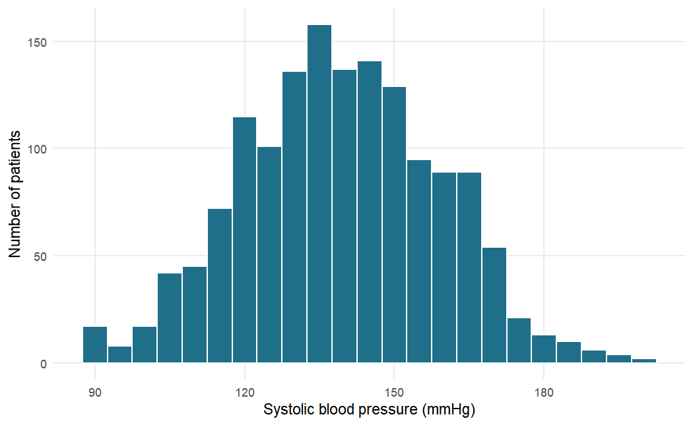
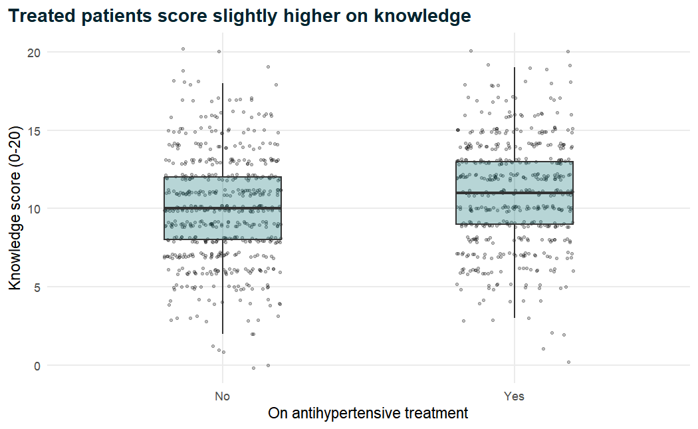
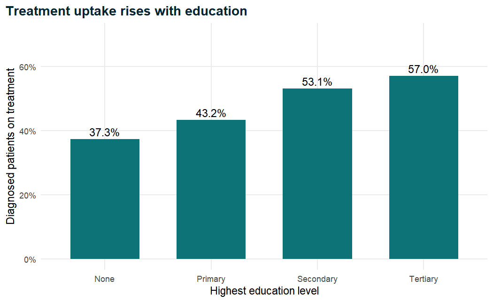
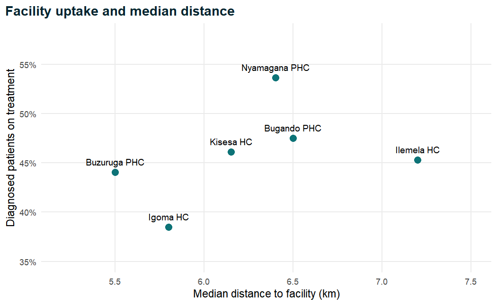
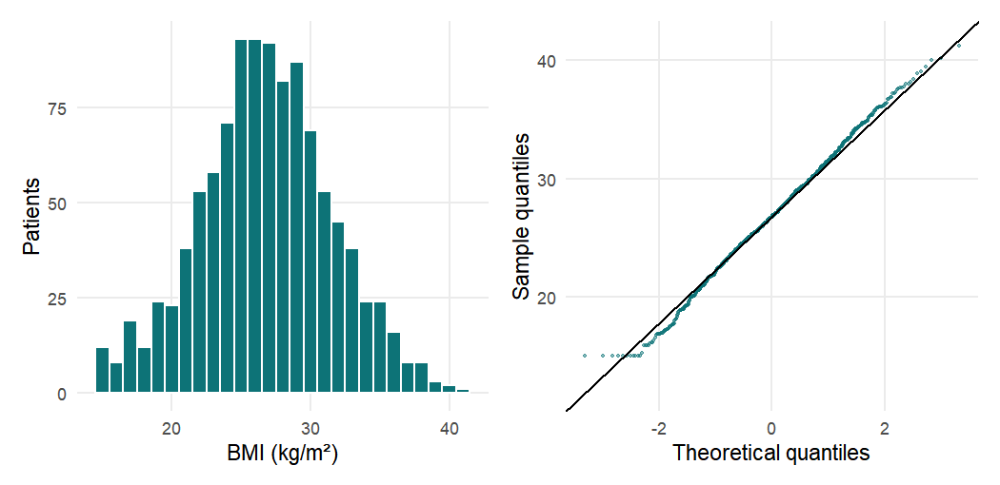

## Chapter 1: Getting Started with R and RStudio


### Exercise 1.1

We store each measurement in an object whose name includes its unit, then write the
formulas in terms of those objects. Height must be converted from centimetres to
metres before squaring.


``` r
weight_kg <- 82
height_cm <- 168
sbp <- 148
dbp <- 96

bmi <- weight_kg / (height_cm / 100)^2
round(bmi, 1)
```

```
#> [1] 29.1
```

``` r
map <- dbp + (sbp - dbp) / 3
round(map, 1)
```

```
#> [1] 113.3
```

``` r
# Without parentheses: ^ is evaluated first, so this is
# weight / (height / 100^2) = 82 / (168 / 10000)
weight_kg / height_cm / 100^2
```

```
#> [1] 4.881e-05
```

The patient's BMI is 29.1 kg/m², just below the conventional threshold for obesity
(30 kg/m²), and the MAP is 113.3 mmHg. Without the parentheses R computes `100^2`
first (exponentiation has the highest priority), then divides from left to right, so
the expression becomes 82 / 168 / 10,000, a meaningless number close to zero. No
error message warns you: wrong parentheses produce wrong numbers silently.

### Exercise 1.2


``` r
dbp <- c(88, 92, 79, 101, 95, NA, 84, 90)
length(dbp)
```

```
#> [1] 8
```

``` r
mean(dbp)                  # NA: one value is unknown
```

```
#> [1] NA
```

``` r
mean(dbp, na.rm = TRUE)    # mean of the 7 observed values
```

```
#> [1] 89.86
```

``` r
sum(dbp >= 90, na.rm = TRUE)    # number of readings >= 90
```

```
#> [1] 4
```

``` r
mean(dbp >= 90, na.rm = TRUE)   # proportion of observed readings
```

```
#> [1] 0.5714
```

``` r
dbp[3:5]
```

```
#> [1]  79 101  95
```

``` r
dbp[!is.na(dbp)]
```

```
#> [1]  88  92  79 101  95  84  90
```

The vector has eight elements, one of them missing. Without `na.rm = TRUE`, `mean()`
returns `NA`, because the mean of a set that includes an unknown value is itself
unknown; with it, R averages the seven observed values (89.9 mmHg). Four readings are
at least 90 mmHg, which is 4 of 7 observed readings, or 57%. Note that the comparison
`dbp >= 90` gives `NA` for the missing reading, so `na.rm = TRUE` is needed in `sum()`
and `mean()` too. The logical index `!is.na(dbp)` ("not missing") keeps the seven
observed readings.

### Exercise 1.3


``` r
glucose <- c("5.4", "6.1", "<2.0", "7.3", "999", "4.8")
class(glucose)
```

```
#> [1] "character"
```

``` r
glucose_num <- as.numeric(glucose)
glucose_num
```

```
#> [1]   5.4   6.1    NA   7.3 999.0   4.8
```

``` r
mean(glucose_num, na.rm = TRUE)
```

```
#> [1] 204.5
```

``` r
mean(glucose_num[glucose_num != 999], na.rm = TRUE)
```

```
#> [1] 5.9
```

The vector is character because its values are written in quotation marks; and even
without the quotes, the entry `"<2.0"` could not be a number, so a column containing
it would be read as text. `as.numeric()` converts the digits successfully but turns
`"<2.0"` into `NA` (with the warning "NAs introduced by coercion"), because "less than
2.0" is not a number. That is a loss of information: the result is known to be low,
not unknown. The value 999 is almost certainly a missing-value code, since a fasting
glucose of 999 mmol/L is impossible. Left in, it raises the mean of the five numeric
values to 204.5 mmol/L; without it, the mean of the four real values is 5.9 mmol/L.

### Exercise 1.4


``` r
htn <- read_csv("Data/hypertension_phc_raw.csv")
htn_xl <- read_excel("Data/hypertension_phc_raw.xlsx", sheet = "data")

dim(htn)
```

```
#> [1] 1503   36
```

``` r
dim(htn_xl)
```

```
#> [1] 1503   36
```

``` r
identical(names(htn), names(htn_xl))
```

```
#> [1] TRUE
```

``` r
n_distinct(htn$patient_id)
```

```
#> [1] 1500
```

Both objects have 1,503 rows and 36 columns, with identical column names. The study
enrolled 1,500 patients, and there are exactly 1,500 distinct patient identifiers, so
three identifiers appear twice: the file contains three duplicate records, which must
be removed before analysis (Chapter 2).

### Exercise 1.5


``` r
glimpse(select(htn, age, sbp_mmhg, bmi, sex, facility, education,
               diabetes, treatment_uptake, enroll_date))
```

```
#> Rows: 1,503
#> Columns: 9
#> $ age              <dbl> 74, 56, 54, 33, 86, 70, 45, 59, 46, 61, 70, 56, 45…
#> $ sbp_mmhg         <dbl> 140, 185, 147, 124, 131, 153, 162, 108, 152, 127, …
#> $ bmi              <dbl> 22.6, 26.7, 21.4, 28.4, 21.6, 31.6, NA, 25.2, 33.0…
#> $ sex              <chr> "Female", "Female", "Female", "Female", "Male", "M…
#> $ facility         <chr> "Igoma HC", "Kisesa HC", "Bugando PHC", "Ilemela H…
#> $ education        <chr> "Primary", "Primary", "None", "Primary", "Primary"…
#> $ diabetes         <chr> "No", "No", "No", "No", "0", "No", "0", "No", "0",…
#> $ treatment_uptake <chr> "Yes", "No", "N", "Yes", "No", "No", "1", "No", "0…
#> $ enroll_date      <chr> "01/02/2024", "2024-09-03", "2024-11-26", "2024-10…
```

Numeric (`<dbl>`) variables include `age`, `sbp_mmhg` and `bmi` (also `height_cm`,
`weight_kg` and the laboratory values). Character (`<chr>`) variables include `sex`,
`facility` and `education`. The variables `diabetes` and `treatment_uptake` (and also
`health_insurance`, `family_history_htn` and `htn_diagnosed`) should be Yes/No
factors, but they mix the codes `"Yes"`/`"No"`, `"Y"`/`"N"` and `"1"`/`"0"`; because
`"Yes"` cannot be a number, readr stores the whole column as text. `enroll_date` is
character because its values use different formats (`"01/02/2024"`, `"2024-09-03"`),
so readr could not recognise a single date format and kept the text unchanged.

### Exercise 1.6


``` r
summary(select(htn, sbp_mmhg, dbp_mmhg, height_cm))
```

```
#>     sbp_mmhg      dbp_mmhg       height_cm  
#>  Min.   :  0   Min.   :  5.0   Min.   : 17  
#>  1st Qu.:126   1st Qu.: 79.0   1st Qu.:158  
#>  Median :139   Median : 86.0   Median :164  
#>  Mean   :140   Mean   : 85.9   Mean   :164  
#>  3rd Qu.:153   3rd Qu.: 93.0   3rd Qu.:169  
#>  Max.   :700   Max.   :121.0   Max.   :193
```

``` r
table(htn$diabetes)
```

```
#> 
#>    0    1    N   No    Y  Yes 
#>  230    7  143 1095    4   24
```

``` r
table(htn$htn_diagnosed)
```

```
#> 
#>   0   1   N  No   Y Yes 
#>  73 158  44 296 110 822
```

``` r
sum(is.na(htn$weight_kg))
```

```
#> [1] 45
```

Systolic pressure ranges from 0 to 700 mmHg: both extremes are impossible. Diastolic
pressure ranges from 5 to 121 mmHg; the minimum of 5 mmHg is implausible. Height ranges
from 17 to about 193 cm; 17 cm is impossible for an adult and is probably 170 cm with a
misplaced decimal point. Both `diabetes` and `htn_diagnosed` use six different codes
(`0`, `1`, `N`, `No`, `Y`, `Yes`) for what should be two categories. Finally, 45
values of `weight_kg` are missing.

### Exercise 1.7


``` r
htn |>
  filter(facility == "Nyamagana PHC") |>
  mutate(map_mmhg = round(dbp_mmhg + (sbp_mmhg - dbp_mmhg) / 3, 1)) |>
  select(patient_id, age, sbp_mmhg, dbp_mmhg, map_mmhg) |>
  arrange(desc(map_mmhg)) |>
  head(5)
```

```
#> # A tibble: 5 × 5
#>   patient_id   age sbp_mmhg dbp_mmhg map_mmhg
#>   <chr>      <dbl>    <dbl>    <dbl>    <dbl>
#> 1 PHC-0741      63      171      116    134.3
#> 2 PHC-1014      59      149      119    129  
#> 3 PHC-0810      65      183      102    129  
#> 4 PHC-0701      62      163      110    127.7
#> 5 PHC-1106      53      159      109    125.7
```

``` r
htn |>
  filter(diabetes == "Yes") |>
  count(facility)
```

```
#> # A tibble: 6 × 2
#>   facility          n
#>   <chr>         <int>
#> 1 Bugando PHC       6
#> 2 Buzuruga PHC      3
#> 3 Igoma HC          3
#> 4 Ilemela HC        6
#> 5 Kisesa HC         2
#> 6 Nyamagana PHC     4
```

The highest MAP values at Nyamagana PHC lie between about 126 and 134 mmHg, from
patients with systolic pressures of 149 to 183 mmHg and diastolic pressures above
100 mmHg. These are high but clinically possible (severe hypertension), so unlike an
SBP of 700 mmHg they should not be treated as errors. The second pipeline counts
records whose `diabetes` value is exactly `"Yes"`. Only 24 records in total
are coded `"Yes"`, whereas Exercise 1.6 showed that 11 more are coded `"1"` or `"Y"`,
so a count based on a single spelling underestimates the number of patients with
diabetes by almost a third (24 instead of 35). This is one more reason to
standardise codes before any analysis.

### Exercise 1.8


``` r
ggplot(htn, aes(x = sbp_mmhg)) +
  geom_histogram(binwidth = 10, fill = "#1F6F8B", colour = "white") +
  labs(x = "Systolic blood pressure (mmHg)", y = "Number of patients")
```


``` r
htn_plausible <- htn |>
  filter(sbp_mmhg >= 60, sbp_mmhg <= 260)
nrow(htn) - nrow(htn_plausible)   # records removed
```

```
#> [1] 2
```

``` r
summary(htn_plausible$sbp_mmhg)
```

```
#>    Min. 1st Qu.  Median    Mean 3rd Qu.    Max. 
#>      90     126     139     139     153     201
```


``` r
ggplot(htn_plausible, aes(x = sbp_mmhg)) +
  geom_histogram(binwidth = 5, fill = "#1F6F8B", colour = "white") +
  labs(x = "Systolic blood pressure (mmHg)", y = "Number of patients")
```



In the first histogram the two extreme values force the axis to run from 0 to 700 mmHg,
so the real data occupy a narrow band and their shape is hard to see. Filtering removed
two records (the values 0 and 700 mmHg; no SBP values were missing, so no further rows
were lost). The plausible values form a single-peaked distribution centred near
139 mmHg (median), with most readings between about 100 and 190 mmHg and a slightly
longer tail towards high pressures. The minimum plausible value is 90 mmHg and the maximum
201 mmHg. Just under half of the patients have a systolic pressure of 140 mmHg or
more (the median is 139 mmHg), as expected in a population with many hypertensive patients. In
practice, implausible values should be set to missing in a documented cleaning step
rather than silently filtered out, as shown in Chapter 2.


## Chapter 2: Understanding and Cleaning Clinical Data


The solutions below start either from the raw file or from the clean analysis file,
as each exercise requires. We load the packages and both datasets once.


``` r
library(tidyverse)
library(lubridate)

na_codes <- c("", "NA", "999", "-99")
raw_default  <- read_csv("Data/hypertension_phc_raw.csv")
raw          <- read_csv("Data/hypertension_phc_raw.csv", na = na_codes)
analysis_data <- readRDS("Data/analysis_data.rds")

# The Yes/No helper from Section 2.6
to_yesno <- function(x) {
  x <- str_to_lower(str_trim(as.character(x)))
  case_when(
    x %in% c("yes", "y", "1", "true")  ~ "Yes",
    x %in% c("no",  "n", "0", "false") ~ "No",
    TRUE ~ NA_character_
  )
}
```

### Exercise 2.1

We write a small summary function and apply it to both imports, so that the two rows
of the result are directly comparable.


``` r
# 1-2. Fasting glucose under the two imports
glucose_summary <- function(d) {
  summarise(d,
            mean = mean(fasting_glucose_mmol_l, na.rm = TRUE),
            median = median(fasting_glucose_mmol_l, na.rm = TRUE),
            max = max(fasting_glucose_mmol_l, na.rm = TRUE),
            n_missing = sum(is.na(fasting_glucose_mmol_l)))
}
bind_rows(default = glucose_summary(raw_default),
          declared = glucose_summary(raw), .id = "import")
```

```
#> # A tibble: 2 × 5
#>   import      mean median   max n_missing
#>   <chr>      <dbl>  <dbl> <dbl>     <int>
#> 1 default  32.521     5.4 999          35
#> 2 declared  5.4489    5.4  10.1        75
```

With the default import, the 40 values coded `999` are treated as real glucose
concentrations. The **mean** is the most affected summary: it rises from 5.4 to 32.5
mmol/L, because the mean uses the size of every value and a few enormous values
dominate it. The **maximum** is also wrong (999 instead of 10.1). The **median** is
unchanged at 5.4, because the 40 sentinels, although extreme, are only 2.7 per cent
of the values and do not move the middle of the distribution; this robustness is one
reason medians are preferred for skewed data. The default import reports 35 missing
values and the declared import 75, the difference being the 40 sentinels.

For question 3, we import with only the standard missing codes and convert `999` to
`NA` in the glucose column alone, using `na_if()`.


``` r
# 3. Treat 999 as missing only in the column where it is a sentinel
raw_selective <- read_csv("Data/hypertension_phc_raw.csv",
                          na = c("", "NA")) |>
  mutate(fasting_glucose_mmol_l = na_if(fasting_glucose_mmol_l, 999))

sum(is.na(raw_selective$fasting_glucose_mmol_l))
```

```
#> [1] 75
```

``` r
max(raw_selective$creatinine_umol_l)   # creatinine untouched
```

```
#> [1] 141
```

Glucose now has the same 75 missing values as before, while creatinine is untouched
(its maximum, 141 µmol/L, shows no column was altered by mistake; in a dataset where
creatinine genuinely reached 999 it would be kept). This selective approach is the
safe default whenever a code could be real in some columns.


### Exercise 2.2

We list the repeated IDs, show their records with `janitor::get_dupes()`, and compare
the number of exact duplicate rows with the number of surplus IDs.


``` r
# 1. IDs that occur more than once, and their records
raw |> count(patient_id) |> filter(n > 1)
```

```
#> # A tibble: 3 × 2
#>   patient_id     n
#>   <chr>      <int>
#> 1 PHC-0011       2
#> 2 PHC-0251       2
#> 3 PHC-0881       2
```

``` r
janitor::get_dupes(raw, patient_id) |>
  select(patient_id, dupe_count, facility, age, sex, sbp_mmhg)
```

```
#> # A tibble: 6 × 6
#>   patient_id dupe_count facility      age sex    sbp_mmhg
#>   <chr>           <int> <chr>       <dbl> <chr>     <dbl>
#> 1 PHC-0011            2 Ilemela HC     51 Male        128
#> 2 PHC-0011            2 Ilemela HC     51 Male        128
#> 3 PHC-0251            2 Bugando PHC    51 Female      131
#> 4 PHC-0251            2 Bugando PHC    51 Female      131
#> 5 PHC-0881            2 Kisesa HC      45 Female      140
#> 6 PHC-0881            2 Kisesa HC      45 Female      140
```

``` r
# 2. Exact duplicates versus surplus IDs
sum(duplicated(raw))
```

```
#> [1] 3
```

``` r
nrow(raw) - n_distinct(raw$patient_id)
```

```
#> [1] 3
```

Three IDs (`PHC-0011`, `PHC-0251` and `PHC-0881`) occur twice, and `get_dupes()` shows
the two records of each side by side, with a `dupe_count` column. There are 3 exact
duplicate rows and 3 surplus IDs (1,503 rows minus 1,500 distinct IDs). Because the two
numbers agree, every repeated ID is an exact copy, and there are no conflicting records
that would need checking against source documents.

A suitable sentence for a methods section: *"The raw dataset contained 1,503 records;
three were exact duplicates of other records (identical in all variables) and were
removed, leaving 1,500 participants with unique identifiers."*


### Exercise 2.3

We tabulate the raw codes, then apply the helper after removing duplicates and check
the mapping with a cross-tabulation of old against new values.


``` r
# 1. Codes used before cleaning
table(raw$health_insurance, useNA = "ifany")
```

```
#> 
#>   0   1   N  No   Y Yes 
#> 150  70  97 743  49 394
```

``` r
table(raw$htn_diagnosed, useNA = "ifany")
```

```
#> 
#>   0   1   N  No   Y Yes 
#>  73 158  44 296 110 822
```

``` r
# 2. Apply the helper and check the mapping
clean_bin <- distinct(raw) |>
  mutate(health_insurance_new = to_yesno(health_insurance),
         htn_diagnosed_new = to_yesno(htn_diagnosed))

table(before = clean_bin$health_insurance,
      after = clean_bin$health_insurance_new)
```

```
#>       after
#> before  No Yes
#>    0   150   0
#>    1     0  70
#>    N    96   0
#>    No  742   0
#>    Y     0  49
#>    Yes   0 393
```

``` r
table(before = clean_bin$htn_diagnosed,
      after = clean_bin$htn_diagnosed_new)
```

```
#>       after
#> before  No Yes
#>    0    73   0
#>    1     0 158
#>    N    43   0
#>    No  295   0
#>    Y     0 110
#>    Yes   0 821
```

Both variables use six codes: `0`/`1`, `N`/`Y` and `No`/`Yes`. The cross-tabulations
show that every code maps to exactly one clean value (all the `0`, `N` and `No` codes to
"No" and all the `1`, `Y` and `Yes` codes to "Yes") and that no value became missing.
The counts are slightly smaller than in the first two tables because the three duplicate
records have been removed.


``` r
# 3. Proportions in the clean data
analysis_data |>
  summarise(insured_pct = round(100 * mean(health_insurance == "Yes"), 1),
            diagnosed_pct = round(100 * mean(htn_diagnosed == "Yes"), 1))
```

```
#> # A tibble: 1 × 2
#>   insured_pct diagnosed_pct
#>         <dbl>         <dbl>
#> 1        34.1          72.6
```

In the clean data, 34.1 per cent of patients have health insurance and 72.6 per cent
(1,089 of 1,500) have been diagnosed with hypertension. Because `health_insurance` and
`htn_diagnosed` have no missing values, `mean(x == "Yes")` gives the proportion directly;
with missing values you would need `na.rm = TRUE` and should report the denominator.


### Exercise 2.4

Cross-variable checks compare variables that must stand in a fixed relationship to
each other.


``` r
# 1. Diastolic at least as high as systolic
analysis_data |>
  summarise(dbp_ge_sbp = sum(dbp_mmhg >= sbp_mmhg, na.rm = TRUE))
```

```
#> # A tibble: 1 × 1
#>   dbp_ge_sbp
#>        <int>
#> 1         11
```

``` r
# 2. Pulse pressure
analysis_data <- analysis_data |>
  mutate(pulse_pressure = sbp_mmhg - dbp_mmhg)
summary(analysis_data$pulse_pressure)
```

```
#>    Min. 1st Qu.  Median    Mean 3rd Qu.    Max.     NAs 
#>   -18.0    39.0    53.0    53.3    68.0   129.0       3
```

``` r
sum(analysis_data$pulse_pressure < 20, na.rm = TRUE)
```

```
#> [1] 92
```

Eleven patients have a diastolic pressure equal to or higher than their systolic
pressure. That is not physiologically possible for a correctly measured brachial blood
pressure: systolic pressure is, by definition, the peak pressure of the cardiac cycle.
These records have each passed the single-variable range checks, which is exactly why
cross-variable checks are needed. The pulse pressure summary confirms the problem from a
different angle: the minimum is -18 mmHg. A further 92 patients have a pulse pressure
below 20 mmHg, which is unusual (normal pulse pressure is around 40 mmHg) and might
reflect transposed or mistyped readings. In a real study these records would be queried
with the facilities. The data in this book are simulated and the readings are left
unchanged in `analysis_data`, but if you were cleaning these data for publication you
would add a rule (for example, setting both pressures to `NA` when diastolic is at least
systolic) to the cleaning script and report it.


``` r
# 3. Consistency rules from the data dictionary
analysis_data |>
  group_by(htn_diagnosed) |>
  summarise(n = n(),
            min_months = min(months_since_diagnosis),
            max_months = max(months_since_diagnosis))
```

```
#> # A tibble: 2 × 4
#>   htn_diagnosed     n min_months max_months
#>   <fct>         <int>      <dbl>      <dbl>
#> 1 No              411          0          0
#> 2 Yes            1089          1        119
```

``` r
analysis_data |>
  count(treatment_uptake, adherence_recorded = !is.na(adherence))
```

```
#> # A tibble: 2 × 3
#>   treatment_uptake adherence_recorded     n
#>   <fct>            <lgl>              <int>
#> 1 No               FALSE                992
#> 2 Yes              TRUE                 508
```

Both rules hold. All 411 patients who are not diagnosed have
`months_since_diagnosis` equal to 0, and the 1,089 diagnosed patients have values from
1 to 119 months. Adherence is recorded for all 508 treated patients and for none of the
992 untreated patients.


### Exercise 2.5

Adding `right = FALSE` makes each interval include its lower limit, for example
`[18.5, 25)`, which matches the WHO definition.


``` r
# 1. WHO-consistent categories: intervals closed on the left
analysis_data <- analysis_data |>
  mutate(bmi_cat_who = cut(bmi,
                           breaks = c(-Inf, 18.5, 25, 30, Inf),
                           labels = c("Underweight", "Normal",
                                      "Overweight", "Obese"),
                           right = FALSE))

# 2. Compare the two versions
table(default = analysis_data$bmi_cat, who = analysis_data$bmi_cat_who)
```

```
#>              who
#> default       Underweight Normal Overweight Obese
#>   Underweight          82      2          0     0
#>   Normal                0    466         10     0
#>   Overweight            0      0        568     9
#>   Obese                 0      0          0   316
```

``` r
analysis_data |>
  filter(bmi_cat != bmi_cat_who) |>
  count(bmi, bmi_cat, bmi_cat_who)
```

```
#> # A tibble: 3 × 4
#>     bmi bmi_cat     bmi_cat_who     n
#>   <dbl> <fct>       <fct>       <int>
#> 1  18.5 Underweight Normal          2
#> 2  25   Normal      Overweight     10
#> 3  30   Overweight  Obese           9
```

The cross-tabulation is almost diagonal: 21 patients change category, all of them
moving one category up. The second table shows why: they are exactly the patients
whose BMI, rounded to one decimal place, sits on a cut-point. Two patients with a BMI
of 18.5 move from "Underweight" to "Normal", ten with a BMI of 25.0 from "Normal" to
"Overweight" and nine with a BMI of 30.0 from "Overweight" to "Obese". The difference
is small here, but in a study reporting the prevalence of obesity it would change the
estimate, and it would make the results disagree with studies that applied the WHO
definition correctly.


``` r
# 3. Age groups, checked against age
analysis_data <- analysis_data |>
  mutate(age_group = cut(age, breaks = c(18, 40, 60, Inf),
                         labels = c("18-39", "40-59", "60+"),
                         right = FALSE))

analysis_data |>
  group_by(age_group) |>
  summarise(n = n(), min_age = min(age), max_age = max(age))
```

```
#> # A tibble: 4 × 4
#>   age_group     n min_age max_age
#>   <fct>     <int>   <dbl>   <dbl>
#> 1 18-39       274      18      39
#> 2 40-59       772      40      59
#> 3 60+         452      60      95
#> 4 <NA>          2      NA      NA
```

The same `right = FALSE` idea defines age groups whose labels mean what they say:
`[18, 40)` is 18 to 39 years. The minimum and maximum ages within each group confirm the
definition (18–39, 40–59 and 60–95), and the two patients whose age was set to missing
during validation correctly have a missing age group.


### Exercise 2.6

Regular expressions describe each format: `\\d{4}` (with the backslash doubled inside an R
string) is four digits and `[A-Za-z]{3}` three letters; `^` and `$` anchor the pattern to the start and end of the value.


``` r
# 1. Count each date format
dates <- distinct(raw)$enroll_date
c(iso = sum(str_detect(dates, "^\\d{4}-\\d{2}-\\d{2}$")),
  slash = sum(str_detect(dates, "^\\d{2}/\\d{2}/\\d{4}$")),
  month_name = sum(str_detect(dates, "^\\d{2}-[A-Za-z]{3}-\\d{4}$")))
```

```
#>        iso      slash month_name 
#>       1050        347        103
```

``` r
# 2. Month-first interpretation of the slash format
wrong <- parse_date_time(dates, orders = c("ymd", "mdy", "d-b-Y")) |>
  as_date()
sum(is.na(wrong))                                  # failures
```

```
#> [1] 221
```

``` r
sum(wrong != analysis_data$enroll_date, na.rm = TRUE) # silently different
```

```
#> [1] 137
```

The three formats account for all 1,500 dates (1,050 + 347 + 103). With month-first
parsing of the slash format, 221 dates fail to parse: they have a first number greater
than 12 (such as `18/02/2024`), which cannot be a month. That failure is at least
visible. More dangerous are the 137 dates that parse successfully but differ from the
correct dates. Most of them (115) are slash dates in which both numbers are 12 or less,
so that `01/02/2024` becomes 2 January instead of 1 February; the remaining 22 are
month-name dates that `parse_date_time()` matched to a different order once the
order list changed. Without a comparison against the correctly parsed dates, none of
these 137 errors would have been noticed. This is why the order must be chosen from
knowledge of the data, and why the result must be checked.


``` r
# 3. Enrolments per quarter
analysis_data |>
  mutate(enroll_quarter = quarter(enroll_date)) |>
  count(enroll_quarter)
```

```
#> # A tibble: 4 × 2
#>   enroll_quarter     n
#>            <int> <int>
#> 1              1   392
#> 2              2   412
#> 3              3   421
#> 4              4   275
```

Enrolment was evenly spread over the first three quarters (392 to 421 patients) and
lower in the fourth quarter (275), because recruitment ended on 2 December.


### Exercise 2.7

We create a missingness indicator and compare it across groups of observed variables.


``` r
analysis_data <- analysis_data |>
  mutate(chol_missing = is.na(total_chol_mmol_l))

# 1. Percentage missing by diagnosis and by residence
analysis_data |>
  group_by(htn_diagnosed) |>
  summarise(n = n(), pct_missing = round(100 * mean(chol_missing), 1))
```

```
#> # A tibble: 2 × 3
#>   htn_diagnosed     n pct_missing
#>   <fct>         <int>       <dbl>
#> 1 No              411         3.9
#> 2 Yes            1089         6.8
```

``` r
analysis_data |>
  group_by(residence) |>
  summarise(n = n(), pct_missing = round(100 * mean(chol_missing), 1))
```

```
#> # A tibble: 2 × 3
#>   residence     n pct_missing
#>   <fct>     <int>       <dbl>
#> 1 Rural       703         5.4
#> 2 Urban       797         6.5
```

``` r
# 2. Mean age by missingness
analysis_data |>
  group_by(chol_missing) |>
  summarise(n = n(), mean_age = round(mean(age, na.rm = TRUE), 1))
```

```
#> # A tibble: 2 × 3
#>   chol_missing     n mean_age
#>   <lgl>        <int>    <dbl>
#> 1 FALSE         1410     52  
#> 2 TRUE            90     55.9
```

Cholesterol is missing for 6.8 per cent of diagnosed patients and 3.9 per cent of
undiagnosed patients, and for 6.5 per cent of urban and 5.4 per cent of rural residents.
Patients with missing cholesterol are on average about four years older (55.9 versus
52.0 years). The differences are modest, and Chapter 4 shows how to test whether
differences of this size could be due to chance, but they point in a consistent
direction: missingness appears to be related to observed characteristics (diagnosis,
age). If so, the data are not MCAR, and an analysis restricted to patients with a
cholesterol result would slightly over-represent younger, undiagnosed patients. MAR,
with missingness depending on age and diagnosis, is a more plausible working
assumption, and any analysis using cholesterol should at least include these variables
in the model or in an imputation model.

The data cannot tell us whether cholesterol is MNAR. That would require knowing whether
patients with missing values tend to have higher or lower cholesterol than observed
patients of the same age and diagnosis, and their cholesterol is precisely what we do
not observe. Judgements about MNAR rest on knowledge of how the data were collected
(for example, whether blood was drawn only from patients who looked unwell) and are
explored with sensitivity analyses. Because these data are simulated, the pattern
illustrates the reasoning rather than a real clinical finding.


### Exercise 2.8

The function collects the steps of the chapter in the same order. It relies on the
`to_yesno()` helper defined at the top of this appendix; in a real project you would
keep both functions in the same script file.


``` r
clean_htn <- function(path) {
  # Import with missing-value codes; remove exact duplicates; trim text
  dat <- read_csv(path, na = c("", "NA", "999", "-99"),
                  show_col_types = FALSE) |>
    distinct() |>
    mutate(across(where(is.character), str_trim))

  # Categories: sex and the Yes/No variables
  dat <- dat |>
    mutate(
      sex = case_when(
        str_to_lower(sex) %in% c("female", "f") ~ "Female",
        str_to_lower(sex) %in% c("male", "m")   ~ "Male",
        TRUE ~ NA_character_),
      across(c(diabetes, family_history_htn, health_insurance,
               htn_diagnosed, treatment_uptake), to_yesno)
    )

  # Validation: impossible values become NA
  dat <- dat |>
    mutate(
      age       = if_else(between(age, 18, 110), age, NA_real_),
      sbp_mmhg  = if_else(between(sbp_mmhg, 70, 260), sbp_mmhg, NA_real_),
      dbp_mmhg  = if_else(between(dbp_mmhg, 40, 150), dbp_mmhg, NA_real_),
      height_cm = if_else(between(height_cm, 120, 210), height_cm, NA_real_),
      weight_kg = if_else(between(weight_kg, 30, 200), weight_kg, NA_real_)
    )

  # Derived variables and dates
  dat <- dat |>
    mutate(
      bmi = round(weight_kg / (height_cm / 100)^2, 1),
      bmi_cat = cut(bmi, breaks = c(-Inf, 18.5, 25, 30, Inf),
                    labels = c("Underweight", "Normal",
                               "Overweight", "Obese")),
      bp_category = case_when(
        is.na(sbp_mmhg) | is.na(dbp_mmhg) ~ NA_character_,
        sbp_mmhg >= 140 | dbp_mmhg >= 90  ~ "Hypertension",
        sbp_mmhg >= 130 | dbp_mmhg >= 80  ~ "Elevated",
        TRUE                              ~ "Normal"),
      enroll_date = as_date(parse_date_time(
        enroll_date, orders = c("ymd", "dmy", "d-b-Y")))
    )

  # Factors with deliberate levels
  yn <- c("No", "Yes")
  dat <- dat |>
    mutate(
      facility = factor(facility),
      sex = factor(sex, levels = c("Female", "Male")),
      residence = factor(residence, levels = c("Rural", "Urban")),
      education = factor(education, ordered = TRUE,
                         levels = c("None", "Primary", "Secondary",
                                    "Tertiary")),
      occupation = factor(occupation),
      marital_status = factor(marital_status),
      physical_activity = factor(physical_activity, ordered = TRUE,
                                 levels = c("Low", "Moderate", "High")),
      smoking = factor(smoking, levels = c("Never", "Former", "Current")),
      alcohol = factor(alcohol, levels = c("None", "Moderate", "Heavy")),
      bp_category = factor(bp_category,
                           levels = c("Normal", "Elevated", "Hypertension")),
      health_insurance = factor(health_insurance, levels = yn),
      family_history_htn = factor(family_history_htn, levels = yn),
      diabetes = factor(diabetes, levels = yn),
      htn_diagnosed = factor(htn_diagnosed, levels = yn),
      treatment_uptake = factor(treatment_uptake, levels = yn),
      adherence = factor(na_if(adherence, ""), levels = c("Poor", "Good")),
      bp_controlled = factor(na_if(bp_controlled, ""), levels = yn)
    )

  # Assertions: fail loudly if a new problem appears
  stopifnot(
    n_distinct(dat$patient_id) == nrow(dat),
    !anyNA(dat$sex),
    !anyNA(dat$enroll_date),
    !anyNA(dat$treatment_uptake),
    all(between(dat$sbp_mmhg, 70, 260), na.rm = TRUE)
  )
  dat
}

my_clean <- clean_htn("Data/hypertension_phc_raw.csv")
all.equal(my_clean, readRDS("Data/analysis_data.rds"))
```

```
#> [1] TRUE
```

`all.equal()` returns `TRUE`: the function reproduces the analysis dataset exactly.
The assertions at the end check that the patient ID is unique, that sex, enrolment date
and the outcome have no missing values, and that systolic pressures are in range; if a
future version of the raw file contained, say, a new spelling of sex or a new date
format, the function would stop with an error naming the failed condition instead of
returning quietly flawed data.

A function is more useful than a long script when a corrected raw file arrives for three
reasons. It can be rerun on the new file with one line, without editing anything.
It can be applied to several files (for example, an interim and a final data export) and
the results compared. And because everything happens inside the function, no
intermediate objects are left in the workspace to be confused with the clean data.
Packaging a cleaning pipeline as a function is a small step towards the reproducible
workflows recommended by @wilson2017.


## Chapter 3: Descriptive Statistics, Tables and Figures


All solutions start from the clean analysis file and, where the outcome is involved, from
the population of diagnosed patients.


``` r
analysis_data <- readRDS("Data/analysis_data.rds")
diagnosed <- analysis_data |> filter(htn_diagnosed == "Yes")
teal <- "#0D7377"
```

### Exercise 3.1

We compute the four statistics for each variable, together with the number of missing
values.


``` r
analysis_data |>
  select(age, distance_to_facility_km) |>
  pivot_longer(everything(), names_to = "variable", values_to = "value") |>
  group_by(variable) |>
  summarise(
    missing = sum(is.na(value)),
    mean    = mean(value, na.rm = TRUE),
    sd      = sd(value, na.rm = TRUE),
    median  = median(value, na.rm = TRUE),
    iqr     = IQR(value, na.rm = TRUE)
  ) |>
  kable(digits = 2, caption = "Summaries of age and distance to the facility.")
```


Table: Summaries of age and distance to the facility.

|variable                | missing|  mean|    sd| median|  iqr|
|:-----------------------|-------:|-----:|-----:|------:|----:|
|age                     |       2| 52.28| 14.10|  52.00| 19.0|
|distance_to_facility_km |      60|  7.82|  6.09|   6.45|  6.3|

Age has 2 missing values and distance 60. For **age**, the mean (52.3 years) and median (52
years) almost coincide and the SD (14.1) is small relative to the mean, so the distribution
is roughly symmetric: report **mean (SD)**, 52.3 (14.1) years. For **distance**, the mean
(7.8 km) is well above the median (6.45 km) and the SD (6.1 km) is close to the mean of a
variable that cannot be negative, the signature of right skew (see the histogram in Section
3.5): report **median (IQR)**: 6.45 km (IQR 4.0 to 10.3 km, an interquartile range of 6.3 km).

### Exercise 3.2


``` r
ldl <- analysis_data$ldl_mmol_l

mean(ldl)                                   # the na.rm trap: NA
```

```
#> [1] NA
```

``` r
c(n_valid   = sum(!is.na(ldl)),
  n_missing = sum(is.na(ldl)),
  pct_miss  = 100 * mean(is.na(ldl)),
  mean      = mean(ldl, na.rm = TRUE),
  sd        = sd(ldl, na.rm = TRUE),
  cv_pct    = 100 * sd(ldl, na.rm = TRUE) / mean(ldl, na.rm = TRUE)) |>
  round(2)
```

```
#>   n_valid n_missing  pct_miss      mean        sd    cv_pct 
#>   1395.00    105.00      7.00      2.70      1.03     38.26
```

Without `na.rm = TRUE`, `mean()` returns `NA` because 105 LDL values (7.0%) are missing.
Among the 1,395 patients with a result, mean LDL cholesterol was 2.70 mmol/L with SD 1.03
mmol/L, a coefficient of variation of about 38%, so LDL is relatively more variable than
total cholesterol (CV about 19%). A sentence for a paper: *"LDL cholesterol was available for
1,395 of 1,500 participants (93.0%); mean 2.70 mmol/L (SD 1.03)."*

### Exercise 3.3


``` r
table(analysis_data$smoking, useNA = "ifany")
```

```
#> 
#>   Never  Former Current    <NA> 
#>     899     295     261      45
```

``` r
table(analysis_data$bp_category, useNA = "ifany")
```

```
#> 
#>       Normal     Elevated Hypertension         <NA> 
#>          144          357          996            3
```


``` r
analysis_data |>
  tabyl(smoking) |>
  adorn_pct_formatting(digits = 1)
```

```
#>  smoking   n percent valid_percent
#>    Never 899   59.9%         61.8%
#>   Former 295   19.7%         20.3%
#>  Current 261   17.4%         17.9%
#>     <NA>  45    3.0%             -
```

``` r
analysis_data |>
  tabyl(bp_category) |>
  adorn_pct_formatting(digits = 1)
```

```
#>   bp_category   n percent valid_percent
#>        Normal 144    9.6%          9.6%
#>      Elevated 357   23.8%         23.8%
#>  Hypertension 996   66.4%         66.5%
#>          <NA>   3    0.2%             -
```

Smoking status is missing for 45 patients and blood-pressure category for 3. There are 261
current smokers: (a) 17.4% of all 1,500 patients (`percent`), and (b) 17.9% of the 1,455 with
known smoking status (`valid_percent`). The difference is small here because only 3% are
missing, but the denominator should always be stated.

### Exercise 3.4


``` r
ins_tab <- table(Insurance = diagnosed$health_insurance,
                 Treated   = diagnosed$treatment_uptake)
addmargins(ins_tab)
```

```
#>          Treated
#> Insurance   No  Yes  Sum
#>       No   419  306  725
#>       Yes  162  202  364
#>       Sum  581  508 1089
```

``` r
round(100 * prop.table(ins_tab, margin = 1), 1)   # row % (within insurance)
```

```
#>          Treated
#> Insurance   No  Yes
#>       No  57.8 42.2
#>       Yes 44.5 55.5
```

``` r
round(100 * prop.table(ins_tab, margin = 2), 1)   # column % (within uptake)
```

```
#>          Treated
#> Insurance   No  Yes
#>       No  72.1 60.2
#>       Yes 27.9 39.8
```

Among the 364 insured diagnosed patients, 55.5% were on treatment, compared with 42.2% of the
725 uninsured. These are the **row percentages**, computed within categories of the
explanatory variable (insurance). They answer the question "is insurance associated with
uptake?" directly, because they compare the outcome between the exposure groups. The column
percentages (39.8% of treated and 27.9% of untreated patients were insured) describe the
make-up of the outcome groups, which is what a Table 1 by treatment uptake shows, but they do
not state the uptake rate in each insurance group.

### Exercise 3.5


``` r
diagnosed |>
  group_by(treatment_uptake) |>
  summarise(
    n     = sum(!is.na(sbp_mmhg)),
    mean  = mean(sbp_mmhg, na.rm = TRUE),
    sd    = sd(sbp_mmhg, na.rm = TRUE),
    se    = sd / sqrt(n),
    lower = mean - qt(0.975, n - 1) * se,
    upper = mean + qt(0.975, n - 1) * se
  ) |>
  kable(digits = 2, caption = "Mean SBP (mmHg) with 95% CI by uptake.")
```


Table: Mean SBP (mmHg) with 95% CI by uptake.

|treatment_uptake |   n|  mean|    sd|   se| lower| upper|
|:----------------|---:|-----:|-----:|----:|-----:|-----:|
|No               | 581| 142.2| 19.81| 0.82| 140.6| 143.8|
|Yes              | 507| 148.1| 18.34| 0.81| 146.5| 149.7|


``` r
diagnosed |>
  group_by(residence) |>
  summarise(n = n(), treated = sum(treatment_uptake == "Yes")) |>
  mutate(pct   = 100 * treated / n,
         se    = sqrt((pct / 100) * (1 - pct / 100) / n),
         lower = pct - 100 * 1.96 * se,
         upper = pct + 100 * 1.96 * se) |>
  select(-se) |>
  kable(digits = 1, caption = "Treatment uptake (%) with 95% CI by residence.")
```


Table: Treatment uptake (%) with 95% CI by residence.

|residence |   n| treated|  pct| lower| upper|
|:---------|---:|-------:|----:|-----:|-----:|
|Rural     | 501|     195| 38.9|  34.7|  43.2|
|Urban     | 588|     313| 53.2|  49.2|  57.3|

Untreated diagnosed patients had mean SBP 142.2 mmHg (95% CI about 140.6 to 143.8) and treated
patients 148.1 mmHg (about 146.5 to 149.7). Uptake was 38.9% (95% CI about 34.7% to 43.2%)
among rural and 53.2% (about 49.2% to 57.3%) among urban diagnosed patients; the intervals do
not overlap, suggesting a real difference that Chapter 4 will test formally.

The **SD** (about 18 to 20 mmHg) measures how much individual patients' SBP varies around
their group mean; it would stay about the same if we recruited more patients. The **SE**
(about 0.8 mmHg) measures how precisely each group *mean* is estimated; it is the SD divided
by $\sqrt{n}$ and would shrink with a larger sample. The SD describes patients, the SE
describes the uncertainty of an estimate.

### Exercise 3.6


``` r
diagnosed |>
  select(age, sex, residence, education, health_insurance,
         family_history_htn, knowledge_score, comorbidity_count,
         treatment_uptake) |>
  tbl_summary(
    by = treatment_uptake,
    type = comorbidity_count ~ "continuous",   # treat the count as numeric
    statistic = list(
      c(age, knowledge_score) ~ "{mean} ({sd})",
      comorbidity_count ~ "{median} ({p25}, {p75})",
      all_categorical() ~ "{n} ({p}%)"
    ),
    digits = list(c(age, knowledge_score) ~ 1, comorbidity_count ~ 0),
    label = list(
      age ~ "Age, years",
      sex ~ "Sex",
      residence ~ "Residence",
      education ~ "Education",
      health_insurance ~ "Health insurance",
      family_history_htn ~ "Family history of hypertension",
      knowledge_score ~ "Knowledge score (0-20)",
      comorbidity_count ~ "Number of comorbidities"
    ),
    missing = "ifany",
    missing_text = "Missing"
  ) |>
  add_overall(last = FALSE) |>
  modify_header(label = "**Characteristic**") |>
  as_kable(caption = "Diagnosed patients by treatment uptake.")
```


Table: Diagnosed patients by treatment uptake.

|**Characteristic**             | **Overall**  N = 1,089 | **No**  N = 581 | **Yes**  N = 508 |
|:------------------------------|:----------------------:|:---------------:|:----------------:|
|Age, years                     |      53.5 (14.0)       |   51.1 (13.4)   |   56.3 (14.1)    |
|Missing                        |           1            |        1        |        0         |
|Sex                            |                        |                 |                  |
|Female                         |       629 (58%)        |    315 (54%)    |    314 (62%)     |
|Male                           |       460 (42%)        |    266 (46%)    |    194 (38%)     |
|Residence                      |                        |                 |                  |
|Rural                          |       501 (46%)        |    306 (53%)    |    195 (38%)     |
|Urban                          |       588 (54%)        |    275 (47%)    |    313 (62%)     |
|Education                      |                        |                 |                  |
|None                           |       201 (19%)        |    126 (22%)    |     75 (15%)     |
|Primary                        |       444 (42%)        |    252 (44%)    |    192 (39%)     |
|Secondary                      |       292 (27%)        |    137 (24%)    |    155 (31%)     |
|Tertiary                       |       128 (12%)        |    55 (9.6%)    |     73 (15%)     |
|Missing                        |           24           |       11        |        13        |
|Health insurance               |       364 (33%)        |    162 (28%)    |    202 (40%)     |
|Family history of hypertension |       394 (36%)        |    183 (31%)    |    211 (42%)     |
|Knowledge score (0-20)         |       10.4 (3.5)       |    9.9 (3.4)    |    10.9 (3.4)    |
|Missing                        |           29           |       16        |        13        |
|Number of comorbidities        |        0 (0, 1)        |    0 (0, 1)     |     0 (0, 1)     |

Without `type = comorbidity_count ~ "continuous"`, gtsummary would treat a count with only
four distinct values as categorical and show n (%) for each value, which is in fact a
perfectly good alternative here: the median (IQR) of 0 (0, 1) is identical in both groups and
hides any difference.

Two characteristics that differ: treated patients were **older** (mean about 56 versus 51
years) and more often had a **family history of hypertension** (about 42% versus 31%); they
were also more often insured, urban and better educated, and had a slightly higher knowledge
score. These differences are clinically plausible: older patients and those with a family
history are more likely to be recognised as high-risk and started on treatment, and
insurance, education and knowledge plausibly lower the financial and informational barriers
to care. They are unadjusted, descriptive differences in simulated data, to be examined with
tests (Chapter 4) and multivariable models (Chapter 5).

### Exercise 3.7


``` r
ggplot(diagnosed, aes(x = treatment_uptake, y = knowledge_score)) +
  geom_jitter(width = 0.2, height = 0.2, alpha = 0.25, size = 0.8,
              na.rm = TRUE) +
  geom_boxplot(width = 0.4, outlier.shape = NA, fill = teal, alpha = 0.3,
               na.rm = TRUE) +
  labs(title = "Treated patients score slightly higher on knowledge",
       x = "On antihypertensive treatment", y = "Knowledge score (0-20)")
```



The knowledge score is an integer, so a small vertical jitter (`height = 0.2`) stops patients
with the same score from being drawn on top of each other. The median score is 11 among
treated and 10 among untreated patients, but the two distributions overlap almost entirely.


``` r
diagnosed |>
  filter(!is.na(education)) |>
  group_by(education) |>
  summarise(pct = mean(treatment_uptake == "Yes")) |>
  ggplot(aes(x = education, y = pct)) +
  geom_col(fill = teal, width = 0.65) +
  geom_text(aes(label = percent(pct, accuracy = 0.1)), vjust = -0.4) +
  scale_y_continuous(labels = label_percent(), limits = c(0, 0.7)) +
  labs(title = "Treatment uptake rises with education",
       x = "Highest education level", y = "Diagnosed patients on treatment")
```



Because `education` is an ordered factor, the bars appear from none to tertiary without extra
code. Uptake rises from about 37% among patients with no schooling to about 57% among those
with tertiary education, a gradient consistent with education easing access to and use of
care. A bar chart is appropriate here because each bar is a *percentage*, whose length from
zero is meaningful.

### Exercise 3.8


``` r
facility_summary <- diagnosed |>
  group_by(facility) |>
  summarise(
    n           = n(),
    treated     = sum(treatment_uptake == "Yes"),
    median_dist = median(distance_to_facility_km, na.rm = TRUE),
    pct_insured = 100 * mean(health_insurance == "Yes")
  ) |>
  rowwise() |>                                   # one prop.test() per facility
  mutate(
    ci    = list(prop.test(treated, n, correct = FALSE)$conf.int),
    pct   = 100 * treated / n,
    lower = 100 * ci[1],
    upper = 100 * ci[2]
  ) |>
  ungroup() |>
  select(facility, n, pct, lower, upper, median_dist, pct_insured) |>
  arrange(desc(pct))

facility_summary |>
  kable(digits = 1,
        caption = "Uptake (%, Wilson 95% CI) and access by facility.")
```


Table: Uptake (%, Wilson 95% CI) and access by facility.

|facility      |   n|  pct| lower| upper| median_dist| pct_insured|
|:-------------|---:|----:|-----:|-----:|-----------:|-----------:|
|Nyamagana PHC | 220| 53.6|  47.0|  60.1|         6.4|        36.8|
|Bugando PHC   | 259| 47.5|  41.5|  53.6|         6.5|        34.0|
|Kisesa HC     | 154| 46.1|  38.4|  54.0|         6.2|        33.1|
|Ilemela HC    | 192| 45.3|  38.4|  52.4|         7.2|        35.9|
|Buzuruga PHC  | 134| 44.0|  35.9|  52.5|         5.5|        26.1|
|Igoma HC      | 130| 38.5|  30.5|  47.0|         5.8|        30.8|


``` r
ggplot(facility_summary, aes(x = median_dist, y = pct / 100)) +
  geom_point(size = 3, colour = teal) +
  geom_text(aes(label = facility), vjust = -1, size = 3.2) +
  scale_y_continuous(labels = label_percent(), limits = c(0.35, 0.58)) +
  scale_x_continuous(limits = c(5.2, 7.5)) +
  labs(title = "Facility uptake and median distance",
       x = "Median distance to facility (km)",
       y = "Diagnosed patients on treatment")
```



`rowwise()` makes `mutate()` work one facility at a time, so `prop.test()` receives that
facility's counts; the Wilson interval is stored as a list column and then split into its
lower and upper limits. Uptake ranges from 38.5% (Igoma HC) to 53.6% (Nyamagana PHC), with
Wilson intervals similar to the Wald intervals of Section 3.8 because each facility has more
than 100 diagnosed patients. In the plot there is no clear pattern: the facilities with the
shortest median distance (Buzuruga PHC and Igoma HC) do not have the highest uptake.

Great caution is needed for three reasons. First, there are only **six** data points, so any
apparent relationship could easily arise by chance. Second, this is an **ecological**
comparison of facility averages: a relationship between facilities need not hold for
individual patients (the *ecological fallacy*), and indeed at the patient level Table 1 in
Section 3.10 showed that treated patients lived somewhat closer to the facility. Third,
facilities differ in many ways at once (insurance coverage, staffing, catchment population),
so distance cannot be isolated from other facility characteristics without a
patient-level multivariable analysis that accounts for clustering (Chapter 5).


## Chapter 4: Common Statistical Tests in Medical Research


All solutions start from the clean data and the analytic population of diagnosed patients.


``` r
library(tidyverse)
library(broom)
library(patchwork)

course_teal <- "#0D7377"

analysis_data <- readRDS("Data/analysis_data.rds")
dx <- filter(analysis_data, htn_diagnosed == "Yes")
```

### Exercise 4.1

**1. Size of the analytic population and uptake.**


``` r
nrow(dx)
```

```
#> [1] 1089
```

``` r
dx |> count(treatment_uptake) |> mutate(percent = round(100 * n / sum(n), 1))
```

```
#> # A tibble: 2 × 3
#>   treatment_uptake     n percent
#>   <fct>            <int>   <dbl>
#> 1 No                 581    53.4
#> 2 Yes                508    46.6
```

There are 1,089 diagnosed patients, of whom 508 (46.6%) are on treatment.

**2. Uptake among all 1,500 patients.**


``` r
analysis_data |>
  count(htn_diagnosed, treatment_uptake) |>
  mutate(percent_of_all = round(100 * n / sum(n), 1))
```

```
#> # A tibble: 3 × 4
#>   htn_diagnosed treatment_uptake     n percent_of_all
#>   <fct>         <fct>            <int>          <dbl>
#> 1 No            No                 411           27.4
#> 2 Yes           No                 581           38.7
#> 3 Yes           Yes                508           33.9
```

``` r
round(100 * mean(analysis_data$treatment_uptake == "Yes"), 1)
```

```
#> [1] 33.9
```

Across all 1,500 patients only 33.9% are "on treatment", because the 411 undiagnosed patients
are all recorded as not treated. Treatment uptake is defined only for people who know they
have hypertension, so including undiagnosed patients mixes two different processes (being
diagnosed and being treated once diagnosed) and gives a misleadingly low figure; the correct
denominator is the 1,089 diagnosed patients.

**3. Standard deviation and standard error of the knowledge score.**


``` r
dx |>
  summarise(n    = sum(!is.na(knowledge_score)),
            mean = mean(knowledge_score, na.rm = TRUE),
            sd   = sd(knowledge_score, na.rm = TRUE),
            se   = sd / sqrt(n))
```

```
#> # A tibble: 1 × 4
#>       n  mean    sd    se
#>   <int> <dbl> <dbl> <dbl>
#> 1  1060  10.4  3.46 0.106
```

The mean knowledge score is 10.4 points with a standard deviation of 3.5 points: individual
patients typically differ from the mean by about 3.5 points. The standard error, 0.11
points, describes the precision of the *mean*: if the study were repeated, sample means would
typically vary by about 0.1 points. The SD describes patients; the SE describes the estimate
and shrinks as $1/\sqrt{n}$.

### Exercise 4.2

**1. Histogram and Q–Q plot of BMI.**


``` r
p_hist <- ggplot(dx, aes(x = bmi)) +
  geom_histogram(binwidth = 1, fill = course_teal, colour = "white") +
  labs(x = "BMI (kg/m²)", y = "Patients")
p_qq <- ggplot(dx, aes(sample = bmi)) +
  stat_qq(size = 0.6, alpha = 0.5, colour = course_teal) +
  stat_qq_line() +
  labs(x = "Theoretical quantiles", y = "Sample quantiles")
p_hist + p_qq
```



The histogram is symmetric and bell-shaped, and the Q–Q plot is close to a straight line,
with very slight deviations only at the extremes.

**2. Shapiro–Wilk test.**


``` r
shapiro.test(dx$bmi)
```

```
#> 
#> 	Shapiro-Wilk normality test
#> 
#> data:  dx$bmi
#> W = 0.997, p-value = 0.052
```

$W = 0.997$ and $p = 0.052$: no strong evidence against normality. With more than 1,000
patients, however, the test would flag even trivial departures, and the plots (together with
the central limit theorem) are the more useful guide. Either way, BMI can be treated as
approximately normal.

**3. Comparing BMI by treatment uptake.** A Welch t-test is appropriate.


``` r
t.test(bmi ~ treatment_uptake, data = dx)
```

```
#> 
#> 	Welch Two Sample t-test
#> 
#> data:  bmi by treatment_uptake
#> t = -0.504, df = 1045, p-value = 0.61
#> alternative hypothesis: true difference in means between group No and group
#>   Yes is not equal to 0
#> 95 percent confidence interval:
#>  -0.72587  0.42912
#> sample estimates:
#>  mean in group No mean in group Yes 
#>            26.763            26.912
```

``` r
wilcox.test(bmi ~ treatment_uptake, data = dx)   # a check
```

```
#> 
#> 	Wilcoxon rank sum test with continuity correction
#> 
#> data:  bmi by treatment_uptake
#> W = 135646, p-value = 0.52
#> alternative hypothesis: true location shift is not equal to 0
```

Mean BMI was 26.8 kg/m² in untreated and 26.9 kg/m² in treated patients; the difference
(No minus Yes) is $-0.15$ kg/m² (95% CI $-0.73$ to 0.43; $p = 0.61$). The Wilcoxon test
agrees ($p = 0.52$). The confidence interval is narrow and contains only differences far too
small to matter clinically, so in this case we can reasonably conclude that BMI is not
materially different between the groups, not merely that "the test was not significant".

### Exercise 4.3

**1. Summary by group.**


``` r
dx |>
  group_by(treatment_uptake) |>
  summarise(n = sum(!is.na(sbp_mmhg)),
            mean = mean(sbp_mmhg, na.rm = TRUE),
            sd = sd(sbp_mmhg, na.rm = TRUE))
```

```
#> # A tibble: 2 × 4
#>   treatment_uptake     n  mean    sd
#>   <fct>            <int> <dbl> <dbl>
#> 1 No                 581  142.  19.8
#> 2 Yes                507  148.  18.3
```

**2. Welch t-test.**


``` r
t.test(sbp_mmhg ~ treatment_uptake, data = dx)
```

```
#> 
#> 	Welch Two Sample t-test
#> 
#> data:  sbp_mmhg by treatment_uptake
#> t = -5.14, df = 1082, p-value = 3.3e-07
#> alternative hypothesis: true difference in means between group No and group
#>   Yes is not equal to 0
#> 95 percent confidence interval:
#>  -8.2128 -3.6727
#> sample estimates:
#>  mean in group No mean in group Yes 
#>            142.16            148.10
```

Patients on treatment had a higher mean systolic blood pressure than those not on treatment
(148.1 vs 142.2 mmHg; difference 5.9 mmHg, 95% CI 3.7 to 8.2 mmHg; Welch t-test
$p < 0.001$).

**3. Interpretation.** A difference of about 6 mmHg in mean systolic pressure is clinically
relevant at the population level (reductions of this size are associated with appreciable
reductions in cardiovascular risk). The direction is at first surprising, since treatment
should *lower* blood pressure. In a cross-sectional study, however, we cannot tell what came
first: patients with higher blood pressure are more likely to have been offered and to have
accepted treatment (reverse causation, or "confounding by indication"), and treated
patients may not yet be controlled. A single cross-sectional comparison cannot evaluate the
effect of treatment on blood pressure. (The data are simulated, so the pattern illustrates
the reasoning rather than a real finding.)

### Exercise 4.4

**1. Boxplot and summary.**


``` r
dx |>
  filter(!is.na(bmi_cat), !is.na(sbp_mmhg)) |>
  ggplot(aes(x = bmi_cat, y = sbp_mmhg)) +
  geom_jitter(width = 0.2, alpha = 0.15, size = 0.8, colour = course_teal) +
  geom_boxplot(fill = NA, outlier.shape = NA, width = 0.5) +
  labs(x = "BMI category", y = "Systolic BP (mmHg)")
```


``` r
dx |>
  filter(!is.na(bmi_cat), !is.na(sbp_mmhg)) |>
  group_by(bmi_cat) |>
  summarise(n = n(), mean = mean(sbp_mmhg), sd = sd(sbp_mmhg))
```

```
#> # A tibble: 4 × 4
#>   bmi_cat         n  mean    sd
#>   <fct>       <int> <dbl> <dbl>
#> 1 Underweight    51  127.  22.1
#> 2 Normal        308  140.  18.2
#> 3 Overweight    440  146.  18.9
#> 4 Obese         256  152.  16.9
```

Mean systolic pressure rises steadily from about 127 mmHg in underweight to 152 mmHg in
obese patients.

**2. One-way ANOVA.**


``` r
aov_sbp <- aov(sbp_mmhg ~ bmi_cat, data = dx)
summary(aov_sbp)
```

```
#>               Df Sum Sq Mean Sq F value Pr(>F)    
#> bmi_cat        3  39096   13032    38.5 <2e-16 ***
#> Residuals   1051 355674     338                   
#> ---
#> Signif. codes:  0 '***' 0.001 '**' 0.01 '*' 0.05 '.' 0.1 ' ' 1
#> 34 observations deleted due to missingness
```

The between-groups line has $4 - 1 = 3$ degrees of freedom and the residual line 1,051
($N - k$ with $N = 1{,}055$). $F = 38.5$ with $p < 2 \times 10^{-16}$: very strong evidence
that mean systolic pressure differs between BMI categories. 34 patients were excluded
because BMI category or systolic pressure was missing.

**3. Kruskal–Wallis test.**


``` r
kruskal.test(sbp_mmhg ~ bmi_cat, data = dx)
```

```
#> 
#> 	Kruskal-Wallis rank sum test
#> 
#> data:  sbp_mmhg by bmi_cat
#> Kruskal-Wallis chi-squared = 89.6, df = 3, p-value <2e-16
```

The rank-based test agrees ($\chi^2 = 89.6$, 3 df, $p < 0.001$).

**4. Bonferroni-adjusted pairwise comparisons.**


``` r
pairwise.t.test(dx$sbp_mmhg, dx$bmi_cat, p.adjust.method = "bonferroni")
```

```
#> 
#> 	Pairwise comparisons using t tests with pooled SD 
#> 
#> data:  dx$sbp_mmhg and dx$bmi_cat 
#> 
#>            Underweight Normal Overweight
#> Normal     3e-05       -      -         
#> Overweight 2e-11       2e-05  -         
#> Obese      <2e-16      1e-14  1e-04     
#> 
#> P value adjustment method: bonferroni
```

All six adjusted p-values are below 0.001: every BMI category differs from every other, in a
consistent gradient (higher BMI, higher systolic pressure). Tukey's method
(`TukeyHSD(aov_sbp)`) would give the same conclusion and, in addition, confidence intervals
for each pairwise difference.

### Exercise 4.5

**1. Table and row percentages.**


``` r
tab_res <- table(Residence = dx$residence, Uptake = dx$treatment_uptake)
addmargins(tab_res)
```

```
#>          Uptake
#> Residence   No  Yes  Sum
#>     Rural  306  195  501
#>     Urban  275  313  588
#>     Sum    581  508 1089
```

``` r
round(100 * prop.table(tab_res, margin = 1), 1)
```

```
#>          Uptake
#> Residence   No  Yes
#>     Rural 61.1 38.9
#>     Urban 46.8 53.2
```

Uptake was 53.2% among urban and 38.9% among rural patients.

**2. Chi-square test and expected counts.**


``` r
chisq.test(tab_res)
```

```
#> 
#> 	Pearson's Chi-squared test with Yates' continuity correction
#> 
#> data:  tab_res
#> X-squared = 21.7, df = 1, p-value = 3.2e-06
```

``` r
chisq.test(tab_res)$expected
```

```
#>          Uptake
#> Residence     No    Yes
#>     Rural 267.29 233.71
#>     Urban 313.71 274.29
```

$\chi^2 = 21.7$ on 1 df, $p < 0.001$. All expected counts are above 230, so the chi-square
approximation is entirely adequate.

**3. Risk difference, relative risk and odds ratio (urban vs rural).**


``` r
a  <- tab_res["Urban", "Yes"]; b  <- tab_res["Urban", "No"]   # exposed
cc <- tab_res["Rural", "Yes"]; dd <- tab_res["Rural", "No"]   # unexposed
n1 <- a + b; n0 <- cc + dd
p1 <- a / n1; p0 <- cc / n0

rd <- p1 - p0
se_rd <- sqrt(p1 * (1 - p1) / n1 + p0 * (1 - p0) / n0)
rr <- p1 / p0
se_log_rr <- sqrt(1 / a - 1 / n1 + 1 / cc - 1 / n0)
or <- (a * dd) / (b * cc)
se_log_or <- sqrt(1 / a + 1 / b + 1 / cc + 1 / dd)

tibble(
  measure  = c("Risk difference", "Relative risk", "Odds ratio"),
  estimate = c(rd, rr, or),
  lower    = c(rd - 1.96 * se_rd, exp(log(rr) - 1.96 * se_log_rr),
               exp(log(or) - 1.96 * se_log_or)),
  upper    = c(rd + 1.96 * se_rd, exp(log(rr) + 1.96 * se_log_rr),
               exp(log(or) + 1.96 * se_log_or))
) |>
  knitr::kable(digits = 3,
               caption = "Urban versus rural residence and treatment uptake.")
```


Table: Urban versus rural residence and treatment uptake.

|measure         | estimate| lower| upper|
|:---------------|--------:|-----:|-----:|
|Risk difference |    0.143| 0.084| 0.202|
|Relative risk   |    1.368| 1.197| 1.563|
|Odds ratio      |    1.786| 1.402| 2.275|

Urban patients were 14.3 percentage points more likely to be on treatment than rural
patients (95% CI 8.4 to 20.2); their risk of uptake was about 1.37 times as high (95% CI 1.20
to 1.56), and their odds about 1.79 times as high (95% CI 1.40 to 2.28). All three confidence intervals exclude the null value.

**4. Why the OR is further from 1 than the RR.** The odds ratio approximates the relative
risk only when the outcome is rare. Uptake is common (around 40–55%), and when risks are
high the odds $p/(1-p)$ change much faster than the risks themselves, so the OR (1.79) is
noticeably further from 1 than the RR (1.37). Reporting the OR as if it were "1.8 times as
likely" would exaggerate the association.

### Exercise 4.6

**1. Cross-product OR and logistic regression.**


``` r
tab_diab <- table(Diabetes = dx$diabetes, Uptake = dx$treatment_uptake)
tab_diab
```

```
#>         Uptake
#> Diabetes  No Yes
#>      No  574 487
#>      Yes   7  21
```

``` r
or_table <- (tab_diab["Yes", "Yes"] * tab_diab["No", "No"]) /
  (tab_diab["Yes", "No"] * tab_diab["No", "Yes"])
or_table
```

```
#> [1] 3.5359
```

``` r
m_diab <- glm(treatment_uptake ~ diabetes, data = dx, family = binomial)
tidy(m_diab, exponentiate = TRUE, conf.int = TRUE) |>
  select(term, estimate, p.value, conf.low, conf.high)
```

```
#> # A tibble: 2 × 5
#>   term        estimate p.value conf.low conf.high
#>   <chr>          <dbl>   <dbl>    <dbl>     <dbl>
#> 1 (Intercept)    0.848 0.00763    0.752     0.957
#> 2 diabetesYes    3.54  0.00416    1.56      9.04
```

The two agree exactly: $(21 \times 574)/(7 \times 487) = 3.54$, and the exponentiated
coefficient of `diabetesYes` is also 3.54. Logistic regression with a single binary
predictor reproduces the 2×2 table.

**2. Fisher's exact test.**


``` r
fisher.test(tab_diab)
```

```
#> 
#> 	Fisher's Exact Test for Count Data
#> 
#> data:  tab_diab
#> p-value = 0.0033
#> alternative hypothesis: true odds ratio is not equal to 1
#> 95 percent confidence interval:
#>  1.4313 9.9226
#> sample estimates:
#> odds ratio 
#>     3.5321
```

Fisher's test reports an odds ratio of 3.53. It is a *conditional maximum likelihood*
estimate (computed conditional on the table margins), not the simple cross-product ratio, so
it differs slightly, particularly when some cells are small. Its exact interval (1.43 to
9.92) is also a little wider than the profile-likelihood interval from the regression (1.56
to 9.04). The p-values (0.003 and 0.004) lead to the same conclusion.

**3. Why the interval is wide.** The standard error of the log odds ratio is
$\sqrt{1/a + 1/b + 1/c + 1/d}$, which is dominated by the smallest cells. Only 28 patients
have diabetes, and only 7 of them are untreated, so $1/7$ makes the standard error large
(about 0.44, compared with 0.13 for health insurance, whose smallest cell is 162). The data
are compatible with anything from a modest to a very large association.

### Exercise 4.7

**1. Scatter plot.**


``` r
ggplot(dx, aes(x = age, y = knowledge_score)) +
  geom_jitter(width = 0, height = 0.2, alpha = 0.3, size = 1,
              colour = course_teal) +
  geom_smooth(method = "lm", formula = y ~ x, colour = "black") +
  labs(x = "Age (years)", y = "Knowledge score (0-20)")
```


The cloud is shapeless and the fitted line is flat.

**2. Correlation with age.**


``` r
cor.test(dx$age, dx$knowledge_score)
```

```
#> 
#> 	Pearson's product-moment correlation
#> 
#> data:  dx$age and dx$knowledge_score
#> t = 0.343, df = 1057, p-value = 0.73
#> alternative hypothesis: true correlation is not equal to 0
#> 95 percent confidence interval:
#>  -0.049719  0.070749
#> sample estimates:
#>      cor 
#> 0.010553
```

``` r
cor.test(dx$age, dx$knowledge_score, method = "spearman", exact = FALSE)
```

```
#> 
#> 	Spearman's rank correlation rho
#> 
#> data:  dx$age and dx$knowledge_score
#> S = 1.95e+08, p-value = 0.66
#> alternative hypothesis: true rho is not equal to 0
#> sample estimates:
#>      rho 
#> 0.013459
```

Pearson's $r = 0.011$ (95% CI $-0.050$ to 0.071; $p = 0.73$) and Spearman's
$r_s = 0.013$ ($p = 0.66$). There is no evidence of a linear or monotonic association, and
the confidence interval shows that any linear correlation is at most very weak (the largest
plausible value, 0.07, would correspond to age explaining less than 1% of the variation).

**3. Correlation with distance.**


``` r
cor.test(dx$distance_to_facility_km, dx$knowledge_score)
```

```
#> 
#> 	Pearson's product-moment correlation
#> 
#> data:  dx$distance_to_facility_km and dx$knowledge_score
#> t = -0.318, df = 1014, p-value = 0.75
#> alternative hypothesis: true correlation is not equal to 0
#> 95 percent confidence interval:
#>  -0.071439  0.051555
#> sample estimates:
#>        cor 
#> -0.0099799
```

``` r
cor.test(dx$distance_to_facility_km, dx$knowledge_score,
         method = "spearman", exact = FALSE)
```

```
#> 
#> 	Spearman's rank correlation rho
#> 
#> data:  dx$distance_to_facility_km and dx$knowledge_score
#> S = 1.78e+08, p-value = 0.52
#> alternative hypothesis: true rho is not equal to 0
#> sample estimates:
#>       rho 
#> -0.020245
```

Both coefficients are close to zero ($r = -0.010$, $r_s = -0.020$). Spearman's coefficient
is more appropriate here, because distance is strongly right-skewed and a few very large
distances could unduly influence Pearson's $r$; the rank-based coefficient is not affected
by them.

**4. Comment.** The statement makes two errors. First, a non-significant p-value is not
evidence of no relationship (absence of evidence is not evidence of absence); here, however,
the narrow confidence interval does support the conclusion that any *linear* association is
very weak. Second, and more importantly, the absence of a correlation between age and
knowledge says nothing about whether older (or younger) patients would *benefit* from
targeted education: that depends on their needs and on uptake, which is related to age
(Section 4.4). Correlation also only captures linear (Pearson) or monotonic
(Spearman) patterns; a U-shaped relationship could be missed, which is why we plot first.

### Exercise 4.8

**1. Eight chi-square tests.**


``` r
vars <- c("sex", "residence", "education", "occupation",
          "marital_status", "smoking", "alcohol", "facility")

screen <- tibble(
  variable = vars,
  p_raw = map_dbl(vars, function(v) {
    chisq.test(table(dx[[v]], dx$treatment_uptake))$p.value
  })
)
```

**2. Bonferroni and Holm adjustment.**


``` r
screen |>
  mutate(p_bonferroni = p.adjust(p_raw, method = "bonferroni"),
         p_holm       = p.adjust(p_raw, method = "holm")) |>
  arrange(p_raw) |>
  # show very small p-values as "<0.001" rather than rounding them to 0
  mutate(across(starts_with("p_"),
                \(x) scales::pvalue(x, accuracy = 0.001))) |>
  knitr::kable(
               caption = "Unadjusted and adjusted p-values for eight chi-square tests of association with treatment uptake.")
```


Table: Unadjusted and adjusted p-values for eight chi-square tests of association with treatment uptake.

|variable       |p_raw  |p_bonferroni |p_holm |
|:--------------|:------|:------------|:------|
|residence      |<0.001 |<0.001       |<0.001 |
|education      |<0.001 |0.002        |0.002  |
|sex            |0.014  |0.108        |0.081  |
|alcohol        |0.123  |0.984        |0.615  |
|facility       |0.135  |>0.999       |0.615  |
|smoking        |0.230  |>0.999       |0.691  |
|occupation     |0.353  |>0.999       |0.706  |
|marital_status |0.885  |>0.999       |0.885  |

Before adjustment, three variables have $p < 0.05$: residence, education and sex. After
Bonferroni or Holm adjustment only residence and education remain below 0.05; the
association with sex ($p = 0.014$ unadjusted) does not survive. Holm's method is a
step-down refinement of Bonferroni that is uniformly more powerful while still controlling
the family-wise error rate: it compares the smallest p-value with $\alpha/m$, the next with
$\alpha/(m-1)$, and so on.

**3. Chance of at least one false positive.**


``` r
1 - 0.95^8
```

```
#> [1] 0.33658
```

If all eight null hypotheses were true and the tests independent, the probability of at
least one p-value below 0.05 would be about 34%. A paper that screens many variables and
reports only the "significant" ones is therefore likely to report some false-positive
associations; it should report all tests performed, describe the analysis as exploratory,
and either adjust for multiplicity or interpret isolated small p-values with caution.


## Chapter 5: Regression Modelling and Reporting Results

These solutions use the same packages, data and main model as Chapter 5.
The setup code below recreates the analytic population (`dx`), the
pre-specified multivariable model (`model_full`) and its complete-case data
(`cc`). Remember that the data are simulated for teaching: the results
illustrate methods, not real clinical findings.


``` r
analysis_data <- readRDS("Data/analysis_data.rds")

# Diagnosed patients; education as an unordered factor (reference "None")
dx <- analysis_data |>
  filter(htn_diagnosed == "Yes") |>
  mutate(education = factor(education, ordered = FALSE))

model_full <- glm(
  treatment_uptake ~ age + sex + education + residence + diabetes +
    family_history_htn + health_insurance + knowledge_score +
    distance_to_facility_km,
  data = dx, family = binomial
)
cc <- model.frame(model_full)    # the 992 complete cases
```

### Exercise 5.1

We fit the linear model to all adults with complete data on the four
variables and extract the coefficients with confidence intervals.


``` r
lm_sex <- lm(sbp_mmhg ~ age + bmi + sex, data = analysis_data)
summary(lm_sex)$coefficients |> round(3)
```

```
#>             Estimate Std. Error t value Pr(>|t|)
#> (Intercept)   87.309      3.214  27.168    0.000
#> age            0.260      0.034   7.714    0.000
#> bmi            1.451      0.098  14.870    0.000
#> sexMale        0.325      0.966   0.336    0.737
```

``` r
# Age per 10 years, with 95% CI
age10 <- 10 * c(coef(lm_sex)["age"], confint(lm_sex)["age", ])
round(age10, 2)
```

```
#>    age  2.5 % 97.5 % 
#>   2.60   1.94   3.26
```

``` r
c(n = nobs(lm_sex), R2 = round(summary(lm_sex)$r.squared, 3),
  adj_R2 = round(summary(lm_sex)$adj.r.squared, 3))
```

```
#>        n       R2   adj_R2 
#> 1449.000    0.161    0.159
```


1. Each 10-year increase in age is associated with a mean SBP
   2.6 mmHg higher (95% CI
   1.9 to 3.3),
   holding BMI and sex fixed.
2. Men have a mean SBP 0.3 mmHg
   higher than women of the same age and
   BMI (95% CI -1.6 to
   2.2).
   The interval includes zero, so the data are compatible with no
   difference in mean SBP by sex.
3. The model explains 16.1% of the
   variance in SBP, essentially the same as the model without sex in the
   chapter. Adding sex contributes little.
4. The residual plot is below.


``` r
augment(lm_sex) |>
  ggplot(aes(.fitted, .resid)) +
  geom_point(alpha = 0.25, colour = "#0D7377") +
  geom_hline(yintercept = 0, linetype = "dashed") +
  geom_smooth(method = "loess", se = FALSE, colour = "#E07A1F") +
  labs(x = "Fitted SBP (mmHg)", y = "Residual (mmHg)")
```


The residuals form a band of roughly constant width around zero, with no
clear curvature or funnel shape, so the linearity and equal-variance
assumptions look reasonable. (A Q–Q plot, as in the chapter, would be used
to check normality.)

### Exercise 5.2


``` r
tab_fh <- table(FamilyHistory = dx$family_history_htn,
                Uptake        = dx$treatment_uptake)
tab_fh
```

```
#>              Uptake
#> FamilyHistory  No Yes
#>           No  398 297
#>           Yes 183 211
```

``` r
fh <- dx |>
  group_by(family_history_htn) |>
  summarise(n = n(), p = mean(treatment_uptake == "Yes")) |>
  mutate(odds = p / (1 - p))
kable(fh, digits = 3, caption = "Uptake by family history of hypertension.")
```


Table: Uptake by family history of hypertension.

|family_history_htn |   n|     p|  odds|
|:------------------|---:|-----:|-----:|
|No                 | 695| 0.427| 0.746|
|Yes                | 394| 0.536| 1.153|

``` r
or_fh <- fh$odds[2] / fh$odds[1]          # crude odds ratio
rr_fh <- fh$p[2] / fh$p[1]                # crude risk ratio
c(OR = round(or_fh, 3), RR = round(rr_fh, 3))
```

```
#>    OR    RR 
#> 1.545 1.253
```


``` r
glm_fh <- glm(treatment_uptake ~ family_history_htn, data = dx,
              family = binomial)
exp(coef(glm_fh))
```

```
#>           (Intercept) family_history_htnYes 
#>                0.7462                1.5451
```

``` r
# Zhang and Yu conversion from OR to RR, using the risk in the reference group
p0 <- fh$p[1]
round(or_fh / ((1 - p0) + p0 * or_fh), 3)
```

```
#> [1] 1.253
```

1. Without a family history, 42.7% of patients are on
   treatment (odds 0.75); with a family history,
   53.6% (odds 1.15). The crude
   OR is 1.55.
2. The exponentiated coefficient from `glm()` is identical: a
   one-predictor logistic regression reproduces the $2 \times 2$ table.
3. The crude RR is 1.25, smaller than the OR. Uptake is
   common (around 40–55%), so the odds are much larger than the risks and
   the OR lies further from 1 than the RR. The Zhang and Yu formula, with
   $p_0 = 0.427$, recovers the RR exactly for a crude OR.

### Exercise 5.3

We multiply each coefficient and its profile-likelihood confidence limits
by the chosen increment before exponentiating.


``` r
ci_log <- confint(model_full)
tibble(term = c("age", "knowledge_score", "distance_to_facility_km"),
       increment = c(10, 5, 10)) |>
  mutate(OR    = exp(increment * coef(model_full)[term]),
         lower = exp(increment * ci_log[term, 1]),
         upper = exp(increment * ci_log[term, 2])) |>
  kable(digits = 2, caption = "Adjusted ORs for chosen increments.")
```


Table: Adjusted ORs for chosen increments.

|term                    | increment|   OR| lower| upper|
|:-----------------------|---------:|----:|-----:|-----:|
|age                     |        10| 1.35|  1.23|  1.50|
|knowledge_score         |         5| 1.60|  1.31|  1.96|
|distance_to_facility_km |        10| 0.83|  0.65|  1.05|

A decade of age is a natural clinical unit, and a 5-point difference in
knowledge (a quarter of the 0–20 scale, close to the interquartile range)
is easy to interpret. For distance, 10 km is roughly the difference between
living next to the clinic and living at the upper quartile of distance in
this sample. The increments must be chosen before the analysis (and stated
in the Methods) because otherwise an analyst could pick whichever unit made
an association look most impressive; the choice changes the size of the OR
but not its p-value.

### Exercise 5.4


``` r
glm_ins_cc <- glm(treatment_uptake ~ health_insurance, data = cc,
                  family = binomial)
b_crude <- coef(glm_ins_cc)["health_insuranceYes"]
b_adj   <- coef(model_full)["health_insuranceYes"]

c(crude_OR = exp(b_crude), adjusted_OR = exp(b_adj),
  pct_change_logOR = 100 * (b_adj - b_crude) / b_crude) |>
  unname() |> setNames(c("crude_OR", "adjusted_OR", "pct_change_logOR")) |>
  round(2)
```

```
#>         crude_OR      adjusted_OR pct_change_logOR 
#>             1.67             2.05            40.24
```

1. The OR moves from 1.67 (crude) to
   2.05 (adjusted), a change of about
   40% in the log OR, well above
   the 10% change-in-estimate threshold.
2. A plausible causal diagram: insurance increases uptake (by reducing the
   cost of medicines and visits). Education, residence and age could
   influence both whether a person is insured and whether they take up
   treatment, so they are potential confounders. Knowledge score could be a
   mediator if insurance schemes provide health education, or a confounder
   if better-informed people seek insurance; the direction is uncertain.
   Diabetes and family history are unlikely to be caused by insurance and
   mainly affect the outcome.
3. To decide between confounding and non-collapsibility we can check how
   strongly insurance is related to the other predictors, and compute a
   *marginal* (population-averaged) OR from the adjusted model by
   standardisation: predict every patient's probability of uptake with
   insurance set to "Yes" and to "No", average each, and form the OR of the
   two averages. Standardisation removes confounding by the model
   covariates but, unlike the conditional OR, is collapsible.


``` r
# Is insurance associated with the other predictors? (ORs near 1 = weakly)
glm(health_insurance ~ age + sex + education + residence + diabetes +
      family_history_htn + knowledge_score + distance_to_facility_km,
    data = cc, family = binomial) |>
  tidy(exponentiate = TRUE) |>
  filter(term != "(Intercept)") |>
  select(term, OR = estimate, p = p.value) |>
  mutate(OR = round(OR, 2), p = round(p, 3))
```

```
#> # A tibble: 10 × 3
#>    term                       OR     p
#>    <chr>                   <dbl> <dbl>
#>  1 age                      0.99 0.237
#>  2 sexMale                  1.01 0.939
#>  3 educationPrimary         1.2  0.341
#>  4 educationSecondary       1.21 0.362
#>  5 educationTertiary        1.09 0.736
#>  6 residenceUrban           0.8  0.128
#>  7 diabetesYes              0.4  0.101
#>  8 family_history_htnYes    0.82 0.178
#>  9 knowledge_score          0.97 0.161
#> 10 distance_to_facility_km  0.99 0.243
```

``` r
# Marginal OR by standardisation over the observed covariates
all_yes <- mutate(cc, health_insurance = "Yes")   # everyone insured
all_no  <- mutate(cc, health_insurance = "No")    # no one insured
p_yes <- mean(predict(model_full, newdata = all_yes, type = "response"))
p_no  <- mean(predict(model_full, newdata = all_no,  type = "response"))
c(p_insured = p_yes, p_uninsured = p_no,
  marginal_OR = (p_yes / (1 - p_yes)) / (p_no / (1 - p_no))) |> round(3)
```

```
#>   p_insured p_uninsured marginal_OR 
#>       0.564       0.409       1.869
```


Insurance is only weakly related to most of the other predictors, but
insured patients are somewhat *less* likely to be urban, to have diabetes
or to have a family history, all of which favour uptake. This produces
some negative confounding of the crude OR. The standardised (marginal) OR,
1.87, removes that confounding while staying on the
population-averaged scale of the crude OR. We can therefore split the
change on the log-odds scale into two parts:

- crude to marginal, from 1.67 to
  1.87: the change due to **confounding** by the measured
  covariates;
- marginal to conditional, from 1.87 to
  2.05: the change due to **non-collapsibility**.


``` r
logs <- c(crude = b_crude, marginal = log(marg_or), conditional = b_adj)
c(confounding_part      = unname(logs[2] - logs[1]),
  noncollapsibility_part = unname(logs[3] - logs[2])) |> round(3)
```

```
#>       confounding_part noncollapsibility_part 
#>                  0.114                  0.092
```

The two components are of similar size. So the answer is "both": about
half of the change from the crude to the adjusted OR reflects confounding
(insured patients have fewer of the other characteristics that favour
uptake), and about half reflects non-collapsibility. Both ORs are valid,
but they answer different questions: the conditional OR compares patients
with the same covariate values; the marginal OR compares the whole
population with and without insurance.

### Exercise 5.5


``` r
drop1(model_full, test = "LRT")["education", ]
```

```
#> Single term deletions
#> 
#> Model:
#> treatment_uptake ~ age + sex + education + residence + diabetes + 
#>     family_history_htn + health_insurance + knowledge_score + 
#>     distance_to_facility_km
#>           Df Deviance  AIC  LRT Pr(>Chi)   
#> education  3     1238 1256 16.3    0.001 **
#> ---
#> Signif. codes:  0 '***' 0.001 '**' 0.01 '*' 0.05 '.' 0.1 ' ' 1
```

1. The LR test compares `model_full` with the same model without the three
   education indicators. The null hypothesis is that all three education
   coefficients are zero, that is, that the odds of uptake are the same at
   every level of education once the other variables are accounted for. It
   is rejected ($p \approx 0.001$).


``` r
cc_num <- cc |> mutate(edu_num = as.integer(education) - 1)  # 0, 1, 2, 3

model_trend <- glm(
  treatment_uptake ~ age + sex + edu_num + residence + diabetes +
    family_history_htn + health_insurance + knowledge_score +
    distance_to_facility_km,
  data = cc_num, family = binomial
)
tidy(model_trend, exponentiate = TRUE, conf.int = TRUE) |>
  filter(term == "edu_num") |>
  select(term, OR = estimate, conf.low, conf.high, p.value)
```

```
#> # A tibble: 1 × 5
#>   term       OR conf.low conf.high   p.value
#>   <chr>   <dbl>    <dbl>     <dbl>     <dbl>
#> 1 edu_num  1.36     1.17      1.58 0.0000673
```

``` r
AIC(model_full, model_trend)
```

```
#>             df  AIC
#> model_full  12 1246
#> model_trend 10 1242
```


2. With education coded 0–3, each step up the education scale (None to
   Primary, Primary to Secondary, Secondary to Tertiary) is associated with
   1.36 times the odds of uptake. This assumes the same
   OR for every step, so the OR for Tertiary versus None is
   $1.36^3 = 2.49$.
3. The trend model has AIC 1242.0 against
   1245.9 for the factor model: it fits as well with
   two fewer parameters, and is therefore preferred by AIC (a difference of
   about 4 points). The category ORs
   in the chapter (1.39, 1.92, 2.44) do increase roughly geometrically.
   Either choice is defensible; what matters is that it is made *before*
   looking at the results. The factor version is easier for readers to
   interpret and makes no assumption about equal steps; the trend version
   is more parsimonious and gives a single, more precise estimate. A
   sensible approach is to report the categories in the table and mention
   the trend test in the text.

### Exercise 5.6


``` r
model_fac <- update(model_full, . ~ . + facility)
anova(model_full, model_fac, test = "LRT")[, 3:5]
```

```
#>   Df Deviance Pr(>Chi)
#> 1                     
#> 2  5      7.6     0.18
```

``` r
# Percentage change in each shared OR when facility is added
shared <- names(coef(model_full))[-1]
tibble(term = shared,
       OR_without = exp(coef(model_full)[shared]),
       OR_with    = exp(coef(model_fac)[shared])) |>
  mutate(pct_change = 100 * (OR_with - OR_without) / OR_without) |>
  kable(digits = 2, caption = "Adjusted ORs with and without facility.")
```


Table: Adjusted ORs with and without facility.

|term                    | OR_without| OR_with| pct_change|
|:-----------------------|----------:|-------:|----------:|
|age                     |       1.03|    1.03|       0.03|
|sexMale                 |       0.74|    0.74|       0.33|
|educationPrimary        |       1.39|    1.40|       0.68|
|educationSecondary      |       1.92|    1.96|       2.37|
|educationTertiary       |       2.44|    2.48|       1.65|
|residenceUrban          |       1.87|    1.87|      -0.05|
|diabetesYes             |       3.56|    3.74|       5.21|
|family_history_htnYes   |       1.91|    1.92|       0.75|
|health_insuranceYes     |       2.05|    2.04|      -0.57|
|knowledge_score         |       1.10|    1.10|       0.20|
|distance_to_facility_km |       0.98|    0.98|      -0.16|


``` r
auc_without <- auc(roc(model_full$y, fitted(model_full), quiet = TRUE))
auc_with    <- auc(roc(model_fac$y,  fitted(model_fac),  quiet = TRUE))
round(c(without = auc_without, with = auc_with), 3)
```

```
#> without    with 
#>   0.715   0.721
```


1. Adding the five facility indicators reduces the deviance by
   7.6 on 5 df ($p =
   0.18$): no clear evidence that uptake
   differs between facilities after adjustment.
2. The largest change in any other OR is
   5.2% (for diabetesYes); no OR changes
   by more than 10%. Facility does not confound the other associations.
3. The AUC rises only slightly, from 0.715 to
   0.721, as expected whenever terms are added to a model
   evaluated on its own data. Facility adds little. However, it remains a
   design variable: patients within the same facility may be correlated,
   and a sensitivity analysis with facility as a fixed effect (or with
   cluster-robust standard errors) is worth reporting to show that the
   conclusions do not depend on ignoring clustering.

### Exercise 5.7


``` r
model_ir <- update(model_full, . ~ . + health_insurance:residence)
anova(model_full, model_ir, test = "LRT")[, 3:5]
```

```
#>   Df Deviance Pr(>Chi)
#> 1                     
#> 2  1    0.303     0.58
```

To obtain the OR for insurance in each residence group, note that in the
interaction model the log OR for insurance is $\beta_{\text{ins}}$ among
rural patients (the reference) and $\beta_{\text{ins}} +
\beta_{\text{int}}$ among urban patients. The variance of the sum is
$\operatorname{Var}(\beta_{\text{ins}}) + \operatorname{Var}(\beta_{\text{int}}) +
2\operatorname{Cov}(\beta_{\text{ins}}, \beta_{\text{int}})$, taken from
the variance–covariance matrix `vcov()`.


``` r
b <- coef(model_ir)
V <- vcov(model_ir)
ins <- "health_insuranceYes"
int <- "residenceUrban:health_insuranceYes"

log_or <- c(rural = unname(b[ins]),
            urban = unname(b[ins] + b[int]))
se     <- c(rural = sqrt(V[ins, ins]),
            urban = sqrt(V[ins, ins] + V[int, int] + 2 * V[ins, int]))

tibble(residence = names(log_or),
       OR    = exp(log_or),
       lower = exp(log_or - 1.96 * se),
       upper = exp(log_or + 1.96 * se)) |>
  kable(digits = 2,
        caption = "OR for health insurance by residence (Wald CIs).")
```


Table: OR for health insurance by residence (Wald CIs).

|residence |   OR| lower| upper|
|:---------|----:|-----:|-----:|
|rural     | 1.88|  1.24|  2.86|
|urban     | 2.21|  1.48|  3.30|


3. A possible write-up: "The association between health insurance and
   treatment uptake did not differ materially by residence (likelihood-ratio
   test for interaction $p = 0.58$); the
   adjusted OR for insurance was 1.88 (95% CI
   1.24 to 2.86) among rural
   and 2.21 (1.48 to
   3.30) among urban patients. We therefore report
   the model without the interaction term." Note that the two
   stratum-specific intervals overlap widely; the economist's hypothesis is
   not supported by these data, although the study was not powered to
   detect a modest interaction.

### Exercise 5.8


``` r
treated <- dx |> filter(treatment_uptake == "Yes")
table(treated$bp_controlled, useNA = "ifany")
```

```
#> 
#>  No Yes 
#> 470  38
```

``` r
table(Diabetes = treated$diabetes, Controlled = treated$bp_controlled)
```

```
#>         Controlled
#> Diabetes  No Yes
#>      No  449  38
#>      Yes  21   0
```


1. Only 38 of the 508 treated patients have controlled
   blood pressure. Here the *event* is the less frequent category,
   controlled BP, so the effective sample size is 38, not
   508.
2. With 10 events per parameter, the model can support about
   3 parameters. Even this is optimistic, and the
   estimates will be imprecise.
3. We pre-specify three parameters: age, BMI and adherence (good versus
   poor), all of which are clinically plausible determinants of BP control.
   Sex is omitted to respect the EPV limit. Diabetes cannot be used: none of
   the treated patients with diabetes has controlled BP, so the model would
   suffer from separation.


``` r
model_bp <- glm(bp_controlled ~ age + bmi + adherence,
                data = treated, family = binomial)
nobs(model_bp)
```

```
#> [1] 494
```

``` r
tidy(model_bp, exponentiate = TRUE, conf.int = TRUE) |>
  filter(term != "(Intercept)") |>
  select(term, OR = estimate, conf.low, conf.high, p.value) |>
  mutate(across(OR:conf.high, \(x) round(x, 2)), p.value = round(p.value, 3))
```

```
#> # A tibble: 3 × 5
#>   term             OR conf.low conf.high p.value
#>   <chr>         <dbl>    <dbl>     <dbl>   <dbl>
#> 1 age            0.97     0.95      0.99   0.013
#> 2 bmi            0.88     0.81      0.95   0.001
#> 3 adherenceGood  0.36     0.16      0.76   0.011
```

``` r
auc_bp <- auc(roc(model_bp$y, fitted(model_bp), quiet = TRUE))
round(auc_bp, 3)
```

```
#> [1] 0.739
```


4. A possible Results paragraph: "Among the 508 patients on
   antihypertensive treatment, 38
   (7.5%) had controlled blood
   pressure. Because of the small number of patients with controlled blood
   pressure, the model was restricted to three pre-specified predictors.
   Higher BMI was associated with lower odds of control (OR per 5 kg/m²
   0.52, 95% CI 0.36 to 0.76), as was older age (OR per 10 years
   0.73, 95% CI 0.57 to 0.93). Good adherence was associated with lower odds of
   control than poor adherence (OR 0.36, 95% CI 0.16 to 0.76), an unexpected
   finding. The model's discrimination was acceptable (AUC
   0.74). With only 38 events, estimates are
   imprecise and should be interpreted cautiously."

   The adherence result runs against clinical expectation. In a real study
   it would prompt a check of how adherence and BP control were measured
   (for example, poorly controlled patients may be counselled more and then
   report better adherence: reverse causation in a cross-sectional design).
   Here it is simply a feature of the simulated data, and a reminder that
   implausible results deserve scrutiny rather than a creative explanation.
   Note also that the profile-likelihood CIs for rescaled ORs were obtained
   by multiplying the log-scale limits by the increment, as in the chapter.


---

[← Previous: Chapter 5: Regression Modelling and Reporting Results](book-chapter5.qmd) · [Contents](handbook.qmd)
