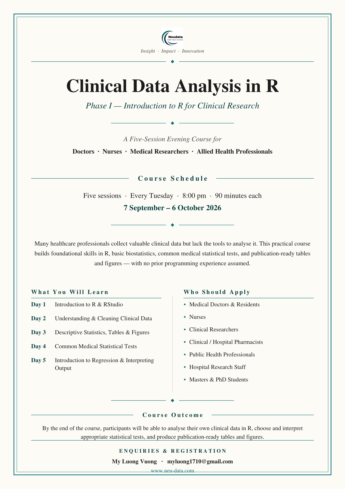

::: {.course-hero}
# Clinical Data Analysis in R - Phase 1
A free, hands-on short course for health professionals and researchers in Vietnam

::: {.badges}
[FREE]{} [Beginner-friendly]{} [Online]{} [No coding experience required]{}
:::

[Schedule](schedule.qmd){.btn .btn-light role="button"} [Get your free access code](access.qmd){.btn .btn-light role="button"}
:::

{.float-end width="34%" style="margin:0 0 1rem 1.5rem"}

> **The course has ended.** Phase I ran online from 8 September to 6 October 2026. Thank you to
> everyone who took part! All course materials remain freely available on this website for
> self-study: [request a free access code](https://neu-data.github.io/ClinicalDataAnalysisinR-Phase1/en/access.html) — it is sent to your email (we only
> count how many people use the materials and roughly where from; your email is not stored). For further questions, or anything else about the course, please contact
> **Vương Mỹ Lượng** at [myluong.1710@gmail.com](mailto:myluong.1710@gmail.com).

---

## About this course

Many clinicians and researchers collect valuable data every day — but never get the
chance to analyse it themselves. **Phase I** changes that. Over five evening sessions,
participants went from *never having opened R* to running a real clinical analysis:
importing data, cleaning it, describing it, testing hypotheses, and interpreting a
regression model — the way it is actually done for a thesis, report, or manuscript.

> **You do not need any programming or statistics background.** If you can use a
> computer and you care about your data, these materials are for you.

---

## It's completely free

This is a **no-cost training** offered to build data-analysis capacity among health
professionals and researchers in Vietnam. There are no fees, and all course materials,
the practice dataset, and the software are free to use and keep.

---

## 🗓️ When it ran

| | |
|---|---|
| **Format** | 5 online evening sessions (completed) |
| **Day & time** | Tuesdays, 8:00 PM (Vietnam time, ICT) |
| **Duration** | 90 minutes per session |
| **Dates** | 8 September – 6 October 2026 |
| **Where** | Online |

---

## 🧑‍🏫 Who is leading the course

The course was led by two trainers, who guided every session and the hands-on exercises:

| Trainer | Role |
|---------|------|
| **Vương Mỹ Lượng** | Senior Biostatistician — *lead trainer* |
| **Bernard Osang'ir** | Senior Biostatistician |

---

## 🧑‍⚕️ Who the materials are for

Health and research professionals with little or no R experience:

- 👨‍⚕️ Medical doctors and residents
- 👩‍⚕️ Nurses and hospital research staff
- 💊 Clinical and hospital pharmacists
- 🔬 Clinical researchers and trial coordinators
- 🌍 Public-health professionals
- 🎓 Master's students and PhD candidates

---

## 📚 What you will learn

Five sessions that build on each other — one real clinical dataset all the way through. All
slides, scripts, exercises and the handbook are available on this website:

| Session | Theme | You will be able to… |
|:---:|-------|----------------------|
| **1** | Introduction to R & RStudio | Import data and find your way around R |
| **2** | Understanding & Cleaning Clinical Data | Turn messy data into an analysis-ready dataset |
| **3** | Descriptive Statistics, Tables & Figures | Produce a publication-quality **Table 1** and clear plots |
| **4** | Common Medical Statistical Tests | Choose and run the right test (t-test, chi-square, non-parametric) |
| **5** | Introduction to Regression & Interpreting Output | Fit and read a regression, and write a short **Results** section |

Working through the materials, you will be able to **analyse a clean clinical dataset from start to finish
and report it in plain, scientific language.**

---

## What you need (all free)

Everything is free and works on **Windows** or **macOS**. The pre-course pack on this
website helps you set it up.

| Tool | What it's for | Cost |
|------|---------------|:----:|
| **R** (version 4.x) | The analysis engine | Free |
| **RStudio Desktop** | The friendly workspace for R | Free |
| **A laptop** | Windows or macOS, ~1 GB free space | — |
| **Internet** | To install the software and download the materials | — |

**R packages used** (installed in one step during setup):
`tidyverse` · `readxl` · `gtsummary` · `broom` · `survival` · `survminer`

> 📦 **Start here:** the **Course Preparation pack** on this website walks you through
> installing R and RStudio, learning the interface, and practising with the course data.

---

## ✉️ Questions and contact

The course has ended, but you are welcome to get in touch for further questions
or anything else about the course:

- ✉️ **Email:** [myluong.1710@gmail.com](mailto:myluong.1710@gmail.com) — *Vương Mỹ Lượng*
- 🌐 **Website:** [www.neu-data.com](https://www.neu-data.com/)

---

**No prior programming experience required — just curiosity.**

*Thank you to everyone who took part!* 🎉

Neudata · **#ClearDataClearImpact**

