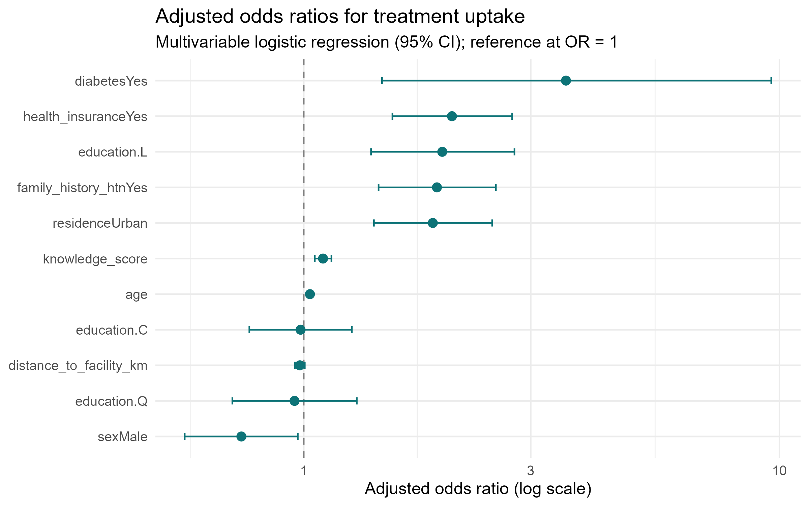

# Day 5: Introduction to Regression & Interpreting Output

## Plan

- Linear regression: modelling a continuous outcome
- Logistic regression: odds ratios for a Yes/No outcome
- Adjusting for several factors, and confounding
- Publication-ready tables, figures and a Results section
- Reproducibility: scripts, seeds and projects

::: {.notes}
Welcome to the capstone day.

Key point: today we turn a fitted model into a publishable, reproducible result.

This ties together everything from Days 1-4: importing, cleaning, summarising, and now modelling and reporting.

Tell the class the goal is not more statistics but better judgement and cleaner reporting.

Demonstration tip: keep day5\_demo.R open in RStudio throughout.
:::

## Today's Objectives

[By the end of Day 5 you will be able to:]{.slide-intro}

- Fit and read a linear regression for a continuous outcome.
- Fit a logistic regression and read odds ratios with 95% CIs.
- Understand why we adjust for several factors, and recognise confounding.
- Present adjusted results as a clear table and a forest plot.
- Write a short, honest Results section from your own numbers.
- Make the whole analysis reproducible end to end.

::: {.notes}
Set concrete, checkable goals for the day.

Key teaching point: these objectives map one-to-one onto the exercise deliverable.

Clinical interpretation: each skill is something they will use on their own studies, not abstract theory.

Audience question: which of these feels least familiar? Use the show of hands to pace the day.

Demonstration tip: return to this list at the wrap-up and tick items off.
:::

## Where We Are in the Journey {.smaller}

### Across the week

| Sessions 1-2: import and clean the hypertension dataset.
| Session 3: summarise and visualise (Table 1, figures).
| Session 4: common statistical tests (t-test, chi-square, correlation).
| Session 5: regression - model, interpret, report and reproduce.

### Today's running example

| Outcome: treatment\_uptake among diagnosed hypertensives.
| Analytic sample: 1,089 diagnosed; 992 complete cases modelled.

::: {.callout-note}
## One dataset, end to end
Every result today comes from the same study you cleaned earlier.
:::

::: {.notes}
Orient the audience: this is a coherent pipeline, not isolated tricks.

Common misconception: that modelling is the hard part. The judgement (which variables, how to report) is harder.

Clinical interpretation: only diagnosed patients can take up treatment, so we restrict to them.

Audience question: why model only the 1,089 diagnosed and not all 1,500? Expected answer: people without a diagnosis cannot have a treatment-uptake decision; including them biases the estimates.
:::

## Linear Regression: Modelling a Number {.smaller}

### When the outcome is a number

| Linear regression models a CONTINUOUS outcome, such as blood pressure.
| Outcome = a systematic part (the predictors) + unexplained variation.
| It estimates how much the outcome changes per one unit of a predictor.

### Reading the output

| The coefficient (slope) is the change in the outcome per one-unit rise.
| Each coefficient comes with a 95% CI and a p-value.
| Adding predictors gives each one's ADJUSTED effect, holding the others constant.

::: {.callout-note}
## Clinical question
Is systolic blood pressure associated with age - and does it hold after adjusting for sex and BMI?
:::

::: {.notes}
Key teaching point: linear regression is for a continuous outcome; the slope is a change per unit.

Clinical interpretation: the intercept is rarely meaningful; the slopes are what we report.

Common mistake: using linear regression for a Yes/No outcome - that needs logistic regression (next).

Audience question: outcome is systolic BP (a number) and predictor is age - which model? Answer: linear regression.
:::

## Demo: Linear Regression of SBP on Age

[Does systolic blood pressure rise with age, adjusting for sex and BMI?]{.slide-intro}

```r
m1 <- lm(sbp_mmhg ~ age, data = analysis_data)
summary(m1)

# adjust for sex and BMI
m2 <- lm(sbp_mmhg ~ age + sex + bmi,
         data = analysis_data)
tidy(m2, conf.int = TRUE)
```

```{.text .code-output}
term        estimate conf.low conf.high p.value
(Intercept)   87.31    81.01    93.61   <0.001
age            0.26     0.19     0.33   <0.001
sexMale        0.33    -1.57     2.22    0.74
bmi            1.45     1.26     1.64   <0.001
```

::: {.code-note}
Each extra year adds \~0.26 mmHg to SBP and each BMI unit \~1.45 mmHg; sex is not significant.
:::

::: {.notes}
Key teaching point: read each slope as an adjusted change per unit, with its 95% CI.

Clinical interpretation: age and BMI are independently associated with SBP; sex is not (CI crosses 0, p = 0.74).

Common mistake: reporting the intercept as if it were clinically meaningful.

Demo tip: run summary(m1) first (crude), then the adjusted m2, and note the age slope barely changes.
:::

## Why Logistic Regression? {.smaller}

### The outcome is binary

| Treatment uptake is Yes/No - not a number, so not linear regression.
| Logistic regression models the ODDS of the 'Yes' outcome.
| It handles one predictor or many at once.

### Odds and odds ratios

| Odds = probability of Yes divided by probability of No.
| An odds ratio (OR) compares the odds between two groups.
| The OR is the single number clinicians read from the model.

::: {.callout-tip}
## Why odds, not probability
Odds let us multiply effects cleanly and give a constant OR per group.
:::

::: {.notes}
Key teaching point: a binary outcome calls for logistic regression, which models odds rather than a mean.

Clinical interpretation: the odds ratio is the deliverable - it travels straight into the manuscript and the forest plot.

Common mistake: trying to fit a linear model to a Yes/No outcome.

Audience question: what are the odds if 3 of 4 patients take up treatment? Answer: 3 to 1, i.e. odds = 3.
:::

## Reading an Odds Ratio {.smaller}

### Direction of the effect

| OR = 1: the predictor has no effect on the odds of uptake.
| OR \> 1: higher odds of uptake (a positive driver).
| OR \< 1: lower odds of uptake (a protective / negative driver).

### Precision and significance

| The 95% CI shows the plausible range for the true OR.
| If the CI excludes 1, the effect is statistically significant.
| A wide CI means an imprecise, uncertain estimate.

::: {.callout-note}
## Example phrasing
Diabetics had 3.6 times the odds of uptake (aOR 3.56, 95% CI 1.46 to 9.61).
:::

::: {.notes}
Key teaching point: read an OR as direction (vs 1) plus significance (does the CI cross 1?).

Common mistake: reading the raw coefficient (log-odds) as if it were the OR - always exponentiate first.

Clinical interpretation: 'OR excludes 1' is the regression equivalent of p \< 0.05, but with magnitude attached.

Audience question: OR 0.7 with CI 0.5 to 0.9 - what does it mean? Answer: a real protective effect, 30% lower odds.
:::

## Demo: Univariable Logistic Regression (Diabetes)

[Does diabetes raise the odds of treatment uptake?]{.slide-intro}

```r
m_diab <- glm(treatment_uptake ~ diabetes,
              data = dx, family = binomial)
exp(coef(m_diab))      # odds ratio
exp(confint(m_diab))   # 95% CI
```

```{.text .code-output}
(Intercept)   diabetesYes
      0.74          2.85
            2.5 %   97.5 %
diabetesYes  2.01     4.07
```

::: {.code-note}
Unadjusted OR \~2.85: diabetics have roughly triple the odds of uptake; CI excludes 1.
:::

::: {.notes}
Key teaching point: family = binomial tells glm the outcome is 0/1; exp() turns log-odds into an interpretable OR.

Common mistake: reporting exp(coef) but forgetting the reference level - here diabetesYes is compared with No.

Clinical interpretation: the unadjusted OR will shrink once we adjust for confounders such as age.

Demo tip: show summary(m\_diab) first so they see the log-odds, then exp() to make it a clinician-friendly OR.
:::

## A Continuous Predictor: Age {.smaller}

### OR per one unit

| glm(treatment\_uptake \~ age) gives the OR per ONE extra year.
| That OR is close to 1 because one year is a tiny step.
| Here about 1.03 per year - easy to overlook.

### Rescale to a meaningful unit

| OR per 10 years = the 1-year OR raised to the power 10.
| exp(coef(m\_age)\["age"\] \* 10) gives the per-decade OR.
| 1.03 per year becomes roughly 1.34 per decade.

::: {.callout-tip}
## Communicate in clinical units
Per decade is far easier for a clinical audience than per year.
:::

::: {.notes}
Key teaching point: for a continuous predictor the OR is per one-unit change - choose a unit people care about.

Common mistake: dismissing age as unimportant because OR \~1.03 looks trivial per single year.

Clinical interpretation: per-decade framing (about 1.34) shows age is a meaningful driver of uptake.

Demo tip: run exp(coef(m\_age)\['age'\] \* 10) live to convert per-year into per-decade.
:::

## Model Building: Clinical Knowledge First

### Choose predictors before you look at p-values

| Biological or clinical plausibility (diabetes drives clinic visits).
| Known confounders from the literature (age, sex, education).
| The study's stated determinants (distance, knowledge).

### Then fit ONE pre-specified model

| Decide the variable list first, fit once, report it.
| This is the honest, replicable approach for a determinants study.

::: {.callout-important}
## Data dredging
Trying many models and reporting only significant ones inflates false positives.
:::

::: {.notes}
Core philosophy slide: clinically-motivated selection beats blind automation.

Key teaching point: a pre-specified model is defensible to reviewers and reproducible.

Common mistake: letting the computer pick variables, then telling a clinical story around whatever survived.

Clinical interpretation: in an explanatory study we keep known confounders even if non-significant.

Audience question: should we drop a variable just because p \> 0.05? Expected answer: no, not if it is a known confounder; dropping it can reintroduce bias.
:::

## Confounding: A Clinical Example

:::: {.columns}
::: {.column width="50%"}
### What confounding is

- A third variable distorts the crude link between exposure and outcome.
- Example: urban residents are younger and better insured.
- Those factors also raise uptake - so crude residence looks too strong.
- Adjusting for them isolates the true residence effect.
:::
::: {.column width="50%"}
### How we detect it

- Compare the crude OR with the adjusted OR for residence.
- If the estimate shifts noticeably (rule of thumb \>10%), confounding is present.
- Always report and interpret the ADJUSTED odds ratio.
- The adjusted urban OR in our model is 1.87 (1.41-2.49).
:::
::::

::: {.notes}
Confounding is the single most important modelling concept for clinicians.

Key teaching point: adjustment is how observational studies approximate a fair comparison.

Common mistake: reporting and interpreting the crude OR.

Clinical interpretation: the crude urban effect is partly explained by age and insurance; after adjustment a genuine residual urban advantage of about 1.87 remains.

Demonstration tip: in the next slide we show the crude vs adjusted numbers from R.
:::

## Demo: Crude vs Adjusted OR for Residence {.smaller}

[Fit a crude model, then compare with the full model.]{.slide-intro}

```r
crude <- glm(treatment_uptake ~ residence,
             data = dx, family = binomial)
full <- glm(treatment_uptake ~ age + sex + education +
             residence + diabetes + family_history_htn +
             health_insurance + knowledge_score +
             distance_to_facility_km,
             data = dx, family = binomial)
exp(coef(crude))["residenceUrban"]
exp(coef(full))["residenceUrban"]
```

```{.text .code-output}
residenceUrban
     2.34
residenceUrban
     1.87
```

::: {.code-note}
The OR shrinks from 2.34 (crude) to 1.87 (adjusted): age and insurance were confounding it.
:::

::: {.notes}
Live demo from day5\_demo.R, sections 2-3.

Key teaching point: exp() converts log-odds to an odds ratio.

Common mistake: forgetting that glm needs family = binomial for a logistic model.

Clinical interpretation: a \>10% drop confirms confounding; the adjusted 1.87 is what we report.

Audience question: why does the urban effect shrink? Expected answer: because urban residents differ on age and insurance, which independently raise uptake.
:::

## Demo: The Final Model and Tidy ORs

[Fit once, then turn coefficients into odds ratios with CIs.]{.slide-intro}

```r
model_final <- full
library(broom)
or_table <- tidy(model_final,
                 exponentiate = TRUE,
                 conf.int = TRUE)
print(or_table, n = Inf)
```

```{.text .code-output}
term            estimate conf.low conf.high
diabetesYes        3.56     1.46      9.61
health_insuranceYes 2.05    1.54      2.74
residenceUrban     1.87     1.41      2.49
age                1.03     1.02      1.04
```

::: {.code-note}
exponentiate = TRUE gives ORs; conf.int = TRUE adds 95% CIs - the exact table your reader needs.
:::

::: {.notes}
Live demo from day5\_demo.R, section 7.

Key teaching point: broom::tidy() converts a model object into a clean data frame, ready to plot or export.

Common mistake: hand-copying numbers from summary() into a Word table - error-prone and unreproducible.

Clinical interpretation: every CI shown excludes 1, so all are significant; diabetes has the largest OR but the widest CI.

Audience question: why is the diabetes CI so wide? Expected answer: diabetics are a smaller subgroup, so the estimate is less precise.
:::

## Final Multivariable Model: Adjusted ORs {.smaller}

| Predictor | aOR | 95% CI | p |
|:---|:---|:---|:---|
| Age (per year) | 1.03 | 1.02-1.04 | \<0.001 |
| Sex: Male (vs Female) | 0.74 | 0.56-0.97 | 0.031 |
| Education (linear trend) | 1.96 | 1.39-2.77 | \<0.001 |
| Residence: Urban (vs Rural) | 1.87 | 1.41-2.49 | \<0.001 |
| Diabetes: Yes | 3.56 | 1.46-9.61 | 0.007 |
| Health insurance: Yes | 2.05 | 1.54-2.74 | \<0.001 |
| Distance to facility (per km) | 0.98 | 0.96-1.01 | 0.128 |

: Logistic regression; n = 992 complete cases; AUC = 0.71. Family history aOR 1.91 (1.44-2.54); knowledge 1.10 (1.06-1.14) per point.

::: {.notes}
These are the canonical numbers from key\_findings.md - cite them accurately.

Key teaching point: this is the manuscript's main results table.

Common mistake: omitting the CI or the n; reviewers always ask.

Clinical interpretation: distance is in the expected protective-against-uptake direction (OR 0.98) but not significant - report it as such, do not call it null.

Audience question: which predictor matters most? Expected answer: diabetes has the largest OR (3.56), but caution - its CI is widest, so precision is lower.

Demonstration tip: family history and knowledge are in the caption to keep the table within the row limit.
:::

## Visualising the Adjusted ORs

:::: {.columns}
::: {.column width="38%"}
### How to read it

- Each point is an adjusted odds ratio.
- Whiskers are the 95% confidence intervals.
- Dashed line at 1 = no effect.
- Right of 1 increases uptake; left decreases it.
- Diabetes sits farthest right - largest effect.
- Distance crosses 1 - not significant.
:::
::: {.column width="62%"}
{width=100%}
:::
::::

::: {.notes}
Key teaching point: a forest plot communicates the whole model at a glance.

The x-axis is on a log scale so the CIs appear symmetric around each point.

Common mistake: putting the OR axis on a linear scale, which squashes the small ORs.

Clinical interpretation: any CI whisker that crosses the dashed line at 1 is non-significant - here only distance does.

Audience question: why does distance look different from the others? Expected answer: its interval straddles 1, so we cannot rule out no effect.
:::

## Demo: Publication-Ready Table and Forest Plot

[Build a journal-style table, then save the figure.]{.slide-intro}

```r
library(gtsummary)
tbl <- tbl_regression(model_final,
                      exponentiate = TRUE) |>
  bold_p()
tbl
# save the forest plot built from or_table
ggsave("Resources/forest_plot_or.png",
       plot = forest, width = 8, height = 5, dpi = 300)
```

::: {.code-note}
tbl\_regression reads the model directly - no manual copying - and ggsave exports the figure for the manuscript.
:::

::: {.notes}
Live demo from day5\_demo.R, sections 8-9.

Key teaching point: tables and figures should be generated from code, never retyped.

Common mistake: editing numbers by hand in Word, which breaks reproducibility and invites transcription errors.

Clinical interpretation: the saved PNG is the exact figure on the previous slide.

Demonstration tip: show as\_gt(tbl) \|\> gtsave("Resources/regression\_table.html") to export the table too; mention a write\_csv fallback if gtsummary is unavailable.
:::

## Exporting Outputs for the Manuscript {.smaller}

### Save tables

| gtsummary: as\_gt(tbl) then gtsave() writes HTML, PNG or Word.
| Fallback: write\_csv(or\_table, "Resources/regression\_table.csv").

### Save figures

| ggsave() writes the forest plot at a fixed size and resolution.
| Use dpi = 300 for print-quality figures in journals.

### Why export from code

| The report can be rebuilt from raw data with no manual steps.
| No copy-paste means no transcription errors.

::: {.callout-tip}
## Keep a Resources/ folder
Send every table and figure there so outputs live in one place.
:::

::: {.notes}
Key teaching point: outputs are artefacts of code, not hand-built files.

Common mistake: screenshotting a plot from the RStudio viewer instead of using ggsave - low resolution and not reproducible.

Clinical interpretation: a reviewer who asks for a tweak gets it by editing one line and re-running.

Audience question: what dpi for a print figure? Expected answer: 300.

Demonstration tip: run ggsave and gtsave live, then open the Resources/ folder to show the files appear.
:::

## From Odds Ratios to Prose

:::: {.columns}
::: {.column width="50%"}
### The numbers

- Diabetes: aOR 3.56 (1.46-9.61).
- Insurance: aOR 2.05 (1.54-2.74).
- Urban: aOR 1.87 (1.41-2.49).
- Education trend: aOR 1.96 (1.39-2.77).
- Male sex: aOR 0.74 (0.56-0.97).
- Distance: aOR 0.98 (0.96-1.01), NS.
:::
::: {.column width="50%"}
### Turning each OR into a sentence

- State direction, size, comparison group and CI.
- OR\>1: 'X times the odds of uptake'.
- OR\<1: 'lower odds' - here men vs women.
- Continuous: 'per 1-unit increase'.
- Name the reference group explicitly.
- Report NS findings honestly, with the CI.
:::
::::

::: {.notes}
Key teaching point: a Results section is structured translation, not invention.

Each OR becomes one clear clause: direction, magnitude, comparator, precision.

Common mistake: writing 'X caused Y' from an observational OR - use 'was associated with'.

Clinical interpretation: an OR of 0.74 for male sex means men had about 26% lower odds than women.

Audience question: how do you phrase a non-significant finding? Expected answer: report the estimate and CI and state it was not statistically significant - do not claim 'no effect'.
:::

## Worked Example: A Results Paragraph {.smaller}

### Model results paragraph

| Among 992 diagnosed hypertensives, treatment uptake was independently
| associated with diabetes (aOR 3.56, 95% CI 1.46-9.61), health insurance
| (2.05, 1.54-2.74), urban residence (1.87, 1.41-2.49) and higher education
| (1.96, 1.39-2.77). Older age (1.03 per year) and greater knowledge (1.10
| per point) also raised the odds, while men had lower odds than women
| (0.74, 0.56-0.97). Distance to facility was not significant (0.98,
| 0.96-1.01). The model discriminated acceptably (AUC 0.71).

::: {.callout-tip}
## Always close with discrimination
Reporting the AUC tells the reader how well the model separates uptake from non-uptake.
:::

::: {.notes}
This is a model answer the class can adapt for the exercise.

Key teaching point: lead with the analytic n, list significant determinants with ORs and CIs, then report the non-significant one and overall fit.

Common mistake: causal language ('diabetes increases uptake') from a cross-sectional study.

Clinical interpretation: the paragraph mirrors exactly the directions in key\_findings.md.

Audience question: what belongs in the very first sentence? Expected answer: the sample size and outcome, so the reader knows the basis of every number that follows.
:::

## Reproducibility: The Capstone Message {.smaller}

### Make your work re-runnable by anyone

| Scripts over click-menus: the code is the permanent record.
| set.seed() makes any randomness (bootstraps, splits) repeatable.
| Use RStudio Projects and relative paths - never C:/Users/yourname/...
| Save every table and figure to disk so the report rebuilds from code.

### Record and share your environment

| sessionInfo() captures your exact R and package versions.
| R Markdown / Quarto knit code, text and figures into one report.

::: {.callout-tip}
## Best practice
One click should rebuild the whole report from raw data to PDF.
:::

::: {.notes}
Key teaching point: a result you cannot reproduce is a result you cannot defend.

Click-menu analyses leave no trace; scripts do.

Common mistake: hard-coding an absolute path that only works on your laptop - it breaks for every collaborator.

Clinical interpretation: reproducibility is part of research integrity, not an optional extra.

Audience question: why set a seed if logistic regression is deterministic? Expected answer: so the whole script - including any resampling or simulation - reproduces identically end to end.

Demonstration tip: show the folder structure Data/ Scripts/ Solutions/ Resources/ References/.
:::

## Demo: A Reproducibility Snippet

[Seed, relative path, and a recorded environment.]{.slide-intro}

```r
set.seed(2025)
analysis_data <- readRDS("Data/analysis_data.rds")
dx <- filter(analysis_data, htn_diagnosed == "Yes")
# record the exact software environment
writeLines(capture.output(sessionInfo()),
           "References/session_info.txt")
```

```{.text .code-output}
R version 4.4.1 (2024-06-14)
attached: dplyr_1.1.4 broom_1.0.6 gtsummary_2.0
... (full environment written to References/session_info.txt)
```

::: {.code-note}
Relative paths plus a saved sessionInfo() let any colleague rerun this on any machine.
:::

::: {.notes}
Live demo from day5\_demo.R, sections 0-1 and 10.

Key teaching point: these three habits - seed, relative path, recorded environment - cover most reproducibility failures.

Common mistake: re-cleaning data inside the analysis script; cleaning belongs in its own script (separation of concerns).

Clinical interpretation: readRDS loads the already-cleaned, analysis-ready data.

Demonstration tip: open References/session\_info.txt after running to show what was captured.
:::

## Day 5 Exercise: Complete the Analysis & Write a Results Section

### Your tasks

| Fit the pre-specified multivariable model on the diagnosed subset.
| Produce a tidy OR table (exponentiate = TRUE, conf.int = TRUE).
| Run the diagnostics: VIF, a linearity check, Cook's distance, AUC.
| Build a gtsummary table and a forest plot, and save both to Resources/.
| Write a 4-6 sentence Results section from your own ORs.

::: {.callout-note}
## Deliverable
A reproducible script plus a short Results paragraph citing aORs, 95% CIs and the AUC.
:::

::: {.notes}
Key teaching point: this exercise integrates the whole week into one deliverable.

Common mistake: forgetting to restrict to htn\_diagnosed == 'Yes', or reporting crude instead of adjusted ORs.

Clinical interpretation: the marking rubric (key\_findings.md) rewards correct method and interpretation, not 2nd-decimal matches.

Audience question: how long should the Results paragraph be? Expected answer: a tight 4-6 sentences - n and outcome, significant determinants with ORs and CIs, the non-significant one, then AUC.

Demonstration tip: point them to day5\_demo.R as a scaffold and circulate while they work.
:::

## Course Wrap-Up: What You Can Now Do

[Five days, one real dataset, a full analysis pipeline.]{.slide-intro}

- Import messy clinical data into R and understand its structure.
- Clean it: fix impossible values, standardise categories, handle missingness.
- Summarise and visualise: Table 1, histograms, boxplots, bar charts.
- Fit and interpret logistic regression with adjusted odds ratios.
- Build models from clinical reasoning and check their assumptions.
- Produce publication-ready tables and figures, and a Results section.
- Work reproducibly with scripts, projects, seeds and Quarto reports.

::: {.notes}
Key teaching point: celebrate the distance travelled - they started with no programming background.

Reassure them that fluency comes with practice on their own data.

Clinical interpretation: they now own a defensible, reproducible workflow they can take to their own studies.

Audience question: what is the single most valuable habit to keep? Expected answer: do everything in a script so it is reproducible.

Demonstration tip: invite one or two participants to share what surprised them most.
:::

## What Phase II Might Cover {.smaller}

### Potentially: deeper modelling

| Confounding, interaction and effect modification in depth.
| Model diagnostics: multicollinearity, fit and discrimination (AUC).
| Variable selection and how to build a model responsibly.

### Potentially: new methods and skills

| Survival analysis: Kaplan-Meier and Cox models for time-to-event data.
| Mixed-effects models: patients clustered within facilities.
| Missing data (multiple imputation) and automated Quarto reporting.

::: {.callout-tip}
## You choose
Phase II topics will be decided mainly by the participant survey - the topics you want most. Keep practising on your own data meanwhile.
:::

::: {.notes}
Key teaching point: today's logistic model is the foundation; Phase II generalises it.

Clinical interpretation: their 6-facility study is naturally clustered, which could motivate mixed models in Phase II.

Common misconception: that survival and logistic regression are unrelated - both are regression, just for different outcome types.

Stress that these are potential topics: the participant survey will decide what Phase II covers, so ask everyone to complete it.

Audience question: which Phase II topic fits a study following patients over time? Expected answer: survival analysis, because the outcome is time-to-event.

Demonstration tip: thank the class, point to References/ for further reading, and close with \#ClearDataClearImpact.
:::
