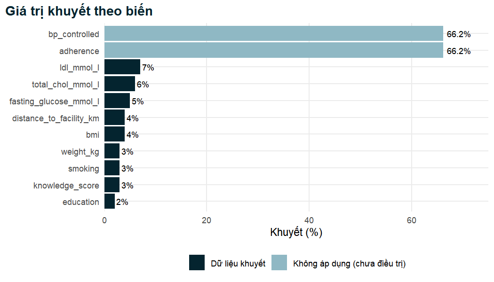
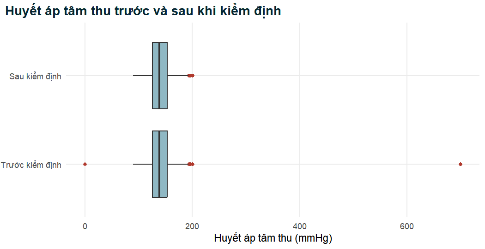
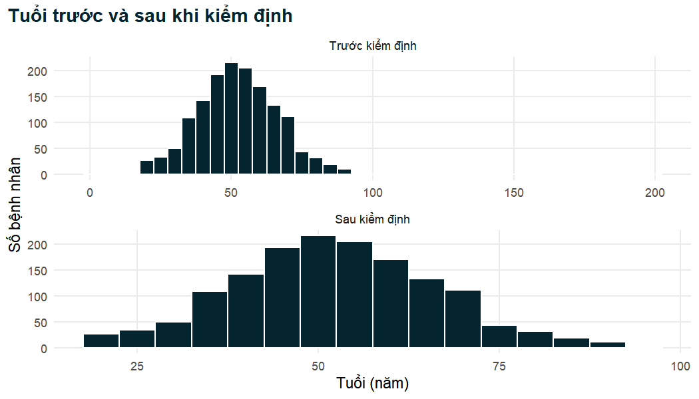
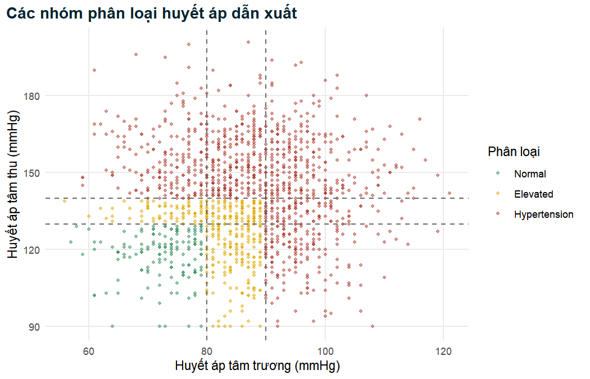
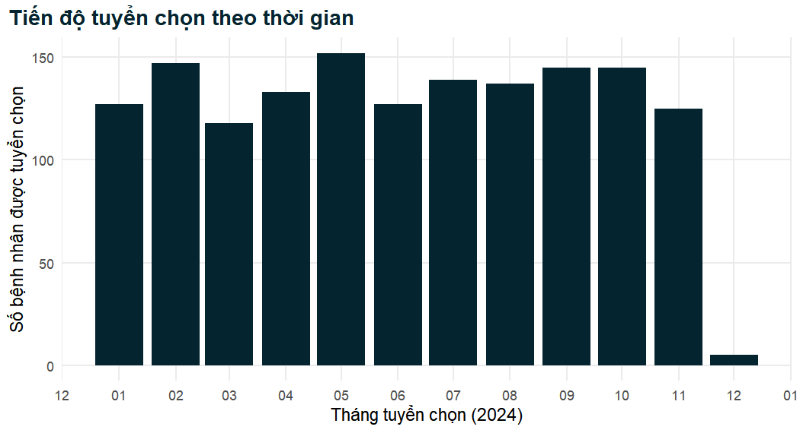

Một bộ dữ liệu lâm sàng vừa được chuyển đến bàn làm việc của bạn. Số cột đúng như mong đợi,
tên biến trông hợp lý và vài dòng đầu tiên có vẻ ổn. Bạn rất dễ bị cám dỗ đi thẳng vào phần
thú vị: bảng đặc điểm ban đầu của đối tượng nghiên cứu, so sánh bệnh nhân có điều trị và không
điều trị, mô hình hồi quy. Hãy cưỡng lại cám dỗ đó. Đâu đó trong 1.500 dòng kia có một giá trị
huyết áp tâm thu 700 mmHg, một bệnh nhân 200 tuổi, một người trưởng thành có cân nặng được ghi
là 7 kg, tình trạng đái tháo đường được mã hóa theo sáu cách khác nhau và ba bệnh nhân xuất hiện
hai lần. Không vấn đề nào trong số này ngăn được R tính ra một giá trị trung bình, một giá trị
*p* hay một tỷ số chênh. Nhưng tất cả chúng đều sẽ làm cho những con số đó sai. Chương này nói
về việc tìm ra những vấn đề như vậy một cách có hệ thống, quyết định cách xử lý từng vấn đề, và
ghi lại các quyết định đó dưới dạng mã R, để hành trình từ tệp thô đến dữ liệu sẵn sàng phân
tích được minh bạch và có thể được bất kỳ ai lặp lại, vào bất kỳ lúc nào, với đúng cùng một kết
quả. Bộ dữ liệu sạch được tạo ra ở đây, `analysis_data`, là điểm xuất phát cho mọi chương còn
lại của cuốn sách.

::: {.callout-note .nb-objectives icon=false title="Mục tiêu học tập"}
- Giải thích vì sao làm sạch dữ liệu (data cleaning) là một bước khoa học phải được viết thành script, được ghi chép và có thể tái lập, đồng thời mô tả "hợp đồng làm sạch" giữa dữ liệu thô và dữ liệu sẵn sàng phân tích.
- Áp dụng các nguyên tắc của dữ liệu gọn gàng (tidy data) và phân loại các biến lâm sàng thành liên tục, rời rạc, danh định, thứ bậc, nhị phân hoặc ngày tháng, chọn cách biểu diễn phù hợp trong R cho từng loại.
- Nhập một tệp thô đồng thời khai báo tường minh các mã giá trị khuyết, và chứng minh các mã không được khai báo như `-99` và `999` làm sai lệch thống kê tóm tắt như thế nào.
- Phân biệt dữ liệu khuyết hoàn toàn ngẫu nhiên, khuyết ngẫu nhiên và khuyết không ngẫu nhiên, giải thích vì sao phân tích trên các trường hợp đầy đủ có thể bị sai lệch, và tạo một bảng cùng một hình kiểm kê dữ liệu khuyết.
- Phát hiện, kiểm tra, loại bỏ và báo cáo các bản ghi trùng lặp.
- Chuẩn hóa các danh mục không nhất quán và khoảng trắng thừa bằng `str_trim()`, `str_to_lower()` và `case_when()`, đồng thời viết một hàm trợ giúp có thể dùng lại cho các biến Yes/No (có/không).
- Kiểm định các phép đo liên tục theo khoảng giá trị sinh lý hợp lý, chuyển các giá trị không thể xảy ra thành giá trị khuyết và đếm những gì đã thay đổi.
- Tạo biến chỉ số khối cơ thể và các phân loại lâm sàng của BMI và huyết áp, rồi đối chiếu các biến dẫn xuất với định nghĩa của chúng.
- Phân tích cú pháp (parse) các ngày tháng được ghi theo nhiều định dạng khác nhau bằng `lubridate`.
- Chuyển các biến phân loại thành factor với thứ tự mức và nhóm tham chiếu được chọn có chủ đích, lưu dữ liệu sạch và kiểm tra rằng quy trình làm sạch có thể tái lập.
:::


## 2.1 Vì sao làm sạch dữ liệu lại quan trọng {#sec-why-cleaning}

### 2.1.1 Rác vào, rác ra

Các phương pháp thống kê nhận các con số như chúng vốn có. Một kiểm định *t* không biết rằng
huyết áp tâm thu 700 mmHg là điều không thể về mặt sinh lý; một mô hình hồi quy logistic không
biết rằng "Y", "yes" và "1" có cùng một nghĩa; một bảng tần số không biết rằng hai dòng mô tả
cùng một bệnh nhân. Mọi phương pháp trong cuốn sách này đều giả định rằng dữ liệu trước mặt nó
là bản ghi trung thực của những gì đã được đo. Khi giả định đó không đúng, phân tích thất bại
một cách âm thầm: phần mềm vẫn cho ra kết quả trông có vẻ đáng tin cậy y như kết quả từ dữ liệu
sạch. Đây là nguyên tắc lâu đời của ngành tin học, *rác vào, rác ra* (garbage in, garbage out),
và trong nghiên cứu lâm sàng hậu quả của nó không chỉ dừng lại ở sự ngượng ngùng. Một giá trị
huyết áp trung bình bị đội lên do lỗi nhập liệu có thể làm thay đổi tỷ lệ hiện mắc biểu kiến
của tăng huyết áp không được kiểm soát; một phơi nhiễm bị phân loại sai có thể che giấu một mối
liên quan có thật hoặc tạo ra một mối liên quan giả; một bệnh nhân bị nhân đôi có thể làm cho
một biến cố bất lợi hiếm gặp trông phổ biến gấp đôi.

Người ta thường nói rằng việc chuẩn bị dữ liệu chiếm phần lớn thời gian trong một phân tích
thực tế, với các con số thường được nhắc đến từ 50 đến 80 phần trăm. Dù tỷ lệ chính xác là bao
nhiêu, kinh nghiệm của phần lớn các nhà thống kê ứng dụng và nhà dịch tễ học là việc làm sạch,
mã hóa lại và kiểm tra tốn nhiều thời gian hơn hẳn so với việc xây dựng mô hình. Đó không phải
là thời gian lãng phí. Làm sạch là giai đoạn bạn hiểu ra các biến thực sự có nghĩa là gì, chúng
được thu thập như thế nào, giá trị nào đáng ngờ và dữ liệu có thể hay không thể trả lời những
câu hỏi nào. Một nhà phân tích cẩn thận bước ra khỏi giai đoạn làm sạch với hiểu biết tường tận
về bộ dữ liệu, và hiểu biết đó sẽ được đền đáp ở mọi bước tiếp theo.

### 2.1.2 Hợp đồng làm sạch

Ý tưởng trung tâm của chương này là điều mà chúng ta sẽ gọi là **hợp đồng làm sạch** (cleaning
contract). Hợp đồng gồm ba điều khoản.

1. **Dữ liệu thô không bao giờ được chỉnh sửa bằng tay.** Tệp lấy từ hệ thống thu thập dữ liệu
   (ở đây là `hypertension_phc_raw.csv`) được coi là chỉ đọc. Bạn không mở nó trong một bảng
   tính rồi ghi đè 700 thành 170, xóa các dòng trùng lặp hay gõ lại "F" thành "Female". Những
   chỉnh sửa thủ công không để lại dấu vết, không thể được rà soát và không thể được lặp lại khi
   một phiên bản đã sửa của tệp thô được gửi đến.
2. **Mọi thay đổi đều được thực hiện bằng mã.** Một script làm sạch đọc tệp thô và áp dụng từng
   chỉnh sửa dưới dạng một dòng lệnh R tường minh, có chú thích. Bất kỳ ai đọc script đều thấy
   chính xác những gì đã được thay đổi và vì sao; bất kỳ ai chạy nó đều nhận được đúng cùng một
   kết quả.
3. **Đầu ra là một tệp duy nhất, được ghi chép đầy đủ và sẵn sàng phân tích.** Script kết thúc
   bằng việc lưu dữ liệu sạch (ở đây là `analysis_data.rds`). Mọi phân tích, trong mọi chương
   sau, đều bắt đầu bằng việc đọc tệp này, và không bao giờ bằng việc lặp lại hay sửa đổi các
   bước làm sạch.

Việc tách biệt dữ liệu thô, mã làm sạch và dữ liệu sạch là một nền tảng của nghiên cứu có thể
tái lập (reproducible research) [@peng2011]. Đó cũng là khuyến nghị đầu tiên trong phần lớn các
hướng dẫn thực hành tốt về quản lý dữ liệu. @broman2018 đưa ra các quy tắc thực tế để tổ chức
dữ liệu trong bảng tính sao cho phần mềm có thể đọc chúng một cách đáng tin cậy (mỗi ô một giá
trị, mã hóa nhất quán, không dùng màu sắc để mang thông tin, có một từ điển dữ liệu riêng), và
@wilson2017 khuyến nghị lưu dữ liệu thô ở dạng nguyên gốc, thực hiện việc làm sạch bằng script,
và lưu dữ liệu đã làm sạch riêng biệt kèm theo ghi chép về cách chúng được tạo ra. Tuân theo các
nguyên tắc này đòi hỏi một chút kỷ luật lúc ban đầu nhưng giúp tránh được rất nhiều rắc rối về
sau.

::: {.callout-tip title="Thực hành tốt"}
Hãy giữ một cấu trúc thư mục làm cho hợp đồng trở nên hiển hiện: các tệp thô ở một nơi (không
bao giờ bị sửa đổi), các script ở một nơi khác, và dữ liệu dẫn xuất cùng các kết quả ở nơi thứ
ba. Nếu có lúc bạn muốn "chỉ sửa một giá trị thôi" trong tệp thô, hãy viết một dòng mã thay vào
đó, kèm theo chú thích giải thích nguồn gốc của chỉnh sửa (ví dụ: "giá trị đã được xác nhận với
sổ đăng ký của cơ sở ngày 12 tháng 3").
:::

### 2.1.3 Dữ liệu nghiên cứu tình huống và những vấn đề đã biết

Trong suốt chương, chúng ta làm việc với tệp thô của nghiên cứu tình huống đã giới thiệu trong
Lời nói đầu: một nghiên cứu cắt ngang đa trung tâm trên người trưởng thành đến khám tại sáu cơ
sở chăm sóc sức khỏe ban đầu. Dữ liệu được mô phỏng cho mục đích giảng dạy, và một số vấn đề đã
được cài cắm có chủ ý để chúng ta có thể thực hành tìm và sửa chúng. Từ điển dữ liệu
(`Data/data_dictionary.md`) liệt kê các vấn đề đã biết: các mã giá trị khuyết (ô trống, `NA`,
`999`, `-99`), ba bản ghi trùng lặp, cách viết giới tính không nhất quán, các biến Yes/No được
mã hóa lẫn lộn, khoảng trắng thừa trong một số biến văn bản, các giá trị không thể xảy ra của
tuổi, huyết áp, chiều cao và cân nặng, một biến BMI có sẵn nhưng chứa lỗi, và ngày tuyển chọn
được ghi theo ba định dạng khác nhau. Trong các dự án thực tế, bạn sẽ không được báo trước các
vấn đề; một phần của kỹ năng là phải tự đi tìm chúng. Vì vậy, chúng ta sẽ dùng từ điển như một
công cụ kiểm tra lại công việc "thám tử" của chính mình chứ không phải như một danh sách để làm
theo một cách máy móc.

Các bước làm sạch trong chương này được áp dụng theo một thứ tự cố định, và thứ tự đó có ý nghĩa.
Chúng ta nhập dữ liệu với các mã giá trị khuyết được khai báo, loại bỏ bản ghi trùng lặp, chuẩn
hóa văn bản, kiểm định các giá trị không thể xảy ra, tạo các biến mới từ những phép đo đã được
kiểm định, phân tích cú pháp ngày tháng và cuối cùng thiết lập các mức của factor. Ở cuối chương,
chúng ta kiểm tra rằng kết quả của mình giống hệt tệp `Data/analysis_data.rds` mà các chương còn
lại sử dụng.

## 2.2 Dữ liệu gọn gàng và các loại biến {#sec-tidy-types}

### 2.2.1 Dữ liệu gọn gàng

Trước khi làm sạch các giá trị, cần kiểm tra xem *hình dạng* của dữ liệu đã đúng hay chưa.
@wickham2014tidy đã hệ thống hóa một tập nguyên tắc đơn giản, gọi là **dữ liệu gọn gàng** (tidy
data), mô tả cách bố trí mà phần lớn phần mềm thống kê mong đợi:

1. mỗi biến tạo thành một cột;
2. mỗi quan sát tạo thành một dòng;
3. mỗi loại đơn vị quan sát tạo thành một bảng.

Trong một nghiên cứu cắt ngang như nghiên cứu của chúng ta, đơn vị quan sát là bệnh nhân, vì vậy
một bộ dữ liệu gọn gàng có một dòng cho mỗi bệnh nhân và một cột cho mỗi đặc điểm hoặc phép đo.
Nhiều bộ dữ liệu lâm sàng thực tế vi phạm các nguyên tắc này theo những cách dễ nhận ra một khi
bạn đã biết các quy tắc. Một bảng tính có một cột cho mỗi lần khám (`sbp_visit1`, `sbp_visit2`,
`sbp_visit3`) đang lưu một biến (lần khám) trong tên cột; một cột như `bp` chứa "148/96" đang lưu
hai biến trong một ô; một trang tính trong đó các dòng tiêu đề của từng cơ sở xen kẽ với các dòng
bệnh nhân đang trộn lẫn hai đơn vị quan sát. Mỗi trường hợp như vậy cần được định dạng lại trước
khi phân tích, bằng các công cụ như `pivot_longer()` và `separate()` được mô tả trong
@wickham2023r4ds.

Tệp thô của chúng ta đã gọn gàng về hình dạng: 36 cột, mỗi cột là một biến, và (sau khi loại bỏ
các bản ghi trùng lặp) mỗi dòng là một bệnh nhân. Những vấn đề chúng ta gặp phải là vấn đề về
*giá trị* và *kiểu dữ liệu*, không phải về cách bố trí. Đây là tình huống điển hình của dữ liệu
được xuất ra từ một phiếu thu thập dữ liệu điện tử (electronic case report form), và nó cho phép
chúng ta tập trung vào nội dung.

### 2.2.2 Các loại biến lâm sàng

Các phương pháp thống kê phụ thuộc vào loại biến được phân tích, vì vậy câu hỏi đầu tiên cần đặt
ra với mỗi cột là nó ghi nhận loại đại lượng nào. Cách phân loại thông thường như sau
[@kirkwood2003; @altman1991].

- Biến **liên tục** (continuous), về nguyên tắc, có thể nhận bất kỳ giá trị nào trong một khoảng:
  tuổi, huyết áp, chiều cao, cân nặng, cholesterol. Chúng được tóm tắt bằng trung bình và độ lệch
  chuẩn hoặc trung vị và khoảng tứ phân vị, và được so sánh bằng kiểm định *t*, kiểm định dựa trên
  hạng hoặc hồi quy tuyến tính.
- Biến **rời rạc** (discrete, biến đếm) nhận các giá trị nguyên: số bệnh đồng mắc, số lần đến
  khám trong một năm. Chúng là biến số, nhưng các phép tính trên chúng phải lưu ý rằng "1,6 bệnh
  đồng mắc" là một giá trị trung bình, không phải là một bệnh nhân có thể tồn tại.
- Biến phân loại **danh định** (nominal) có các danh mục không có thứ tự tự nhiên: cơ sở y tế,
  nghề nghiệp, tình trạng hôn nhân. Chúng được tóm tắt bằng số lượng và tỷ lệ phần trăm.
- Biến phân loại **thứ bậc** (ordinal) có các danh mục với thứ tự tự nhiên nhưng không có khoảng
  cách cố định giữa chúng: trình độ học vấn (không đi học, tiểu học, trung học, sau trung học),
  mức độ hoạt động thể lực (thấp, trung bình, cao). Thứ tự này mang thông tin và không nên bị bỏ
  đi.
- Biến **nhị phân** (binary) là trường hợp đặc biệt có hai danh mục: có hay không có đái tháo
  đường, có hay không sử dụng điều trị. Biến kết cục nhị phân là lĩnh vực của hồi quy logistic
  (Chương 5).
- Biến **ngày và giờ** ghi nhận thời điểm một sự việc xảy ra: tuyển chọn, chẩn đoán, tử vong.
  Chúng chỉ hỗ trợ các phép tính (thời gian kể từ khi chẩn đoán, thời gian theo dõi) nếu được lưu
  dưới dạng ngày tháng chứ không phải dưới dạng văn bản.

R biểu diễn mỗi loại biến bằng một kiểu dữ liệu nhất định, và một phần của việc làm sạch là đảm
bảo mỗi cột cuối cùng có đúng kiểu. Sự tương ứng cho nghiên cứu tình huống được tóm tắt trong
bảng dưới đây.

Table: Các loại biến lâm sàng, ví dụ từ nghiên cứu tình huống và cách biểu diễn trong R sau khi làm sạch.

| Loại biến | Ví dụ trong nghiên cứu tình huống | Kiểu R sau khi làm sạch |
|------|----------------------------|-----------------------|
| Liên tục | `age`, `sbp_mmhg`, `height_cm`, `total_chol_mmol_l` | số (double) |
| Biến đếm rời rạc | `comorbidity_count`, `knowledge_score` | số (double) |
| Danh định | `facility`, `occupation`, `marital_status` | factor |
| Thứ bậc | `education`, `physical_activity`, `bmi_cat` | factor (có thứ tự hoặc có các mức được sắp xếp) |
| Nhị phân | `diabetes`, `treatment_uptake`, `sex` | factor có hai mức |
| Ngày tháng | `enroll_date` | Date |
| Mã định danh | `patient_id` | character (văn bản) |

Có hai đặc điểm của bảng này cần bàn thêm. Thứ nhất, mã định danh `patient_id` được lưu dưới
dạng văn bản mặc dù nó chứa chữ số. Mã định danh là nhãn, không phải đại lượng: tính trung bình
của chúng không có ý nghĩa gì, và lưu chúng dưới dạng số sẽ làm mất các số 0 ở đầu (`PHC-0011`
không giống `11`). Thứ hai, các biến nhị phân và phân loại trở thành **factor**. Một factor lưu
tập hợp các danh mục được phép (các *mức*, levels) cùng với thứ tự của chúng. Thứ tự đó quyết
định cách trình bày các bảng và, quan trọng hơn, danh mục nào đóng vai trò *nhóm tham chiếu*
(reference level) trong các mô hình hồi quy, một vấn đề mà chúng ta sẽ quay lại ở Mục 2.10.

### 2.2.3 R đoán gì khi nhập dữ liệu

Khi `read_csv()` nhập một tệp, nó xem xét các dòng đầu tiên của mỗi cột và đoán một kiểu dữ
liệu. Các con số trở thành kiểu double, mọi thứ khác trở thành kiểu character (văn bản). Hãy
xem nó đoán gì với tệp thô khi chúng ta nhập một cách ngây thơ, tức là không cho R biết bất cứ
điều gì về dữ liệu.


``` r
library(tidyverse)
library(lubridate)

# Nhập ngây thơ: để read_csv() tự đoán mọi thứ
raw_naive <- read_csv("Data/hypertension_phc_raw.csv")
dim(raw_naive)
```

```
#> [1] 1503   36
```

``` r
# read_csv() đã chọn bao nhiêu cột cho mỗi kiểu?
map_chr(raw_naive, \(x) class(x)[1]) |> table()
```

```
#> 
#> character   numeric 
#>        18        18
```

Tệp có 1.503 dòng và 36 cột. Mười tám cột được đọc dưới dạng số và mười tám cột dưới dạng văn
bản. Đó là một phỏng đoán ban đầu hợp lý, nhưng chưa phải câu trả lời cuối cùng. `enroll_date`
được đọc dưới dạng văn bản vì các giá trị của nó được viết theo nhiều định dạng. Các biến Yes/No
được đọc dưới dạng văn bản vì chúng trộn lẫn chữ và số. Các biến phân loại là văn bản chứ không
phải factor; đây là mặc định của tidyverse và là mặc định đúng: chúng ta sẽ tự quyết định các
mức thay vì để R sắp xếp chúng theo thứ tự bảng chữ cái. Và số dòng cho chúng ta biết có điều gì
đó không ổn trước khi ta nhìn vào bất kỳ giá trị nào: nghiên cứu đã tuyển chọn 1.500 bệnh nhân,
không phải 1.503.

## 2.3 Nhập dữ liệu với các mã giá trị khuyết tường minh {#sec-import-na}

### 2.3.1 Giá trị canh gác

Các hệ thống thu thập dữ liệu và những người sử dụng chúng có nhiều cách để nói "không có giá
trị nào được ghi nhận". Một ô có thể được để trống, được điền chữ `NA`, hoặc được điền một **giá
trị canh gác** (sentinel value): một con số không thể là phép đo thật và được dùng làm cờ đánh
dấu, thường là `999`, `-99`, `-9` hoặc `9999`. Giá trị canh gác phổ biến trong các phần mềm cũ
không thể lưu một ô số bị trống, và ngày nay chúng vẫn tồn tại trong nhiều hệ thống xét nghiệm
và hệ thống sổ đăng ký.

Giá trị canh gác nguy hiểm vì chúng trông giống những con số. R sẽ sẵn lòng đưa một giá trị
cholesterol `-99` mmol/L vào phép tính trung bình. Hãy xem cholesterol toàn phần trong lần nhập
ngây thơ.


``` r
# Cholesterol toàn phần khi nhập ngây thơ
summary(raw_naive$total_chol_mmol_l)
```

```
#>    Min. 1st Qu.  Median    Mean 3rd Qu.    Max.     NAs 
#>  -99.00    4.30    5.10    2.59    5.80    8.30      55
```

``` r
# Có bao nhiêu giá trị là giá trị canh gác -99?
sum(raw_naive$total_chol_mmol_l == -99, na.rm = TRUE)
```

```
#> [1] 35
```

Giá trị nhỏ nhất -99 là không thể xảy ra: một nồng độ không thể âm. Bản tóm tắt ngây thơ báo
cáo 55 giá trị khuyết (các ô trống và chuỗi `NA` mà `read_csv()` mặc định nhận ra), nhưng còn có
thêm 35 giá trị được mã hóa là `-99`, và chúng kéo giá trị trung bình xuống thấp hơn nhiều so với
trung vị. Một bản tóm tắt như thế này phải khiến bạn dừng lại ngay lập tức.

Trước khi quyết định mã nào cần coi là giá trị khuyết, nên rà soát toàn bộ các cột số để tìm các
giá trị đáng ngờ, thay vì chỉ xem từng cột một. Đoạn mã tiếp theo đếm, với mỗi cột số, có bao
nhiêu giá trị bằng từng giá trị canh gác thường gặp.


``` r
# Đếm các mã có khả năng là giá trị canh gác trong mọi cột số
sentinel_scan <- raw_naive |>
  select(where(is.numeric)) |>
  pivot_longer(everything(), names_to = "variable") |>
  filter(value %in% c(-99, -9, 999, 9999)) |>
  count(variable, value, name = "n")

knitr::kable(sentinel_scan,
             col.names = c("Biến", "Giá trị", "n"),
             caption = "Các mã canh gác trong các cột số của tệp thô.")
```


Table: Các mã canh gác trong các cột số của tệp thô.

|Biến                   | Giá trị|  n|
|:----------------------|-------:|--:|
|bmi                    |     999| 22|
|fasting_glucose_mmol_l |     999| 40|
|total_chol_mmol_l      |     -99| 35|

Ba biến chứa giá trị canh gác: biến BMI có sẵn và glucose lúc đói dùng `999`, còn cholesterol
toàn phần dùng `-99`. Không cột nào dùng `-9` hoặc `9999`. Kết quả rà soát cũng cho chúng ta một
điều yên tâm: không có biến nào mà `999` có thể là một giá trị thật một cách hợp lý (ví dụ, một
giá trị creatinine 999 µmol/L là có thể xảy ra trong suy thận nặng, và sẽ cần được xử lý cẩn
thận hơn nhiều).

::: {.callout-warning title="Lỗi thường gặp"}
Việc khai báo một giá trị canh gác là giá trị khuyết được áp dụng cho *mọi* cột của tệp. Trước khi
thêm `"999"` vào danh sách mã giá trị khuyết, hãy kiểm tra rằng không có biến nào thực sự có thể
nhận giá trị đó. Creatinine, triglyceride tính bằng µmol/L, khoảng cách tính bằng mét và nhiều chỉ
số đếm xét nghiệm có thể vượt quá 999 một cách hoàn toàn hợp lệ. Nếu một mã là giá trị canh gác ở
một cột nhưng là giá trị thật ở cột khác, hãy chỉ chuyển nó thành `NA` ở những cột mà nó là giá
trị canh gác, ví dụ bằng `na_if()` bên trong `mutate()`.
:::

### 2.3.2 Khai báo mã giá trị khuyết khi nhập dữ liệu

Cách gọn gàng nhất để xử lý giá trị canh gác là khai báo chúng ngay khi đọc tệp, bằng đối số `na`
của `read_csv()`. Bất kỳ ô nào có nội dung văn bản trùng khớp chính xác với một trong các chuỗi
này sẽ trở thành `NA`.


``` r
# Nhập dữ liệu, khai báo mọi mã có nghĩa là "khuyết"
raw <- read_csv(
  "Data/hypertension_phc_raw.csv",
  na = c("", "NA", "999", "-99")   # ô trống, "NA" và hai giá trị canh gác
)
dim(raw)
```

```
#> [1] 1503   36
```

``` r
summary(raw$total_chol_mmol_l)
```

```
#>    Min. 1st Qu.  Median    Mean 3rd Qu.    Max.     NAs 
#>     2.8     4.4     5.1     5.1     5.8     8.3      90
```

Cholesterol giờ đây nằm trong khoảng từ 2,8 đến 8,3 mmol/L, một khoảng hợp lý về mặt lâm sàng,
trung bình (5,1) bằng trung vị (5,1), và 90 giá trị khuyết được đếm một cách trung thực là giá
trị khuyết. Bảng so sánh dưới đây cho thấy tác động của đối số `na` lên mọi cột có giá trị khuyết.


``` r
# Số giá trị khuyết trong mỗi cột: nhập ngây thơ so với khai báo mã
na_compare <- tibble(
  variable = names(raw),
  na_naive = colSums(is.na(raw_naive)),
  na_declared = colSums(is.na(raw))
) |>
  filter(na_declared > 0) |>
  mutate(gained = na_declared - na_naive)

knitr::kable(na_compare,
             caption = "Số giá trị khuyết trước và sau khi khai báo mã.")
```


Table: Số giá trị khuyết trước và sau khi khai báo mã.

|variable                | na_naive| na_declared| gained|
|:-----------------------|--------:|-----------:|------:|
|education               |       30|          30|      0|
|weight_kg               |       45|          45|      0|
|bmi                     |       38|          60|     22|
|smoking                 |       45|          45|      0|
|total_chol_mmol_l       |       55|          90|     35|
|ldl_mmol_l              |      105|         105|      0|
|fasting_glucose_mmol_l  |       35|          75|     40|
|knowledge_score         |       45|          45|      0|
|distance_to_facility_km |       60|          60|      0|
|adherence               |      995|         995|      0|
|bp_controlled           |      995|         995|      0|

Hãy đọc bảng theo từng cột. `na_naive` đếm các giá trị mà `read_csv()` đã nhận ra là khuyết
(ô trống và chuỗi `NA`); `na_declared` đếm số giá trị khuyết sau khi thêm các giá trị canh gác;
và `gained` là hiệu số giữa hai cột. Cholesterol toàn phần có thêm 35 giá trị khuyết, glucose lúc
đói thêm 40 và BMI có sẵn thêm 22: đúng bằng số giá trị canh gác tìm thấy khi rà soát. Mọi cột
khác không thay đổi. Số lượng rất lớn ở `adherence` và `bp_controlled` hoàn toàn không phải giá
trị canh gác; chúng ta sẽ quay lại vấn đề này ở mục tiếp theo.

::: {.callout-tip title="Thực hành tốt"}
Đối số `na` so khớp với *văn bản* trong tệp. Một giá trị canh gác được viết là `-99.0` hoặc
`999.00` sẽ không khớp với `"-99"` hay `"999"`. Sau khi nhập, hãy luôn chạy `summary()` trên các
cột số và xem giá trị nhỏ nhất và lớn nhất: một giá trị cực trị không thể xảy ra thường là một mã
chưa được khai báo.
:::

## 2.4 Dữ liệu khuyết: khái niệm và kiểm kê {#sec-missing}

Khai báo đúng các giá trị khuyết mới chỉ là bước khởi đầu. Câu hỏi khó hơn là các giá trị khuyết
*có ý nghĩa gì* đối với phân tích. Hầu như bộ dữ liệu lâm sàng nào cũng có dữ liệu khuyết
(missing data), và cách xử lý chúng có thể quan trọng không kém việc lựa chọn kiểm định thống kê.

### 2.4.1 Vì sao giá trị bị khuyết: ba cơ chế

@rubin1976 đã đưa ra cách phân loại các quá trình, hay **cơ chế** (mechanisms), gây ra dữ liệu
khuyết. Đây là nền tảng của tư duy hiện đại về dữ liệu khuyết [@little2019], và mọi nhà nghiên
cứu lâm sàng đều nên biết.

- **Khuyết hoàn toàn ngẫu nhiên (missing completely at random, MCAR).** Xác suất một giá trị bị
  khuyết không liên quan đến bất kỳ đặc điểm nào của bệnh nhân, dù quan sát được hay không. Một
  mẫu máu bị đánh rơi trong phòng xét nghiệm, một trang phiếu bị thất lạc trong quá trình vận
  chuyển, một nhóm bệnh nhân được chọn ngẫu nhiên không được làm xét nghiệm vì thiếu hóa chất:
  trong mỗi trường hợp, những bệnh nhân có giá trị khuyết là một mẫu con ngẫu nhiên của toàn bộ
  bệnh nhân. Theo cơ chế MCAR, chỉ phân tích các bản ghi đầy đủ sẽ làm giảm độ chính xác nhưng
  không gây ra sai lệch.
- **Khuyết ngẫu nhiên (missing at random, MAR).** Xác suất một giá trị bị khuyết phụ thuộc vào
  các đặc điểm *đã được quan sát*, nhưng không phụ thuộc vào chính giá trị bị khuyết sau khi đã
  tính đến các đặc điểm đó. Giả sử cholesterol được đo ít hơn ở một cơ sở vì phòng xét nghiệm ở
  xa hơn, hoặc ít hơn ở bệnh nhân trẻ tuổi vì bác sĩ cho rằng họ có nguy cơ thấp. Khi đó, việc
  bị khuyết phụ thuộc vào cơ sở hoặc tuổi, cả hai đều được ghi nhận. Trong mỗi cơ sở, hay mỗi
  nhóm tuổi, những bệnh nhân bị khuyết cholesterol giống với những bệnh nhân có cholesterol được
  quan sát. Cái tên này dễ gây hiểu nhầm: MAR không có nghĩa là "ngẫu nhiên" theo nghĩa thông
  thường, mà có nghĩa là "ngẫu nhiên sau khi đã tính đến những gì chúng ta biết".
- **Khuyết không ngẫu nhiên (missing not at random, MNAR).** Xác suất một giá trị bị khuyết phụ
  thuộc vào chính giá trị đó, ngay cả sau khi đã tính đến dữ liệu quan sát được. Bệnh nhân có
  huyết áp rất cao có thể dễ bỏ lỡ lần tái khám hơn vì họ cảm thấy không khỏe; người uống rượu
  nhiều có thể dễ bỏ trống câu hỏi về rượu hơn; một máy xét nghiệm có thể không trả kết quả
  glucose khi giá trị vượt quá ngưỡng đo của máy. MNAR là cơ chế khó xử lý nhất, vì riêng dữ
  liệu quan sát được không thể cho chúng ta biết các giá trị khuyết khác biệt như thế nào.

Thông thường không thể chứng minh cơ chế khuyết từ dữ liệu. Chúng ta có thể cho thấy việc bị
khuyết phụ thuộc vào các biến quan sát được (bằng chứng chống lại MCAR), nhưng không bao giờ có
thể chỉ ra, chỉ từ dữ liệu quan sát được, rằng nó không đồng thời phụ thuộc vào các giá trị không
quan sát được. Các nhận định về MNAR phải đến từ hiểu biết lâm sàng về cách dữ liệu đã được thu
thập.

### 2.4.2 Vì sao phân tích trên các trường hợp đầy đủ có thể gây hiểu nhầm

Phần lớn các hàm R, và phần lớn các phân tích đã công bố, xử lý dữ liệu khuyết bằng **phân tích
trên các trường hợp đầy đủ** (complete-case analysis, còn gọi là loại bỏ theo danh sách hay
listwise deletion): bất kỳ bệnh nhân nào có giá trị khuyết ở bất kỳ biến nào được dùng trong mô
hình đều bị loại bỏ. Đây là điều mà `lm()` và `glm()` làm theo mặc định, và chúng báo cáo
"observations deleted due to missingness" (số quan sát bị loại do khuyết) trong kết quả.

Phân tích trên các trường hợp đầy đủ có hai cái giá. Cái giá thứ nhất là mất độ chính xác. Nếu
năm hiệp biến, mỗi biến có 5 phần trăm giá trị khuyết một cách độc lập, thì khoảng 23 phần trăm
bệnh nhân có thể bị loại khỏi một mô hình sử dụng cả năm biến, và khoảng tin cậy sẽ rộng ra tương
ứng. Cái giá thứ hai là nguy cơ **sai lệch** (bias). Trừ khi dữ liệu là MCAR, các trường hợp đầy
đủ không phải là một mẫu ngẫu nhiên của quần thể nghiên cứu. Nếu cholesterol bị khuyết thường
xuyên hơn ở bệnh nhân nông thôn, và bệnh nhân nông thôn ít có khả năng sử dụng điều trị hơn, thì
một phân tích giới hạn ở những bệnh nhân có kết quả cholesterol sẽ có quá nhiều bệnh nhân thành
thị và có thể cho một bức tranh sai lệch về việc sử dụng điều trị. Chiều hướng và độ lớn của sai
lệch phụ thuộc vào cơ chế khuyết và vào phân tích, và trong một số tình huống phân tích trên các
trường hợp đầy đủ vẫn không bị sai lệch ngay cả khi dữ liệu không phải MCAR (ví dụ, trong hồi quy
khi việc bị khuyết chỉ phụ thuộc vào các hiệp biến) [@little2019]. Điểm quan trọng là đây là một
giả định, chứ không phải một lựa chọn mặc định trung lập.

### 2.4.3 Quy nạp đa trị: nhìn trước một bước

Khi dữ liệu khuyết nhiều và có khả năng là MAR, cách tiếp cận được khuyến nghị thường là **quy nạp
đa trị** (multiple imputation) [@rubin1976; @little2019]. Thay vì xóa các bản ghi không đầy đủ, mỗi
giá trị khuyết được thay bằng một giá trị rút ra từ một mô hình dự đoán nó dựa trên các biến khác.
Việc này được thực hiện nhiều lần (chẳng hạn 20 lần), tạo ra nhiều bộ dữ liệu đầy đủ chỉ khác nhau
ở các giá trị được quy nạp. Phân tích được thực hiện trên từng bộ dữ liệu và các kết quả được kết
hợp lại bằng những quy tắc phản ánh cả độ bất định bên trong mỗi bộ dữ liệu lẫn độ bất định tăng
thêm do không biết các giá trị khuyết. Trong R, gói `mice` thực hiện quy nạp đa trị bằng các
phương trình nối tiếp (multiple imputation by chained equations) [@vanbuuren2011]. Quy nạp đa trị
rất mạnh nhưng không phải phép màu: nó phụ thuộc vào một mô hình quy nạp tốt, vào giả định MAR, và
vào việc báo cáo cẩn thận. @sterne2009 mô tả những sai lầm thường gặp nhất và đưa ra hướng dẫn về
cách báo cáo. Phương pháp này nằm ngoài phạm vi của cuốn sách nhập môn này, nhưng bạn nên biết nó
tồn tại và nhận ra khi nào phân tích của mình có thể cần đến nó.

::: {.callout-warning title="Lỗi thường gặp"}
Đừng thay thế các giá trị khuyết bằng giá trị trung bình, bằng số 0 hay bằng các giá trị "bình
thường" trước khi phân tích. Quy nạp đơn bằng trung bình làm cho dữ liệu trông đầy đủ hơn và ít
biến thiên hơn thực tế, làm sai số chuẩn bị ước lượng thấp và có thể làm sai lệch các mối liên
quan. Hãy để giá trị khuyết là `NA` trong quá trình làm sạch, và đưa ra một quyết định có chủ đích,
được ghi chép rõ ràng về cách xử lý chúng ở giai đoạn phân tích.
:::

### 2.4.4 Kiểm kê dữ liệu khuyết

Bước thực hành đầu tiên là một cuộc **kiểm kê** (audit): một bảng cho thấy, với mỗi biến, có bao
nhiêu giá trị bị khuyết và chiếm bao nhiêu phần trăm. Chúng ta viết nó một lần dưới dạng một hàm
nhỏ để có thể dùng lại ở cuối chương trên dữ liệu sạch.


``` r
# Số lượng và tỷ lệ phần trăm giá trị khuyết trong mọi cột
missing_audit <- function(data) {
  tibble(
    variable  = names(data),
    n_missing = colSums(is.na(data)),
    pct       = round(100 * n_missing / nrow(data), 1)
  ) |>
    arrange(desc(n_missing))
}

audit_raw <- missing_audit(raw)
audit_raw |>
  filter(n_missing > 0) |>
  knitr::kable(col.names = c("Biến", "Số khuyết", "%"),
               caption = "Giá trị khuyết trong dữ liệu thô (đã khai báo mã).")
```


Table: Giá trị khuyết trong dữ liệu thô (đã khai báo mã).

|Biến                    | Số khuyết|    %|
|:-----------------------|---------:|----:|
|adherence               |       995| 66.2|
|bp_controlled           |       995| 66.2|
|ldl_mmol_l              |       105|  7.0|
|total_chol_mmol_l       |        90|  6.0|
|fasting_glucose_mmol_l  |        75|  5.0|
|bmi                     |        60|  4.0|
|distance_to_facility_km |        60|  4.0|
|weight_kg               |        45|  3.0|
|smoking                 |        45|  3.0|
|knowledge_score         |        45|  3.0|
|education               |        30|  2.0|

Mười một trong 36 cột có giá trị khuyết. Hai cột nổi bật: `adherence` (tuân thủ điều trị) và
`bp_controlled` (huyết áp được kiểm soát) bị khuyết ở 995 trong số 1.503 bản ghi (66 phần trăm).
Trước khi hoảng hốt, hãy xem từ điển dữ liệu: tuân thủ điều trị và kiểm soát huyết áp chỉ được
định nghĩa cho những bệnh nhân *đang điều trị*. Một bệnh nhân không dùng thuốc hạ huyết áp thì
không thể tuân thủ hay không tuân thủ thuốc đó. Những giá trị này là **khuyết do cấu trúc**
(structurally missing), hay "không áp dụng", và hoàn toàn không phải là vấn đề về chất lượng dữ
liệu. Chúng ta sẽ kiểm chứng điều này một cách chính thức ở cuối chương.

Các biến còn lại có từ 2 đến 7 phần trăm giá trị khuyết. Các giá trị xét nghiệm (LDL, cholesterol
toàn phần, glucose lúc đói) bị khuyết nhiều nhất, điều này là điển hình: xét nghiệm máu cần có mẫu
bệnh phẩm, một phòng xét nghiệm hoạt động và một kết quả được chuyển trở lại vào hồ sơ. Một hình
vẽ giúp nhìn thấy quy luật này dễ dàng hơn.


``` r
audit_raw |>
  filter(n_missing > 0) |>
  mutate(
    type = if_else(variable %in% c("adherence", "bp_controlled"),
                   "Không áp dụng (chưa điều trị)", "Dữ liệu khuyết"),
    variable = fct_reorder(variable, pct)
  ) |>
  ggplot(aes(x = pct, y = variable, fill = type)) +
  geom_col() +
  geom_text(aes(label = paste0(pct, "%")), hjust = -0.15, size = 3) +
  scale_fill_manual(values = c("#04242F", "#8FB8C4")) +
  scale_x_continuous(limits = c(0, 75), expand = c(0, 0)) +
  labs(x = "Khuyết (%)", y = NULL, fill = NULL,
       title = "Giá trị khuyết theo biến") +
  theme(legend.position = "bottom",
        legend.key.spacing.x = unit(12, "pt"))  # tách các mục chú giải
```



### 2.4.5 Tìm hiểu cơ chế khuyết

Chúng ta không thể chứng minh một cơ chế khuyết, nhưng có thể tìm bằng chứng chống lại MCAR bằng
cách xem việc bị khuyết có liên quan đến các đặc điểm quan sát được hay không. Đoạn mã tiếp theo
so sánh tỷ lệ phần trăm giá trị xét nghiệm bị khuyết giữa các cơ sở.


``` r
# Tỷ lệ phần trăm khuyết của ba giá trị xét nghiệm, theo cơ sở
raw |>
  mutate(facility = str_trim(facility)) |>
  group_by(facility) |>
  summarise(
    n = n(),
    chol_pct = round(100 * mean(is.na(total_chol_mmol_l)), 1),
    ldl_pct = round(100 * mean(is.na(ldl_mmol_l)), 1),
    gluc_pct = round(100 * mean(is.na(fasting_glucose_mmol_l)), 1)
  ) |>
  knitr::kable(col.names = c("Cơ sở", "n", "Chol (%)", "LDL (%)",
                             "Glucose (%)"),
               caption = "Tỷ lệ giá trị xét nghiệm bị khuyết theo cơ sở.")
```


Table: Tỷ lệ giá trị xét nghiệm bị khuyết theo cơ sở.

|Cơ sở         |   n| Chol (%)| LDL (%)| Glucose (%)|
|:-------------|---:|--------:|-------:|-----------:|
|Bugando PHC   | 337|      5.6|     5.6|         5.3|
|Buzuruga PHC  | 175|      4.6|     7.4|         7.4|
|Igoma HC      | 175|      6.3|     6.9|         6.3|
|Ilemela HC    | 283|      5.3|     7.8|         3.2|
|Kisesa HC     | 228|      9.2|     7.0|         3.9|
|Nyamagana PHC | 305|      5.2|     7.5|         4.9|

Tỷ lệ phần trăm có khác nhau đôi chút giữa các cơ sở, nhưng với 175 đến 337 bệnh nhân mỗi cơ sở,
những chênh lệch vài điểm phần trăm là điều mà riêng yếu tố ngẫu nhiên cũng có thể tạo ra. Không
có cơ sở nào mà kết quả xét nghiệm vắng mặt một cách có hệ thống. Trong một nghiên cứu thực tế,
một cơ sở có, chẳng hạn, 30 phần trăm cholesterol bị khuyết sẽ là lý do để trao đổi với nhóm thực
địa: phòng xét nghiệm có đóng cửa một tháng không, hay các phiếu được điền theo cách khác? Một
quy luật như vậy gợi ý rằng việc khuyết là MAR (phụ thuộc vào cơ sở) và cơ sở nên được đưa vào bất
kỳ mô hình phân tích hay mô hình quy nạp nào sử dụng cholesterol.

::: {.callout-note title="Diễn giải lâm sàng"}
Hãy hỏi *vì sao* mỗi giá trị bị khuyết trước khi quyết định phải làm gì. Một kết quả glucose bị
khuyết vì máy xét nghiệm hỏng (MCAR), vì chỉ những bệnh nhân có triệu chứng mới được xét nghiệm
(MAR, nếu triệu chứng được ghi nhận) và vì các giá trị rất cao không được báo cáo (MNAR) đòi hỏi
những cách xử lý rất khác nhau. Những người thu thập dữ liệu thường biết câu trả lời; hãy hỏi họ.
Vì dữ liệu này là dữ liệu mô phỏng, các quy luật ở đây minh họa cho phương pháp chứ không phải là
phát hiện lâm sàng thực tế.
:::

## 2.5 Bản ghi trùng lặp {#sec-duplicates}

### 2.5.1 Bản ghi trùng lặp đến từ đâu

Một **bản ghi trùng lặp** (duplicate) là một bản ghi xuất hiện nhiều hơn một lần cho cái lẽ ra chỉ
là một đơn vị quan sát. Trong dữ liệu lâm sàng, bản ghi trùng lặp phát sinh khi một phiếu được
nhập hai lần (mỗi lần bởi một trong hai nhân viên nhập liệu, hoặc một lần trước và một lần sau khi
chỉnh sửa), khi các tệp từ hai nguồn được gộp lại và có phần chồng lấn, hoặc khi một lần xuất dữ
liệu được chạy hai lần và nối vào nhau. Bản ghi trùng lặp làm tăng cỡ mẫu một cách giả tạo, khiến
một số bệnh nhân được tính hai lần, và làm sai số chuẩn nhỏ hơn thực tế. Nếu những bệnh nhân bị
trùng lặp khác biệt một cách có hệ thống so với phần còn lại (ví dụ, nếu các phiếu có vấn đề dễ
bị nhập lại hơn), chúng còn có thể gây ra sai lệch.

Có hai loại bản ghi trùng lặp cần tìm. **Trùng lặp hoàn toàn** (exact duplicates) là các dòng giống
hệt nhau ở mọi cột; gần như chắc chắn chúng là cùng một bản ghi được nhập hai lần và có thể loại bỏ
một cách an toàn. **Trùng lặp theo khóa** (key duplicates) có cùng mã định danh nhưng khác nhau ở
một số cột; chúng có thể là một bản ghi được nhập lại có chỉnh sửa, hai lần khám của cùng một bệnh
nhân, hoặc hai bệnh nhân khác nhau bị gán nhầm cùng một mã. Trùng lặp theo khóa cần được điều tra,
chứ không được xóa tự động.

### 2.5.2 Phát hiện bản ghi trùng lặp

Chúng ta bắt đầu bằng cách so sánh số dòng với số mã bệnh nhân khác nhau, rồi liệt kê các mã xuất
hiện nhiều hơn một lần.


``` r
nrow(raw)                         # số dòng
```

```
#> [1] 1503
```

``` r
n_distinct(raw$patient_id)        # số bệnh nhân khác nhau
```

```
#> [1] 1500
```

``` r
# Những mã nào xuất hiện nhiều hơn một lần?
raw |>
  count(patient_id) |>
  filter(n > 1)
```

```
#> # A tibble: 3 × 2
#>   patient_id     n
#>   <chr>      <int>
#> 1 PHC-0011       2
#> 2 PHC-0251       2
#> 3 PHC-0881       2
```

Có 1.503 dòng nhưng chỉ có 1.500 mã bệnh nhân khác nhau, và ba mã (`PHC-0011`, `PHC-0251` và
`PHC-0881`) mỗi mã xuất hiện hai lần. Tiếp theo, chúng ta hỏi liệu đây có phải là trùng lặp hoàn
toàn hay không.


``` r
# Số dòng giống hệt một dòng xuất hiện trước đó ở mọi cột
sum(duplicated(raw))
```

```
#> [1] 3
```

`duplicated()` đánh dấu mỗi dòng giống hệt một dòng đã xuất hiện trước đó, vì vậy tổng bằng 3 là
số bản sao thừa. Vì số trùng lặp hoàn toàn bằng số mã thừa, mọi mã bị lặp lại đều là bản sao
chính xác của một dòng khác: không có trùng lặp theo khóa mâu thuẫn nào cần điều tra. Dù vậy, vẫn
nên xem các bản ghi trùng lặp trước khi loại bỏ chúng.


``` r
# Hiển thị các bản ghi trùng lặp cạnh nhau (vài cột đầu tiên)
raw |>
  filter(patient_id %in% c("PHC-0011", "PHC-0251", "PHC-0881")) |>
  arrange(patient_id) |>
  select(patient_id, facility, enroll_date, age, sex, sbp_mmhg)
```

```
#> # A tibble: 6 × 6
#>   patient_id facility    enroll_date   age sex    sbp_mmhg
#>   <chr>      <chr>       <chr>       <dbl> <chr>     <dbl>
#> 1 PHC-0011   Ilemela HC  2024-12-01     51 Male        128
#> 2 PHC-0011   Ilemela HC  2024-12-01     51 Male        128
#> 3 PHC-0251   Bugando PHC 2024-01-28     51 Female      131
#> 4 PHC-0251   Bugando PHC 2024-01-28     51 Female      131
#> 5 PHC-0881   Kisesa HC   2024-02-25     45 Female      140
#> 6 PHC-0881   Kisesa HC   2024-02-25     45 Female      140
```

Mỗi cặp đều giống hệt nhau, đúng như dự kiến. Gói `janitor` cung cấp hàm `get_dupes()`, cho ra
cùng danh sách này chỉ với một lệnh và có thêm một cột đếm; đây là một lựa chọn thay thế tiện lợi
với các tệp lớn hơn.

### 2.5.3 Loại bỏ bản ghi trùng lặp và kiểm tra kết quả

`distinct()` giữ lại lần xuất hiện đầu tiên của mỗi dòng duy nhất và bỏ đi phần còn lại.


``` r
n_before <- nrow(raw)
raw <- distinct(raw)              # bỏ các dòng trùng lặp hoàn toàn
n_after <- nrow(raw)

c(before = n_before, after = n_after, removed = n_before - n_after)
```

```
#>  before   after removed 
#>    1503    1500       3
```

``` r
# Giờ đây mỗi dòng phải là một bệnh nhân khác nhau
n_distinct(raw$patient_id) == nrow(raw)
```

```
#> [1] TRUE
```

Ba dòng đã bị loại bỏ và còn lại 1.500 dòng, mỗi dòng một bệnh nhân. Dòng cuối cùng là một phép
kiểm tra đơn giản nhưng mạnh mẽ: nó chỉ trả về `TRUE` nếu mã bệnh nhân giờ đây là một khóa duy
nhất.

::: {.callout-tip title="Thực hành tốt"}
Luôn báo cáo các bản ghi trùng lặp. Một câu như "Ba bản ghi là bản sao hoàn toàn của các bản ghi
khác và đã được loại bỏ, còn lại 1.500 người tham gia" nên được đưa vào phần phương pháp hoặc vào
một sơ đồ luồng, như khuyến nghị của hướng dẫn STROBE cho các nghiên cứu quan sát [@vonelm2007].
Nếu bạn phát hiện trùng lặp theo khóa với các giá trị mâu thuẫn, đừng chọn ngẫu nhiên một bản:
hãy quay lại tài liệu gốc, và ghi lại phiên bản nào được giữ lại và vì sao.
:::

## 2.6 Danh mục không nhất quán và khoảng trắng {#sec-categories}

Các biến phân loại là nơi dấu ấn của việc nhập liệu thủ công thể hiện rõ nhất. Những nhân viên
nhập liệu khác nhau, các mẫu phiếu khác nhau và các phiên bản phần mềm khác nhau tạo ra những cách
viết khác nhau cho cùng một danh mục: "Female", "female", "F" và "f"; "Yes", "Y" và "1". Với người
đọc, chúng hiển nhiên là tương đương. Với R, chúng là những chuỗi khác nhau, và một bảng tần số
hay một mô hình hồi quy sẽ coi chúng là các danh mục khác nhau.

### 2.6.1 Khoảng trắng

Vấn đề khó thấy nhất là **khoảng trắng** (whitespace): các dấu cách trước hoặc sau một giá trị,
như trong `" Rural "`. Chúng vô hình trong hầu hết các bản in, nhưng `" Rural "` không bằng
`"Rural"`. Từ điển dữ liệu cảnh báo rằng một số giá trị của `facility`, `residence`, `education` và
`occupation` có khoảng trắng thừa. Thế nhưng bảng tần số của `facility` trong dữ liệu đã nhập lại
trông rất sạch.


``` r
table(raw$facility)
```

```
#> 
#>   Bugando PHC  Buzuruga PHC      Igoma HC    Ilemela HC     Kisesa HC 
#>           336           175           175           282           227 
#> Nyamagana PHC 
#>           305
```

Lý do là `read_csv()` mặc định cắt bỏ khoảng trắng ở đầu và cuối (đối số `trim_ws = TRUE`). Chúng
ta có thể làm lộ ra vấn đề bằng cách nhập dữ liệu với chức năng cắt khoảng trắng bị tắt.


``` r
# Nhập lại KHÔNG cắt khoảng trắng, chỉ để thấy các dấu cách bị ẩn
raw_untrimmed <- read_csv("Data/hypertension_phc_raw.csv",
                          na = c("", "NA", "999", "-99"),
                          trim_ws = FALSE)

# Số giá trị có dấu cách ở đầu hoặc cuối, trong mỗi cột văn bản
raw_untrimmed |>
  select(facility, residence, education, occupation) |>
  summarise(across(everything(), \(x) sum(x != str_trim(x), na.rm = TRUE)))
```

```
#> # A tibble: 1 × 4
#>   facility residence education occupation
#>      <int>     <int>     <int>      <int>
#> 1      108       143       117        109
```

``` r
# Những gì R thấy khi không cắt khoảng trắng
table(raw_untrimmed$residence)
```

```
#> 
#>  Rural   Urban    Rural   Urban 
#>      68      75     636     724
```

Khi không cắt khoảng trắng, `residence` (nơi cư trú) có bốn danh mục thay vì hai, và từ 108 đến
143 giá trị trong mỗi biến của bốn biến này mang dấu cách ẩn. Nhiều cách nhập dữ liệu, bao gồm sao
chép dữ liệu từ một đối tượng R khác, đọc từ cơ sở dữ liệu hoặc đọc một số định dạng văn bản, không
tự động cắt khoảng trắng. Vì vậy, chúng ta áp dụng `str_trim()` cho mọi cột văn bản một cách tường
minh. Việc này không tốn gì khi dữ liệu đã sạch và bảo vệ quy trình nếu cách nhập dữ liệu thay đổi
về sau.


``` r
# Xóa dấu cách ở đầu/cuối trong mọi cột kiểu character
raw <- raw |>
  mutate(across(where(is.character), str_trim))
```

`across(where(is.character), str_trim)` được đọc là "với mọi cột kiểu character, thay nó bằng
phiên bản đã được cắt khoảng trắng". Đây là lần đầu tiên trong nhiều lần dùng `across()` trong
chương này: nó cho phép một dòng mã thực hiện cùng một công việc trên nhiều cột.

### 2.6.2 Cách viết không nhất quán: giới tính

Bây giờ chúng ta lập bảng tần số cho `sex`, yêu cầu `table()` hiển thị cả giá trị khuyết.


``` r
table(raw$sex, useNA = "ifany")
```

```
#> 
#>      f      F female Female      m      M   male   Male 
#>     74     73     68    670     40     39     42    494
```

Có tám cách viết cho hai danh mục: từ đầy đủ viết hoa chữ cái đầu và viết thường, và chữ cái đơn
viết hoa và viết thường. Cách sửa gồm hai phần. Đầu tiên, chúng ta chuyển văn bản sang chữ thường
bằng `str_to_lower()`, gộp "Female", "female" thành "female" và "F", "f" thành "f". Sau đó
`case_when()` ánh xạ mỗi nhóm cách viết thành một nhãn sạch duy nhất. `case_when()` đánh giá các
điều kiện từ trên xuống dưới và trả về giá trị của điều kiện đúng đầu tiên; dòng `TRUE ~` cuối
cùng là lưới hứng cho mọi giá trị không được nhận ra.


``` r
sex_before <- raw$sex             # giữ một bản sao để kiểm tra việc mã hóa lại

raw <- raw |>
  mutate(sex = case_when(
    str_to_lower(sex) %in% c("female", "f") ~ "Female",
    str_to_lower(sex) %in% c("male", "m")   ~ "Male",
    TRUE ~ NA_character_          # mọi giá trị không nhận ra đều thành khuyết
  ))

table(raw$sex, useNA = "ifany")
```

```
#> 
#> Female   Male 
#>    885    615
```

Giờ đây có 885 phụ nữ (`"Female"`) và 615 nam giới (`"Male"`), không có giá trị khuyết nào. Lưới
hứng không tạo ra `NA` nào, cho thấy mọi giá trị ban đầu đều đã được nhận ra. Một phép mã hóa lại
luôn cần được kiểm tra bằng cách lập bảng chéo giữa giá trị cũ và giá trị mới.


``` r
table(before = sex_before, after = raw$sex, useNA = "ifany")
```

```
#>         after
#> before   Female Male
#>   f          74    0
#>   F          73    0
#>   female     68    0
#>   Female    670    0
#>   m           0   40
#>   M           0   39
#>   male        0   42
#>   Male        0  494
```

Mỗi cách viết ban đầu được ánh xạ đến đúng một danh mục sạch, và không có gì bị mất. Bảng chéo này
là sự bảo vệ tốt nhất chống lại lỗi gõ trong một quy tắc mã hóa lại (ví dụ, viết `"femle"`), lỗi
mà nếu không thì sẽ âm thầm biến các giá trị hợp lệ thành giá trị khuyết.

::: {.callout-warning title="Lỗi thường gặp"}
Kết thúc `case_when()` bằng `TRUE ~ sex` (giữ nguyên giá trị gốc) thay vì `TRUE ~ NA_character_`
sẽ che giấu vấn đề: một cách viết bất ngờ như `"FM"` sẽ đi qua mà không thay đổi và xuất hiện như
một danh mục thứ ba trong các bảng sau này. Ánh xạ các giá trị không nhận ra thành `NA` rồi kiểm
tra rằng không có `NA` mới nào xuất hiện sẽ làm cho những điều bất ngờ trở nên hiển hiện.
:::

### 2.6.3 Một hàm trợ giúp dùng lại được cho các biến Yes/No

Năm biến (`diabetes`, `family_history_htn`, `health_insurance`, `htn_diagnosed` và
`treatment_uptake`) trộn lẫn ba cách mã hóa cho cùng một thông tin nhị phân.


``` r
table(raw$diabetes, useNA = "ifany")
```

```
#> 
#>    0    1    N   No    Y  Yes 
#>  229    7  143 1093    4   24
```

``` r
table(raw$treatment_uptake, useNA = "ifany")
```

```
#> 
#>   0   1   N  No   Y Yes 
#> 134  79  95 763  52 377
```

Đái tháo đường được ghi là `0`/`1`, `N`/`Y` và `No`/`Yes`. Lưu ý rằng `read_csv()` đọc các cột
này dưới dạng văn bản vì chữ và số bị trộn lẫn; nếu một cột chỉ chứa `0` và `1` thì nó sẽ được
đọc dưới dạng số, và đó là một lý do nữa để chuyển các giá trị bằng `as.character()` trước khi so
sánh chúng với văn bản.

Thay vì viết cùng một `case_when()` năm lần, chúng ta viết một **hàm** (function) nhỏ. Hàm là cách
tự nhiên để áp dụng cùng một logic một cách nhất quán: nếu quy tắc cần thay đổi (chẳng hạn xuất
hiện một mã mới `"U"` cho "không rõ"), nó chỉ cần được sửa ở một chỗ.


``` r
# Chuẩn hóa mọi cách mã hóa Yes/No thành "Yes", "No" hoặc NA
to_yesno <- function(x) {
  x <- str_to_lower(str_trim(as.character(x)))  # văn bản, bỏ cách, viết thường
  case_when(
    x %in% c("yes", "y", "1", "true")  ~ "Yes",
    x %in% c("no",  "n", "0", "false") ~ "No",
    TRUE ~ NA_character_                         # mọi giá trị khác -> khuyết
  )
}

# Thử hàm trợ giúp trên một vector nhỏ trước khi dùng cho dữ liệu
to_yesno(c("Yes", " y", "1", "No", "N", "0", "TRUE", "maybe", NA))
```

```
#> [1] "Yes" "Yes" "Yes" "No"  "No"  "No"  "Yes" NA    NA
```

Thử một hàm trợ giúp trên một vector nhỏ tự tạo có chứa các trường hợp khó (một dấu cách ở đầu,
một giá trị trông giống giá trị logic, một từ bất ngờ, một giá trị khuyết) là một thói quen đáng
rèn luyện. Kết quả đúng như mong muốn: bốn dạng của "có" (`"Yes"`), ba dạng của "không" (`"No"`),
và `NA` cho từ không nhận ra và cho giá trị khuyết. Giờ chúng ta áp dụng hàm cho cả năm cột cùng
lúc bằng `across()`.


``` r
binary_vars <- c("diabetes", "family_history_htn", "health_insurance",
                 "htn_diagnosed", "treatment_uptake")
binary_before <- raw |> select(all_of(binary_vars))   # bản sao để kiểm tra

raw <- raw |>
  mutate(across(all_of(binary_vars), to_yesno))

# Số lượng mỗi giá trị sạch trong từng biến nhị phân
raw |>
  select(all_of(binary_vars)) |>
  pivot_longer(everything(), names_to = "variable") |>
  count(variable, value) |>
  pivot_wider(names_from = value, values_from = n, values_fill = 0) |>
  knitr::kable(caption = "Các biến nhị phân sau khi chuẩn hóa.")
```


Table: Các biến nhị phân sau khi chuẩn hóa.

|variable           |   No|  Yes|
|:------------------|----:|----:|
|diabetes           | 1465|   35|
|family_history_htn |  940|  560|
|health_insurance   |  988|  512|
|htn_diagnosed      |  411| 1089|
|treatment_uptake   |  992|  508|

Giờ đây mọi biến nhị phân chỉ có các giá trị "No" và "Yes", và bảng không có cột `NA`, nghĩa là
mọi mã ban đầu đều đã được nhận ra. Trong số 1.500 bệnh nhân, 1.089 người đã được chẩn đoán tăng
huyết áp và 508 người đang sử dụng điều trị hạ huyết áp. Để kiểm tra phép ánh xạ, bảng chéo cho
biến sử dụng điều trị xác nhận rằng mỗi mã ban đầu đã đi đến đúng chỗ.


``` r
table(before = binary_before$treatment_uptake,
      after = raw$treatment_uptake)
```

```
#>       after
#> before  No Yes
#>    0   134   0
#>    1     0  79
#>    N    95   0
#>    No  763   0
#>    Y     0  52
#>    Yes   0 377
```

::: {.callout-tip title="Thực hành tốt"}
Gói `forcats` (một phần của tidyverse) cung cấp `fct_recode()` và `fct_collapse()` để mã hóa lại
các mức của factor, ví dụ `fct_collapse(sex, Female = c("F", "f", "female", "Female"))`. Chúng tiện
lợi khi đã biết trước danh sách đầy đủ các cách viết. `case_when()` kết hợp với `str_to_lower()`
vững vàng hơn trước những cách viết bạn không lường trước, vì nó chuẩn hóa văn bản trước khi so
sánh.
:::

## 2.7 Kiểm định các giá trị không thể xảy ra {#sec-validation}

### 2.7.1 Khoảng giá trị hợp lý

Sau các mã giá trị khuyết và cách viết, loại vấn đề tiếp theo là những giá trị được ghi dưới dạng
số nhưng không thể đúng. Một số là lỗi gõ hiển nhiên: huyết áp tâm thu 700 có lẽ là 170 bị lệch
một chữ số, chiều cao 17 cm có lẽ là 170 cm bị rơi mất số 0. Số khác là giá trị giữ chỗ (tuổi 0 cho
"không rõ") hoặc nhầm lẫn đơn vị (cân nặng tính bằng pound trong một cột dành cho kilogam).

Cách tiếp cận chuẩn là xác định, cho mỗi biến liên tục, một **khoảng giá trị hợp lý** (plausible
range) dựa trên sinh lý học và tiêu chuẩn chọn vào của nghiên cứu, rồi đánh dấu mọi giá trị nằm
ngoài khoảng đó. Khoảng này cần đủ rộng để giữ lại các giá trị cực trị có thật (tăng huyết áp nặng,
bệnh nhân rất cao hoặc rất gầy là có thật và quan trọng về mặt lâm sàng) và đủ hẹp để loại bỏ những
giá trị không thể đúng. Lý tưởng nhất là chúng được ghi vào kế hoạch quản lý dữ liệu của nghiên cứu
trước khi xem dữ liệu. Các khoảng được dùng cho nghiên cứu tình huống được trình bày dưới đây.

Table: Các khoảng giá trị hợp lý dùng để kiểm định các phép đo liên tục ở bệnh nhân trưởng thành tại tuyến chăm sóc ban đầu.

| Biến | Giới hạn dưới | Giới hạn trên | Lý do |
|----------|-------------|-------------|-----------|
| `age` (năm) | 18 | 110 | Chỉ người trưởng thành (tiêu chuẩn chọn vào); tuổi cao nhất hợp lý |
| `sbp_mmhg` (mmHg) | 70 | 260 | Dưới 70 là sốc; trên 260 hầu như không bao giờ được ghi nhận |
| `dbp_mmhg` (mmHg) | 40 | 150 | Giới hạn sinh lý ở người trưởng thành ngồi |
| `height_cm` (cm) | 120 | 210 | Khoảng chiều cao của người trưởng thành |
| `weight_kg` (kg) | 30 | 200 | Khoảng cân nặng của người trưởng thành trong quần thể này |

Những giới hạn này là các nhận định, và những người hợp lý có thể chọn các giới hạn hơi khác. Điều
quan trọng là chúng phải tường minh, có lý do và được áp dụng bằng mã, để người đọc có thể thấy
chúng và người phản biện có thể yêu cầu một phân tích độ nhạy với các giới hạn khác.

### 2.7.2 Tìm các giá trị vi phạm

Trước khi thay đổi bất cứ điều gì, chúng ta đếm có bao nhiêu giá trị nằm ngoài mỗi khoảng và xem
xét chúng.


``` r
# Đếm các giá trị nằm ngoài mỗi khoảng hợp lý (không đếm giá trị NA)
raw |>
  summarise(
    age    = sum(age < 18 | age > 110, na.rm = TRUE),
    sbp    = sum(sbp_mmhg < 70 | sbp_mmhg > 260, na.rm = TRUE),
    dbp    = sum(dbp_mmhg < 40 | dbp_mmhg > 150, na.rm = TRUE),
    height = sum(height_cm < 120 | height_cm > 210, na.rm = TRUE),
    weight = sum(weight_kg < 30 | weight_kg > 200, na.rm = TRUE)
  )
```

```
#> # A tibble: 1 × 5
#>     age   sbp   dbp height weight
#>   <int> <int> <int>  <int>  <int>
#> 1     2     2     1      1      1
```

``` r
# Các bản ghi liên quan
raw |>
  filter(age < 18 | age > 110 | sbp_mmhg < 70 | sbp_mmhg > 260 |
           dbp_mmhg < 40 | dbp_mmhg > 150 | height_cm < 120 |
           height_cm > 210 | weight_kg < 30 | weight_kg > 200) |>
  select(patient_id, age, sbp_mmhg, dbp_mmhg, height_cm, weight_kg)
```

```
#> # A tibble: 7 × 6
#>   patient_id   age sbp_mmhg dbp_mmhg height_cm weight_kg
#>   <chr>      <dbl>    <dbl>    <dbl>     <dbl>     <dbl>
#> 1 PHC-0174     200      130       83     154.4      77.9
#> 2 PHC-0689      34      130       87     170.7       7  
#> 3 PHC-0768      32        0       73     158.3      81.4
#> 4 PHC-0664      52      102       61      17        63.9
#> 5 PHC-0360      34      700       81     169.2      64.9
#> 6 PHC-0806       0      157       91     166.3      85.8
#> 7 PHC-1342      54      106        5     150.2      40.1
```

Bảy giá trị ở bảy bệnh nhân khác nhau nằm ngoài khoảng: hai giá trị tuổi (0 và 200), hai giá trị
huyết áp tâm thu (0 và 700), một giá trị huyết áp tâm trương (5), một chiều cao (17 cm) và một cân
nặng (7 kg). Đây chính xác là những vấn đề được liệt kê trong từ điển dữ liệu. Hãy nhìn từng dòng:
ngoài giá trị không thể xảy ra duy nhất, mọi phép đo khác của những bệnh nhân này đều hợp lý. Đây
là đặc điểm điển hình của lỗi nhập liệu và ủng hộ quyết định chỉ loại bỏ giá trị không thể xảy ra,
chứ không loại bỏ cả bệnh nhân.

### 2.7.3 Chuyển các giá trị không thể xảy ra thành giá trị khuyết

Nên thay một giá trị không thể xảy ra bằng gì? Bạn dễ bị cám dỗ "sửa" 700 thành 170, hay 17 thành
170. Hãy cưỡng lại: bạn không biết giá trị dự định là 170 chứ không phải 107 hay 160, và một giá
trị bịa ra còn tệ hơn một ô trống trung thực. Trừ khi giá trị đúng có thể được xác nhận từ tài liệu
gốc (phiếu giấy, sổ đăng ký của phòng khám), lựa chọn an toàn là chuyển giá trị đó thành giá trị
khuyết. `if_else()` giữ nguyên giá trị khi điều kiện đúng và thay bằng `NA` trong trường hợp ngược
lại.


``` r
raw_before_validation <- raw      # giữ một bản sao cho các hình trước/sau

raw <- raw |>
  mutate(
    age       = if_else(age >= 18 & age <= 110, age, NA_real_),
    sbp_mmhg  = if_else(sbp_mmhg >= 70 & sbp_mmhg <= 260, sbp_mmhg, NA_real_),
    dbp_mmhg  = if_else(dbp_mmhg >= 40 & dbp_mmhg <= 150, dbp_mmhg, NA_real_),
    height_cm = if_else(height_cm >= 120 & height_cm <= 210,
                        height_cm, NA_real_),
    weight_kg = if_else(weight_kg >= 30 & weight_kg <= 200, weight_kg, NA_real_)
  )

summary(select(raw, age, sbp_mmhg, dbp_mmhg, height_cm, weight_kg))
```

```
#>       age          sbp_mmhg      dbp_mmhg     height_cm     weight_kg    
#>  Min.   :18.0   Min.   : 90   Min.   : 56   Min.   :141   Min.   : 34.6  
#>  1st Qu.:43.0   1st Qu.:126   1st Qu.: 79   1st Qu.:158   1st Qu.: 60.9  
#>  Median :52.0   Median :139   Median : 86   Median :164   Median : 70.1  
#>  Mean   :52.3   Mean   :139   Mean   : 86   Mean   :164   Mean   : 70.9  
#>  3rd Qu.:62.0   3rd Qu.:153   3rd Qu.: 93   3rd Qu.:169   3rd Qu.: 80.4  
#>  Max.   :95.0   Max.   :201   Max.   :121   Max.   :193   Max.   :132.8  
#>  NAs    :2      NAs    :2     NAs    :1     NAs    :1     NAs    :46
```

``` r
# Số giá trị bị chuyển thành khuyết do kiểm định
vars_checked <- c("age", "sbp_mmhg", "dbp_mmhg", "height_cm", "weight_kg")
n_invalid <- sum(is.na(raw[vars_checked])) -
  sum(is.na(raw_before_validation[vars_checked]))
n_invalid
```

```
#> [1] 7
```

Hãy đọc bản tóm tắt theo từng cột. Tuổi giờ đây nằm trong khoảng từ 18 đến 95, huyết áp tâm thu từ
90 đến 201 mmHg, huyết áp tâm trương từ 56 đến 121 mmHg, chiều cao từ khoảng 141 đến 193 cm
(`summary()` làm tròn theo số chữ số có nghĩa mà nó hiển thị) và cân nặng từ 34,6 đến 132,8 kg. Mọi
giá trị nhỏ nhất và lớn nhất đều đáng tin về mặt lâm sàng. Dòng `NA's` cho thấy cái giá phải trả:
tuổi và huyết áp tâm thu mỗi biến có hai giá trị khuyết (hai giá trị không thể xảy ra), huyết áp
tâm trương và chiều cao mỗi biến một, và cân nặng 46 (45 giá trị vốn đã khuyết cộng với giá trị
7 kg). Các giá trị trung bình hầu như không thay đổi, ngoại trừ huyết áp tâm thu, nơi giá trị 700
duy nhất đã kéo trung bình lên thêm một phần đáng kể của một milimét thủy ngân.

Có hai chi tiết của đoạn mã đáng lưu ý. `NA_real_` là giá trị khuyết của kiểu số; `if_else()` đòi
hỏi cả hai kết quả của nó phải cùng kiểu, vì vậy một `NA` thông thường (vốn có kiểu logic) sẽ gây
lỗi. Và điều kiện được viết sao cho một giá trị *vốn đã* khuyết vẫn tiếp tục khuyết: `NA >= 18`
là `NA`, và `if_else()` trả về `NA` khi điều kiện của nó là `NA`.

::: {.callout-warning title="Lỗi thường gặp"}
Đừng xóa cả bệnh nhân (cả dòng) chỉ vì một phép đo không thể xảy ra. Loại bỏ bệnh nhân có cân nặng
7 kg đồng nghĩa với việc loại bỏ cả tuổi, huyết áp, chẩn đoán và tình trạng điều trị hợp lệ của
người đó, và mỗi lần xóa như vậy lại đẩy mẫu xa thêm khỏi quần thể. Hãy chuyển giá trị không thể xảy
ra duy nhất đó thành `NA` và giữ lại phần còn lại của bản ghi.
:::

### 2.7.4 Nhìn thấy tác động

Các hình vẽ làm cho tác động của việc kiểm định trở nên rõ ràng. Hình đầu tiên so sánh phân phối
của huyết áp tâm thu trước và sau khi kiểm định.


``` r
bind_rows(
  tibble(stage = "Trước kiểm định", sbp = raw_before_validation$sbp_mmhg),
  tibble(stage = "Sau kiểm định",  sbp = raw$sbp_mmhg)
) |>
  mutate(stage = fct_inorder(stage)) |>
  ggplot(aes(x = sbp, y = stage)) +
  geom_boxplot(fill = "#8FB8C4", outlier.colour = "#B03A2E", na.rm = TRUE) +
  labs(x = "Huyết áp tâm thu (mmHg)", y = NULL,
       title = "Huyết áp tâm thu trước và sau khi kiểm định")
```



Trước khi kiểm định, một giá trị duy nhất 700 mmHg kéo giãn trục ra hơn ba lần phạm vi của dữ liệu
thật, khiến cái hộp chứa một nửa số bệnh nhân ở giữa chỉ chiếm một phần nhỏ của hình, và giá trị 0
nằm trơ trọi ở bên trái. Trong một biểu đồ tần suất hay một hình để công bố, chính hai giá trị đó
còn làm méo thang đo nhiều hơn nữa. Sau khi kiểm định, cái hộp trải từ khoảng 126 đến 153 mmHg và
các giá trị ngoại lai còn lại là những số đo cao có thật, là những bệnh nhân tăng huyết áp nặng mà
một nghiên cứu về tăng huyết áp cần giữ lại hơn ai hết. Hình thứ hai thể hiện cùng ý tưởng đó cho
tuổi, bằng biểu đồ tần suất (histogram).


``` r
bind_rows(
  tibble(stage = "Trước kiểm định", age = raw_before_validation$age),
  tibble(stage = "Sau kiểm định",  age = raw$age)
) |>
  mutate(stage = fct_inorder(stage)) |>
  ggplot(aes(x = age)) +
  geom_histogram(binwidth = 5, fill = "#04242F", colour = "white",
                 na.rm = TRUE) +
  facet_wrap(~ stage, ncol = 1, scales = "free_x") +
  labs(x = "Tuổi (năm)", y = "Số bệnh nhân",
       title = "Tuổi trước và sau khi kiểm định")
```



::: {.callout-note title="Diễn giải lâm sàng"}
Một khoảng giá trị hợp lý phát hiện được các giá trị không thể xảy ra, nhưng không phát hiện được
các tổ hợp bất hợp lý. Một huyết áp tâm trương cao hơn huyết áp tâm thu, một người 20 tuổi có 110
tháng kể từ khi được chẩn đoán, hay một người nam được ghi là đang mang thai đều nằm trong khoảng
hợp lý của từng biến riêng lẻ nhưng không thể cùng xảy ra. Sau khi kiểm tra khoảng giá trị, hãy nghĩ
đến các **kiểm tra tính nhất quán giữa các biến** (cross-variable consistency checks) gợi ra từ ý
nghĩa lâm sàng của dữ liệu (Bài tập 2.4 yêu cầu bạn thử một kiểm tra như vậy).
:::

## 2.8 Mã hóa lại và tạo biến dẫn xuất {#sec-derive}

Nhiều biến dùng trong phân tích không được đo trực tiếp mà được **dẫn xuất** (derived) từ các biến
khác: chỉ số khối cơ thể từ chiều cao và cân nặng, huyết áp động mạch trung bình từ huyết áp tâm thu
và tâm trương, phân loại tăng huyết áp từ các số đo huyết áp, nhóm tuổi từ tuổi. Một biến dẫn xuất
thừa hưởng mọi lỗi trong các biến đầu vào của nó, vì vậy nó phải được tính *sau khi* các biến đầu
vào đã được kiểm định, và phải được đối chiếu với định nghĩa của nó.

### 2.8.1 Chỉ số khối cơ thể

Chỉ số khối cơ thể (body mass index, BMI) là cân nặng tính bằng kilogam chia cho bình phương chiều
cao tính bằng mét:

$$
\text{BMI} = \frac{\text{cân nặng (kg)}}{\text{chiều cao (m)}^2}
= \frac{\text{cân nặng (kg)}}{\left(\text{chiều cao (cm)}/100\right)^2}.
$$

Tệp thô đã có sẵn một cột `bmi`. Chúng ta có nên tin nó không? Hãy so sánh nó với BMI được tính lại
từ chiều cao và cân nặng đã kiểm định.


``` r
bmi_check <- raw |>
  mutate(bmi_recalc = round(weight_kg / (height_cm / 100)^2, 1),
         diff = bmi - bmi_recalc)

# Giá trị BMI nào có sẵn trong mỗi phiên bản?
bmi_check |>
  count(supplied_missing = is.na(bmi), recalc_missing = is.na(bmi_recalc))
```

```
#> # A tibble: 4 × 3
#>   supplied_missing recalc_missing     n
#>   <lgl>            <lgl>          <int>
#> 1 FALSE            FALSE           1397
#> 2 FALSE            TRUE              43
#> 3 TRUE             FALSE             56
#> 4 TRUE             TRUE               4
```

``` r
# Khi cả hai cùng có, chúng có chênh nhau nhiều hơn mức làm tròn không?
bmi_check |>
  filter(abs(diff) > 0.1) |>
  select(patient_id, height_cm, weight_kg, bmi, bmi_recalc)
```

```
#> # A tibble: 1 × 5
#>   patient_id height_cm weight_kg   bmi bmi_recalc
#>   <chr>          <dbl>     <dbl> <dbl>      <dbl>
#> 1 PHC-0286       167.6      69.7   120       24.8
```

Bảng thứ nhất phân loại chéo các bệnh nhân theo việc mỗi phiên bản BMI có sẵn hay không. Với 1.397
bệnh nhân, cả hai đều có. Với 56 bệnh nhân, BMI có sẵn bị khuyết (ô trống hoặc giá trị canh gác
`999`) mặc dù chiều cao và cân nặng đã được ghi nhận, nên có thể khôi phục BMI bằng cách tính lại.
Với 43 bệnh nhân thì ngược lại: BMI đã được cung cấp, nhưng cân nặng hoặc chiều cao đứng sau nó bị
khuyết hoặc đã bị chuyển thành khuyết trong quá trình kiểm định (bao gồm cả những bệnh nhân có cân
nặng 7 kg và chiều cao 17 cm). Một giá trị BMI không thể truy ngược về các phép đo của nó thì không
thể kiểm tra, nên chúng ta không giữ lại. Bảng thứ hai cho thấy, trong số 1.397 bệnh nhân có cả hai
phiên bản, chỉ một người có chênh lệch lớn hơn mức làm tròn: một BMI có sẵn là 120 kg/m², một giá
trị không thể xảy ra, ở một bệnh nhân có chiều cao và cân nặng cho ra BMI 24,8. Bài học này mang
tính tổng quát: **đừng bao giờ tin một biến dẫn xuất có sẵn; hãy tính lại nó từ các biến đầu vào đã
được kiểm định**.


``` r
raw <- raw |>
  mutate(bmi = round(weight_kg / (height_cm / 100)^2, 1))

summary(raw$bmi)
```

```
#>    Min. 1st Qu.  Median    Mean 3rd Qu.    Max.     NAs 
#>    15.0    23.2    26.3    26.4    29.5    42.5      47
```

BMI được tính lại nằm trong khoảng từ 15,0 đến 42,5 kg/m², với trung vị 26,3 và 47 giá trị khuyết:
46 bệnh nhân không có cân nặng hợp lệ cộng với một bệnh nhân không có chiều cao hợp lệ.

### 2.8.2 Phân loại BMI

Để mô tả và cho một số phân tích, BMI được chia thành các nhóm theo định nghĩa của Tổ chức Y tế Thế
giới (WHO).

Table: Phân loại BMI cho người trưởng thành của Tổ chức Y tế Thế giới.

| Phân loại | BMI (kg/m²) |
|----------|-------------|
| Thiếu cân | dưới 18,5 |
| Cân nặng bình thường | 18,5 đến 24,9 |
| Thừa cân | 25,0 đến 29,9 |
| Béo phì | từ 30,0 trở lên |

Hàm `cut()` chia một biến liên tục thành các khoảng được xác định bởi các **điểm cắt** (break
points). Với `breaks = c(-Inf, 18.5, 25, 30, Inf)` có bốn khoảng, và `labels` đặt tên cho chúng.
Các nhãn được giữ bằng tiếng Anh vì chúng là giá trị lưu trong bộ dữ liệu dùng ở các chương sau:
`"Underweight"` (thiếu cân), `"Normal"` (bình thường), `"Overweight"` (thừa cân) và `"Obese"` (béo
phì).


``` r
raw <- raw |>
  mutate(bmi_cat = cut(bmi,
                       breaks = c(-Inf, 18.5, 25, 30, Inf),
                       labels = c("Underweight", "Normal",
                                  "Overweight", "Obese")))

table(raw$bmi_cat, useNA = "ifany")
```

```
#> 
#> Underweight      Normal  Overweight       Obese        <NA> 
#>          84         476         577         316          47
```

Một phân loại dẫn xuất luôn cần được đối chiếu với biến mà nó được tạo ra. Cách kiểm tra đơn giản
nhất là xem khoảng BMI trong mỗi nhóm.


``` r
raw |>
  group_by(bmi_cat) |>
  summarise(n = n(), min_bmi = min(bmi), max_bmi = max(bmi)) |>
  knitr::kable(col.names = c("Phân loại BMI", "n", "BMI nhỏ nhất",
                             "BMI lớn nhất"),
               caption = "Khoảng BMI trong mỗi nhóm phân loại BMI dẫn xuất.")
```


Table: Khoảng BMI trong mỗi nhóm phân loại BMI dẫn xuất.

|Phân loại BMI |   n| BMI nhỏ nhất| BMI lớn nhất|
|:-------------|---:|------------:|------------:|
|Underweight   |  84|         15.0|         18.5|
|Normal        | 476|         18.6|         25.0|
|Overweight    | 577|         25.1|         30.0|
|Obese         | 316|         30.1|         42.5|
|NA            |  47|           NA|           NA|

Mỗi nhóm bao phủ đúng phần mong đợi của thang BMI và các nhóm không chồng lấn nhau. Những bệnh nhân
bị khuyết BMI rơi vào nhóm `NA`, đúng như phải thế: một biến đầu vào bị khuyết phải cho ra một
phân loại bị khuyết, không bao giờ là một phân loại mặc định.

::: {.callout-warning title="Lỗi thường gặp"}
Theo mặc định, `cut()` tạo ra các khoảng *đóng bên phải*: `(18.5, 25]` bao gồm 25 nhưng không bao
gồm 18,5. Vì vậy một BMI đúng bằng 25,0 được gán nhãn "Normal" và một BMI đúng bằng 18,5 được gán
nhãn "Underweight", trong khi định nghĩa của WHO xếp 25,0 vào nhóm "Overweight" và 18,5 vào nhóm
"Normal". Khi BMI được làm tròn đến một chữ số thập phân, sẽ có một vài bệnh nhân nằm đúng trên
điểm cắt (trong dữ liệu của chúng ta là 21 bệnh nhân). Bộ dữ liệu
sạch dùng trong cuốn sách này giữ cách mặc định để khớp với tệp được dùng ở các chương sau, nhưng
trong công việc của riêng bạn, hãy thêm `right = FALSE` vào `cut()` để mỗi khoảng bao gồm giới hạn
dưới của nó và các nhóm khớp chính xác với định nghĩa đã công bố. Bài tập 2.5 tìm hiểu sự khác
biệt này.
:::

### 2.8.3 Phân loại huyết áp

Huyết áp là phép đo trung tâm của nghiên cứu tình huống. Chúng ta tạo một biến phân loại ba mức từ
huyết áp tâm thu và tâm trương đã đo. Theo ngưỡng quy ước 140/90 mmHg cho tăng huyết áp
[@who2021htn], một bệnh nhân được phân loại là "Hypertension" (tăng huyết áp) nếu huyết áp tâm thu
ít nhất 140 mmHg *hoặc* huyết áp tâm trương ít nhất 90 mmHg; là "Elevated" (huyết áp tăng nhẹ) nếu
không thỏa điều kiện trên nhưng huyết áp tâm thu ít nhất 130 hoặc tâm trương ít nhất 80; và là
"Normal" (bình thường) trong các trường hợp còn lại. Vì `case_when()` dừng lại ở điều kiện đúng
đầu tiên, thứ tự của các quy tắc tự động thực hiện logic "nếu không thỏa điều kiện trên" cho
chúng ta.


``` r
raw <- raw |>
  mutate(bp_category = case_when(
    is.na(sbp_mmhg) | is.na(dbp_mmhg) ~ NA_character_,   # cần cả hai số đo
    sbp_mmhg >= 140 | dbp_mmhg >= 90  ~ "Hypertension",
    sbp_mmhg >= 130 | dbp_mmhg >= 80  ~ "Elevated",
    TRUE                              ~ "Normal"
  ))

table(raw$bp_category, useNA = "ifany")
```

```
#> 
#>     Elevated Hypertension       Normal         <NA> 
#>          357          996          144            3
```

Quy tắc đầu tiên dễ bị quên nhưng lại thiết yếu. Nếu thiếu nó, một bệnh nhân bị khuyết huyết áp
tâm thu và có huyết áp tâm trương 70 sẽ không thỏa hai quy tắc đầu (vì `NA >= 140` là `NA`, mà
`case_when()` coi là không đúng) và rơi xuống nhóm "Normal", một sự phân loại chỉ dựa trên một nửa
thông tin. Có quy tắc này, ba bệnh nhân bị khuyết một số đo được gán đúng một phân loại khuyết.

Gần hai phần ba số bệnh nhân (996 trong 1.500) có huyết áp đo được nằm trong ngưỡng tăng huyết áp.
Điều này không đáng ngạc nhiên: nghiên cứu tuyển chọn người trưởng thành đến khám tại tuyến chăm
sóc ban đầu, nhiều người trong số họ đang được theo dõi vì tăng huyết áp đã biết. Hãy đối chiếu
biến dẫn xuất với định nghĩa của nó, cả bằng con số lẫn bằng hình vẽ.


``` r
raw |>
  group_by(bp_category) |>
  summarise(n = n(),
            sbp_min = min(sbp_mmhg), sbp_max = max(sbp_mmhg),
            dbp_min = min(dbp_mmhg), dbp_max = max(dbp_mmhg)) |>
  knitr::kable(col.names = c("Phân loại", "n", "HATT min", "HATT max",
                             "HATTr min", "HATTr max"),
               caption = paste("Khoảng huyết áp trong mỗi nhóm dẫn xuất",
                               "(HATT: tâm thu; HATTr: tâm trương)."))
```


Table: Khoảng huyết áp trong mỗi nhóm dẫn xuất (HATT: tâm thu; HATTr: tâm trương).

|Phân loại    |   n| HATT min| HATT max| HATTr min| HATTr max|
|:------------|---:|--------:|--------:|---------:|---------:|
|Elevated     | 357|       90|      139|        56|        89|
|Hypertension | 996|       90|      201|        59|       121|
|Normal       | 144|       90|      129|        57|        79|
|NA           |   3|       NA|       NA|        NA|        NA|

Trong nhóm "Normal", mọi huyết áp tâm thu đều dưới 130 và mọi huyết áp tâm trương đều dưới 80, đúng
như định nghĩa yêu cầu. Trong nhóm "Elevated", huyết áp tâm thu lớn nhất là 139 và tâm trương lớn
nhất là 89, nên không có số đo tăng huyết áp nào lọt vào nhóm này. Nhóm "Hypertension" cần được đọc
cẩn thận hơn: huyết áp tâm thu nhỏ nhất là 90 và huyết áp tâm trương nhỏ nhất là 59, điều có thể
trông như một lỗi. Thực ra không phải, vì hai giá trị nhỏ nhất này đến từ những bệnh nhân khác nhau.
Người có huyết áp tâm thu 90 thuộc nhóm này vì có huyết áp tâm trương ít nhất 90, và người có huyết
áp tâm trương 59 thuộc nhóm này vì có huyết áp tâm thu ít nhất 140. Giá trị nhỏ nhất theo từng cột
không thể kiểm tra một quy tắc "hoặc"; một hình vẽ thì có thể. (Cũng lưu ý rằng các nhóm được liệt
kê theo thứ tự bảng chữ cái, vì `bp_category` vẫn đang là văn bản; chúng ta sẽ sửa thứ tự này ở
Mục 2.10.)


``` r
raw |>
  filter(!is.na(bp_category)) |>
  mutate(bp_category = fct_relevel(bp_category, "Normal", "Elevated")) |>
  ggplot(aes(x = dbp_mmhg, y = sbp_mmhg, colour = bp_category)) +
  geom_point(alpha = 0.5, size = 1) +
  geom_hline(yintercept = c(130, 140), linetype = "dashed", colour = "grey40") +
  geom_vline(xintercept = c(80, 90), linetype = "dashed", colour = "grey40") +
  scale_colour_manual(values = c("#2E8B57", "#E0A800", "#B03A2E")) +
  labs(x = "Huyết áp tâm trương (mmHg)",
       y = "Huyết áp tâm thu (mmHg)", colour = "Phân loại",
       title = "Các nhóm phân loại huyết áp dẫn xuất")
```



Các điểm tạo thành ba vùng rõ ràng được phân tách dọc theo các đường ngưỡng: màu xanh lá ở góc dưới
bên trái (dưới 130 và dưới 80), màu hổ phách trong một dải hình chữ L và màu đỏ ở mọi nơi phía trên
hoặc bên phải các đường 140/90. Không có điểm nào của một màu nằm trong vùng của màu khác. Loại hình
này là một trong những cách nhanh nhất để phát hiện lỗi trong một phép dẫn xuất, chẳng hạn viết `&`
ở chỗ lẽ ra phải là `|`.

::: {.callout-note title="Diễn giải lâm sàng"}
`bp_category` mô tả một lần đo huyết áp duy nhất vào ngày khảo sát, không phải một chẩn đoán. Một
bệnh nhân đang điều trị hiệu quả có thể có số đo "Normal" mà vẫn mắc tăng huyết áp; một bệnh nhân
bị tăng huyết áp "áo choàng trắng" có thể có một số đo cao đơn lẻ mà không mắc bệnh. Biến chẩn đoán
của nghiên cứu là `htn_diagnosed`, và phân tích chính về việc sử dụng điều trị được giới hạn ở những
bệnh nhân có `htn_diagnosed == "Yes"`. Hãy giữ hai khái niệm này tách biệt khi mô tả kết quả.
:::

## 2.9 Ngày tháng {#sec-dates}

### 2.9.1 Vì sao ngày tháng cần được phân tích cú pháp

Ngày tháng khó hơn vẻ bề ngoài của chúng. Cùng một ngày có thể được viết là `2024-02-01`,
`01/02/2024`, `02/01/2024`, `1-Feb-2024` hoặc `1 February 2024`, và một số cách viết trong đó là mơ
hồ: `01/02/2024` là ngày 1 tháng 2 ở phần lớn thế giới (kể cả Việt Nam) nhưng là ngày 2 tháng 1 ở
Hoa Kỳ. Văn bản trông giống ngày tháng chưa phải là ngày tháng đối với R cho đến khi nó được
**phân tích cú pháp** (parse) thành kiểu `Date` của R, kiểu lưu số ngày tính từ ngày 1 tháng 1 năm
1970. Chỉ khi đó các ngày mới có thể được sắp xếp theo thứ tự thời gian, trừ nhau để ra khoảng thời
gian, hay được nhóm theo tháng.

Hãy xem các định dạng trong `enroll_date` (ngày tuyển chọn). Một cách nhanh để thấy các mẫu định
dạng, thay vì các giá trị, là thay mọi chữ số bằng `9`.


``` r
head(raw$enroll_date, 8)
```

```
#> [1] "01/02/2024" "2024-09-03" "2024-11-26" "2024-10-23" "2024-06-03"
#> [6] "2024-04-22" "08/08/2024" "18/02/2024"
```

``` r
# Thay chữ số bằng 9 để làm lộ ra các định dạng được sử dụng
raw |>
  mutate(pattern = str_replace_all(enroll_date, "[0-9]", "9"),
         pattern = str_replace(pattern, "[A-Za-z]{3}", "Mon")) |>
  count(pattern)
```

```
#> # A tibble: 3 × 2
#>   pattern         n
#>   <chr>       <int>
#> 1 99-Mon-9999   103
#> 2 99/99/9999    347
#> 3 9999-99-99   1050
```

Có ba định dạng: định dạng chuẩn quốc tế `YYYY-MM-DD` (1.050 bản ghi), định dạng ngày trước
`DD/MM/YYYY` (347 bản ghi) và một định dạng có tên tháng viết tắt, `DD-Mon-YYYY` (103 bản ghi). Vì
nghiên cứu được thực hiện ở một quốc gia viết ngày trước tháng, chúng ta hiểu `01/02/2024` là ngày
1 tháng 2 năm 2024.

### 2.9.2 Phân tích cú pháp bằng lubridate

Gói `lubridate` giúp việc phân tích cú pháp ngày tháng trở nên đơn giản [@grolemund2011]. Các hàm
của nó được đặt tên theo thứ tự các thành phần: `ymd()` phân tích năm-tháng-ngày, `dmy()` phân tích
ngày-tháng-năm, v.v. Với một cột trộn lẫn nhiều định dạng, `parse_date_time()` chấp nhận nhiều
**thứ tự** (orders) và lần lượt thử từng thứ tự cho mỗi giá trị. Hàm này trả về một giá trị ngày-giờ,
và `as_date()` chuyển nó thành một ngày đơn thuần.


``` r
raw <- raw |>
  mutate(enroll_date = parse_date_time(
    enroll_date,
    orders = c("ymd", "dmy", "d-b-Y")    # năm trước, ngày trước, ngày-Mon-năm
  ) |> as_date())

class(raw$enroll_date)
```

```
#> [1] "Date"
```

``` r
sum(is.na(raw$enroll_date))              # các giá trị không phân tích được
```

```
#> [1] 0
```

``` r
range(raw$enroll_date)
```

```
#> [1] "2024-01-08" "2024-12-02"
```

Cả 1.500 ngày đều được phân tích, không có giá trị nào thất bại, và cột này giờ có lớp `Date`.
Khoảng thời gian, từ ngày 8 tháng 1 đến ngày 2 tháng 12 năm 2024, phù hợp với một nghiên cứu được
tiến hành trong một năm dương lịch. Một ngày nằm ngoài thời gian nghiên cứu (ví dụ, năm 2042 do lỗi
gõ, hoặc năm 1924 do năm được viết bằng hai chữ số) sẽ lộ ra ngay trong khoảng này và cần được điều
tra.

::: {.callout-warning title="Lỗi thường gặp"}
Luôn kiểm tra cách các ngày mơ hồ đã được diễn giải. Nếu `orders` liệt kê `"mdy"` trước `"dmy"`, thì
`01/02/2024` sẽ được đọc là ngày 2 tháng 1, trong khi các ngày như `15/03/2024` (không thể là tháng
trước) vẫn được đọc đúng, nên lỗi sẽ diễn ra âm thầm với phần lớn các giá trị. Hãy quyết định quy
ước dựa trên hiểu biết về nơi và cách dữ liệu được ghi nhận, liệt kê thứ tự đó một cách tường minh,
và kiểm tra khoảng thời gian cùng một vài giá trị riêng lẻ sau đó.
:::

### 2.9.3 Sử dụng ngày tháng

Sau khi được phân tích cú pháp, ngày tháng hoạt động như những con số trên một thang thời gian. Hình
dưới đây đếm số lượt tuyển chọn theo tháng, dùng `floor_date()` để làm tròn mỗi ngày xuống ngày đầu
tiên của tháng đó.


``` r
raw |>
  mutate(month = floor_date(enroll_date, "month")) |>
  count(month) |>
  ggplot(aes(x = month, y = n)) +
  geom_col(fill = "#04242F") +
  scale_x_date(date_labels = "%m", date_breaks = "1 month") +
  labs(x = "Tháng tuyển chọn (2024)", y = "Số bệnh nhân được tuyển chọn",
       title = "Tiến độ tuyển chọn theo thời gian")
```



Việc tuyển chọn diễn ra đều đặn từ tháng 1 đến tháng 11, và số ít lượt tuyển chọn trong tháng 12
phản ánh việc kết thúc tuyển chọn vào ngày 2 tháng 12 chứ không phải một vấn đề. Một hình như thế
này tự nó đã là một phép kiểm tra chất lượng dữ liệu hữu ích: một tháng không có lượt tuyển chọn
nào, hay một đỉnh tăng đột ngột, có thể phản ánh một sự kiện có thật (một cơ sở đóng cửa, một đợt
tăng cường tuyển chọn) hoặc một vấn đề với ngày tháng.

## 2.10 Factor, thứ tự mức và nhóm tham chiếu {#sec-factors}

### 2.10.1 Vì sao cần factor

Bước cấu trúc cuối cùng là chuyển các biến phân loại từ văn bản thành **factor**. Một factor lưu một
tập hợp các danh mục được phép, gọi là các **mức** (levels), theo một thứ tự xác định. Có ba điều
phụ thuộc vào thứ tự đó:

1. **Bảng và hình.** Bảng tần số và biểu đồ cột liệt kê các danh mục theo thứ tự mức. Nếu để tự
   nhiên, R sắp xếp các mức theo thứ tự bảng chữ cái, cho ra "Heavy", "Moderate", "None" với rượu
   bia và "Current", "Former", "Never" với hút thuốc: những thứ tự làm cho bảng khó đọc hơn.
2. **Thông tin thứ bậc.** Với trình độ học vấn và hoạt động thể lực, thứ tự là một phần của ý nghĩa.
   Một **factor có thứ tự** (ordered factor) ghi nhận rằng None < Primary < Secondary < Tertiary
   (không đi học < tiểu học < trung học < sau trung học), để R có thể sắp xếp và so sánh các danh
   mục một cách chính xác.
3. **Nhóm tham chiếu trong hồi quy.** Khi một factor được dùng làm biến dự báo trong mô hình hồi
   quy, mức đầu tiên trở thành **nhóm tham chiếu** (reference category), và mỗi hệ số so sánh một
   mức khác với nhóm này. Khi một factor nhị phân là biến kết cục của hồi quy logistic, R mô hình
   hóa xác suất của mức *thứ hai*. Đặt sai thứ tự sẽ cho ra các tỷ số chênh là nghịch đảo của các
   tỷ số chênh mong muốn.

### 2.10.2 Thiết lập các mức của factor

Bây giờ chúng ta tạo bộ dữ liệu phân tích cuối cùng. Với các biến danh định không có thứ tự tự nhiên
và không có nhóm tham chiếu hiển nhiên (`facility`, `occupation`, `marital_status`), thứ tự bảng chữ
cái là chấp nhận được. Với mọi biến phân loại khác, chúng ta khai báo các mức một cách tường minh.
Với các biến nhị phân, "No" đứng đầu để nó là nhóm tham chiếu và các mô hình ước lượng odds của
"Yes". Với hút thuốc và rượu bia, nhóm "không phơi nhiễm" (Never, None) đứng đầu, và với huyết áp,
nhóm "Normal" đứng đầu.


``` r
analysis_data <- raw |>
  mutate(
    facility          = factor(facility),
    sex               = factor(sex, levels = c("Female", "Male")),
    residence         = factor(residence, levels = c("Rural", "Urban")),
    education         = factor(education,
                               levels = c("None", "Primary",
                                          "Secondary", "Tertiary"),
                               ordered = TRUE),
    occupation        = factor(occupation),
    marital_status    = factor(marital_status),
    physical_activity = factor(physical_activity,
                               levels = c("Low", "Moderate", "High"),
                               ordered = TRUE),
    smoking           = factor(smoking,
                               levels = c("Never", "Former", "Current")),
    alcohol           = factor(alcohol,
                               levels = c("None", "Moderate", "Heavy")),
    bp_category       = factor(bp_category,
                               levels = c("Normal", "Elevated",
                                          "Hypertension")),
    # Biến dự báo và biến kết cục nhị phân: nhóm tham chiếu "No" đứng đầu
    health_insurance   = factor(health_insurance, levels = c("No", "Yes")),
    family_history_htn = factor(family_history_htn, levels = c("No", "Yes")),
    diabetes           = factor(diabetes, levels = c("No", "Yes")),
    htn_diagnosed      = factor(htn_diagnosed, levels = c("No", "Yes")),
    treatment_uptake   = factor(treatment_uptake, levels = c("No", "Yes")),
    adherence          = factor(na_if(adherence, ""),
                                levels = c("Poor", "Good")),
    bp_controlled      = factor(na_if(bp_controlled, ""),
                                levels = c("No", "Yes"))
  )

glimpse(analysis_data)
```

```
#> Rows: 1,500
#> Columns: 38
#> $ patient_id              <chr> "PHC-1224", "PHC-1169", "PHC-1391", "PHC-01…
#> $ facility                <fct> Igoma HC, Kisesa HC, Bugando PHC, Ilemela H…
#> $ enroll_date             <date> 2024-02-01, 2024-09-03, 2024-11-26, 2024-1…
#> $ age                     <dbl> 74, 56, 54, 33, 86, 70, 45, 59, 46, 61, 70,…
#> $ sex                     <fct> Female, Female, Female, Female, Male, Male,…
#> $ residence               <fct> Urban, Urban, Urban, Urban, Urban, Urban, U…
#> $ education               <ord> Primary, Primary, None, Primary, Primary, P…
#> $ occupation              <fct> Trader, Professional, Farmer, Farmer, Unemp…
#> $ marital_status          <fct> Married, Married, Single, Single, Married, …
#> $ health_insurance        <fct> Yes, No, No, Yes, No, No, No, No, No, No, Y…
#> $ height_cm               <dbl> 164.6, 160.0, 152.8, 166.2, 182.0, 175.6, 1…
#> $ weight_kg               <dbl> 61.3, 68.3, 49.9, 78.5, 71.6, 97.4, 106.7, …
#> $ bmi                     <dbl> 22.6, 26.7, 21.4, 28.4, 21.6, 31.6, 38.9, 2…
#> $ smoking                 <fct> Former, Current, Never, Never, Former, Neve…
#> $ alcohol                 <fct> None, Moderate, Moderate, None, Heavy, Heav…
#> $ physical_activity       <ord> Low, Low, Moderate, Low, High, Moderate, Mo…
#> $ family_history_htn      <fct> Yes, Yes, Yes, Yes, No, No, No, No, Yes, No…
#> $ diabetes                <fct> No, No, No, No, No, No, No, No, No, No, No,…
#> $ sbp_mmhg                <dbl> 140, 185, 147, 124, 131, 153, 162, 108, 152…
#> $ dbp_mmhg                <dbl> 92, 91, 85, 102, 95, 95, 100, 100, 87, 69, …
#> $ total_chol_mmol_l       <dbl> NA, 5.4, 5.4, 5.9, 4.8, 3.6, 5.3, 2.9, 6.0,…
#> $ hdl_mmol_l              <dbl> 1.93, 0.70, 1.67, 0.65, 1.69, 1.20, 1.83, 1…
#> $ ldl_mmol_l              <dbl> 3.5, NA, 2.3, 4.1, 2.4, 1.4, 2.2, NA, 3.4, …
#> $ triglycerides_mmol_l    <dbl> 1.0, 2.1, 2.7, 1.7, 2.0, 1.3, 1.0, 1.5, 2.5…
#> $ fasting_glucose_mmol_l  <dbl> 6.6, 5.5, 6.0, 5.2, 5.1, 5.8, 5.5, 4.1, 6.2…
#> $ creatinine_umol_l       <dbl> 61, 66, 75, 86, 87, 72, 103, 57, 98, 76, 99…
#> $ sodium_mmol_l           <dbl> 134, 134, 139, 140, 142, 138, 141, 141, 140…
#> $ potassium_mmol_l        <dbl> 4.1, 3.6, 4.4, 4.4, 4.2, 4.0, 4.5, 5.0, 4.7…
#> $ knowledge_score         <dbl> 14, 7, 9, 12, NA, 12, 17, 8, 13, NA, 11, 6,…
#> $ distance_to_facility_km <dbl> 2.9, 10.5, 2.4, 2.2, 5.4, 6.7, 0.2, 0.4, 5.…
#> $ comorbidity_count       <dbl> 1, 0, 0, 0, 0, 1, 1, 0, 1, 1, 1, 1, 1, 1, 0…
#> $ htn_diagnosed           <fct> Yes, Yes, Yes, Yes, Yes, Yes, Yes, Yes, Yes…
#> $ months_since_diagnosis  <dbl> 95, 87, 116, 31, 80, 28, 6, 96, 114, 53, 39…
#> $ treatment_uptake        <fct> Yes, No, No, Yes, No, No, Yes, No, No, Yes,…
#> $ adherence               <fct> Poor, NA, NA, Good, NA, NA, Good, NA, NA, P…
#> $ bp_controlled           <fct> No, NA, NA, No, NA, NA, No, NA, NA, Yes, Ye…
#> $ bmi_cat                 <fct> Normal, Overweight, Normal, Overweight, Nor…
#> $ bp_category             <fct> Hypertension, Hypertension, Hypertension, H…
```

`glimpse()` giờ cho thấy cấu trúc cuối cùng: 1.500 dòng và 38 cột (36 cột ban đầu cộng với
`bmi_cat` và `bp_category`). Mã định danh là kiểu character, các phép đo là kiểu double,
`enroll_date` là kiểu ngày tháng, và mọi biến phân loại đều là factor, hiển thị là `<fct>` hoặc,
với hai factor có thứ tự, là `<ord>`.

::: {.callout-warning title="Lỗi thường gặp"}
Khi bạn truyền đối số `levels` cho `factor()`, mọi giá trị không khớp *chính xác* với một trong các
mức sẽ trở thành `NA`, mà không có cảnh báo nào. Nếu `residence` vẫn còn chứa `" Urban"` với một dấu
cách ở đầu, hoặc `"urban"` viết thường, những bệnh nhân đó sẽ âm thầm mất thông tin nơi cư trú. Đây
là lý do việc cắt khoảng trắng và mã hóa lại phải đi trước việc chuyển thành factor, và vì sao lần
kiểm kê cuối cùng so sánh số giá trị khuyết trước và sau.
:::

### 2.10.3 Kiểm tra các mức

Nên in ra các mức của các biến quan trọng để xác nhận thứ tự.


``` r
levels(analysis_data$treatment_uptake)
```

```
#> [1] "No"  "Yes"
```

``` r
levels(analysis_data$education)
```

```
#> [1] "None"      "Primary"   "Secondary" "Tertiary"
```

``` r
levels(analysis_data$bp_category)
```

```
#> [1] "Normal"       "Elevated"     "Hypertension"
```

``` r
is.ordered(analysis_data$education)
```

```
#> [1] TRUE
```

Biến kết cục có "No" là mức đầu tiên, nên "Yes" là biến cố được mô hình hóa; trình độ học vấn là
một factor có thứ tự đi từ "None" đến "Tertiary"; và các nhóm huyết áp đi từ "Normal" đến
"Hypertension".

### 2.10.4 Vì sao nhóm tham chiếu quan trọng

Một minh họa ngắn cho thấy hệ quả của nhóm tham chiếu đối với một mô hình hồi quy. Chương 5 trình bày
đầy đủ về hồi quy logistic; ở đây chúng ta chỉ xem tên và giá trị của các hệ số. Chúng ta mô hình
hóa việc sử dụng điều trị theo giới tính ở những bệnh nhân đã được chẩn đoán, lần đầu với "Female"
làm nhóm tham chiếu và sau đó với "Male".


``` r
diagnosed <- filter(analysis_data, htn_diagnosed == "Yes")

# Nhóm tham chiếu = Female (mức đầu tiên)
fit_f <- glm(treatment_uptake ~ sex, family = binomial, data = diagnosed)
round(exp(coef(fit_f)), 2)
```

```
#> (Intercept)     sexMale 
#>        1.00        0.73
```

``` r
# Nhóm tham chiếu = Male, dùng relevel()
fit_m <- glm(treatment_uptake ~ relevel(sex, ref = "Male"),
             family = binomial, data = diagnosed)
round(exp(coef(fit_m)), 2)
```

```
#>                      (Intercept) relevel(sex, ref = "Male")Female 
#>                             0.73                             1.37
```

Trong mô hình thứ nhất, hệ số được đặt tên là `sexMale`: đó là tỷ số chênh của nam giới so với nữ
giới. Trong mô hình thứ hai, hệ số so sánh nữ giới với nam giới, và giá trị của nó là nghịch đảo của
giá trị thứ nhất (một chia cho giá trị kia). Cả hai mô hình mô tả chính xác cùng một dữ liệu; chúng
trả lời phép so sánh theo hai chiều ngược nhau. Trong một bài báo, một tỷ số chênh được báo cáo mà
không kèm nhóm tham chiếu là không thể diễn giải, và một tỷ số chênh được tính với nhóm tham chiếu
ngoài ý muốn có thể bị báo cáo ngược chiều. Thiết lập nhóm tham chiếu một cách có chủ đích trong quá
trình làm sạch, và nêu rõ chúng trong mọi bảng, sẽ ngăn chặn cả hai lỗi này.

::: {.callout-tip title="Thực hành tốt"}
Hãy chọn làm nhóm tham chiếu danh mục giúp phép so sánh trở nên tự nhiên nhất với người đọc: nhóm
không phơi nhiễm (chưa bao giờ hút thuốc, không mắc đái tháo đường), nhóm phổ biến nhất, hoặc nhóm có
mức thấp nhất của một biến thứ bậc. Tránh chọn một nhóm tham chiếu rất nhỏ, vì mọi phép so sánh với
nhóm đó sẽ thiếu chính xác.
:::

## 2.11 Kiểm định cuối cùng, lưu dữ liệu và nhật ký làm sạch {#sec-final}

### 2.11.1 Kiểm kê dữ liệu khuyết lần cuối

Sau khi hoàn tất việc làm sạch, chúng ta lặp lại việc kiểm kê dữ liệu khuyết trên bộ dữ liệu phân
tích.


``` r
missing_audit(analysis_data) |>
  filter(n_missing > 0) |>
  knitr::kable(col.names = c("Biến", "Số khuyết", "%"),
               caption = "Giá trị khuyết trong dữ liệu phân tích đã làm sạch.")
```


Table: Giá trị khuyết trong dữ liệu phân tích đã làm sạch.

|Biến                    | Số khuyết|    %|
|:-----------------------|---------:|----:|
|adherence               |       992| 66.1|
|bp_controlled           |       992| 66.1|
|ldl_mmol_l              |       105|  7.0|
|total_chol_mmol_l       |        90|  6.0|
|fasting_glucose_mmol_l  |        75|  5.0|
|distance_to_facility_km |        60|  4.0|
|bmi                     |        47|  3.1|
|bmi_cat                 |        47|  3.1|
|weight_kg               |        46|  3.1|
|smoking                 |        45|  3.0|
|knowledge_score         |        45|  3.0|
|education               |        30|  2.0|
|bp_category             |         3|  0.2|
|age                     |         2|  0.1|
|sbp_mmhg                |         2|  0.1|
|height_cm               |         1|  0.1|
|dbp_mmhg                |         1|  0.1|

Hãy so sánh bảng này với bảng kiểm kê dữ liệu thô. Các biến khuyết do cấu trúc `adherence` và
`bp_controlled` giờ có 992 giá trị khuyết thay vì 995, vì ba bản ghi trùng lặp đã bị loại bỏ. BMI
có 47 giá trị khuyết thay vì 60, vì việc tính lại đã khôi phục những giá trị chỉ bị khuyết trong cột
có sẵn. Cân nặng có thêm một giá trị khuyết (bản ghi 7 kg), và tuổi, huyết áp tâm thu, huyết áp tâm
trương và chiều cao có thêm các giá trị bị chuyển thành khuyết trong quá trình kiểm định. Các biến
dẫn xuất `bmi_cat` và `bp_category` có số giá trị khuyết đúng như các biến đầu vào của chúng cho
phép suy ra. Không có biến nào có thêm giá trị khuyết một cách bất ngờ, điều này xác nhận rằng việc
chuyển thành factor không làm mất dữ liệu nào.

### 2.11.2 Kiểm tra dữ liệu khuyết do cấu trúc

Chúng ta đã khẳng định rằng `adherence` và `bp_controlled` bị khuyết chính xác ở những bệnh nhân
không điều trị. Đó là một khẳng định có thể kiểm tra được.


``` r
analysis_data |>
  count(treatment_uptake,
        adherence_missing = is.na(adherence),
        control_missing = is.na(bp_controlled))
```

```
#> # A tibble: 2 × 4
#>   treatment_uptake adherence_missing control_missing     n
#>   <fct>            <lgl>             <lgl>           <int>
#> 1 No               TRUE              TRUE              992
#> 2 Yes              FALSE             FALSE             508
```

Tất cả 992 bệnh nhân không điều trị đều bị khuyết cả hai biến, và tất cả 508 bệnh nhân đang điều trị
đều có cả hai biến được ghi nhận. Việc khuyết hoàn toàn mang tính cấu trúc, và các phân tích về tuân
thủ điều trị và kiểm soát huyết áp sẽ được giới hạn ở những bệnh nhân đang điều trị, nơi các biến này
đầy đủ.

### 2.11.3 Kiểm tra tự động

Những phép kiểm tra mà chúng ta đã làm bằng mắt cũng có thể được viết thành các **khẳng định**
(assertions): những mệnh đề phải đúng với dữ liệu sạch. `stopifnot()` không làm gì nếu mọi điều kiện
của nó đều đúng và dừng lại với một thông báo lỗi nếu có điều kiện nào sai. Đặt các khẳng định ở cuối
script làm sạch có nghĩa là nếu một phiên bản tương lai của tệp thô xuất hiện một vấn đề mới, script
sẽ thất bại một cách rõ ràng thay vì âm thầm tạo ra dữ liệu sai.


``` r
ad <- analysis_data                                 # tên ngắn để kiểm tra
stopifnot(
  nrow(ad) == 1500,                                 # mỗi bệnh nhân một dòng
  n_distinct(ad$patient_id) == nrow(ad),            # mã định danh là duy nhất
  all(between(ad$age, 18, 110), na.rm = TRUE),      # tuổi trong khoảng hợp lý
  all(between(ad$sbp_mmhg, 70, 260), na.rm = TRUE), # HA tâm thu trong khoảng
  all(levels(ad$treatment_uptake) == c("No", "Yes")), # tham chiếu là "No"
  !anyNA(ad$sex),                                   # giới tính đã mã hóa đủ
  !anyNA(ad$enroll_date),                           # mọi ngày đều đã phân tích
  inherits(ad$enroll_date, "Date")
)
"Tất cả các phép kiểm tra đều đạt"
```

```
#> [1] "Tất cả các phép kiểm tra đều đạt"
```

### 2.11.4 Lưu dữ liệu sạch

Dữ liệu sạch được lưu ở hai định dạng. Định dạng `.rds` là định dạng riêng của R: nó lưu chính xác
một đối tượng R, bao gồm các mức của factor, thứ tự của chúng, các factor có thứ tự và ngày tháng.
Đọc lại bằng `readRDS()` sẽ cho ra đúng đối tượng ban đầu. Một bản sao `.csv` tiện lợi cho các đồng
nghiệp dùng phần mềm khác, nhưng nó chỉ lưu văn bản, nên các mức của factor và kiểu ngày tháng phải
được khai báo lại khi đọc vào. Trong cuốn sách này, bản sao dữ liệu sạch của dự án đã có sẵn trong
`Data/analysis_data.rds`, vì vậy chúng ta minh họa việc lưu vào thư mục tạm của R. Trong script làm
sạch của riêng bạn, bạn sẽ lưu vào thư mục dữ liệu của dự án, như trong các dòng được chú thích dưới
đây.


``` r
# Trong một dự án thực tế:
#   saveRDS(analysis_data, "Data/analysis_data.rds")
#   write_csv(analysis_data, "Data/analysis_data.csv")

# Ở đây ta lưu vào một thư mục tạm để không động chạm đến các tệp của dự án
out_rds <- file.path(tempdir(), "analysis_data.rds")
out_csv <- file.path(tempdir(), "analysis_data.csv")
saveRDS(analysis_data, out_rds)
write_csv(analysis_data, out_csv)

# Đọc lại và xác nhận không có gì bị mất sau vòng lưu - đọc
reloaded <- readRDS(out_rds)
identical(reloaded, analysis_data)
```

```
#> [1] TRUE
```

`identical()` trả về `TRUE`: đối tượng được lưu và đọc lại giống nhau ở mọi chi tiết. Điều này sẽ
không đúng với tệp CSV, vì các factor của nó sẽ trở lại dưới dạng văn bản.

::: {.callout-tip title="Thực hành tốt"}
Mọi script phân tích sau này đều nên bắt đầu bằng `analysis_data <- readRDS("Data/analysis_data.rds")`
và không lấy thêm gì khác từ chương này. Nếu bạn phát hiện một vấn đề dữ liệu mới trong lúc phân tích,
hãy sửa nó trong script làm sạch, chạy lại script để tạo lại tệp sạch, rồi chạy lại các phân tích.
Không bao giờ vá dữ liệu sạch bên trong một script phân tích.
:::

### 2.11.5 Quy trình có tái lập được không?

Phép thử cuối cùng của hợp đồng làm sạch là khả năng tái lập: chạy mã của chúng ta trên tệp thô có
cho ra chính xác bộ dữ liệu mà phần còn lại của cuốn sách sử dụng hay không?


``` r
reference <- readRDS("Data/analysis_data.rds")

dim(analysis_data)
```

```
#> [1] 1500   38
```

``` r
dim(reference)
```

```
#> [1] 1500   38
```

``` r
all.equal(analysis_data, reference)
```

```
#> [1] TRUE
```

Cả hai bộ dữ liệu đều có 1.500 dòng và 38 cột, và `all.equal()` báo `TRUE`: mọi giá trị, mọi kiểu
dữ liệu và mọi mức của factor đều giống nhau. Bắt đầu từ một tệp thô lộn xộn và làm theo các bước của
chương này, bất kỳ ai có R đều có thể tạo lại chính xác bộ dữ liệu phân tích. Đó là ý nghĩa của khả
năng tái lập trong thực tế.

### 2.11.6 Nhật ký làm sạch

Cuối cùng, một **nhật ký làm sạch** (cleaning log) ghi lại những gì đã làm và mỗi bước đã thay đổi
bao nhiêu giá trị. Đó là bản tóm tắt mà người phản biện, đồng tác giả hay chính bạn trong tương lai sẽ
đọc đầu tiên, và nó cung cấp những con số cần thiết cho phần phương pháp của một bài báo.


``` r
cleaning_log <- tribble(
  ~step, ~action, ~records_affected,
  "1. Nhập dữ liệu", "Khai báo '', 'NA', '999', '-99' là khuyết",
    sum(na_compare$gained),
  "2. Trùng lặp", "Loại bỏ các dòng trùng lặp hoàn toàn",
    n_before - n_after,
  "3. Khoảng trắng", "Cắt dấu cách trong cột văn bản (ẩn khi nhập)",
    sum(raw_untrimmed$facility != str_trim(raw_untrimmed$facility),
        na.rm = TRUE),
  "4. Giới tính", "Mã hóa lại 8 cách viết thành Female/Male",
    sum(sex_before != as.character(analysis_data$sex)),
  "5. Kiểm định", "Chuyển tuổi, HA, chiều cao, cân nặng ngoài khoảng thành NA",
    n_invalid,
  "6. BMI", "Tính lại từ chiều cao và cân nặng đã kiểm định",
    sum(is.na(bmi_check$bmi) & !is.na(bmi_check$bmi_recalc)),
  "7. Ngày tháng", "Phân tích 3 định dạng ngày; số lỗi",
    sum(is.na(analysis_data$enroll_date))
)

knitr::kable(cleaning_log,
             col.names = c("Bước", "Thao tác", "Số bản ghi bị ảnh hưởng"),
             caption = "Nhật ký làm sạch dữ liệu nghiên cứu tình huống.")
```


Table: Nhật ký làm sạch dữ liệu nghiên cứu tình huống.

|Bước            |Thao tác                                                   | Số bản ghi bị ảnh hưởng|
|:---------------|:----------------------------------------------------------|-----------------------:|
|1. Nhập dữ liệu |Khai báo '', 'NA', '999', '-99' là khuyết                  |                      97|
|2. Trùng lặp    |Loại bỏ các dòng trùng lặp hoàn toàn                       |                       3|
|3. Khoảng trắng |Cắt dấu cách trong cột văn bản (ẩn khi nhập)               |                     108|
|4. Giới tính    |Mã hóa lại 8 cách viết thành Female/Male                   |                     336|
|5. Kiểm định    |Chuyển tuổi, HA, chiều cao, cân nặng ngoài khoảng thành NA |                       7|
|6. BMI          |Tính lại từ chiều cao và cân nặng đã kiểm định             |                      56|
|7. Ngày tháng   |Phân tích 3 định dạng ngày; số lỗi                         |                       0|

Mỗi dòng của nhật ký tương ứng với một mục của chương này. Bước 3 đếm các giá trị của biến cơ sở có
mang dấu cách ẩn (các cột văn bản khác có số lượng tương tự). Bước 4 đếm 336 giá trị của `sex` có
cách viết đã thay đổi. Bước 6 đếm những bệnh nhân có BMI bị khuyết trong cột có sẵn nhưng có thể
khôi phục được từ chiều cao và cân nặng. Mọi con số trong nhật ký đều được tính bằng mã chứ không gõ
bằng tay, vì vậy nhật ký tự cập nhật nếu dữ liệu thô thay đổi và script được chạy lại.

## 2.12 Tóm tắt {#sec-cleaning-summary}

Làm sạch dữ liệu biến một tệp thô, với mọi khiếm khuyết của quá trình thu thập dữ liệu thực tế, thành
một bộ dữ liệu sẵn sàng phân tích. Đó là một phần của khoa học, chứ không phải một việc vặt cần làm
vội vàng, và nó phải được thực hiện bằng mã để mọi quyết định đều hiển hiện và có thể lặp lại. Trong
chương này, chúng ta đã nhập tệp thô của nghiên cứu tình huống đồng thời khai báo các mã giá trị
khuyết, qua đó khôi phục 97 giá trị khuyết bị ẩn và loại bỏ các giá trị cholesterol âm không thể xảy
ra khỏi phép tính trung bình. Chúng ta đã tìm hiểu ba cơ chế của dữ liệu khuyết, MCAR, MAR và MNAR,
thấy vì sao phân tích trên các trường hợp đầy đủ là một giả định chứ không phải một mặc định trung
lập, và tạo một bảng kiểm kê dữ liệu khuyết tách biệt các giá trị thực sự bị khuyết với các giá trị
khuyết do cấu trúc. Chúng ta đã loại bỏ ba bản ghi trùng lặp, cắt các dấu cách ẩn, gộp tám cách viết
của giới tính và ba cách mã hóa của năm biến Yes/No, và chuyển bảy phép đo không thể xảy ra thành giá
trị khuyết bằng các khoảng giá trị hợp lý tường minh. Chúng ta đã tính lại BMI từ các biến đầu vào đã
kiểm định, tạo các biến phân loại BMI và huyết áp rồi đối chiếu chúng với định nghĩa, phân tích ba
định dạng ngày tháng, và thiết lập các mức của factor cùng các nhóm tham chiếu một cách có chủ đích.
Cuối cùng, chúng ta đã kiểm kê kết quả, viết các khẳng định, lưu dữ liệu và cho thấy quy trình của
mình tái tạo chính xác bộ dữ liệu phân tích của cuốn sách.

::: {.callout-important title="Điểm chính"}
- Không bao giờ chỉnh sửa dữ liệu thô bằng tay. Một script làm sạch đọc tệp thô và lưu một tệp sạch là bản ghi có thể tái lập của mọi quyết định.
- Khai báo các mã giá trị khuyết như `999` và `-99` ngay khi nhập bằng `na = c(...)`, sau khi đã kiểm tra rằng không có biến nào thực sự có thể nhận các giá trị đó.
- Dữ liệu khuyết có thể là MCAR, MAR hoặc MNAR. Phân tích trên các trường hợp đầy đủ không bị sai lệch khi dữ liệu là MCAR nhưng có thể bị sai lệch trong các trường hợp khác; quy nạp đa trị là phương pháp chuẩn khi dữ liệu là MAR. Hãy phân biệt các giá trị khuyết do cấu trúc ("không áp dụng") với các giá trị thực sự bị khuyết.
- Phát hiện bản ghi trùng lặp bằng cách so sánh số dòng với số mã khác nhau; loại bỏ trùng lặp hoàn toàn bằng `distinct()`, điều tra các trùng lặp mâu thuẫn, và báo cáo những gì đã bị loại bỏ.
- Chuẩn hóa văn bản bằng `str_trim()` và `str_to_lower()`, mã hóa lại bằng `case_when()` (ánh xạ các giá trị không nhận ra thành `NA`), và dùng các hàm trợ giúp cùng `across()` cho các công việc lặp lại. Luôn lập bảng chéo giữa giá trị cũ và giá trị mới.
- Kiểm định các biến liên tục theo các khoảng giá trị hợp lý tường minh và chuyển các giá trị không thể xảy ra, chứ không phải cả bệnh nhân, thành `NA`.
- Tính lại các biến dẫn xuất từ các biến đầu vào đã kiểm định và đối chiếu mọi phân loại dẫn xuất với định nghĩa của nó.
- Phân tích cú pháp ngày tháng bằng `lubridate`, quyết định thứ tự cho các ngày mơ hồ dựa trên hiểu biết về dữ liệu, và kiểm tra khoảng thời gian thu được.
- Thiết lập các mức của factor và nhóm tham chiếu một cách có chủ đích: chúng quyết định cách trình bày bảng và chiều của mọi phép so sánh trong hồi quy.
- Kết thúc bằng một lần kiểm kê, các khẳng định, một tệp `.rds` đã lưu và một nhật ký làm sạch.
:::

## 2.13 Đọc thêm {#sec-cleaning-reading}

- @wickham2014tidy: bài báo định nghĩa dữ liệu gọn gàng; ngắn gọn, rõ ràng và là nền tảng của cách tiếp cận tidyverse trong tổ chức dữ liệu được dùng xuyên suốt cuốn sách này.
- @broman2018: các quy tắc thực tế, được trích dẫn rộng rãi, về tổ chức dữ liệu trong bảng tính; vô cùng hữu ích nếu bạn tham gia thiết kế việc thu thập dữ liệu chứ không chỉ phân tích kết quả.
- @wilson2017: một bộ thực hành "đủ tốt" ngắn gọn về quản lý dữ liệu, mã nguồn và tổ chức dự án mà bất kỳ nhóm nghiên cứu nào cũng có thể áp dụng.
- @sterne2009: một hướng dẫn dễ tiếp cận dành cho các nhà nghiên cứu lâm sàng về tiềm năng và những cạm bẫy của quy nạp đa trị, kèm theo khuyến nghị về cách báo cáo dữ liệu khuyết.
- @little2019: tài liệu tham khảo chuẩn về lý thuyết dữ liệu khuyết, dành cho người đọc muốn đi xa hơn phần giới thiệu ở đây.

## 2.14 Bài tập {#sec-cleaning-exercises}

::: {.callout-tip .nb-exercise icon=false title="Bài tập 2.1"}
**Mã giá trị khuyết.** Nhập `Data/hypertension_phc_raw.csv` hai lần: một lần với các thiết lập mặc
định của `read_csv()` và một lần với `na = c("", "NA", "999", "-99")`.

1. Với glucose lúc đói, hãy báo cáo trung bình, trung vị và giá trị lớn nhất trong mỗi lần nhập.
   Thống kê tóm tắt nào bị ảnh hưởng nhiều nhất bởi giá trị canh gác, và vì sao?
2. `fasting_glucose_mmol_l` có bao nhiêu giá trị khuyết trong mỗi lần nhập?
3. Giả sử một phòng xét nghiệm gửi các giá trị creatinine trong đó `999` là một kết quả đo thật. Bạn
   sẽ xử lý `999` như giá trị khuyết trong glucose nhưng không phải trong creatinine như thế nào?
:::

::: {.callout-tip .nb-exercise icon=false title="Bài tập 2.2"}
**Bản ghi trùng lặp.** Sử dụng dữ liệu thô đã nhập (với các mã giá trị khuyết đã khai báo):

1. Dùng `count()` để tìm các mã bệnh nhân xuất hiện nhiều hơn một lần, và
   `janitor::get_dupes(patient_id)` để liệt kê các bản ghi của họ.
2. Xác nhận rằng các bản ghi trùng lặp là bản sao chính xác bằng cách so sánh
   `sum(duplicated(raw))` với số mã thừa.
3. Viết một câu, phù hợp cho phần phương pháp của một bài báo, báo cáo cách xử lý các bản ghi trùng
   lặp.
:::

::: {.callout-tip .nb-exercise icon=false title="Bài tập 2.3"}
**Chuẩn hóa danh mục.** Bắt đầu lại từ dữ liệu thô đã nhập:

1. Lập bảng tần số cho `health_insurance` và `htn_diagnosed` với `useNA = "ifany"`. Mỗi biến dùng
   bao nhiêu mã khác nhau?
2. Áp dụng hàm trợ giúp `to_yesno()` cho cả hai biến và lập bảng chéo giữa giá trị cũ và mới để
   kiểm tra phép ánh xạ.
3. Trong dữ liệu sạch, tỷ lệ bệnh nhân có bảo hiểm y tế là bao nhiêu, và tỷ lệ đã được chẩn đoán
   tăng huyết áp là bao nhiêu?
:::

::: {.callout-tip .nb-exercise icon=false title="Bài tập 2.4"}
**Tính nhất quán giữa các biến.** Đọc dữ liệu sạch bằng
`analysis_data <- readRDS("Data/analysis_data.rds")`.

1. Đếm số bệnh nhân có huyết áp tâm trương lớn hơn hoặc bằng huyết áp tâm thu. Điều đó có khả thi về
   mặt sinh lý không?
2. Hiệu áp (pulse pressure) là huyết áp tâm thu trừ huyết áp tâm trương. Hãy tóm tắt biến này, và
   đếm số bệnh nhân có hiệu áp dưới 20 mmHg.
3. Kiểm tra một quy tắc nhất quán khác từ từ điển dữ liệu: những bệnh nhân không được chẩn đoán tăng
   huyết áp phải có `months_since_diagnosis` bằng 0, và tuân thủ điều trị chỉ được ghi nhận cho
   những bệnh nhân đang điều trị. Dữ liệu có thỏa mãn cả hai quy tắc không?
:::

::: {.callout-tip .nb-exercise icon=false title="Bài tập 2.5"}
**BMI và điểm cắt.** Sử dụng `analysis_data`:

1. Tạo lại `bmi_cat` bằng `cut()` với `right = FALSE`, để mỗi khoảng bao gồm giới hạn dưới của nó
   như trong định nghĩa của WHO.
2. Lập bảng chéo giữa hai phiên bản. Có bao nhiêu bệnh nhân thay đổi nhóm, và những giá trị BMI nào
   là nguyên nhân?
3. Tạo một biến nhóm tuổi với các nhóm 18–39, 40–59 và từ 60 trở lên, và kiểm tra nó bằng cách tóm
   tắt tuổi nhỏ nhất và lớn nhất trong mỗi nhóm.
:::

::: {.callout-tip .nb-exercise icon=false title="Bài tập 2.6"}
**Ngày tháng.** Bắt đầu từ tệp thô:

1. Dùng `str_detect()` để đếm có bao nhiêu giá trị `enroll_date` thuộc mỗi định dạng trong ba định
   dạng.
2. Phân tích cú pháp các ngày bằng các thứ tự `c("ymd", "mdy", "d-b-Y")`, tức là đặt tháng trước
   thay vì ngày trước cho định dạng có dấu gạch chéo. Có bao nhiêu ngày không phân tích được, và bao
   nhiêu ngày được phân tích khác với các ngày trong `analysis_data`?
3. Sử dụng `analysis_data`, thêm một cột `enroll_quarter` bằng `quarter(enroll_date)` và đếm số bệnh
   nhân được tuyển chọn trong mỗi quý.
:::

::: {.callout-tip .nb-exercise icon=false title="Bài tập 2.7"}
**Tìm hiểu cơ chế khuyết.** Sử dụng `analysis_data`:

1. Tạo một biến chỉ thị `chol_missing` nhận giá trị `TRUE` khi `total_chol_mmol_l` bị khuyết. So sánh
   tỷ lệ phần trăm bị khuyết cholesterol giữa những bệnh nhân đã và chưa được chẩn đoán tăng huyết
   áp, và giữa người sống ở nông thôn và thành thị.
2. So sánh tuổi trung bình của những bệnh nhân có và không bị khuyết cholesterol.
3. Dựa trên các kết quả này, giả định MCAR có hợp lý đối với cholesterol không? Dữ liệu này có thể
   cho bạn biết cholesterol có phải là MNAR hay không? Hãy giải thích.
:::

::: {.callout-tip .nb-exercise icon=false title="Bài tập 2.8"}
**Thử thách: một hàm làm sạch.** Viết một hàm `clean_htn(path)` nhận đường dẫn của tệp CSV thô, thực
hiện tất cả các bước làm sạch của chương này theo cùng thứ tự, và trả về dữ liệu sạch.

1. Chạy `clean_htn("Data/hypertension_phc_raw.csv")` và dùng `all.equal()` để so sánh kết quả với
   `readRDS("Data/analysis_data.rds")`.
2. Thêm ít nhất ba khẳng định `stopifnot()` bên trong hàm, ngay trước khi nó trả về kết quả, để hàm
   thất bại nếu dữ liệu thô có thêm một vấn đề mới.
3. Vì sao một hàm như thế này hữu ích hơn một script dài khi nhận được một tệp thô đã được sửa?
:::


---

[← Trước: Chương 1: Bắt đầu với R và RStudio](book-chapter1.qmd) · [Mục lục](handbook.qmd) · [Tiếp: Chương 3: Thống kê mô tả, bảng và hình →](book-chapter3.qmd)
