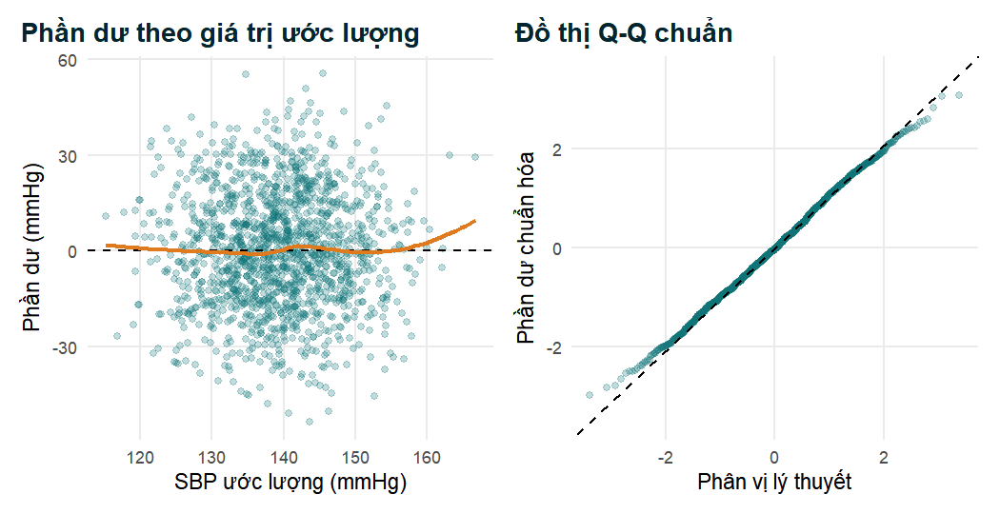
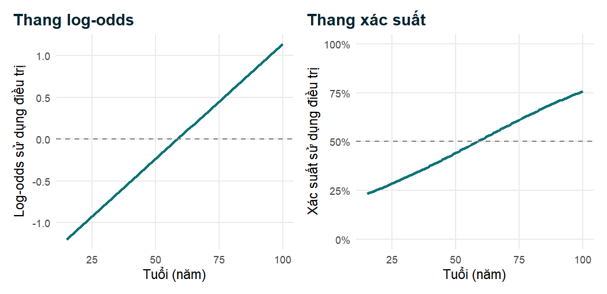
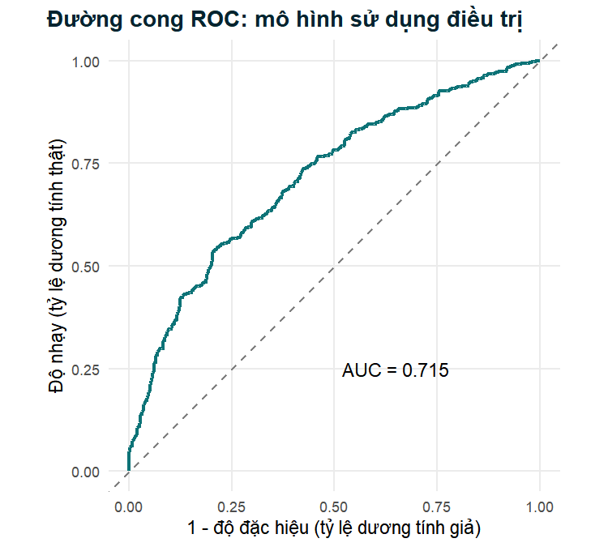
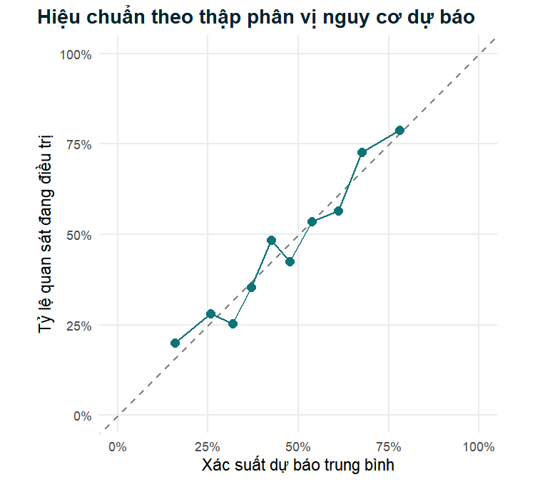
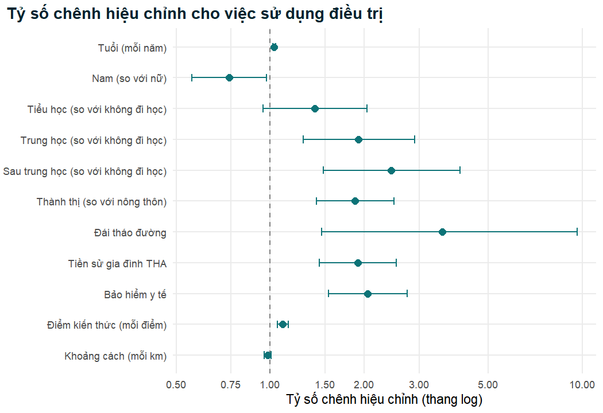

Ở Chương 4, chúng ta đặt ra từng câu hỏi một. Việc sử dụng điều trị có phổ
biến hơn ở những bệnh nhân có bảo hiểm y tế không? Bệnh nhân thành thị và
nông thôn có khác nhau không? Mỗi kiểm định so sánh các nhóm được xác định
bởi một biến duy nhất. Thực tế lâm sàng hiếm khi gọn gàng như vậy. Những
bệnh nhân có bảo hiểm y tế có thể đồng thời trẻ hơn, có trình độ học vấn cao
hơn hoặc sống gần cơ sở y tế hơn, và chính mỗi đặc điểm này lại có thể ảnh
hưởng đến việc một người bị tăng huyết áp có bắt đầu điều trị hay không. Nếu
muốn biết bảo hiểm có liên quan đến việc sử dụng điều trị *ngoài và vượt
lên trên* các yếu tố khác này hay không, chúng ta cần một phương pháp xem
xét nhiều biến cùng lúc. Phương pháp đó là hồi quy.

Hồi quy là công cụ chủ lực của nghiên cứu lâm sàng và dịch tễ học. Nó xuất
hiện trong hầu hết các nghiên cứu quan sát được công bố trên các tạp chí y
khoa, và là điểm đến tự nhiên của quá trình phân tích mà chúng ta đã xây
dựng từ Chương 1: chúng ta đã nhập và làm sạch dữ liệu tăng huyết áp, mô tả
mẫu nghiên cứu, kiểm định các giả thuyết đơn giản, và giờ đây chúng ta tập
hợp các yếu tố quyết định việc sử dụng điều trị vào một mô hình duy nhất.
Chương này giải thích cách các mô hình hồi quy hoạt động, cách xây dựng
(fit) và đọc chúng trong R, cách kiểm tra rằng chúng hợp lý, và cách chuyển
kết quả thành các bảng, hình và câu văn xuất hiện trong một bài báo khoa
học. Chương kết thúc với các thực hành giúp toàn bộ phân tích có thể tái
lập, để một người khác (hoặc chính bạn, một năm sau) có thể thu được chính
xác những kết quả như nhau.

::: {.callout-note .nb-objectives icon=false title="Mục tiêu học tập"}
- Giải thích ba mục đích của mô hình hồi quy (mô tả, dự báo và giải thích)
  và lý do mục đích định hình mô hình.
- Xây dựng và diễn giải mô hình hồi quy tuyến tính đa biến cho biến kết cục
  liên tục, bao gồm các hệ số, $R^2$ và kiểm tra phần dư.
- Chuyển đổi giữa xác suất, odds và log-odds, và giải thích vì sao hồi quy
  logistic mô hình hóa log-odds của một biến kết cục nhị phân.
- Xây dựng mô hình hồi quy logistic đa biến bằng `glm()`, đọc từng dòng kết
  quả của `summary()`, và báo cáo tỷ số chênh (odds ratio, OR) kèm khoảng
  tin cậy (confidence interval, CI) 95%.
- Phân biệt ước lượng thô với ước lượng hiệu chỉnh, nhận biết nhiễu, và
  tránh "ngụy biện Bảng 2" (Table 2 fallacy).
- Xây dựng mô hình dựa trên lập luận lâm sàng thay vì chọn biến tự động, và
  kiểm tra số biến cố trên mỗi biến, đa cộng tuyến, tính tuyến tính, khả
  năng phân biệt, hiệu chuẩn và các quan sát có ảnh hưởng.
- Tạo bảng hồi quy sẵn sàng cho công bố và biểu đồ rừng (forest plot), và
  viết một đoạn Kết quả theo khuyến nghị STROBE.
- Tổ chức phân tích sao cho có thể tái lập từ dữ liệu thô đến báo cáo.
:::

## 5.1 Vì sao cần hồi quy? {#sec-why-regression}

### 5.1.1 Từ từng biến một đến nhiều biến

Các kiểm định ở Chương 4 trả lời những câu hỏi dạng "biến kết cục có liên
quan đến *biến này* không?". Một mô hình hồi quy trả lời một câu hỏi phong
phú hơn: "biến kết cục liên quan đến biến này như thế nào, *khi đã biết*
giá trị của các biến khác?" Mô hình làm điều này bằng cách biểu diễn giá
trị kỳ vọng của biến kết cục (hoặc một phép biến đổi của nó) như một hàm
của nhiều biến dự báo đồng thời. Khi đó, mỗi hệ số trong mô hình mô tả mối
liên quan giữa một biến dự báo và biến kết cục trong khi các biến dự báo
khác được giữ cố định. Việc "giữ cố định" này là điều mà các nhà dịch tễ
học gọi là *hiệu chỉnh* (adjustment), và đó là lý do chính khiến hồi quy
được sử dụng trong nghiên cứu quan sát [@vittinghoff2012; @kirkwood2003].

Hồi quy cũng cung cấp nhiều hơn một giá trị p. Nó cho một *ước lượng* về
độ lớn của mỗi mối liên quan, kèm khoảng tin cậy mô tả độ chính xác của ước
lượng đó, và có thể đưa ra dự báo cho từng bệnh nhân. Như Chương 4 đã nhấn
mạnh, một ước lượng kèm khoảng tin cậy cung cấp nhiều thông tin hơn hẳn so
với một tuyên bố rằng kiểm định "có ý nghĩa" [@altman1991;
@wasserstein2016].

### 5.1.2 Mô tả, dự báo và giải thích

Trước khi xây dựng bất kỳ mô hình nào, bạn cần biết rõ mô hình đó *dùng để
làm gì*, vì mục đích quyết định những biến nào cần đưa vào và cách đánh giá
kết quả [@vittinghoff2012; @harrell2015].

- **Mô tả.** Mục tiêu là tóm tắt cách một biến kết cục thay đổi theo nhiều
  đặc điểm trong một quần thể, ví dụ tỷ lệ sử dụng điều trị khác nhau như
  thế nào theo tuổi, giới và nơi cư trú. Mô hình là một bản tóm tắt đa biến
  gọn gàng; không đưa ra kết luận nhân quả.
- **Dự báo.** Mục tiêu là ước lượng biến kết cục cho một cá nhân mới chính
  xác nhất có thể, chẳng hạn xác suất một bệnh nhân mới được chẩn đoán sẽ
  bắt đầu điều trị. Bất kỳ biến nào cải thiện độ chính xác dự báo đều được
  chào đón, dù nó có phải là nguyên nhân hay không. Mô hình được đánh giá
  bằng khả năng phân biệt và hiệu chuẩn trên dữ liệu *mới*, và cần hết sức
  cẩn thận để tránh quá khớp (overfitting) [@harrell2015].
- **Giải thích (căn nguyên).** Mục tiêu là ước lượng tác động của một phơi
  nhiễm cụ thể lên biến kết cục, ví dụ tác động của bảo hiểm y tế lên việc
  sử dụng điều trị. Các biến được đưa vào vì chúng là *yếu tố gây nhiễu*
  của mối quan hệ phơi nhiễm–kết cục đó, và việc lựa chọn được định hướng
  bởi kiến thức chuyên môn, thường được tóm tắt trong một sơ đồ nhân quả
  [@rothman2008; @greenland1999dag].

Nghiên cứu tình huống của chúng ta, *Các yếu tố quyết định việc sử dụng
điều trị tăng huyết áp ở người trưởng thành đến khám tại các cơ sở chăm sóc
sức khỏe ban đầu*, nằm giữa mô tả và giải thích. Chúng ta muốn biết những
đặc điểm nào của bệnh nhân và của khả năng tiếp cận có liên quan độc lập
với việc sử dụng điều trị, để có thể nhắm mục tiêu các dịch vụ. Vì vậy,
chương này xây dựng một mô hình đa biến duy nhất, được xác định trước, và
diễn giải các hệ số của nó như những *mối liên quan đã hiệu chỉnh*. Chúng
ta sẽ nhiều lần quay lại mối nguy hiểm của việc đọc chúng như những tác
động nhân quả.

::: {.callout-tip title="Thực hành tốt"}
Hãy ghi lại mục đích của mô hình và danh sách các biến bạn sẽ đưa vào trong
kế hoạch phân tích *trước khi* xem dữ liệu biến kết cục. Một mô hình dự
báo, một mô hình mô tả và một mô hình căn nguyên được xây dựng từ cùng một
bộ dữ liệu hoàn toàn có thể trông khá khác nhau một cách chính đáng.
:::

### 5.1.3 Một họ các mô hình hồi quy

Tất cả các mô hình trong chương này có chung một cấu trúc: một *bộ dự báo
tuyến tính* (linear predictor), tức là tổng có trọng số của các biến giải
thích,

$$
\eta = \beta_0 + \beta_1 x_1 + \beta_2 x_2 + \dots + \beta_k x_k ,
$$

được liên kết với giá trị kỳ vọng của biến kết cục thông qua một hàm được
chọn cho phù hợp với loại biến kết cục. Đây là các *mô hình tuyến tính tổng
quát* (generalised linear models, GLM) [@agresti2013]. Loại biến kết cục
quyết định mô hình, như được tóm tắt dưới đây.

Table: Chọn mô hình hồi quy theo loại biến kết cục.

| Loại biến kết cục | Ví dụ trong nghiên cứu | Mô hình | Thước đo tác động | Hàm R |
|---|---|---|---|---|
| Liên tục | Huyết áp tâm thu | Tuyến tính | Hiệu số trung bình | `lm()` |
| Nhị phân | Sử dụng điều trị (Yes/No) | Logistic | Tỷ số chênh | `glm(family = binomial)` |
| Đếm | Số bệnh đồng mắc | Poisson | Tỷ số tỷ suất | `glm(family = poisson)` |
| Thời gian đến biến cố | Thời gian đến khi bắt đầu điều trị | Cox | Tỷ số nguy hại | `survival::coxph()` |

Chương này trình bày chi tiết hai dòng đầu tiên. Một khi bạn đã hiểu hồi
quy tuyến tính và hồi quy logistic, các mô hình khác đều theo cùng một logic.

## 5.2 Chuẩn bị phân tích {#sec-setup}

Như ở mọi chương, chúng ta bắt đầu một phiên R mới bằng cách nạp các gói và
bộ dữ liệu phân tích đã làm sạch được tạo ở Chương 2.


``` r
library(tidyverse)   # dplyr, ggplot2, tidyr, ...
library(broom)       # tidy() và augment() cho các đối tượng mô hình
library(gtsummary)   # bảng hồi quy sẵn sàng cho công bố
library(car)         # vif() để đánh giá đa cộng tuyến
library(pROC)        # đường cong ROC và AUC
library(patchwork)   # ghép các khung đồ thị ggplot2
library(scales)      # định dạng trục
library(knitr)       # bảng kable()

analysis_data <- readRDS("Data/analysis_data.rds")
```

Biến kết cục chính, `treatment_uptake`, chỉ có ý nghĩa đối với những người
đã biết mình bị tăng huyết áp: một người chưa bao giờ được chẩn đoán thì
không thể "tiếp nhận" điều trị. Vì vậy, quần thể phân tích là những bệnh
nhân có `htn_diagnosed == "Yes"`.


``` r
dx <- analysis_data |>
  filter(htn_diagnosed == "Yes") |>
  # education được lưu dưới dạng factor CÓ THỨ TỰ (None < Primary < ...).
  # Khi hồi quy, ta chuyển thành factor thông thường để mỗi mức được
  # so sánh với nhóm tham chiếu "None" (giải thích bên dưới).
  mutate(education = factor(education, ordered = FALSE))

nrow(dx)                         # cỡ quần thể phân tích
```

```
#> [1] 1089
```

``` r
table(dx$treatment_uptake)       # phân bố của biến kết cục
```

```
#> 
#>  No Yes 
#> 581 508
```

``` r
levels(dx$treatment_uptake)      # mức đầu tiên = tham chiếu ("No")
```

```
#> [1] "No"  "Yes"
```

Trong số 1.089 bệnh nhân đã được chẩn đoán, 508 người (46,6%) đang điều trị
thuốc hạ huyết áp. Mức đầu tiên của factor biến kết cục là `"No"` (không),
nên các mô hình dưới đây ước lượng odds của việc *sử dụng điều trị*
(`"Yes"`, có), là biến cố quan tâm. Nếu thứ tự các mức bị đảo ngược, mọi tỷ
số chênh trong chương này sẽ bị nghịch đảo.

::: {.callout-warning title="Lỗi thường gặp"}
Factor có thứ tự (ordered factor) thuận tiện cho bảng và đồ thị, nhưng
trong hồi quy R mã hóa chúng bằng *tương phản đa thức trực giao*
(orthogonal polynomial contrasts). Khi đó kết quả chứa các số hạng tên là
`education.L`, `education.Q` và `education.C` (xu hướng tuyến tính, bậc hai
và bậc ba) thay vì một phép so sánh cho mỗi mức. Tỷ số chênh của chúng
không phải là "Primary so với None" hay "cho mỗi mức học vấn", và rất dễ bị
báo cáo sai. Trừ khi bạn thực sự muốn kiểm định xu hướng, hãy chuyển factor
có thứ tự bằng `factor(x, ordered = FALSE)` trước khi xây dựng mô hình, như
chúng ta đã làm ở trên.
:::

## 5.3 Hồi quy tuyến tính cho biến kết cục liên tục {#sec-linear}

Hồi quy tuyến tính là mô hình hồi quy đơn giản nhất và là nền tảng cho mọi
mô hình khác, vì vậy chúng ta bắt đầu với nó, sử dụng huyết áp tâm thu
(systolic blood pressure, SBP) làm biến kết cục. Vì SBP được đo ở tất cả mọi
người, chúng ta dùng toàn bộ mẫu 1.500 người trưởng thành cho mục này.

### 5.3.1 Mô hình hồi quy tuyến tính đơn

Với một biến dự báo $x$ (chẳng hạn chỉ số khối cơ thể, BMI), mô hình hồi
quy tuyến tính đơn cho bệnh nhân $i$ là

$$
y_i = \beta_0 + \beta_1 x_i + \varepsilon_i ,
\qquad \varepsilon_i \sim N(0, \sigma^2) .
$$

Ở đây $\beta_0$ là *hệ số chặn* (intercept; trung bình của $y$ khi
$x = 0$), $\beta_1$ là *hệ số góc* (slope; mức thay đổi của trung bình $y$
khi $x$ tăng một đơn vị), và $\varepsilon_i$ là sai số ngẫu nhiên: phần
huyết áp của bệnh nhân $i$ không được giải thích bởi BMI. Các sai số được
giả định là độc lập và có phân phối chuẩn với phương sai không đổi
$\sigma^2$.

Các hệ số được ước lượng bằng phương pháp *bình phương tối thiểu thông
thường* (ordinary least squares, OLS): chúng ta chọn $\hat\beta_0$ và
$\hat\beta_1$ sao cho tổng bình phương các khoảng cách theo chiều dọc giữa
các điểm quan sát và đường thẳng ước lượng là nhỏ nhất,

$$
\text{minimise} \quad \sum_{i=1}^{n} \left(y_i - \beta_0 - \beta_1 x_i\right)^2 ,
$$

từ đó cho nghiệm dạng tường minh

$$
\hat\beta_1 = \frac{\sum_{i}(x_i - \bar x)(y_i - \bar y)}{\sum_{i}(x_i - \bar x)^2},
\qquad
\hat\beta_0 = \bar y - \hat\beta_1 \bar x .
$$

Do đó hệ số góc có liên hệ chặt chẽ với hệ số tương quan Pearson ở
Chương 4: $\hat\beta_1 = r \, s_y / s_x$ [@altman1991; @bland2015].


``` r
# Hồi quy tuyến tính đơn: SBP (mmHg) theo BMI (kg/m^2)
lm_simple <- lm(sbp_mmhg ~ bmi, data = analysis_data)
coef(lm_simple)
```

```
#> (Intercept)         bmi 
#>     101.467       1.435
```

Đường thẳng ước lượng là $\widehat{\text{SBP}} =
101.5 + 1.44
\times \text{BMI}$. Mỗi kg/m² BMI tăng thêm có liên quan đến SBP trung bình
cao hơn khoảng 1.44 mmHg. Hệ số chặn là SBP dự
báo tại BMI bằng không, một giá trị bất khả về mặt sinh học; nó cần thiết
để định vị đường thẳng nhưng không có ý nghĩa lâm sàng. Điều này rất phổ
biến, và đó là một lý do khiến một số nhà phân tích *định tâm* (centre) các
biến dự báo liên tục (trừ đi một giá trị điển hình như trung bình) trước khi
xây dựng mô hình.

### 5.3.2 Hồi quy tuyến tính đa biến

Huyết áp tăng theo tuổi, và BMI cũng có thể khác nhau theo tuổi, vì vậy
chúng ta thêm tuổi vào mô hình. Với $k$ biến dự báo, mô hình trở thành

$$
y_i = \beta_0 + \beta_1 x_{1i} + \beta_2 x_{2i} + \dots + \beta_k x_{ki}
+ \varepsilon_i ,
$$

hoặc, dưới dạng ma trận, $\mathbf{y} = \mathbf{X}\boldsymbol\beta +
\boldsymbol\varepsilon$, với nghiệm bình phương tối thiểu
$\hat{\boldsymbol\beta} = (\mathbf{X}^\top\mathbf{X})^{-1}
\mathbf{X}^\top\mathbf{y}$. Bạn sẽ không bao giờ phải tính tay công thức
này, nhưng nó làm rõ một điểm: mỗi hệ số được ước lượng bằng cách sử dụng
tất cả các biến dự báo cùng nhau, nên giá trị của nó phụ thuộc vào những
biến nào khác có trong mô hình. Mỗi $\beta_j$ là hiệu số kỳ vọng của $y$
giữa hai người khác nhau một đơn vị về $x_j$ nhưng có *cùng giá trị* ở tất
cả các biến dự báo khác [@vittinghoff2012].


``` r
lm_sbp <- lm(sbp_mmhg ~ age + bmi, data = analysis_data)
summary(lm_sbp)
```

```
#> 
#> Call:
#> lm(formula = sbp_mmhg ~ age + bmi, data = analysis_data)
#> 
#> Residuals:
#>    Min     1Q Median     3Q    Max 
#> -53.66 -12.69  -0.51  12.50  55.50 
#> 
#> Coefficients:
#>             Estimate Std. Error t value Pr(>|t|)    
#> (Intercept)  87.4657     3.1789   27.51  < 2e-16 ***
#> age           0.2593     0.0336    7.71  2.3e-14 ***
#> bmi           1.4510     0.0975   14.87  < 2e-16 ***
#> ---
#> Signif. codes:  0 '***' 0.001 '**' 0.01 '*' 0.05 '.' 0.1 ' ' 1
#> 
#> Residual standard error: 18.1 on 1446 degrees of freedom
#>   (51 observations deleted due to missingness)
#> Multiple R-squared:  0.161,	Adjusted R-squared:  0.159 
#> F-statistic:  138 on 2 and 1446 DF,  p-value: <2e-16
```

Chúng ta hãy đọc kết quả này từ trên xuống dưới.

- **Call** nhắc lại công thức mô hình và dữ liệu, điều này hữu ích khi bạn
  đã xây dựng nhiều mô hình.
- **Residuals** tóm tắt các hiệu số giữa SBP quan sát và SBP ước lượng.
  Trung vị gần bằng không và các tứ phân vị gần như đối xứng (khoảng
  $\pm 12.6$ mmHg), đúng như kỳ vọng nếu các sai số đối xứng quanh không.
- **Coefficients** là phần cốt lõi của kết quả. Với mỗi số hạng có ước
  lượng, sai số chuẩn (standard error, SE), thống kê $t$ (ước lượng chia cho
  SE) và giá trị p hai phía cho giả thuyết không rằng hệ số thực bằng không.
  - `(Intercept)` 87,5 mmHg là SBP dự báo cho một người 0 tuổi có BMI bằng
    0, một lần nữa không có ý nghĩa lâm sàng.
  - `age` 0,26: khi giữ BMI cố định, mỗi năm tuổi tăng thêm có liên quan
    đến SBP trung bình cao hơn 0,26 mmHg; qua mười năm là khoảng 2,6 mmHg.
  - `bmi` 1,45: ở những người cùng tuổi, mỗi kg/m² tăng thêm có liên quan
    đến SBP trung bình cao hơn 1,45 mmHg; chênh lệch 5 kg/m² tương ứng với
    khoảng 7,3 mmHg.
- **Residual standard error** (sai số chuẩn của phần dư, 18,1 mmHg) ước
  lượng $\sigma$, khoảng cách điển hình từ một quan sát đến giá trị ước
  lượng của nó. Giá trị này lớn so với các hệ số: tuổi và BMI chỉ giải thích
  một phần sự biến thiên của huyết áp.
- **`(51 observations deleted due to missingness)`** (51 quan sát bị loại do
  dữ liệu khuyết) nhắc chúng ta rằng `lm()` âm thầm loại bỏ mọi dòng có giá
  trị khuyết ở bất kỳ biến nào trong mô hình. Mô hình được xây dựng trên
  1.449 người, không phải 1.500.
- **Multiple R-squared** (0,16) là tỷ lệ phương sai của SBP được mô hình
  giải thích,
  $R^2 = 1 - \sum_i (y_i - \hat y_i)^2 / \sum_i (y_i - \bar y)^2$. $R^2$
  **hiệu chỉnh** (adjusted) áp dụng một mức phạt nhỏ cho số lượng biến dự
  báo.
- **F-statistic** kiểm định giả thuyết không rằng *tất cả* các hệ số góc
  đều bằng không. Với $p < 2.2 \times 10^{-16}$, chúng ta kết luận rằng tuổi
  và BMI cùng nhau giải thích được một phần biến thiên của SBP.

::: {.callout-note title="Diễn giải lâm sàng"}
$R^2$ bằng 0,16 không có nghĩa là mô hình vô dụng. Trong một phân tích giải
thích, chúng ta quan tâm đến các *hệ số*: chênh lệch khoảng 7 mmHg về SBP
trung bình cho mỗi 5 kg/m² BMI, độc lập với tuổi, là quan trọng về mặt lâm
sàng ở cấp độ quần thể. $R^2$ thấp chỉ cho biết huyết áp của từng cá nhân
phụ thuộc vào nhiều yếu tố khác (di truyền, lượng muối ăn vào, thuốc, sai
số đo lường) không có trong mô hình.
:::

Để dễ trích dẫn các hệ số hơn, chúng ta có thể yêu cầu khoảng tin cậy (KTC) và
đổi thang đo của tuổi sang một đơn vị có ý nghĩa hơn.


``` r
tidy(lm_sbp, conf.int = TRUE) |>
  select(term, estimate, conf.low, conf.high, p.value) |>
  mutate(across(estimate:conf.high, \(x) round(x, 3)),
         p.value = signif(p.value, 2))
```

```
#> # A tibble: 3 × 5
#>   term        estimate conf.low conf.high   p.value
#>   <chr>          <dbl>    <dbl>     <dbl>     <dbl>
#> 1 (Intercept)   87.5     81.2      93.7   2.20e-134
#> 2 age            0.259    0.193     0.325 2.3 e- 14
#> 3 bmi            1.45     1.26      1.64  1.10e- 46
```

``` r
# Cho mỗi 10 năm tuổi: nhân hệ số của tuổi và KTC của nó với 10
age10 <- 10 * c(coef(lm_sbp)["age"], confint(lm_sbp)["age", ])
round(age10, 2)
```

```
#>    age  2.5 % 97.5 % 
#>   2.59   1.93   3.25
```

Chúng ta sẽ báo cáo: "Mỗi 10 năm tuổi tăng thêm có liên quan đến SBP trung
bình cao hơn 2.6 mmHg (KTC 95%
1.9 đến 3.3), sau khi
hiệu chỉnh theo BMI."

### 5.3.3 Các giả định và kiểm tra phần dư

Các suy luận từ một mô hình tuyến tính (sai số chuẩn, khoảng tin cậy, giá
trị p) dựa trên bốn giả định, dễ nhớ theo chữ viết tắt tiếng Anh **LINE**
[@vittinghoff2012; @kirkwood2003]:

1. **L**inearity (tính tuyến tính): trung bình của $y$ thay đổi tuyến tính
   theo mỗi biến dự báo liên tục (khi đã biết các biến khác).
2. **I**ndependence (tính độc lập): sai số của các bệnh nhân khác nhau độc
   lập với nhau. Đây là một đặc tính của thiết kế nghiên cứu; các phép đo
   lặp lại trên cùng một bệnh nhân, hoặc bệnh nhân được nhóm theo cơ sở y
   tế, có thể vi phạm giả định này.
3. **N**ormality (tính chuẩn): các sai số có phân phối xấp xỉ chuẩn. Với
   mẫu lớn, định lý giới hạn trung tâm khiến các hệ số có phân phối xấp xỉ
   chuẩn ngay cả khi sai số không chuẩn, nên giả định này quan trọng nhất
   với mẫu nhỏ và với khoảng dự báo.
4. **E**qual variance (phương sai bằng nhau, homoscedasticity): độ phân tán
   của các sai số không thay đổi theo giá trị ước lượng.

Chúng ta kiểm tra các giả định này bằng *phần dư* (residuals),
$e_i = y_i - \hat y_i$. Có hai đồ thị tiêu chuẩn: phần dư theo giá trị ước
lượng (để kiểm tra tính tuyến tính và phương sai bằng nhau) và đồ thị Q–Q
chuẩn của phần dư (để kiểm tra tính chuẩn). `broom::augment()` trả về các
giá trị ước lượng và phần dư trong một khung dữ liệu thuận tiện cho
`ggplot2`.


``` r
lm_aug <- augment(lm_sbp)      # mỗi dòng = một bệnh nhân trong mô hình

p_resfit <- ggplot(lm_aug, aes(x = .fitted, y = .resid)) +
  geom_point(alpha = 0.25, colour = "#0D7377") +
  geom_hline(yintercept = 0, linetype = "dashed") +
  geom_smooth(method = "loess", se = FALSE, colour = "#E07A1F") +
  labs(title = "Phần dư theo giá trị ước lượng",
       x = "SBP ước lượng (mmHg)", y = "Phần dư (mmHg)")

p_qq <- ggplot(lm_aug, aes(sample = .std.resid)) +
  stat_qq(alpha = 0.25, colour = "#0D7377") +
  stat_qq_line(linetype = "dashed") +
  labs(title = "Đồ thị Q-Q chuẩn",
       x = "Phân vị lý thuyết", y = "Phần dư chuẩn hóa")

p_resfit + p_qq
```



Ở khung bên trái, các điểm tạo thành một dải nằm ngang có độ rộng gần như
không đổi, tập trung quanh không, và đường cong làm trơn gần như phẳng,
ngoại trừ một chút đi lên ở các giá trị ước lượng cao nhất, nơi có ít bệnh
nhân và đường làm trơn không ổn định. Không có dấu hiệu thuyết phục nào về
độ cong (điều sẽ gợi ý thiếu một số hạng phi tuyến) hay hình phễu (điều sẽ
gợi ý phương sai không bằng nhau). Ở khung bên phải, các điểm bám sát đường
tham chiếu, chỉ lệch nhẹ ở hai đuôi. Các giả định có vẻ hợp lý.

::: {.callout-tip title="Thực hành tốt"}
Hãy nhìn đồ thị phần dư, đừng kiểm định chúng. Các kiểm định chính thức về
tính chuẩn bác bỏ những sai lệch không đáng kể ở mẫu lớn và bỏ sót những
sai lệch quan trọng ở mẫu nhỏ [@altman1995normal]. Nếu đồ thị cho thấy một
dạng cong, hãy cân nhắc thêm một số hạng phi tuyến (ví dụ bậc hai hoặc
spline của tuổi); nếu nó cho thấy hình phễu, hãy cân nhắc biến đổi biến kết
cục hoặc dùng sai số chuẩn vững (robust standard errors).
:::

## 5.4 Biến kết cục nhị phân: xác suất, odds và log-odds {#sec-odds}

Biến kết cục chính của chúng ta, việc sử dụng điều trị, là biến nhị phân:
mỗi bệnh nhân hoặc đang điều trị ($y = 1$) hoặc không ($y = 0$). Hồi quy
tuyến tính không phù hợp ở đây. Một đường thẳng theo $x$ có thể dự báo
"xác suất" nhỏ hơn 0 hoặc lớn hơn 1, phương sai của một biến nhị phân phụ
thuộc vào trung bình của nó (nên giả định phương sai bằng nhau không thỏa
mãn), và các sai số không thể có phân phối chuẩn. Chúng ta cần một thang đo
mà trên đó mô hình tuyến tính có ý nghĩa. Thang đo đó là log-odds.

### 5.4.1 Ba cách biểu diễn cùng một nguy cơ

Gọi $p$ là xác suất một bệnh nhân sử dụng điều trị. *Odds* của việc sử dụng
điều trị là xác suất sử dụng chia cho xác suất không sử dụng,

$$
\text{odds} = \frac{p}{1-p},
\qquad\text{and conversely}\qquad
p = \frac{\text{odds}}{1+\text{odds}} .
$$

Odds quen thuộc trong cá cược: odds bằng 3 ("3 ăn 1") nghĩa là khả năng
biến cố xảy ra gấp ba lần khả năng không xảy ra, tương ứng với xác suất
$3/4 = 0.75$. Trong khi xác suất bị giới hạn trong $[0, 1]$, odds nằm trong
khoảng từ 0 đến vô cùng. Lấy logarit tự nhiên ta được *log-odds* hay
*logit*,

$$
\operatorname{logit}(p) = \log\!\left(\frac{p}{1-p}\right),
$$

có giá trị trải trên toàn bộ trục số thực, từ $-\infty$ đến $+\infty$, và
đối xứng quanh không: xác suất 0,5 có odds bằng 1 và log-odds bằng 0.

Table: Cùng một nguy cơ được biểu diễn dưới dạng xác suất, odds và log-odds.

| Xác suất $p$ | Odds $p/(1-p)$ | Log-odds | Diễn giải |
|---|---|---|---|
| 0.10 | 0.11 | $-2.20$ | 1 lần thành công trên 9 lần thất bại |
| 0.25 | 0.33 | $-1.10$ | 1 trên 3 |
| 0.50 | 1.00 | 0.00 | Khả năng ngang nhau |
| 0.75 | 3.00 | 1.10 | 3 trên 1 |
| 0.90 | 9.00 | 2.20 | 9 trên 1 |

### 5.4.2 Tỷ số chênh

Để so sánh hai nhóm, chúng ta lấy tỷ số odds của chúng. Nếu $p_1$ là xác
suất sử dụng điều trị ở bệnh nhân có bảo hiểm và $p_0$ ở bệnh nhân không có
bảo hiểm, thì *tỷ số chênh* (odds ratio, OR) là

$$
\text{OR} = \frac{p_1/(1-p_1)}{p_0/(1-p_0)} .
$$

OR bằng 1 nghĩa là không có mối liên quan; lớn hơn 1 nghĩa là odds của biến
kết cục cao hơn ở nhóm thứ nhất; nhỏ hơn 1 nghĩa là odds thấp hơn
[@bland2000oddsratio]. Chúng ta hãy tính tay OR cho bảo hiểm y tế.


``` r
tab_ins <- table(Insurance = dx$health_insurance,
                 Uptake    = dx$treatment_uptake)
tab_ins
```

```
#>          Uptake
#> Insurance  No Yes
#>       No  419 306
#>       Yes 162 202
```

``` r
# Xác suất, odds và log-odds của việc sử dụng điều trị ở mỗi nhóm bảo hiểm
ins_summary <- dx |>
  group_by(health_insurance) |>
  summarise(n = n(),
            p_uptake = mean(treatment_uptake == "Yes")) |>
  mutate(odds = p_uptake / (1 - p_uptake),
         log_odds = log(odds))
kable(ins_summary, digits = 3,
      caption = paste("Sử dụng điều trị theo tình trạng bảo hiểm y tế",
                      "(bệnh nhân đã được chẩn đoán)."))
```


Table: Sử dụng điều trị theo tình trạng bảo hiểm y tế (bệnh nhân đã được chẩn đoán).

|health_insurance |   n| p_uptake|  odds| log_odds|
|:----------------|---:|--------:|-----:|--------:|
|No               | 725|    0.422| 0.730|   -0.314|
|Yes              | 364|    0.555| 1.247|    0.221|

``` r
# Tỷ số chênh thô: odds ở nhóm có bảo hiểm / odds ở nhóm không có bảo hiểm
or_ins <- ins_summary$odds[2] / ins_summary$odds[1]
round(or_ins, 2)
```

```
#> [1] 1.71
```


Trong số bệnh nhân không có bảo hiểm, 42.2% đang điều
trị (odds 0.73); trong số bệnh nhân có bảo
hiểm, tỷ lệ này là 55.5% (odds
1.25). Odds sử dụng điều trị ở nhóm có bảo hiểm
cao gấp 1.71 lần. Hãy chú ý cột cuối cùng của bảng: *hiệu
số* log-odds, 0.221 $-$
(-0.314) $=$ 0.535, chính
là logarit của tỷ số chênh. Đây là chìa khóa của hồi quy logistic: một hiệu
số trên thang log-odds là một log tỷ số chênh, và lấy hàm mũ của nó cho ta
tỷ số chênh.

### 5.4.3 Tỷ số chênh so với nguy cơ tương đối

Các bác sĩ lâm sàng thường suy nghĩ theo nguy cơ, và *nguy cơ tương đối*
(relative risk, hay tỷ số nguy cơ, risk ratio, RR) $p_1 / p_0$ là thước đo
trực quan hơn. Ở đây RR là 0.555 / 0.422 $=$
1.31, nhỏ hơn đáng kể so với OR là 1.71. Hai
thước đo này chỉ gần nhau khi biến kết cục hiếm gặp (chẳng hạn dưới 10%) ở
cả hai nhóm, vì khi đó $1 - p \approx 1$ và odds xấp xỉ nguy cơ
[@bland2000oddsratio; @rothman2008]. Khi biến kết cục phổ biến, như ở đây
(gần một nửa số bệnh nhân đang điều trị), OR luôn cách xa 1 hơn RR.

@zhang1998 đã đề xuất một cách chuyển đổi đơn giản từ OR sang RR xấp xỉ,
khi biết nguy cơ $p_0$ ở nhóm tham chiếu:

$$
\text{RR} \approx \frac{\text{OR}}{(1 - p_0) + p_0 \times \text{OR}} .
$$

Với $p_0 = 0.422$ và OR $= 1.71$, công thức
cho kết quả 1.31, tái tạo
chính xác RR thô. Với các tỷ số chênh hiệu chỉnh, phép chuyển đổi này chỉ
mang tính xấp xỉ, và các phương pháp khác (như hồi quy log-binomial hoặc
hồi quy Poisson với sai số chuẩn vững) được ưu tiên nếu mục tiêu là RR hiệu
chỉnh.

::: {.callout-warning title="Lỗi thường gặp"}
Đừng mô tả tỷ số chênh bằng 2,0 là "nguy cơ gấp đôi" hay "khả năng gấp đôi"
khi biến kết cục phổ biến. Với tỷ lệ sử dụng điều trị khoảng 40% ở nhóm
tham chiếu, OR bằng 2,0 chỉ tương ứng với tỷ số nguy cơ khoảng 1,4. Hãy nói
"odds gấp đôi", và nếu người đọc cần nguy cơ, hãy báo cáo thêm xác suất dự
báo hoặc tỷ số nguy cơ.
:::

Vậy thì tại sao chúng ta lại dùng tỷ số chênh? Có ba lý do chính đáng. Thứ
nhất, mô hình logistic làm cơ sở cho chúng luôn cho ra các xác suất hợp lệ
nằm giữa 0 và 1. Thứ hai, OR có tính đối xứng: OR của việc sử dụng điều trị
là nghịch đảo của OR của việc không sử dụng điều trị, điều không đúng với
RR. Thứ ba, OR có thể được ước lượng từ các nghiên cứu bệnh–chứng, nơi
không thể ước lượng nguy cơ [@rothman2008; @hosmer2013].

## 5.5 Mô hình hồi quy logistic {#sec-logistic-model}

### 5.5.1 Phương trình của mô hình

Hồi quy logistic mô hình hóa log-odds của biến kết cục như một hàm tuyến
tính của các biến dự báo [@hosmer2013; @agresti2013]:

$$
\operatorname{logit}(p_i) =
\log\!\left(\frac{p_i}{1-p_i}\right) =
\beta_0 + \beta_1 x_{1i} + \beta_2 x_{2i} + \dots + \beta_k x_{ki},
$$

trong đó $p_i = \Pr(y_i = 1 \mid x_{1i}, \dots, x_{ki})$ là xác suất sử
dụng điều trị của bệnh nhân $i$. Giải phương trình theo $p_i$ ta được *hàm
logistic*,

$$
p_i = \frac{\exp(\beta_0 + \beta_1 x_{1i} + \dots + \beta_k x_{ki})}
{1 + \exp(\beta_0 + \beta_1 x_{1i} + \dots + \beta_k x_{ki})} ,
$$

một đường cong hình chữ S luôn nằm giữa 0 và 1. Phương trình không có số
hạng sai số: tính ngẫu nhiên nằm ở chính biến kết cục, được giả định tuân
theo phân phối Bernoulli với xác suất $p_i$.

Hình dưới đây cho thấy hai bộ mặt của mô hình với một biến dự báo duy nhất
là tuổi. Trên thang log-odds (bên trái), mối quan hệ là một đường thẳng;
trên thang xác suất (bên phải), cùng mô hình đó là một đường cong hình chữ
S thoai thoải.


``` r
glm_age <- glm(treatment_uptake ~ age, data = dx, family = binomial)

# Dự báo trên một khoảng tuổi rộng, theo cả hai thang đo
age_grid <- tibble(age = seq(15, 100, by = 1))
age_grid <- age_grid |>
  mutate(log_odds = predict(glm_age, newdata = age_grid, type = "link"),
         prob     = predict(glm_age, newdata = age_grid, type = "response"))

p_link <- ggplot(age_grid, aes(age, log_odds)) +
  geom_line(linewidth = 1, colour = "#0D7377") +
  geom_hline(yintercept = 0, linetype = "dashed", colour = "grey50") +
  labs(title = "Thang log-odds", x = "Tuổi (năm)",
       y = "Log-odds sử dụng điều trị")

p_prob <- ggplot(age_grid, aes(age, prob)) +
  geom_line(linewidth = 1, colour = "#0D7377") +
  geom_hline(yintercept = 0.5, linetype = "dashed", colour = "grey50") +
  scale_y_continuous(labels = percent, limits = c(0, 1)) +
  labs(title = "Thang xác suất", x = "Tuổi (năm)",
       y = "Xác suất sử dụng điều trị")

p_link + p_prob
```



### 5.5.2 Ước lượng bằng hợp lý cực đại

Phương pháp bình phương tối thiểu không phù hợp với biến kết cục nhị phân.
Thay vào đó, các hệ số được ước lượng bằng phương pháp *hợp lý cực đại*
(maximum likelihood): chúng ta chọn các giá trị của $\boldsymbol\beta$ làm
cho dữ liệu quan sát được có khả năng xảy ra cao nhất. Với bệnh nhân $i$,
xác suất của kết cục quan sát được là $p_i$ nếu $y_i = 1$ và $1 - p_i$ nếu
$y_i = 0$, có thể viết gọn là $p_i^{y_i}(1-p_i)^{1-y_i}$. Giả sử các bệnh
nhân độc lập, hàm hợp lý (likelihood) là tích trên tất cả bệnh nhân, và làm
việc với logarit của nó sẽ dễ dàng hơn:

$$
\ell(\boldsymbol\beta) = \sum_{i=1}^{n}
\Big[\, y_i \log p_i + (1-y_i)\log(1-p_i) \Big],
$$

trong đó mỗi $p_i$ phụ thuộc vào $\boldsymbol\beta$ thông qua hàm logistic.
Không có nghiệm dạng tường minh; R cực đại hóa $\ell$ bằng phương pháp số
với một thuật toán gọi là *bình phương tối thiểu có trọng số lặp lại*
(iteratively reweighted least squares, còn gọi là Fisher scoring), thường
hội tụ sau một vài vòng lặp [@agresti2013; @hosmer2013].

Hai đại lượng được suy ra từ hàm hợp lý xuất hiện trong kết quả của R và
được dùng để kiểm định.

- **Độ lệch** (deviance) của một mô hình là
  $D = -2\ell(\hat{\boldsymbol\beta})$ (so với một mô hình bão hòa khớp
  hoàn hảo mọi quan sát). Độ lệch càng nhỏ nghĩa là mô hình càng khớp tốt.
  *Độ lệch rỗng* (null deviance) là độ lệch của mô hình chỉ có hệ số chặn;
  *độ lệch phần dư* (residual deviance) là độ lệch của mô hình đã xây dựng.
- **Kiểm định tỷ số hợp lý** (likelihood-ratio test, LR) so sánh hai mô
  hình *lồng nhau* (nested), trong đó mô hình nhỏ hơn là một trường hợp đặc
  biệt của mô hình lớn hơn. Hiệu số độ lệch,
  $D_{\text{small}} - D_{\text{large}}$, tuân theo xấp xỉ phân phối
  $\chi^2$ với số bậc tự do bằng số tham số bổ sung trong mô hình lớn hơn.

Mỗi hệ số riêng lẻ cũng đi kèm với một **kiểm định Wald**,
$z = \hat\beta_j / \text{SE}(\hat\beta_j)$, được so sánh với phân phối
chuẩn tắc. Kiểm định Wald và kiểm định LR thường cho kết quả thống nhất ở
mẫu lớn; khi chúng khác nhau (mẫu nhỏ, các nhóm thưa, tác động rất lớn),
kiểm định LR đáng tin cậy hơn [@hosmer2013; @agresti2013].

### 5.5.3 Diễn giải các hệ số dưới dạng tỷ số chênh

Xét hai bệnh nhân giống hệt nhau ở mọi biến dự báo ngoại trừ $x_1$, mà ở
người thứ hai cao hơn một đơn vị. Trừ hai bộ dự báo tuyến tính của họ cho
nhau, mọi số hạng đều triệt tiêu trừ một:

$$
\operatorname{logit}(p_{\text{second}}) - \operatorname{logit}(p_{\text{first}})
= \beta_1 .
$$

Một hiệu số log-odds là logarit của một tỷ số chênh, do đó

$$
\text{OR}_{x_1} = \exp(\beta_1).
$$

Đây là kết quả trung tâm cho việc diễn giải [@hosmer2013]:
**$\exp(\beta_j)$ là tỷ số chênh ứng với mức tăng một đơn vị của $x_j$, khi
giữ cố định các biến dự báo khác.** Vì mô hình tuyến tính trên thang
log-odds, OR này là như nhau bất kể giá trị xuất phát của $x_j$ và bất kể
giá trị của các biến dự báo khác (trừ khi có số hạng tương tác; xem
Mục 5.7).

Cách định nghĩa "một đơn vị" phụ thuộc vào loại biến dự báo.

- **Biến dự báo nhị phân** (ví dụ đái tháo đường, mã hóa No = 0, Yes = 1).
  $\exp(\beta)$ là OR so sánh bệnh nhân có đái tháo đường với bệnh nhân
  không có, là nhóm tham chiếu.
- **Biến dự báo phân loại có nhiều mức** (ví dụ học vấn: None, Primary,
  Secondary, Tertiary — không đi học, tiểu học, trung học, sau trung học).
  R tạo một biến chỉ thị ("biến giả", dummy) cho mỗi mức không phải tham
  chiếu. Mỗi $\exp(\beta)$ so sánh mức đó với mức tham chiếu (None), chứ
  không phải với mức ngay bên dưới.
- **Biến dự báo liên tục** (ví dụ tuổi tính bằng năm). $\exp(\beta)$ là OR
  cho mỗi đơn vị tăng (mỗi năm). Chênh lệch một năm hiếm khi đáng quan tâm
  về mặt lâm sàng, nên chúng ta thường báo cáo OR cho một mức tăng $c$ có ý
  nghĩa, chẳng hạn 10 năm:

$$
\text{OR}_{c\text{ units}} = \exp(c\,\beta) = \left[\exp(\beta)\right]^c ,
$$

với khoảng tin cậy $\exp\!\big(c\,\hat\beta \pm 1.96\, c\,
\text{SE}(\hat\beta)\big)$. Lưu ý rằng OR cho 10 năm là OR mỗi năm lũy thừa
10, chứ không phải nhân với 10.

### 5.5.4 Các giả định của hồi quy logistic

Hồi quy logistic đòi hỏi ít giả định hơn hồi quy tuyến tính, nhưng các giả
định đó không hề tầm thường [@hosmer2013; @vittinghoff2012]:

1. **Hàm liên kết đúng và tính tuyến tính trên thang logit.** Mỗi biến dự
   báo liên tục có quan hệ tuyến tính với *log-odds* của biến kết cục
   (không phải với xác suất). Có thể kiểm tra điều này bằng cách thêm các
   số hạng phi tuyến.
2. **Tính độc lập.** Kết cục của các bệnh nhân khác nhau là độc lập với
   nhau khi đã biết các biến dự báo. Việc bệnh nhân tập trung theo cơ sở y
   tế là một khả năng vi phạm mà chúng ta sẽ thảo luận ở Mục 5.8.
3. **Không có tách biệt hoàn toàn** (perfect separation). Không có biến dự
   báo nào (hoặc tổ hợp biến nào) dự báo hoàn hảo biến kết cục. Chẳng hạn,
   nếu mọi bệnh nhân đái tháo đường đều đang điều trị, ước lượng hợp lý cực
   đại của hệ số đái tháo đường sẽ là vô hạn; R cảnh báo "fitted
   probabilities numerically 0 or 1 occurred" (xuất hiện xác suất ước lượng
   bằng 0 hoặc 1 về mặt số học) và báo cáo một hệ số cùng sai số chuẩn rất
   lớn.
4. **Cỡ mẫu đủ lớn.** Các ước lượng hợp lý cực đại chỉ xấp xỉ không chệch
   và có phân phối chuẩn ở mẫu lớn; số *biến cố* so với số tham số là điều
   quan trọng (Mục 5.8).

Không có giả định rằng các biến dự báo có phân phối chuẩn, và cũng không có
giả định phương sai bằng nhau.

## 5.6 Xây dựng mô hình logistic trong R {#sec-fit}

### 5.6.1 Mô hình đầu tiên với một biến dự báo

Hồi quy logistic được xây dựng trong R bằng `glm()`, hàm dành cho các mô
hình tuyến tính tổng quát, bằng cách chỉ định `family = binomial` (hàm liên
kết logit là mặc định). Biến kết cục có thể là một factor, khi đó mức đầu
tiên được coi là 0 (thất bại) và mọi mức khác là 1 (thành công). Chúng ta
bắt đầu với mô hình thô cho bảo hiểm y tế và kiểm tra rằng nó tái tạo đúng
tỷ số chênh đã tính tay.


``` r
glm_ins <- glm(treatment_uptake ~ health_insurance,
               data = dx, family = binomial(link = "logit"))
coef(glm_ins)          # thang log-odds
```

```
#>         (Intercept) health_insuranceYes 
#>             -0.3143              0.5350
```

``` r
exp(coef(glm_ins))     # thang odds
```

```
#>         (Intercept) health_insuranceYes 
#>              0.7303              1.7074
```

Hệ số chặn, -0.314, là log-odds sử dụng điều trị ở
nhóm tham chiếu (không có bảo hiểm); lấy hàm mũ, nó là odds
0.73 mà chúng ta đã thấy trong bảng. Hệ số
của `health_insuranceYes`, 0.535, là hiệu số
log-odds giữa bệnh nhân có và không có bảo hiểm, và hàm mũ của nó,
1.71, chính xác là OR thô đã tính tay. Một
mô hình hồi quy logistic với một biến dự báo đơn giản chỉ là cách biểu diễn
lại một bảng $2 \times 2$.

### 5.6.2 Mô hình đa biến

Bây giờ chúng ta xây dựng mô hình chính của nghiên cứu. Các biến dự báo đã
được chọn *trước khi* phân tích dựa trên cơ sở lâm sàng và y tế công cộng
(Mục 5.8 giải thích vì sao điều này quan trọng):

- các đặc điểm nhân khẩu học thường gây nhiễu việc sử dụng dịch vụ y tế:
  tuổi, giới, học vấn và nơi cư trú;
- các yếu tố lâm sàng làm tăng tiếp xúc với dịch vụ y tế: đái tháo đường
  và tiền sử gia đình bị tăng huyết áp;
- các yếu tố quyết định đã nêu của nghiên cứu: bảo hiểm y tế (tiếp cận tài
  chính), điểm kiến thức về tăng huyết áp (nhận thức) và khoảng cách đến cơ
  sở y tế (tiếp cận địa lý).


``` r
model_full <- glm(
  treatment_uptake ~ age + sex + education + residence + diabetes +
    family_history_htn + health_insurance + knowledge_score +
    distance_to_facility_km,
  data   = dx,
  family = binomial(link = "logit")
)

summary(model_full)
```

```
#> 
#> Call:
#> glm(formula = treatment_uptake ~ age + sex + education + residence + 
#>     diabetes + family_history_htn + health_insurance + knowledge_score + 
#>     distance_to_facility_km, family = binomial(link = "logit"), 
#>     data = dx)
#> 
#> Coefficients:
#>                         Estimate Std. Error z value Pr(>|z|)    
#> (Intercept)             -3.75688    0.44473   -8.45  < 2e-16 ***
#> age                      0.03019    0.00507    5.96  2.6e-09 ***
#> sexMale                 -0.30160    0.13956   -2.16  0.03069 *  
#> educationPrimary         0.33065    0.19540    1.69  0.09061 .  
#> educationSecondary       0.65087    0.20939    3.11  0.00188 ** 
#> educationTertiary        0.89294    0.25704    3.47  0.00051 ***
#> residenceUrban           0.62486    0.14595    4.28  1.9e-05 ***
#> diabetesYes              1.26938    0.47394    2.68  0.00740 ** 
#> family_history_htnYes    0.64480    0.14472    4.46  8.4e-06 ***
#> health_insuranceYes      0.71753    0.14779    4.85  1.2e-06 ***
#> knowledge_score          0.09348    0.02053    4.55  5.3e-06 ***
#> distance_to_facility_km -0.01859    0.01222   -1.52  0.12798    
#> ---
#> Signif. codes:  0 '***' 0.001 '**' 0.01 '*' 0.05 '.' 0.1 ' ' 1
#> 
#> (Dispersion parameter for binomial family taken to be 1)
#> 
#>     Null deviance: 1369.1  on 991  degrees of freedom
#> Residual deviance: 1221.9  on 980  degrees of freedom
#>   (97 observations deleted due to missingness)
#> AIC: 1246
#> 
#> Number of Fisher Scoring iterations: 4
```

### 5.6.3 Đọc từng dòng kết quả summary

Kết quả này chứa rất nhiều thông tin, và đáng để đọc chậm rãi.

- **Call.** Công thức mô hình, họ phân phối (family) và bộ dữ liệu. Luôn
  kiểm tra rằng công thức đúng như bạn dự định.
- **Coefficients.** Mỗi dòng ứng với một tham số được ước lượng, trên
  **thang log-odds**.
  - `Estimate` là $\hat\beta_j$. Giá trị dương nghĩa là odds sử dụng điều
    trị cao hơn khi biến dự báo tăng (hoặc ở nhóm đó so với nhóm tham
    chiếu); giá trị âm nghĩa là odds thấp hơn.
  - `Std. Error` là sai số chuẩn của $\hat\beta_j$, một thước đo độ chính
    xác của nó. Hãy chú ý nó lớn như thế nào đối với `diabetesYes` (0,474)
    so với các biến dự báo nhị phân khác (khoảng 0,14–0,15). Chỉ có 28 bệnh
    nhân đã được chẩn đoán có đái tháo đường, nên hệ số này được ước lượng
    kém chính xác.
  - `z value` là thống kê Wald, Estimate / Std. Error.
  - `Pr(>|z|)` là giá trị p Wald hai phía cho giả thuyết không
    $\beta_j = 0$ (OR $= 1$), đã hiệu chỉnh theo các biến khác.
- **Đọc từng dòng hệ số.**
  - `(Intercept)` $-3.77$ là log-odds sử dụng điều trị của một bệnh nhân
    giả định có mọi biến dự báo bằng không hoặc ở mức tham chiếu: 0 tuổi,
    nữ, không đi học, nông thôn, không đái tháo đường, không có tiền sử gia
    đình, không có bảo hiểm, điểm kiến thức 0, sống cách cơ sở y tế 0 km.
    Nó neo giữ mô hình nhưng không có ý nghĩa lâm sàng.
  - `age` 0,030: mỗi năm tuổi tăng thêm làm tăng log-odds sử dụng điều trị
    thêm 0,030, khi giữ cố định các biến khác.
  - `sexMale` $-0.302$: nam giới có log-odds sử dụng điều trị thấp hơn nữ
    giới cùng tuổi, học vấn, nơi cư trú, v.v. Hậu tố `Male` (nam) cho bạn
    biết Female (nữ) là nhóm tham chiếu.
  - `educationPrimary`, `educationSecondary`, `educationTertiary`: mỗi hệ
    số so sánh mức đó với nhóm không được giáo dục chính quy. Các hệ số
    tăng đều đặn (0,33, 0,65, 0,89), gợi ý một gradient (xu hướng tăng dần).
  - `distance_to_facility_km` $-0.019$: odds thấp hơn khi khoảng cách xa
    hơn, nhưng giá trị p (0,128) cho thấy dữ liệu tương thích với việc
    không có mối liên quan khi đã tính đến các biến khác.
- **Signif. codes.** Các dấu sao là chú giải cho các ngưỡng giá trị p.
  Chúng khuyến khích lối tư duy nhị phân (có/không ý nghĩa) và không bao
  giờ nên được báo cáo trong bài báo [@wasserstein2016; @greenland2016].
- **Dispersion parameter** (tham số phân tán). Với mô hình nhị thức, nó
  được cố định bằng 1; dòng này chỉ quan trọng với các họ phân phối khác.
- **Null deviance** (1369,1 với 991 bậc tự do) là độ lệch của mô hình chỉ
  có hệ số chặn; **residual deviance** (1221,9 với 980 bậc tự do) là độ
  lệch sau khi thêm 11 số hạng dự báo. Mức giảm 147,2 với 11 bậc tự do là
  thống kê LR cho giả thuyết không rằng *không* biến dự báo nào có liên
  quan đến việc sử dụng điều trị, và giả thuyết này bị bác bỏ một cách áp
  đảo.
- **`(97 observations deleted due to missingness)`** (97 quan sát bị loại
  do dữ liệu khuyết). Dòng này rất dễ bị bỏ qua nhưng lại rất quan trọng.
  `glm()` chỉ sử dụng các trường hợp đầy đủ (complete cases): mọi bệnh nhân
  có giá trị khuyết ở *bất kỳ* biến nào trong mô hình đều bị loại. Mô hình
  được xây dựng trên 992 trong số 1.089 bệnh nhân đã được chẩn đoán (bậc tự
  do 991 + 1). Con số này phải xuất hiện trong bài báo của bạn.
- **AIC** (tiêu chuẩn thông tin Akaike, Akaike information criterion),
  $\text{AIC} = D + 2q$ trong đó $q$ là số tham số, cân bằng giữa độ khớp
  và độ phức tạp. Nó hữu ích để so sánh các mô hình được xây dựng trên
  *cùng* các quan sát; tự thân nó không có cách diễn giải nào.
- **Number of Fisher Scoring iterations** (số vòng lặp Fisher scoring, 4)
  cho thấy thuật toán hội tụ nhanh. Một con số lớn (chẳng hạn trên 20) là
  dấu hiệu cảnh báo, thường là do tách biệt hoàn toàn.


``` r
nobs(model_full)                          # số quan sát được sử dụng
```

```
#> [1] 992
```

``` r
table(model_full$y)                       # kết cục ở những quan sát đó (0/1)
```

```
#> 
#>   0   1 
#> 535 457
```

::: {.callout-warning title="Lỗi thường gặp"}
Báo cáo cỡ mẫu của bộ dữ liệu thay vì của mô hình. Ở đây 97 bệnh nhân đã
được chẩn đoán (8,9%) bị loại khỏi mô hình do khuyết điểm kiến thức, khoảng
cách, học vấn hoặc tuổi. Luôn báo cáo số đối tượng được phân tích, mô tả dữ
liệu khuyết, và cân nhắc liệu phân tích trường hợp đầy đủ có thể bị sai
lệch hay không. Khi tỷ lệ dữ liệu khuyết đáng kể, phương pháp gán giá trị
đa bội (multiple imputation) thường được ưu tiên hơn [@sterne2009;
@little2019].
:::

### 5.6.4 Tỷ số chênh kèm khoảng tin cậy

Các hệ số log-odds cần thiết cho phần toán học, nhưng người đọc cần tỷ số
chênh. `broom::tidy()` với `exponentiate = TRUE` và `conf.int = TRUE` lấy
hàm mũ của các ước lượng và các giới hạn tin cậy của chúng chỉ trong một
bước.


``` r
or_table <- tidy(model_full, exponentiate = TRUE, conf.int = TRUE)

or_table |>
  select(term, OR = estimate, lower = conf.low, upper = conf.high,
         p = p.value) |>
  mutate(across(c(OR, lower, upper), \(x) round(x, 2)),
         p = format.pval(p, digits = 2, eps = 0.001))
```

```
#> # A tibble: 12 × 5
#>    term                       OR lower upper p     
#>    <chr>                   <dbl> <dbl> <dbl> <chr> 
#>  1 (Intercept)              0.02  0.01  0.06 <0.001
#>  2 age                      1.03  1.02  1.04 <0.001
#>  3 sexMale                  0.74  0.56  0.97 0.0307
#>  4 educationPrimary         1.39  0.95  2.05 0.0906
#>  5 educationSecondary       1.92  1.27  2.9  0.0019
#>  6 educationTertiary        2.44  1.48  4.06 <0.001
#>  7 residenceUrban           1.87  1.4   2.49 <0.001
#>  8 diabetesYes              3.56  1.46  9.61 0.0074
#>  9 family_history_htnYes    1.91  1.44  2.53 <0.001
#> 10 health_insuranceYes      2.05  1.54  2.74 <0.001
#> 11 knowledge_score          1.1   1.06  1.14 <0.001
#> 12 distance_to_facility_km  0.98  0.96  1.01 0.1280
```

Các giới hạn tin cậy do `tidy()` trả về đến từ `confint()`, mà với một đối
tượng `glm` sử dụng phương pháp *hợp lý hồ sơ* (profile likelihood). Các
khoảng này hơi bất đối xứng trên thang log và chính xác hơn các khoảng Wald
$\exp(\hat\beta \pm 1.96\,\text{SE})$, đặc biệt với các ước lượng kém chính
xác như OR của đái tháo đường [@hosmer2013]. Cũng lưu ý rằng không thể đơn
giản lấy hàm mũ của sai số chuẩn: cột `std.error` của `tidy()` vẫn nằm trên
thang log-odds ngay cả khi `exponentiate = TRUE`.

Mỗi tỷ số chênh được diễn giải như một mối liên quan *đã hiệu chỉnh*, khi
giữ cố định các biến khác trong mô hình.

- **Tuổi**, OR 1,03 cho mỗi năm (KTC 95% 1,02 đến 1,04): mỗi năm tuổi tăng
  thêm có liên quan đến odds sử dụng điều trị cao hơn 3%.
- **Giới**, OR 0,74 (0,56 đến 0,97): nam giới có odds sử dụng điều trị thấp
  hơn nữ giới khoảng 26%.
- **Học vấn**: so với không được giáo dục chính quy, OR là 1,39 (0,95 đến
  2,05) với tiểu học, 1,92 (1,27 đến 2,90) với trung học và 2,44 (1,48 đến
  4,06) với giáo dục sau trung học, một gradient rõ ràng.
- **Cư trú thành thị**, OR 1,87 (1,40 đến 2,49) so với nông thôn.
- **Đái tháo đường**, OR 3,56 (1,46 đến 9,61): OR lớn nhất, nhưng cũng có
  khoảng tin cậy rộng nhất, phản ánh số lượng ít bệnh nhân có đái tháo
  đường.
- **Tiền sử gia đình bị tăng huyết áp**, OR 1,91 (1,44 đến 2,53).
- **Bảo hiểm y tế**, OR 2,05 (1,54 đến 2,74).
- **Điểm kiến thức**, OR 1,10 cho mỗi điểm (1,06 đến 1,14).
- **Khoảng cách đến cơ sở y tế**, OR 0,98 cho mỗi km (0,96 đến 1,01),
  p = 0,13.

::: {.callout-note title="Diễn giải lâm sàng"}
Độ rộng của khoảng tin cậy cho bạn biết dữ liệu ràng buộc ước lượng chặt
chẽ đến mức nào. Khoảng tin cậy của đái tháo đường trải từ mức tăng odds
khiêm tốn 1,5 lần đến gần 10 lần: chúng ta có thể khá tin rằng mối liên
quan là dương, nhưng biết rất ít về độ lớn của nó. Ngược lại, khoảng tin
cậy của bảo hiểm y tế (1,5 đến 2,7) đủ hẹp để hữu ích cho việc lập kế
hoạch. Một ước lượng điểm lớn với khoảng tin cậy rộng là bằng chứng yếu hơn
một ước lượng vừa phải với khoảng tin cậy hẹp. (Dữ liệu được mô phỏng cho
mục đích giảng dạy; các kết quả này minh họa phương pháp, không phải phát
hiện lâm sàng thực tế.)
:::

### 5.6.5 Tỷ số chênh cho các mức tăng có ý nghĩa lâm sàng

Các OR cho mỗi đơn vị của tuổi, kiến thức và khoảng cách gần bằng 1 đơn
giản vì một năm, một điểm hay một kilômét là một thay đổi nhỏ. Chúng ta đổi
thang đo của chúng bằng $\exp(c\,\hat\beta)$, áp dụng cùng phép nhân cho các
giới hạn tin cậy trên thang log.


``` r
# Các mức tăng có ý nghĩa cho từng biến dự báo liên tục
increments <- tibble(
  term = c("age", "knowledge_score", "distance_to_facility_km"),
  unit = c("10 năm", "5 điểm", "5 km"),
  c    = c(10, 5, 5)
)

# KTC hợp lý hồ sơ trên thang log-odds, sau đó nhân với c
ci_log <- confint(model_full)

rescaled <- increments |>
  mutate(beta  = coef(model_full)[term],
         OR    = exp(c * beta),
         lower = exp(c * ci_log[term, 1]),
         upper = exp(c * ci_log[term, 2])) |>
  select(term, unit, OR, lower, upper)

kable(rescaled, digits = 2,
      caption = "Tỷ số chênh hiệu chỉnh cho mức tăng có ý nghĩa lâm sàng.")
```


Table: Tỷ số chênh hiệu chỉnh cho mức tăng có ý nghĩa lâm sàng.

|term                    |unit   |   OR| lower| upper|
|:-----------------------|:------|----:|-----:|-----:|
|age                     |10 năm | 1.35|  1.23|  1.50|
|knowledge_score         |5 điểm | 1.60|  1.31|  1.96|
|distance_to_facility_km |5 km   | 0.91|  0.81|  1.03|

Biểu diễn theo cách này, kết quả trở nên dễ truyền đạt hơn nhiều: chênh
lệch 10 năm tuổi có liên quan đến odds sử dụng điều trị gấp
1.35 lần, điểm kiến thức cao hơn 5 điểm có liên
quan đến odds gấp 1.6 lần, và sống xa hơn 5 km có
liên quan đến odds gấp 0.91 lần (KTC 95%
0.81 đến 1.03). Mức
tăng nên được chọn dựa trên sự phù hợp lâm sàng (thường là khoảng tứ phân
vị hoặc một đơn vị quen thuộc như một thập kỷ), được nêu rõ, và được quyết
định trước khi xem kết quả.

### 5.6.6 Xác suất dự báo

Tỷ số chênh là các thước đo tương đối. Để cho thấy mô hình hàm ý điều gì
theo nghĩa tuyệt đối, chúng ta có thể tính xác suất dự báo cho các bệnh
nhân đại diện bằng `predict(type = "response")`. Ở đây chúng ta so sánh hai
phụ nữ 55 tuổi sống ở nông thôn, học vấn tiểu học, không đái tháo đường,
không có tiền sử gia đình, điểm kiến thức trung bình là 10 và sống cách cơ
sở y tế 6 km, chỉ khác nhau về bảo hiểm y tế.


``` r
profiles <- tibble(
  age = 55, sex = "Female", education = "Primary", residence = "Rural",
  diabetes = "No", family_history_htn = "No",
  health_insurance = c("No", "Yes"),
  knowledge_score = 10, distance_to_facility_km = 6
)

profiles |>
  mutate(p_uptake = predict(model_full, newdata = profiles,
                            type = "response")) |>
  select(health_insurance, p_uptake)
```

```
#> # A tibble: 2 × 2
#>   health_insurance p_uptake
#>   <chr>               <dbl>
#> 1 No                  0.280
#> 2 Yes                 0.444
```


Xác suất dự báo của việc sử dụng điều trị tăng từ 28%
lên 44%, một hiệu số tuyệt đối
16 điểm phần trăm. Tỷ số chênh là như nhau
với mọi hồ sơ bệnh nhân, nhưng hiệu số tuyệt đối phụ thuộc vào xác suất nền,
đó là lý do xác suất dự báo (hoặc hiệu số nguy cơ) là phần bổ sung quý giá
cho OR khi trao đổi với các bác sĩ lâm sàng và nhà hoạch định chính sách.

### 5.6.7 Kiểm định một biến dự báo phân loại có nhiều mức

Học vấn đi vào mô hình dưới dạng ba biến chỉ thị, mỗi biến có giá trị p
Wald riêng. Chúng trả lời ba câu hỏi riêng biệt (Primary có khác None
không? Secondary có khác None không? Tertiary có khác None không?) nhưng
không trả lời câu hỏi tổng thể "học vấn có liên quan đến việc sử dụng điều
trị không?". Để trả lời câu hỏi đó, chúng ta cần một kiểm định duy nhất cho
giả thuyết không rằng cả ba hệ số đều bằng không, và kiểm định tỷ số hợp lý
là lựa chọn tự nhiên [@hosmer2013].

`drop1()` lần lượt loại bỏ từng số hạng (tất cả các mức của một factor cùng
lúc) và so sánh độ lệch với độ lệch của mô hình đầy đủ.


``` r
drop1(model_full, test = "LRT")
```

```
#> Single term deletions
#> 
#> Model:
#> treatment_uptake ~ age + sex + education + residence + diabetes + 
#>     family_history_htn + health_insurance + knowledge_score + 
#>     distance_to_facility_km
#>                         Df Deviance  AIC  LRT Pr(>Chi)    
#> <none>                         1222 1246                  
#> age                      1     1259 1281 37.4  9.8e-10 ***
#> sex                      1     1227 1249  4.7   0.0303 *  
#> education                3     1238 1256 16.3   0.0010 ** 
#> residence                1     1240 1262 18.6  1.6e-05 ***
#> diabetes                 1     1230 1252  8.0   0.0047 ** 
#> family_history_htn       1     1242 1264 20.2  7.0e-06 ***
#> health_insurance         1     1246 1268 24.1  9.3e-07 ***
#> knowledge_score          1     1243 1265 21.4  3.7e-06 ***
#> distance_to_facility_km  1     1224 1246  2.3   0.1261    
#> ---
#> Signif. codes:  0 '***' 0.001 '**' 0.01 '*' 0.05 '.' 0.1 ' ' 1
```

Dòng của học vấn cho thấy việc loại bỏ biến này làm độ lệch tăng 16,3 với 3
bậc tự do, $p = 0.001$: học vấn nói chung có liên quan đến việc sử dụng
điều trị. Các dòng khác cho kiểm định LR của từng số hạng một tham số; giá
trị p của chúng rất gần với giá trị p Wald trong `summary()`, đúng như kỳ
vọng với cỡ mẫu này.

Cũng có thể thu được cùng kiểm định này bằng cách xây dựng mô hình không có
học vấn và so sánh trực tiếp hai mô hình lồng nhau bằng `anova()`. Ở đây
có một cái bẫy. Học vấn có 24 giá trị khuyết trong số các bệnh nhân đã được
chẩn đoán, nên một mô hình *không có* học vấn, xây dựng trên `dx`, sẽ bao
gồm những bệnh nhân đã bị loại khỏi `model_full`. Khi đó hai độ lệch sẽ ứng
với những nhóm bệnh nhân khác nhau và không thể so sánh được (R dừng lại với
thông báo lỗi "models were not all fitted to the same size of dataset" –
các mô hình không được xây dựng trên bộ dữ liệu cùng cỡ). Vì vậy chúng ta
trích xuất dữ liệu trường hợp đầy đủ mà mô hình đầy đủ đã sử dụng bằng
`model.frame()` và xây dựng mô hình nhỏ hơn trên chính xác những bệnh nhân
đó.


``` r
cc <- model.frame(model_full)       # 992 bệnh nhân được model_full sử dụng
nrow(cc)
```

```
#> [1] 992
```

``` r
model_no_edu <- update(model_full, . ~ . - education, data = cc)
lrt_edu <- anova(model_no_edu, model_full, test = "LRT")
attr(lrt_edu, "heading") <- NULL   # bỏ phần công thức mô hình dài dòng
lrt_edu
```

```
#>   Resid. Df Resid. Dev Df Deviance Pr(>Chi)   
#> 1       983       1238                        
#> 2       980       1222  3     16.3    0.001 **
#> ---
#> Signif. codes:  0 '***' 0.001 '**' 0.01 '*' 0.05 '.' 0.1 ' ' 1
```

Thống kê LR (hiệu số độ lệch, 16,3 với 3 bậc tự do) và giá trị p của nó
giống hệt kết quả của `drop1()`, vốn thực hiện cùng phép so sánh này ở bên
trong.

::: {.callout-tip title="Thực hành tốt"}
Khi so sánh các mô hình lồng nhau, hãy đảm bảo cả hai được xây dựng trên
chính xác cùng các quan sát. Cách đơn giản nhất là tạo bộ dữ liệu trường
hợp đầy đủ một lần, bằng `model.frame()` của mô hình lớn nhất hoặc bằng
`drop_na()` trên tất cả các biến ứng viên, rồi xây dựng mọi mô hình trên bộ
dữ liệu đó.
:::

## 5.7 Nhiễu: ước lượng thô so với ước lượng hiệu chỉnh {#sec-confounding}

### 5.7.1 Nhiễu là gì?

Một *yếu tố gây nhiễu* (confounder) là một biến làm sai lệch mối liên quan
quan sát được giữa một phơi nhiễm và một biến kết cục vì nó có liên quan
đến cả hai. Các tiêu chí kinh điển là một yếu tố gây nhiễu (1) là một
nguyên nhân, hoặc đại diện cho một nguyên nhân, của biến kết cục; (2) có
liên quan đến phơi nhiễm trong quần thể nguồn; và (3) không phải là hệ quả
của phơi nhiễm, tức là không nằm trên con đường nhân quả từ phơi nhiễm đến
biến kết cục [@rothman2008]. Ước lượng *thô* (chưa hiệu chỉnh) trộn lẫn tác
động của phơi nhiễm với tác động của yếu tố gây nhiễu; ước lượng *hiệu
chỉnh*, từ một mô hình có đưa yếu tố gây nhiễu vào, cố gắng tách biệt chúng.

### 5.7.2 Sơ đồ nhân quả bằng lời

Sơ đồ nhân quả, hay đồ thị có hướng không chu trình (directed acyclic
graphs, DAG), giúp diễn đạt chính xác những ý tưởng này
[@greenland1999dag]. Một DAG vẽ mỗi biến thành một nút và mỗi tác động nhân
quả trực tiếp được giả định thành một mũi tên. Xét câu hỏi "khoảng cách đến
cơ sở y tế có liên quan đến việc sử dụng điều trị không?". Các giả định hợp
lý là:

- *Khoảng cách → Sử dụng điều trị*: bệnh nhân sống xa phòng khám phải chịu
  chi phí và thời gian đi lại, điều có thể làm giảm việc sử dụng điều trị.
- *Nơi cư trú → Khoảng cách*: bệnh nhân nông thôn có xu hướng sống xa cơ
  sở y tế hơn.
- *Nơi cư trú → Sử dụng điều trị*: độc lập với khoảng cách, khu vực thành
  thị có thể có nhiều nhà thuốc hơn, nhiều thông tin y tế hơn và các mô
  hình chăm sóc khác.

Do đó, nơi cư trú mở ra một "đường cửa sau" (back-door path) từ khoảng cách
đến việc sử dụng điều trị (Khoảng cách ← Nơi cư trú → Sử dụng điều trị) mà
không thuộc về tác động của khoảng cách. Để ước lượng mối liên quan giữa
khoảng cách và việc sử dụng điều trị không do nơi cư trú gây ra, đường cửa
sau phải được chặn bằng cách hiệu chỉnh theo nơi cư trú. Ngược lại, một
biến do phơi nhiễm gây ra và nằm trên con đường đến biến kết cục (một *biến
trung gian*, mediator) không nên được hiệu chỉnh nếu chúng ta muốn ước lượng
tác động toàn phần, và việc hiệu chỉnh theo một *hệ quả* chung của phơi
nhiễm và biến kết cục (một *biến va chạm*, collider) có thể tạo ra sai lệch
ở nơi vốn không có [@greenland1999dag; @vanderweele2019].

@vanderweele2019 đưa ra một quy tắc thực hành cho những tình huống mà cấu
trúc nhân quả đầy đủ chưa chắc chắn, gọi là *tiêu chí nguyên nhân tuyển
được điều chỉnh* (modified disjunctive cause criterion): hiệu chỉnh theo bất
kỳ biến nào có trước phơi nhiễm mà là nguyên nhân của phơi nhiễm, của biến
kết cục hoặc của cả hai; loại trừ các biến công cụ đã biết (chỉ là nguyên
nhân của phơi nhiễm); và đưa vào các biến đại diện tốt cho các nguyên nhân
chung không đo lường được.

### 5.7.3 Ví dụ minh họa: khoảng cách và nơi cư trú

Dữ liệu phù hợp với hai mũi tên đầu tiên: bệnh nhân nông thôn trong mẫu của
mô hình sống cách cơ sở y tế trung bình 9,6 km, bệnh nhân thành thị 6,0 km.
Bây giờ chúng ta so sánh tỷ số chênh thô của khoảng cách với tỷ số chênh đã
hiệu chỉnh chỉ theo nơi cư trú và theo tất cả các biến trong mô hình đầy
đủ. Để so sánh công bằng, cả ba mô hình được xây dựng trên cùng 992 trường
hợp đầy đủ.


``` r
# cc: dữ liệu trường hợp đầy đủ mà mô hình đầy đủ sử dụng (đã tạo ở trên)
with(cc, tapply(distance_to_facility_km, residence, mean))
```

```
#> Rural Urban 
#> 9.591 6.022
```

``` r
m_crude <- glm(treatment_uptake ~ distance_to_facility_km,
               data = cc, family = binomial)
m_res   <- glm(treatment_uptake ~ distance_to_facility_km + residence,
               data = cc, family = binomial)

# Trích OR của khoảng cách (mỗi 5 km) và KTC 95% từ mỗi mô hình
dist_or <- function(model, label) {
  b  <- coef(model)["distance_to_facility_km"]
  ci <- confint(model)["distance_to_facility_km", ]
  p  <- summary(model)$coefficients["distance_to_facility_km", 4]
  tibble(model = label, OR_5km = exp(5 * b),
         lower = exp(5 * ci[1]), upper = exp(5 * ci[2]), p = p)
}

conf_tab <- bind_rows(
  dist_or(m_crude,    "Thô"),
  dist_or(m_res,      "Hiệu chỉnh theo nơi cư trú"),
  dist_or(model_full, "Hiệu chỉnh đầy đủ")
)
kable(conf_tab, digits = 3,
      caption = "OR mỗi 5 km khoảng cách: thô và hiệu chỉnh.")
```


Table: OR mỗi 5 km khoảng cách: thô và hiệu chỉnh.

|model                      | OR_5km| lower| upper|     p|
|:--------------------------|------:|-----:|-----:|-----:|
|Thô                        |  0.850| 0.762| 0.947| 0.003|
|Hiệu chỉnh theo nơi cư trú |  0.913| 0.815| 1.021| 0.111|
|Hiệu chỉnh đầy đủ          |  0.911| 0.807| 1.026| 0.128|


Phân tích thô gợi ý rằng mỗi 5 km tăng thêm có liên quan đến odds sử dụng
điều trị thấp hơn 15%, với khoảng tin
cậy không chứa 1 ($p = 0.0034$). Sau khi chỉ hiệu
chỉnh theo nơi cư trú, OR dịch chuyển về phía 1
(0.91), khoảng tin cậy chứa 1, và giá trị p tăng
lên 0.11. Biểu diễn trên thang log-odds, hệ số đã co
lại khoảng 44%. Phần lớn mối liên quan thô giữa khoảng cách
và việc sử dụng điều trị là do nơi cư trú: bệnh nhân nông thôn sống xa hơn
*và*, vì những lý do khác ngoài khoảng cách, ít có khả năng đang điều trị
hơn. Hiệu chỉnh thêm các biến còn lại hầu như không làm thay đổi OR của
khoảng cách nữa.

Một quy tắc kinh nghiệm phổ biến coi một biến là yếu tố gây nhiễu nếu việc
hiệu chỉnh theo nó làm hệ số của phơi nhiễm thay đổi hơn 10% (tiêu chí *thay
đổi ước lượng*, change-in-estimate). Đây là một công cụ sàng lọc hữu ích,
nhưng không nên thay thế lập luận nhân quả: một biến trung gian hoặc một
biến va chạm cũng có thể làm thay đổi ước lượng, và việc hiệu chỉnh theo nó
sẽ tạo ra sai lệch [@rothman2008; @vanderweele2019].

::: {.callout-note title="Diễn giải lâm sàng"}
Phân tích thô có thể khiến một nhà hoạch định y tế kết luận rằng bản thân
khoảng cách là một rào cản lớn đối với điều trị. Phân tích hiệu chỉnh gợi ý
một bức tranh tinh tế hơn: cư trú ở nông thôn có liên quan đến tỷ lệ sử
dụng điều trị thấp hơn, và khoảng cách mang rất ít thông tin bổ sung khi đã
biết nơi cư trú. Do đó, các can thiệp nhắm vào bệnh nhân nông thôn (ví dụ
các hoạt động tiếp cận cộng đồng hoặc cấp phát thuốc tại cộng đồng) có thể
quan trọng hơn việc chỉ đơn thuần giảm khoảng cách đi lại. Trong thực tế,
điều này cần được xác nhận bằng các nghiên cứu được thiết kế tốt hơn; dữ
liệu này là dữ liệu mô phỏng.
:::

### 5.7.4 Không phải mọi thay đổi đều là nhiễu: tính không thể gộp

Hãy so sánh OR thô và OR hiệu chỉnh của hai biến khác trên cùng 992 bệnh
nhân.


``` r
crude_or <- function(var) {
  f <- reformulate(var, response = "treatment_uptake")
  exp(coef(glm(f, data = cc, family = binomial)))[2]
}
tibble(variable = c("family_history_htn", "health_insurance"),
       crude_OR = c(crude_or("family_history_htn"),
                    crude_or("health_insurance")),
       adjusted_OR = exp(coef(model_full)[c("family_history_htnYes",
                                            "health_insuranceYes")])) |>
  kable(digits = 2, caption = "OR thô và OR hiệu chỉnh của hai biến dự báo.")
```


Table: OR thô và OR hiệu chỉnh của hai biến dự báo.

|variable           | crude_OR| adjusted_OR|
|:------------------|--------:|-----------:|
|family_history_htn |     1.65|        1.91|
|health_insurance   |     1.67|        2.05|

Cả hai tỷ số chênh đều dịch chuyển *ra xa* 1 sau khi hiệu chỉnh, từ khoảng
1,65 lên khoảng 2,0, mặc dù tiền sử gia đình và bảo hiểm chỉ liên quan yếu
với các biến dự báo khác trong dữ liệu này. Chỉ một phần của sự thay đổi
này là do nhiễu. Phần còn lại là một tính chất toán học của tỷ số chênh gọi
là *tính không thể gộp* (non-collapsibility): khi các biến dự báo mạnh biến
kết cục được thêm vào mô hình logistic, OR của một phơi nhiễm nhất định
thường dịch chuyển ra xa giá trị không có tác động *ngay cả khi hoàn toàn
không có nhiễu* [@rothman2008; @vittinghoff2012]. OR hiệu chỉnh (*có điều
kiện*, conditional) so sánh những bệnh nhân có giá trị giống hệt nhau ở tất
cả các biến dự báo khác, trong khi OR thô (*biên*, marginal) lấy trung bình
trên toàn quần thể, và với tỷ số chênh thì hai đại lượng này khác nhau.
Hiệu số nguy cơ và tỷ số nguy cơ không có tính chất này. Bài tập 5.4 cho
thấy cách tách hai thành phần này bằng phương pháp chuẩn hóa
(standardisation). Bài học thực tế là sự thay đổi giữa OR thô và OR hiệu
chỉnh tự nó không phải là bằng chứng của nhiễu; lập luận nhân quả của bạn
phải đi trước.

### 5.7.5 Ngụy biện Bảng 2

Thật hấp dẫn khi diễn giải *mọi* OR hiệu chỉnh trong một mô hình đa biến
như tác động của biến đó, như chúng ta đã làm, kèm những lưu ý, trong danh
sách ở trên. @westreich2013 gọi đây là *ngụy biện Bảng 2* (Table 2 fallacy)
(vì kết quả đa biến chính thường nằm ở bảng thứ hai của bài báo). Vấn đề là
một mô hình được xây dựng để ước lượng tác động của một phơi nhiễm được hiệu
chỉnh theo các yếu tố gây nhiễu của phơi nhiễm đó, mà thường không phải là
tập hợp biến hiệu chỉnh đúng cho từng biến dự báo khác.

Lấy ví dụ học vấn và điểm kiến thức. Học vấn có lẽ *gây ra* kiến thức tốt
hơn về tăng huyết áp, và kiến thức đến lượt nó lại làm tăng việc sử dụng
điều trị. Trong mô hình của chúng ta, vốn bao gồm kiến thức, OR của học vấn
ước lượng mối liên quan giữa học vấn và việc sử dụng điều trị *ở những bệnh
nhân có cùng điểm kiến thức*: phần tác động của học vấn không thông qua
kiến thức (*tác động trực tiếp*). Tác động toàn phần của học vấn sẽ được
ước lượng bằng một mô hình bỏ qua các biến trung gian của nó. Tương tự, OR
của tuổi được hiệu chỉnh theo đái tháo đường, mà bản thân đái tháo đường
một phần là hệ quả của tuổi.

::: {.callout-warning title="Lỗi thường gặp"}
Diễn giải mỗi hệ số trong một mô hình "các yếu tố quyết định" như một tác
động nhân quả có vị thế ngang nhau. Trong một mô hình đa biến mô tả, các OR
là *những mối liên quan được hiệu chỉnh lẫn nhau*. Nếu một phơi nhiễm cụ
thể là mối quan tâm nhân quả, hãy xây dựng mô hình cho phơi nhiễm đó (dùng
sơ đồ nhân quả) và chỉ báo cáo OR của nó như kết quả chính
[@westreich2013].
:::

### 5.7.6 Tương tác (thay đổi tác động)

Cho đến nay, chúng ta đã giả định rằng OR của mỗi biến dự báo là như nhau ở
mọi giá trị của các biến dự báo khác. *Tương tác* (interaction), hay *thay
đổi tác động* (effect modification), xảy ra khi mối liên quan của một biến
với biến kết cục khác nhau tùy theo mức của một biến khác [@rothman2008;
@kirkwood2003]. Ví dụ, mối liên quan giữa đái tháo đường và việc sử dụng
điều trị có thể mạnh hơn ở bệnh nhân trẻ tuổi, những người mà chẩn đoán đái
tháo đường mang lại sự tiếp xúc thường xuyên với phòng khám. Tương tác được
mô hình hóa bằng cách thêm tích của hai biến:

$$
\operatorname{logit}(p) = \beta_0 + \beta_1\,\text{age} +
\beta_2\,\text{diabetes} + \beta_3\,(\text{age} \times \text{diabetes}) +
\dots
$$

Khi đó OR của đái tháo đường là $\exp(\beta_2 + \beta_3 \times \text{age})$,
thay đổi theo tuổi. Chúng ta kiểm định $\beta_3 = 0$ bằng một kiểm định LR
so sánh các mô hình có và không có số hạng tích.


``` r
model_int <- update(model_full, . ~ . + diabetes:age)
anova(model_full, model_int, test = "LRT")
```

```
#> Analysis of Deviance Table
#> 
#> Model 1: treatment_uptake ~ age + sex + education + residence + diabetes + 
#>     family_history_htn + health_insurance + knowledge_score + 
#>     distance_to_facility_km
#> Model 2: treatment_uptake ~ age + sex + education + residence + diabetes + 
#>     family_history_htn + health_insurance + knowledge_score + 
#>     distance_to_facility_km + age:diabetes
#>   Resid. Df Resid. Dev Df Deviance Pr(>Chi)
#> 1       980       1222                     
#> 2       979       1221  1     1.32     0.25
```

Số hạng tương tác chỉ làm giảm độ lệch 1,3 với 1 bậc tự do ($p = 0.25$).
Không có bằng chứng rằng OR của đái tháo đường thay đổi theo tuổi, nên chúng
ta giữ mô hình đơn giản hơn không có tương tác. Các tương tác nên được xác
định trước dựa trên cơ sở lâm sàng và được kiểm định một cách dè dặt: các
kiểm định tương tác có lực thống kê thấp, và việc tìm kiếm nhiều tương tác
có thể có sẽ tạo ra những phát hiện giả.

::: {.callout-warning title="Lỗi thường gặp"}
Khi một số hạng tương tác *được* giữ lại trong mô hình, các hệ số "tác động
chính" (main effect) thay đổi ý nghĩa. Trong mô hình ở trên, `diabetesYes`
sẽ là log OR của đái tháo đường ở tuổi 0, một giá trị vô nghĩa. Hãy báo cáo
OR của một biến tại những giá trị được chọn của biến kia (ví dụ ở tuổi 40,
55 và 70), hoặc định tâm biến liên tục trước khi tạo tích.
:::

## 5.8 Xây dựng mô hình {#sec-model-building}

### 5.8.1 Xác định trước so với chọn biến tự động

Các biến dự báo trong một mô hình đa biến nên được chọn như thế nào? Trong
một phân tích giải thích hoặc mô tả, câu trả lời là: dựa trên kiến thức
chuyên môn, được quyết định trước khi xem mối liên quan của từng biến ứng
viên với biến kết cục, và được ghi lại trong kế hoạch phân tích thống kê
[@vittinghoff2012; @harrell2015; @heinze2018]. Đây là cách `model_full` đã
được xây dựng.

Cách làm thay thế, vẫn phổ biến trong các bài báo lâm sàng, là để một thuật
toán lựa chọn: *chọn tiến* (forward selection) thêm từng biến một, *loại
lùi* (backward elimination) bắt đầu với tất cả các biến ứng viên và loại bỏ
biến kém ý nghĩa nhất, và các phương pháp *từng bước* (stepwise) xen kẽ giữa
hai cách trên. Một biến thể là cách tiếp cận hai bước phổ biến: sàng lọc
các biến bằng kiểm định đơn biến (ví dụ giữ những biến có $p < 0.2$) rồi
thực hiện loại lùi. Các quy trình này có những vấn đề đã được ghi nhận rõ
ràng [@harrell2015; @heinze2018]:

- **Ước lượng bị chệch.** Các biến được chọn *bởi vì* tác động ước lượng
  của chúng tình cờ lớn trong mẫu này, nên các hệ số được chọn bị chệch ra
  xa không.
- **Suy luận không hợp lệ.** Sai số chuẩn, khoảng tin cậy và giá trị p của
  mô hình cuối cùng bỏ qua quá trình chọn biến; các khoảng tin cậy quá hẹp
  và giá trị p quá nhỏ.
- **Thiếu ổn định.** Những thay đổi nhỏ trong dữ liệu (một mẫu khác, thêm
  vài bệnh nhân) thường tạo ra một tập hợp biến "được chọn" khác.
- **Bỏ sót yếu tố gây nhiễu.** Một yếu tố gây nhiễu quan trọng có thể bị
  loại bỏ vì giá trị p của chính nó lớn hơn 0,05, đưa trở lại chính sai
  lệch mà việc hiệu chỉnh nhằm loại bỏ.
- **Sàng lọc đơn biến gây hiểu lầm.** Một biến có thể không liên quan đến
  biến kết cục khi đứng một mình nhưng lại quan trọng sau khi hiệu chỉnh (và
  ngược lại), nên giá trị p thô là một chỉ dẫn kém về những gì nên có trong
  mô hình đa biến.

Hàm `step()` của R thực hiện chọn biến từng bước theo AIC. Để đầy đủ, đây
là những gì nó làm với mô hình của chúng ta.


``` r
model_step <- step(model_full, direction = "both", trace = 0)
attr(terms(model_step), "term.labels")      # các biến được giữ lại
```

```
#> [1] "age"                     "sex"                    
#> [3] "education"               "residence"              
#> [5] "diabetes"                "family_history_htn"     
#> [7] "health_insurance"        "knowledge_score"        
#> [9] "distance_to_facility_km"
```

``` r
AIC(model_full, model_step)
```

```
#>            df  AIC
#> model_full 12 1246
#> model_step 12 1246
```

Với bộ dữ liệu này, `step()` giữ lại mọi biến, kể cả khoảng cách với giá trị
p 0,13, vì loại bỏ khoảng cách sẽ làm AIC tăng nhẹ. Với một bộ dữ liệu khác,
nó có thể loại bỏ vài biến. Quyết định của chúng ta không phụ thuộc vào kết
quả của `step()`: mô hình được xác định trước là phân tích chính.

::: {.callout-tip title="Thực hành tốt"}
Nếu bạn sử dụng phương pháp chọn biến dựa trên dữ liệu (ví dụ trong một mô
hình dự báo), hãy dùng các phương pháp được thiết kế cho mục đích đó, như
hồi quy có phạt (penalised regression), báo cáo đầy đủ quy trình, và đánh
giá độ ổn định của việc chọn biến bằng phương pháp lấy mẫu lại bootstrap
[@heinze2018; @harrell2015]. Không bao giờ trình bày một mô hình được chọn
bằng phương pháp từng bước như thể nó đã được xác định trước.
:::

### 5.8.2 Dữ liệu có thể hỗ trợ bao nhiêu biến dự báo?

Mỗi tham số trong mô hình logistic đều "tiêu tốn" thông tin. Lượng thông
tin liên quan không phải là tổng cỡ mẫu mà là số bệnh nhân trong nhóm kết
cục *ít gặp hơn*, thường được gọi là số biến cố. @peduzzi1996 đã chỉ ra
bằng mô phỏng rằng khi có ít hơn khoảng 10 *biến cố trên mỗi biến* (events
per variable, EPV; chính xác là trên mỗi tham số được ước lượng), các hệ số
của mô hình logistic có thể bị chệch, phương sai của chúng được ước lượng
kém, và khoảng tin cậy không đáng tin cậy. Quy tắc "10 EPV" là một hướng
dẫn sơ bộ chứ không phải một định luật, và đặc biệt các mô hình dự báo có
thể cần nhiều hơn đáng kể [@harrell2015], nhưng nó là một phép kiểm tra hợp
lý hữu ích.


``` r
n_events     <- min(table(model_full$y))     # nhóm ít gặp hơn
n_parameters <- length(coef(model_full)) - 1 # không tính hệ số chặn
c(events = n_events, parameters = n_parameters,
  EPV = round(n_events / n_parameters, 1))
```

```
#>     events parameters        EPV 
#>      457.0       11.0       41.5
```

Với 457 biến cố (bệnh nhân đang điều trị) và 11 tham
số, EPV khoảng 42, cao hơn hẳn 10. Mô hình
không bị quá khớp. Sự thiếu chính xác của ước lượng đái tháo đường đến từ
một vấn đề khác: chỉ có 28 bệnh nhân đã được chẩn đoán có đái tháo đường, và
độ chính xác của OR của một biến dự báo nhị phân phụ thuộc vào số bệnh nhân
trong ô nhỏ nhất của nó, chứ không phụ thuộc vào EPV của toàn bộ mô hình.

### 5.8.3 Đa cộng tuyến

*Cộng tuyến* (collinearity, hay đa cộng tuyến, multicollinearity) xảy ra
khi các biến dự báo tương quan mạnh với nhau. Khi đó mô hình khó tách biệt
đóng góp riêng của từng biến, sai số chuẩn bị phóng đại, và các ước lượng
có thể thay đổi mạnh khi thêm hoặc bớt một biến. *Hệ số phóng đại phương
sai* (variance inflation factor, VIF) của biến dự báo $j$ là

$$
\text{VIF}_j = \frac{1}{1 - R_j^2},
$$

trong đó $R_j^2$ là $R^2$ khi hồi quy $x_j$ theo tất cả các biến dự báo
khác. VIF bằng 1 nghĩa là không có cộng tuyến; giá trị trên 5, và đặc biệt
trên 10, cho thấy có vấn đề [@vittinghoff2012]. Với các factor có nhiều
mức, `car::vif()` báo cáo VIF *tổng quát* (generalised VIF, GVIF) và
$\text{GVIF}^{1/(2\,\text{df})}$, mà bình phương của nó có thể so sánh với
các ngưỡng VIF thông thường.


``` r
car::vif(model_full)
```

```
#>                          GVIF Df GVIF^(1/(2*Df))
#> age                     1.022  1           1.011
#> sex                     1.006  1           1.003
#> education               1.048  3           1.008
#> residence               1.116  1           1.056
#> diabetes                1.019  1           1.009
#> family_history_htn      1.029  1           1.015
#> health_insurance        1.038  1           1.019
#> knowledge_score         1.034  1           1.017
#> distance_to_facility_km 1.097  1           1.047
```

Tất cả các giá trị đều gần 1 (GVIF lớn nhất, của nơi cư trú, khoảng 1,12).
Các biến dự báo mang thông tin phần lớn tách biệt nhau, và đa cộng tuyến
không phải là mối lo ngại. Trong dữ liệu lâm sàng, đa cộng tuyến thường phát
sinh khi đưa vào hai thước đo của cùng một thứ (cân nặng và BMI, huyết áp
tâm thu và huyết áp động mạch trung bình) hoặc một biến cùng với một phép
biến đổi của chính nó.

### 5.8.4 Dữ liệu khuyết và tính cụm

Hai vấn đề thiết kế khác cũng ảnh hưởng đến mô hình này. Thứ nhất, như đã
lưu ý, 97 bệnh nhân bị loại do dữ liệu khuyết. Phân tích trường hợp đầy đủ
không bị chệch nếu tình trạng khuyết không phụ thuộc vào biến kết cục khi
đã biết các biến dự báo, nhưng có thể bị chệch trong trường hợp ngược lại;
với khoảng 9% bệnh nhân bị loại, việc báo cáo phân tích trường hợp đầy đủ
làm phân tích chính là hợp lý, và trong một nghiên cứu đầy đủ, cần kiểm tra
lại bằng phương pháp gán giá trị đa bội [@sterne2009; @little2019].

Thứ hai, bệnh nhân được tuyển chọn từ sáu cơ sở y tế. Bệnh nhân đến khám
tại cùng một cơ sở có chung nhân viên, nguồn cung thuốc và chính sách địa
phương, nên kết cục của họ có thể tương quan với nhau, vi phạm giả định độc
lập. Bỏ qua tính cụm (clustering) như vậy thường làm sai số chuẩn quá nhỏ.
Các lựa chọn bao gồm thêm cơ sở y tế như một tác động cố định (khả thi khi
chỉ có sáu cơ sở; xem Bài tập 5.6), sử dụng sai số chuẩn vững theo cụm
(cluster-robust standard errors), hoặc xây dựng mô hình hỗn hợp với tác
động ngẫu nhiên của cơ sở y tế; hai cách sau nằm ngoài phạm vi của cuốn
sách này [@vittinghoff2012].

## 5.9 Kiểm tra mô hình {#sec-checking}

Một mô hình đã xây dựng cần được kiểm tra trước khi báo cáo kết quả. Với
hồi quy logistic, các kiểm tra chính liên quan đến dạng hàm của các biến dự
báo liên tục, mức độ mô hình tách biệt được bệnh nhân có và không có biến
kết cục (*khả năng phân biệt*, discrimination), mức độ xác suất dự báo khớp
với tỷ lệ quan sát (*hiệu chuẩn*, calibration), và liệu một vài quan sát có
ảnh hưởng quá mức đến kết quả hay không [@hosmer2013; @harrell2015].

### 5.9.1 Tính tuyến tính của các biến dự báo liên tục trên thang logit

Mô hình giả định rằng tuổi, điểm kiến thức và khoảng cách, mỗi biến đều có
quan hệ tuyến tính với log-odds sử dụng điều trị. Một cách kiểm tra đơn
giản là thêm một số hạng bậc hai cho mỗi biến và kiểm định nó bằng kiểm
định LR. Nếu số hạng bậc hai không cần thiết, dạng tuyến tính là thỏa đáng.


``` r
model_quad <- update(model_full, . ~ . + I(age^2) + I(knowledge_score^2) +
                       I(distance_to_facility_km^2))
anova(model_full, model_quad, test = "LRT")
```

```
#> Analysis of Deviance Table
#> 
#> Model 1: treatment_uptake ~ age + sex + education + residence + diabetes + 
#>     family_history_htn + health_insurance + knowledge_score + 
#>     distance_to_facility_km
#> Model 2: treatment_uptake ~ age + sex + education + residence + diabetes + 
#>     family_history_htn + health_insurance + knowledge_score + 
#>     distance_to_facility_km + I(age^2) + I(knowledge_score^2) + 
#>     I(distance_to_facility_km^2)
#>   Resid. Df Resid. Dev Df Deviance Pr(>Chi)
#> 1       980       1222                     
#> 2       977       1219  3     2.71     0.44
```

Ba số hạng bậc hai cùng nhau chỉ làm giảm độ lệch một lượng nhỏ
($p = 0.44$),
nên không có bằng chứng về độ cong và các số hạng tuyến tính được giữ lại.
Các phép kiểm tra linh hoạt hơn sử dụng spline bậc ba có giới hạn
(restricted cubic splines) [@harrell2015].

### 5.9.2 Khả năng phân biệt: đường cong ROC và AUC

Với mỗi bệnh nhân, mô hình đưa ra một xác suất dự báo sử dụng điều trị. Nếu
chúng ta phân loại một bệnh nhân là "dự báo có điều trị" bất cứ khi nào xác
suất này vượt quá một ngưỡng $t$, chúng ta có thể tính *độ nhạy*
(sensitivity; tỷ lệ những người thực sự điều trị được phân loại đúng) và
*độ đặc hiệu* (specificity; tỷ lệ những người không điều trị được phân loại
đúng). *Đường cong ROC* (receiver operating characteristic) vẽ độ nhạy theo
$1 -$ độ đặc hiệu cho mọi ngưỡng có thể.

*Diện tích dưới đường cong ROC* (area under the curve, AUC, còn gọi là
thống kê $c$) tóm tắt khả năng phân biệt bằng một con số duy nhất.
@hanley1982 đã chỉ ra rằng nó có một cách diễn giải đơn giản: AUC là xác
suất để một bệnh nhân được chọn ngẫu nhiên *có* biến kết cục có xác suất dự
báo cao hơn một bệnh nhân được chọn ngẫu nhiên *không có* biến kết cục. AUC
bằng 0,5 nghĩa là mô hình phân biệt không tốt hơn tung đồng xu, và 1,0 nghĩa
là tách biệt hoàn hảo. Các nhãn mô tả thường dùng là 0,7–0,8 "chấp nhận
được", 0,8–0,9 "rất tốt" và trên 0,9 "xuất sắc" [@hosmer2013].


``` r
roc_obj <- roc(response  = model_full$y,       # kết cục quan sát 0/1
               predictor = fitted(model_full),  # xác suất dự báo
               quiet     = TRUE)
auc(roc_obj)
```

```
#> Area under the curve: 0.715
```

``` r
ci.auc(roc_obj)           # khoảng tin cậy 95% theo DeLong
```

```
#> 95% CI: 0.683-0.747 (DeLong)
```


``` r
roc_df <- tibble(fpr = 1 - roc_obj$specificities,
                 tpr = roc_obj$sensitivities) |>
  arrange(fpr, tpr)

ggplot(roc_df, aes(x = fpr, y = tpr)) +
  geom_abline(intercept = 0, slope = 1, linetype = "dashed",
              colour = "grey50") +
  geom_step(linewidth = 0.9, colour = "#0D7377") +
  annotate("text", x = 0.65, y = 0.25,
           label = paste0("AUC = ", round(auc(roc_obj), 3))) +
  coord_equal() +
  labs(title = "Đường cong ROC: mô hình sử dụng điều trị",
       x = "1 - độ đặc hiệu (tỷ lệ dương tính giả)",
       y = "Độ nhạy (tỷ lệ dương tính thật)")
```




AUC bằng 0.71 (KTC 95% 0.68 đến
0.75): nếu chúng ta chọn ngẫu nhiên một bệnh nhân đang
điều trị và một bệnh nhân không điều trị, mô hình gán xác suất cao hơn cho
bệnh nhân đang điều trị trong khoảng 71% số lần. Đây
là khả năng phân biệt chấp nhận được đối với một mô hình có mục đích giải
thích chứ không phải dự báo cho từng cá nhân.

::: {.callout-note title="Diễn giải lâm sàng"}
AUC khoảng 0,71 nghĩa là các yếu tố quyết định được đo lường giải thích một
phần, nhưng còn xa mới là toàn bộ, lý do vì sao một số bệnh nhân sử dụng
điều trị còn những người khác thì không. Mô hình hữu ích để hiểu quần thể;
nó sẽ không đủ tốt để quyết định những bệnh nhân cụ thể nào cần hỗ trợ
thêm. Cũng lưu ý rằng AUC được tính trên chính dữ liệu dùng để xây dựng mô
hình, nên nó hơi lạc quan; một mô hình dự báo sẽ cần thẩm định nội bộ
(internal validation), ví dụ bằng bootstrap [@harrell2015].
:::

### 5.9.3 Hiệu chuẩn và kiểm định Hosmer–Lemeshow

Khả năng phân biệt liên quan đến việc xếp hạng; *hiệu chuẩn* liên quan đến
sự phù hợp. Một mô hình được hiệu chuẩn tốt dự báo xác suất sử dụng điều trị
30% cho một nhóm bệnh nhân thì sẽ thấy khoảng 30% trong số họ đang điều
trị. Cách kiểm tra kinh điển là nhóm bệnh nhân theo xác suất dự báo, thường
thành mười nhóm ("thập phân vị nguy cơ", deciles of risk), và so sánh số
biến cố quan sát được $O_g$ trong mỗi nhóm với số kỳ vọng
$E_g = \sum_{i \in g} \hat p_i$.

@hosmer1980 đã kết hợp các phép so sánh này thành một thống kê đánh giá độ
phù hợp (goodness-of-fit),

$$
\hat C = \sum_{g=1}^{G} \frac{(O_g - E_g)^2}{E_g\,(1 - E_g / n_g)},
$$

trong đó $n_g$ là số bệnh nhân trong nhóm $g$. Nếu mô hình phù hợp, $\hat
C$ tuân theo xấp xỉ phân phối $\chi^2$ với $G - 2$ bậc tự do. Một giá trị p
*nhỏ* cho thấy mô hình phù hợp kém. Kiểm định này có sẵn trong các gói bổ
sung, nhưng tính trực tiếp cũng đơn giản, và điều đó cũng làm rõ nó thực sự
làm gì.


``` r
calib <- tibble(y = model_full$y, p_hat = fitted(model_full)) |>
  mutate(decile = ntile(p_hat, 10)) |>          # 10 nhóm cỡ bằng nhau
  group_by(decile) |>
  summarise(n         = n(),
            mean_pred = mean(p_hat),            # xác suất dự báo trung bình
            obs_prop  = mean(y),                # tỷ lệ quan sát
            expected  = sum(p_hat),             # E_g
            observed  = sum(y))                 # O_g

kable(calib, digits = 3,
      caption = paste("Số sử dụng điều trị quan sát và kỳ vọng theo",
                      "thập phân vị nguy cơ dự báo."))
```


Table: Số sử dụng điều trị quan sát và kỳ vọng theo thập phân vị nguy cơ dự báo.

| decile|   n| mean_pred| obs_prop| expected| observed|
|------:|---:|---------:|--------:|--------:|--------:|
|      1| 100|     0.159|    0.200|    15.90|       20|
|      2| 100|     0.257|    0.280|    25.67|       28|
|      3|  99|     0.319|    0.253|    31.57|       25|
|      4|  99|     0.371|    0.354|    36.69|       35|
|      5|  99|     0.426|    0.485|    42.16|       48|
|      6|  99|     0.476|    0.424|    47.11|       42|
|      7|  99|     0.538|    0.535|    53.22|       53|
|      8|  99|     0.610|    0.566|    60.38|       56|
|      9|  99|     0.676|    0.727|    66.97|       72|
|     10|  99|     0.781|    0.788|    77.33|       78|

``` r
hl_stat <- with(calib, sum((observed - expected)^2 /
                             (expected * (1 - expected / n))))
hl_df   <- nrow(calib) - 2
hl_p    <- pchisq(hl_stat, df = hl_df, lower.tail = FALSE)
c(statistic = round(hl_stat, 2), df = hl_df, p = round(hl_p, 3))
```

```
#> statistic        df         p 
#>     8.150     8.000     0.419
```

Trên cả mười nhóm, số quan sát và số kỳ vọng khớp nhau chặt chẽ, và thống
kê Hosmer–Lemeshow bằng 8.15 với 8 bậc tự do
($p = 0.42$): không có bằng chứng về hiệu chuẩn kém. Thông tin
tương tự dễ thấy hơn trong một đồ thị hiệu chuẩn.


``` r
ggplot(calib, aes(x = mean_pred, y = obs_prop)) +
  geom_abline(intercept = 0, slope = 1, linetype = "dashed",
              colour = "grey50") +
  geom_line(colour = "#0D7377") +
  geom_point(size = 2.5, colour = "#0D7377") +
  scale_x_continuous(labels = percent, limits = c(0, 1)) +
  scale_y_continuous(labels = percent, limits = c(0, 1)) +
  coord_equal() +
  labs(title = "Hiệu chuẩn theo thập phân vị nguy cơ dự báo",
       x = "Xác suất dự báo trung bình",
       y = "Tỷ lệ quan sát đang điều trị")
```



::: {.callout-warning title="Lỗi thường gặp"}
Coi một kiểm định Hosmer–Lemeshow không có ý nghĩa thống kê là bằng chứng
của một mô hình tốt. Kiểm định này có lực thống kê thấp ở mẫu nhỏ và, ở mẫu
rất lớn, lại đánh dấu cả những sai lệch hiệu chuẩn không đáng kể; kết quả
của nó cũng phụ thuộc vào số nhóm được chọn [@hosmer2013]. Hãy sử dụng nó
cùng với đồ thị hiệu chuẩn, và nhớ rằng hiệu chuẩn trên dữ liệu dùng để xây
dựng mô hình nói lên rất ít về hiệu chuẩn trong một quần thể mới.
:::

### 5.9.4 Các quan sát có ảnh hưởng

Một bệnh nhân bất thường, hoặc một vài bệnh nhân, có thể làm thay đổi đáng
kể một ước lượng hồi quy. *Khoảng cách Cook* (Cook's distance) đo lường mức
độ thay đổi của tất cả các giá trị ước lượng khi loại bỏ quan sát $i$;
`broom::augment()` tính nó cho mọi quan sát. Một ngưỡng sàng lọc thường dùng
là $4/n$.


``` r
aug_glm <- augment(model_full)                # mỗi dòng = một bệnh nhân
cut_off <- 4 / nrow(aug_glm)
sum(aug_glm$.cooksd > cut_off)                # số vượt quá ngưỡng
```

```
#> [1] 17
```

``` r
max(aug_glm$.cooksd)                          # khoảng cách Cook lớn nhất
```

```
#> [1] 0.01534
```

``` r
# 10 bệnh nhân có ảnh hưởng nhất là ai?
top10 <- order(aug_glm$.cooksd, decreasing = TRUE)[1:10]
count(cc[top10, ], diabetes, treatment_uptake)
```

```
#>   diabetes treatment_uptake n
#> 1       No              Yes 2
#> 2      Yes               No 7
#> 3      Yes              Yes 1
```

17 trong số 992 bệnh nhân vượt quá ngưỡng,
nhưng khoảng cách Cook lớn nhất chỉ là 0.015,
thấp hơn nhiều so với giá trị 1 đôi khi được dùng để chỉ ra một quan sát
thực sự chi phối. Những bệnh nhân có ảnh hưởng nhất là ai? Phần lớn trong
mười giá trị lớn nhất thuộc về những bệnh nhân đái tháo đường *không* đang
điều trị. Điều này hợp lý: chỉ 7 trong số 28 bệnh nhân đái tháo đường đã
được chẩn đoán tăng huyết áp là không điều trị, nên mỗi người trong số họ
mang rất nhiều thông tin về hệ số của đái tháo đường.

Điều gì xảy ra nếu chúng ta loại bỏ mười bệnh nhân này, như một nhà phân
tích quá nhiệt tình có thể làm để "làm sạch" mô hình?


``` r
model_sens <- update(model_full, data = cc[-top10, ])
tibble(term = names(coef(model_full))[-1],
       full = exp(coef(model_full))[-1],
       without_top10 = exp(coef(model_sens))[-1]) |>
  mutate(full = round(full, 2), without_top10 = signif(without_top10, 3))
```

```
#> # A tibble: 11 × 3
#>    term                     full without_top10
#>    <chr>                   <dbl>         <dbl>
#>  1 age                      1.03         1.03 
#>  2 sexMale                  0.74         0.754
#>  3 educationPrimary         1.39         1.36 
#>  4 educationSecondary       1.92         1.98 
#>  5 educationTertiary        2.44         2.46 
#>  6 residenceUrban           1.87         1.94 
#>  7 diabetesYes              3.56  15300000    
#>  8 family_history_htnYes    1.91         1.88 
#>  9 health_insuranceYes      2.05         2.1  
#> 10 knowledge_score          1.1          1.1  
#> 11 distance_to_facility_km  0.98         0.982
```

Phần lớn các OR hầu như không thay đổi, nhưng OR của đái tháo đường bùng nổ
thành một giá trị phi lý khoảng 15 triệu. Khi những bệnh nhân đái tháo
đường không điều trị trong dữ liệu bị loại bỏ, *mọi* bệnh nhân đái tháo
đường còn lại đều đang điều trị: khi đó đái tháo đường dự báo hoàn hảo biến
kết cục. Đây là *tách biệt hoàn toàn* (complete separation; Mục 5.5), và
ước lượng hợp lý cực đại của hệ số đái tháo đường không còn tồn tại. Ví dụ
này mang lại hai bài học. Thứ nhất, các quan sát có ảnh hưởng thường là
những bệnh nhân thật và giàu thông tin, không phải lỗi; xóa chúng có thể
phá hủy chính thông tin mà một hệ số phụ thuộc vào. Thứ hai, các quan sát
bị đánh dấu cần được *xem xét kỹ* (chúng là lỗi nhập liệu, hay là những
bệnh nhân thật nhưng bất thường?), và mọi phân tích độ nhạy (sensitivity
analysis) cần được báo cáo song song với phân tích chính chứ không thay thế
nó.

## 5.10 Trình bày kết quả {#sec-presenting}

### 5.10.1 Bảng hồi quy sẵn sàng cho công bố

Cách tiêu chuẩn để trình bày một mô hình hồi quy logistic đa biến trong bài
báo là một bảng có, với mỗi biến dự báo, OR thô (đơn biến) và OR hiệu chỉnh
(đa biến), mỗi OR kèm KTC 95% và giá trị p. Trình bày cả hai giúp người đọc
thấy việc hiệu chỉnh làm thay đổi mỗi ước lượng đến mức nào. Sao chép các
con số từ console sang trình soạn thảo văn bản vừa chậm vừa dễ sai sót;
`gtsummary` xây dựng bảng trực tiếp từ các đối tượng mô hình
[@sjoberg2021].

`tbl_uvregression()` xây dựng một mô hình đơn biến cho mỗi biến dự báo,
`tbl_regression()` định dạng mô hình đa biến, và `tbl_merge()` đặt chúng
cạnh nhau. Chúng ta xây dựng các mô hình đơn biến trên cùng 992 trường hợp
đầy đủ (`cc`) để ước lượng thô và ước lượng hiệu chỉnh có thể so sánh trực
tiếp với nhau.


``` r
# Nhãn dễ đọc cho các biến dự báo
labels_list <- list(
  age ~ "Tuổi (năm)",
  sex ~ "Giới",
  education ~ "Học vấn",
  residence ~ "Nơi cư trú",
  diabetes ~ "Đái tháo đường",
  family_history_htn ~ "Tiền sử gia đình bị tăng huyết áp",
  health_insurance ~ "Bảo hiểm y tế",
  knowledge_score ~ "Điểm kiến thức (mỗi điểm)",
  distance_to_facility_km ~ "Khoảng cách đến cơ sở (mỗi km)"
)

# OR đơn biến (thô), một mô hình cho mỗi biến dự báo
tbl_uni <- tbl_uvregression(
  data         = cc,
  method       = glm,
  y            = treatment_uptake,
  method.args  = list(family = binomial),
  exponentiate = TRUE,
  label        = labels_list,
  hide_n       = TRUE
) |>
  modify_header(label ~ "**Đặc điểm**", estimate ~ "**cOR**",
                conf.low ~ "**KTC 95%**", p.value ~ "**Giá trị p**")

# OR đa biến (hiệu chỉnh) từ mô hình được xác định trước
tbl_multi <- tbl_regression(model_full, exponentiate = TRUE,
                            label = labels_list) |>
  modify_header(label ~ "**Đặc điểm**", estimate ~ "**aOR**",
                conf.low ~ "**KTC 95%**", p.value ~ "**Giá trị p**")

tbl_both <- tbl_merge(list(tbl_uni, tbl_multi),
                      tab_spanner = c("**Thô**", "**Hiệu chỉnh**"))

tbl_both |>
  as_kable(caption = paste("Tỷ số chênh thô và hiệu chỉnh cho việc sử dụng",
                           "điều trị tăng huyết áp (n = 992)."))
```


Table: Tỷ số chênh thô và hiệu chỉnh cho việc sử dụng điều trị tăng huyết áp (n = 992).

|**Đặc điểm**                      | **cOR** | **KTC 95%** | **Giá trị p** | **aOR** | **KTC 95%** | **Giá trị p** |
|:---------------------------------|:-------:|:-----------:|:-------------:|:-------:|:-----------:|:-------------:|
|Tuổi (năm)                        |  1.03   | 1.02, 1.04  |    <0.001     |  1.03   | 1.02, 1.04  |    <0.001     |
|Giới                              |         |             |               |         |             |               |
|Female                            |    —    |      —      |               |    —    |      —      |               |
|Male                              |  0.75   | 0.58, 0.97  |     0.029     |  0.74   | 0.56, 0.97  |     0.031     |
|Học vấn                           |         |             |               |         |             |               |
|None                              |    —    |      —      |               |    —    |      —      |               |
|Primary                           |  1.38   | 0.97, 1.98  |     0.078     |  1.39   | 0.95, 2.05  |     0.091     |
|Secondary                         |  1.88   | 1.28, 2.76  |     0.001     |  1.92   | 1.27, 2.90  |     0.002     |
|Tertiary                          |  2.11   | 1.32, 3.39  |     0.002     |  2.44   | 1.48, 4.06  |    <0.001     |
|Nơi cư trú                        |         |             |               |         |             |               |
|Rural                             |    —    |      —      |               |    —    |      —      |               |
|Urban                             |  1.87   | 1.46, 2.42  |    <0.001     |  1.87   | 1.40, 2.49  |    <0.001     |
|Đái tháo đường                    |         |             |               |         |             |               |
|No                                |    —    |      —      |               |    —    |      —      |               |
|Yes                               |  3.27   | 1.42, 8.44  |     0.008     |  3.56   | 1.46, 9.61  |     0.007     |
|Tiền sử gia đình bị tăng huyết áp |         |             |               |         |             |               |
|No                                |    —    |      —      |               |    —    |      —      |               |
|Yes                               |  1.65   | 1.27, 2.15  |    <0.001     |  1.91   | 1.44, 2.53  |    <0.001     |
|Bảo hiểm y tế                     |         |             |               |         |             |               |
|No                                |    —    |      —      |               |    —    |      —      |               |
|Yes                               |  1.67   | 1.28, 2.18  |    <0.001     |  2.05   | 1.54, 2.74  |    <0.001     |
|Điểm kiến thức (mỗi điểm)         |  1.09   | 1.05, 1.13  |    <0.001     |  1.10   | 1.06, 1.14  |    <0.001     |
|Khoảng cách đến cơ sở (mỗi km)    |  0.97   | 0.95, 0.99  |     0.003     |  0.98   | 0.96, 1.01  |     0.13      |

Bảng có bảy cột: đặc điểm, sau đó là OR, KTC 95% và giá trị p cho phân
tích thô và phân tích hiệu chỉnh. Các nhóm tham chiếu được hiển thị bằng
một dấu gạch ngang, nhắc người đọc rằng mỗi OR được so sánh với nhóm nào.
Trong một bản thảo, bạn sẽ thêm chú thích: "cOR = tỷ số chênh thô; aOR = tỷ
số chênh đã hiệu chỉnh theo tất cả các biến khác trong bảng; KTC = khoảng
tin cậy. Phân tích trường hợp đầy đủ trên 992 trong số 1.089 bệnh nhân đã
được chẩn đoán tăng huyết áp."

::: {.callout-tip title="Thực hành tốt"}
Trong một bản thảo, hãy xuất cùng bảng đó sang Word hoặc HTML bằng
`gtsummary::as_flex_table()` hoặc `as_gt()`, để các con số trong bài báo
đến trực tiếp từ mã lệnh. Nếu dữ liệu thay đổi, chạy lại script và bảng sẽ
tự cập nhật. Báo cáo giá trị p với hai chữ số có nghĩa (và "<0,001" với các
giá trị rất nhỏ), không bao giờ dùng dấu sao hay "NS" (không có ý nghĩa).
:::

### 5.10.2 Biểu đồ rừng của các tỷ số chênh hiệu chỉnh

Một *biểu đồ rừng* (forest plot) hiển thị mỗi OR dưới dạng một điểm kèm một
đoạn thẳng nằm ngang biểu thị khoảng tin cậy, và một đường tham chiếu thẳng
đứng tại OR = 1. Vì OR là các tỷ số, trục hoành nên dùng thang
**logarit**: trên thang tuyến tính, OR bằng 0,5 (giảm odds một nửa) sẽ
trông gần 1 hơn nhiều so với OR bằng 2 (tăng gấp đôi odds), mặc dù hai tác
động có cùng độ lớn, và các khoảng tin cậy sẽ trông bất đối xứng một cách
giả tạo.


``` r
# Nhãn dễ đọc cho từng số hạng của mô hình
term_labels <- c(
  age                     = "Tuổi (mỗi năm)",
  sexMale                 = "Nam (so với nữ)",
  educationPrimary        = "Tiểu học (so với không đi học)",
  educationSecondary      = "Trung học (so với không đi học)",
  educationTertiary       = "Sau trung học (so với không đi học)",
  residenceUrban          = "Thành thị (so với nông thôn)",
  diabetesYes             = "Đái tháo đường",
  family_history_htnYes   = "Tiền sử gia đình THA",
  health_insuranceYes     = "Bảo hiểm y tế",
  knowledge_score         = "Điểm kiến thức (mỗi điểm)",
  distance_to_facility_km = "Khoảng cách (mỗi km)"
)

forest_df <- or_table |>
  filter(term != "(Intercept)") |>
  mutate(label = factor(term_labels[term],
                        levels = rev(term_labels)))  # giữ thứ tự mô hình

ggplot(forest_df, aes(x = estimate, y = label)) +
  geom_vline(xintercept = 1, linetype = "dashed", colour = "grey50") +
  geom_errorbar(aes(xmin = conf.low, xmax = conf.high),
                width = 0.25, colour = "#0D7377", orientation = "y") +
  geom_point(size = 2.6, colour = "#0D7377") +
  scale_x_log10(breaks = c(0.5, 0.75, 1, 1.5, 2, 3, 5, 10)) +
  labs(title = "Tỷ số chênh hiệu chỉnh cho việc sử dụng điều trị",
       x = "Tỷ số chênh hiệu chỉnh (thang log)", y = NULL)
```



Biểu đồ truyền tải các thông điệp chính chỉ trong một cái nhìn: tất cả các
OR ngoại trừ của giới và khoảng cách đều nằm bên phải giá trị 1; phần lớn
các khoảng tin cậy không chứa 1; khoảng tin cậy của đái tháo đường rộng hơn
hẳn; và OR của khoảng cách nằm ngay bên trái 1 với khoảng tin cậy cắt qua
giá trị này. Lưu ý rằng OR cho mỗi đơn vị của các biến liên tục trông nhỏ
chỉ vì các đơn vị nhỏ; một biểu đồ rừng trộn lẫn OR theo đơn vị và OR theo
nhóm cần ghi rõ điều đó trong nhãn, hoặc dùng các OR đã đổi thang đo.

## 5.11 Viết phần kết quả {#sec-writing}

### 5.11.1 Cần báo cáo những gì

Tuyên bố STROBE (*Strengthening the Reporting of Observational Studies in
Epidemiology* – Tăng cường báo cáo các nghiên cứu quan sát trong dịch tễ
học) liệt kê các mục mà báo cáo của các nghiên cứu thuần tập, bệnh–chứng
và cắt ngang cần có [@vonelm2007]. Với một phân tích hồi quy, những mục phù
hợp nhất là:

- **Đối tượng tham gia**: số người ở mỗi giai đoạn, bao gồm số người đủ
  tiêu chuẩn, số người được phân tích và lý do loại trừ (ở đây là 1.089
  bệnh nhân đã được chẩn đoán, trong đó 992 người có dữ liệu đầy đủ).
- **Phương pháp thống kê**: mô hình, cách chọn biến, cách xử lý các biến
  liên tục, cách xử lý dữ liệu khuyết, và mọi phân tích độ nhạy.
- **Kết quả chính**: các ước lượng thô và hiệu chỉnh kèm độ chính xác (KTC
  95%), nêu rõ đã hiệu chỉnh theo những yếu tố gây nhiễu nào và vì sao.
- **Ranh giới phân nhóm và đơn vị**: với các biến dự báo liên tục, đơn vị
  mà mỗi OR đề cập đến.
- **Các phân tích khác**: các tương tác đã được xem xét và các phân tích độ
  nhạy.

### 5.11.2 Một đoạn Phương pháp

> Chúng tôi sử dụng hồi quy logistic đa biến để ước lượng mối liên quan
> giữa các đặc điểm của bệnh nhân và khả năng tiếp cận với việc sử dụng
> điều trị ở người trưởng thành đã được chẩn đoán tăng huyết áp. Các biến
> dự báo được xác định trước khi phân tích dựa trên y văn và lập luận lâm
> sàng: tuổi, giới, học vấn, nơi cư trú, đái tháo đường, tiền sử gia đình
> bị tăng huyết áp, bảo hiểm y tế, điểm kiến thức về tăng huyết áp và
> khoảng cách đến cơ sở y tế. Các biến dự báo liên tục được mô hình hóa
> dưới dạng số hạng tuyến tính sau khi kiểm tra tính phi tuyến bằng các số
> hạng bậc hai. Kết quả được báo cáo dưới dạng tỷ số chênh (OR) kèm khoảng
> tin cậy 95% theo hợp lý hồ sơ; mối liên quan tổng thể của các biến phân
> loại được đánh giá bằng kiểm định tỷ số hợp lý. Khả năng phân biệt được
> đánh giá bằng diện tích dưới đường cong ROC và hiệu chuẩn bằng kiểm định
> Hosmer–Lemeshow. Các phân tích sử dụng các trường hợp đầy đủ và được thực
> hiện bằng R phiên bản 4.6.


### 5.11.3 Một đoạn Kết quả

Đoạn văn dưới đây được viết bằng mã R nội dòng (inline R code), nên mọi con
số đều lấy trực tiếp từ các đối tượng mô hình đã tạo ở trên.

> Trong số 1.089 người trưởng thành đã được chẩn
> đoán tăng huyết áp, 508 người (46.6%)
> đang được điều trị thuốc hạ huyết áp; 992 người có dữ liệu đầy
> đủ và được đưa vào mô hình đa biến. Sau khi hiệu chỉnh lẫn nhau, việc sử
> dụng điều trị có liên quan đến đái tháo đường (OR
> 3.56, KTC 95% 1.46 đến 9.61), bảo hiểm y tế (OR
> 2.05, KTC 95% 1.54 đến 2.74), tiền sử gia đình bị tăng huyết áp (OR
> 1.91, KTC 95% 1.44 đến 2.53) và cư trú ở thành thị thay vì nông
> thôn (OR 1.87, KTC 95% 1.40 đến 2.49). Odds sử dụng điều trị tăng theo
> trình độ học vấn (kiểm định tỷ số hợp lý $p =
> 0.001$; OR của giáo dục sau trung học so với không đi học
> 2.44, KTC 95% 1.48 đến 4.06), theo tuổi (OR cho mỗi 10 năm
> 1.35, KTC 95% 1.23 đến 1.50)
> và theo kiến thức về tăng huyết áp (OR cho mỗi 5 điểm
> 1.60, KTC 95% 1.31 đến 1.96).
> Nam giới có odds sử dụng điều trị thấp hơn nữ giới (OR 0.74, KTC 95% 0.56 đến 0.97).
> Khoảng cách đến cơ sở y tế có liên quan đến tỷ lệ sử dụng điều trị thấp
> hơn trong phân tích thô, nhưng sau khi hiệu chỉnh (chủ yếu theo nơi cư
> trú), mối liên quan yếu hơn và tương thích với việc không có liên quan (OR
> cho mỗi 5 km
> 0.91, KTC 95% 0.81 đến 1.03).
> Mô hình có khả năng phân biệt chấp nhận được (AUC
> 0.71, KTC 95% 0.68 đến 0.75)
> và không có bằng chứng về hiệu chuẩn kém (Hosmer–Lemeshow $p =
> 0.42$).

Hãy chú ý các đặc điểm của đoạn văn này. Nó bắt đầu với đối tượng tham gia
và số người được phân tích. Mọi OR đều có KTC 95%, và nhóm tham chiếu được
nêu rõ ("thành thị thay vì nông thôn", "nam giới ... so với nữ giới"). Các
biến dự báo liên tục được báo cáo theo mức tăng có ý nghĩa. Một biến nhiều
mức được tóm tắt bằng kiểm định LR tổng thể cùng với phép so sánh giàu
thông tin nhất. Một kết quả không có ý nghĩa thống kê (khoảng cách) được
báo cáo với ước lượng và khoảng tin cậy của nó, chứ không chỉ ghi "không có
ý nghĩa". Và cách diễn đạt mô tả *mối liên quan*, không phải tác động.

::: {.callout-warning title="Lỗi thường gặp"}
Khẳng định quá mức về quan hệ nhân quả. Đây là một nghiên cứu cắt ngang:
phơi nhiễm và biến kết cục được đo cùng một thời điểm, nên chúng ta không
thể biết, chẳng hạn, kiến thức dẫn đến điều trị hay điều trị (cùng với việc
tư vấn đi kèm) dẫn đến kiến thức. Những từ như "tác động", "ảnh hưởng",
"dẫn đến", "làm giảm" và "quyết định" hàm ý quan hệ nhân quả. Hãy ưu tiên
"có liên quan đến", "có odds cao hơn" và "phổ biến hơn ở", và thảo luận về
quan hệ nhân quả ngược và nhiễu tồn dư trong phần Bàn luận [@vonelm2007].
:::

::: {.callout-note title="Diễn giải lâm sàng"}
Nếu các phát hiện này là thật, chúng sẽ chỉ ra một số nhóm có nguy cơ không
được điều trị sau khi chẩn đoán: nam giới, người sống ở nông thôn, người
không có bảo hiểm y tế, người ít được giáo dục chính quy và người có kiến
thức kém về tăng huyết áp. Một số yếu tố này (độ bao phủ bảo hiểm, kiến
thức) có khả năng thay đổi được thông qua chính sách và giáo dục sức khỏe.
Tuy nhiên, hãy nhớ rằng dữ liệu trong cuốn sách này được mô phỏng cho mục
đích giảng dạy: các kết quả minh họa phương pháp, không phải phát hiện lâm
sàng thực tế.
:::

### 5.11.4 Kết quả, diễn giải và bàn luận

Phần Kết quả báo cáo những gì đã tìm thấy: các con số, các khoảng tin cậy,
và cách diễn đạt trung lập. Việc diễn giải các con số đó (ý nghĩa của chúng
đối với bệnh nhân và dịch vụ), việc so sánh với các nghiên cứu trước, và
các hạn chế thuộc về phần Bàn luận. Với phân tích này, phần hạn chế sẽ đề
cập đến thiết kế cắt ngang (không có trình tự thời gian), việc sử dụng điều
trị do bệnh nhân tự báo cáo, phân tích trường hợp đầy đủ, khả năng nhiễu
tồn dư do các yếu tố không được đo lường như thu nhập hay mức độ nặng của
tăng huyết áp, và tính cụm của bệnh nhân trong sáu cơ sở y tế. Cuối cùng,
phần Bàn luận cần tránh ngụy biện Bảng 2: các OR hiệu chỉnh là những mối
liên quan được hiệu chỉnh lẫn nhau, không phải một bảng xếp hạng các tác
động nhân quả [@westreich2013].

## 5.12 Báo cáo có thể tái lập {#sec-reproducible}

### 5.12.1 Vì sao khả năng tái lập lại quan trọng

Một phân tích là *có thể tái lập* (reproducible) nếu một người khác, với
cùng dữ liệu và mã lệnh, thu được cùng kết quả [@peng2011]. Đây là một yêu
cầu thấp hơn *khả năng lặp lại* (replicability; thu được kết quả nhất quán
trên dữ liệu mới), nhưng đáng ngạc nhiên là nó thường không được đáp ứng.
Những con số sao chép thủ công từ console vào bản thảo trở nên lỗi thời khi
phân tích thay đổi; các hình được tạo bằng cách nhấp chuột qua các menu
không thể tạo lại được; và một script chỉ chạy được trên máy tính của tác
giả, với các tệp nằm ở `C:/Users/...`, thì không ai khác có thể kiểm tra.
Trong nghiên cứu lâm sàng, nơi kết quả có thể thay đổi thực hành, khả năng
lần lại mọi bước từ dữ liệu thô đến con số được công bố là một phần của
tính liêm chính khoa học.

### 5.12.2 Các nguyên tắc cho một phân tích có thể tái lập

@wilson2017 mô tả những thực hành "đủ tốt" mà bất kỳ nhà nghiên cứu nào
cũng có thể áp dụng, và @peng2011 mô tả một phổ từ chỉ có bài báo công bố
đến mã lệnh và dữ liệu được liên kết đầy đủ và có thể thực thi. Với một
phân tích như trong cuốn sách này, các thực hành thiết yếu như sau.

- **Giữ dữ liệu thô ở chế độ chỉ đọc.** Không bao giờ sửa tệp thô bằng
  tay. Mọi thao tác làm sạch được thực hiện bằng một script (Chương 2) ghi
  ra một tệp sạch riêng biệt, như cách `analysis_data.rds` đã được tạo.
- **Tổ chức dự án.** Dùng một thư mục cho mỗi dự án, mở dưới dạng một
  RStudio Project, với các thư mục con như `Data/` (dữ liệu thô và sạch),
  `Scripts/` (các script phân tích được đánh số), `Resources/` hoặc
  `Output/` (các bảng và hình được tạo ra), và `Reports/` (các tài liệu R
  Markdown hoặc Quarto).
- **Dùng đường dẫn tương đối.** Tham chiếu đến các tệp tương đối với thư
  mục dự án (`"Data/analysis_data.rds"`), không bao giờ dùng đường dẫn tuyệt
  đối; gói `here` hữu ích khi các script nằm trong thư mục con.
- **Viết script cho mọi thứ.** Mọi bảng và hình nên được tạo ra bằng mã
  lệnh đã được lưu lại, không phải bằng các lệnh tương tác được gõ rồi bị
  lãng quên.
- **Đặt hạt giống ngẫu nhiên** (random seed). Mọi phân tích có sử dụng số
  ngẫu nhiên (bootstrap, gán giá trị đa bội, chia dữ liệu ngẫu nhiên, mô
  phỏng) phải gọi `set.seed()` để cho kết quả giống hệt nhau mỗi lần chạy.
- **Ghi lại môi trường phần mềm.** Báo cáo phiên bản của R và của các gói
  chính, vì kết quả và các thiết lập mặc định có thể thay đổi giữa các
  phiên bản.
- **Dùng hệ thống quản lý phiên bản** (version control, như Git) để lưu
  lịch sử thay đổi của mã lệnh và văn bản.

### 5.12.3 Đặt hạt giống: một ví dụ

Ước lượng hợp lý cực đại là tất định, nên `model_full` cho cùng các hệ số
mỗi lần chạy. Các phương pháp lấy mẫu lại thì không. Ví dụ, một khoảng tin
cậy bootstrap cho AUC rút các mẫu lại ngẫu nhiên từ các bệnh nhân.


``` r
set.seed(2026)
ci.auc(roc_obj, method = "bootstrap", boot.n = 500, progress = "none")
```

```
#> 95% CI: 0.682-0.747 (500 stratified bootstrap replicates)
```

``` r
set.seed(2026)          # cùng hạt giống, nên cho chính xác cùng khoảng
ci.auc(roc_obj, method = "bootstrap", boot.n = 500, progress = "none")
```

```
#> 95% CI: 0.682-0.747 (500 stratified bootstrap replicates)
```

Khi chạy với cùng hạt giống, hai khoảng tin cậy bootstrap giống hệt nhau;
với một hạt giống khác (hoặc không có hạt giống), chúng sẽ hơi khác nhau
giữa các lần chạy. Cả hai đều gần với khoảng tin cậy DeLong giải tích đã
tính trước đó.

### 5.12.4 Từ script đến báo cáo: R Markdown và Quarto

Công cụ mạnh mẽ nhất cho báo cáo có thể tái lập là *tài liệu động*
(dynamic document), xen kẽ văn bản và mã lệnh trong một tệp duy nhất
[@xie2015]. Trong một tài liệu R Markdown (`.Rmd`) hoặc Quarto (`.qmd`),
văn bản được viết bằng Markdown và mã phân tích được đặt trong các *khối
mã* (chunks). Khi tài liệu được kết xuất ("knit"), R chạy mọi khối mã trong
một phiên mới và chèn kết quả (bảng, hình và con số) vào một báo cáo Word,
PDF hoặc HTML. Chính cuốn sách này đã được tạo ra theo cách đó.

Một báo cáo phân tích tối thiểu có ba phần:

1. Một *phần đầu* (header, viết bằng YAML) với tiêu đề, tác giả, ngày và
   định dạng đầu ra, ví dụ `output: word_document` trong R Markdown hoặc
   `format: docx` trong Quarto.
2. Các *khối mã* nạp các gói và dữ liệu, xây dựng các mô hình và tạo ra các
   bảng và hình đúng như trong chương này.
3. *Văn bản* có mã R nội dòng, để các con số trong câu được tính toán chứ
   không phải gõ tay. Đoạn Kết quả ở Mục 5.11 đã được viết theo cách này:
   một biểu thức nội dòng như `nrow(dx)`, đặt giữa các dấu backtick sau chữ
   `r`, được thay bằng giá trị của nó (1089) khi tài liệu được kết
   xuất.

Vì báo cáo được tạo lại từ dữ liệu mỗi lần, một chỉnh sửa trong script làm
sạch, hoặc một bộ dữ liệu được cập nhật, sẽ tự động lan tỏa đến mọi con số,
bảng và hình. Không có bước nào mà một con số có thể bị sao chép sai.

Mã lệnh dưới đây cho thấy cách lưu các kết quả từ một script. Trong một dự
án thực tế, chúng sẽ được lưu vào một thư mục đầu ra; ở đây chúng được ghi
vào một thư mục tạm thời để không có gì trong dự án bị thay đổi.


``` r
out_dir <- tempdir()     # trong một dự án: "Resources" hoặc "Output"

# Bảng hồi quy và dữ liệu biểu đồ rừng dưới dạng CSV
write_csv(or_table, file.path(out_dir, "regression_table.csv"))

# Biểu đồ rừng dưới dạng ảnh PNG độ phân giải cao
forest_plot <- ggplot(forest_df, aes(x = estimate, y = label)) +
  geom_vline(xintercept = 1, linetype = "dashed") +
  geom_errorbar(aes(xmin = conf.low, xmax = conf.high), width = 0.25,
                orientation = "y") +
  geom_point() +
  scale_x_log10()
ggsave(file.path(out_dir, "forest_plot.png"), forest_plot,
       width = 7, height = 5, dpi = 300)

list.files(out_dir, pattern = "regression_table|forest_plot")
```

```
#> [1] "forest_plot.png"      "regression_table.csv"
```

### 5.12.5 Ghi lại môi trường phần mềm

`sessionInfo()` in ra phiên bản R, hệ điều hành và mọi gói đã nạp kèm phiên
bản của chúng. Trong một báo cáo, bạn sẽ đưa nó vào phụ lục hoặc tệp bổ
sung, ví dụ bằng
`writeLines(capture.output(sessionInfo()), "session_info.txt")`. Kết quả
đầy đủ khá dài; thông tin thiết yếu được trình bày dưới đây.


``` r
R.version.string
```

```
#> [1] "R version 4.6.1 (2026-06-24 ucrt)"
```

``` r
pkgs <- c("tidyverse", "broom", "gtsummary", "car", "pROC", "ggplot2")
tibble(package = pkgs,
       version = map_chr(pkgs, \(p) as.character(packageVersion(p))))
```

```
#> # A tibble: 6 × 2
#>   package   version 
#>   <chr>     <chr>   
#> 1 tidyverse 2.0.0   
#> 2 broom     1.0.13  
#> 3 gtsummary 2.5.1   
#> 4 car       3.1.5   
#> 5 pROC      1.19.0.1
#> 6 ggplot2   4.0.3
```

::: {.callout-tip title="Thực hành tốt"}
Trước khi nộp bài báo, hãy khởi động lại R, xóa sạch không gian làm việc
(workspace), và chạy (hoặc kết xuất) toàn bộ phân tích từ dữ liệu thô đến
báo cáo cuối cùng trong một lần. Nếu nó chạy không lỗi và tái tạo được mọi
con số trong bản thảo, phân tích của bạn có thể tái lập. Nếu không, tốt hơn
là bạn phát hiện ra ngay bây giờ thay vì để người phản biện phát hiện sau
này.
:::

## 5.13 Tóm tắt {#sec-summary-ch5}

Chương này đã kết hợp các kỹ năng của các chương trước để trả lời câu hỏi
chính của nghiên cứu bằng các mô hình hồi quy. Hồi quy tuyến tính mô hình
hóa trung bình của một biến kết cục liên tục như một hàm tuyến tính của
nhiều biến dự báo, được ước lượng bằng phương pháp bình phương tối thiểu;
các hệ số của nó là hiệu số trung bình khi giữ cố định các biến dự báo
khác, và các giả định của nó được kiểm tra bằng đồ thị phần dư. Với biến
kết cục nhị phân, hồi quy logistic mô hình hóa log-odds như một hàm tuyến
tính của các biến dự báo, được ước lượng bằng hợp lý cực đại; hàm mũ của
các hệ số là tỷ số chênh, chỉ xấp xỉ tỷ số nguy cơ khi biến kết cục hiếm
gặp.

Chúng ta đã xây dựng một mô hình hồi quy logistic đa biến được xác định
trước cho việc sử dụng điều trị ở 992 bệnh nhân đã được chẩn đoán tăng
huyết áp và có dữ liệu đầy đủ, đọc từng dòng kết quả `summary()`, chuyển
các hệ số thành tỷ số chênh kèm khoảng tin cậy hợp lý hồ sơ, đổi thang đo
của các biến dự báo liên tục sang các mức tăng có ý nghĩa, và kiểm định học
vấn như một tổng thể bằng kiểm định tỷ số hợp lý. So sánh ước lượng thô và
hiệu chỉnh cho thấy mối liên quan bề ngoài giữa khoảng cách và việc sử dụng
điều trị phần lớn được giải thích bởi nơi cư trú, một ví dụ rõ ràng về
nhiễu, trong khi những thay đổi của OR đối với tiền sử gia đình và bảo hiểm
một phần phản ánh tính không thể gộp. Mô hình có đủ số biến cố trên mỗi
biến, không có đa cộng tuyến, không có bằng chứng về tính phi tuyến hay
hiệu chuẩn kém, và có khả năng phân biệt chấp nhận được. Cuối cùng, chúng
ta đã trình bày kết quả dưới dạng một bảng gộp ước lượng thô và hiệu chỉnh
và một biểu đồ rừng, viết các đoạn Phương pháp và Kết quả theo STROBE, và
thấy cách tài liệu động, hạt giống ngẫu nhiên và việc ghi lại môi trường
phần mềm giúp toàn bộ phân tích có thể tái lập.

::: {.callout-important title="Điểm chính"}
- Quyết định mục đích của mô hình (mô tả, dự báo hay giải thích) và các
  biến dự báo của nó trước khi xem dữ liệu biến kết cục.
- Trong hồi quy logistic, $\exp(\beta)$ là tỷ số chênh ứng với mức tăng một
  đơn vị, khi giữ cố định các biến dự báo khác; hãy báo cáo các biến dự
  báo liên tục theo mức tăng có ý nghĩa lâm sàng, $\exp(c\beta)$.
- Tỷ số chênh phóng đại tỷ số nguy cơ khi biến kết cục phổ biến; hãy nói
  "odds", và bổ sung xác suất dự báo hoặc tỷ số nguy cơ khi người đọc cần
  thông tin về nguy cơ.
- Báo cáo số bệnh nhân được phân tích: `glm()` âm thầm loại bỏ bất kỳ ai
  có giá trị khuyết ở bất kỳ biến nào trong mô hình.
- Dùng kiểm định tỷ số hợp lý (`drop1()`, `anova(test = "LRT")`) cho các
  factor nhiều mức và để so sánh các mô hình lồng nhau được xây dựng trên
  cùng các bệnh nhân.
- Sự thay đổi từ OR thô sang OR hiệu chỉnh có thể phản ánh nhiễu, nhưng OR
  có tính không thể gộp; hãy lập luận theo quan hệ nhân quả, và không diễn
  giải mọi OR hiệu chỉnh như một tác động nhân quả (ngụy biện Bảng 2).
- Tránh chọn biến từng bước trong các mô hình giải thích; kiểm tra số biến
  cố trên mỗi biến, đa cộng tuyến (VIF), tính tuyến tính, khả năng phân
  biệt (AUC), hiệu chuẩn và các quan sát có ảnh hưởng.
- Trình bày OR thô và hiệu chỉnh kèm KTC 95% trong một bảng `gtsummary` và
  một biểu đồ rừng với thang log; viết kết quả dưới dạng mối liên quan,
  theo STROBE.
- Làm cho phân tích có thể tái lập: script, đường dẫn tương đối,
  `set.seed()`, tài liệu động và việc ghi lại phiên bản phần mềm.
:::

## 5.14 Đọc thêm {#sec-further-reading-ch5}

- @hosmer2013, *Applied Logistic Regression*: tài liệu tham khảo chuẩn về
  hồi quy logistic, trình bày sâu về xây dựng mô hình, diễn giải tỷ số
  chênh, độ phù hợp và chẩn đoán mô hình.
- @vittinghoff2012, *Regression Methods in Biostatistics*: trình bày rõ
  ràng, dựa trên ví dụ, về hồi quy tuyến tính, logistic, Poisson và Cox, với
  một chương xuất sắc về việc chọn biến dự báo cho các mục đích khác nhau.
- @harrell2015, *Regression Modeling Strategies*: hướng dẫn kinh điển về xây
  dựng mô hình dự báo một cách có trách nhiệm, bao gồm các lập luận phản
  đối chọn biến từng bước, spline, thẩm định và hiệu chuẩn.
- @westreich2013 và @vanderweele2019: hai bài báo ngắn, dễ đọc về cách chọn
  các biến hiệu chỉnh và cách diễn giải (và không nên diễn giải) các hệ số
  của một mô hình đa biến.
- @vonelm2007, tuyên bố STROBE: bảng kiểm cần tuân theo khi viết báo cáo
  bất kỳ nghiên cứu quan sát nào.

## 5.15 Bài tập {#sec-exercises-ch5}

::: {.callout-tip .nb-exercise icon=false title="Bài tập 5.1"}
Sử dụng toàn bộ `analysis_data` (cả 1.500 người trưởng thành), xây dựng mô
hình hồi quy tuyến tính của huyết áp tâm thu (`sbp_mmhg`) theo `age`, `bmi`
và `sex`.

1. Báo cáo hệ số của tuổi cho mỗi 10 năm, kèm KTC 95%.
2. Diễn giải hệ số của `sexMale` trong một câu.
3. Mô hình giải thích được bao nhiêu phần biến thiên của SBP?
4. Vẽ đồ thị phần dư theo giá trị ước lượng. Các giả định có hợp lý không?
:::

::: {.callout-tip .nb-exercise icon=false title="Bài tập 5.2"}
Trong số các bệnh nhân đã được chẩn đoán (`dx`), lập bảng chéo
`family_history_htn` theo `treatment_uptake`.

1. Tính tay tỷ lệ và odds sử dụng điều trị ở mỗi nhóm, và tỷ số chênh thô.
2. Xây dựng `glm(treatment_uptake ~ family_history_htn, family = binomial)`
   và xác nhận rằng `exp(coef())` cho cùng OR.
3. Tính tỷ số nguy cơ thô và so sánh với OR. Vì sao chúng khác nhau? Kiểm
   tra câu trả lời của bạn bằng công thức của Zhang và Yu.
:::

::: {.callout-tip .nb-exercise icon=false title="Bài tập 5.3"}
Từ `model_full`, tính tỷ số chênh hiệu chỉnh và KTC 95% cho:

1. mức tăng 10 năm tuổi;
2. mức tăng 5 điểm kiến thức;
3. mức tăng 10 km khoảng cách đến cơ sở y tế.

Bạn cho rằng mức tăng nào trong số này có ý nghĩa lâm sàng nhất, và vì sao
mức tăng cần được chọn trước khi phân tích?
:::

::: {.callout-tip .nb-exercise icon=false title="Bài tập 5.4"}
Hãy tìm hiểu xem mối liên quan giữa bảo hiểm y tế và việc sử dụng điều trị
có bị nhiễu hay không.

1. Sử dụng dữ liệu trường hợp đầy đủ `cc`, xây dựng mô hình thô cho
   `health_insurance` và so sánh OR của nó với OR hiệu chỉnh từ
   `model_full`. Tính phần trăm thay đổi của log OR.
2. Mô tả bằng lời một sơ đồ nhân quả cho bảo hiểm và việc sử dụng điều trị.
   Những biến nào khác trong mô hình có thể là yếu tố gây nhiễu, và có biến
   nào có thể là biến trung gian không?
3. Sự thay đổi bạn quan sát được giải thích tốt nhất bởi nhiễu hay bởi tính
   không thể gộp? Hãy giải thích câu trả lời của bạn.
:::

::: {.callout-tip .nb-exercise icon=false title="Bài tập 5.5"}
Học vấn là một biến có thứ tự.

1. Dùng `drop1()` để thu được kiểm định tỷ số hợp lý cho học vấn trong
   `model_full`, và nêu giả thuyết không mà nó kiểm định.
2. Tạo một phiên bản dạng số của học vấn (0 = None, 1 = Primary,
   2 = Secondary, 3 = Tertiary) và xây dựng lại mô hình với biến này thay
   cho factor. Diễn giải OR "cho mỗi mức học vấn".
3. So sánh hai mô hình bằng AIC. Bạn sẽ báo cáo mô hình nào, và vì sao?
:::

::: {.callout-tip .nb-exercise icon=false title="Bài tập 5.6"}
Bệnh nhân được tuyển chọn từ sáu cơ sở y tế.

1. Thêm `facility` vào `model_full` và kiểm định nó bằng kiểm định tỷ số
   hợp lý.
2. Việc thêm cơ sở y tế có làm thay đổi OR hiệu chỉnh nào khác hơn 10%
   không?
3. So sánh AUC của hai mô hình. Bạn kết luận gì về vai trò của cơ sở y tế
   trong phân tích này?
:::

::: {.callout-tip .nb-exercise icon=false title="Bài tập 5.7"}
Một nhà kinh tế y tế cho rằng bảo hiểm y tế có thể quan trọng hơn đối với
bệnh nhân nông thôn, những người phải chịu chi phí đi lại cao hơn.

1. Thêm tương tác `health_insurance:residence` vào `model_full` và kiểm
   định nó bằng kiểm định tỷ số hợp lý.
2. Từ mô hình tương tác, tính OR của bảo hiểm riêng cho bệnh nhân nông thôn
   và bệnh nhân thành thị.
3. Viết hai câu báo cáo kết quả, như bạn sẽ viết trong một bài báo.
:::

::: {.callout-tip .nb-exercise icon=false title="Bài tập 5.8"}
Một biến kết cục phụ là kiểm soát huyết áp (`bp_controlled`), chỉ được xác
định ở những bệnh nhân đang điều trị.

1. Giới hạn dữ liệu ở các bệnh nhân đã được chẩn đoán có
   `treatment_uptake == "Yes"` và lập bảng `bp_controlled`. Có bao nhiêu
   biến cố?
2. Theo hướng dẫn 10 biến cố trên mỗi biến, một mô hình logistic cho kiểm
   soát huyết áp có thể hỗ trợ bao nhiêu tham số?
3. Xác định trước và xây dựng một mô hình với không quá số tham số đó (ví
   dụ tuổi, giới, BMI và tuân thủ điều trị). Báo cáo các OR hiệu chỉnh kèm
   KTC 95% và AUC.
4. Viết một đoạn Kết quả ngắn (khoảng 100 từ) báo cáo các phát hiện một
   cách phù hợp, bao gồm cả những hạn chế do số biến cố ít.
:::


---

[← Trước: Chương 4: Các kiểm định thống kê thường dùng trong nghiên cứu y học](book-chapter4.qmd) · [Mục lục](handbook.qmd) · [Tiếp: Lời giải bài tập →](book-solutions.qmd)
