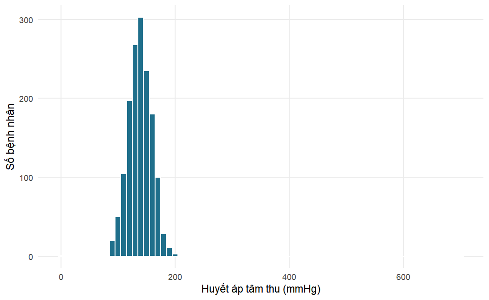
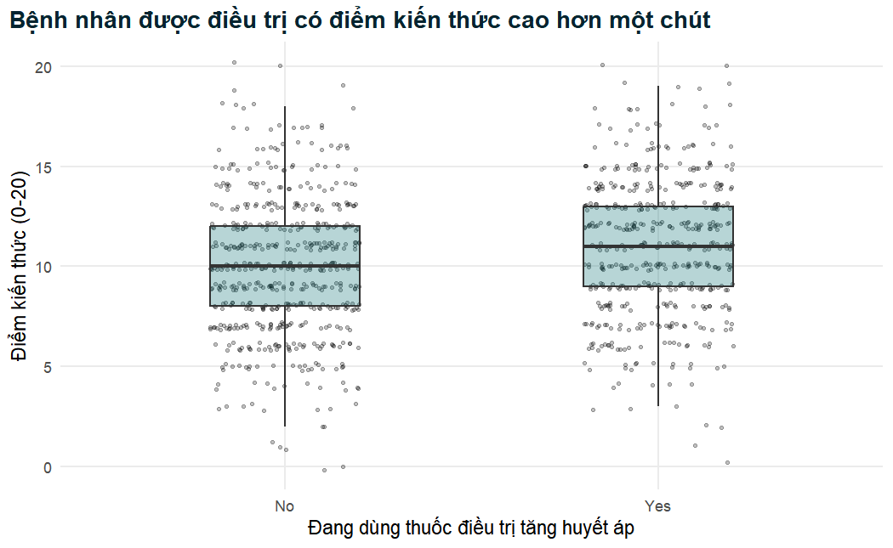
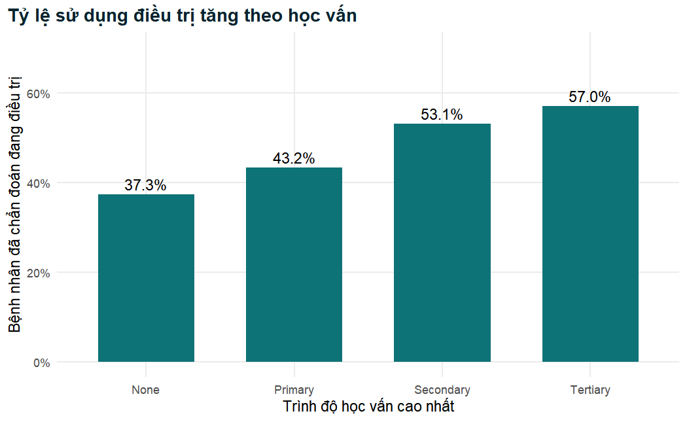
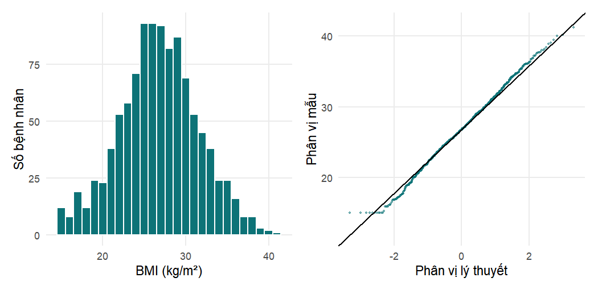
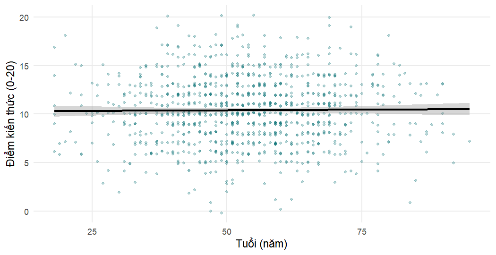

## Chương 1: Bắt đầu với R và RStudio


### Bài tập 1.1

Chúng ta lưu mỗi số đo vào một đối tượng có tên chứa đơn vị đo, rồi viết các công thức dựa trên những đối tượng đó. Chiều cao phải được đổi từ centimét sang mét trước khi bình phương.


``` r
weight_kg <- 82
height_cm <- 168
sbp <- 148
dbp <- 96

bmi <- weight_kg / (height_cm / 100)^2
round(bmi, 1)
```

```
#> [1] 29.1
```

``` r
map <- dbp + (sbp - dbp) / 3
round(map, 1)
```

```
#> [1] 113.3
```

``` r
# Không có ngoặc đơn: ^ được tính trước, vì vậy biểu thức này là
# weight / (height / 100^2) = 82 / (168 / 10000)
weight_kg / height_cm / 100^2
```

```
#> [1] 4.881e-05
```

BMI của bệnh nhân là 29,1 kg/m², ngay dưới ngưỡng quy ước của béo phì (30 kg/m²), và MAP là 113,3 mmHg. Nếu không có ngoặc đơn, R tính `100^2` trước (vì lũy thừa có mức ưu tiên cao nhất), rồi chia từ trái sang phải, nên biểu thức trở thành 82 / 168 / 10.000, một con số vô nghĩa gần bằng không. Không có thông báo lỗi nào cảnh báo bạn: đặt sai ngoặc sẽ âm thầm tạo ra những con số sai.

### Bài tập 1.2


``` r
dbp <- c(88, 92, 79, 101, 95, NA, 84, 90)
length(dbp)
```

```
#> [1] 8
```

``` r
mean(dbp)                  # NA: có một giá trị chưa biết
```

```
#> [1] NA
```

``` r
mean(dbp, na.rm = TRUE)    # trung bình của 7 giá trị quan sát được
```

```
#> [1] 89.86
```

``` r
sum(dbp >= 90, na.rm = TRUE)    # số lần đo >= 90
```

```
#> [1] 4
```

``` r
mean(dbp >= 90, na.rm = TRUE)   # tỷ lệ trong số các lần đo quan sát được
```

```
#> [1] 0.5714
```

``` r
dbp[3:5]
```

```
#> [1]  79 101  95
```

``` r
dbp[!is.na(dbp)]
```

```
#> [1]  88  92  79 101  95  84  90
```

Vectơ có tám phần tử, trong đó một phần tử bị khuyết. Không có `na.rm = TRUE`, `mean()` trả về `NA`, vì trung bình của một tập hợp có chứa một giá trị chưa biết thì bản thân nó cũng chưa biết; có `na.rm = TRUE`, R tính trung bình của bảy giá trị quan sát được (89,9 mmHg). Bốn lần đo đạt ít nhất 90 mmHg, tức là 4 trong 7 lần đo quan sát được, hay 57%. Lưu ý rằng phép so sánh `dbp >= 90` cho ra `NA` ở lần đo bị khuyết, vì vậy cũng cần `na.rm = TRUE` trong `sum()` và `mean()`. Chỉ số logic `!is.na(dbp)` ("không bị khuyết") giữ lại bảy lần đo quan sát được.

### Bài tập 1.3


``` r
glucose <- c("5.4", "6.1", "<2.0", "7.3", "999", "4.8")
class(glucose)
```

```
#> [1] "character"
```

``` r
glucose_num <- as.numeric(glucose)
glucose_num
```

```
#> [1]   5.4   6.1    NA   7.3 999.0   4.8
```

``` r
mean(glucose_num, na.rm = TRUE)
```

```
#> [1] 204.5
```

``` r
mean(glucose_num[glucose_num != 999], na.rm = TRUE)
```

```
#> [1] 5.9
```

Vectơ có kiểu ký tự vì các giá trị của nó được viết trong dấu nháy; và ngay cả khi không có dấu nháy, giá trị `"<2.0"` không thể là một con số, vì vậy một cột chứa nó sẽ được đọc thành văn bản. `as.numeric()` chuyển đổi thành công các chữ số nhưng biến `"<2.0"` thành `NA` (kèm cảnh báo "NAs introduced by coercion"), vì "nhỏ hơn 2,0" không phải là một con số. Đó là một sự mất mát thông tin: kết quả được biết là thấp, chứ không phải là chưa biết. Giá trị 999 gần như chắc chắn là một mã giá trị khuyết, vì glucose lúc đói 999 mmol/L là không thể có. Nếu để nguyên, nó đẩy trung bình của năm giá trị số lên 204,5 mmol/L; nếu bỏ nó đi, trung bình của bốn giá trị thật là 5,9 mmol/L.

### Bài tập 1.4


``` r
htn <- read_csv("Data/hypertension_phc_raw.csv")
htn_xl <- read_excel("Data/hypertension_phc_raw.xlsx", sheet = "data")

dim(htn)
```

```
#> [1] 1503   36
```

``` r
dim(htn_xl)
```

```
#> [1] 1503   36
```

``` r
identical(names(htn), names(htn_xl))
```

```
#> [1] TRUE
```

``` r
n_distinct(htn$patient_id)
```

```
#> [1] 1500
```

Cả hai đối tượng đều có 1.503 dòng và 36 cột, với tên cột giống hệt nhau. Nghiên cứu đã tuyển chọn 1.500 bệnh nhân, và có đúng 1.500 mã bệnh nhân khác nhau, vì vậy có ba mã xuất hiện hai lần: tệp chứa ba bản ghi trùng lặp, cần được loại bỏ trước khi phân tích (Chương 2).

### Bài tập 1.5


``` r
glimpse(select(htn, age, sbp_mmhg, bmi, sex, facility, education,
               diabetes, treatment_uptake, enroll_date))
```

```
#> Rows: 1,503
#> Columns: 9
#> $ age              <dbl> 74, 56, 54, 33, 86, 70, 45, 59, 46, 61, 70, 56, 45…
#> $ sbp_mmhg         <dbl> 140, 185, 147, 124, 131, 153, 162, 108, 152, 127, …
#> $ bmi              <dbl> 22.6, 26.7, 21.4, 28.4, 21.6, 31.6, NA, 25.2, 33.0…
#> $ sex              <chr> "Female", "Female", "Female", "Female", "Male", "M…
#> $ facility         <chr> "Igoma HC", "Kisesa HC", "Bugando PHC", "Ilemela H…
#> $ education        <chr> "Primary", "Primary", "None", "Primary", "Primary"…
#> $ diabetes         <chr> "No", "No", "No", "No", "0", "No", "0", "No", "0",…
#> $ treatment_uptake <chr> "Yes", "No", "N", "Yes", "No", "No", "1", "No", "0…
#> $ enroll_date      <chr> "01/02/2024", "2024-09-03", "2024-11-26", "2024-10…
```

Các biến số (`<dbl>`) gồm `age`, `sbp_mmhg` và `bmi` (cùng với `height_cm`, `weight_kg` và các giá trị xét nghiệm). Các biến ký tự (`<chr>`) gồm `sex`, `facility` và `education`. Các biến `diabetes` và `treatment_uptake` (cũng như `health_insurance`, `family_history_htn` và `htn_diagnosed`) đáng lẽ phải là factor Yes/No, nhưng chúng trộn lẫn các mã `"Yes"`/`"No"`, `"Y"`/`"N"` và `"1"`/`"0"`; vì `"Yes"` không thể là một con số, readr lưu toàn bộ cột dưới dạng văn bản. `enroll_date` có kiểu ký tự vì các giá trị của nó dùng những định dạng khác nhau (`"01/02/2024"`, `"2024-09-03"`), nên readr không thể nhận ra một định dạng ngày duy nhất và giữ nguyên văn bản.

### Bài tập 1.6


``` r
summary(select(htn, sbp_mmhg, dbp_mmhg, height_cm))
```

```
#>     sbp_mmhg      dbp_mmhg       height_cm  
#>  Min.   :  0   Min.   :  5.0   Min.   : 17  
#>  1st Qu.:126   1st Qu.: 79.0   1st Qu.:158  
#>  Median :139   Median : 86.0   Median :164  
#>  Mean   :140   Mean   : 85.9   Mean   :164  
#>  3rd Qu.:153   3rd Qu.: 93.0   3rd Qu.:169  
#>  Max.   :700   Max.   :121.0   Max.   :193
```

``` r
table(htn$diabetes)
```

```
#> 
#>    0    1    N   No    Y  Yes 
#>  230    7  143 1095    4   24
```

``` r
table(htn$htn_diagnosed)
```

```
#> 
#>   0   1   N  No   Y Yes 
#>  73 158  44 296 110 822
```

``` r
sum(is.na(htn$weight_kg))
```

```
#> [1] 45
```

Huyết áp tâm thu dao động từ 0 đến 700 mmHg: cả hai giá trị cực trị đều không thể có. Huyết áp tâm trương dao động từ 5 đến 121 mmHg; giá trị nhỏ nhất 5 mmHg là không hợp lý. Chiều cao dao động từ 17 đến khoảng 193 cm; 17 cm là không thể có ở người trưởng thành và có lẽ là 170 cm bị đặt sai dấu thập phân. Cả `diabetes` và `htn_diagnosed` đều dùng sáu mã khác nhau (`0`, `1`, `N`, `No`, `Y`, `Yes`) cho điều đáng lẽ chỉ là hai nhóm. Cuối cùng, có 45 giá trị của `weight_kg` bị khuyết.

### Bài tập 1.7


``` r
htn |>
  filter(facility == "Nyamagana PHC") |>
  mutate(map_mmhg = round(dbp_mmhg + (sbp_mmhg - dbp_mmhg) / 3, 1)) |>
  select(patient_id, age, sbp_mmhg, dbp_mmhg, map_mmhg) |>
  arrange(desc(map_mmhg)) |>
  head(5)
```

```
#> # A tibble: 5 × 5
#>   patient_id   age sbp_mmhg dbp_mmhg map_mmhg
#>   <chr>      <dbl>    <dbl>    <dbl>    <dbl>
#> 1 PHC-0741      63      171      116    134.3
#> 2 PHC-1014      59      149      119    129  
#> 3 PHC-0810      65      183      102    129  
#> 4 PHC-0701      62      163      110    127.7
#> 5 PHC-1106      53      159      109    125.7
```

``` r
htn |>
  filter(diabetes == "Yes") |>
  count(facility)
```

```
#> # A tibble: 6 × 2
#>   facility          n
#>   <chr>         <int>
#> 1 Bugando PHC       6
#> 2 Buzuruga PHC      3
#> 3 Igoma HC          3
#> 4 Ilemela HC        6
#> 5 Kisesa HC         2
#> 6 Nyamagana PHC     4
```

Các giá trị MAP cao nhất tại Nyamagana PHC nằm trong khoảng từ 126 đến 134 mmHg, thuộc về những bệnh nhân có huyết áp tâm thu từ 149 đến 183 mmHg và huyết áp tâm trương trên 100 mmHg. Đây là những giá trị cao nhưng có thể xảy ra trên lâm sàng (tăng huyết áp nặng), vì vậy, khác với SBP 700 mmHg, chúng không nên bị coi là lỗi. Chuỗi pipe thứ hai đếm các bản ghi có giá trị `diabetes` chính xác là `"Yes"`. Tổng cộng chỉ có 24 bản ghi được mã hóa là `"Yes"`, trong khi Bài tập 1.6 cho thấy còn 11 bản ghi khác được mã hóa là `"1"` hoặc `"Y"`, vì vậy một phép đếm dựa trên một cách viết duy nhất sẽ ước tính thấp số bệnh nhân đái tháo đường gần một phần ba (24 thay vì 35). Đây thêm một lý do nữa để chuẩn hóa các mã trước khi tiến hành bất kỳ phân tích nào.

### Bài tập 1.8


``` r
ggplot(htn, aes(x = sbp_mmhg)) +
  geom_histogram(binwidth = 10, fill = "#1F6F8B", colour = "white") +
  labs(x = "Huyết áp tâm thu (mmHg)", y = "Số bệnh nhân")
```




``` r
htn_plausible <- htn |>
  filter(sbp_mmhg >= 60, sbp_mmhg <= 260)
nrow(htn) - nrow(htn_plausible)   # số bản ghi bị loại bỏ
```

```
#> [1] 2
```

``` r
summary(htn_plausible$sbp_mmhg)
```

```
#>    Min. 1st Qu.  Median    Mean 3rd Qu.    Max. 
#>      90     126     139     139     153     201
```


``` r
ggplot(htn_plausible, aes(x = sbp_mmhg)) +
  geom_histogram(binwidth = 5, fill = "#1F6F8B", colour = "white") +
  labs(x = "Huyết áp tâm thu (mmHg)", y = "Số bệnh nhân")
```


Trong biểu đồ tần suất thứ nhất, hai giá trị cực trị buộc trục hoành trải từ 0 đến 700 mmHg, nên dữ liệu thực chỉ chiếm một dải hẹp và khó thấy được hình dạng của chúng. Việc lọc đã loại bỏ hai bản ghi (các giá trị 0 và 700 mmHg; không có giá trị SBP nào bị khuyết, nên không mất thêm dòng nào). Các giá trị hợp lý tạo thành một phân phối có một đỉnh, tập trung quanh 139 mmHg (trung vị), với phần lớn các lần đo nằm trong khoảng từ 100 đến 190 mmHg và một đuôi hơi dài hơn về phía huyết áp cao. Giá trị hợp lý nhỏ nhất là 90 mmHg và lớn nhất là 201 mmHg. Chưa đến một nửa số bệnh nhân có huyết áp tâm thu từ 140 mmHg trở lên (trung vị là 139 mmHg), đúng như mong đợi ở một quần thể có nhiều bệnh nhân tăng huyết áp. Trong thực tế, các giá trị không hợp lý nên được đặt thành giá trị khuyết trong một bước làm sạch có ghi chép rõ ràng thay vì bị lặng lẽ lọc bỏ, như sẽ trình bày trong Chương 2.


## Chương 2: Tìm hiểu và làm sạch dữ liệu lâm sàng


Các lời giải dưới đây bắt đầu từ tệp thô hoặc từ tệp phân tích đã làm sạch, tùy theo yêu cầu của
từng bài tập. Chúng ta nạp các gói và cả hai bộ dữ liệu một lần.


``` r
library(tidyverse)
library(lubridate)

na_codes <- c("", "NA", "999", "-99")
raw_default  <- read_csv("Data/hypertension_phc_raw.csv")
raw          <- read_csv("Data/hypertension_phc_raw.csv", na = na_codes)
analysis_data <- readRDS("Data/analysis_data.rds")

# Hàm trợ giúp Yes/No từ Mục 2.6
to_yesno <- function(x) {
  x <- str_to_lower(str_trim(as.character(x)))
  case_when(
    x %in% c("yes", "y", "1", "true")  ~ "Yes",
    x %in% c("no",  "n", "0", "false") ~ "No",
    TRUE ~ NA_character_
  )
}
```

### Bài tập 2.1

Chúng ta viết một hàm tóm tắt nhỏ và áp dụng nó cho cả hai lần nhập, để hai dòng của kết quả có thể
so sánh trực tiếp với nhau.


``` r
# 1-2. Glucose lúc đói theo hai cách nhập
glucose_summary <- function(d) {
  summarise(d,
            mean = mean(fasting_glucose_mmol_l, na.rm = TRUE),
            median = median(fasting_glucose_mmol_l, na.rm = TRUE),
            max = max(fasting_glucose_mmol_l, na.rm = TRUE),
            n_missing = sum(is.na(fasting_glucose_mmol_l)))
}
bind_rows(default = glucose_summary(raw_default),
          declared = glucose_summary(raw), .id = "import")
```

```
#> # A tibble: 2 × 5
#>   import      mean median   max n_missing
#>   <chr>      <dbl>  <dbl> <dbl>     <int>
#> 1 default  32.521     5.4 999          35
#> 2 declared  5.4489    5.4  10.1        75
```

Với cách nhập mặc định, 40 giá trị được mã hóa `999` bị coi là nồng độ glucose thật. **Trung bình**
là thống kê tóm tắt bị ảnh hưởng nhiều nhất: nó tăng từ 5,4 lên 32,5 mmol/L, vì trung bình sử dụng
độ lớn của mọi giá trị và một vài giá trị cực lớn chi phối nó. **Giá trị lớn nhất** cũng sai (999
thay vì 10,1). **Trung vị** không thay đổi, vẫn là 5,4, vì 40 giá trị canh gác, dù cực trị, chỉ
chiếm 2,7 phần trăm số giá trị và không làm dịch chuyển phần giữa của phân phối; tính vững này là
một lý do khiến trung vị được ưu tiên với dữ liệu lệch. Cách nhập mặc định báo cáo 35 giá trị khuyết
và cách nhập có khai báo mã báo cáo 75, chênh lệch chính là 40 giá trị canh gác.

Với câu hỏi 3, chúng ta nhập dữ liệu chỉ với các mã khuyết tiêu chuẩn và chuyển `999` thành `NA`
riêng trong cột glucose, bằng `na_if()`.


``` r
# 3. Chỉ coi 999 là khuyết trong cột mà nó là giá trị canh gác
raw_selective <- read_csv("Data/hypertension_phc_raw.csv",
                          na = c("", "NA")) |>
  mutate(fasting_glucose_mmol_l = na_if(fasting_glucose_mmol_l, 999))

sum(is.na(raw_selective$fasting_glucose_mmol_l))
```

```
#> [1] 75
```

``` r
max(raw_selective$creatinine_umol_l)   # creatinine không bị động đến
```

```
#> [1] 141
```

Glucose giờ có cùng 75 giá trị khuyết như trước, trong khi creatinine không bị động đến (giá trị lớn
nhất của nó, 141 µmol/L, cho thấy không có cột nào bị thay đổi do nhầm lẫn; trong một bộ dữ liệu mà
creatinine thực sự đạt 999, giá trị đó sẽ được giữ lại). Cách tiếp cận có chọn lọc này là lựa chọn
mặc định an toàn bất cứ khi nào một mã có thể là giá trị thật ở một số cột.


### Bài tập 2.2

Chúng ta liệt kê các mã bị lặp lại, hiển thị các bản ghi của chúng bằng `janitor::get_dupes()`, và
so sánh số dòng trùng lặp hoàn toàn với số mã thừa.


``` r
# 1. Các mã xuất hiện nhiều hơn một lần, và các bản ghi của chúng
raw |> count(patient_id) |> filter(n > 1)
```

```
#> # A tibble: 3 × 2
#>   patient_id     n
#>   <chr>      <int>
#> 1 PHC-0011       2
#> 2 PHC-0251       2
#> 3 PHC-0881       2
```

``` r
janitor::get_dupes(raw, patient_id) |>
  select(patient_id, dupe_count, facility, age, sex, sbp_mmhg)
```

```
#> # A tibble: 6 × 6
#>   patient_id dupe_count facility      age sex    sbp_mmhg
#>   <chr>           <int> <chr>       <dbl> <chr>     <dbl>
#> 1 PHC-0011            2 Ilemela HC     51 Male        128
#> 2 PHC-0011            2 Ilemela HC     51 Male        128
#> 3 PHC-0251            2 Bugando PHC    51 Female      131
#> 4 PHC-0251            2 Bugando PHC    51 Female      131
#> 5 PHC-0881            2 Kisesa HC      45 Female      140
#> 6 PHC-0881            2 Kisesa HC      45 Female      140
```

``` r
# 2. Số dòng trùng lặp hoàn toàn so với số mã thừa
sum(duplicated(raw))
```

```
#> [1] 3
```

``` r
nrow(raw) - n_distinct(raw$patient_id)
```

```
#> [1] 3
```

Ba mã (`PHC-0011`, `PHC-0251` và `PHC-0881`) xuất hiện hai lần, và `get_dupes()` hiển thị hai bản
ghi của mỗi mã cạnh nhau, kèm theo cột `dupe_count`. Có 3 dòng trùng lặp hoàn toàn và 3 mã thừa
(1.503 dòng trừ 1.500 mã khác nhau). Vì hai con số này khớp nhau, mọi mã bị lặp lại đều là bản sao
chính xác, và không có bản ghi mâu thuẫn nào cần được đối chiếu với tài liệu gốc.

Một câu phù hợp cho phần phương pháp: *"Bộ dữ liệu thô gồm 1.503 bản ghi; ba bản ghi là bản sao
hoàn toàn của các bản ghi khác (giống nhau ở mọi biến) và đã được loại bỏ, còn lại 1.500 người
tham gia với mã định danh duy nhất."*


### Bài tập 2.3

Chúng ta lập bảng tần số các mã thô, sau đó áp dụng hàm trợ giúp sau khi đã loại bỏ bản ghi trùng
lặp, và kiểm tra phép ánh xạ bằng bảng chéo giữa giá trị cũ và giá trị mới.


``` r
# 1. Các mã được dùng trước khi làm sạch
table(raw$health_insurance, useNA = "ifany")
```

```
#> 
#>   0   1   N  No   Y Yes 
#> 150  70  97 743  49 394
```

``` r
table(raw$htn_diagnosed, useNA = "ifany")
```

```
#> 
#>   0   1   N  No   Y Yes 
#>  73 158  44 296 110 822
```

``` r
# 2. Áp dụng hàm trợ giúp và kiểm tra phép ánh xạ
clean_bin <- distinct(raw) |>
  mutate(health_insurance_new = to_yesno(health_insurance),
         htn_diagnosed_new = to_yesno(htn_diagnosed))

table(before = clean_bin$health_insurance,
      after = clean_bin$health_insurance_new)
```

```
#>       after
#> before  No Yes
#>    0   150   0
#>    1     0  70
#>    N    96   0
#>    No  742   0
#>    Y     0  49
#>    Yes   0 393
```

``` r
table(before = clean_bin$htn_diagnosed,
      after = clean_bin$htn_diagnosed_new)
```

```
#>       after
#> before  No Yes
#>    0    73   0
#>    1     0 158
#>    N    43   0
#>    No  295   0
#>    Y     0 110
#>    Yes   0 821
```

Cả hai biến đều dùng sáu mã: `0`/`1`, `N`/`Y` và `No`/`Yes`. Các bảng chéo cho thấy mỗi mã được ánh
xạ đến đúng một giá trị sạch (mọi mã `0`, `N` và `No` thành "No", mọi mã `1`, `Y` và `Yes` thành
"Yes") và không có giá trị nào trở thành khuyết. Các con số hơi nhỏ hơn so với hai bảng đầu tiên vì
ba bản ghi trùng lặp đã bị loại bỏ.


``` r
# 3. Tỷ lệ trong dữ liệu sạch
analysis_data |>
  summarise(insured_pct = round(100 * mean(health_insurance == "Yes"), 1),
            diagnosed_pct = round(100 * mean(htn_diagnosed == "Yes"), 1))
```

```
#> # A tibble: 1 × 2
#>   insured_pct diagnosed_pct
#>         <dbl>         <dbl>
#> 1        34.1          72.6
```

Trong dữ liệu sạch, 34,1 phần trăm bệnh nhân có bảo hiểm y tế và 72,6 phần trăm (1.089 trong số
1.500) đã được chẩn đoán tăng huyết áp. Vì `health_insurance` và `htn_diagnosed` không có giá trị
khuyết, `mean(x == "Yes")` cho ra tỷ lệ một cách trực tiếp; nếu có giá trị khuyết, bạn sẽ cần
`na.rm = TRUE` và nên báo cáo mẫu số.


### Bài tập 2.4

Các phép kiểm tra giữa các biến so sánh những biến phải có một mối quan hệ cố định với nhau.


``` r
# 1. Huyết áp tâm trương cao bằng hoặc hơn huyết áp tâm thu
analysis_data |>
  summarise(dbp_ge_sbp = sum(dbp_mmhg >= sbp_mmhg, na.rm = TRUE))
```

```
#> # A tibble: 1 × 1
#>   dbp_ge_sbp
#>        <int>
#> 1         11
```

``` r
# 2. Hiệu áp
analysis_data <- analysis_data |>
  mutate(pulse_pressure = sbp_mmhg - dbp_mmhg)
summary(analysis_data$pulse_pressure)
```

```
#>    Min. 1st Qu.  Median    Mean 3rd Qu.    Max.     NAs 
#>   -18.0    39.0    53.0    53.3    68.0   129.0       3
```

``` r
sum(analysis_data$pulse_pressure < 20, na.rm = TRUE)
```

```
#> [1] 92
```

Mười một bệnh nhân có huyết áp tâm trương bằng hoặc cao hơn huyết áp tâm thu. Điều này không thể xảy
ra về mặt sinh lý với một số đo huyết áp cánh tay được đo đúng cách: theo định nghĩa, huyết áp tâm
thu là áp lực đỉnh của chu chuyển tim. Mỗi bản ghi này đều đã vượt qua các phép kiểm tra khoảng giá
trị của từng biến riêng lẻ, và đó chính là lý do cần có các phép kiểm tra giữa các biến. Bản tóm tắt
hiệu áp xác nhận vấn đề từ một góc độ khác: giá trị nhỏ nhất là -18 mmHg. Thêm 92 bệnh nhân có hiệu
áp dưới 20 mmHg, điều bất thường (hiệu áp bình thường vào khoảng 40 mmHg) và có thể phản ánh các số
đo bị đảo chỗ hoặc gõ nhầm. Trong một nghiên cứu thực tế, những bản ghi này sẽ được gửi lại cho các
cơ sở để xác minh. Dữ liệu trong cuốn sách này là dữ liệu mô phỏng và các số đo được giữ nguyên trong
`analysis_data`, nhưng nếu bạn làm sạch dữ liệu này để công bố, bạn sẽ thêm một quy tắc (ví dụ, chuyển
cả hai số đo huyết áp thành `NA` khi huyết áp tâm trương lớn hơn hoặc bằng tâm thu) vào script làm
sạch và báo cáo quy tắc đó.


``` r
# 3. Các quy tắc nhất quán từ từ điển dữ liệu
analysis_data |>
  group_by(htn_diagnosed) |>
  summarise(n = n(),
            min_months = min(months_since_diagnosis),
            max_months = max(months_since_diagnosis))
```

```
#> # A tibble: 2 × 4
#>   htn_diagnosed     n min_months max_months
#>   <fct>         <int>      <dbl>      <dbl>
#> 1 No              411          0          0
#> 2 Yes            1089          1        119
```

``` r
analysis_data |>
  count(treatment_uptake, adherence_recorded = !is.na(adherence))
```

```
#> # A tibble: 2 × 3
#>   treatment_uptake adherence_recorded     n
#>   <fct>            <lgl>              <int>
#> 1 No               FALSE                992
#> 2 Yes              TRUE                 508
```

Cả hai quy tắc đều được thỏa mãn. Tất cả 411 bệnh nhân chưa được chẩn đoán đều có
`months_since_diagnosis` bằng 0, và 1.089 bệnh nhân đã được chẩn đoán có giá trị từ 1 đến 119
tháng. Tuân thủ điều trị được ghi nhận cho cả 508 bệnh nhân đang điều trị và không cho bệnh nhân nào
trong số 992 bệnh nhân không điều trị.


### Bài tập 2.5

Thêm `right = FALSE` làm cho mỗi khoảng bao gồm giới hạn dưới của nó, ví dụ `[18.5, 25)`, khớp với
định nghĩa của WHO.


``` r
# 1. Phân loại theo đúng WHO: các khoảng đóng bên trái
analysis_data <- analysis_data |>
  mutate(bmi_cat_who = cut(bmi,
                           breaks = c(-Inf, 18.5, 25, 30, Inf),
                           labels = c("Underweight", "Normal",
                                      "Overweight", "Obese"),
                           right = FALSE))

# 2. So sánh hai phiên bản
table(default = analysis_data$bmi_cat, who = analysis_data$bmi_cat_who)
```

```
#>              who
#> default       Underweight Normal Overweight Obese
#>   Underweight          82      2          0     0
#>   Normal                0    466         10     0
#>   Overweight            0      0        568     9
#>   Obese                 0      0          0   316
```

``` r
analysis_data |>
  filter(bmi_cat != bmi_cat_who) |>
  count(bmi, bmi_cat, bmi_cat_who)
```

```
#> # A tibble: 3 × 4
#>     bmi bmi_cat     bmi_cat_who     n
#>   <dbl> <fct>       <fct>       <int>
#> 1  18.5 Underweight Normal          2
#> 2  25   Normal      Overweight     10
#> 3  30   Overweight  Obese           9
```

Bảng chéo gần như nằm hoàn toàn trên đường chéo: 21 bệnh nhân thay đổi nhóm, tất cả đều chuyển lên
một nhóm. Bảng thứ hai cho thấy lý do: họ chính là những bệnh nhân có BMI, khi làm tròn đến một chữ
số thập phân, nằm đúng trên một điểm cắt. Hai bệnh nhân có BMI 18,5 chuyển từ "Underweight" (thiếu
cân) sang "Normal" (bình thường), mười bệnh nhân có BMI 25,0 chuyển từ "Normal" sang "Overweight"
(thừa cân) và chín bệnh nhân có BMI 30,0 chuyển từ "Overweight" sang "Obese" (béo phì). Ở đây sự khác
biệt là nhỏ, nhưng trong một nghiên cứu báo cáo tỷ lệ hiện mắc béo phì, nó sẽ làm thay đổi ước lượng,
và làm cho kết quả không khớp với các nghiên cứu đã áp dụng đúng định nghĩa của WHO.


``` r
# 3. Nhóm tuổi, được đối chiếu với tuổi
analysis_data <- analysis_data |>
  mutate(age_group = cut(age, breaks = c(18, 40, 60, Inf),
                         labels = c("18-39", "40-59", "60+"),
                         right = FALSE))

analysis_data |>
  group_by(age_group) |>
  summarise(n = n(), min_age = min(age), max_age = max(age))
```

```
#> # A tibble: 4 × 4
#>   age_group     n min_age max_age
#>   <fct>     <int>   <dbl>   <dbl>
#> 1 18-39       274      18      39
#> 2 40-59       772      40      59
#> 3 60+         452      60      95
#> 4 <NA>          2      NA      NA
```

Cùng ý tưởng `right = FALSE` đó giúp định nghĩa các nhóm tuổi có nhãn đúng với ý nghĩa của chúng:
`[18, 40)` là từ 18 đến 39 tuổi. Tuổi nhỏ nhất và lớn nhất trong mỗi nhóm xác nhận định nghĩa
(18–39, 40–59 và 60–95), và hai bệnh nhân có tuổi bị chuyển thành khuyết trong quá trình kiểm định
được gán đúng một nhóm tuổi khuyết.


### Bài tập 2.6

Biểu thức chính quy (regular expression) mô tả từng định dạng: `\\d{4}` (với dấu gạch chéo ngược
được viết hai lần bên trong một chuỗi R) là bốn chữ số và `[A-Za-z]{3}` là ba chữ cái; `^` và `$`
neo mẫu vào đầu và cuối của giá trị.


``` r
# 1. Đếm từng định dạng ngày
dates <- distinct(raw)$enroll_date
c(iso = sum(str_detect(dates, "^\\d{4}-\\d{2}-\\d{2}$")),
  slash = sum(str_detect(dates, "^\\d{2}/\\d{2}/\\d{4}$")),
  month_name = sum(str_detect(dates, "^\\d{2}-[A-Za-z]{3}-\\d{4}$")))
```

```
#>        iso      slash month_name 
#>       1050        347        103
```

``` r
# 2. Hiểu định dạng gạch chéo theo kiểu tháng trước
wrong <- parse_date_time(dates, orders = c("ymd", "mdy", "d-b-Y")) |>
  as_date()
sum(is.na(wrong))                                  # số lỗi phân tích
```

```
#> [1] 221
```

``` r
sum(wrong != analysis_data$enroll_date, na.rm = TRUE) # khác biệt âm thầm
```

```
#> [1] 137
```

Ba định dạng bao gồm toàn bộ 1.500 ngày (1.050 + 347 + 103). Khi phân tích định dạng gạch chéo theo
kiểu tháng trước, 221 ngày không phân tích được: chúng có số đầu tiên lớn hơn 12 (chẳng hạn
`18/02/2024`), không thể là một tháng. Ít ra thì lỗi này còn nhìn thấy được. Nguy hiểm hơn là 137
ngày được phân tích thành công nhưng khác với ngày đúng. Phần lớn trong số đó (115) là các ngày dạng
gạch chéo có cả hai số đều nhỏ hơn hoặc bằng 12, khiến `01/02/2024` trở thành ngày 2 tháng 1 thay vì
ngày 1 tháng 2; 22 ngày còn lại là các ngày có tên tháng mà `parse_date_time()` đã khớp với một thứ
tự khác khi danh sách thứ tự thay đổi. Nếu không so sánh với các ngày được phân tích đúng, không lỗi
nào trong số 137 lỗi này được phát hiện. Đó là lý do thứ tự phải được chọn dựa trên hiểu biết về dữ
liệu, và kết quả phải được kiểm tra.


``` r
# 3. Số lượt tuyển chọn mỗi quý
analysis_data |>
  mutate(enroll_quarter = quarter(enroll_date)) |>
  count(enroll_quarter)
```

```
#> # A tibble: 4 × 2
#>   enroll_quarter     n
#>            <int> <int>
#> 1              1   392
#> 2              2   412
#> 3              3   421
#> 4              4   275
```

Việc tuyển chọn được phân bố đều trong ba quý đầu (từ 392 đến 421 bệnh nhân) và thấp hơn trong quý
thứ tư (275), vì việc tuyển chọn kết thúc vào ngày 2 tháng 12.


### Bài tập 2.7

Chúng ta tạo một biến chỉ thị việc bị khuyết và so sánh nó giữa các nhóm của các biến quan sát được.


``` r
analysis_data <- analysis_data |>
  mutate(chol_missing = is.na(total_chol_mmol_l))

# 1. Tỷ lệ phần trăm bị khuyết theo chẩn đoán và theo nơi cư trú
analysis_data |>
  group_by(htn_diagnosed) |>
  summarise(n = n(), pct_missing = round(100 * mean(chol_missing), 1))
```

```
#> # A tibble: 2 × 3
#>   htn_diagnosed     n pct_missing
#>   <fct>         <int>       <dbl>
#> 1 No              411         3.9
#> 2 Yes            1089         6.8
```

``` r
analysis_data |>
  group_by(residence) |>
  summarise(n = n(), pct_missing = round(100 * mean(chol_missing), 1))
```

```
#> # A tibble: 2 × 3
#>   residence     n pct_missing
#>   <fct>     <int>       <dbl>
#> 1 Rural       703         5.4
#> 2 Urban       797         6.5
```

``` r
# 2. Tuổi trung bình theo tình trạng bị khuyết
analysis_data |>
  group_by(chol_missing) |>
  summarise(n = n(), mean_age = round(mean(age, na.rm = TRUE), 1))
```

```
#> # A tibble: 2 × 3
#>   chol_missing     n mean_age
#>   <lgl>        <int>    <dbl>
#> 1 FALSE         1410     52  
#> 2 TRUE            90     55.9
```

Cholesterol bị khuyết ở 6,8 phần trăm bệnh nhân đã được chẩn đoán và 3,9 phần trăm bệnh nhân chưa
được chẩn đoán, và ở 6,5 phần trăm người sống ở thành thị so với 5,4 phần trăm người sống ở nông
thôn. Những bệnh nhân bị khuyết cholesterol trung bình lớn tuổi hơn khoảng bốn năm (55,9 so với 52,0
tuổi). Các chênh lệch này không lớn, và Chương 4 sẽ trình bày cách kiểm định xem những chênh lệch cỡ
này có thể do ngẫu nhiên hay không, nhưng chúng chỉ về một hướng nhất quán: việc bị khuyết dường như
liên quan đến các đặc điểm quan sát được (chẩn đoán, tuổi). Nếu vậy, dữ liệu không phải là MCAR, và
một phân tích giới hạn ở những bệnh nhân có kết quả cholesterol sẽ có hơi nhiều bệnh nhân trẻ tuổi,
chưa được chẩn đoán hơn so với thực tế. MAR, với việc bị khuyết phụ thuộc vào tuổi và chẩn đoán, là
một giả định làm việc hợp lý hơn, và mọi phân tích có sử dụng cholesterol ít nhất nên đưa các biến
này vào mô hình hoặc vào mô hình quy nạp.

Dữ liệu không thể cho chúng ta biết cholesterol có phải là MNAR hay không. Điều đó đòi hỏi phải biết
liệu những bệnh nhân có giá trị khuyết có xu hướng có cholesterol cao hơn hay thấp hơn những bệnh
nhân được quan sát cùng tuổi và cùng tình trạng chẩn đoán hay không, mà cholesterol của họ lại chính
là thứ chúng ta không quan sát được. Các nhận định về MNAR dựa trên hiểu biết về cách dữ liệu được
thu thập (ví dụ, liệu máu chỉ được lấy từ những bệnh nhân trông có vẻ không khỏe hay không) và được
tìm hiểu bằng các phân tích độ nhạy. Vì dữ liệu này là dữ liệu mô phỏng, quy luật ở đây minh họa cho
cách lập luận chứ không phải là một phát hiện lâm sàng thực tế.


### Bài tập 2.8

Hàm này tập hợp các bước của chương theo đúng thứ tự. Nó sử dụng hàm trợ giúp `to_yesno()` được định
nghĩa ở đầu phụ lục này; trong một dự án thực tế, bạn sẽ đặt cả hai hàm trong cùng một tệp script.


``` r
clean_htn <- function(path) {
  # Nhập với các mã giá trị khuyết; bỏ trùng lặp hoàn toàn; cắt khoảng trắng
  dat <- read_csv(path, na = c("", "NA", "999", "-99"),
                  show_col_types = FALSE) |>
    distinct() |>
    mutate(across(where(is.character), str_trim))

  # Danh mục: giới tính và các biến Yes/No
  dat <- dat |>
    mutate(
      sex = case_when(
        str_to_lower(sex) %in% c("female", "f") ~ "Female",
        str_to_lower(sex) %in% c("male", "m")   ~ "Male",
        TRUE ~ NA_character_),
      across(c(diabetes, family_history_htn, health_insurance,
               htn_diagnosed, treatment_uptake), to_yesno)
    )

  # Kiểm định: các giá trị không thể xảy ra trở thành NA
  dat <- dat |>
    mutate(
      age       = if_else(between(age, 18, 110), age, NA_real_),
      sbp_mmhg  = if_else(between(sbp_mmhg, 70, 260), sbp_mmhg, NA_real_),
      dbp_mmhg  = if_else(between(dbp_mmhg, 40, 150), dbp_mmhg, NA_real_),
      height_cm = if_else(between(height_cm, 120, 210), height_cm, NA_real_),
      weight_kg = if_else(between(weight_kg, 30, 200), weight_kg, NA_real_)
    )

  # Biến dẫn xuất và ngày tháng
  dat <- dat |>
    mutate(
      bmi = round(weight_kg / (height_cm / 100)^2, 1),
      bmi_cat = cut(bmi, breaks = c(-Inf, 18.5, 25, 30, Inf),
                    labels = c("Underweight", "Normal",
                               "Overweight", "Obese")),
      bp_category = case_when(
        is.na(sbp_mmhg) | is.na(dbp_mmhg) ~ NA_character_,
        sbp_mmhg >= 140 | dbp_mmhg >= 90  ~ "Hypertension",
        sbp_mmhg >= 130 | dbp_mmhg >= 80  ~ "Elevated",
        TRUE                              ~ "Normal"),
      enroll_date = as_date(parse_date_time(
        enroll_date, orders = c("ymd", "dmy", "d-b-Y")))
    )

  # Factor với các mức được chọn có chủ đích
  yn <- c("No", "Yes")
  dat <- dat |>
    mutate(
      facility = factor(facility),
      sex = factor(sex, levels = c("Female", "Male")),
      residence = factor(residence, levels = c("Rural", "Urban")),
      education = factor(education, ordered = TRUE,
                         levels = c("None", "Primary", "Secondary",
                                    "Tertiary")),
      occupation = factor(occupation),
      marital_status = factor(marital_status),
      physical_activity = factor(physical_activity, ordered = TRUE,
                                 levels = c("Low", "Moderate", "High")),
      smoking = factor(smoking, levels = c("Never", "Former", "Current")),
      alcohol = factor(alcohol, levels = c("None", "Moderate", "Heavy")),
      bp_category = factor(bp_category,
                           levels = c("Normal", "Elevated", "Hypertension")),
      health_insurance = factor(health_insurance, levels = yn),
      family_history_htn = factor(family_history_htn, levels = yn),
      diabetes = factor(diabetes, levels = yn),
      htn_diagnosed = factor(htn_diagnosed, levels = yn),
      treatment_uptake = factor(treatment_uptake, levels = yn),
      adherence = factor(na_if(adherence, ""), levels = c("Poor", "Good")),
      bp_controlled = factor(na_if(bp_controlled, ""), levels = yn)
    )

  # Khẳng định: dừng lại rõ ràng nếu xuất hiện một vấn đề mới
  stopifnot(
    n_distinct(dat$patient_id) == nrow(dat),
    !anyNA(dat$sex),
    !anyNA(dat$enroll_date),
    !anyNA(dat$treatment_uptake),
    all(between(dat$sbp_mmhg, 70, 260), na.rm = TRUE)
  )
  dat
}

my_clean <- clean_htn("Data/hypertension_phc_raw.csv")
all.equal(my_clean, readRDS("Data/analysis_data.rds"))
```

```
#> [1] TRUE
```

`all.equal()` trả về `TRUE`: hàm tái tạo chính xác bộ dữ liệu phân tích. Các khẳng định ở cuối hàm
kiểm tra rằng mã bệnh nhân là duy nhất, rằng giới tính, ngày tuyển chọn và biến kết cục không có giá
trị khuyết, và rằng huyết áp tâm thu nằm trong khoảng hợp lý; nếu một phiên bản tương lai của tệp
thô chứa, chẳng hạn, một cách viết giới tính mới hoặc một định dạng ngày mới, hàm sẽ dừng lại với
một thông báo lỗi nêu rõ điều kiện không thỏa mãn thay vì âm thầm trả về dữ liệu có sai sót.

Một hàm hữu ích hơn một script dài khi nhận được một tệp thô đã được sửa vì ba lý do. Nó có thể được
chạy lại trên tệp mới chỉ bằng một dòng lệnh, không cần chỉnh sửa gì. Nó có thể được áp dụng cho
nhiều tệp (ví dụ, một lần xuất dữ liệu giữa kỳ và một lần xuất cuối cùng) và so sánh các kết quả. Và
vì mọi thứ diễn ra bên trong hàm, không có đối tượng trung gian nào bị để lại trong không gian làm
việc để có thể bị nhầm lẫn với dữ liệu sạch. Đóng gói một quy trình làm sạch thành một hàm là một
bước nhỏ hướng tới các quy trình làm việc có thể tái lập mà @wilson2017 khuyến nghị.


## Chương 3: Thống kê mô tả, bảng và hình


Tất cả lời giải đều bắt đầu từ tệp phân tích đã làm sạch và, khi có liên quan đến biến kết cục, từ
quần thể bệnh nhân đã được chẩn đoán.


``` r
analysis_data <- readRDS("Data/analysis_data.rds")
diagnosed <- analysis_data |> filter(htn_diagnosed == "Yes")
teal <- "#0D7377"
```

### Bài tập 3.1

Chúng ta tính bốn thống kê cho mỗi biến, cùng với số giá trị khuyết.


``` r
analysis_data |>
  select(age, distance_to_facility_km) |>
  pivot_longer(everything(), names_to = "variable", values_to = "value") |>
  group_by(variable) |>
  summarise(
    missing = sum(is.na(value)),
    mean    = mean(value, na.rm = TRUE),
    sd      = sd(value, na.rm = TRUE),
    median  = median(value, na.rm = TRUE),
    iqr     = IQR(value, na.rm = TRUE)
  ) |>
  kable(digits = 2,
        caption = "Tóm tắt tuổi và khoảng cách đến cơ sở y tế.")
```


Table: Tóm tắt tuổi và khoảng cách đến cơ sở y tế.

|variable                | missing|  mean|    sd| median|  iqr|
|:-----------------------|-------:|-----:|-----:|------:|----:|
|age                     |       2| 52.28| 14.10|  52.00| 19.0|
|distance_to_facility_km |      60|  7.82|  6.09|   6.45|  6.3|

Tuổi có 2 giá trị khuyết và khoảng cách có 60. Với **tuổi**, trung bình (52,3 tuổi) và trung vị
(52 tuổi) gần như trùng nhau và SD (14,1) nhỏ so với trung bình, nên phân phối gần như đối xứng:
báo cáo **trung bình (SD)**, 52,3 (14,1) tuổi. Với **khoảng cách**, trung bình (7,8 km) cao hơn hẳn
trung vị (6,45 km) và SD (6,1 km) gần bằng trung bình của một biến không thể nhận giá trị âm, dấu
hiệu đặc trưng của phân phối lệch phải (xem histogram ở Mục 3.5): báo cáo **trung vị (IQR)**:
6,45 km (IQR 4,0 đến 10,3 km, tức khoảng tứ phân vị là 6,3 km).

### Bài tập 3.2


``` r
ldl <- analysis_data$ldl_mmol_l

mean(ldl)                                   # cái bẫy na.rm: NA
```

```
#> [1] NA
```

``` r
c(n_valid   = sum(!is.na(ldl)),
  n_missing = sum(is.na(ldl)),
  pct_miss  = 100 * mean(is.na(ldl)),
  mean      = mean(ldl, na.rm = TRUE),
  sd        = sd(ldl, na.rm = TRUE),
  cv_pct    = 100 * sd(ldl, na.rm = TRUE) / mean(ldl, na.rm = TRUE)) |>
  round(2)
```

```
#>   n_valid n_missing  pct_miss      mean        sd    cv_pct 
#>   1395.00    105.00      7.00      2.70      1.03     38.26
```

Không có `na.rm = TRUE`, `mean()` trả về `NA` vì 105 giá trị LDL (7,0%) bị khuyết. Trong 1.395
bệnh nhân có kết quả, cholesterol LDL trung bình là 2,70 mmol/L với SD 1,03 mmol/L, hệ số biến
thiên khoảng 38%, nên LDL biến thiên tương đối nhiều hơn cholesterol toàn phần (CV khoảng 19%).
Một câu cho bài báo: *"Cholesterol LDL có sẵn ở 1.395 trong số 1.500 người tham gia (93,0%); trung
bình 2,70 mmol/L (SD 1,03)."*

### Bài tập 3.3


``` r
table(analysis_data$smoking, useNA = "ifany")
```

```
#> 
#>   Never  Former Current    <NA> 
#>     899     295     261      45
```

``` r
table(analysis_data$bp_category, useNA = "ifany")
```

```
#> 
#>       Normal     Elevated Hypertension         <NA> 
#>          144          357          996            3
```


``` r
analysis_data |>
  tabyl(smoking) |>
  adorn_pct_formatting(digits = 1)
```

```
#>  smoking   n percent valid_percent
#>    Never 899   59.9%         61.8%
#>   Former 295   19.7%         20.3%
#>  Current 261   17.4%         17.9%
#>     <NA>  45    3.0%             -
```

``` r
analysis_data |>
  tabyl(bp_category) |>
  adorn_pct_formatting(digits = 1)
```

```
#>   bp_category   n percent valid_percent
#>        Normal 144    9.6%          9.6%
#>      Elevated 357   23.8%         23.8%
#>  Hypertension 996   66.4%         66.5%
#>          <NA>   3    0.2%             -
```

Tình trạng hút thuốc bị khuyết ở 45 bệnh nhân và phân loại huyết áp bị khuyết ở 3 bệnh nhân. Có
261 người hiện đang hút thuốc (`Current`): (a) 17,4% trong tổng số 1.500 bệnh nhân (`percent`), và
(b) 17,9% trong số 1.455 người biết tình trạng hút thuốc (`valid_percent`). Ở đây khác biệt nhỏ vì
chỉ 3% bị khuyết, nhưng luôn phải nêu rõ mẫu số.

### Bài tập 3.4


``` r
ins_tab <- table(Insurance = diagnosed$health_insurance,
                 Treated   = diagnosed$treatment_uptake)
addmargins(ins_tab)
```

```
#>          Treated
#> Insurance   No  Yes  Sum
#>       No   419  306  725
#>       Yes  162  202  364
#>       Sum  581  508 1089
```

``` r
round(100 * prop.table(ins_tab, margin = 1), 1) # % hàng (trong nhóm bảo hiểm)
```

```
#>          Treated
#> Insurance   No  Yes
#>       No  57.8 42.2
#>       Yes 44.5 55.5
```

``` r
round(100 * prop.table(ins_tab, margin = 2), 1) # % cột (trong nhóm điều trị)
```

```
#>          Treated
#> Insurance   No  Yes
#>       No  72.1 60.2
#>       Yes 27.9 39.8
```

Trong 364 bệnh nhân đã được chẩn đoán có bảo hiểm, 55,5% đang điều trị, so với 42,2% trong 725
người không có bảo hiểm. Đây là các **tỷ lệ phần trăm theo hàng**, được tính trong các nhóm của
biến giải thích (bảo hiểm). Chúng trả lời trực tiếp câu hỏi "bảo hiểm có liên quan đến việc sử dụng
điều trị không?", vì chúng so sánh biến kết cục giữa các nhóm phơi nhiễm. Các tỷ lệ phần trăm theo
cột (39,8% bệnh nhân được điều trị và 27,9% bệnh nhân không được điều trị có bảo hiểm) mô tả thành
phần của các nhóm biến kết cục, đúng là những gì một Bảng 1 theo việc sử dụng điều trị trình bày,
nhưng chúng không cho biết tỷ lệ sử dụng điều trị trong mỗi nhóm bảo hiểm.

### Bài tập 3.5


``` r
diagnosed |>
  group_by(treatment_uptake) |>
  summarise(
    n     = sum(!is.na(sbp_mmhg)),
    mean  = mean(sbp_mmhg, na.rm = TRUE),
    sd    = sd(sbp_mmhg, na.rm = TRUE),
    se    = sd / sqrt(n),
    lower = mean - qt(0.975, n - 1) * se,
    upper = mean + qt(0.975, n - 1) * se
  ) |>
  kable(digits = 2,
        caption = "SBP trung bình (mmHg) kèm CI 95% theo việc điều trị.")
```


Table: SBP trung bình (mmHg) kèm CI 95% theo việc điều trị.

|treatment_uptake |   n|  mean|    sd|   se| lower| upper|
|:----------------|---:|-----:|-----:|----:|-----:|-----:|
|No               | 581| 142.2| 19.81| 0.82| 140.6| 143.8|
|Yes              | 507| 148.1| 18.34| 0.81| 146.5| 149.7|


``` r
diagnosed |>
  group_by(residence) |>
  summarise(n = n(), treated = sum(treatment_uptake == "Yes")) |>
  mutate(pct   = 100 * treated / n,
         se    = sqrt((pct / 100) * (1 - pct / 100) / n),
         lower = pct - 100 * 1.96 * se,
         upper = pct + 100 * 1.96 * se) |>
  select(-se) |>
  kable(digits = 1,
        caption = "Tỷ lệ sử dụng điều trị (%) kèm CI 95% theo nơi cư trú.")
```


Table: Tỷ lệ sử dụng điều trị (%) kèm CI 95% theo nơi cư trú.

|residence |   n| treated|  pct| lower| upper|
|:---------|---:|-------:|----:|-----:|-----:|
|Rural     | 501|     195| 38.9|  34.7|  43.2|
|Urban     | 588|     313| 53.2|  49.2|  57.3|

Bệnh nhân đã được chẩn đoán không điều trị có SBP trung bình 142,2 mmHg (CI 95% khoảng 140,6 đến
143,8) và bệnh nhân được điều trị có SBP trung bình 148,1 mmHg (khoảng 146,5 đến 149,7). Tỷ lệ sử
dụng điều trị là 38,9% (CI 95% khoảng 34,7% đến 43,2%) ở bệnh nhân nông thôn (`Rural`) và 53,2%
(khoảng 49,2% đến 57,3%) ở bệnh nhân thành thị (`Urban`) đã được chẩn đoán; các khoảng không chồng
lên nhau, gợi ý một khác biệt thực sự mà Chương 4 sẽ kiểm định chính thức.

**SD** (khoảng 18 đến 20 mmHg) đo mức độ SBP của từng bệnh nhân dao động quanh trung bình của nhóm;
nó sẽ giữ gần như nguyên nếu chúng ta tuyển thêm bệnh nhân. **SE** (khoảng 0,8 mmHg) đo mức độ chính
xác của việc ước lượng *trung bình* của mỗi nhóm; nó bằng SD chia cho $\sqrt{n}$ và sẽ giảm đi với
một mẫu lớn hơn. SD mô tả bệnh nhân, SE mô tả sự bất định của một ước lượng.

### Bài tập 3.6


``` r
diagnosed |>
  select(age, sex, residence, education, health_insurance,
         family_history_htn, knowledge_score, comorbidity_count,
         treatment_uptake) |>
  tbl_summary(
    by = treatment_uptake,
    type = comorbidity_count ~ "continuous",   # coi số đếm là biến số
    statistic = list(
      c(age, knowledge_score) ~ "{mean} ({sd})",
      comorbidity_count ~ "{median} ({p25}, {p75})",
      all_categorical() ~ "{n} ({p}%)"
    ),
    digits = list(c(age, knowledge_score) ~ 1, comorbidity_count ~ 0),
    label = list(
      age ~ "Tuổi, năm",
      sex ~ "Giới tính",
      residence ~ "Nơi cư trú",
      education ~ "Học vấn",
      health_insurance ~ "Bảo hiểm y tế",
      family_history_htn ~ "Tiền sử gia đình tăng huyết áp",
      knowledge_score ~ "Điểm kiến thức (0-20)",
      comorbidity_count ~ "Số bệnh đồng mắc"
    ),
    missing = "ifany",
    missing_text = "Khuyết"
  ) |>
  add_overall(last = FALSE, col_label = "**Chung**  \nN = {N}") |>
  modify_header(label = "**Đặc điểm**") |>
  as_kable(caption = "Bệnh nhân đã được chẩn đoán theo việc sử dụng điều trị.")
```


Table: Bệnh nhân đã được chẩn đoán theo việc sử dụng điều trị.

|**Đặc điểm**                   | **Chung**  N = 1089 | **No**  N = 581 | **Yes**  N = 508 |
|:------------------------------|:-------------------:|:---------------:|:----------------:|
|Tuổi, năm                      |     53.5 (14.0)     |   51.1 (13.4)   |   56.3 (14.1)    |
|Khuyết                         |          1          |        1        |        0         |
|Giới tính                      |                     |                 |                  |
|Female                         |      629 (58%)      |    315 (54%)    |    314 (62%)     |
|Male                           |      460 (42%)      |    266 (46%)    |    194 (38%)     |
|Nơi cư trú                     |                     |                 |                  |
|Rural                          |      501 (46%)      |    306 (53%)    |    195 (38%)     |
|Urban                          |      588 (54%)      |    275 (47%)    |    313 (62%)     |
|Học vấn                        |                     |                 |                  |
|None                           |      201 (19%)      |    126 (22%)    |     75 (15%)     |
|Primary                        |      444 (42%)      |    252 (44%)    |    192 (39%)     |
|Secondary                      |      292 (27%)      |    137 (24%)    |    155 (31%)     |
|Tertiary                       |      128 (12%)      |    55 (9.6%)    |     73 (15%)     |
|Khuyết                         |         24          |       11        |        13        |
|Bảo hiểm y tế                  |      364 (33%)      |    162 (28%)    |    202 (40%)     |
|Tiền sử gia đình tăng huyết áp |      394 (36%)      |    183 (31%)    |    211 (42%)     |
|Điểm kiến thức (0-20)          |     10.4 (3.5)      |    9.9 (3.4)    |    10.9 (3.4)    |
|Khuyết                         |         29          |       16        |        13        |
|Số bệnh đồng mắc               |      0 (0, 1)       |    0 (0, 1)     |     0 (0, 1)     |

Nếu không có `type = comorbidity_count ~ "continuous"`, gtsummary sẽ coi một biến đếm chỉ có bốn
giá trị khác nhau là biến phân loại và hiển thị n (%) cho mỗi giá trị, mà thực ra đó lại là một
phương án thay thế hoàn toàn tốt ở đây: trung vị (IQR) bằng 0 (0, 1) giống hệt nhau ở cả hai nhóm và
che giấu mọi khác biệt.

Hai đặc điểm khác nhau: bệnh nhân được điều trị **lớn tuổi hơn** (trung bình khoảng 56 so với 51
tuổi) và thường có **tiền sử gia đình tăng huyết áp** hơn (khoảng 42% so với 31%); họ cũng thường
có bảo hiểm, sống ở thành thị và có học vấn cao hơn, và có điểm kiến thức cao hơn một chút. Những
khác biệt này hợp lý về mặt lâm sàng: bệnh nhân lớn tuổi và những người có tiền sử gia đình dễ được
nhận diện là nguy cơ cao và được bắt đầu điều trị hơn, và bảo hiểm, học vấn và kiến thức có thể làm
giảm các rào cản tài chính và thông tin trong việc tiếp cận chăm sóc. Đây là những khác biệt mô tả,
chưa hiệu chỉnh, trên dữ liệu mô phỏng, cần được xem xét bằng các kiểm định (Chương 4) và các mô
hình đa biến (Chương 5).

### Bài tập 3.7


``` r
ggplot(diagnosed, aes(x = treatment_uptake, y = knowledge_score)) +
  geom_jitter(width = 0.2, height = 0.2, alpha = 0.25, size = 0.8,
              na.rm = TRUE) +
  geom_boxplot(width = 0.4, outlier.shape = NA, fill = teal, alpha = 0.3,
               na.rm = TRUE) +
  labs(title = "Bệnh nhân được điều trị có điểm kiến thức cao hơn một chút",
       x = "Đang dùng thuốc điều trị tăng huyết áp",
       y = "Điểm kiến thức (0-20)")
```



Điểm kiến thức là số nguyên, nên một độ rải dọc nhỏ (`height = 0.2`) giúp các bệnh nhân có cùng
điểm không bị vẽ chồng lên nhau. Điểm trung vị là 11 ở bệnh nhân được điều trị và 10 ở bệnh nhân
không được điều trị, nhưng hai phân phối gần như chồng lên nhau hoàn toàn.


``` r
diagnosed |>
  filter(!is.na(education)) |>
  group_by(education) |>
  summarise(pct = mean(treatment_uptake == "Yes")) |>
  ggplot(aes(x = education, y = pct)) +
  geom_col(fill = teal, width = 0.65) +
  geom_text(aes(label = percent(pct, accuracy = 0.1)), vjust = -0.4) +
  scale_y_continuous(labels = label_percent(), limits = c(0, 0.7)) +
  labs(title = "Tỷ lệ sử dụng điều trị tăng theo học vấn",
       x = "Trình độ học vấn cao nhất",
       y = "Bệnh nhân đã chẩn đoán đang điều trị")
```



Vì `education` là một factor có thứ tự, các cột xuất hiện từ không đi học (`None`) đến sau trung
học (`Tertiary`) mà không cần thêm mã. Tỷ lệ sử dụng điều trị tăng từ khoảng 37% ở bệnh nhân không
đi học lên khoảng 57% ở những người có trình độ sau trung học, một gradient phù hợp với việc học vấn
giúp dễ tiếp cận và sử dụng dịch vụ chăm sóc hơn. Biểu đồ cột phù hợp ở đây vì mỗi cột là một *tỷ lệ
phần trăm*, mà chiều dài của nó tính từ số không có ý nghĩa.

### Bài tập 3.8


``` r
facility_summary <- diagnosed |>
  group_by(facility) |>
  summarise(
    n           = n(),
    treated     = sum(treatment_uptake == "Yes"),
    median_dist = median(distance_to_facility_km, na.rm = TRUE),
    pct_insured = 100 * mean(health_insurance == "Yes")
  ) |>
  rowwise() |>                                   # mỗi cơ sở một prop.test()
  mutate(
    ci    = list(prop.test(treated, n, correct = FALSE)$conf.int),
    pct   = 100 * treated / n,
    lower = 100 * ci[1],
    upper = 100 * ci[2]
  ) |>
  ungroup() |>
  select(facility, n, pct, lower, upper, median_dist, pct_insured) |>
  arrange(desc(pct))

facility_summary |>
  kable(digits = 1,
        caption = paste("Tỷ lệ sử dụng điều trị (%, CI 95% Wilson) và khả",
                        "năng tiếp cận theo cơ sở y tế."))
```


Table: Tỷ lệ sử dụng điều trị (%, CI 95% Wilson) và khả năng tiếp cận theo cơ sở y tế.

|facility      |   n|  pct| lower| upper| median_dist| pct_insured|
|:-------------|---:|----:|-----:|-----:|-----------:|-----------:|
|Nyamagana PHC | 220| 53.6|  47.0|  60.1|         6.4|        36.8|
|Bugando PHC   | 259| 47.5|  41.5|  53.6|         6.5|        34.0|
|Kisesa HC     | 154| 46.1|  38.4|  54.0|         6.2|        33.1|
|Ilemela HC    | 192| 45.3|  38.4|  52.4|         7.2|        35.9|
|Buzuruga PHC  | 134| 44.0|  35.9|  52.5|         5.5|        26.1|
|Igoma HC      | 130| 38.5|  30.5|  47.0|         5.8|        30.8|


``` r
ggplot(facility_summary, aes(x = median_dist, y = pct / 100)) +
  geom_point(size = 3, colour = teal) +
  geom_text(aes(label = facility), vjust = -1, size = 3.2) +
  scale_y_continuous(labels = label_percent(), limits = c(0.35, 0.58)) +
  scale_x_continuous(limits = c(5.2, 7.5)) +
  labs(title = "Tỷ lệ sử dụng điều trị của cơ sở và khoảng cách trung vị",
       x = "Khoảng cách trung vị đến cơ sở y tế (km)",
       y = "Bệnh nhân đã chẩn đoán đang điều trị")
```


`rowwise()` làm cho `mutate()` xử lý từng cơ sở một, nên `prop.test()` nhận số đếm của cơ sở đó;
khoảng Wilson được lưu dưới dạng một cột danh sách (list column) rồi được tách thành giới hạn dưới
và giới hạn trên. Tỷ lệ sử dụng điều trị dao động từ 38,5% (Igoma HC) đến 53,6% (Nyamagana PHC), với
các khoảng Wilson tương tự các khoảng Wald ở Mục 3.8 vì mỗi cơ sở có hơn 100 bệnh nhân đã được chẩn
đoán. Trên biểu đồ không có xu hướng rõ ràng: các cơ sở có khoảng cách trung vị ngắn nhất (Buzuruga
PHC và Igoma HC) không có tỷ lệ sử dụng điều trị cao nhất.

Cần hết sức thận trọng vì ba lý do. Thứ nhất, chỉ có **sáu** điểm dữ liệu, nên bất kỳ mối quan hệ
nào nhìn thấy cũng có thể dễ dàng xuất hiện do ngẫu nhiên. Thứ hai, đây là một phép so sánh **sinh
thái** (ecological) giữa các giá trị trung bình của cơ sở: một mối quan hệ giữa các cơ sở không nhất
thiết đúng với từng bệnh nhân (*ngụy biện sinh thái*, ecological fallacy), và thực tế ở cấp bệnh
nhân, Bảng 1 ở Mục 3.10 đã cho thấy bệnh nhân được điều trị sống gần cơ sở y tế hơn một chút. Thứ
ba, các cơ sở khác nhau về nhiều mặt cùng lúc (độ bao phủ bảo hiểm, nhân lực, quần thể trong vùng
phục vụ), nên không thể tách riêng khoảng cách khỏi các đặc điểm khác của cơ sở nếu không có một
phân tích đa biến ở cấp bệnh nhân có tính đến sự phân cụm (Chương 5).


## Chương 4: Các kiểm định thống kê thường dùng trong nghiên cứu y học


Mọi lời giải đều bắt đầu từ bộ dữ liệu sạch và quần thể phân tích gồm các bệnh nhân đã được
chẩn đoán tăng huyết áp.


``` r
library(tidyverse)
library(broom)
library(patchwork)

course_teal <- "#0D7377"

analysis_data <- readRDS("Data/analysis_data.rds")
dx <- filter(analysis_data, htn_diagnosed == "Yes")
```

### Bài tập 4.1

**1. Cỡ của quần thể phân tích và tỷ lệ tiếp nhận điều trị.**


``` r
nrow(dx)
```

```
#> [1] 1089
```

``` r
dx |> count(treatment_uptake) |> mutate(percent = round(100 * n / sum(n), 1))
```

```
#> # A tibble: 2 × 3
#>   treatment_uptake     n percent
#>   <fct>            <int>   <dbl>
#> 1 No                 581    53.4
#> 2 Yes                508    46.6
```

Có 1.089 bệnh nhân đã được chẩn đoán, trong đó 508 người (46,6%) đang điều trị.

**2. Tỷ lệ tiếp nhận điều trị trong toàn bộ 1.500 bệnh nhân.**


``` r
analysis_data |>
  count(htn_diagnosed, treatment_uptake) |>
  mutate(percent_of_all = round(100 * n / sum(n), 1))
```

```
#> # A tibble: 3 × 4
#>   htn_diagnosed treatment_uptake     n percent_of_all
#>   <fct>         <fct>            <int>          <dbl>
#> 1 No            No                 411           27.4
#> 2 Yes           No                 581           38.7
#> 3 Yes           Yes                508           33.9
```

``` r
round(100 * mean(analysis_data$treatment_uptake == "Yes"), 1)
```

```
#> [1] 33.9
```

Trên toàn bộ 1.500 bệnh nhân, chỉ 33,9% "đang điều trị", vì 411 bệnh nhân chưa được chẩn
đoán đều được ghi nhận là không điều trị. Việc tiếp nhận điều trị chỉ được định nghĩa cho
những người biết mình bị tăng huyết áp, nên việc đưa cả bệnh nhân chưa được chẩn đoán vào sẽ
trộn lẫn hai quá trình khác nhau (được chẩn đoán, và được điều trị sau khi đã chẩn đoán) và
cho ra một con số thấp gây hiểu lầm; mẫu số đúng là 1.089 bệnh nhân đã được chẩn đoán.

**3. Độ lệch chuẩn và sai số chuẩn của điểm kiến thức.**


``` r
dx |>
  summarise(n    = sum(!is.na(knowledge_score)),
            mean = mean(knowledge_score, na.rm = TRUE),
            sd   = sd(knowledge_score, na.rm = TRUE),
            se   = sd / sqrt(n))
```

```
#> # A tibble: 1 × 4
#>       n  mean    sd    se
#>   <int> <dbl> <dbl> <dbl>
#> 1  1060  10.4  3.46 0.106
```

Điểm kiến thức trung bình là 10,4 điểm với độ lệch chuẩn 3,5 điểm: từng bệnh nhân thường
khác trung bình khoảng 3,5 điểm. Sai số chuẩn, 0,11 điểm, mô tả độ chính xác của *trung
bình*: nếu nghiên cứu được lặp lại, các trung bình mẫu thường dao động khoảng 0,1 điểm. SD mô
tả bệnh nhân; SE mô tả ước lượng và giảm theo $1/\sqrt{n}$.

### Bài tập 4.2

**1. Biểu đồ tần suất và biểu đồ Q–Q của BMI.**


``` r
p_hist <- ggplot(dx, aes(x = bmi)) +
  geom_histogram(binwidth = 1, fill = course_teal, colour = "white") +
  labs(x = "BMI (kg/m²)", y = "Số bệnh nhân")
p_qq <- ggplot(dx, aes(sample = bmi)) +
  stat_qq(size = 0.6, alpha = 0.5, colour = course_teal) +
  stat_qq_line() +
  labs(x = "Phân vị lý thuyết", y = "Phân vị mẫu")
p_hist + p_qq
```



Biểu đồ tần suất đối xứng và có hình chuông, và biểu đồ Q–Q gần với một đường thẳng, chỉ có
những sai lệch rất nhỏ ở hai đầu.

**2. Kiểm định Shapiro–Wilk.**


``` r
shapiro.test(dx$bmi)
```

```
#> 
#> 	Shapiro-Wilk normality test
#> 
#> data:  dx$bmi
#> W = 0.997, p-value = 0.052
```

$W = 0.997$ và $p = 0.052$: không có bằng chứng mạnh chống lại tính chuẩn. Tuy nhiên, với hơn
1.000 bệnh nhân, kiểm định sẽ đánh dấu cả những sai lệch không đáng kể, và các biểu đồ (cùng
với định lý giới hạn trung tâm) là chỉ dẫn hữu ích hơn. Dù theo cách nào, BMI cũng có thể được
coi là có phân phối xấp xỉ chuẩn.

**3. So sánh BMI theo việc tiếp nhận điều trị.** Kiểm định t Welch là phù hợp.


``` r
t.test(bmi ~ treatment_uptake, data = dx)
```

```
#> 
#> 	Welch Two Sample t-test
#> 
#> data:  bmi by treatment_uptake
#> t = -0.504, df = 1045, p-value = 0.61
#> alternative hypothesis: true difference in means between group No and group
#>   Yes is not equal to 0
#> 95 percent confidence interval:
#>  -0.72587  0.42912
#> sample estimates:
#>  mean in group No mean in group Yes 
#>            26.763            26.912
```

``` r
wilcox.test(bmi ~ treatment_uptake, data = dx)   # để kiểm tra lại
```

```
#> 
#> 	Wilcoxon rank sum test with continuity correction
#> 
#> data:  bmi by treatment_uptake
#> W = 135646, p-value = 0.52
#> alternative hypothesis: true location shift is not equal to 0
```

BMI trung bình là 26,8 kg/m² ở bệnh nhân không điều trị và 26,9 kg/m² ở bệnh nhân được điều
trị; hiệu số (No trừ Yes) là $-0.15$ kg/m² (KTC 95% từ $-0.73$ đến 0,43; $p = 0.61$). Kiểm
định Wilcoxon cho kết quả thống nhất ($p = 0.52$). Khoảng tin cậy hẹp và chỉ chứa những hiệu
số quá nhỏ để có ý nghĩa lâm sàng, nên trong trường hợp này chúng ta có thể kết luận một cách
hợp lý rằng BMI không khác biệt đáng kể giữa hai nhóm, chứ không chỉ đơn thuần là "kiểm định
không có ý nghĩa".

### Bài tập 4.3

**1. Tóm tắt theo nhóm.**


``` r
dx |>
  group_by(treatment_uptake) |>
  summarise(n = sum(!is.na(sbp_mmhg)),
            mean = mean(sbp_mmhg, na.rm = TRUE),
            sd = sd(sbp_mmhg, na.rm = TRUE))
```

```
#> # A tibble: 2 × 4
#>   treatment_uptake     n  mean    sd
#>   <fct>            <int> <dbl> <dbl>
#> 1 No                 581  142.  19.8
#> 2 Yes                507  148.  18.3
```

**2. Kiểm định t Welch.**


``` r
t.test(sbp_mmhg ~ treatment_uptake, data = dx)
```

```
#> 
#> 	Welch Two Sample t-test
#> 
#> data:  sbp_mmhg by treatment_uptake
#> t = -5.14, df = 1082, p-value = 3.3e-07
#> alternative hypothesis: true difference in means between group No and group
#>   Yes is not equal to 0
#> 95 percent confidence interval:
#>  -8.2128 -3.6727
#> sample estimates:
#>  mean in group No mean in group Yes 
#>            142.16            148.10
```

Bệnh nhân đang điều trị có huyết áp tâm thu trung bình cao hơn những người không điều trị
(148,1 so với 142,2 mmHg; hiệu số 5,9 mmHg, KTC 95% từ 3,7 đến 8,2 mmHg; kiểm định t Welch
$p < 0.001$).

**3. Diễn giải.** Hiệu số khoảng 6 mmHg về huyết áp tâm thu trung bình có ý nghĩa lâm sàng ở
cấp độ quần thể (mức giảm cỡ này đi kèm với sự giảm đáng kể nguy cơ tim mạch). Thoạt nhìn,
hướng của khác biệt gây ngạc nhiên, vì điều trị phải làm *giảm* huyết áp. Tuy nhiên, trong
một nghiên cứu cắt ngang, chúng ta không thể biết điều gì xảy ra trước: bệnh nhân có huyết áp
cao hơn có nhiều khả năng được đề nghị và chấp nhận điều trị hơn (quan hệ nhân quả ngược, hay
"nhiễu do chỉ định" — confounding by indication), và bệnh nhân được điều trị có thể chưa được
kiểm soát huyết áp. Một phép so sánh cắt ngang đơn lẻ không thể đánh giá tác động của điều
trị lên huyết áp. (Dữ liệu là mô phỏng, nên khuôn mẫu này minh họa cách lập luận chứ không
phải một phát hiện thực tế.)

### Bài tập 4.4

**1. Biểu đồ hộp và bảng tóm tắt.**


``` r
dx |>
  filter(!is.na(bmi_cat), !is.na(sbp_mmhg)) |>
  ggplot(aes(x = bmi_cat, y = sbp_mmhg)) +
  geom_jitter(width = 0.2, alpha = 0.15, size = 0.8, colour = course_teal) +
  geom_boxplot(fill = NA, outlier.shape = NA, width = 0.5) +
  labs(x = "Nhóm BMI", y = "HA tâm thu (mmHg)")
```


``` r
dx |>
  filter(!is.na(bmi_cat), !is.na(sbp_mmhg)) |>
  group_by(bmi_cat) |>
  summarise(n = n(), mean = mean(sbp_mmhg), sd = sd(sbp_mmhg))
```

```
#> # A tibble: 4 × 4
#>   bmi_cat         n  mean    sd
#>   <fct>       <int> <dbl> <dbl>
#> 1 Underweight    51  127.  22.1
#> 2 Normal        308  140.  18.2
#> 3 Overweight    440  146.  18.9
#> 4 Obese         256  152.  16.9
```

Huyết áp tâm thu trung bình tăng đều từ khoảng 127 mmHg ở nhóm thiếu cân (`Underweight`) lên
152 mmHg ở nhóm béo phì (`Obese`).

**2. ANOVA một yếu tố.**


``` r
aov_sbp <- aov(sbp_mmhg ~ bmi_cat, data = dx)
summary(aov_sbp)
```

```
#>               Df Sum Sq Mean Sq F value Pr(>F)    
#> bmi_cat        3  39096   13032    38.5 <2e-16 ***
#> Residuals   1051 355674     338                   
#> ---
#> Signif. codes:  0 '***' 0.001 '**' 0.01 '*' 0.05 '.' 0.1 ' ' 1
#> 34 observations deleted due to missingness
```

Dòng giữa các nhóm có $4 - 1 = 3$ bậc tự do và dòng phần dư có 1.051 bậc tự do ($N - k$ với
$N = 1{,}055$). $F = 38.5$ với $p < 2 \times 10^{-16}$: bằng chứng rất mạnh cho thấy huyết áp
tâm thu trung bình khác nhau giữa các nhóm BMI. Có 34 bệnh nhân bị loại vì thiếu thông tin
nhóm BMI hoặc huyết áp tâm thu.

**3. Kiểm định Kruskal–Wallis.**


``` r
kruskal.test(sbp_mmhg ~ bmi_cat, data = dx)
```

```
#> 
#> 	Kruskal-Wallis rank sum test
#> 
#> data:  sbp_mmhg by bmi_cat
#> Kruskal-Wallis chi-squared = 89.6, df = 3, p-value <2e-16
```

Kiểm định dựa trên thứ hạng cho kết quả thống nhất ($\chi^2 = 89.6$, 3 bậc tự do,
$p < 0.001$).

**4. So sánh từng cặp có hiệu chỉnh Bonferroni.**


``` r
pairwise.t.test(dx$sbp_mmhg, dx$bmi_cat, p.adjust.method = "bonferroni")
```

```
#> 
#> 	Pairwise comparisons using t tests with pooled SD 
#> 
#> data:  dx$sbp_mmhg and dx$bmi_cat 
#> 
#>            Underweight Normal Overweight
#> Normal     3e-05       -      -         
#> Overweight 2e-11       2e-05  -         
#> Obese      <2e-16      1e-14  1e-04     
#> 
#> P value adjustment method: bonferroni
```

Cả sáu giá trị p đã hiệu chỉnh đều nhỏ hơn 0,001: mọi nhóm BMI đều khác với mọi nhóm còn lại,
theo một gradient nhất quán (BMI càng cao, huyết áp tâm thu càng cao). Phương pháp Tukey
(`TukeyHSD(aov_sbp)`) sẽ cho cùng kết luận và cung cấp thêm khoảng tin cậy cho từng hiệu số
từng cặp.

### Bài tập 4.5

**1. Bảng và tỷ lệ phần trăm theo dòng.**


``` r
tab_res <- table(Residence = dx$residence, Uptake = dx$treatment_uptake)
addmargins(tab_res)
```

```
#>          Uptake
#> Residence   No  Yes  Sum
#>     Rural  306  195  501
#>     Urban  275  313  588
#>     Sum    581  508 1089
```

``` r
round(100 * prop.table(tab_res, margin = 1), 1)
```

```
#>          Uptake
#> Residence   No  Yes
#>     Rural 61.1 38.9
#>     Urban 46.8 53.2
```

Tỷ lệ tiếp nhận điều trị là 53,2% ở bệnh nhân thành thị (`Urban`) và 38,9% ở bệnh nhân nông
thôn (`Rural`).

**2. Kiểm định khi bình phương và số đếm kỳ vọng.**


``` r
chisq.test(tab_res)
```

```
#> 
#> 	Pearson's Chi-squared test with Yates' continuity correction
#> 
#> data:  tab_res
#> X-squared = 21.7, df = 1, p-value = 3.2e-06
```

``` r
chisq.test(tab_res)$expected
```

```
#>          Uptake
#> Residence     No    Yes
#>     Rural 267.29 233.71
#>     Urban 313.71 274.29
```

$\chi^2 = 21.7$ với 1 bậc tự do, $p < 0.001$. Mọi số đếm kỳ vọng đều lớn hơn 230, nên xấp xỉ
khi bình phương hoàn toàn phù hợp.

**3. Hiệu số nguy cơ, nguy cơ tương đối và tỷ số chênh (thành thị so với nông thôn).**


``` r
a  <- tab_res["Urban", "Yes"]; b  <- tab_res["Urban", "No"]   # có phơi nhiễm
cc <- tab_res["Rural", "Yes"]; dd <- tab_res["Rural", "No"]   # không phơi nhiễm
n1 <- a + b; n0 <- cc + dd
p1 <- a / n1; p0 <- cc / n0

rd <- p1 - p0
se_rd <- sqrt(p1 * (1 - p1) / n1 + p0 * (1 - p0) / n0)
rr <- p1 / p0
se_log_rr <- sqrt(1 / a - 1 / n1 + 1 / cc - 1 / n0)
or <- (a * dd) / (b * cc)
se_log_or <- sqrt(1 / a + 1 / b + 1 / cc + 1 / dd)

tibble(
  measure  = c("Hiệu số nguy cơ", "Nguy cơ tương đối", "Tỷ số chênh"),
  estimate = c(rd, rr, or),
  lower    = c(rd - 1.96 * se_rd, exp(log(rr) - 1.96 * se_log_rr),
               exp(log(or) - 1.96 * se_log_or)),
  upper    = c(rd + 1.96 * se_rd, exp(log(rr) + 1.96 * se_log_rr),
               exp(log(or) + 1.96 * se_log_or))
) |>
  knitr::kable(digits = 3,
               col.names = c("Thước đo", "Ước lượng", "Cận dưới", "Cận trên"),
               caption = "Nơi cư trú thành thị so với nông thôn và việc tiếp nhận điều trị.")
```


Table: Nơi cư trú thành thị so với nông thôn và việc tiếp nhận điều trị.

|Thước đo          | Ước lượng| Cận dưới| Cận trên|
|:-----------------|---------:|--------:|--------:|
|Hiệu số nguy cơ   |     0.143|    0.084|    0.202|
|Nguy cơ tương đối |     1.368|    1.197|    1.563|
|Tỷ số chênh       |     1.786|    1.402|    2.275|

Bệnh nhân thành thị có khả năng đang điều trị cao hơn bệnh nhân nông thôn 14,3 điểm phần trăm
(KTC 95% từ 8,4 đến 20,2); nguy cơ (xác suất) tiếp nhận điều trị của họ cao gấp khoảng 1,37
lần (KTC 95% từ 1,20 đến 1,56), và odds cao gấp khoảng 1,79 lần (KTC 95% từ 1,40 đến 2,28).
Cả ba khoảng tin cậy đều không chứa giá trị "không tác động".

**4. Vì sao OR cách xa 1 hơn RR.** Tỷ số chênh chỉ xấp xỉ nguy cơ tương đối khi biến kết cục
hiếm gặp. Việc tiếp nhận điều trị là phổ biến (khoảng 40–55%), và khi nguy cơ cao, odds
$p/(1-p)$ thay đổi nhanh hơn nhiều so với chính nguy cơ, nên OR (1,79) cách xa 1 hơn rõ rệt so
với RR (1,37). Báo cáo OR như thể nó có nghĩa là "khả năng cao gấp 1,8 lần" sẽ phóng đại mối
liên quan.

### Bài tập 4.6

**1. OR tích chéo và hồi quy logistic.**


``` r
tab_diab <- table(Diabetes = dx$diabetes, Uptake = dx$treatment_uptake)
tab_diab
```

```
#>         Uptake
#> Diabetes  No Yes
#>      No  574 487
#>      Yes   7  21
```

``` r
or_table <- (tab_diab["Yes", "Yes"] * tab_diab["No", "No"]) /
  (tab_diab["Yes", "No"] * tab_diab["No", "Yes"])
or_table
```

```
#> [1] 3.5359
```

``` r
m_diab <- glm(treatment_uptake ~ diabetes, data = dx, family = binomial)
tidy(m_diab, exponentiate = TRUE, conf.int = TRUE) |>
  select(term, estimate, p.value, conf.low, conf.high)
```

```
#> # A tibble: 2 × 5
#>   term        estimate p.value conf.low conf.high
#>   <chr>          <dbl>   <dbl>    <dbl>     <dbl>
#> 1 (Intercept)    0.848 0.00763    0.752     0.957
#> 2 diabetesYes    3.54  0.00416    1.56      9.04
```

Hai kết quả trùng khớp hoàn toàn: $(21 \times 574)/(7 \times 487) = 3.54$, và hệ số đã lấy
mũ của `diabetesYes` cũng bằng 3,54. Hồi quy logistic với một biến dự báo nhị phân duy nhất
tái tạo đúng bảng 2×2.

**2. Kiểm định chính xác Fisher.**


``` r
fisher.test(tab_diab)
```

```
#> 
#> 	Fisher's Exact Test for Count Data
#> 
#> data:  tab_diab
#> p-value = 0.0033
#> alternative hypothesis: true odds ratio is not equal to 1
#> 95 percent confidence interval:
#>  1.4313 9.9226
#> sample estimates:
#> odds ratio 
#>     3.5321
```

Kiểm định Fisher báo cáo tỷ số chênh là 3,53. Đây là một ước lượng *hợp lý cực đại có điều
kiện* (được tính với điều kiện các tổng biên của bảng cố định), không phải tỷ số tích chéo đơn
giản, nên nó hơi khác, đặc biệt khi một số ô nhỏ. Khoảng tin cậy chính xác của nó (1,43 đến
9,92) cũng rộng hơn một chút so với khoảng tin cậy hợp lý hồ sơ (profile-likelihood) từ mô
hình hồi quy (1,56 đến 9,04). Các giá trị p (0,003 và 0,004) dẫn đến cùng một kết luận.

**3. Vì sao khoảng tin cậy rộng.** Sai số chuẩn của logarit tỷ số chênh là
$\sqrt{1/a + 1/b + 1/c + 1/d}$, đại lượng này bị chi phối bởi các ô nhỏ nhất. Chỉ có 28 bệnh
nhân mắc đái tháo đường, và chỉ 7 người trong số họ không được điều trị, nên số hạng $1/7$
làm sai số chuẩn lớn (khoảng 0,44, so với 0,13 của biến bảo hiểm y tế, vốn có ô nhỏ nhất là
162). Dữ liệu tương thích với mọi mức từ một mối liên quan khiêm tốn đến một mối liên quan rất
lớn.

### Bài tập 4.7

**1. Biểu đồ phân tán.**


``` r
ggplot(dx, aes(x = age, y = knowledge_score)) +
  geom_jitter(width = 0, height = 0.2, alpha = 0.3, size = 1,
              colour = course_teal) +
  geom_smooth(method = "lm", formula = y ~ x, colour = "black") +
  labs(x = "Tuổi (năm)", y = "Điểm kiến thức (0-20)")
```



Đám mây điểm không có hình dạng rõ ràng và đường hồi quy nằm ngang.

**2. Tương quan với tuổi.**


``` r
cor.test(dx$age, dx$knowledge_score)
```

```
#> 
#> 	Pearson's product-moment correlation
#> 
#> data:  dx$age and dx$knowledge_score
#> t = 0.343, df = 1057, p-value = 0.73
#> alternative hypothesis: true correlation is not equal to 0
#> 95 percent confidence interval:
#>  -0.049719  0.070749
#> sample estimates:
#>      cor 
#> 0.010553
```

``` r
cor.test(dx$age, dx$knowledge_score, method = "spearman", exact = FALSE)
```

```
#> 
#> 	Spearman's rank correlation rho
#> 
#> data:  dx$age and dx$knowledge_score
#> S = 1.95e+08, p-value = 0.66
#> alternative hypothesis: true rho is not equal to 0
#> sample estimates:
#>      rho 
#> 0.013459
```

Hệ số Pearson $r = 0.011$ (KTC 95% từ $-0.050$ đến 0,071; $p = 0.73$) và hệ số Spearman
$r_s = 0.013$ ($p = 0.66$). Không có bằng chứng về mối liên quan tuyến tính hay đơn điệu, và
khoảng tin cậy cho thấy mọi tương quan tuyến tính nếu có cũng rất yếu (giá trị hợp lý lớn
nhất, 0,07, tương ứng với việc tuổi giải thích chưa đến 1% biến thiên).

**3. Tương quan với khoảng cách.**


``` r
cor.test(dx$distance_to_facility_km, dx$knowledge_score)
```

```
#> 
#> 	Pearson's product-moment correlation
#> 
#> data:  dx$distance_to_facility_km and dx$knowledge_score
#> t = -0.318, df = 1014, p-value = 0.75
#> alternative hypothesis: true correlation is not equal to 0
#> 95 percent confidence interval:
#>  -0.071439  0.051555
#> sample estimates:
#>        cor 
#> -0.0099799
```

``` r
cor.test(dx$distance_to_facility_km, dx$knowledge_score,
         method = "spearman", exact = FALSE)
```

```
#> 
#> 	Spearman's rank correlation rho
#> 
#> data:  dx$distance_to_facility_km and dx$knowledge_score
#> S = 1.78e+08, p-value = 0.52
#> alternative hypothesis: true rho is not equal to 0
#> sample estimates:
#>       rho 
#> -0.020245
```

Cả hai hệ số đều gần bằng 0 ($r = -0.010$, $r_s = -0.020$). Hệ số Spearman phù hợp hơn ở đây,
vì khoảng cách lệch phải mạnh và một vài khoảng cách rất lớn có thể ảnh hưởng quá mức đến $r$
Pearson; hệ số dựa trên thứ hạng không bị ảnh hưởng bởi chúng.

**4. Nhận xét.** Nhận định này mắc hai lỗi. Thứ nhất, một giá trị p không có ý nghĩa không
phải là bằng chứng cho thấy không có mối quan hệ (không có bằng chứng không phải là bằng chứng
của sự không có); tuy nhiên, ở đây khoảng tin cậy hẹp thực sự ủng hộ kết luận rằng mọi mối
liên quan *tuyến tính* đều rất yếu. Thứ hai, và quan trọng hơn, việc không có tương quan giữa
tuổi và kiến thức không nói lên điều gì về việc bệnh nhân lớn tuổi (hay trẻ tuổi) có *được
lợi* từ giáo dục sức khỏe nhắm mục tiêu hay không: điều đó phụ thuộc vào nhu cầu của họ và vào
việc tiếp nhận điều trị, vốn có liên quan đến tuổi (Mục 4.4). Tương quan cũng chỉ nắm bắt các
khuôn mẫu tuyến tính (Pearson) hoặc đơn điệu (Spearman); một mối quan hệ hình chữ U có thể bị
bỏ sót, và đó là lý do chúng ta vẽ đồ thị trước.

### Bài tập 4.8

**1. Tám kiểm định khi bình phương.**


``` r
vars <- c("sex", "residence", "education", "occupation",
          "marital_status", "smoking", "alcohol", "facility")

screen <- tibble(
  variable = vars,
  p_raw = map_dbl(vars, function(v) {
    chisq.test(table(dx[[v]], dx$treatment_uptake))$p.value
  })
)
```

**2. Hiệu chỉnh Bonferroni và Holm.**


``` r
screen |>
  mutate(p_bonferroni = p.adjust(p_raw, method = "bonferroni"),
         p_holm       = p.adjust(p_raw, method = "holm")) |>
  arrange(p_raw) |>
  # hiển thị giá trị p rất nhỏ là "<0.001" thay vì làm tròn thành 0
  mutate(across(starts_with("p_"),
                \(x) scales::pvalue(x, accuracy = 0.001))) |>
  knitr::kable(
               col.names = c("Biến", "p chưa hiệu chỉnh", "p Bonferroni",
                             "p Holm"),
               caption = "Giá trị p chưa hiệu chỉnh và đã hiệu chỉnh của tám kiểm định khi bình phương về mối liên quan với việc tiếp nhận điều trị.")
```


Table: Giá trị p chưa hiệu chỉnh và đã hiệu chỉnh của tám kiểm định khi bình phương về mối liên quan với việc tiếp nhận điều trị.

|Biến           |p chưa hiệu chỉnh |p Bonferroni |p Holm |
|:--------------|:-----------------|:------------|:------|
|residence      |<0.001            |<0.001       |<0.001 |
|education      |<0.001            |0.002        |0.002  |
|sex            |0.014             |0.108        |0.081  |
|alcohol        |0.123             |0.984        |0.615  |
|facility       |0.135             |>0.999       |0.615  |
|smoking        |0.230             |>0.999       |0.691  |
|occupation     |0.353             |>0.999       |0.706  |
|marital_status |0.885             |>0.999       |0.885  |

Trước khi hiệu chỉnh, có ba biến có $p < 0.05$: nơi cư trú (`residence`), học vấn
(`education`) và giới tính (`sex`). Sau khi hiệu chỉnh Bonferroni hoặc Holm, chỉ còn nơi cư
trú và học vấn nhỏ hơn 0,05; mối liên quan với giới tính ($p = 0.014$ chưa hiệu chỉnh) không
còn giữ được. Phương pháp Holm là một cải tiến theo từng bước giảm dần (step-down) của
Bonferroni, luôn có lực thống kê cao hơn trong khi vẫn kiểm soát tỷ lệ sai lầm chung
(family-wise error rate): nó so sánh giá trị p nhỏ nhất với $\alpha/m$, giá trị p tiếp theo
với $\alpha/(m-1)$, và cứ thế tiếp tục.

**3. Khả năng có ít nhất một kết quả dương tính giả.**


``` r
1 - 0.95^8
```

```
#> [1] 0.33658
```

Nếu cả tám giả thuyết không đều đúng và các kiểm định độc lập với nhau, xác suất có ít nhất
một giá trị p nhỏ hơn 0,05 là khoảng 34%. Vì vậy, một bài báo sàng lọc nhiều biến và chỉ báo
cáo những biến "có ý nghĩa" nhiều khả năng sẽ báo cáo một số mối liên quan dương tính giả; bài
báo nên báo cáo mọi kiểm định đã thực hiện, mô tả phân tích là mang tính thăm dò, và hoặc hiệu
chỉnh cho vấn đề so sánh bội, hoặc diễn giải thận trọng những giá trị p nhỏ đơn lẻ.


## Chương 5: Mô hình hồi quy và báo cáo kết quả

Các lời giải này sử dụng cùng các gói, dữ liệu và mô hình chính như ở
Chương 5. Mã thiết lập dưới đây tạo lại quần thể phân tích (`dx`), mô hình
đa biến được xác định trước (`model_full`) và dữ liệu trường hợp đầy đủ của
nó (`cc`). Hãy nhớ rằng dữ liệu được mô phỏng cho mục đích giảng dạy: các
kết quả minh họa phương pháp, không phải phát hiện lâm sàng thực tế.


``` r
analysis_data <- readRDS("Data/analysis_data.rds")

# Bệnh nhân đã chẩn đoán; education là factor không thứ tự (tham chiếu "None")
dx <- analysis_data |>
  filter(htn_diagnosed == "Yes") |>
  mutate(education = factor(education, ordered = FALSE))

model_full <- glm(
  treatment_uptake ~ age + sex + education + residence + diabetes +
    family_history_htn + health_insurance + knowledge_score +
    distance_to_facility_km,
  data = dx, family = binomial
)
cc <- model.frame(model_full)    # 992 trường hợp đầy đủ
```

### Bài tập 5.1

Chúng ta xây dựng mô hình tuyến tính trên tất cả người trưởng thành có dữ
liệu đầy đủ ở bốn biến và trích xuất các hệ số kèm khoảng tin cậy.


``` r
lm_sex <- lm(sbp_mmhg ~ age + bmi + sex, data = analysis_data)
summary(lm_sex)$coefficients |> round(3)
```

```
#>             Estimate Std. Error t value Pr(>|t|)
#> (Intercept)   87.309      3.214  27.168    0.000
#> age            0.260      0.034   7.714    0.000
#> bmi            1.451      0.098  14.870    0.000
#> sexMale        0.325      0.966   0.336    0.737
```

``` r
# Tuổi cho mỗi 10 năm, kèm KTC 95%
age10 <- 10 * c(coef(lm_sex)["age"], confint(lm_sex)["age", ])
round(age10, 2)
```

```
#>    age  2.5 % 97.5 % 
#>   2.60   1.94   3.26
```

``` r
c(n = nobs(lm_sex), R2 = round(summary(lm_sex)$r.squared, 3),
  adj_R2 = round(summary(lm_sex)$adj.r.squared, 3))
```

```
#>        n       R2   adj_R2 
#> 1449.000    0.161    0.159
```


1. Mỗi 10 năm tuổi tăng thêm có liên quan đến SBP trung bình cao hơn
   2.6 mmHg (KTC 95%
   1.9 đến 3.3), khi
   giữ cố định BMI và giới.
2. Nam giới có SBP trung bình cao hơn
   0.3 mmHg so với nữ giới cùng tuổi và cùng
   BMI (KTC 95% -1.6 đến
   2.2).
   Khoảng tin cậy chứa giá trị không, nên dữ liệu tương thích với việc
   không có khác biệt về SBP trung bình theo giới.
3. Mô hình giải thích được 16.1%
   phương sai của SBP, về cơ bản giống với mô hình không có biến giới trong
   chương. Việc thêm biến giới đóng góp rất ít.
4. Đồ thị phần dư được trình bày dưới đây.


``` r
augment(lm_sex) |>
  ggplot(aes(.fitted, .resid)) +
  geom_point(alpha = 0.25, colour = "#0D7377") +
  geom_hline(yintercept = 0, linetype = "dashed") +
  geom_smooth(method = "loess", se = FALSE, colour = "#E07A1F") +
  labs(x = "SBP ước lượng (mmHg)", y = "Phần dư (mmHg)")
```


Các phần dư tạo thành một dải có độ rộng gần như không đổi quanh giá trị
không, không có độ cong hay hình phễu rõ rệt, nên các giả định về tính
tuyến tính và phương sai bằng nhau có vẻ hợp lý. (Một đồ thị Q–Q, như trong
chương, sẽ được dùng để kiểm tra tính chuẩn.)

### Bài tập 5.2


``` r
tab_fh <- table(FamilyHistory = dx$family_history_htn,
                Uptake        = dx$treatment_uptake)
tab_fh
```

```
#>              Uptake
#> FamilyHistory  No Yes
#>           No  398 297
#>           Yes 183 211
```

``` r
fh <- dx |>
  group_by(family_history_htn) |>
  summarise(n = n(), p = mean(treatment_uptake == "Yes")) |>
  mutate(odds = p / (1 - p))
kable(fh, digits = 3,
      caption = "Sử dụng điều trị theo tiền sử gia đình bị tăng huyết áp.")
```


Table: Sử dụng điều trị theo tiền sử gia đình bị tăng huyết áp.

|family_history_htn |   n|     p|  odds|
|:------------------|---:|-----:|-----:|
|No                 | 695| 0.427| 0.746|
|Yes                | 394| 0.536| 1.153|

``` r
or_fh <- fh$odds[2] / fh$odds[1]          # tỷ số chênh thô
rr_fh <- fh$p[2] / fh$p[1]                # tỷ số nguy cơ thô
c(OR = round(or_fh, 3), RR = round(rr_fh, 3))
```

```
#>    OR    RR 
#> 1.545 1.253
```


``` r
glm_fh <- glm(treatment_uptake ~ family_history_htn, data = dx,
              family = binomial)
exp(coef(glm_fh))
```

```
#>           (Intercept) family_history_htnYes 
#>                0.7462                1.5451
```

``` r
# Chuyển đổi OR sang RR theo Zhang và Yu, dùng nguy cơ ở nhóm tham chiếu
p0 <- fh$p[1]
round(or_fh / ((1 - p0) + p0 * or_fh), 3)
```

```
#> [1] 1.253
```

1. Khi không có tiền sử gia đình, 42.7% bệnh nhân
   đang điều trị (odds 0.75); khi có tiền sử gia đình,
   tỷ lệ này là 53.6% (odds
   1.15). OR thô bằng 1.55.
2. Hàm mũ của hệ số từ `glm()` cho kết quả giống hệt: một mô hình hồi quy
   logistic với một biến dự báo tái tạo đúng bảng $2 \times 2$.
3. RR thô bằng 1.25, nhỏ hơn OR. Việc sử dụng điều trị phổ
   biến (khoảng 40–55%), nên odds lớn hơn nhiều so với nguy cơ và OR nằm xa
   1 hơn RR. Công thức của Zhang và Yu, với $p_0 = 0.427$, khôi
   phục chính xác RR khi áp dụng cho một OR thô.

### Bài tập 5.3

Chúng ta nhân mỗi hệ số và các giới hạn tin cậy hợp lý hồ sơ của nó với
mức tăng đã chọn trước khi lấy hàm mũ.


``` r
ci_log <- confint(model_full)
tibble(term = c("age", "knowledge_score", "distance_to_facility_km"),
       increment = c(10, 5, 10)) |>
  mutate(OR    = exp(increment * coef(model_full)[term]),
         lower = exp(increment * ci_log[term, 1]),
         upper = exp(increment * ci_log[term, 2])) |>
  kable(digits = 2, caption = "OR hiệu chỉnh cho các mức tăng đã chọn.")
```


Table: OR hiệu chỉnh cho các mức tăng đã chọn.

|term                    | increment|   OR| lower| upper|
|:-----------------------|---------:|----:|-----:|-----:|
|age                     |        10| 1.35|  1.23|  1.50|
|knowledge_score         |         5| 1.60|  1.31|  1.96|
|distance_to_facility_km |        10| 0.83|  0.65|  1.05|

Một thập kỷ tuổi là một đơn vị lâm sàng tự nhiên, và chênh lệch 5 điểm kiến
thức (một phần tư thang điểm 0–20, gần bằng khoảng tứ phân vị) dễ diễn
giải. Với khoảng cách, 10 km gần bằng chênh lệch giữa việc sống ngay cạnh
phòng khám và sống ở mức tứ phân vị trên của khoảng cách trong mẫu này. Các
mức tăng phải được chọn trước khi phân tích (và được nêu trong phần Phương
pháp), vì nếu không, nhà phân tích có thể chọn bất kỳ đơn vị nào làm cho
một mối liên quan trông ấn tượng nhất; lựa chọn này làm thay đổi độ lớn của
OR nhưng không làm thay đổi giá trị p của nó.

### Bài tập 5.4


``` r
glm_ins_cc <- glm(treatment_uptake ~ health_insurance, data = cc,
                  family = binomial)
b_crude <- coef(glm_ins_cc)["health_insuranceYes"]
b_adj   <- coef(model_full)["health_insuranceYes"]

c(crude_OR = exp(b_crude), adjusted_OR = exp(b_adj),
  pct_change_logOR = 100 * (b_adj - b_crude) / b_crude) |>
  unname() |> setNames(c("crude_OR", "adjusted_OR", "pct_change_logOR")) |>
  round(2)
```

```
#>         crude_OR      adjusted_OR pct_change_logOR 
#>             1.67             2.05            40.24
```

1. OR dịch chuyển từ 1.67 (thô) lên
   2.05 (hiệu chỉnh), một mức thay đổi khoảng
   40% của log OR, vượt xa ngưỡng
   thay đổi ước lượng 10%.
2. Một sơ đồ nhân quả hợp lý: bảo hiểm làm tăng việc sử dụng điều trị
   (bằng cách giảm chi phí thuốc và khám bệnh). Học vấn, nơi cư trú và tuổi
   có thể ảnh hưởng đến cả việc một người có bảo hiểm hay không lẫn việc họ
   có sử dụng điều trị hay không, nên chúng là các yếu tố gây nhiễu tiềm
   tàng. Điểm kiến thức có thể là biến trung gian nếu các chương trình bảo
   hiểm cung cấp giáo dục sức khỏe, hoặc là yếu tố gây nhiễu nếu những
   người hiểu biết hơn chủ động tìm kiếm bảo hiểm; chiều hướng chưa chắc
   chắn. Đái tháo đường và tiền sử gia đình khó có thể do bảo hiểm gây ra và
   chủ yếu ảnh hưởng đến biến kết cục.
3. Để phân định giữa nhiễu và tính không thể gộp, chúng ta có thể kiểm tra
   mức độ liên quan giữa bảo hiểm và các biến dự báo khác, và tính một OR
   *biên* (marginal, lấy trung bình trên quần thể) từ mô hình hiệu chỉnh
   bằng phương pháp chuẩn hóa: dự báo xác suất sử dụng điều trị của mọi
   bệnh nhân khi bảo hiểm được đặt là "Yes" và là "No", lấy trung bình mỗi
   trường hợp, rồi tính OR của hai giá trị trung bình đó. Chuẩn hóa loại bỏ
   nhiễu do các hiệp biến trong mô hình nhưng, khác với OR có điều kiện, nó
   có tính gộp được (collapsible).


``` r
# Bảo hiểm có liên quan đến các biến dự báo khác không? (OR gần 1 = yếu)
glm(health_insurance ~ age + sex + education + residence + diabetes +
      family_history_htn + knowledge_score + distance_to_facility_km,
    data = cc, family = binomial) |>
  tidy(exponentiate = TRUE) |>
  filter(term != "(Intercept)") |>
  select(term, OR = estimate, p = p.value) |>
  mutate(OR = round(OR, 2), p = round(p, 3))
```

```
#> # A tibble: 10 × 3
#>    term                       OR     p
#>    <chr>                   <dbl> <dbl>
#>  1 age                      0.99 0.237
#>  2 sexMale                  1.01 0.939
#>  3 educationPrimary         1.2  0.341
#>  4 educationSecondary       1.21 0.362
#>  5 educationTertiary        1.09 0.736
#>  6 residenceUrban           0.8  0.128
#>  7 diabetesYes              0.4  0.101
#>  8 family_history_htnYes    0.82 0.178
#>  9 knowledge_score          0.97 0.161
#> 10 distance_to_facility_km  0.99 0.243
```

``` r
# OR biên bằng chuẩn hóa trên các hiệp biến quan sát được
all_yes <- mutate(cc, health_insurance = "Yes")   # mọi người đều có bảo hiểm
all_no  <- mutate(cc, health_insurance = "No")    # không ai có bảo hiểm
p_yes <- mean(predict(model_full, newdata = all_yes, type = "response"))
p_no  <- mean(predict(model_full, newdata = all_no,  type = "response"))
c(p_insured = p_yes, p_uninsured = p_no,
  marginal_OR = (p_yes / (1 - p_yes)) / (p_no / (1 - p_no))) |> round(3)
```

```
#>   p_insured p_uninsured marginal_OR 
#>       0.564       0.409       1.869
```


Bảo hiểm chỉ liên quan yếu với phần lớn các biến dự báo khác, nhưng bệnh
nhân có bảo hiểm có phần *ít* khả năng sống ở thành thị, có đái tháo đường
hoặc có tiền sử gia đình hơn, mà tất cả các yếu tố này đều thuận lợi cho
việc sử dụng điều trị. Điều này tạo ra một mức nhiễu âm (negative
confounding) đối với OR thô. OR chuẩn hóa (biên), 1.87,
loại bỏ nhiễu đó trong khi vẫn ở trên thang trung bình quần thể giống như
OR thô. Do đó, chúng ta có thể chia sự thay đổi trên thang log-odds thành
hai phần:

- từ thô đến biên, từ 1.67 lên
  1.87: sự thay đổi do **nhiễu** từ các hiệp biến đã đo
  lường;
- từ biên đến có điều kiện, từ 1.87 lên
  2.05: sự thay đổi do **tính không thể gộp**.


``` r
logs <- c(crude = b_crude, marginal = log(marg_or), conditional = b_adj)
c(confounding_part      = unname(logs[2] - logs[1]),
  noncollapsibility_part = unname(logs[3] - logs[2])) |> round(3)
```

```
#>       confounding_part noncollapsibility_part 
#>                  0.114                  0.092
```

Hai thành phần có độ lớn tương đương nhau. Vậy câu trả lời là "cả hai":
khoảng một nửa sự thay đổi từ OR thô sang OR hiệu chỉnh phản ánh nhiễu
(bệnh nhân có bảo hiểm có ít các đặc điểm khác thuận lợi cho việc sử dụng
điều trị hơn), và khoảng một nửa phản ánh tính không thể gộp. Cả hai OR đều
hợp lệ, nhưng chúng trả lời những câu hỏi khác nhau: OR có điều kiện so
sánh những bệnh nhân có cùng giá trị hiệp biến; OR biên so sánh toàn bộ
quần thể khi có và không có bảo hiểm.

### Bài tập 5.5


``` r
drop1(model_full, test = "LRT")["education", ]
```

```
#> Single term deletions
#> 
#> Model:
#> treatment_uptake ~ age + sex + education + residence + diabetes + 
#>     family_history_htn + health_insurance + knowledge_score + 
#>     distance_to_facility_km
#>           Df Deviance  AIC  LRT Pr(>Chi)   
#> education  3     1238 1256 16.3    0.001 **
#> ---
#> Signif. codes:  0 '***' 0.001 '**' 0.01 '*' 0.05 '.' 0.1 ' ' 1
```

1. Kiểm định LR so sánh `model_full` với cùng mô hình đó nhưng không có ba
   biến chỉ thị học vấn. Giả thuyết không là cả ba hệ số của học vấn đều
   bằng không, nghĩa là odds sử dụng điều trị như nhau ở mọi mức học vấn
   khi đã tính đến các biến khác. Giả thuyết này bị bác bỏ
   ($p \approx 0.001$).


``` r
cc_num <- cc |> mutate(edu_num = as.integer(education) - 1)  # 0, 1, 2, 3

model_trend <- glm(
  treatment_uptake ~ age + sex + edu_num + residence + diabetes +
    family_history_htn + health_insurance + knowledge_score +
    distance_to_facility_km,
  data = cc_num, family = binomial
)
tidy(model_trend, exponentiate = TRUE, conf.int = TRUE) |>
  filter(term == "edu_num") |>
  select(term, OR = estimate, conf.low, conf.high, p.value)
```

```
#> # A tibble: 1 × 5
#>   term       OR conf.low conf.high   p.value
#>   <chr>   <dbl>    <dbl>     <dbl>     <dbl>
#> 1 edu_num  1.36     1.17      1.58 0.0000673
```

``` r
AIC(model_full, model_trend)
```

```
#>             df  AIC
#> model_full  12 1246
#> model_trend 10 1242
```


2. Với học vấn được mã hóa 0–3, mỗi bậc tăng trên thang học vấn (None lên
   Primary, Primary lên Secondary, Secondary lên Tertiary) có liên quan đến
   odds sử dụng điều trị gấp 1.36 lần. Điều này giả định
   OR như nhau cho mọi bậc, nên OR của Tertiary so với None là
   $1.36^3 = 2.49$.
3. Mô hình xu hướng có AIC 1242.0 so với
   1245.9 của mô hình factor: nó khớp tốt ngang bằng
   với ít hơn hai tham số, và do đó được ưu tiên theo AIC (chênh lệch khoảng
   4 điểm). Các OR theo nhóm trong chương (1,39,
   1,92, 2,44) quả thực tăng gần theo cấp số nhân. Cả hai lựa chọn đều có
   thể biện minh được; điều quan trọng là lựa chọn phải được đưa ra *trước
   khi* xem kết quả. Phiên bản factor dễ diễn giải hơn cho người đọc và
   không giả định các bậc bằng nhau; phiên bản xu hướng tiết kiệm tham số
   hơn và cho một ước lượng duy nhất, chính xác hơn. Một cách tiếp cận hợp
   lý là báo cáo các nhóm trong bảng và đề cập đến kiểm định xu hướng trong
   phần văn bản.

### Bài tập 5.6


``` r
model_fac <- update(model_full, . ~ . + facility)
anova(model_full, model_fac, test = "LRT")[, 3:5]
```

```
#>   Df Deviance Pr(>Chi)
#> 1                     
#> 2  5      7.6     0.18
```

``` r
# Phần trăm thay đổi của mỗi OR chung khi thêm cơ sở y tế
shared <- names(coef(model_full))[-1]
tibble(term = shared,
       OR_without = exp(coef(model_full)[shared]),
       OR_with    = exp(coef(model_fac)[shared])) |>
  mutate(pct_change = 100 * (OR_with - OR_without) / OR_without) |>
  kable(digits = 2, caption = "OR hiệu chỉnh khi có và không có cơ sở y tế.")
```


Table: OR hiệu chỉnh khi có và không có cơ sở y tế.

|term                    | OR_without| OR_with| pct_change|
|:-----------------------|----------:|-------:|----------:|
|age                     |       1.03|    1.03|       0.03|
|sexMale                 |       0.74|    0.74|       0.33|
|educationPrimary        |       1.39|    1.40|       0.68|
|educationSecondary      |       1.92|    1.96|       2.37|
|educationTertiary       |       2.44|    2.48|       1.65|
|residenceUrban          |       1.87|    1.87|      -0.05|
|diabetesYes             |       3.56|    3.74|       5.21|
|family_history_htnYes   |       1.91|    1.92|       0.75|
|health_insuranceYes     |       2.05|    2.04|      -0.57|
|knowledge_score         |       1.10|    1.10|       0.20|
|distance_to_facility_km |       0.98|    0.98|      -0.16|


``` r
auc_without <- auc(roc(model_full$y, fitted(model_full), quiet = TRUE))
auc_with    <- auc(roc(model_fac$y,  fitted(model_fac),  quiet = TRUE))
round(c(without = auc_without, with = auc_with), 3)
```

```
#> without    with 
#>   0.715   0.721
```


1. Thêm năm biến chỉ thị cơ sở y tế làm giảm độ lệch
   7.6 với 5 bậc tự do ($p =
   0.18$): không có bằng chứng rõ ràng rằng
   việc sử dụng điều trị khác nhau giữa các cơ sở sau khi hiệu chỉnh.
2. Mức thay đổi lớn nhất của bất kỳ OR nào khác là
   5.2% (đối với diabetesYes); không có OR
   nào thay đổi quá 10%. Cơ sở y tế không gây nhiễu các mối liên quan khác.
3. AUC chỉ tăng nhẹ, từ 0.715 lên
   0.721, như kỳ vọng mỗi khi thêm số hạng vào một mô hình
   được đánh giá trên chính dữ liệu của nó. Cơ sở y tế bổ sung rất ít. Tuy
   nhiên, nó vẫn là một biến thiết kế: bệnh nhân trong cùng một cơ sở có
   thể tương quan với nhau, và một phân tích độ nhạy với cơ sở y tế là tác
   động cố định (hoặc với sai số chuẩn vững theo cụm) đáng được báo cáo để
   cho thấy các kết luận không phụ thuộc vào việc bỏ qua tính cụm.

### Bài tập 5.7


``` r
model_ir <- update(model_full, . ~ . + health_insurance:residence)
anova(model_full, model_ir, test = "LRT")[, 3:5]
```

```
#>   Df Deviance Pr(>Chi)
#> 1                     
#> 2  1    0.303     0.58
```

Để thu được OR của bảo hiểm trong mỗi nhóm nơi cư trú, lưu ý rằng trong mô
hình tương tác, log OR của bảo hiểm là $\beta_{\text{ins}}$ ở bệnh nhân
nông thôn (nhóm tham chiếu) và $\beta_{\text{ins}} +
\beta_{\text{int}}$ ở bệnh nhân thành thị. Phương sai của tổng là
$\operatorname{Var}(\beta_{\text{ins}}) + \operatorname{Var}(\beta_{\text{int}}) +
2\operatorname{Cov}(\beta_{\text{ins}}, \beta_{\text{int}})$, lấy từ ma
trận phương sai–hiệp phương sai `vcov()`.


``` r
b <- coef(model_ir)
V <- vcov(model_ir)
ins <- "health_insuranceYes"
int <- "residenceUrban:health_insuranceYes"

log_or <- c(rural = unname(b[ins]),
            urban = unname(b[ins] + b[int]))
se     <- c(rural = sqrt(V[ins, ins]),
            urban = sqrt(V[ins, ins] + V[int, int] + 2 * V[ins, int]))

tibble(residence = names(log_or),
       OR    = exp(log_or),
       lower = exp(log_or - 1.96 * se),
       upper = exp(log_or + 1.96 * se)) |>
  kable(digits = 2,
        caption = "OR của bảo hiểm y tế theo nơi cư trú (KTC Wald).")
```


Table: OR của bảo hiểm y tế theo nơi cư trú (KTC Wald).

|residence |   OR| lower| upper|
|:---------|----:|-----:|-----:|
|rural     | 1.88|  1.24|  2.86|
|urban     | 2.21|  1.48|  3.30|


3. Một cách viết có thể: "Mối liên quan giữa bảo hiểm y tế và việc sử dụng
   điều trị không khác biệt đáng kể theo nơi cư trú (kiểm định tỷ số hợp lý
   cho tương tác $p = 0.58$); OR hiệu chỉnh
   của bảo hiểm là 1.88 (KTC 95%
   1.24 đến 2.86) ở bệnh nhân
   nông thôn và 2.21 (1.48
   đến 3.30) ở bệnh nhân thành thị. Do đó, chúng tôi
   báo cáo mô hình không có số hạng tương tác." Lưu ý rằng hai khoảng tin
   cậy theo từng tầng chồng lấn nhau rất nhiều; giả thuyết của nhà kinh tế
   không được dữ liệu này ủng hộ, mặc dù nghiên cứu không được thiết kế với
   đủ lực thống kê để phát hiện một tương tác ở mức vừa phải.

### Bài tập 5.8


``` r
treated <- dx |> filter(treatment_uptake == "Yes")
table(treated$bp_controlled, useNA = "ifany")
```

```
#> 
#>  No Yes 
#> 470  38
```

``` r
table(Diabetes = treated$diabetes, Controlled = treated$bp_controlled)
```

```
#>         Controlled
#> Diabetes  No Yes
#>      No  449  38
#>      Yes  21   0
```


1. Chỉ 38 trong số 508 bệnh nhân đang điều trị có
   huyết áp được kiểm soát. Ở đây *biến cố* là nhóm ít gặp hơn, huyết áp
   được kiểm soát, nên cỡ mẫu hiệu dụng là 38, không phải
   508.
2. Với 10 biến cố cho mỗi tham số, mô hình có thể hỗ trợ khoảng
   3 tham số. Ngay cả con số này cũng là lạc quan, và
   các ước lượng sẽ kém chính xác.
3. Chúng ta xác định trước ba tham số: tuổi, BMI và tuân thủ điều trị (tốt
   so với kém), tất cả đều là những yếu tố quyết định hợp lý về mặt lâm
   sàng đối với việc kiểm soát huyết áp. Giới được bỏ ra để tôn trọng giới
   hạn EPV. Không thể dùng đái tháo đường: không bệnh nhân đái tháo đường
   nào đang điều trị có huyết áp được kiểm soát, nên mô hình sẽ gặp hiện
   tượng tách biệt.


``` r
model_bp <- glm(bp_controlled ~ age + bmi + adherence,
                data = treated, family = binomial)
nobs(model_bp)
```

```
#> [1] 494
```

``` r
tidy(model_bp, exponentiate = TRUE, conf.int = TRUE) |>
  filter(term != "(Intercept)") |>
  select(term, OR = estimate, conf.low, conf.high, p.value) |>
  mutate(across(OR:conf.high, \(x) round(x, 2)), p.value = round(p.value, 3))
```

```
#> # A tibble: 3 × 5
#>   term             OR conf.low conf.high p.value
#>   <chr>         <dbl>    <dbl>     <dbl>   <dbl>
#> 1 age            0.97     0.95      0.99   0.013
#> 2 bmi            0.88     0.81      0.95   0.001
#> 3 adherenceGood  0.36     0.16      0.76   0.011
```

``` r
auc_bp <- auc(roc(model_bp$y, fitted(model_bp), quiet = TRUE))
round(auc_bp, 3)
```

```
#> [1] 0.739
```


4. Một đoạn Kết quả có thể viết: "Trong số 508 bệnh nhân
   đang điều trị thuốc hạ huyết áp, 38 người
   (7.5%) có huyết áp được kiểm
   soát. Do số bệnh nhân có huyết áp được kiểm soát ít, mô hình được giới
   hạn ở ba biến dự báo đã xác định trước. BMI cao hơn có liên quan đến
   odds kiểm soát thấp hơn (OR cho mỗi 5 kg/m² 0.52, KTC 95% 0.36 đến 0.76), tuổi cao
   hơn cũng vậy (OR cho mỗi 10 năm 0.73, KTC 95% 0.57 đến 0.93). Tuân thủ điều trị tốt
   có liên quan đến odds kiểm soát thấp hơn so với tuân thủ kém (OR
   0.36, KTC 95% 0.16 đến 0.76), một phát hiện không như kỳ vọng. Khả năng phân
   biệt của mô hình ở mức chấp nhận được (AUC 0.74).
   Với chỉ 38 biến cố, các ước lượng kém chính xác và cần được diễn
   giải thận trọng."

   Kết quả về tuân thủ điều trị đi ngược với kỳ vọng lâm sàng. Trong một
   nghiên cứu thực tế, nó sẽ thúc đẩy việc kiểm tra cách đo lường tuân thủ
   điều trị và kiểm soát huyết áp (ví dụ, bệnh nhân kiểm soát kém có thể
   được tư vấn nhiều hơn và sau đó báo cáo tuân thủ tốt hơn: quan hệ nhân
   quả ngược trong một thiết kế cắt ngang). Ở đây, đó đơn giản là một đặc
   điểm của dữ liệu mô phỏng, và là lời nhắc nhở rằng những kết quả khó tin
   cần được xem xét kỹ lưỡng thay vì được giải thích một cách sáng tạo.
   Cũng lưu ý rằng các KTC hợp lý hồ sơ cho các OR đã đổi thang đo được thu
   được bằng cách nhân các giới hạn trên thang log với mức tăng, như trong
   chương.


---

[← Trước: Chương 5: Mô hình hồi quy và báo cáo kết quả](book-chapter5.qmd) · [Mục lục](handbook.qmd)
