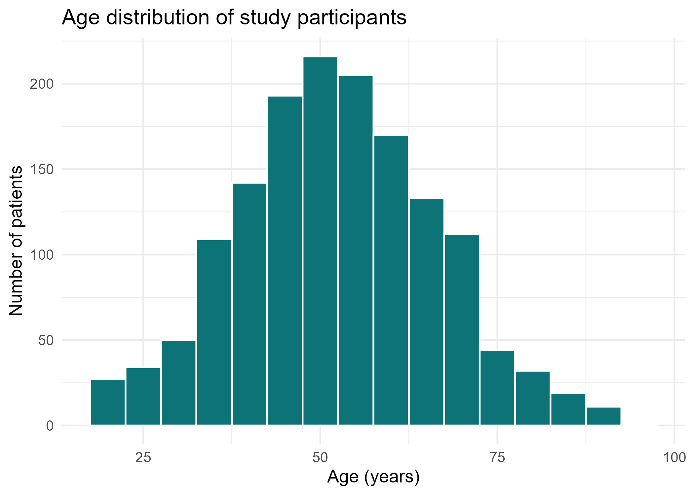
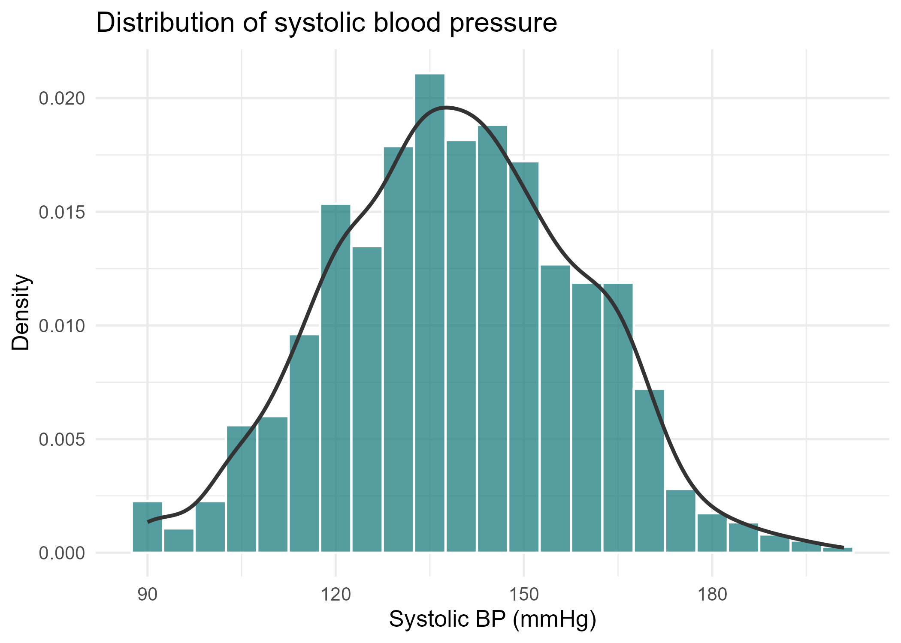
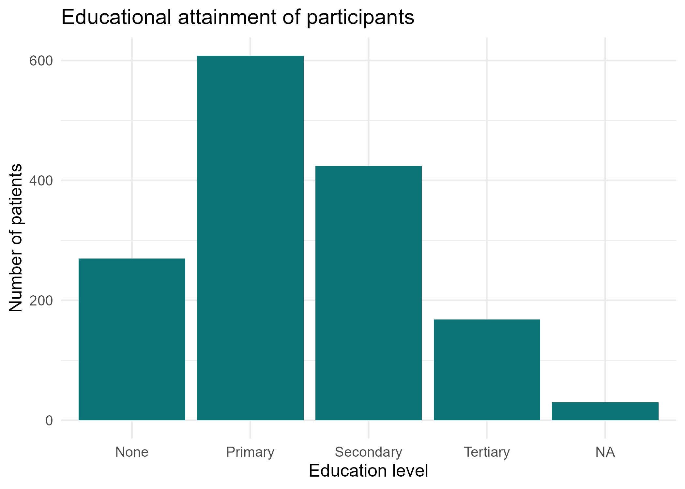
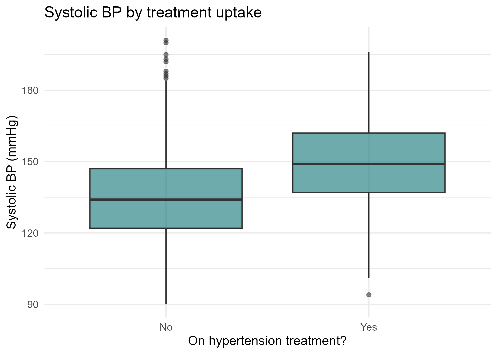
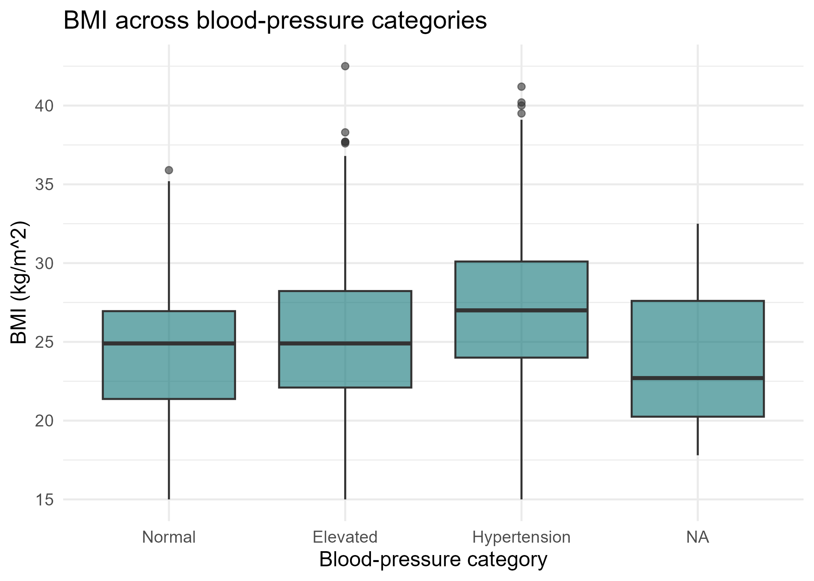
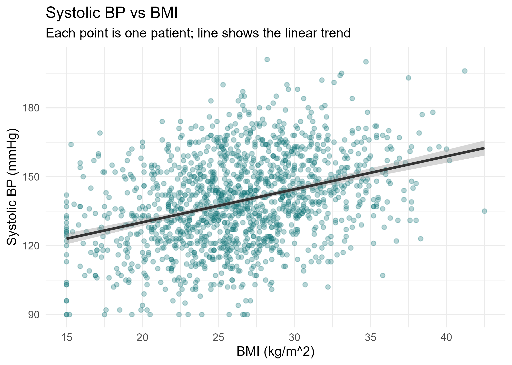

# Ngày 3: Thống kê mô tả, Bảng và Hình

## Kế hoạch

- Xu hướng trung tâm và độ phân tán
- Bảng tần số và bảng chéo
- Bảng 1 chất lượng xuất bản với gtsummary
- Lựa chọn và xây dựng hình
- Xuất kết quả có thể tái lập

::: {.notes}
Chào mừng đến với Ngày 3. Hôm nay chúng ta chuyển từ làm sạch dữ liệu sang mô tả dữ liệu.

Mục tiêu rất đơn giản: cho người đọc biết ai có trong nghiên cứu của chúng ta và họ trông như thế nào, bằng những con số và hình ảnh mà một tạp chí sẽ chấp nhận.

Điểm giảng dạy then chốt: thống kê mô tả đến TRƯỚC bất kỳ mô hình nào. Bạn không thể diễn giải một tỷ số chênh nếu trước tiên bạn không biết mẫu.

Bối cảnh lâm sàng: mọi thứ chúng ta xây dựng hôm nay đều đưa vào Bảng 1 và các hình của bản thảo về tiếp nhận điều trị tăng huyết áp.

Hỏi khán giả: bảng đầu tiên bạn nhìn thấy trong hầu hết mọi bài báo lâm sàng là gì? Câu trả lời mong đợi: đặc điểm nền, Bảng 1. Đó là đích đến của chúng ta.
:::

## Những gì chúng ta sẽ đạt được hôm nay

[Đến cuối buổi học này bạn sẽ có thể:]{.slide-intro}

- Tóm tắt một biến số bằng trung bình, trung vị, độ lệch chuẩn và khoảng tứ phân vị
- Tránh cái bẫy số một của người mới bắt đầu khiến kết quả trả về NA
- Xây dựng bảng tần số và bảng chéo
- Đọc đúng phần trăm theo hàng so với theo cột
- Tạo một Bảng 1 sẵn sàng cho bản thảo
- Chọn đúng biểu đồ cho từng loại biến
- Lưu hình ở 300 dpi để xuất bản

::: {.notes}
Slide này đặt ra kỳ vọng. Hãy đọc mỗi kết quả như một lời hứa.

Điểm giảng dạy then chốt: đây là những kỹ năng thực hành, thực chiến, không phải lý thuyết. Mọi người sẽ tạo một Bảng 1 trong bài tập.

Quan niệm sai phổ biến: rằng thống kê đòi hỏi toán học nặng nề. Hôm nay là về việc chọn và báo cáo bản tóm tắt phù hợp, đó là sự phán đoán, không phải đại số.

Mẹo trình diễn: hãy để mở kịch bản demo bên cạnh các slide để học viên thấy điểm trên slide rồi thấy mã chạy trực tiếp.

Câu hỏi gợi ý: bạn đã làm điều nào trong số này trong công việc hiện tại của mình? Mong đợi: hầu hết báo cáo trung bình và số đếm nhưng ít người dùng công cụ Bảng 1 có thể tái lập.
:::

## Cầu nối: tải lại dữ liệu sạch

[Luôn bắt đầu từ tệp sạch đã lưu, không bao giờ làm sạch lại bằng tay.]{.slide-intro}

```r
library(tidyverse)
library(gtsummary)

analysis_data <- readRDS("Data/analysis_data.rds")

glimpse(analysis_data)
nrow(analysis_data)
```

```{.text .code-output}
Rows: 1,500
Columns: 36
[1] 1500
```

::: {.code-note}
Tải lại kết quả của Ngày 2 đảm bảo Ngày 3, 4 và 5 đều dùng dữ liệu giống hệt nhau.
:::

::: {.notes}
Đây là một cầu nối ngắn từ Ngày 2. Chúng ta không lặp lại việc làm sạch; chúng ta đọc tệp đã sẵn sàng để phân tích.

Điểm giảng dạy then chốt: readRDS khôi phục chính xác đối tượng R, bao gồm các mức của factor và kiểu dữ liệu, những thứ mà một tệp CSV sẽ làm mất.

Lỗi thường gặp: nhập lại tệp thô 1.503 hàng và làm sạch lại bằng tay mỗi buổi, điều này âm thầm tạo ra khác biệt.

Diễn giải lâm sàng: khả năng tái lập nghĩa là một đồng tác giả hoặc người phản biện có thể chạy lại và nhận được cùng một Bảng 1.

Mẹo trình diễn: chạy glimpse và chỉ ra rằng các kiểu dữ liệu đã đúng, nên chúng ta có thể đi thẳng vào việc mô tả.
:::

## Xu hướng trung tâm: trung bình so với trung vị

:::: {.columns}
::: {.column width="50%"}
### Trung bình

- Số bình quân cộng
- Sử dụng mọi giá trị
- Bị kéo bởi các giá trị cực trị
- Tốt nhất cho dữ liệu đối xứng
:::
::: {.column width="50%"}
### Trung vị

- Giá trị ở giữa
- Một nửa ở trên, một nửa ở dưới
- Bền vững với giá trị ngoại lai
- Tốt nhất cho dữ liệu lệch
:::
::::

::: {.notes}
Xu hướng trung tâm trả lời: điểm giữa của dữ liệu ở đâu?

Điểm giảng dạy then chốt: trung bình và trung vị đồng thuận khi dữ liệu đối xứng và phân kỳ khi dữ liệu lệch.

Diễn giải lâm sàng: các biến lâm sàng bị lệch như khoảng cách đến cơ sở y tế, đường huyết lúc đói, và triglyceride có đuôi phải dài; một vài giá trị rất cao kéo trung bình lên, nên trung vị là bản tóm tắt công bằng hơn.

Quan niệm sai phổ biến: rằng trung bình luôn là bản tóm tắt đúng. Không phải vậy.

Câu hỏi gợi ý: nếu một bệnh nhân sống cách 200 km và những người còn lại trong vòng 5 km, bản tóm tắt nào mô tả một bệnh nhân điển hình? Câu trả lời mong đợi: trung vị.
:::

## Khi trung vị là bản tóm tắt trung thực

### Quy tắc kinh nghiệm

| Trung bình gần trung vị nghĩa là gần đối xứng: báo cáo trung bình (độ lệch chuẩn)
| Trung bình cao hơn nhiều so với trung vị nghĩa là lệch phải: báo cáo trung vị (khoảng tứ phân vị)

### Các biến lâm sàng lệch phải điển hình

| Khoảng cách đến cơ sở y tế, đường huyết lúc đói, triglyceride
| Thời gian nằm viện, chi phí, nồng độ dấu ấn sinh học

::: {.callout-note}
## Tại sao điều này quan trọng
Đối với huyết áp và BMI, trung bình thường nằm trên trung vị.

Một vài giá trị cao làm phồng trung bình, nên trung vị (khoảng tứ phân vị) an toàn hơn.
:::

::: {.notes}
Slide này biến lựa chọn trung bình-so với-trung vị thành một quy tắc quyết định mà học viên có thể áp dụng ngay tại chỗ.

Điểm giảng dạy then chốt: so sánh trung bình và trung vị trước, rồi quyết định báo cáo cái nào. Đừng mặc định chọn trung bình một cách mù quáng.

Diễn giải lâm sàng: trong nhóm thuần tập tăng huyết áp của chúng ta, huyết áp tâm thu và BMI lệch phải nhẹ; báo cáo trung vị với khoảng tứ phân vị tránh việc phóng đại giá trị điển hình.

Lỗi thường gặp: báo cáo trung bình (độ lệch chuẩn) cho một biến chi phí hoặc đường huyết rõ ràng bị lệch, điều này gây hiểu lầm cho người đọc.

Câu hỏi gợi ý: bạn sẽ kiểm tra độ lệch nhanh như thế nào? Câu trả lời mong đợi: so sánh trung bình và trung vị, hoặc nhìn vào một biểu đồ tần suất, điều chúng ta làm cuối ngày hôm nay.
:::

## Các thước đo độ phân tán

### Các giá trị phân tán như thế nào?

| Độ lệch chuẩn (SD): khoảng cách điển hình so với trung bình
| Khoảng tứ phân vị (IQR): phạm vi của 50 phần trăm ở giữa (Q3 trừ Q1)
| Phạm vi: từ nhỏ nhất đến lớn nhất, nhạy cảm với giá trị ngoại lai
| Phân vị: các điểm cắt như bản tóm tắt năm số

::: {.callout-tip}
## Ghép độ phân tán với trung tâm
Báo cáo độ lệch chuẩn cùng trung bình; báo cáo khoảng tứ phân vị cùng trung vị.
:::

::: {.notes}
Độ phân tán cho người đọc biết bệnh nhân khác nhau như thế nào, chứ không chỉ giá trị trung bình.

Điểm giảng dạy then chốt: luôn ghép một trung tâm với một độ phân tán tương ứng. Trung bình đi với độ lệch chuẩn, trung vị đi với khoảng tứ phân vị.

Diễn giải lâm sàng: hai nhóm có thể có cùng huyết áp tâm thu trung bình nhưng khác nhau rất nhiều về độ phân tán; độ lệch chuẩn hoặc khoảng tứ phân vị bộc lộ sự biến thiên đó.

Quan niệm sai phổ biến: rằng phạm vi là một bản tóm tắt tốt về độ phân tán. Nó bị chi phối hoàn toàn bởi hai bệnh nhân cực trị nhất, nên khoảng tứ phân vị thường được ưa chuộng hơn.

Câu hỏi gợi ý: khoảng tứ phân vị 20 mmHg của huyết áp tâm thu nghĩa là gì? Câu trả lời mong đợi: một nửa số bệnh nhân ở giữa trải dài trong một khoảng 20 mmHg.
:::

## Cái bẫy số một của người mới bắt đầu: na.rm

### Điều gì xảy ra

| Nếu một cột có BẤT KỲ giá trị khuyết nào, mean() và sd() trả về NA.
| R từ chối đoán; nó cho bạn biết câu trả lời là không xác định.

### Cách khắc phục

| Thêm na.rm = TRUE để bỏ qua các giá trị khuyết.
| mean(x, na.rm = TRUE) thay vì mean(x).

::: {.callout-important}
## Nguyên nhân phổ biến nhất của một NA bất ngờ
Một bản tóm tắt trả về NA -\> có một giá trị khuyết ẩn.

Điều đầu tiên cần kiểm tra: bạn đã đặt na.rm = TRUE chưa?
:::

::: {.notes}
Đây là nỗi bực bội phổ biến nhất đối với người dùng R mới, nên chúng ta dành cho nó một slide riêng.

Điểm giảng dạy then chốt: NA có tính lây lan. Một giá trị khuyết khiến toàn bộ bản tóm tắt thành NA trừ khi bạn bảo R bỏ qua các giá trị khuyết.

Lỗi thường gặp: giả định rằng dữ liệu bị hỏng trong khi thực ra na.rm chỉ đơn giản là bị bỏ sót.

Diễn giải lâm sàng: na.rm = TRUE thực hiện một bản tóm tắt trên các trường hợp đầy đủ cho biến đó; luôn ghi chú có bao nhiêu giá trị bị khuyết để người đọc biết mẫu số.

Mẹo trình diễn: trong demo trực tiếp, chạy mean(sbp) trước để cho thấy NA, rồi thêm na.rm = TRUE để cho thấy cách khắc phục. Cái trước-và-sau làm rõ điểm này.
:::

## Demo: xu hướng trung tâm và độ phân tán {.smaller}

[Cho thấy cái bẫy trước, rồi cách khắc phục, trên huyết áp tâm thu.]{.slide-intro}

```r
mean(analysis_data$sbp_mmhg)
mean(analysis_data$sbp_mmhg, na.rm = TRUE)

median(analysis_data$age, na.rm = TRUE)
sd(analysis_data$age, na.rm = TRUE)
IQR(analysis_data$age, na.rm = TRUE)
quantile(analysis_data$age,
         probs = c(0, .25, .5, .75, 1), na.rm = TRUE)
```

```{.text .code-output}
[1] NA
[1] 138.6
[1] 52
[1] 14.8
[1] 23
  0%  25%  50%  75% 100%
  18   42   52   65   89
```

::: {.code-note}
Dòng đầu tiên là NA có chủ đích; na.rm = TRUE tạo ra giá trị trung bình thực.
:::

::: {.notes}
Điều này phản chiếu phần 2 của kịch bản demo.

Điểm giảng dạy then chốt: NA đầu tiên là có chủ đích. Hãy dừng lại ở đó trước khi khắc phục.

Diễn giải lâm sàng: tuổi trung vị 52 với khoảng tứ phân vị 23 năm mô tả một quần thể chăm sóc ban đầu ở tuổi trung niên; các phân vị cho bản tóm tắt năm số trong một lệnh.

Lỗi thường gặp: gõ probs mà không có na.rm và lại nhận được NA trên toàn bộ.

Mẹo trình diễn: hỏi cả phòng dự đoán dòng đầu tiên trước khi bạn chạy nó. Câu trả lời mong đợi: NA, vì sbp có giá trị khuyết.
:::

## Demo: tóm tắt nhiều biến cùng một lúc

[summary() để xem nhanh, rồi một bảng gọn gàng theo nhóm với across().]{.slide-intro}

```r
analysis_data |>
  group_by(treatment_uptake) |>
  summarise(n = n(),
    across(c(age, bmi, sbp_mmhg, dbp_mmhg),
      list(mean = ~mean(.x, na.rm = TRUE),
           sd   = ~sd(.x,   na.rm = TRUE)),
      .names = "{.col}_{.fn}"),
    .groups = "drop")
```

```{.text .code-output}
treatment_uptake     n age_mean age_sd sbp_mmhg_mean
 No                 ...     50.1   14.6         136.2
 Yes                ...     54.7   14.1         141.8
```

::: {.code-note}
across() áp dụng cùng các hàm cho nhiều cột: không sao chép-dán, không lỗi gõ.
:::

::: {.notes}
Điều này phản chiếu phần 3 của demo. summary() là cách nhìn nhanh; bảng across() theo nhóm là phiên bản có thể tái sử dụng.

Điểm giảng dạy then chốt: across() áp dụng một bộ hàm cho nhiều cột cùng một lúc, và .names tạo ra các cột tự mô tả như age\_mean.

Diễn giải lâm sàng: bệnh nhân được điều trị ở đây có tuổi và huyết áp tâm thu trung bình cao hơn, một gợi ý ban đầu rằng những bệnh nhân lớn tuổi hơn, bệnh nặng hơn là những người được bắt đầu điều trị. Chúng ta xác nhận điều này một cách chính thức trong Bảng 1.

Lỗi thường gặp: quên .groups = drop và ngạc nhiên khi kết quả vẫn còn được nhóm.

Câu hỏi gợi ý: tại sao nhóm theo treatment\_uptake? Câu trả lời mong đợi: đó là kết cục chính của chúng ta, nên chúng ta so sánh hai nhóm.
:::

## Bảng tần số cho biến phân loại

### Ba công cụ, hãy biết cả ba

| table() cho số đếm thô
| prop.table() chuyển số đếm thành tỷ lệ
| count() trả về một data frame gọn gàng bạn có thể chuyển tiếp qua pipe

::: {.callout-warning}
## table() giấu các giá trị khuyết
Mặc định table() âm thầm loại bỏ các NA, nên phần trăm có thể gây hiểu lầm.

Dùng table(x, useNA = "ifany") để làm cho các giá trị khuyết hiển thị.
:::

::: {.notes}
Các biến phân loại như giới tính, học vấn và bp\_category được mô tả bằng số đếm và phần trăm.

Điểm giảng dạy then chốt: số đếm trả lời bao nhiêu, tỷ lệ trả lời chiếm bao nhiêu phần. Báo cáo cả hai.

Lỗi thường gặp: table() âm thầm loại bỏ các NA, nên phần trăm được tính trên một mẫu số nhỏ hơn so với người đọc giả định. useNA = ifany khắc phục điều này.

Diễn giải lâm sàng: một phần trăm chỉ có ý nghĩa nếu bạn biết mẫu số; luôn nêu rõ n.

Câu hỏi gợi ý: nếu 40 trong 50 bệnh nhân không khuyết là nữ nhưng có 10 giá trị giới tính bị khuyết, phần trăm nữ là bao nhiêu? Câu trả lời mong đợi: điều đó phụ thuộc vào việc bạn có tính các giá trị khuyết hay không, đó là lý do tại sao chúng ta làm cho chúng hiển thị.
:::

## Demo: bảng tần số {.smaller}

[Số đếm, phần trăm, và bản tương đương gọn gàng.]{.slide-intro}

```r
table(analysis_data$sex)
round(100 * prop.table(table(analysis_data$sex)), 1)

table(analysis_data$education, useNA = "ifany")

analysis_data |>
  count(bp_category) |>
  mutate(percent = round(100 * n / sum(n), 1))
```

```{.text .code-output}
Female   Male
   810    690

Female   Male
  54.0   46.0

# bp_category percentages printed as a tidy tibble
```

::: {.code-note}
count() cộng với mutate() cho một bảng gọn gàng sẵn sàng cho báo cáo hoặc biểu đồ.
:::

::: {.notes}
Điều này phản chiếu phần 4 của demo.

Điểm giảng dạy then chốt: prop.table trên một table cho các tỷ lệ; nhân với 100 và làm tròn để có phần trăm dễ đọc.

Diễn giải lâm sàng: một tỷ lệ nữ trên nam 54 trên 46 phần trăm là điển hình của một mẫu khám chăm sóc ban đầu.

Lỗi thường gặp: quên useNA = ifany trên education và báo cáo thiếu về sự khuyết thiếu.

Mẹo trình diễn: cho thấy kết quả của count() là một tibble bạn có thể chuyển qua pipe vào ggplot, không như kết quả của table() cơ bản.
:::

## Bảng chéo: kết cục so với yếu tố dự báo {.smaller}

### Một bảng hai chiều

| table(treatment\_uptake, diabetes) đếm mọi tổ hợp
| Hàng là tiếp nhận điều trị, cột là tình trạng đái tháo đường

### Đối số margin chọn loại phần trăm

| margin = 1 cho phần trăm theo HÀNG (mỗi hàng cộng lại thành 100)
| margin = 2 cho phần trăm theo CỘT (mỗi cột cộng lại thành 100)
| không có margin cho phần trăm của tổng số chung

::: {.callout-note}
## Khớp phần trăm với câu hỏi
Tỷ lệ người đái tháo đường đang điều trị -\> phần trăm theo cột.

Tỷ lệ người được điều trị là người đái tháo đường -\> phần trăm theo hàng.
:::

::: {.notes}
Bảng chéo là cách chúng ta liên hệ kết cục với một yếu tố dự báo phân loại trước bất kỳ mô hình hóa nào.

Điểm giảng dạy then chốt: đối số margin quyết định mẫu số, và mẫu số thay đổi hoàn toàn ý nghĩa.

Diễn giải lâm sàng: chọn phần trăm trả lời câu hỏi lâm sàng của bạn. Báo cáo sai margin là một trong những lỗi phổ biến nhất trong các bản thảo.

Lỗi thường gặp: đọc một phần trăm theo hàng như thể nó là một phần trăm theo cột.

Câu hỏi gợi ý: tỷ lệ người đái tháo đường đang điều trị dùng margin nào? Câu trả lời mong đợi: phần trăm theo cột, margin = 2.
:::

## Demo: bảng chéo với phần trăm

[Cùng các số đếm, theo hai cách, kèm diễn giải.]{.slide-intro}

```r
xtab <- table(analysis_data$treatment_uptake,
              analysis_data$diabetes)
xtab

round(100 * prop.table(xtab, margin = 1), 1)
round(100 * prop.table(xtab, margin = 2), 1)
```

```{.text .code-output}
       No  Yes
  No  610  120
  Yes 430  340

# margin=1 row %: of treated, share diabetic
# margin=2 col %: of diabetics, share treated
```

::: {.code-note}
Cùng một bảng, hai câu chuyện: chọn margin trả lời câu hỏi của bạn.
:::

::: {.notes}
Điều này phản chiếu phần 5 của demo.

Điểm giảng dạy then chốt: lưu bảng vào một đối tượng một lần, rồi lấy tỷ lệ theo hai cách từ đó.

Diễn giải lâm sàng: với margin = 2 bạn có thể nói tỷ lệ người đái tháo đường đang điều trị là bao nhiêu, hỗ trợ cho phát hiện sau này rằng đái tháo đường liên quan mạnh với sự tiếp nhận, tỷ số chênh hiệu chỉnh khoảng 3.56.

Lỗi thường gặp: tính lại bảng hai lần thay vì tái sử dụng xtab.

Câu hỏi gợi ý: margin nào hỗ trợ câu trong số người đái tháo đường, X phần trăm đã nhận điều trị? Câu trả lời mong đợi: phần trăm theo cột, margin = 2.
:::

## Bảng 1 là gì?

### Bảng mở đầu của hầu hết mọi bài báo lâm sàng

| Đặc điểm nền của mẫu nghiên cứu
| Thường được chia thành các cột theo phơi nhiễm hoặc kết cục chính
| Biến số hiển thị dưới dạng trung bình (độ lệch chuẩn) hoặc trung vị (khoảng tứ phân vị)
| Biến phân loại hiển thị dưới dạng n (phần trăm)

::: {.callout-note}
## Tại sao người phản biện mong đợi bảng này
Nó cho phép người đọc đánh giá nghiên cứu mô tả về ai.

Nó cho thấy các nhóm so sánh có cân bằng hay không.
:::

::: {.notes}
Bảng 1 là đích đến cho mọi thứ chúng ta học hôm nay; nó gom xu hướng trung tâm, độ phân tán và tần số vào một đối tượng có thể xuất bản.

Điểm giảng dạy then chốt: Bảng 1 mô tả mẫu; nó có tính mô tả, không phải một kiểm định nhân quả, ngay cả khi nó mang theo giá trị p.

Diễn giải lâm sàng: chia theo treatment\_uptake cho phép người phản biện thấy bệnh nhân được điều trị và không điều trị khác nhau như thế nào tại thời điểm nền.

Quan niệm sai phổ biến: rằng một giá trị p nhỏ trong Bảng 1 chứng minh một tác động. Nó chỉ đánh dấu một khác biệt tại thời điểm nền.

Câu hỏi gợi ý: tại sao chúng ta báo cáo trung vị (khoảng tứ phân vị) cho một số hàng và trung bình (độ lệch chuẩn) cho những hàng khác? Câu trả lời mong đợi: các biến bị lệch nhận trung vị.
:::

## Demo: xây dựng Bảng 1 với gtsummary {.smaller}

[tbl\_summary chọn các bản tóm tắt hợp lý một cách tự động.]{.slide-intro}

```r
analysis_data |>
  select(age, sex, residence, education, bmi,
         diabetes, sbp_mmhg, bp_category,
         treatment_uptake) |>
  tbl_summary(by = treatment_uptake,
              missing_text = "(Missing)") |>
  add_p() |>
  add_overall() |>
  bold_labels()
```

```{.text .code-output}
Characteristic   Overall   No   Yes   p-value
Age (years)      52 ...    ...  ...   <0.001
Diabetes, n (%)  ...       ...  ...    0.002
... one row per selected variable ...
```

::: {.code-note}
add\_p() thêm giá trị p; add\_overall() thêm một cột tổng.
:::

::: {.notes}
Điều này phản chiếu phần 6 của demo và là sản phẩm cốt lõi của ngày hôm nay.

Điểm giảng dạy then chốt: tbl\_summary tự động chọn trung bình (độ lệch chuẩn) hoặc trung vị (khoảng tứ phân vị) cho biến số và n (phần trăm) cho biến phân loại, và gắn nhãn dữ liệu khuyết cho bạn.

Diễn giải lâm sàng: cột giá trị p đánh dấu sự mất cân bằng nền giữa bệnh nhân được điều trị và không điều trị; các khác biệt có ý nghĩa về tuổi và đái tháo đường báo trước kết quả hồi quy.

Lỗi thường gặp: quên library(gtsummary), hoặc mong đợi tbl\_summary khớp một mô hình. Nó chỉ mô tả.

Mẹo trình diễn: cho thấy bảng được kết xuất trong Viewer, rồi đề cập as\_flex\_table để xuất sang Word.
:::

## Chọn đúng biểu đồ

### Hãy để loại biến quyết định biểu đồ

| Một biến liên tục -\> biểu đồ tần suất (hình dạng và độ lệch)
| Biến liên tục theo một nhóm -\> biểu đồ hộp (so sánh các phân phối)
| Một biến phân loại -\> biểu đồ cột (số đếm)
| Hai biến liên tục -\> biểu đồ phân tán (mối quan hệ)

::: {.callout-tip}
## Mỗi hình cần
Một tiêu đề rõ ràng và nhãn trục KÈM đơn vị.

Một chủ đề gọn gàng; chúng ta dùng theme\_minimal với điểm nhấn màu xanh mòng két.
:::

::: {.notes}
Trước khi vẽ bất cứ thứ gì, hãy khớp biểu đồ với loại biến. Thói quen đơn lẻ này ngăn chặn hầu hết các hình xấu.

Điểm giảng dạy then chốt: biểu đồ tần suất bộc lộ hình dạng và độ lệch; biểu đồ hộp so sánh các nhóm; biểu đồ cột đếm các phân loại; biểu đồ phân tán cho thấy mối quan hệ.

Lỗi thường gặp: dùng biểu đồ cột của giá trị trung bình theo nhóm thay vì biểu đồ hộp, điều này che giấu độ phân tán và các giá trị ngoại lai.

Diễn giải lâm sàng: một biểu đồ tần suất của huyết áp tâm thu cho bạn biết ngay lập tức nên tóm tắt nó bằng trung bình hay trung vị.

Câu hỏi gợi ý: biểu đồ nào so sánh BMI giữa các nhóm huyết áp? Câu trả lời mong đợi: một biểu đồ hộp.
:::

## Biểu đồ tần suất: phân phối tuổi

:::: {.columns}
::: {.column width="38%"}
### Cách đọc biểu đồ

- Mỗi cột đếm số bệnh nhân trong một dải 5 năm
- Đỉnh cho thấy khoảng tuổi phổ biến nhất
- Một hình dạng gần đối xứng ủng hộ trung bình (độ lệch chuẩn)
- Tìm một đuôi dài có thể báo hiệu độ lệch
:::
::: {.column width="62%"}
{width=100%}
:::
::::

::: {.notes}
Đây là hình thực được tạo bởi ggsave trong demo, phần 7a.

Điểm giảng dạy then chốt: một biểu đồ tần suất trả lời hai câu hỏi cùng một lúc: trung tâm ở đâu, và phân phối có bị lệch không?

Diễn giải lâm sàng: mẫu tập trung ở tuổi trung niên, phù hợp với một quần thể chăm sóc ban đầu tăng huyết áp; sự gần đối xứng biện minh cho việc báo cáo tuổi trung bình.

Lỗi thường gặp: chọn độ rộng cột (binwidth) rộng đến mức hình dạng biến mất hoặc hẹp đến mức trông nhiễu. Ở đây binwidth là 5 năm.

Câu hỏi gợi ý: từ hình dạng này, trung bình hay trung vị cho tuổi? Câu trả lời mong đợi: cả hai đều được vì nó gần đối xứng.
:::

## Biểu đồ tần suất: huyết áp tâm thu

:::: {.columns}
::: {.column width="38%"}
### Cách đọc biểu đồ

- Đường cong phủ lên là một mật độ đã được làm mượt
- Một đuôi về bên phải cho thấy lệch phải
- Khi lệch, hãy ưu tiên trung vị (khoảng tứ phân vị) hơn trung bình (độ lệch chuẩn)
- Phần lớn nằm trong khoảng tăng huyết áp
:::
::: {.column width="62%"}
{width=100%}
:::
::::

::: {.notes}
Hình thực từ demo phần 7b, với một đường cong mật độ phủ lên biểu đồ tần suất.

Điểm giảng dạy then chốt: lớp phủ mật độ làm mượt các cột để dễ thấy hình dạng, và bất kỳ độ lệch phải nào.

Diễn giải lâm sàng: huyết áp tâm thu cho thấy một đuôi phải của các chỉ số cao, nên trung vị (khoảng tứ phân vị) là bản tóm tắt an toàn hơn; đây là bằng chứng trực quan đằng sau quy tắc kinh nghiệm đã nêu trước đó.

Lỗi thường gặp: quên aes(y = after\_stat(density)) nên biểu đồ tần suất và mật độ ở các thang đo khác nhau và đường cong trông phẳng.

Câu hỏi gợi ý: đuôi phải có ý nghĩa lâm sàng gì? Câu trả lời mong đợi: một nhóm nhỏ bệnh nhân có huyết áp tăng cao rõ rệt.
:::

## Biểu đồ cột: trình độ học vấn

:::: {.columns}
::: {.column width="38%"}
### Cách đọc biểu đồ

- Chiều cao cột là số bệnh nhân mỗi mức
- geom\_bar đếm các phân loại cho bạn
- So sánh chiều cao cột, không phải diện tích
- Một đường gốc tại số không giữ cho các so sánh trung thực
:::
::: {.column width="62%"}
{width=100%}
:::
::::

::: {.notes}
Hình thực từ demo phần 7c.

Điểm giảng dạy then chốt: geom\_bar tự đếm các phân loại, nên bạn không cần tóm tắt trước dữ liệu.

Diễn giải lâm sàng: phân phối học vấn quan trọng vì học vấn cao hơn cho thấy một xu hướng tiếp nhận điều trị nhiều hơn, tỷ số chênh hiệu chỉnh khoảng 1.96; biểu đồ cột cho thấy có bao nhiêu bệnh nhân ở mỗi mức.

Lỗi thường gặp: tổng hợp trước rồi dùng geom\_bar, điều này đếm trùng; chỉ dùng geom\_col khi bạn đã có sẵn số đếm.

Câu hỏi gợi ý: tại sao trục y phải bắt đầu từ số không? Câu trả lời mong đợi: một trục bị cắt ngắn phóng đại các khác biệt giữa các cột.
:::

## Biểu đồ hộp: huyết áp tâm thu theo tiếp nhận điều trị

:::: {.columns}
::: {.column width="38%"}
### Cách đọc biểu đồ

- Hộp trải dài theo khoảng tứ phân vị; đường kẻ là trung vị
- Râu vươn tới phần lớn dữ liệu; các chấm là giá trị ngoại lai
- So sánh hai trung vị cạnh nhau
- Huyết áp tâm thu cao hơn ở nhóm được điều trị gợi ý bệnh nhân bệnh nặng hơn
:::
::: {.column width="62%"}
{width=100%}
:::
::::

::: {.notes}
Hình thực từ demo phần 7d.

Điểm giảng dạy then chốt: một biểu đồ hộp nén cả một phân phối thành năm số cho mỗi nhóm, lý tưởng để so sánh bệnh nhân được điều trị và không điều trị.

Diễn giải lâm sàng: nếu nhóm được điều trị nằm cao hơn, điều đó gợi ý điều trị được bắt đầu ở những bệnh nhân có huyết áp tệ hơn, khớp với huyết áp tâm thu trung bình cao hơn mà chúng ta đã thấy trong bản tóm tắt theo nhóm.

Lỗi thường gặp: quên na.rm = TRUE, khiến ggplot loại bỏ các hàng kèm một cảnh báo.

Câu hỏi gợi ý: các chấm nằm ngoài râu đại diện cho điều gì? Câu trả lời mong đợi: những bệnh nhân ngoại lai, không phải lỗi để tự động xóa.
:::

## Biểu đồ hộp: BMI theo nhóm huyết áp

:::: {.columns}
::: {.column width="38%"}
### Cách đọc biểu đồ

- Một hộp cho mỗi nhóm huyết áp
- Một trung vị tăng dần qua các nhóm gợi ý một gradient
- Chiều rộng hộp ở đây phản ánh kiểu định dạng, không phải cỡ nhóm
- Giá trị ngoại lai đánh dấu BMI cao hoặc thấp bất thường
:::
::: {.column width="62%"}
{width=100%}
:::
::::

::: {.notes}
Hình thực từ demo phần 7e.

Điểm giảng dạy then chốt: biểu đồ hộp qua một biến phân loại có thứ tự bộc lộ một gradient kiểu liều-đáp ứng trong nháy mắt.

Diễn giải lâm sàng: nếu BMI trung vị tăng từ nhóm bình thường đến nhóm tăng huyết áp, điều đó nhất quán với béo phì như một yếu tố nguy cơ tăng huyết áp.

Lỗi thường gặp: đọc chiều rộng hộp như cỡ mẫu; theo mặc định thì không phải vậy. Dùng varwidth = TRUE nếu bạn muốn điều đó.

Câu hỏi gợi ý: điều này có chứng minh béo phì gây tăng huyết áp không? Câu trả lời mong đợi: không, nó cho thấy mối liên quan qua các nhóm, không phải nhân quả.
:::

## Biểu đồ phân tán: huyết áp tâm thu so với BMI

:::: {.columns}
::: {.column width="38%"}
### Cách đọc biểu đồ

- Mỗi điểm là một bệnh nhân
- Đường kẻ là một xu hướng tuyến tính đã khớp
- Độ dốc đi lên nghĩa là BMI cao hơn đi cùng huyết áp tâm thu cao hơn
- Sự phân tán quanh đường kẻ cho thấy nó không mang tính tất định
:::
::: {.column width="62%"}
{width=100%}
:::
::::

::: {.notes}
Hình thực từ demo phần 7f.

Điểm giảng dạy then chốt: một biểu đồ phân tán là biểu đồ đúng cho hai biến liên tục, và geom\_smooth(method = lm) thêm đường xu hướng.

Diễn giải lâm sàng: một độ dốc đi lên gợi ý BMI cao hơn đi kèm huyết áp tâm thu cao hơn, nhất quán với béo phì như một yếu tố nguy cơ. Đây là mối liên quan, không phải bằng chứng về nhân quả.

Lỗi thường gặp: vẽ chồng chất đến mức đám mây đặc kín; chúng ta dùng độ trong suốt alpha = 0.3 để mật độ hiển thị được.

Câu hỏi gợi ý: một đường kẻ rõ ràng có nghĩa là BMI gây huyết áp cao không? Câu trả lời mong đợi: không, các yếu tố gây nhiễu có thể chi phối cả hai; cần một mô hình.
:::

## Demo: xây dựng và lưu một hình

[Một ggplot, rồi lưu nó ở chất lượng xuất bản.]{.slide-intro}

```r
p_age <- ggplot(analysis_data, aes(x = age)) +
  geom_histogram(binwidth = 5, fill = "#0D7377",
                 colour = "white") +
  labs(title = "Age distribution",
       x = "Age (years)", y = "Number of patients") +
  theme_minimal(base_size = 13)

ggsave("Resources/day3_hist_age.png", plot = p_age,
       width = 7, height = 5, dpi = 300)
```

::: {.code-note}
dpi = 300 là chuẩn mà các tạp chí mong đợi cho hình raster.
:::

::: {.notes}
Điều này phản chiếu mẫu xây dựng hình trong demo phần 7.

Điểm giảng dạy then chốt: xây dựng biểu đồ như một đối tượng, rồi ggsave đối tượng đó để tệp được lưu khớp với những gì bạn đã xem trên màn hình.

Diễn giải lâm sàng: 300 dpi đảm bảo hình vẫn sắc nét khi in; nhãn trục mang theo đơn vị nên hình tự giải thích được.

Lỗi thường gặp: dựa vào ggsave mà không có đối số plot, điều này lưu biểu đồ được in cuối cùng và có thể lấy nhầm biểu đồ.

Mẹo trình diễn: mở tệp PNG đã lưu từ thư mục Resources để học viên thấy tệp kết quả thực.
:::

## Xuất kết quả có thể tái lập

### Chia sẻ kết quả ngoài R

| write\_csv() gửi một bảng tóm tắt cho các đồng tác giả không dùng R
| ggsave(..., dpi = 300) ghi một hình sẵn sàng cho xuất bản
| gtsummary xuất sang Word qua as\_flex\_table và save\_as\_docx

::: {.callout-tip}
## Có thể tái lập từ thiết kế
Lưu kết quả vào một thư mục, không phải bằng sao chép-dán.

Chạy lại kịch bản sẽ tái tạo mọi bảng và hình.
:::

::: {.notes}
Điều này phản chiếu demo phần 8 cộng với các chú thích xuất của gtsummary.

Điểm giảng dạy then chốt: kết quả nên được tạo ra bằng mã vào một thư mục, không bao giờ lắp ráp bằng tay, để chúng tái tạo giống hệt nhau mỗi lần.

Diễn giải lâm sàng: một người phản biện yêu cầu một n đã sửa có thể được đáp ứng bằng cách chạy lại một kịch bản, không phải chỉnh sửa lại một bảng Word từng ô một.

Lỗi thường gặp: dán các con số từ console vào bản thảo, điều này bị hỏng khi dữ liệu cập nhật.

Câu hỏi gợi ý: các hình và bảng của chúng ta được đưa vào đâu? Câu trả lời mong đợi: thư mục Resources, được ghi bởi ggsave và write\_csv.
:::

## Bài tập Ngày 3: tạo Bảng 1 cho một bản thảo {.smaller}

### Nhiệm vụ của bạn

| 1. readRDS dữ liệu phân tích đã làm sạch
| 2. Xây dựng một Bảng 1 với tbl\_summary(by = treatment\_uptake)
| 3. Thêm giá trị p và một cột tổng
| 4. Tạo một biểu đồ tần suất và một biểu đồ hộp, rồi ggsave cả hai ở 300 dpi

### Kết quả mong đợi

| Một bảng đặc điểm nền chia theo tiếp nhận điều trị
| Hai hình PNG đã lưu trong thư mục Resources

::: {.callout-tip}
## Nếu bạn bị bí
Tái sử dụng mã demo; chỉ thay đổi tên các biến.
:::

::: {.notes}
Đây là phần củng cố thực hành của cả ngày.

Điểm giảng dạy then chốt: bài tập tái tạo các sản phẩm của bản thảo: một Bảng 1 và ít nhất hai hình.

Diễn giải lâm sàng: khuyến khích học viên viết một câu diễn giải Bảng 1 của họ, ví dụ nhóm nào khác nhau tại thời điểm nền.

Lỗi thường gặp: quên na.rm hoặc library(gtsummary); nhắc họ trước khi họ bắt đầu.

Mẹo trình diễn: đi vòng quanh khi học viên làm việc; trở ngại phổ biến nhất là một gói chưa được tải hoặc một lỗi gõ trong tên biến. Kết quả mong đợi là một bảng được kết xuất cộng với hai tệp PNG trong Resources.
:::

## Tóm tắt và cầu nối sang Ngày 4

[Những gì chúng ta đã khắc sâu hôm nay, và nơi chúng ta đi tiếp:]{.slide-intro}

- Luôn dùng na.rm = TRUE; đó là cái bẫy số một
- Chọn trung vị (khoảng tứ phân vị) cho các biến lâm sàng bị lệch
- Chọn margin của prop.table khớp với câu hỏi của bạn
- gtsummary biến dữ liệu thô thành một Bảng 1 trong vài dòng
- Khớp biểu đồ với loại biến, và lưu ở 300 dpi
- Ngày 4: từ mô tả sang kiểm định, hồi quy và tỷ số chênh

::: {.notes}
Khép lại vòng lặp và chuẩn bị cho Ngày 4.

Điểm giảng dạy then chốt: hôm nay là mô tả; ngày mai là suy luận. Bảng 1 cho chúng ta biết các nhóm khác nhau, nhưng không cho biết các khác biệt có độc lập hay không.

Diễn giải lâm sàng: Ngày 4 khớp hồi quy logistic cho tiếp nhận điều trị, nơi chúng ta sẽ diễn giải các tỷ số chênh hiệu chỉnh như đái tháo đường 3.56 và bảo hiểm y tế 2.05.

Quan niệm sai phổ biến: rằng một giá trị p nền đã trả lời câu hỏi nghiên cứu. Không phải vậy; cần hiệu chỉnh.

Câu hỏi gợi ý: tại sao vượt ra ngoài Bảng 1? Câu trả lời mong đợi: để hiệu chỉnh cho các yếu tố gây nhiễu và ước lượng các tác động độc lập, đó là Ngày 4.
:::
